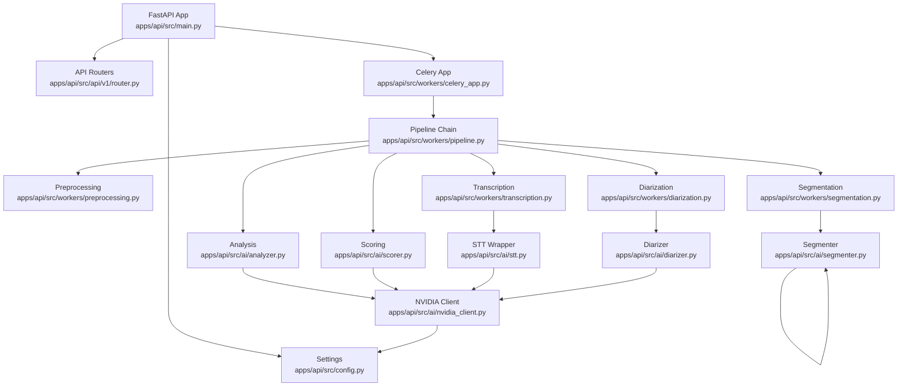
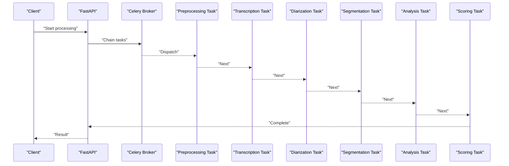
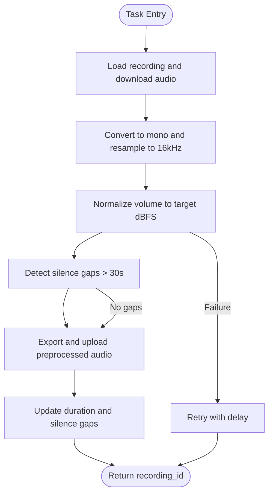
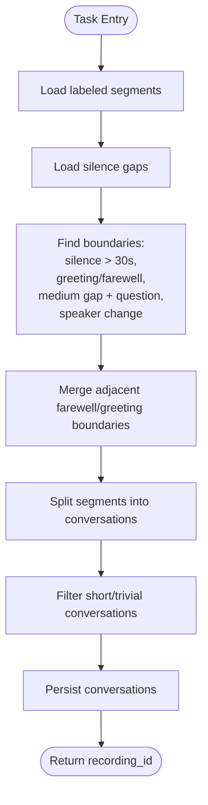
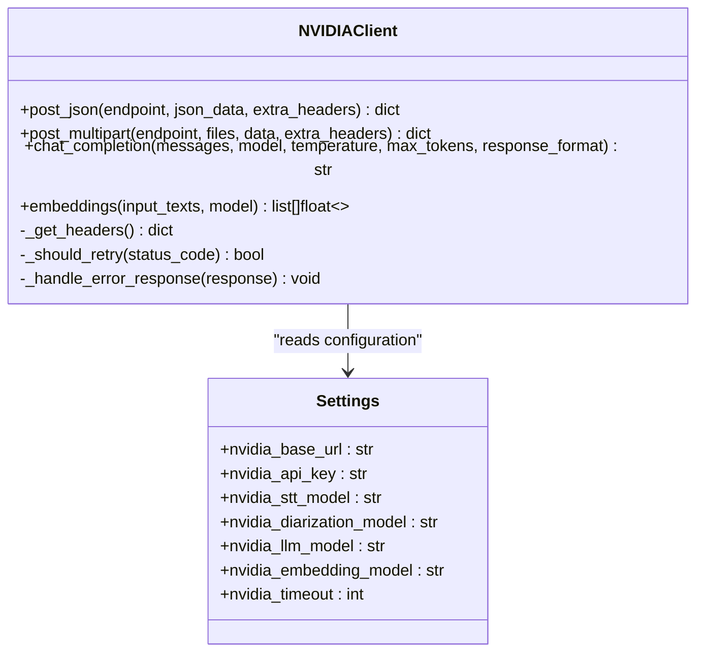
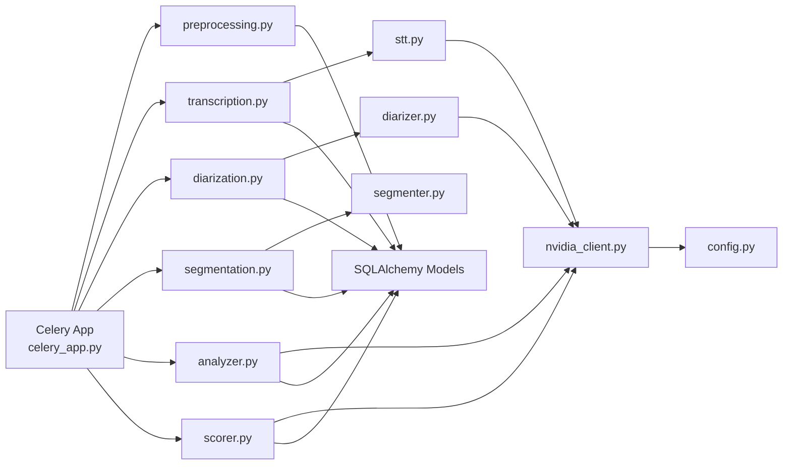
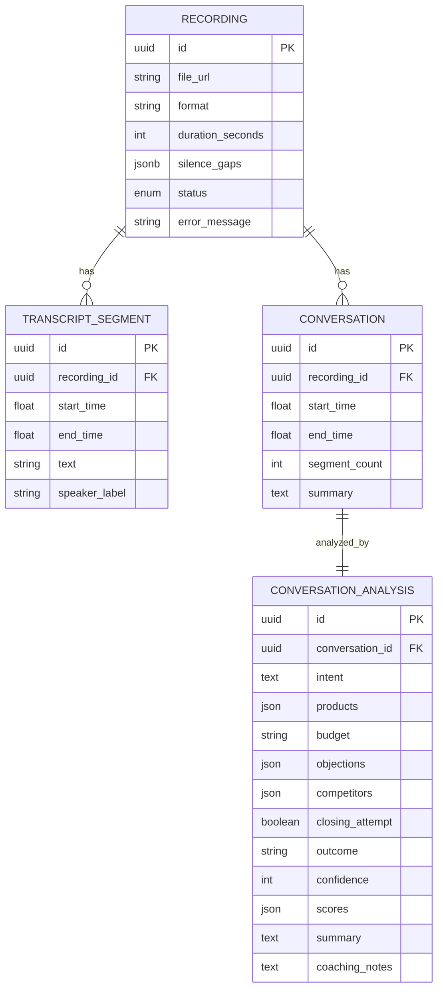

# AI Processing Pipeline

<cite>
**Referenced Files in This Document**
- [apps/api/src/main.py](file://apps/api/src/main.py)
- [apps/api/src/config.py](file://apps/api/src/config.py)
- [apps/api/src/workers/celery_app.py](file://apps/api/src/workers/celery_app.py)
- [apps/api/src/workers/pipeline.py](file://apps/api/src/workers/pipeline.py)
- [apps/api/src/ai/nvidia_client.py](file://apps/api/src/ai/nvidia_client.py)
- [apps/api/src/workers/preprocessing.py](file://apps/api/src/workers/preprocessing.py)
- [apps/api/src/ai/stt.py](file://apps/api/src/ai/stt.py)
- [apps/api/src/workers/transcription.py](file://apps/api/src/workers/transcription.py)
- [apps/api/src/ai/diarizer.py](file://apps/api/src/ai/diarizer.py)
- [apps/api/src/workers/diarization.py](file://apps/api/src/workers/diarization.py)
- [apps/api/src/ai/segmenter.py](file://apps/api/src/ai/segmenter.py)
- [apps/api/src/workers/segmentation.py](file://apps/api/src/workers/segmentation.py)
- [apps/api/src/ai/analyzer.py](file://apps/api/src/ai/analyzer.py)
- [apps/api/src/ai/scorer.py](file://apps/api/src/ai/scorer.py)
- [apps/api/src/models/conversation.py](file://apps/api/src/models/conversation.py)
</cite>

## Table of Contents
1. [Introduction](#introduction)
2. [Project Structure](#project-structure)
3. [Core Components](#core-components)
4. [Architecture Overview](#architecture-overview)
5. [Detailed Component Analysis](#detailed-component-analysis)
6. [Dependency Analysis](#dependency-analysis)
7. [Performance Considerations](#performance-considerations)
8. [Troubleshooting Guide](#troubleshooting-guide)
9. [Conclusion](#conclusion)
10. [Appendices](#appendices)

## Introduction
This document describes the Xsamaa AI Processing Pipeline that transforms raw audio recordings into structured insights for sales coaching. The pipeline is orchestrated by Celery tasks and integrates with NVIDIA NIM APIs for speech-to-text (STT), speaker diarization, and large language model (LLM) analysis and scoring. It follows a strict multi-stage workflow: audio preprocessing, transcription, diarization, conversation segmentation, LLM-powered analysis, and performance scoring. The document explains each stage’s purpose, inputs/outputs, integration patterns, and operational characteristics such as retries, timeouts, and error handling.

## Project Structure
The pipeline is implemented in a FastAPI application with a dedicated Celery worker subsystem. Key areas:
- API entrypoint and routing
- Configuration for environment, storage, and NVIDIA NIM
- Celery app definition and task orchestration
- Worker modules implementing each pipeline stage
- AI modules wrapping NVIDIA NIM clients and domain logic
- SQLAlchemy models for persisted results



**Diagram sources**
- [apps/api/src/main.py:1-29](file://apps/api/src/main.py#L1-L29)
- [apps/api/src/config.py:1-52](file://apps/api/src/config.py#L1-L52)
- [apps/api/src/workers/celery_app.py:1-31](file://apps/api/src/workers/celery_app.py#L1-L31)
- [apps/api/src/workers/pipeline.py:1-35](file://apps/api/src/workers/pipeline.py#L1-L35)
- [apps/api/src/workers/preprocessing.py:1-206](file://apps/api/src/workers/preprocessing.py#L1-L206)
- [apps/api/src/workers/transcription.py:1-146](file://apps/api/src/workers/transcription.py#L1-L146)
- [apps/api/src/workers/diarization.py:1-119](file://apps/api/src/workers/diarization.py#L1-L119)
- [apps/api/src/workers/segmentation.py:1-146](file://apps/api/src/workers/segmentation.py#L1-L146)
- [apps/api/src/ai/analyzer.py:1-198](file://apps/api/src/ai/analyzer.py#L1-L198)
- [apps/api/src/ai/scorer.py:1-217](file://apps/api/src/ai/scorer.py#L1-L217)
- [apps/api/src/ai/stt.py:1-86](file://apps/api/src/ai/stt.py#L1-L86)
- [apps/api/src/ai/diarizer.py:1-206](file://apps/api/src/ai/diarizer.py#L1-L206)
- [apps/api/src/ai/segmenter.py:1-366](file://apps/api/src/ai/segmenter.py#L1-L366)
- [apps/api/src/ai/nvidia_client.py:1-274](file://apps/api/src/ai/nvidia_client.py#L1-L274)

**Section sources**
- [apps/api/src/main.py:1-29](file://apps/api/src/main.py#L1-L29)
- [apps/api/src/config.py:1-52](file://apps/api/src/config.py#L1-L52)

## Core Components
- FastAPI application with CORS and health endpoint
- Celery app configured with Redis as broker/backend and task serialization
- Pipeline orchestrator that chains preprocessing, transcription, diarization, segmentation, analysis, and scoring
- AI wrappers for NVIDIA NIM STT, diarization, chat completions, and embeddings
- Workers implementing each stage with robust retry and status update logic
- SQLAlchemy models for conversations, transcripts, and analysis/scores

**Section sources**
- [apps/api/src/main.py:1-29](file://apps/api/src/main.py#L1-L29)
- [apps/api/src/workers/celery_app.py:1-31](file://apps/api/src/workers/celery_app.py#L1-L31)
- [apps/api/src/workers/pipeline.py:1-35](file://apps/api/src/workers/pipeline.py#L1-L35)
- [apps/api/src/ai/nvidia_client.py:1-274](file://apps/api/src/ai/nvidia_client.py#L1-L274)
- [apps/api/src/models/conversation.py:1-61](file://apps/api/src/models/conversation.py#L1-L61)

## Architecture Overview
The pipeline is a long-running asynchronous workflow orchestrated by Celery. Each stage is a separate task that persists intermediate results to storage and the database. The NVIDIA NIM client encapsulates HTTP calls, error handling, and exponential backoff.



**Diagram sources**
- [apps/api/src/workers/pipeline.py:12-35](file://apps/api/src/workers/pipeline.py#L12-L35)
- [apps/api/src/workers/celery_app.py:5-31](file://apps/api/src/workers/celery_app.py#L5-L31)

## Detailed Component Analysis

### Audio Preprocessing
Purpose:
- Convert raw audio to a standardized format (mono, 16 kHz, WAV)
- Normalize volume to a target level
- Detect and persist long silence gaps for downstream segmentation
- Persist processed audio to storage and update metadata

Inputs:
- Recording identifier and original audio URL
- Storage backend configuration

Outputs:
- Recording identifier (passed to next stage)
- Persisted preprocessed audio file
- Updated recording duration and silence gaps

Integration patterns:
- Downloads original audio via storage abstraction
- Uses pydub for audio manipulation
- Updates status and metadata via synchronous SQLAlchemy sessions
- Exposes retry behavior with bounded retries and delays



**Diagram sources**
- [apps/api/src/workers/preprocessing.py:106-206](file://apps/api/src/workers/preprocessing.py#L106-L206)

**Section sources**
- [apps/api/src/workers/preprocessing.py:106-206](file://apps/api/src/workers/preprocessing.py#L106-L206)

### Speech-to-Text (NVIDIA Parakeet)
Purpose:
- Transcribe preprocessed audio into timed segments
- Support chunking for large files to respect API constraints

Inputs:
- Preprocessed audio bytes and filename
- Configuration for STT model and response format

Outputs:
- Ordered list of transcript segments with start/end timestamps and text
- Stored segments in the database

Integration patterns:
- Uses NVIDIA NIM multipart upload endpoint
- Implements chunking with adjusted timestamps
- Persists segments and updates status with retries

```mermaid
sequenceDiagram
participant T as "Transcription Task"
participant S as "Storage"
participant STT as "STT Wrapper"
participant NVC as "NVIDIA Client"
T->>S : "Download preprocessed audio"
T->>STT : "transcribe_audio(bytes, filename)"
STT->>NVC : "post_multipart('/audio/transcriptions', files, data)"
NVC-->>STT : "JSON segments"
STT-->>T : "Parsed segments"
T->>T : "Persist segments to DB"
T-->>Next["Return recording_id"]
```

**Diagram sources**
- [apps/api/src/workers/transcription.py:53-146](file://apps/api/src/workers/transcription.py#L53-L146)
- [apps/api/src/ai/stt.py:12-86](file://apps/api/src/ai/stt.py#L12-L86)
- [apps/api/src/ai/nvidia_client.py:132-197](file://apps/api/src/ai/nvidia_client.py#L132-L197)

**Section sources**
- [apps/api/src/workers/transcription.py:53-146](file://apps/api/src/workers/transcription.py#L53-L146)
- [apps/api/src/ai/stt.py:12-86](file://apps/api/src/ai/stt.py#L12-L86)

### Speaker Diarization (NVIDIA NeMo)
Purpose:
- Assign speaker labels to transcript segments
- Aggregate word-level diarization into contiguous speaker segments
- Fall back to gap-based labeling when API fails

Inputs:
- Preprocessed audio bytes
- Transcript segments (timestamps and text)

Outputs:
- Transcript segments enriched with speaker labels
- Speaker distribution logged

Integration patterns:
- Calls NVIDIA NIM endpoint for diarization
- Merges speaker labels into transcript segments using overlap heuristics
- Writes labels back to the database

```mermaid
sequenceDiagram
participant D as "Diarization Task"
participant S as "Storage"
participant Dia as "Diarizer"
participant NVC as "NVIDIA Client"
D->>S : "Download preprocessed audio"
D->>Dia : "diarize_audio(bytes)"
Dia->>NVC : "post_multipart('/audio/transcriptions', files, data)"
NVC-->>Dia : "Speaker segments"
Dia-->>D : "Normalized speaker segments"
D->>D : "Assign labels to transcript segments"
D->>D : "Persist speaker labels"
D-->>Next["Return recording_id"]
```

**Diagram sources**
- [apps/api/src/workers/diarization.py:65-119](file://apps/api/src/workers/diarization.py#L65-L119)
- [apps/api/src/ai/diarizer.py:12-206](file://apps/api/src/ai/diarizer.py#L12-L206)
- [apps/api/src/ai/nvidia_client.py:132-197](file://apps/api/src/ai/nvidia_client.py#L132-L197)

**Section sources**
- [apps/api/src/workers/diarization.py:65-119](file://apps/api/src/workers/diarization.py#L65-L119)
- [apps/api/src/ai/diarizer.py:12-206](file://apps/api/src/ai/diarizer.py#L12-L206)

### Conversation Segmentation
Purpose:
- Split a continuous transcript into discrete customer conversations
- Apply rules based on silence gaps, greetings, farewells, and speaker changes

Inputs:
- Transcript segments with speaker labels
- Silence gaps detected during preprocessing

Outputs:
- Conversation records with start/end times and counts
- Filtered to remove very short or trivial conversations

Integration patterns:
- Loads labeled segments and silence gaps from the database
- Runs segmentation algorithm and persists conversation records



**Diagram sources**
- [apps/api/src/workers/segmentation.py:92-146](file://apps/api/src/workers/segmentation.py#L92-L146)
- [apps/api/src/ai/segmenter.py:92-366](file://apps/api/src/ai/segmenter.py#L92-L366)

**Section sources**
- [apps/api/src/workers/segmentation.py:92-146](file://apps/api/src/workers/segmentation.py#L92-L146)
- [apps/api/src/ai/segmenter.py:92-366](file://apps/api/src/ai/segmenter.py#L92-L366)

### LLM Analysis (Intent, Products, Outcome, etc.)
Purpose:
- Extract structured business intelligence from a single conversation
- Enforce schema compliance via JSON response format
- Validate and normalize results

Inputs:
- Conversation segments (with speaker labels)
- System prompt and schema constraints

Outputs:
- Structured analysis including intent, products, budget, objections, competitors, closing attempt, outcome, confidence, summary, and coaching notes

Integration patterns:
- Calls NVIDIA chat completions endpoint with JSON response format
- Retries on malformed responses
- Validates required fields and clamps numeric ranges

```mermaid
sequenceDiagram
participant A as "Analysis Task"
participant NVC as "NVIDIA Client"
A->>NVC : "chat_completion(messages, response_format=json_object)"
NVC-->>A : "JSON response"
A->>A : "Parse and validate schema"
A-->>Next["Return recording_id"]
```

**Diagram sources**
- [apps/api/src/ai/analyzer.py:47-117](file://apps/api/src/ai/analyzer.py#L47-L117)
- [apps/api/src/ai/nvidia_client.py:200-236](file://apps/api/src/ai/nvidia_client.py#L200-L236)

**Section sources**
- [apps/api/src/ai/analyzer.py:47-117](file://apps/api/src/ai/analyzer.py#L47-L117)

### Salesperson Performance Scoring
Purpose:
- Compute five-dimensional performance scores for a conversation
- Normalize scores to 0–100 scale

Inputs:
- Conversation segments (with speaker labels)
- System prompt with scoring rubric

Outputs:
- Scores for greeting, discovery, product knowledge, objection handling, and closing
- Optional averaging across multiple conversations

Integration patterns:
- Calls NVIDIA chat completions with JSON response format
- Parses and normalizes scores
- Supports retries on malformed responses

```mermaid
sequenceDiagram
participant S as "Scoring Task"
participant NVC as "NVIDIA Client"
S->>NVC : "chat_completion(messages, response_format=json_object)"
NVC-->>S : "JSON scores"
S->>S : "Normalize to 0-100"
S-->>Next["Return recording_id"]
```

**Diagram sources**
- [apps/api/src/ai/scorer.py:66-122](file://apps/api/src/ai/scorer.py#L66-L122)
- [apps/api/src/ai/nvidia_client.py:200-236](file://apps/api/src/ai/nvidia_client.py#L200-L236)

**Section sources**
- [apps/api/src/ai/scorer.py:66-122](file://apps/api/src/ai/scorer.py#L66-L122)

### NVIDIA NIM Client and Integrations
Purpose:
- Centralized HTTP client for NVIDIA NIM with retry, timeout, and error handling
- Support for JSON and multipart uploads
- Chat completions and embeddings endpoints

Key behaviors:
- Exponential backoff with bounded retries
- Distinction between authentication, rate-limit, and generic API errors
- Automatic retry on transient network errors



**Diagram sources**
- [apps/api/src/ai/nvidia_client.py:32-274](file://apps/api/src/ai/nvidia_client.py#L32-L274)
- [apps/api/src/config.py:28-36](file://apps/api/src/config.py#L28-L36)

**Section sources**
- [apps/api/src/ai/nvidia_client.py:32-274](file://apps/api/src/ai/nvidia_client.py#L32-L274)
- [apps/api/src/config.py:28-36](file://apps/api/src/config.py#L28-L36)

## Dependency Analysis
- Celery app depends on Redis for broker and backend; tasks are serialized as JSON
- Pipeline chain composes worker tasks in a fixed order
- Workers depend on storage abstraction and SQLAlchemy for persistence
- AI modules depend on the NVIDIA client and configuration
- Models define relationships between recordings, conversations, and analyses



**Diagram sources**
- [apps/api/src/workers/celery_app.py:5-31](file://apps/api/src/workers/celery_app.py#L5-L31)
- [apps/api/src/workers/pipeline.py:12-35](file://apps/api/src/workers/pipeline.py#L12-L35)
- [apps/api/src/ai/nvidia_client.py:32-274](file://apps/api/src/ai/nvidia_client.py#L32-L274)
- [apps/api/src/config.py:1-52](file://apps/api/src/config.py#L1-L52)
- [apps/api/src/models/conversation.py:11-61](file://apps/api/src/models/conversation.py#L11-L61)

**Section sources**
- [apps/api/src/workers/celery_app.py:5-31](file://apps/api/src/workers/celery_app.py#L5-L31)
- [apps/api/src/workers/pipeline.py:12-35](file://apps/api/src/workers/pipeline.py#L12-L35)
- [apps/api/src/models/conversation.py:11-61](file://apps/api/src/models/conversation.py#L11-L61)

## Performance Considerations
- Transcription chunking: Large audio is split into ~22.5-second chunks to stay under API file-size limits, with timestamps adjusted and degenerate segments filtered.
- Silence-based segmentation: Uses 30s+ gaps and greeting/farewell heuristics to minimize mis-segmentation.
- Diarization fallback: When API fails, gap-based alternation between two speakers is used to maintain progress.
- Retries and backoff: Tasks and API calls use exponential backoff to handle transient failures.
- Timeouts: NVIDIA client enforces per-call timeouts to prevent hanging requests.
- Cost optimization: Embeddings and chat completions specify response formats and token limits; transcription requests use segment granularity to reduce redundant data.

[No sources needed since this section provides general guidance]

## Troubleshooting Guide
Common issues and remedies:
- Authentication failures: Verify API key and base URL; the client raises explicit authentication errors.
- Rate limiting: The client detects 429 and retries with exponential backoff; consider lowering concurrent workers or adding queue prioritization.
- Network errors: Transient connect/timeout exceptions trigger retries; ensure network stability and appropriate timeouts.
- Empty or malformed LLM responses: The analyzer and scorer retry with corrective prompts; ensure system prompts and response formats remain valid.
- Missing transcript segments: Segmentation and diarization tasks check for empty inputs and fail gracefully with status updates.
- Database connectivity: Workers use separate sync engines for ORM operations; ensure database URLs are correct and reachable.

Operational tips:
- Monitor Celery task logs for retry counts and delays
- Inspect stored artifacts (preprocessed audio, transcripts, conversations) via storage and database
- Validate conversation analysis and scoring outputs against schema constraints

**Section sources**
- [apps/api/src/ai/nvidia_client.py:52-131](file://apps/api/src/ai/nvidia_client.py#L52-L131)
- [apps/api/src/workers/transcription.py:96-102](file://apps/api/src/workers/transcription.py#L96-L102)
- [apps/api/src/workers/diarization.py:113-119](file://apps/api/src/workers/diarization.py#L113-L119)
- [apps/api/src/workers/segmentation.py:140-146](file://apps/api/src/workers/segmentation.py#L140-L146)
- [apps/api/src/ai/analyzer.py:107-117](file://apps/api/src/ai/analyzer.py#L107-L117)
- [apps/api/src/ai/scorer.py:112-122](file://apps/api/src/ai/scorer.py#L112-L122)

## Conclusion
The Xsamaa AI Processing Pipeline provides a robust, modular, and extensible framework for audio-driven sales insights. By leveraging Celery for orchestration and NVIDIA NIM for AI capabilities, it balances reliability (retries, timeouts, fallbacks) with performance (chunking, segmentation heuristics). The staged design enables incremental progress, clear observability, and straightforward maintenance.

[No sources needed since this section summarizes without analyzing specific files]

## Appendices

### Data Models Overview


**Diagram sources**
- [apps/api/src/models/conversation.py:11-61](file://apps/api/src/models/conversation.py#L11-L61)