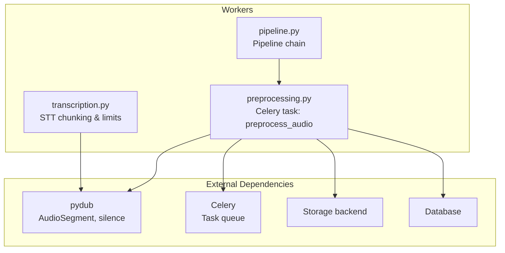
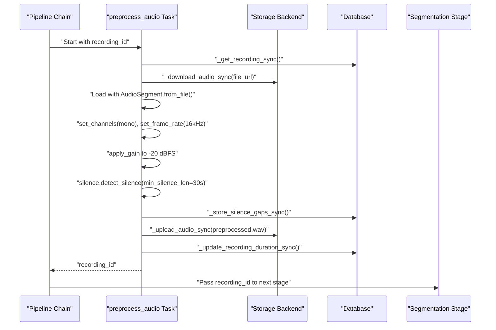
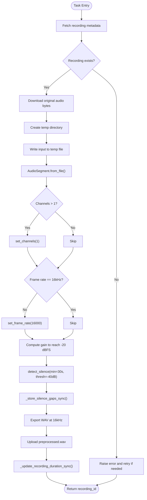
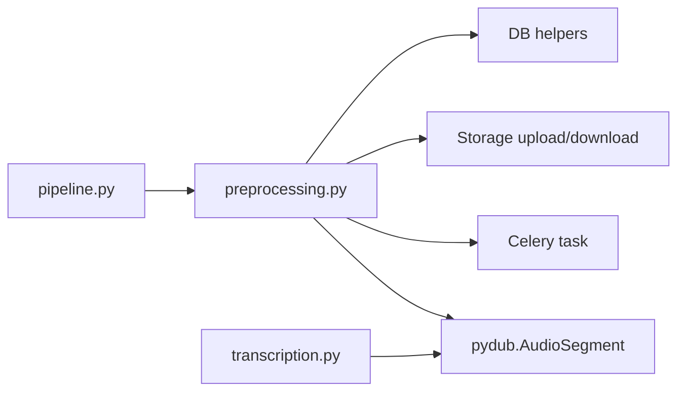

# Audio Preprocessing

<cite>
**Referenced Files in This Document**
- [preprocessing.py](file://apps/api/src/workers/preprocessing.py)
- [pipeline.py](file://apps/api/src/workers/pipeline.py)
- [transcription.py](file://apps/api/src/workers/transcription.py)
- [test_segmenter.py](file://apps/api/tests/test_segmenter.py)
</cite>

## Table of Contents
1. [Introduction](#introduction)
2. [Project Structure](#project-structure)
3. [Core Components](#core-components)
4. [Architecture Overview](#architecture-overview)
5. [Detailed Component Analysis](#detailed-component-analysis)
6. [Dependency Analysis](#dependency-analysis)
7. [Performance Considerations](#performance-considerations)
8. [Troubleshooting Guide](#troubleshooting-guide)
9. [Conclusion](#conclusion)

## Introduction
This document describes the audio preprocessing stage of the AI pipeline. It explains how raw audio is converted into a standardized format, normalized for consistent loudness, resampled to a target rate, and how silence gaps are detected to support downstream segmentation. It also documents configuration constants, quality thresholds, error handling, and practical workflows for preprocessing audio reliably.

## Project Structure
The preprocessing logic is implemented as a Celery task within the API service’s worker module. It integrates with the broader pipeline orchestration and interacts with storage and database helpers during processing.

**Diagram sources**
- [preprocessing.py:106-193](file://apps/api/src/workers/preprocessing.py#L106-L193)
- [pipeline.py:12-34](file://apps/api/src/workers/pipeline.py#L12-L34)
- [transcription.py:78-145](file://apps/api/src/workers/transcription.py#L78-L145)

**Section sources**
- [preprocessing.py:106-193](file://apps/api/src/workers/preprocessing.py#L106-L193)
- [pipeline.py:12-34](file://apps/api/src/workers/pipeline.py#L12-L34)

## Core Components
- Standardized output format and sampling:
  - Target sample rate: 16000 Hz
  - Target channels: mono
  - Output format: WAV
- Volume normalization:
  - Target RMS level: -20 dBFS
- Silence detection:
  - Threshold: -40 dBFS
  - Minimum silence gap: 30 seconds
- Pipeline integration:
  - Orchestrated via a Celery chain that begins with preprocessing

Key constants and thresholds are defined at the top of the preprocessing module.

**Section sources**
- [preprocessing.py:16-21](file://apps/api/src/workers/preprocessing.py#L16-L21)
- [preprocessing.py:106-193](file://apps/api/src/workers/preprocessing.py#L106-L193)

## Architecture Overview
The preprocessing stage runs as a Celery task and performs the following steps:
- Fetch recording metadata from the database
- Download the original audio from storage
- Load the audio using pydub
- Convert to mono and resample to 16 kHz
- Normalize volume to -20 dBFS
- Detect long silence gaps (>30 seconds) and persist them for segmentation
- Export the processed audio as WAV at 16 kHz
- Upload the processed audio to storage
- Persist duration and update status

**Diagram sources**
- [preprocessing.py:106-193](file://apps/api/src/workers/preprocessing.py#L106-L193)
- [pipeline.py:26-33](file://apps/api/src/workers/pipeline.py#L26-L33)

## Detailed Component Analysis

### Preprocessing Task Workflow
The Celery task orchestrates the entire preprocessing pipeline. It updates status, downloads audio, processes it in a temporary directory, and uploads the standardized output.

**Diagram sources**
- [preprocessing.py:106-193](file://apps/api/src/workers/preprocessing.py#L106-L193)

**Section sources**
- [preprocessing.py:106-193](file://apps/api/src/workers/preprocessing.py#L106-L193)

### Silence Detection and Removal
- Detection threshold: -40 dBFS
- Minimum silence gap length: 30 seconds
- Detected gaps are stored in the database for segmentation to use when splitting conversations
- Shorter silences are not removed but are recorded for downstream logic

Integration tests demonstrate how silence gaps influence conversation segmentation boundaries.

**Section sources**
- [preprocessing.py:156-170](file://apps/api/src/workers/preprocessing.py#L156-L170)
- [test_segmenter.py:547-575](file://apps/api/tests/test_segmenter.py#L547-L575)

### Volume Normalization Procedure
- Target RMS level: -20 dBFS
- Gain adjustment computed from current dBFS and applied twice to stabilize the result
- This ensures consistent loudness across recordings for downstream STT and speaker diarization

**Section sources**
- [preprocessing.py:151-155](file://apps/api/src/workers/preprocessing.py#L151-L155)

### Audio Resampling Strategy
- Resampling is performed only when the frame rate differs from 16 kHz
- The task sets the frame rate to 16000 Hz to match downstream model expectations

**Section sources**
- [preprocessing.py:146-149](file://apps/api/src/workers/preprocessing.py#L146-L149)

### Supported Formats and Codec Requirements
- Input is loaded via AudioSegment.from_file(), which supports a wide range of container and codec combinations through FFmpeg availability in the environment
- Output is exported as WAV at 16 kHz and mono
- Downstream transcription expects WAV input

Note: The exact list of supported input formats depends on the underlying FFmpeg installation in the runtime environment.

**Section sources**
- [preprocessing.py:139](file://apps/api/src/workers/preprocessing.py#L139)
- [preprocessing.py:174](file://apps/api/src/workers/preprocessing.py#L174)
- [transcription.py:110](file://apps/api/src/workers/transcription.py#L110)

### File Size Limitations and Chunking
- The transcription stage enforces a 25 MB limit per chunk for NVIDIA NIM
- Large preprocessed audio is split into overlapping chunks to respect this constraint
- Chunk durations are calculated proportionally to maintain quality while staying under the size limit

**Section sources**
- [transcription.py:78-84](file://apps/api/src/workers/transcription.py#L78-L84)
- [transcription.py:104-145](file://apps/api/src/workers/transcription.py#L104-L145)

### Quality Assessment Methods
- Silence gaps exceeding 30 seconds are logged and stored for segmentation
- Duration is persisted after preprocessing to track total audio length
- Volume normalization targets a consistent RMS level (-20 dBFS) to improve downstream recognition accuracy

**Section sources**
- [preprocessing.py:156-170](file://apps/api/src/workers/preprocessing.py#L156-L170)
- [preprocessing.py:184-186](file://apps/api/src/workers/preprocessing.py#L184-L186)
- [preprocessing.py:151-155](file://apps/api/src/workers/preprocessing.py#L151-L155)

### Preprocessing Configuration Options
- Target sample rate: 16000 Hz
- Target channels: 1 (mono)
- Output format: wav
- Silence detection threshold: -40 dBFS
- Minimum silence gap: 30 seconds
- Volume normalization target: -20 dBFS

These are defined as module-level constants and are used consistently across the preprocessing task.

**Section sources**
- [preprocessing.py:16-21](file://apps/api/src/workers/preprocessing.py#L16-L21)

## Dependency Analysis
The preprocessing stage depends on:
- pydub for audio loading, channel conversion, resampling, normalization, and silence detection
- Celery for asynchronous task execution
- Storage backend for downloading and uploading audio
- Database helpers for reading metadata, storing silence gaps, and updating duration/status

**Diagram sources**
- [preprocessing.py:7](file://apps/api/src/workers/preprocessing.py#L7)
- [pipeline.py:4](file://apps/api/src/workers/pipeline.py#L4)
- [transcription.py:104-110](file://apps/api/src/workers/transcription.py#L104-L110)

**Section sources**
- [preprocessing.py:7](file://apps/api/src/workers/preprocessing.py#L7)
- [pipeline.py:4](file://apps/api/src/workers/pipeline.py#L4)
- [transcription.py:104-110](file://apps/api/src/workers/transcription.py#L104-L110)

## Performance Considerations
- Temporary file I/O: Audio is written to disk and re-read; ensure sufficient disk throughput and space for concurrent tasks
- Memory footprint: Large audio files are held in memory during processing; monitor RAM usage in worker nodes
- Silence detection cost: Detecting silence across long recordings can be CPU-intensive; adjust thresholds and minimum gap lengths to balance accuracy and speed
- Chunking for transcription: When downstream STT enforces file size limits, chunking adds overhead; tune chunk sizes to minimize reprocessing while respecting limits

[No sources needed since this section provides general guidance]

## Troubleshooting Guide
Common issues and resolutions:
- Corrupted or unsupported input formats:
  - Symptom: Failure when loading audio with AudioSegment.from_file()
  - Resolution: Verify FFmpeg availability and codec support; re-encode problematic files to a widely supported container/codec combination
- Excessive silence gaps:
  - Symptom: Many 30+ second gaps reported
  - Resolution: Confirm whether gaps represent pauses or real silence; adjust thresholds if needed
- Large files failing downstream:
  - Symptom: Transcription errors due to size limits
  - Resolution: Rely on automatic chunking; ensure storage and network bandwidth can handle chunked uploads
- Inconsistent loudness:
  - Symptom: Some recordings appear too quiet or clipped
  - Resolution: Re-run preprocessing; ensure normalization target remains at -20 dBFS and that apply_gain is applied consistently

**Section sources**
- [preprocessing.py:139](file://apps/api/src/workers/preprocessing.py#L139)
- [transcription.py:78-84](file://apps/api/src/workers/transcription.py#L78-L84)

## Conclusion
The preprocessing stage transforms raw audio into a standardized, mono, 16 kHz WAV suitable for downstream AI services. It normalizes volume, resamples when necessary, and records silence gaps to aid segmentation. Robust error handling and chunking strategies ensure reliability across diverse audio inputs.