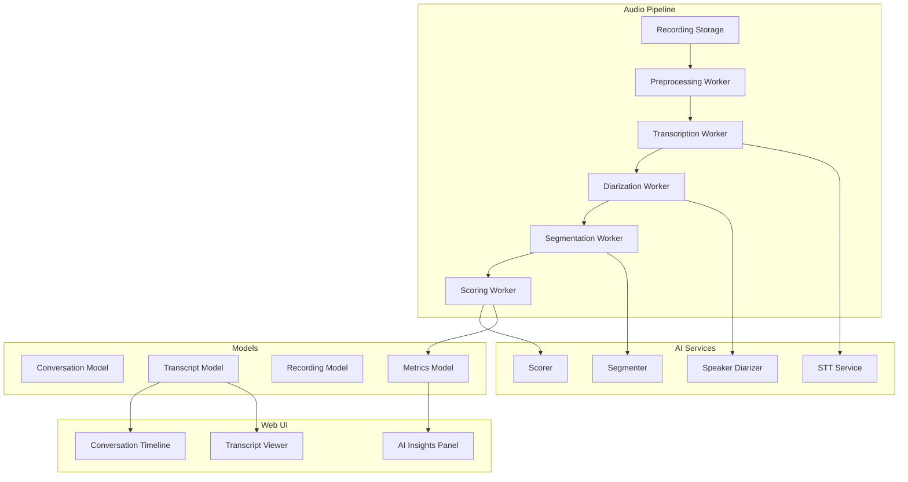
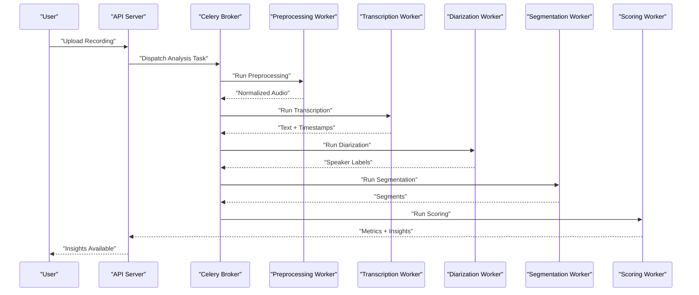
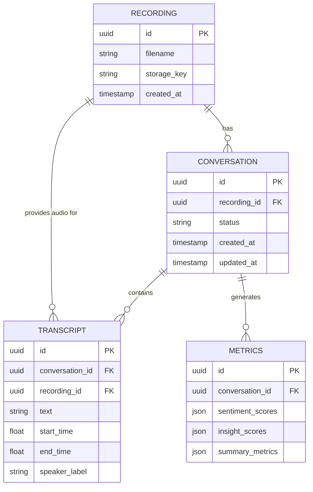
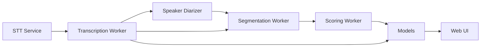

# Conversation Analysis

<cite>
**Referenced Files in This Document**
- [analyzer.py](file://apps/api/src/ai/analyzer.py)
- [scorer.py](file://apps/api/src/ai/scorer.py)
- [diarizer.py](file://apps/api/src/ai/diarizer.py)
- [segmenter.py](file://apps/api/src/ai/segmenter.py)
- [stt.py](file://apps/api/src/ai/stt.py)
- [nvidia_client.py](file://apps/api/src/ai/nvidia_client.py)
- [analysis.py](file://apps/api/src/workers/analysis.py)
- [celery_app.py](file://apps/api/src/workers/celery_app.py)
- [pipeline.py](file://apps/api/src/workers/pipeline.py)
- [preprocessing.py](file://apps/api/src/workers/preprocessing.py)
- [scoring.py](file://apps/api/src/workers/scoring.py)
- [transcription.py](file://apps/api/src/workers/transcription.py)
- [diarization.py](file://apps/api/src/workers/diarization.py)
- [segmentation.py](file://apps/api/src/workers/segmentation.py)
- [conversation.py](file://apps/api/src/models/conversation.py)
- [transcript.py](file://apps/api/src/models/transcript.py)
- [recording.py](file://apps/api/src/models/recording.py)
- [metrics.py](file://apps/api/src/models/metrics.py)
- [conversation.py](file://apps/api/src/services/conversation.py)
- [ai-insights-panel.tsx](file://apps/web/src/components/features/ai-insights-panel.tsx)
- [conversation-timeline.tsx](file://apps/web/src/components/features/conversation-timeline.tsx)
- [transcript-viewer.tsx](file://apps/web/src/components/features/transcript-viewer.tsx)
- [api-client.ts](file://apps/web/src/lib/api-client.ts)
- [README.md](file://README.md)
</cite>

## Table of Contents
1. [Introduction](#introduction)
2. [Project Structure](#project-structure)
3. [Core Components](#core-components)
4. [Architecture Overview](#architecture-overview)
5. [Detailed Component Analysis](#detailed-component-analysis)
6. [Dependency Analysis](#dependency-analysis)
7. [Performance Considerations](#performance-considerations)
8. [Troubleshooting Guide](#troubleshooting-guide)
9. [Conclusion](#conclusion)
10. [Appendices](#appendices)

## Introduction
This document describes the conversation analysis and insight generation system. It explains the natural language processing pipeline, intent detection mechanisms, sentiment scoring, behavioral pattern recognition, and integration with LLM services. It also covers analysis parameters, confidence scoring, result interpretation guidelines, quality assessment, and output formatting standards. The system transforms audio recordings into transcripts, segments speakers, scores sentiments and insights, and surfaces actionable coaching insights via the web dashboard.

## Project Structure
The conversation analysis system spans backend AI services, Celery workers, and a Next.js frontend:
- AI services: STT, speaker diarization, segmentation, and scoring
- Workers: orchestrate preprocessing, transcription, diarization, segmentation, and scoring
- Models: define conversation, transcript, recording, and metrics entities
- Services: expose APIs for managing conversations and retrieving insights
- Web components: render AI insights, timelines, and transcripts

**Diagram sources**
- [pipeline.py](file://apps/api/src/workers/pipeline.py)
- [preprocessing.py](file://apps/api/src/workers/preprocessing.py)
- [transcription.py](file://apps/api/src/workers/transcription.py)
- [diarization.py](file://apps/api/src/workers/diarization.py)
- [segmentation.py](file://apps/api/src/workers/segmentation.py)
- [scoring.py](file://apps/api/src/workers/scoring.py)
- [stt.py](file://apps/api/src/ai/stt.py)
- [diarizer.py](file://apps/api/src/ai/diarizer.py)
- [segmenter.py](file://apps/api/src/ai/segmenter.py)
- [scorer.py](file://apps/api/src/ai/scorer.py)
- [conversation.py](file://apps/api/src/models/conversation.py)
- [transcript.py](file://apps/api/src/models/transcript.py)
- [recording.py](file://apps/api/src/models/recording.py)
- [metrics.py](file://apps/api/src/models/metrics.py)
- [ai-insights-panel.tsx](file://apps/web/src/components/features/ai-insights-panel.tsx)
- [conversation-timeline.tsx](file://apps/web/src/components/features/conversation-timeline.tsx)
- [transcript-viewer.tsx](file://apps/web/src/components/features/transcript-viewer.tsx)

**Section sources**
- [README.md](file://README.md)

## Core Components
- Analyzer orchestrates the end-to-end analysis pipeline, coordinating workers and persisting results.
- Scorer computes sentiment and insight scores per segment and aggregates metrics.
- Diarizer identifies speaker turns from audio.
- Segmenter splits continuous speech into conversational segments.
- STT converts audio to text.
- Celery workers encapsulate each stage for asynchronous execution.
- Models represent persisted conversation artifacts and metrics.
- Web components visualize insights, timeline, and transcripts.

Key responsibilities:
- Audio ingestion and preprocessing
- Automatic speech recognition with speaker labeling
- Segment boundary detection
- Sentiment and insight scoring
- Metrics aggregation and persistence
- Dashboard rendering of insights

**Section sources**
- [analyzer.py](file://apps/api/src/ai/analyzer.py)
- [scorer.py](file://apps/api/src/ai/scorer.py)
- [diarizer.py](file://apps/api/src/ai/diarizer.py)
- [segmenter.py](file://apps/api/src/ai/segmenter.py)
- [stt.py](file://apps/api/src/ai/stt.py)
- [analysis.py](file://apps/api/src/workers/analysis.py)
- [celery_app.py](file://apps/api/src/workers/celery_app.py)
- [pipeline.py](file://apps/api/src/workers/pipeline.py)
- [conversation.py](file://apps/api/src/models/conversation.py)
- [metrics.py](file://apps/api/src/models/metrics.py)

## Architecture Overview
The system follows a staged, asynchronous pipeline:
- Preprocessing normalizes audio
- Transcription generates text with timestamps
- Diarization assigns speaker labels
- Segmentation detects conversational boundaries
- Scoring evaluates sentiment and extracts insights
- Results stored as metrics and transcripts
- Frontend renders insights and timelines

**Diagram sources**
- [celery_app.py](file://apps/api/src/workers/celery_app.py)
- [analysis.py](file://apps/api/src/workers/analysis.py)
- [preprocessing.py](file://apps/api/src/workers/preprocessing.py)
- [transcription.py](file://apps/api/src/workers/transcription.py)
- [diarization.py](file://apps/api/src/workers/diarization.py)
- [segmentation.py](file://apps/api/src/workers/segmentation.py)
- [scoring.py](file://apps/api/src/workers/scoring.py)

## Detailed Component Analysis

### Analyzer
The Analyzer coordinates the full pipeline:
- Validates inputs and initializes conversation metadata
- Dispatches tasks to workers in order
- Aggregates outputs and persists metrics and transcripts
- Handles errors and retries

Processing logic:
- Stage gating ensures downstream steps wait for upstream completion
- Output merging consolidates segments, speaker labels, and scores
- Persistence writes to conversation, transcript, and metrics models

Quality controls:
- Input validation prevents malformed audio
- Error propagation to caller for remediation
- Idempotent operations supported by task IDs

**Section sources**
- [analyzer.py](file://apps/api/src/ai/analyzer.py)

### STT Service
The STT service performs automatic speech recognition:
- Accepts normalized audio
- Produces word-level timestamps and transcriptions
- Supports batching and streaming modes

Parameters:
- Sampling rate and format requirements
- Language and model selection
- Confidence thresholds for recognized words

Integration:
- Invoked by the transcription worker
- Returns structured text with timing metadata

**Section sources**
- [stt.py](file://apps/api/src/ai/stt.py)

### Speaker Diarizer
Speaker diarization identifies who spoke when:
- Processes audio segments with timestamps
- Outputs speaker turn boundaries and labels
- Aligns labels with transcription timestamps

Parameters:
- Minimum segment duration
- Speaker count assumptions
- Temporal smoothing window

Integration:
- Consumes preprocessed audio and transcription timing
- Produces aligned speaker labels for segmentation

**Section sources**
- [diarizer.py](file://apps/api/src/ai/diarizer.py)

### Segmenter
Segmenter detects conversational boundaries:
- Uses prosodic and acoustic cues
- Splits continuous speech into turns and exchanges
- Produces segment-level timestamps

Parameters:
- Silence threshold
- Max pause length
- Min segment duration

Integration:
- Operates on labeled audio and aligned transcripts
- Produces segments for scoring

**Section sources**
- [segmenter.py](file://apps/api/src/ai/segmenter.py)

### Scorer
The Scorer computes sentiment and insight scores:
- Applies sentiment lexicons and rules per segment
- Extracts coaching insights (e.g., persuasive phrases, interruptions)
- Aggregates per-segment scores into conversation-level metrics

Parameters:
- Thresholds for positive/negative sentiment
- Insight categories and keywords
- Confidence thresholds for insights

Integration:
- Consumes segments and speaker labels
- Emits metrics and insights for persistence

**Section sources**
- [scorer.py](file://apps/api/src/ai/scorer.py)

### Workers and Pipeline Orchestration
Workers encapsulate each stage:
- Preprocessing: normalize and prepare audio
- Transcription: convert audio to text
- Diarization: assign speaker labels
- Segmentation: detect conversational segments
- Scoring: compute sentiment and insights

Pipeline coordination:
- Celery tasks chain stages
- Shared state passed via intermediate artifacts
- Retry and failure handling configured

**Section sources**
- [pipeline.py](file://apps/api/src/workers/pipeline.py)
- [preprocessing.py](file://apps/api/src/workers/preprocessing.py)
- [transcription.py](file://apps/api/src/workers/transcription.py)
- [diarization.py](file://apps/api/src/workers/diarization.py)
- [segmentation.py](file://apps/api/src/workers/segmentation.py)
- [scoring.py](file://apps/api/src/workers/scoring.py)
- [celery_app.py](file://apps/api/src/workers/celery_app.py)

### Models and Data Structures
Core entities:
- Conversation: top-level record of analysis
- Transcript: per-segment text with timestamps and speaker labels
- Recording: raw audio metadata
- Metrics: aggregated sentiment and insight scores

Relationships:
- One conversation has many transcripts and metrics
- Transcripts reference their parent recording and conversation

**Diagram sources**
- [conversation.py](file://apps/api/src/models/conversation.py)
- [transcript.py](file://apps/api/src/models/transcript.py)
- [recording.py](file://apps/api/src/models/recording.py)
- [metrics.py](file://apps/api/src/models/metrics.py)

**Section sources**
- [conversation.py](file://apps/api/src/models/conversation.py)
- [transcript.py](file://apps/api/src/models/transcript.py)
- [recording.py](file://apps/api/src/models/recording.py)
- [metrics.py](file://apps/api/src/models/metrics.py)

### Frontend Integration and Rendering
Web components consume analysis results:
- AI Insights Panel displays sentiment and insight summaries
- Conversation Timeline shows transcript segments with speaker labels
- Transcript Viewer renders searchable, scrollable transcripts

API integration:
- Fetches conversation metrics and transcripts
- Renders interactive UI with filtering and navigation

**Section sources**
- [ai-insights-panel.tsx](file://apps/web/src/components/features/ai-insights-panel.tsx)
- [conversation-timeline.tsx](file://apps/web/src/components/features/conversation-timeline.tsx)
- [transcript-viewer.tsx](file://apps/web/src/components/features/transcript-viewer.tsx)
- [api-client.ts](file://apps/web/src/lib/api-client.ts)

## Dependency Analysis
The system exhibits clear layering:
- AI services depend on audio inputs and produce structured outputs
- Workers depend on AI services and Celery infrastructure
- Models depend on worker outputs for persistence
- Web depends on API endpoints backed by models

**Diagram sources**
- [stt.py](file://apps/api/src/ai/stt.py)
- [diarizer.py](file://apps/api/src/ai/diarizer.py)
- [segmenter.py](file://apps/api/src/ai/segmenter.py)
- [scorer.py](file://apps/api/src/ai/scorer.py)
- [transcription.py](file://apps/api/src/workers/transcription.py)
- [diarization.py](file://apps/api/src/workers/diarization.py)
- [segmentation.py](file://apps/api/src/workers/segmentation.py)
- [scoring.py](file://apps/api/src/workers/scoring.py)
- [conversation.py](file://apps/api/src/models/conversation.py)
- [metrics.py](file://apps/api/src/models/metrics.py)

**Section sources**
- [celery_app.py](file://apps/api/src/workers/celery_app.py)
- [pipeline.py](file://apps/api/src/workers/pipeline.py)

## Performance Considerations
- Asynchronous execution: Celery tasks enable parallelism and fault tolerance.
- Batch processing: STT and diarization benefit from batched inputs.
- Streaming: Long recordings processed incrementally to reduce latency.
- Caching: Intermediate artifacts reused across workers to avoid recomputation.
- Resource scaling: Separate queues and workers for heavy stages (e.g., diarization, scoring).
- Quality vs speed trade-offs: Adjust thresholds for silence, segment duration, and confidence to balance accuracy and throughput.

[No sources needed since this section provides general guidance]

## Troubleshooting Guide
Common issues and resolutions:
- Poor transcription quality
  - Verify audio normalization and sampling rate
  - Increase silence thresholds and adjust segment durations
  - Re-run transcription with higher-quality audio
- Misaligned speaker labels
  - Confirm diarizer parameters and minimum segment duration
  - Validate that audio channels are correct
- Inaccurate sentiment or insights
  - Tune lexicon thresholds and keyword lists
  - Review custom rules for conflicts
  - Inspect segment boundaries and speaker alignment
- Missing or delayed results
  - Check Celery broker connectivity and worker health
  - Confirm task routing and queue names
  - Validate persistence and model relationships

**Section sources**
- [scorer.py](file://apps/api/src/ai/scorer.py)
- [segmenter.py](file://apps/api/src/ai/segmenter.py)
- [diarizer.py](file://apps/api/src/ai/diarizer.py)
- [stt.py](file://apps/api/src/ai/stt.py)
- [celery_app.py](file://apps/api/src/workers/celery_app.py)

## Conclusion
The conversation analysis system integrates robust NLP components with a scalable worker architecture to deliver sentiment and insight scores. By structuring the pipeline into discrete, asynchronous stages, it achieves reliability and maintainability. The frontend surfaces actionable insights, enabling coaching and performance improvement. Tuning parameters and validating data quality are essential for accurate and timely results.

[No sources needed since this section summarizes without analyzing specific files]

## Appendices

### Analysis Parameters and Scoring
- Sentiment scoring
  - Lexicon-based polarity with thresholds for positive/negative
  - Confidence derived from word-level confidence and segment length
- Insight extraction
  - Keyword and pattern-based rules for categories (e.g., persuasion, interruptions)
  - Confidence thresholds for insight presence
- Behavioral pattern recognition
  - Turn-taking rhythm, overlap, and silence distributions
  - Prosody-aligned pauses and emphasis indicators

**Section sources**
- [scorer.py](file://apps/api/src/ai/scorer.py)

### Output Formatting Standards
- Transcript segments include text, start/end timestamps, and speaker labels
- Metrics include per-segment sentiment and insight scores plus conversation-level summaries
- Web UI expects structured JSON payloads for rendering

**Section sources**
- [metrics.py](file://apps/api/src/models/metrics.py)
- [transcript.py](file://apps/api/src/models/transcript.py)
- [ai-insights-panel.tsx](file://apps/web/src/components/features/ai-insights-panel.tsx)

### Example Workflows
- New recording upload
  - Backend dispatches preprocessing → transcription → diarization → segmentation → scoring
  - Results persisted and surfaced in the AI Insights Panel and Timeline
- Retrospective analysis
  - Re-run scoring with updated rules or lexicons
  - Compare metrics across runs to assess improvements

**Section sources**
- [analysis.py](file://apps/api/src/workers/analysis.py)
- [pipeline.py](file://apps/api/src/workers/pipeline.py)
- [ai-insights-panel.tsx](file://apps/web/src/components/features/ai-insights-panel.tsx)