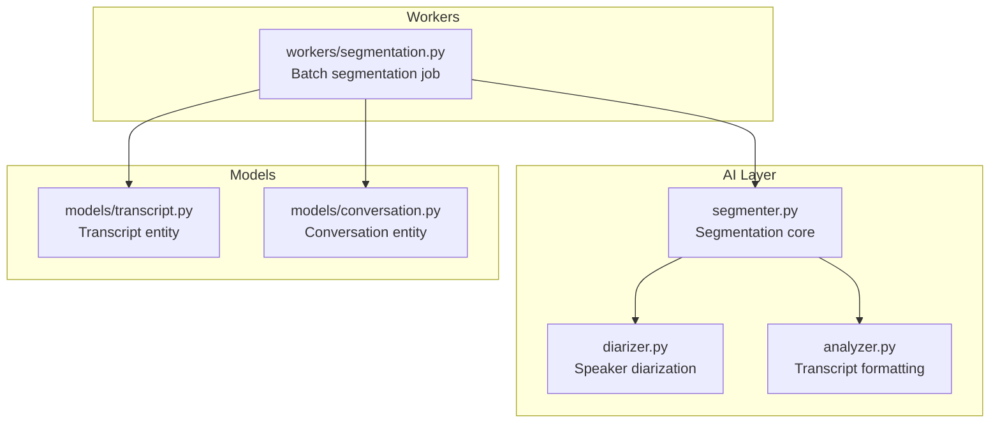
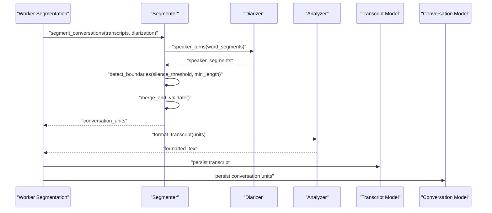
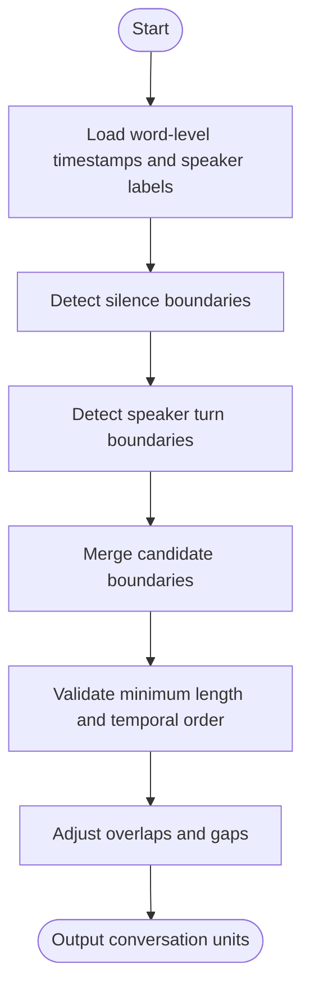
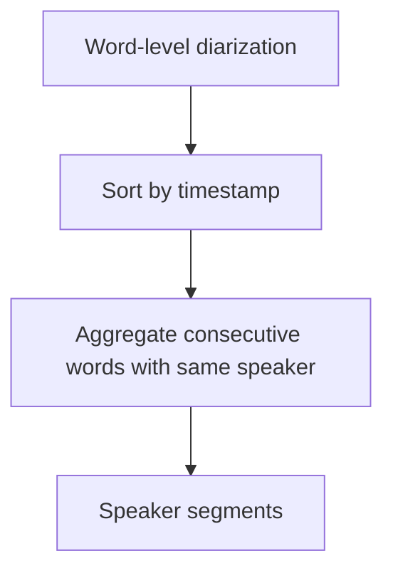
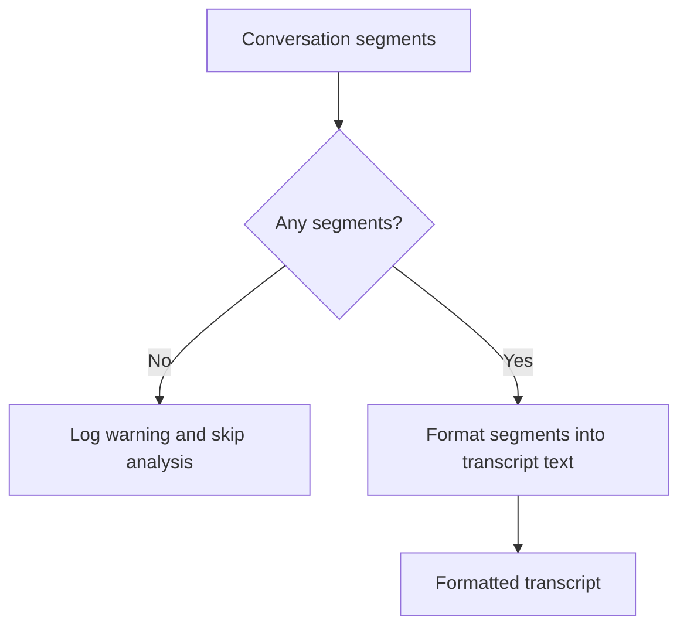
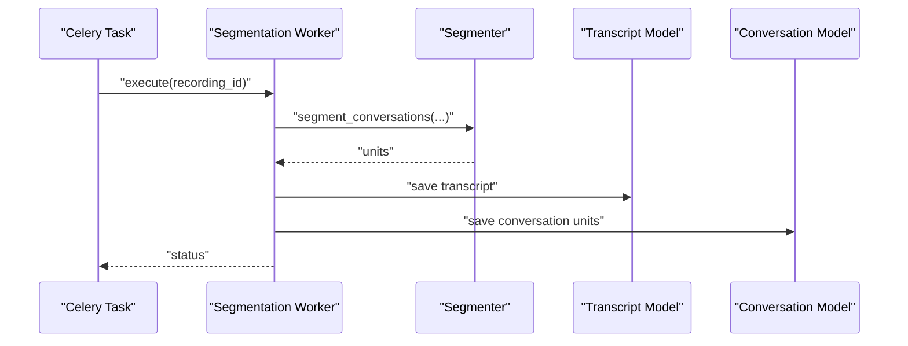
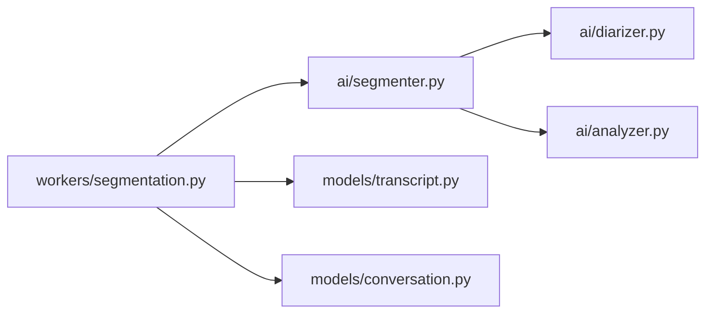

# Conversation Segmentation

<cite>
**Referenced Files in This Document**
- [segmenter.py](file://apps/api/src/ai/segmenter.py)
- [segmentation.py](file://apps/api/src/workers/segmentation.py)
- [analyzer.py](file://apps/api/src/ai/analyzer.py)
- [diarizer.py](file://apps/api/src/ai/diarizer.py)
- [transcript.py](file://apps/api/src/models/transcript.py)
- [conversation.py](file://apps/api/src/models/conversation.py)
- [test_segmenter.py](file://apps/api/tests/test_segmenter.py)
</cite>

## Table of Contents
1. [Introduction](#introduction)
2. [Project Structure](#project-structure)
3. [Core Components](#core-components)
4. [Architecture Overview](#architecture-overview)
5. [Detailed Component Analysis](#detailed-component-analysis)
6. [Dependency Analysis](#dependency-analysis)
7. [Performance Considerations](#performance-considerations)
8. [Troubleshooting Guide](#troubleshooting-guide)
9. [Conclusion](#conclusion)

## Introduction
This document explains the conversation segmentation algorithm and implementation used to split continuous audio transcripts into meaningful conversation units. It covers segmentation boundary detection, conversation unit definition, temporal organization of transcripts, segmentation rules, minimum conversation length requirements, overlap handling strategies, speaker turn detection, silence-based segmentation, and context preservation techniques. It also documents configuration options for sensitivity adjustment, output formatting, and quality validation, along with examples of segmentation workflows and handling of challenging audio scenarios.

## Project Structure
The segmentation pipeline integrates AI services for diarization and speech-to-text, followed by worker orchestration and model-driven segmentation. The key modules involved are:
- AI-level segmentation and analysis
- Worker-level orchestration for batch processing
- Model definitions for transcripts and conversations
- Tests validating segmentation behavior

**Diagram sources**
- [segmenter.py](file://apps/api/src/ai/segmenter.py)
- [diarizer.py](file://apps/api/src/ai/diarizer.py)
- [analyzer.py](file://apps/api/src/ai/analyzer.py)
- [segmentation.py](file://apps/api/src/workers/segmentation.py)
- [transcript.py](file://apps/api/src/models/transcript.py)
- [conversation.py](file://apps/api/src/models/conversation.py)

**Section sources**
- [segmenter.py](file://apps/api/src/ai/segmenter.py)
- [segmentation.py](file://apps/api/src/workers/segmentation.py)
- [analyzer.py](file://apps/api/src/ai/analyzer.py)
- [diarizer.py](file://apps/api/src/ai/diarizer.py)
- [transcript.py](file://apps/api/src/models/transcript.py)
- [conversation.py](file://apps/api/src/models/conversation.py)

## Core Components
- Segmenter: Implements the core segmentation logic, combining diarization-derived speaker turns and silence-based boundaries to produce conversation units with temporal bounds and speaker labels.
- Diarizer: Aggregates word-level speaker labels into contiguous speaker segments for turn detection.
- Analyzer: Formats segmented units into human-readable transcript text and supports downstream analysis.
- Worker Segmentation: Orchestrates batch processing of recordings, invoking segmentation and persisting results as conversation units.
- Transcript and Conversation Models: Define persisted structures for transcripts and segmented conversations.

Key responsibilities:
- Boundary detection via silence thresholds and speaker turn changes
- Temporal alignment of segments with strict ordering and non-overlap
- Minimum length enforcement to avoid trivial segments
- Overlap handling to prevent gaps or overlaps between adjacent segments
- Context preservation by allowing configurable pre/post padding around segments

**Section sources**
- [segmenter.py](file://apps/api/src/ai/segmenter.py)
- [diarizer.py](file://apps/api/src/ai/diarizer.py)
- [analyzer.py](file://apps/api/src/ai/analyzer.py)
- [segmentation.py](file://apps/api/src/workers/segmentation.py)
- [transcript.py](file://apps/api/src/models/transcript.py)
- [conversation.py](file://apps/api/src/models/conversation.py)

## Architecture Overview
The segmentation pipeline follows a staged flow:
1. Transcription and diarization produce aligned word-level timestamps and speaker labels.
2. The segmenter detects boundaries using silence durations and speaker changes.
3. Segments are validated for minimum length and temporal coherence.
4. The worker orchestrates processing and persists results as conversation units.

**Diagram sources**
- [segmentation.py](file://apps/api/src/workers/segmentation.py)
- [segmenter.py](file://apps/api/src/ai/segmenter.py)
- [diarizer.py](file://apps/api/src/ai/diarizer.py)
- [analyzer.py](file://apps/api/src/ai/analyzer.py)
- [transcript.py](file://apps/api/src/models/transcript.py)
- [conversation.py](file://apps/api/src/models/conversation.py)

## Detailed Component Analysis

### Segmenter: Boundary Detection and Conversation Units
The segmenter coordinates boundary detection using:
- Silence-based segmentation: identifies boundaries where silence exceeds a configured threshold.
- Speaker turn detection: splits segments when speaker labels change.
- Temporal organization: ensures segments are ordered by start time with no overlaps.
- Minimum length enforcement: discards segments shorter than a configured threshold.
- Overlap handling: merges adjacent segments or adjusts boundaries to eliminate gaps/overlaps.

**Diagram sources**
- [segmenter.py](file://apps/api/src/ai/segmenter.py)

**Section sources**
- [segmenter.py](file://apps/api/src/ai/segmenter.py)

### Diarizer: Speaker Turn Detection
The diarizer aggregates word-level speaker labels into contiguous speaker segments. It:
- Accepts word-level diarization outputs with timestamps.
- Groups consecutive words with the same speaker into speaker segments.
- Returns a list of speaker segments with start/end times and speaker identifiers.

**Diagram sources**
- [diarizer.py](file://apps/api/src/ai/diarizer.py)

**Section sources**
- [diarizer.py](file://apps/api/src/ai/diarizer.py)

### Analyzer: Transcript Formatting and Validation
The analyzer:
- Formats conversation segments into readable transcript text.
- Validates empty or malformed segments and logs warnings.
- Supports downstream analysis by providing clean, structured text.

**Diagram sources**
- [analyzer.py](file://apps/api/src/ai/analyzer.py)

**Section sources**
- [analyzer.py](file://apps/api/src/ai/analyzer.py)

### Worker Segmentation: Orchestration and Persistence
The worker:
- Receives a recording identifier and orchestrates segmentation.
- Invokes the segmenter with diarization and transcription inputs.
- Persists the resulting transcript and conversation units into models.

**Diagram sources**
- [segmentation.py](file://apps/api/src/workers/segmentation.py)
- [segmenter.py](file://apps/api/src/ai/segmenter.py)
- [transcript.py](file://apps/api/src/models/transcript.py)
- [conversation.py](file://apps/api/src/models/conversation.py)

**Section sources**
- [segmentation.py](file://apps/api/src/workers/segmentation.py)
- [segmenter.py](file://apps/api/src/ai/segmenter.py)
- [transcript.py](file://apps/api/src/models/transcript.py)
- [conversation.py](file://apps/api/src/models/conversation.py)

## Dependency Analysis
The segmentation pipeline exhibits clear layering:
- Worker depends on Segmenter and persistence models.
- Segmenter depends on Diarizer for speaker turns and Analyzer for formatting.
- Models define the persisted structures for transcripts and conversations.

**Diagram sources**
- [segmentation.py](file://apps/api/src/workers/segmentation.py)
- [segmenter.py](file://apps/api/src/ai/segmenter.py)
- [diarizer.py](file://apps/api/src/ai/diarizer.py)
- [analyzer.py](file://apps/api/src/ai/analyzer.py)
- [transcript.py](file://apps/api/src/models/transcript.py)
- [conversation.py](file://apps/api/src/models/conversation.py)

**Section sources**
- [segmentation.py](file://apps/api/src/workers/segmentation.py)
- [segmenter.py](file://apps/api/src/ai/segmenter.py)
- [diarizer.py](file://apps/api/src/ai/diarizer.py)
- [analyzer.py](file://apps/api/src/ai/analyzer.py)
- [transcript.py](file://apps/api/src/models/transcript.py)
- [conversation.py](file://apps/api/src/models/conversation.py)

## Performance Considerations
- Minimize repeated passes over timestamps by batching boundary detection and speaker aggregation.
- Use efficient sorting and merging strategies for speaker segments and candidate boundaries.
- Apply early filtering for minimum length to reduce downstream processing overhead.
- Persist results incrementally to avoid recomputation in case of partial failures.

## Troubleshooting Guide
Common issues and resolutions:
- Empty or missing diarization: Validate diarization inputs and re-run diarization if necessary.
- Overlapping or gap segments: Review silence thresholds and speaker turn boundaries; adjust sensitivity.
- Very short segments: Increase minimum length threshold to filter out noise.
- Misaligned timestamps: Ensure word-level timestamps are properly sorted and continuous.

Validation and testing:
- Use existing tests to verify segmentation behavior under normal and edge cases.
- Introduce targeted test cases for silence thresholds, speaker changes, and boundary adjustments.

**Section sources**
- [test_segmenter.py](file://apps/api/tests/test_segmenter.py)

## Conclusion
The conversation segmentation implementation combines silence-based and speaker-driven boundary detection with robust temporal validation and persistence. By tuning sensitivity parameters, enforcing minimum lengths, and preserving context, the system reliably produces coherent conversation units suitable for downstream analysis and user-facing applications.