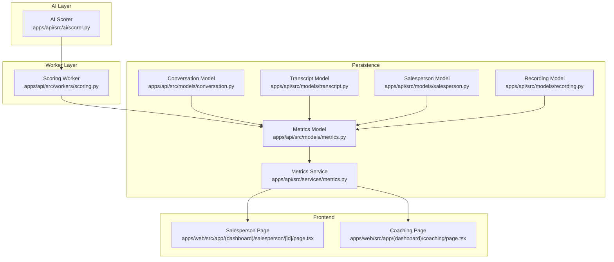
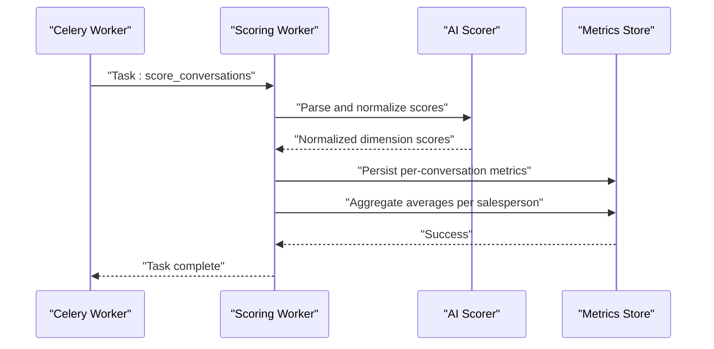
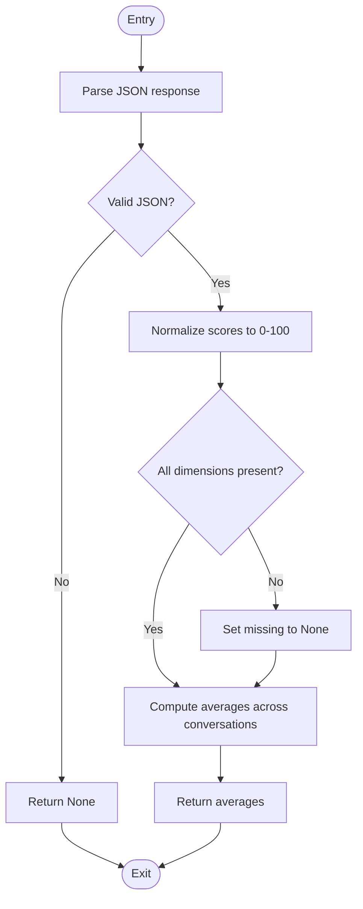
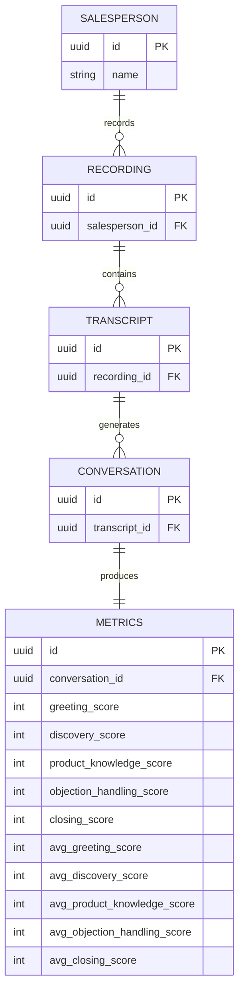
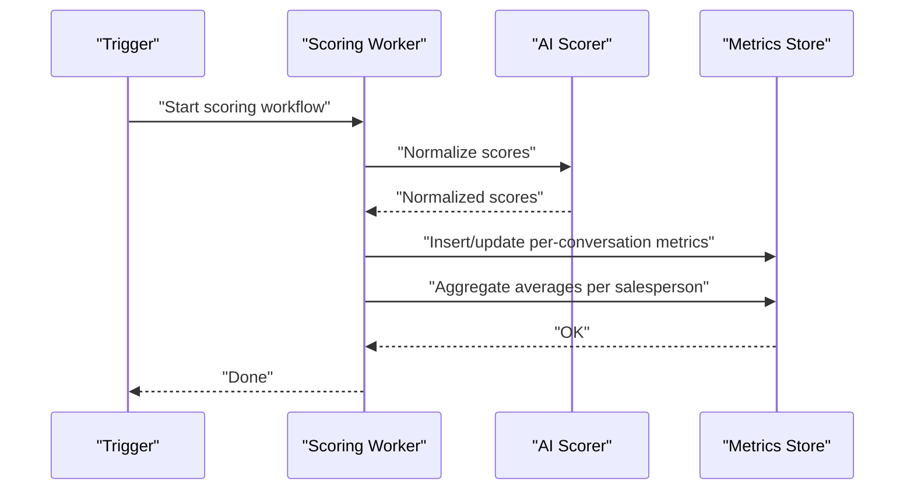
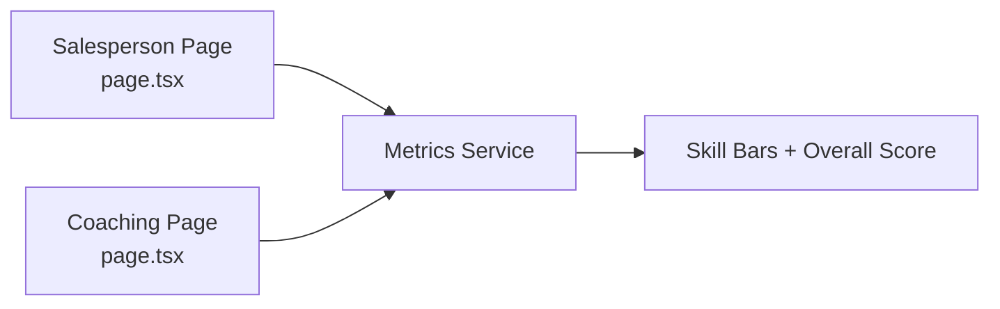
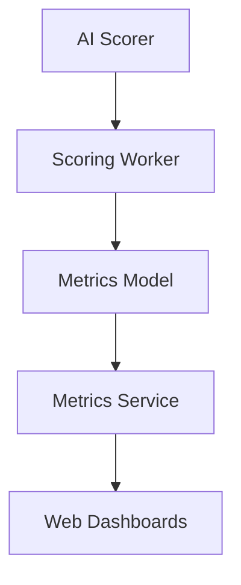

# Performance Scoring

<cite>
**Referenced Files in This Document**
- [scorer.py](file://apps/api/src/ai/scorer.py)
- [metrics.py](file://apps/api/src/models/metrics.py)
- [metrics.py](file://apps/api/src/services/metrics.py)
- [scoring.py](file://apps/api/src/workers/scoring.py)
- [conversation.py](file://apps/api/src/models/conversation.py)
- [transcript.py](file://apps/api/src/models/transcript.py)
- [salesperson.py](file://apps/api/src/models/salesperson.py)
- [recording.py](file://apps/api/src/models/recording.py)
- [page.tsx](file://apps/web/src/app/(dashboard)/salesperson/[id]/page.tsx)
- [page.tsx](file://apps/web/src/app/(dashboard)/coaching/page.tsx)
- [test_analyzer.py](file://apps/api/tests/test_analyzer.py)
</cite>

## Table of Contents
1. [Introduction](#introduction)
2. [Project Structure](#project-structure)
3. [Core Components](#core-components)
4. [Architecture Overview](#architecture-overview)
5. [Detailed Component Analysis](#detailed-component-analysis)
6. [Dependency Analysis](#dependency-analysis)
7. [Performance Considerations](#performance-considerations)
8. [Troubleshooting Guide](#troubleshooting-guide)
9. [Conclusion](#conclusion)

## Introduction
This document explains the performance scoring system and coaching metrics calculation used to evaluate salesperson performance. It covers scoring algorithms, normalization and averaging, benchmarking methodologies, trend analysis, comparative evaluation, and visualization. It also documents integration with salesperson profiles, historical tracking, and coaching recommendation generation.

## Project Structure
The performance scoring system spans AI analysis, worker orchestration, persistence, and frontend visualization:
- AI scoring module parses and normalizes raw scores from analysis results.
- Worker orchestrates conversation analysis and persists metrics.
- Services and models define the data schema and retrieval logic.
- Web dashboard surfaces skill scores and overall performance.

**Diagram sources**
- [scorer.py](file://apps/api/src/ai/scorer.py)
- [scoring.py](file://apps/api/src/workers/scoring.py)
- [metrics.py](file://apps/api/src/models/metrics.py)
- [metrics.py](file://apps/api/src/services/metrics.py)
- [conversation.py](file://apps/api/src/models/conversation.py)
- [transcript.py](file://apps/api/src/models/transcript.py)
- [salesperson.py](file://apps/api/src/models/salesperson.py)
- [recording.py](file://apps/api/src/models/recording.py)
- [page.tsx](file://apps/web/src/app/(dashboard)/salesperson/[id]/page.tsx)
- [page.tsx](file://apps/web/src/app/(dashboard)/coaching/page.tsx)

**Section sources**
- [scorer.py](file://apps/api/src/ai/scorer.py)
- [scoring.py](file://apps/api/src/workers/scoring.py)
- [metrics.py](file://apps/api/src/models/metrics.py)
- [metrics.py](file://apps/api/src/services/metrics.py)
- [conversation.py](file://apps/api/src/models/conversation.py)
- [transcript.py](file://apps/api/src/models/transcript.py)
- [salesperson.py](file://apps/api/src/models/salesperson.py)
- [recording.py](file://apps/api/src/models/recording.py)
- [page.tsx](file://apps/web/src/app/(dashboard)/salesperson/[id]/page.tsx)
- [page.tsx](file://apps/web/src/app/(dashboard)/coaching/page.tsx)

## Core Components
- AI Scorer: Parses structured analysis responses, clamps out-of-range scores, and computes dimension averages across conversations.
- Metrics Persistence: Stores per-conversation and aggregated metrics linked to salespeople and recordings.
- Worker Orchestrator: Triggers analysis, invokes AI scoring, and persists results.
- Frontend Dashboards: Visualize individual skill scores and overall performance.

Key scoring dimensions:
- Greeting
- Discovery
- Product Knowledge
- Objection Handling
- Closing

Each dimension is normalized to 0–100 scale. Averages are computed across multiple conversations per salesperson.

**Section sources**
- [scorer.py:159-216](file://apps/api/src/ai/scorer.py#L159-L216)
- [metrics.py](file://apps/api/src/models/metrics.py)
- [metrics.py](file://apps/api/src/services/metrics.py)
- [scoring.py](file://apps/api/src/workers/scoring.py)

## Architecture Overview
The system follows a pipeline: audio recordings are processed into transcripts, analyzed for skills, scored, and persisted. Aggregated metrics power dashboards and coaching recommendations.

**Diagram sources**
- [scoring.py](file://apps/api/src/workers/scoring.py)
- [scorer.py](file://apps/api/src/ai/scorer.py)
- [metrics.py](file://apps/api/src/models/metrics.py)

## Detailed Component Analysis

### AI Scoring Module
Responsibilities:
- Parse structured analysis responses into dimension scores.
- Clamp scores to 0–100 range.
- Compute averages across multiple conversations.

**Diagram sources**
- [scorer.py:159-216](file://apps/api/src/ai/scorer.py#L159-L216)

**Section sources**
- [scorer.py:159-216](file://apps/api/src/ai/scorer.py#L159-L216)
- [test_analyzer.py:106-142](file://apps/api/tests/test_analyzer.py#L106-L142)

### Metrics Schema and Aggregation
- Per-conversation metrics include dimension scores and derived overall score.
- Aggregates include average scores per dimension and overall average per salesperson.
- Relationships:
  - Metrics belong to a Conversation.
  - Conversation belongs to a Transcript.
  - Transcript belongs to a Recording.
  - Recording belongs to a Salesperson.

**Diagram sources**
- [metrics.py](file://apps/api/src/models/metrics.py)
- [conversation.py](file://apps/api/src/models/conversation.py)
- [transcript.py](file://apps/api/src/models/transcript.py)
- [salesperson.py](file://apps/api/src/models/salesperson.py)
- [recording.py](file://apps/api/src/models/recording.py)

**Section sources**
- [metrics.py](file://apps/api/src/models/metrics.py)
- [metrics.py](file://apps/api/src/services/metrics.py)

### Worker Orchestration
- Triggers analysis tasks and coordinates scoring.
- Persists per-conversation metrics and recomputes aggregates.
- Ensures data integrity and handles errors gracefully.

**Diagram sources**
- [scoring.py](file://apps/api/src/workers/scoring.py)
- [scorer.py](file://apps/api/src/ai/scorer.py)
- [metrics.py](file://apps/api/src/models/metrics.py)

**Section sources**
- [scoring.py](file://apps/api/src/workers/scoring.py)

### Frontend Visualization
- Salesperson profile page displays individual skill bars and overall score.
- Coaching dashboard shows skill scores and overall average with color-coded indicators.

**Diagram sources**
- [page.tsx](file://apps/web/src/app/(dashboard)/salesperson/[id]/page.tsx)
- [page.tsx](file://apps/web/src/app/(dashboard)/coaching/page.tsx)
- [metrics.py](file://apps/api/src/services/metrics.py)

**Section sources**
- [page.tsx](file://apps/web/src/app/(dashboard)/salesperson/[id]/page.tsx)
- [page.tsx](file://apps/web/src/app/(dashboard)/coaching/page.tsx)

## Dependency Analysis
- AI Scorer depends on standardized JSON responses containing dimension scores.
- Worker depends on AI Scorer and Metrics Model.
- Metrics Service depends on Metrics Model and exposes read APIs to the UI.
- UI depends on Metrics Service for rendering.

**Diagram sources**
- [scorer.py](file://apps/api/src/ai/scorer.py)
- [scoring.py](file://apps/api/src/workers/scoring.py)
- [metrics.py](file://apps/api/src/models/metrics.py)
- [metrics.py](file://apps/api/src/services/metrics.py)
- [page.tsx](file://apps/web/src/app/(dashboard)/salesperson/[id]/page.tsx)
- [page.tsx](file://apps/web/src/app/(dashboard)/coaching/page.tsx)

**Section sources**
- [scorer.py](file://apps/api/src/ai/scorer.py)
- [scoring.py](file://apps/api/src/workers/scoring.py)
- [metrics.py](file://apps/api/src/models/metrics.py)
- [metrics.py](file://apps/api/src/services/metrics.py)

## Performance Considerations
- Normalization ensures consistent 0–100 scale, preventing outliers from skewing comparisons.
- Averaging across conversations smooths short-term variability and stabilizes trends.
- Aggregation queries should leverage indexed foreign keys (conversation, salesperson) for efficient retrieval.
- Batch processing in the worker reduces repeated database writes and improves throughput.

## Troubleshooting Guide
Common issues and resolutions:
- Invalid JSON response from analysis:
  - Symptom: Parsing returns None.
  - Action: Verify AI service response format and retry failed tasks.
  - Evidence: [test_analyzer.py:106-142](file://apps/api/tests/test_analyzer.py#L106-L142)
- Out-of-range scores:
  - Symptom: Scores outside 0–100.
  - Action: Clamp values during normalization; investigate upstream scoring logic.
  - Evidence: [scorer.py:159-179](file://apps/api/src/ai/scorer.py#L159-L179)
- Missing dimension fields:
  - Symptom: Some dimension scores are None.
  - Action: Ensure analysis consistently emits all five dimensions; handle None in aggregation.
  - Evidence: [scorer.py:179-216](file://apps/api/src/ai/scorer.py#L179-L216)
- Empty aggregation:
  - Symptom: Averages return None.
  - Action: Confirm presence of score records; ensure worker runs after analysis completes.
  - Evidence: [scorer.py:182-216](file://apps/api/src/ai/scorer.py#L182-L216)
- Visualization shows dashes:
  - Symptom: No scores rendered.
  - Action: Check Metrics Service fetch and confirm backend worker executed.

**Section sources**
- [test_analyzer.py:106-142](file://apps/api/tests/test_analyzer.py#L106-L142)
- [scorer.py:159-216](file://apps/api/src/ai/scorer.py#L159-L216)
- [metrics.py](file://apps/api/src/services/metrics.py)

## Conclusion
The performance scoring system provides a robust pipeline for parsing AI-generated skill scores, normalizing them to a consistent scale, aggregating across conversations, and exposing metrics for visualization and coaching. By maintaining strict normalization, reliable aggregation, and clear UI integrations, the system supports accurate benchmarking, trend analysis, and actionable insights for salesperson development.