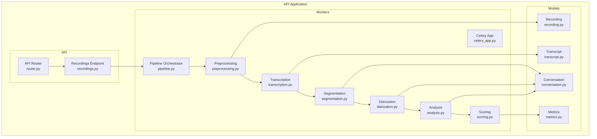
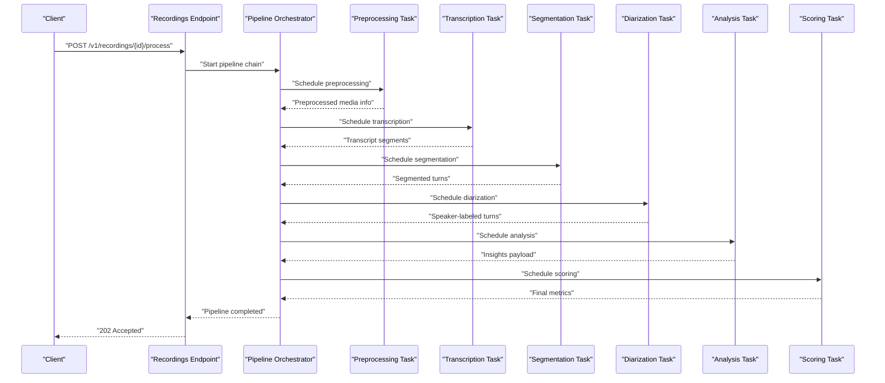
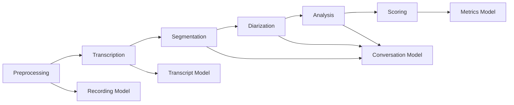

# Pipeline Architecture & Orchestration

<cite>
**Referenced Files in This Document**
- [celery_app.py](file://apps/api/src/workers/celery_app.py)
- [pipeline.py](file://apps/api/src/workers/pipeline.py)
- [preprocessing.py](file://apps/api/src/workers/preprocessing.py)
- [transcription.py](file://apps/api/src/workers/transcription.py)
- [segmentation.py](file://apps/api/src/workers/segmentation.py)
- [diarization.py](file://apps/api/src/workers/diarization.py)
- [analysis.py](file://apps/api/src/workers/analysis.py)
- [scoring.py](file://apps/api/src/workers/scoring.py)
- [recording.py](file://apps/api/src/models/recording.py)
- [conversation.py](file://apps/api/src/models/conversation.py)
- [transcript.py](file://apps/api/src/models/transcript.py)
- [metrics.py](file://apps/api/src/models/metrics.py)
- [router.py](file://apps/api/src/api/v1/router.py)
- [recordings.py](file://apps/api/src/api/v1/recordings.py)
- [alembic/env.py](file://apps/api/alembic/env.py)
- [main.py](file://apps/api/src/main.py)
- [docker-compose.yml](file://docker-compose.yml)
- [README.md](file://README.md)
</cite>

## Table of Contents
1. [Introduction](#introduction)
2. [Project Structure](#project-structure)
3. [Core Components](#core-components)
4. [Architecture Overview](#architecture-overview)
5. [Detailed Component Analysis](#detailed-component-analysis)
6. [Dependency Analysis](#dependency-analysis)
7. [Performance Considerations](#performance-considerations)
8. [Troubleshooting Guide](#troubleshooting-guide)
9. [Conclusion](#conclusion)
10. [Appendices](#appendices)

## Introduction
This document explains the AI pipeline architecture and Celery-based task orchestration system used to process audio recordings from ingestion to final scoring. It details the sequential processing workflow, pipeline chain configuration, task dependencies, error handling with retries, and monitoring approaches. The pipeline stages include preprocessing, transcription, segmentation, diarization, analysis, and scoring, with each stage implemented as a Celery task that communicates via shared data models.

## Project Structure
The AI pipeline resides in the API application under apps/api/src/workers and orchestrates tasks that persist and update domain models in apps/api/src/models. The Celery application is configured centrally and registers worker modules that implement each stage. The API surface exposes endpoints to trigger pipeline execution and manage resources.

**Diagram sources**
- [celery_app.py](file://apps/api/src/workers/celery_app.py)
- [pipeline.py](file://apps/api/src/workers/pipeline.py)
- [preprocessing.py](file://apps/api/src/workers/preprocessing.py)
- [transcription.py](file://apps/api/src/workers/transcription.py)
- [segmentation.py](file://apps/api/src/workers/segmentation.py)
- [diarization.py](file://apps/api/src/workers/diarization.py)
- [analysis.py](file://apps/api/src/workers/analysis.py)
- [scoring.py](file://apps/api/src/workers/scoring.py)
- [recording.py](file://apps/api/src/models/recording.py)
- [conversation.py](file://apps/api/src/models/conversation.py)
- [transcript.py](file://apps/api/src/models/transcript.py)
- [metrics.py](file://apps/api/src/models/metrics.py)
- [router.py](file://apps/api/src/api/v1/router.py)
- [recordings.py](file://apps/api/src/api/v1/recordings.py)

**Section sources**
- [celery_app.py](file://apps/api/src/workers/celery_app.py)
- [pipeline.py](file://apps/api/src/workers/pipeline.py)
- [router.py](file://apps/api/src/api/v1/router.py)
- [recordings.py](file://apps/api/src/api/v1/recordings.py)

## Core Components
- Celery App: Central configuration for broker/backend connectivity and task registration.
- Pipeline Orchestrator: Defines the chain of tasks and manages inter-task data passing.
- Stage Workers: Individual Celery tasks implementing preprocessing, transcription, segmentation, diarization, analysis, and scoring.
- Domain Models: Recording, Transcript, Conversation, and Metrics models that persist intermediate and final results.
- API Layer: Exposes endpoints to initiate pipeline runs and manage resources.

Key responsibilities:
- Chain creation and scheduling: Build a Celery chord/chain representing the pipeline stages.
- Result propagation: Pass structured payloads between tasks using model-backed data.
- Persistence: Update models after each stage to maintain auditability and recoverability.
- Monitoring: Emit logs and metrics for observability.

**Section sources**
- [celery_app.py](file://apps/api/src/workers/celery_app.py)
- [pipeline.py](file://apps/api/src/workers/pipeline.py)
- [preprocessing.py](file://apps/api/src/workers/preprocessing.py)
- [transcription.py](file://apps/api/src/workers/transcription.py)
- [segmentation.py](file://apps/api/src/workers/segmentation.py)
- [diarization.py](file://apps/api/src/workers/diarization.py)
- [analysis.py](file://apps/api/src/workers/analysis.py)
- [scoring.py](file://apps/api/src/workers/scoring.py)
- [recording.py](file://apps/api/src/models/recording.py)
- [conversation.py](file://apps/api/src/models/conversation.py)
- [transcript.py](file://apps/api/src/models/transcript.py)
- [metrics.py](file://apps/api/src/models/metrics.py)

## Architecture Overview
The pipeline follows a sequential, asynchronous workflow orchestrated by Celery. Each stage transforms input data into an intermediate representation stored in domain models, enabling reliable recovery and reprocessing. The API endpoint triggers the pipeline, which schedules tasks in order and propagates results through shared models.

**Diagram sources**
- [recordings.py](file://apps/api/src/api/v1/recordings.py)
- [pipeline.py](file://apps/api/src/workers/pipeline.py)
- [preprocessing.py](file://apps/api/src/workers/preprocessing.py)
- [transcription.py](file://apps/api/src/workers/transcription.py)
- [segmentation.py](file://apps/api/src/workers/segmentation.py)
- [diarization.py](file://apps/api/src/workers/diarization.py)
- [analysis.py](file://apps/api/src/workers/analysis.py)
- [scoring.py](file://apps/api/src/workers/scoring.py)

## Detailed Component Analysis

### Celery App Configuration
The Celery app centralizes broker and backend configuration and auto-discovers worker modules. It ensures consistent task routing and serialization across pipeline stages.

Implementation highlights:
- Broker/backend settings for task transport and result storage.
- Auto-discovery of task modules to register all pipeline stages.
- Serialization and result backend compatibility with domain models.

**Section sources**
- [celery_app.py](file://apps/api/src/workers/celery_app.py)

### Pipeline Orchestrator
The orchestrator composes the pipeline chain and coordinates inter-task data exchange. It defines the ordered sequence of tasks and passes structured payloads between stages.

Processing logic:
- Build a chain of tasks representing the pipeline stages.
- Propagate results from one stage to the next using shared models.
- Handle chain completion and finalize outcomes.

**Section sources**
- [pipeline.py](file://apps/api/src/workers/pipeline.py)

### Preprocessing Task
Purpose: Normalize and prepare raw audio for downstream stages.

Inputs:
- Raw audio file path or media identifier associated with a Recording.

Outputs:
- Preprocessed media metadata persisted in the Recording model.

Inter-task communication:
- Writes normalized audio path and metadata to the Recording record.
- Returns a payload containing identifiers for subsequent tasks.

**Section sources**
- [preprocessing.py](file://apps/api/src/workers/preprocessing.py)
- [recording.py](file://apps/api/src/models/recording.py)

### Transcription Task
Purpose: Convert speech to text using automatic speech recognition.

Inputs:
- Media metadata produced by preprocessing.

Outputs:
- Transcript segments persisted in the Transcript model.

Inter-task communication:
- Creates Transcript entries linked to the Recording.
- Emits segment-level text for downstream segmentation.

**Section sources**
- [transcription.py](file://apps/api/src/workers/transcription.py)
- [transcript.py](file://apps/api/src/models/transcript.py)

### Segmentation Task
Purpose: Split transcripts into speaker turns or conversational segments.

Inputs:
- Transcript segments from transcription.

Outputs:
- Segmented turns persisted in the Conversation model.

Inter-task communication:
- Builds Conversation records with turn boundaries.
- Provides turn-level data for diarization.

**Section sources**
- [segmentation.py](file://apps/api/src/workers/segmentation.py)
- [conversation.py](file://apps/api/src/models/conversation.py)

### Diarization Task
Purpose: Attribute turns to speakers using speaker diarization.

Inputs:
- Segmented turns from segmentation.

Outputs:
- Speaker-labeled turns in the Conversation model.

Inter-task communication:
- Updates Conversation records with speaker identities.
- Prepares speaker-aware turns for analysis.

**Section sources**
- [diarization.py](file://apps/api/src/workers/diarization.py)
- [conversation.py](file://apps/api/src/models/conversation.py)

### Analysis Task
Purpose: Extract insights from speaker-labeled turns.

Inputs:
- Speaker-labeled turns from diarization.

Outputs:
- Insights payload for scoring.

Inter-task communication:
- Aggregates turn-level insights.
- Produces structured analysis for scoring.

**Section sources**
- [analysis.py](file://apps/api/src/workers/analysis.py)
- [conversation.py](file://apps/api/src/models/conversation.py)

### Scoring Task
Purpose: Compute final metrics from analysis results.

Inputs:
- Insights payload from analysis.

Outputs:
- Final metrics persisted in the Metrics model.

Inter-task communication:
- Writes Metrics records tied to the Recording.
- Completes the pipeline with a final outcome.

**Section sources**
- [scoring.py](file://apps/api/src/workers/scoring.py)
- [metrics.py](file://apps/api/src/models/metrics.py)

### API Integration
The API layer exposes endpoints to trigger pipeline execution and manage resources. It validates requests, initiates the pipeline, and returns appropriate responses.

Key flows:
- Trigger pipeline: Accepts a recording identifier and starts the chain.
- Status and retrieval: Allows clients to check progress and fetch results.

**Section sources**
- [router.py](file://apps/api/src/api/v1/router.py)
- [recordings.py](file://apps/api/src/api/v1/recordings.py)

## Dependency Analysis
The pipeline exhibits strong sequential coupling with explicit data dependencies between stages. Each stage depends on the previous stage’s persisted output, ensuring robustness and reprocessing capability.

**Diagram sources**
- [preprocessing.py](file://apps/api/src/workers/preprocessing.py)
- [transcription.py](file://apps/api/src/workers/transcription.py)
- [segmentation.py](file://apps/api/src/workers/segmentation.py)
- [diarization.py](file://apps/api/src/workers/diarization.py)
- [analysis.py](file://apps/api/src/workers/analysis.py)
- [scoring.py](file://apps/api/src/workers/scoring.py)
- [recording.py](file://apps/api/src/models/recording.py)
- [transcript.py](file://apps/api/src/models/transcript.py)
- [conversation.py](file://apps/api/src/models/conversation.py)
- [metrics.py](file://apps/api/src/models/metrics.py)

**Section sources**
- [preprocessing.py](file://apps/api/src/workers/preprocessing.py)
- [transcription.py](file://apps/api/src/workers/transcription.py)
- [segmentation.py](file://apps/api/src/workers/segmentation.py)
- [diarization.py](file://apps/api/src/workers/diarization.py)
- [analysis.py](file://apps/api/src/workers/analysis.py)
- [scoring.py](file://apps/api/src/workers/scoring.py)
- [recording.py](file://apps/api/src/models/recording.py)
- [transcript.py](file://apps/api/src/models/transcript.py)
- [conversation.py](file://apps/api/src/models/conversation.py)
- [metrics.py](file://apps/api/src/models/metrics.py)

## Performance Considerations
- Asynchronous execution: Offloads long-running AI inference to background workers for responsiveness.
- Sequential batching: Minimizes cross-stage synchronization overhead by enforcing strict ordering.
- Persistence-first design: Reduces recomputation by storing intermediate artifacts.
- Resource isolation: Separate worker processes per stage improve stability and resource control.
- Backpressure: API can gate concurrency to prevent overload during peak loads.

[No sources needed since this section provides general guidance]

## Troubleshooting Guide
Common issues and remedies:
- Task failures: Inspect Celery logs for stack traces; confirm broker/backend connectivity.
- Data inconsistencies: Verify model updates after each stage; reconcile missing artifacts.
- Retries and exponential backoff: Configure retry policies to handle transient errors.
- Recovery: Restart failed stages from persisted checkpoints; re-run partial chains.
- Monitoring: Track task durations, queue depths, and error rates; alert on sustained degradation.

Operational checks:
- Confirm Celery worker health and task queue consumption.
- Validate persistence layer migrations and model integrity.
- Review API response codes and error payloads for client-side diagnostics.

**Section sources**
- [celery_app.py](file://apps/api/src/workers/celery_app.py)
- [pipeline.py](file://apps/api/src/workers/pipeline.py)
- [recording.py](file://apps/api/src/models/recording.py)
- [conversation.py](file://apps/api/src/models/conversation.py)
- [transcript.py](file://apps/api/src/models/transcript.py)
- [metrics.py](file://apps/api/src/models/metrics.py)

## Conclusion
The AI pipeline leverages a robust, sequential Celery-based orchestration to transform raw audio into actionable insights. By persisting intermediate results and enforcing strict task ordering, the system achieves reliability, observability, and recoverability. The modular worker design enables incremental improvements and targeted scaling of individual stages.

[No sources needed since this section summarizes without analyzing specific files]

## Appendices

### API Endpoints Overview
- Endpoint: POST /v1/recordings/{id}/process
  - Purpose: Trigger pipeline execution for a given recording.
  - Response: Accepted (202) with job identifier for tracking.

**Section sources**
- [recordings.py](file://apps/api/src/api/v1/recordings.py)

### Data Models Overview
- Recording: Stores raw and preprocessed media metadata.
- Transcript: Holds ASR-generated text segments.
- Conversation: Captures segmented turns and speaker labels.
- Metrics: Contains final scoring results.

**Section sources**
- [recording.py](file://apps/api/src/models/recording.py)
- [transcript.py](file://apps/api/src/models/transcript.py)
- [conversation.py](file://apps/api/src/models/conversation.py)
- [metrics.py](file://apps/api/src/models/metrics.py)

### Deployment and Environment
- Docker Compose: Provides orchestrated deployment of API, Celery workers, broker, and database.
- Alembic: Manages database schema migrations.

**Section sources**
- [docker-compose.yml](file://docker-compose.yml)
- [alembic/env.py](file://apps/api/alembic/env.py)
- [main.py](file://apps/api/src/main.py)
- [README.md](file://README.md)