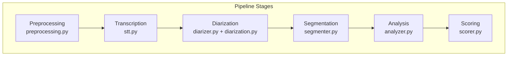
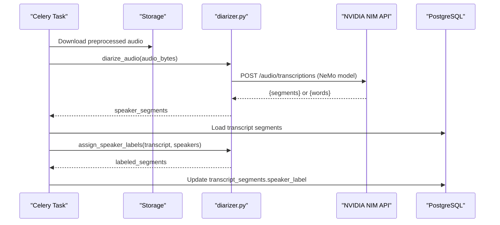
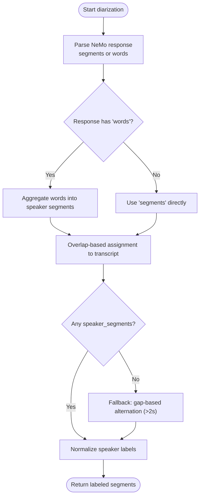
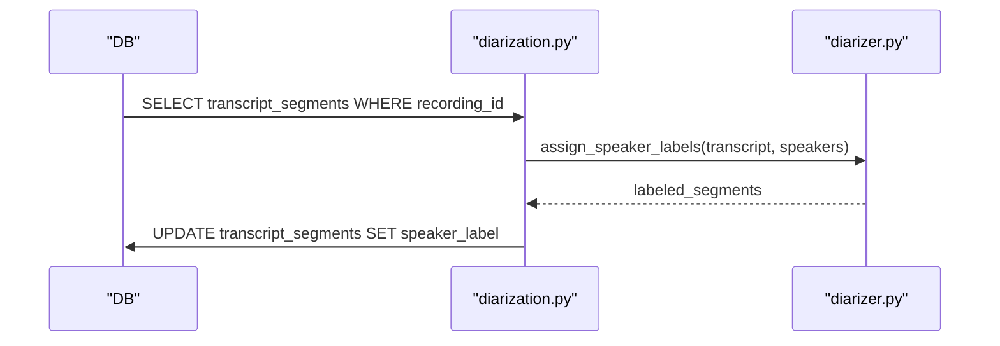
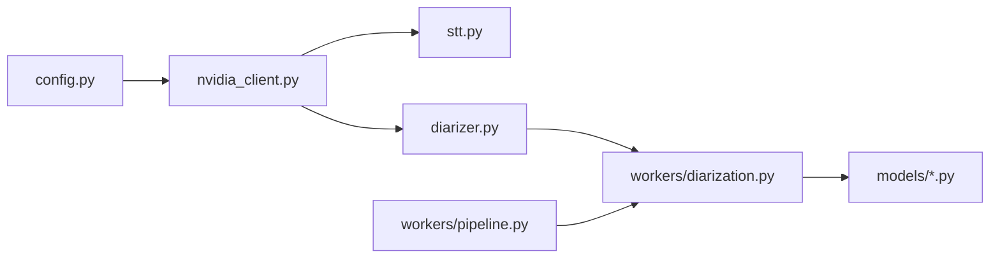
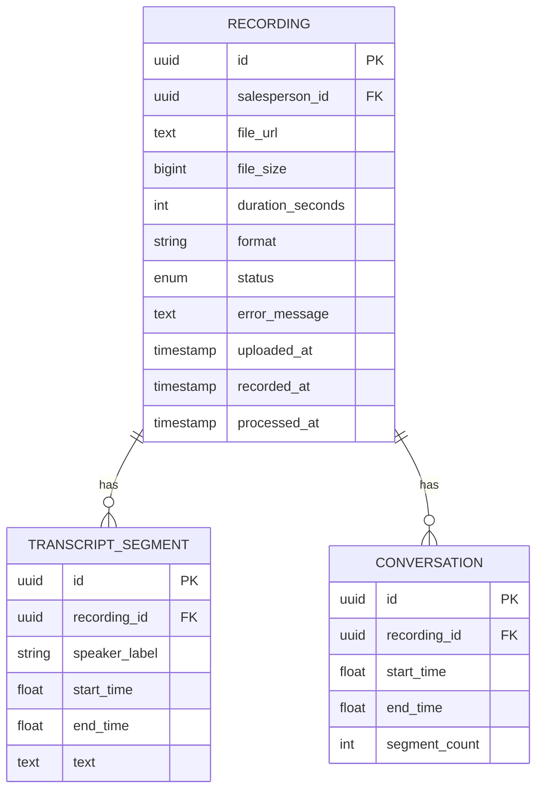

# Speaker Diarization

<cite>
**Referenced Files in This Document**
- [diarizer.py](file://apps/api/src/ai/diarizer.py)
- [nvidia_client.py](file://apps/api/src/ai/nvidia_client.py)
- [stt.py](file://apps/api/src/ai/stt.py)
- [config.py](file://apps/api/src/config.py)
- [diarization.py](file://apps/api/src/workers/diarization.py)
- [pipeline.py](file://apps/api/src/workers/pipeline.py)
- [preprocessing.py](file://apps/api/src/workers/preprocessing.py)
- [recording.py](file://apps/api/src/models/recording.py)
- [transcript.py](file://apps/api/src/models/transcript.py)
- [test_diarizer.py](file://apps/api/tests/test_diarizer.py)
- [test_segmenter.py](file://apps/api/tests/test_segmenter.py)
</cite>

## Table of Contents
1. [Introduction](#introduction)
2. [Project Structure](#project-structure)
3. [Core Components](#core-components)
4. [Architecture Overview](#architecture-overview)
5. [Detailed Component Analysis](#detailed-component-analysis)
6. [Dependency Analysis](#dependency-analysis)
7. [Performance Considerations](#performance-considerations)
8. [Troubleshooting Guide](#troubleshooting-guide)
9. [Conclusion](#conclusion)
10. [Appendices](#appendices)

## Introduction
This document explains the speaker diarization system built on NVIDIA NeMo models within the audio processing pipeline. It covers the diarization algorithm, speaker clustering and identity assignment, configuration parameters, output formats, accuracy optimization strategies, overlapping speech handling, integration with transcription, speaker label propagation, and quality assessment. It also provides troubleshooting guidance and performance tuning recommendations.

## Project Structure
The diarization capability is implemented as part of a multi-stage audio processing pipeline orchestrated by Celery tasks. The pipeline stages are:
- Preprocessing: audio normalization, resampling, silence detection
- Transcription: segment-level timestamps via NVIDIA Parakeet
- Diarization: speaker turn identification via NVIDIA NeMo
- Segmentation: conversation boundary detection
- Analysis and Scoring: business insights and performance evaluation

**Diagram sources**
- [preprocessing.py:106-194](file://apps/api/src/workers/preprocessing.py#L106-L194)
- [stt.py:12-86](file://apps/api/src/ai/stt.py#L12-L86)
- [diarizer.py:12-206](file://apps/api/src/ai/diarizer.py#L12-L206)
- [diarization.py:65-119](file://apps/api/src/workers/diarization.py#L65-L119)
- [segmenter.py:92-143](file://apps/api/src/ai/segmenter.py#L92-L143)
- [analyzer.py:47-117](file://apps/api/src/ai/analyzer.py#L47-L117)
- [scorer.py:66-122](file://apps/api/src/ai/scorer.py#L66-L122)

**Section sources**
- [pipeline.py:12-35](file://apps/api/src/workers/pipeline.py#L12-L35)
- [config.py:28-36](file://apps/api/src/config.py#L28-L36)

## Core Components
- Diarization API client: wraps NVIDIA NIM endpoints for NeMo-based speaker diarization, with robust retry and error handling.
- Diarization logic: parses NeMo responses, aggregates word-level labels into contiguous speaker segments, and assigns speaker labels to transcript segments via temporal overlap.
- Fallback assignment: when diarization is unavailable, alternates speakers across gaps exceeding a threshold.
- Configuration: model names, API keys, timeouts, and endpoint URLs are centralized in settings.

Key responsibilities:
- Accept raw audio bytes and return standardized speaker segments
- Merge speaker identities into transcript segments
- Normalize raw speaker identifiers to human-friendly labels
- Propagate speaker labels back to the database for downstream consumers

**Section sources**
- [diarizer.py:12-206](file://apps/api/src/ai/diarizer.py#L12-L206)
- [nvidia_client.py:32-197](file://apps/api/src/ai/nvidia_client.py#L32-L197)
- [config.py:28-36](file://apps/api/src/config.py#L28-L36)

## Architecture Overview
The diarization worker downloads preprocessed audio, invokes the NVIDIA NeMo diarization endpoint, merges speaker labels into transcript segments, and writes the results back to the database.

**Diagram sources**
- [diarization.py:65-119](file://apps/api/src/workers/diarization.py#L65-L119)
- [diarizer.py:12-206](file://apps/api/src/ai/diarizer.py#L12-L206)
- [nvidia_client.py:132-197](file://apps/api/src/ai/nvidia_client.py#L132-L197)
- [config.py:28-36](file://apps/api/src/config.py#L28-L36)

## Detailed Component Analysis

### Diarization Algorithm and Identity Assignment
- Input: audio bytes and optional filename
- Output: list of speaker segments with start, end, and speaker identifier
- Parsing supports both segment-level and word-level NeMo outputs; word-level outputs are aggregated into contiguous speaker segments
- Assignment strategy:
  - Temporal overlap: for each transcript segment, compute overlap with speaker segments and assign the speaker with the largest overlap
  - Normalization: map raw speaker identifiers (e.g., SPEAKER_00) to friendly labels (Speaker_A, Speaker_B, ...)
  - Fallback: if no diarization output is available, alternate speakers across gaps > 2 seconds

**Diagram sources**
- [diarizer.py:48-106](file://apps/api/src/ai/diarizer.py#L48-L106)
- [diarizer.py:108-206](file://apps/api/src/ai/diarizer.py#L108-L206)

**Section sources**
- [diarizer.py:12-206](file://apps/api/src/ai/diarizer.py#L12-L206)
- [test_diarizer.py:12-100](file://apps/api/tests/test_diarizer.py#L12-L100)

### Integration with Transcription and Speaker Label Propagation
- Transcription produces segment-level timestamps with text
- Diarization produces speaker segments aligned to time
- Label propagation:
  - Load transcript segments from DB
  - Assign speakers using overlap logic
  - Persist speaker_label back to transcript_segments table

**Diagram sources**
- [diarization.py:20-63](file://apps/api/src/workers/diarization.py#L20-L63)
- [diarization.py:65-119](file://apps/api/src/workers/diarization.py#L65-L119)
- [transcript.py:10-27](file://apps/api/src/models/transcript.py#L10-L27)

**Section sources**
- [diarization.py:20-119](file://apps/api/src/workers/diarization.py#L20-L119)
- [transcript.py:10-27](file://apps/api/src/models/transcript.py#L10-L27)

### Configuration Parameters and Output Formats
- Configuration parameters:
  - nvidia_diarization_model: NeMo model identifier
  - nvidia_base_url: NVIDIA NIM base URL
  - nvidia_timeout: per-call timeout
  - nvidia_api_key: authentication key
- Output formats:
  - Diarization response:
    - Segment-level: list of {start, end, speaker}
    - Word-level: list of {start, end, speaker, word}; aggregated into contiguous segments
  - Transcription response:
    - Segment-level verbose_json with segments array
  - Assigned speaker segments:
    - {start, end, text, speaker}

**Section sources**
- [config.py:28-36](file://apps/api/src/config.py#L28-L36)
- [diarizer.py:48-106](file://apps/api/src/ai/diarizer.py#L48-L106)
- [stt.py:49-86](file://apps/api/src/ai/stt.py#L49-L86)

### Handling Overlapping Speech and Edge Cases
- Overlapping speech:
  - The overlap-based assignment prefers the speaker with the largest temporal overlap
  - If no overlap is found, the segment is labeled as UNKNOWN
- Edge cases:
  - Empty inputs return empty results
  - Single-speaker runs are aggregated into one segment
  - Fallback alternates speakers across gaps > 2 seconds when diarization is absent
  - Unknown speakers remain as UNKNOWN

**Section sources**
- [diarizer.py:108-206](file://apps/api/src/ai/diarizer.py#L108-L206)
- [test_diarizer.py:12-100](file://apps/api/tests/test_diarizer.py#L12-L100)

### Accuracy Optimization Strategies
- Preprocessing:
  - Resample to 16 kHz mono and normalize volume to improve STT and diarization quality
  - Detect silence gaps > 30 seconds for segmentation heuristics
- Model selection:
  - Use appropriate NeMo diarization model configured in settings
- Post-processing:
  - Normalize speaker labels to consistent identifiers
  - Apply fallback labeling when diarization is unavailable

**Section sources**
- [preprocessing.py:16-22](file://apps/api/src/workers/preprocessing.py#L16-L22)
- [preprocessing.py:106-194](file://apps/api/src/workers/preprocessing.py#L106-L194)
- [config.py:28-36](file://apps/api/src/config.py#L28-L36)

### Quality Assessment Methods
- Confidence thresholds:
  - Minimum confidence threshold for publishing analysis results (separate from diarization)
- Speaker label validation:
  - Ensure labeled segments exist in DB and update only matching records by time bounds
- Metrics:
  - Track conversation counts and durations; derive higher-level KPIs in downstream analytics

Note: Diarization-specific confidence thresholds are not exposed in the current code; confidence scoring is applied in later analysis stages.

**Section sources**
- [analyzer.py:16-17](file://apps/api/src/ai/analyzer.py#L16-L17)
- [diarization.py:42-63](file://apps/api/src/workers/diarization.py#L42-L63)
- [recording.py:24-60](file://apps/api/src/models/recording.py#L24-L60)

## Dependency Analysis
- External dependencies:
  - NVIDIA NIM API for STT and diarization
  - PostgreSQL for storing recordings, transcripts, and conversations
  - Celery for asynchronous pipeline orchestration
- Internal dependencies:
  - diarization worker depends on diarizer module and DB models
  - STT and diarization share the same NVIDIA client with retry logic

**Diagram sources**
- [config.py:28-36](file://apps/api/src/config.py#L28-L36)
- [nvidia_client.py:32-197](file://apps/api/src/ai/nvidia_client.py#L32-L197)
- [stt.py:12-86](file://apps/api/src/ai/stt.py#L12-L86)
- [diarizer.py:12-206](file://apps/api/src/ai/diarizer.py#L12-L206)
- [diarization.py:65-119](file://apps/api/src/workers/diarization.py#L65-L119)
- [pipeline.py:12-35](file://apps/api/src/workers/pipeline.py#L12-L35)
- [recording.py:24-60](file://apps/api/src/models/recording.py#L24-L60)
- [transcript.py:10-27](file://apps/api/src/models/transcript.py#L10-L27)

**Section sources**
- [nvidia_client.py:32-197](file://apps/api/src/ai/nvidia_client.py#L32-L197)
- [diarization.py:65-119](file://apps/api/src/workers/diarization.py#L65-L119)
- [pipeline.py:12-35](file://apps/api/src/workers/pipeline.py#L12-L35)

## Performance Considerations
- Timeout tuning:
  - Increase nvidia_timeout for long recordings to avoid premature failures
- Retry strategy:
  - Exponential backoff for transient errors (rate limits, gateway errors)
- Throughput:
  - Use Celery workers to parallelize pipeline stages
- Audio quality:
  - Ensure 16 kHz mono audio and adequate normalization to reduce misalignment between STT and diarization

[No sources needed since this section provides general guidance]

## Troubleshooting Guide
Common issues and resolutions:
- Authentication failures:
  - Verify nvidia_api_key and endpoint URL in settings
- Rate limiting:
  - Implement backoff and consider reducing concurrent requests
- Empty diarization output:
  - Confirm NeMo model availability and audio quality; fallback labeling applies when diarization is absent
- Label mismatches:
  - Ensure transcript segments exist in DB and speaker_label updates target exact time bounds
- Long processing times:
  - Increase nvidia_timeout and optimize audio length

**Section sources**
- [nvidia_client.py:52-131](file://apps/api/src/ai/nvidia_client.py#L52-L131)
- [diarization.py:113-119](file://apps/api/src/workers/diarization.py#L113-L119)
- [config.py:28-36](file://apps/api/src/config.py#L28-L36)

## Conclusion
The diarization system integrates NVIDIA NeMo models into a robust, configurable pipeline. It leverages temporal overlap for speaker assignment, includes a fallback mechanism for reliability, and propagates labels into the transcript dataset for downstream analysis. With proper configuration, preprocessing, and monitoring, it delivers accurate speaker identity labeling suitable for retail conversation analysis and performance scoring.

## Appendices

### Data Models Overview

**Diagram sources**
- [recording.py:24-60](file://apps/api/src/models/recording.py#L24-L60)
- [transcript.py:10-27](file://apps/api/src/models/transcript.py#L10-L27)
- [conversation.py:11-33](file://apps/api/src/models/conversation.py#L11-L33)