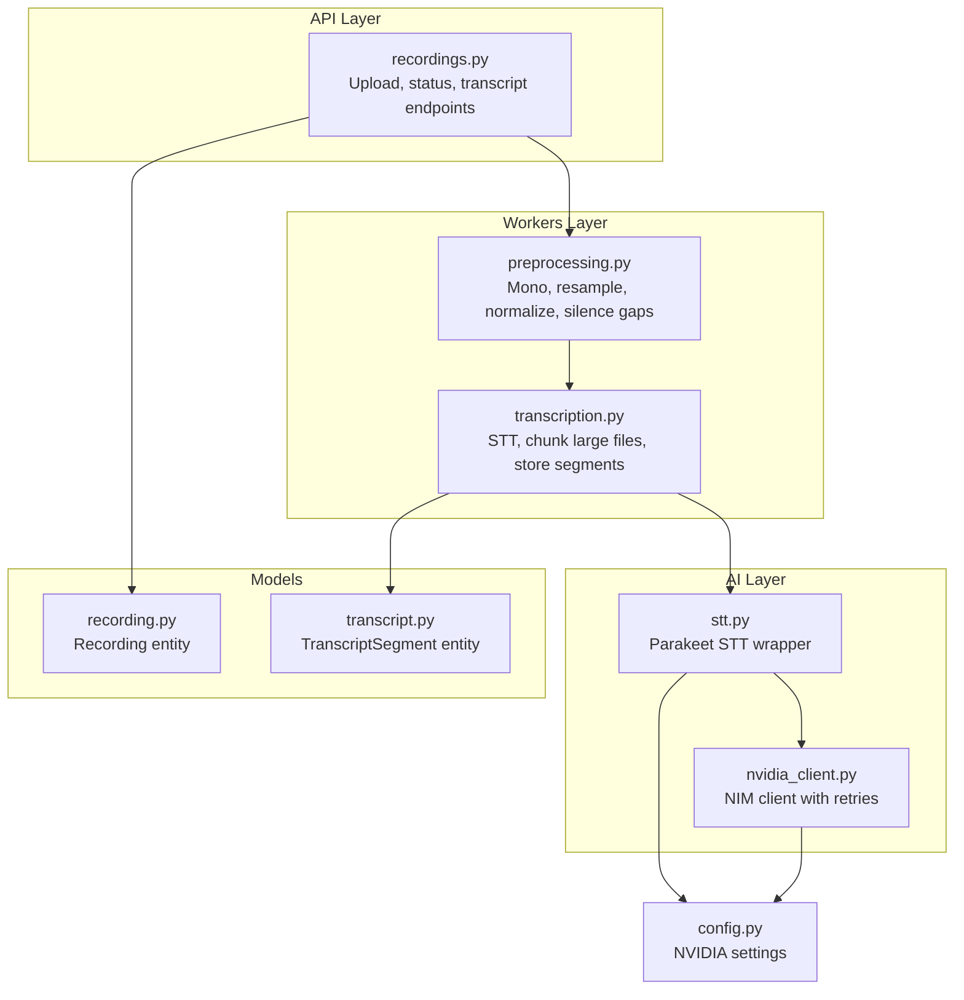
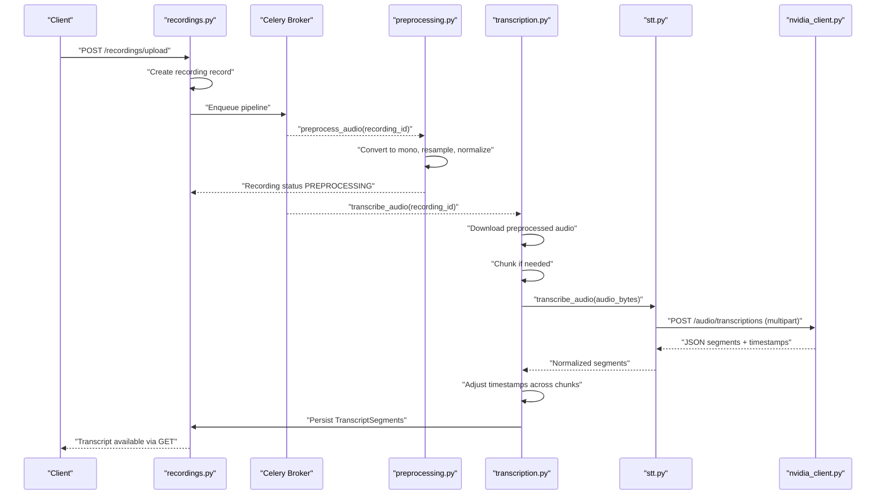
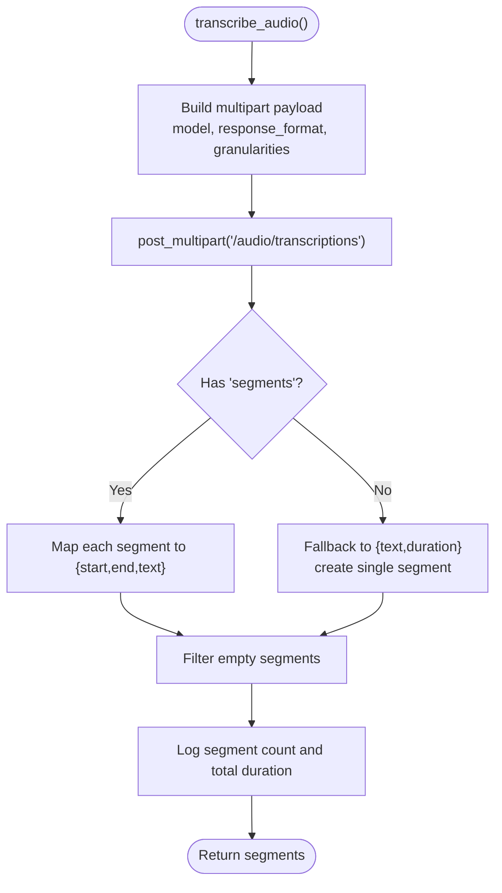
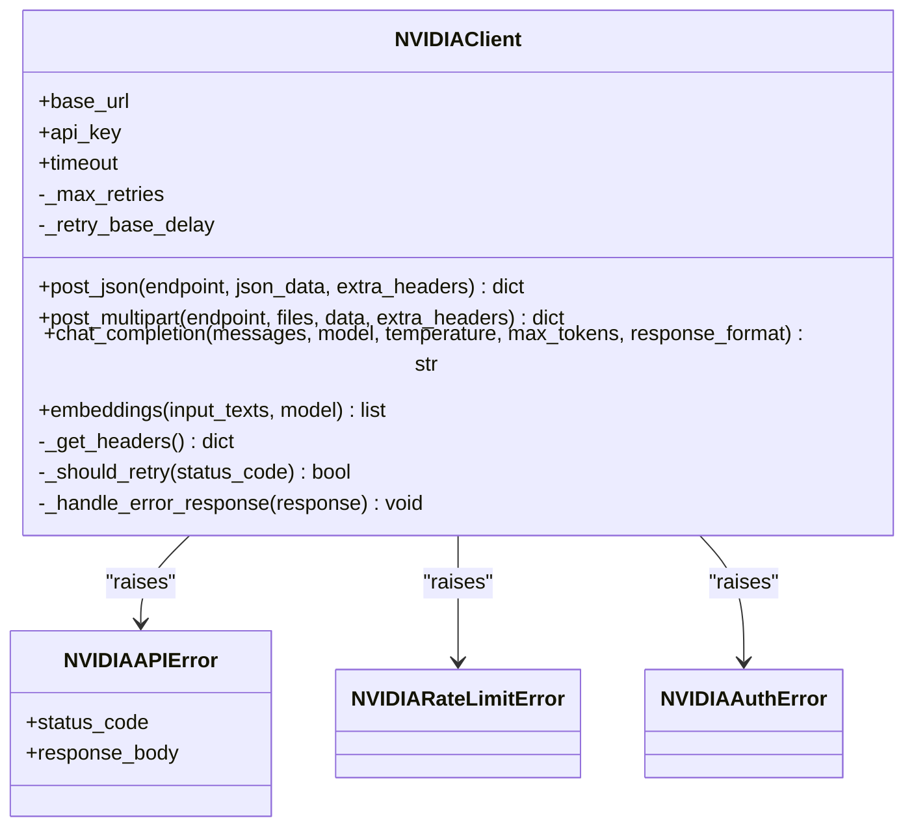
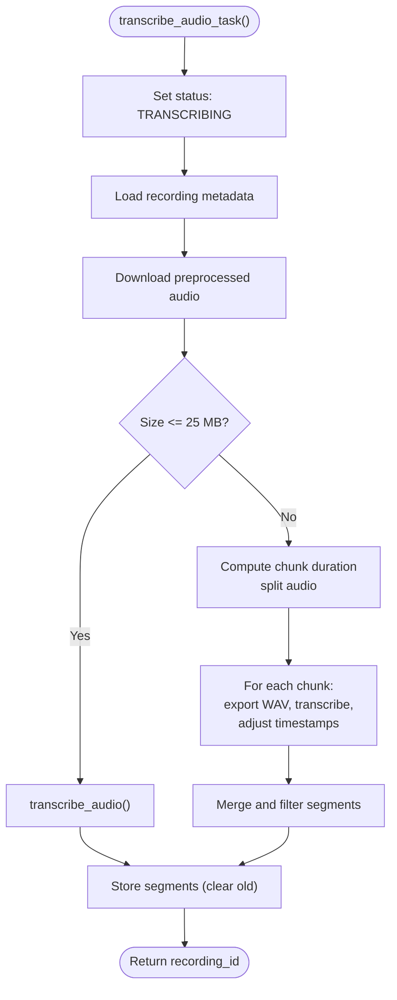
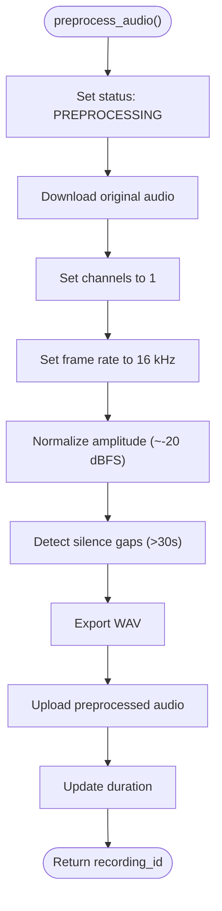
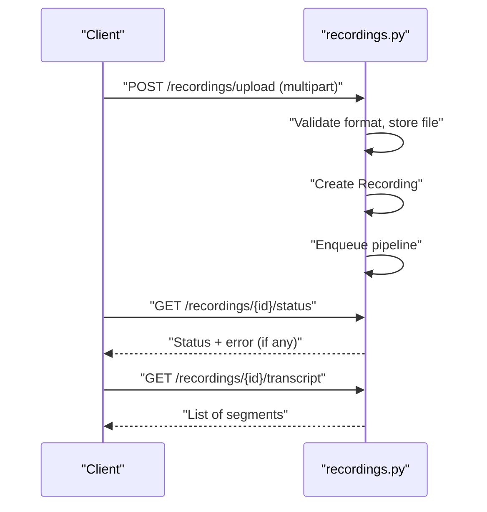
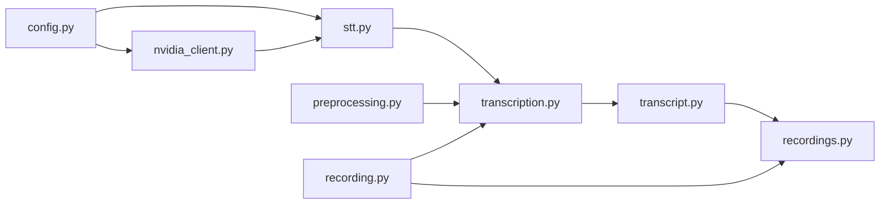

# Speech-to-Text (ASR)

<cite>
**Referenced Files in This Document**
- [stt.py](file://apps/api/src/ai/stt.py)
- [nvidia_client.py](file://apps/api/src/ai/nvidia_client.py)
- [transcription.py](file://apps/api/src/workers/transcription.py)
- [preprocessing.py](file://apps/api/src/workers/preprocessing.py)
- [config.py](file://apps/api/src/config.py)
- [transcript.py](file://apps/api/src/models/transcript.py)
- [recording.py](file://apps/api/src/models/recording.py)
- [recordings.py](file://apps/api/src/api/v1/recordings.py)
</cite>

## Table of Contents
1. [Introduction](#introduction)
2. [Project Structure](#project-structure)
3. [Core Components](#core-components)
4. [Architecture Overview](#architecture-overview)
5. [Detailed Component Analysis](#detailed-component-analysis)
6. [Dependency Analysis](#dependency-analysis)
7. [Performance Considerations](#performance-considerations)
8. [Troubleshooting Guide](#troubleshooting-guide)
9. [Conclusion](#conclusion)
10. [Appendices](#appendices)

## Introduction
This document explains the speech-to-text (ASR) pipeline powered by the NVIDIA Parakeet model via the NVIDIA NIM API. It covers the integration architecture, configuration and authentication, transcription parameters and output formatting, audio preprocessing requirements, timestamp generation, rate limiting and cost considerations, fallback mechanisms, and error handling. It also outlines transcription workflows and quality assessment approaches grounded in the repository’s implementation.

## Project Structure
The ASR pipeline spans several layers:
- API layer: ingestion and retrieval endpoints for recordings and transcripts
- Workers layer: Celery tasks orchestrating preprocessing, transcription, diarization, segmentation, analysis, scoring, and completion
- AI layer: STT wrapper and NVIDIA NIM client with retry and error handling
- Models layer: persistence of recordings and transcript segments
- Configuration: environment-driven settings for NVIDIA endpoints, models, and timeouts

**Diagram sources**
- [recordings.py:110-167](file://apps/api/src/api/v1/recordings.py#L110-L167)
- [preprocessing.py:106-193](file://apps/api/src/workers/preprocessing.py#L106-L193)
- [transcription.py:53-94](file://apps/api/src/workers/transcription.py#L53-L94)
- [stt.py:12-46](file://apps/api/src/ai/stt.py#L12-L46)
- [nvidia_client.py:32-197](file://apps/api/src/ai/nvidia_client.py#L32-L197)
- [transcript.py:10-26](file://apps/api/src/models/transcript.py#L10-L26)
- [recording.py:24-59](file://apps/api/src/models/recording.py#L24-L59)
- [config.py:28-35](file://apps/api/src/config.py#L28-L35)

**Section sources**
- [recordings.py:110-167](file://apps/api/src/api/v1/recordings.py#L110-L167)
- [preprocessing.py:106-193](file://apps/api/src/workers/preprocessing.py#L106-L193)
- [transcription.py:53-94](file://apps/api/src/workers/transcription.py#L53-L94)
- [stt.py:12-46](file://apps/api/src/ai/stt.py#L12-L46)
- [nvidia_client.py:32-197](file://apps/api/src/ai/nvidia_client.py#L32-L197)
- [transcript.py:10-26](file://apps/api/src/models/transcript.py#L10-L26)
- [recording.py:24-59](file://apps/api/src/models/recording.py#L24-L59)
- [config.py:28-35](file://apps/api/src/config.py#L28-L35)

## Core Components
- STT wrapper: Sends audio to NVIDIA NIM’s OpenAI-compatible audio transcription endpoint, requesting verbose JSON with segment-level timestamps and returning a normalized list of segments.
- NVIDIA NIM client: Provides HTTP client with exponential backoff retries, robust error classification (auth, rate limit, others), and convenience methods for multipart audio uploads.
- Transcription worker: Orchestrates downloading preprocessed audio, optional chunking for large files, invoking STT, adjusting timestamps across chunks, storing segments, and updating pipeline status.
- Preprocessing worker: Converts audio to 16 kHz mono, normalizes amplitude, detects long silence gaps, exports standardized WAV, and persists metadata.
- Models: Persist recordings and transcript segments, including embeddings for downstream use.
- Configuration: Centralized settings for NVIDIA base URL, API key, model identifiers, and timeouts.

Key implementation references:
- STT wrapper and response parsing: [stt.py:12-86](file://apps/api/src/ai/stt.py#L12-L86)
- NIM client and retry logic: [nvidia_client.py:32-197](file://apps/api/src/ai/nvidia_client.py#L32-L197)
- Transcription worker and chunking: [transcription.py:53-146](file://apps/api/src/workers/transcription.py#L53-L146)
- Preprocessing worker: [preprocessing.py:106-193](file://apps/api/src/workers/preprocessing.py#L106-L193)
- Transcript segment model: [transcript.py:10-26](file://apps/api/src/models/transcript.py#L10-L26)
- Recording model: [recording.py:24-59](file://apps/api/src/models/recording.py#L24-L59)
- Configuration: [config.py:28-35](file://apps/api/src/config.py#L28-L35)

**Section sources**
- [stt.py:12-86](file://apps/api/src/ai/stt.py#L12-L86)
- [nvidia_client.py:32-197](file://apps/api/src/ai/nvidia_client.py#L32-L197)
- [transcription.py:53-146](file://apps/api/src/workers/transcription.py#L53-L146)
- [preprocessing.py:106-193](file://apps/api/src/workers/preprocessing.py#L106-L193)
- [transcript.py:10-26](file://apps/api/src/models/transcript.py#L10-L26)
- [recording.py:24-59](file://apps/api/src/models/recording.py#L24-L59)
- [config.py:28-35](file://apps/api/src/config.py#L28-L35)

## Architecture Overview
The ASR pipeline is event-driven and asynchronous:
- An upload endpoint creates a recording record and enqueues the processing pipeline.
- The preprocessing worker standardizes audio to 16 kHz mono and exports a WAV file.
- The transcription worker downloads the preprocessed audio, optionally splits large files into chunks, invokes STT, adjusts timestamps, and writes segments to the database.
- Subsequent workers handle diarization, segmentation, analysis, scoring, and completion.

**Diagram sources**
- [recordings.py:110-167](file://apps/api/src/api/v1/recordings.py#L110-L167)
- [preprocessing.py:106-193](file://apps/api/src/workers/preprocessing.py#L106-L193)
- [transcription.py:53-146](file://apps/api/src/workers/transcription.py#L53-L146)
- [stt.py:12-46](file://apps/api/src/ai/stt.py#L12-L46)
- [nvidia_client.py:132-197](file://apps/api/src/ai/nvidia_client.py#L132-L197)

## Detailed Component Analysis

### STT Wrapper and Response Parsing
- Endpoint: OpenAI-compatible audio transcription endpoint.
- Request parameters:
  - model: configured via settings
  - response_format: verbose_json
  - timestamp_granularities: segment
- Response normalization:
  - If segments are present, each is mapped to a dictionary with start, end, and text.
  - If no segments, falls back to using the full text and duration to synthesize a single segment.
  - Filters out empty segments.
- Output format: list of dictionaries with numeric timestamps and trimmed text.

**Diagram sources**
- [stt.py:12-86](file://apps/api/src/ai/stt.py#L12-L86)
- [nvidia_client.py:132-197](file://apps/api/src/ai/nvidia_client.py#L132-L197)

**Section sources**
- [stt.py:12-86](file://apps/api/src/ai/stt.py#L12-L86)
- [config.py:28-35](file://apps/api/src/config.py#L28-L35)

### NVIDIA NIM Client and Retry Logic
- Authentication: Bearer token from configuration.
- Retries: Exponential backoff for 429, 500, 502, 503, 504; also retries on connection errors.
- Error handling:
  - 401/403: raises authentication error
  - 429: raises rate limit error
  - Other non-200: raises generic API error
- Methods:
  - post_json: for structured JSON payloads
  - post_multipart: for audio uploads
  - chat_completion and embeddings: convenience methods for other NIM endpoints

**Diagram sources**
- [nvidia_client.py:32-197](file://apps/api/src/ai/nvidia_client.py#L32-L197)

**Section sources**
- [nvidia_client.py:32-197](file://apps/api/src/ai/nvidia_client.py#L32-L197)
- [config.py:28-35](file://apps/api/src/config.py#L28-L35)

### Transcription Worker and Large-Audio Chunking
- Downloads preprocessed audio from storage.
- If audio exceeds a size threshold, splits into chunks preserving temporal continuity:
  - Computes chunk duration proportional to byte size with a safety margin.
  - Offsets timestamps of each chunk and clamps to chunk boundaries.
- Stores segments in the database, clearing previous ones for the recording.
- Updates pipeline status and handles retries with exponential backoff.

**Diagram sources**
- [transcription.py:53-146](file://apps/api/src/workers/transcription.py#L53-L146)

**Section sources**
- [transcription.py:53-146](file://apps/api/src/workers/transcription.py#L53-L146)
- [transcript.py:10-26](file://apps/api/src/models/transcript.py#L10-L26)

### Preprocessing Worker and Audio Standards
- Converts to mono and resamples to 16 kHz.
- Normalizes to a target loudness level.
- Detects silence gaps longer than 30 seconds and stores them for segmentation.
- Exports standardized WAV and updates duration.

**Diagram sources**
- [preprocessing.py:106-193](file://apps/api/src/workers/preprocessing.py#L106-L193)

**Section sources**
- [preprocessing.py:106-193](file://apps/api/src/workers/preprocessing.py#L106-L193)

### API Endpoints for Upload, Status, and Transcript Retrieval
- Upload endpoint validates format, stores file, creates recording, and enqueues the pipeline.
- Status endpoint exposes current pipeline state and error messages.
- Transcript endpoint returns persisted segments.

**Diagram sources**
- [recordings.py:110-167](file://apps/api/src/api/v1/recordings.py#L110-L167)
- [recordings.py:182-204](file://apps/api/src/api/v1/recordings.py#L182-L204)

**Section sources**
- [recordings.py:110-167](file://apps/api/src/api/v1/recordings.py#L110-L167)
- [recordings.py:182-204](file://apps/api/src/api/v1/recordings.py#L182-L204)

## Dependency Analysis
- STT wrapper depends on the NIM client and configuration for model selection and response format.
- Transcription worker depends on storage, preprocessing outputs, and the STT wrapper.
- Preprocessing worker depends on audio libraries and storage.
- Models define the schema for persisted transcripts and recordings.
- API endpoints depend on services and workers to orchestrate pipeline stages.

**Diagram sources**
- [config.py:28-35](file://apps/api/src/config.py#L28-L35)
- [stt.py:12-46](file://apps/api/src/ai/stt.py#L12-L46)
- [nvidia_client.py:32-197](file://apps/api/src/ai/nvidia_client.py#L32-L197)
- [transcription.py:53-146](file://apps/api/src/workers/transcription.py#L53-L146)
- [transcript.py:10-26](file://apps/api/src/models/transcript.py#L10-L26)
- [preprocessing.py:106-193](file://apps/api/src/workers/preprocessing.py#L106-L193)
- [recording.py:24-59](file://apps/api/src/models/recording.py#L24-L59)
- [recordings.py:110-167](file://apps/api/src/api/v1/recordings.py#L110-L167)

**Section sources**
- [config.py:28-35](file://apps/api/src/config.py#L28-L35)
- [stt.py:12-46](file://apps/api/src/ai/stt.py#L12-L46)
- [nvidia_client.py:32-197](file://apps/api/src/ai/nvidia_client.py#L32-L197)
- [transcription.py:53-146](file://apps/api/src/workers/transcription.py#L53-L146)
- [transcript.py:10-26](file://apps/api/src/models/transcript.py#L10-L26)
- [preprocessing.py:106-193](file://apps/api/src/workers/preprocessing.py#L106-L193)
- [recording.py:24-59](file://apps/api/src/models/recording.py#L24-L59)
- [recordings.py:110-167](file://apps/api/src/api/v1/recordings.py#L110-L167)

## Performance Considerations
- Audio standards:
  - Target 16 kHz, mono WAV as required by the STT model and the NIM endpoint.
  - Normalization reduces variability in acoustic conditions.
- Chunking:
  - Large files are split to fit platform constraints; chunk durations are computed proportionally with a safety margin to avoid boundary artifacts.
- Timeouts:
  - Long-running STT calls use extended timeouts configured in settings.
- Cost optimization:
  - Minimize redundant processing by reusing preprocessed audio and avoiding repeated uploads.
  - Prefer chunking only when necessary to reduce API round trips.
- Confidence scoring:
  - The STT wrapper does not expose confidence scores; downstream analysis can be used to estimate quality.

[No sources needed since this section provides general guidance]

## Troubleshooting Guide
Common failure modes and handling:
- Authentication failures:
  - Symptom: 401/403 responses.
  - Action: Verify API key and base URL in configuration.
- Rate limiting:
  - Symptom: 429 responses with retry behavior.
  - Action: Respect backoff; consider reducing concurrent requests or batching.
- Network/connection errors:
  - Symptom: Connect/timeout exceptions retried with exponential backoff.
  - Action: Check network connectivity and broker availability; ensure timeouts are sufficient.
- Empty or missing segments:
  - Symptom: No segments returned or fallback single segment.
  - Action: Verify audio quality and preprocessing steps; ensure the file is a valid WAV.
- Pipeline status and errors:
  - Use the status endpoint to inspect current state and error messages.

Operational references:
- Error classes and handling: [nvidia_client.py:13-71](file://apps/api/src/ai/nvidia_client.py#L13-L71)
- Retry logic and delays: [nvidia_client.py:98-130](file://apps/api/src/ai/nvidia_client.py#L98-L130), [nvidia_client.py:159-195](file://apps/api/src/ai/nvidia_client.py#L159-L195)
- Transcription task retries and status updates: [transcription.py:53-101](file://apps/api/src/workers/transcription.py#L53-L101)
- Preprocessing task retries and status updates: [preprocessing.py:106-205](file://apps/api/src/workers/preprocessing.py#L106-L205)
- Status endpoint: [recordings.py:182-195](file://apps/api/src/api/v1/recordings.py#L182-L195)

**Section sources**
- [nvidia_client.py:13-71](file://apps/api/src/ai/nvidia_client.py#L13-L71)
- [nvidia_client.py:98-130](file://apps/api/src/ai/nvidia_client.py#L98-L130)
- [nvidia_client.py:159-195](file://apps/api/src/ai/nvidia_client.py#L159-L195)
- [transcription.py:53-101](file://apps/api/src/workers/transcription.py#L53-L101)
- [preprocessing.py:106-205](file://apps/api/src/workers/preprocessing.py#L106-L205)
- [recordings.py:182-195](file://apps/api/src/api/v1/recordings.py#L182-L195)

## Conclusion
The ASR pipeline integrates NVIDIA Parakeet via the NIM API with robust preprocessing, chunking for large files, and resilient retries. Configuration is centralized, and the system persists transcript segments with timestamps for downstream analysis. By adhering to audio standards, leveraging chunking, and monitoring status/error states, teams can achieve reliable, scalable transcription.

[No sources needed since this section summarizes without analyzing specific files]

## Appendices

### API Configuration and Authentication
- Base URL and API key are loaded from environment settings.
- Authentication header is set automatically for all requests.
- Timeout is configurable for long-running STT calls.

References:
- Settings: [config.py:28-35](file://apps/api/src/config.py#L28-L35)
- Headers and retries: [nvidia_client.py:42-71](file://apps/api/src/ai/nvidia_client.py#L42-L71)

**Section sources**
- [config.py:28-35](file://apps/api/src/config.py#L28-L35)
- [nvidia_client.py:42-71](file://apps/api/src/ai/nvidia_client.py#L42-L71)

### Transcription Parameters and Output Formatting
- Parameters sent to the NIM endpoint:
  - model: configured model identifier
  - response_format: verbose_json
  - timestamp_granularities: segment
- Output segments include start, end, and text; empty segments are filtered.

References:
- STT request construction: [stt.py:31-44](file://apps/api/src/ai/stt.py#L31-L44)
- Response parsing: [stt.py:49-86](file://apps/api/src/ai/stt.py#L49-L86)

**Section sources**
- [stt.py:31-44](file://apps/api/src/ai/stt.py#L31-L44)
- [stt.py:49-86](file://apps/api/src/ai/stt.py#L49-L86)

### Audio Preprocessing Requirements
- Required format: 16 kHz, mono WAV.
- Normalization and silence gap detection improve downstream accuracy and enable segmentation.

References:
- Preprocessing steps: [preprocessing.py:106-193](file://apps/api/src/workers/preprocessing.py#L106-L193)

**Section sources**
- [preprocessing.py:106-193](file://apps/api/src/workers/preprocessing.py#L106-L193)

### Timestamp Generation and Segment Storage
- Segment timestamps originate from the STT response; chunked segments are offset and clamped to preserve temporal coherence.
- Segments are stored with speaker_label placeholder for later diarization.

References:
- Chunking and timestamp adjustment: [transcription.py:104-146](file://apps/api/src/workers/transcription.py#L104-L146)
- Segment model: [transcript.py:10-26](file://apps/api/src/models/transcript.py#L10-L26)

**Section sources**
- [transcription.py:104-146](file://apps/api/src/workers/transcription.py#L104-L146)
- [transcript.py:10-26](file://apps/api/src/models/transcript.py#L10-L26)

### Rate Limiting and Cost Optimization
- Built-in exponential backoff for 429 and selected 5xx errors.
- Chunking large files reduces per-request costs and improves throughput.
- Reuse preprocessed audio to minimize redundant conversions.

References:
- Retry logic: [nvidia_client.py:48-71](file://apps/api/src/ai/nvidia_client.py#L48-L71), [nvidia_client.py:98-130](file://apps/api/src/ai/nvidia_client.py#L98-L130), [nvidia_client.py:159-195](file://apps/api/src/ai/nvidia_client.py#L159-L195)
- Chunking thresholds: [transcription.py:78-84](file://apps/api/src/workers/transcription.py#L78-L84)

**Section sources**
- [nvidia_client.py:48-71](file://apps/api/src/ai/nvidia_client.py#L48-L71)
- [nvidia_client.py:98-130](file://apps/api/src/ai/nvidia_client.py#L98-L130)
- [nvidia_client.py:159-195](file://apps/api/src/ai/nvidia_client.py#L159-L195)
- [transcription.py:78-84](file://apps/api/src/workers/transcription.py#L78-L84)

### Quality Assessment and Confidence Scoring
- The STT wrapper does not expose confidence scores; downstream analysis and embedding-based similarity can be used for quality checks.
- Transcript segments include timestamps suitable for alignment and evaluation.

References:
- Segment model with optional embedding column: [transcript.py:10-26](file://apps/api/src/models/transcript.py#L10-L26)

**Section sources**
- [transcript.py:10-26](file://apps/api/src/models/transcript.py#L10-L26)