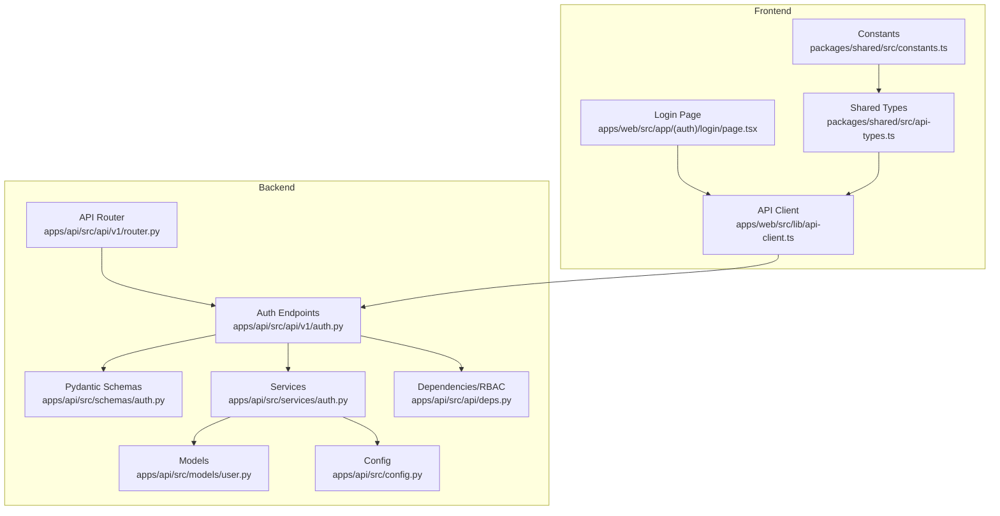
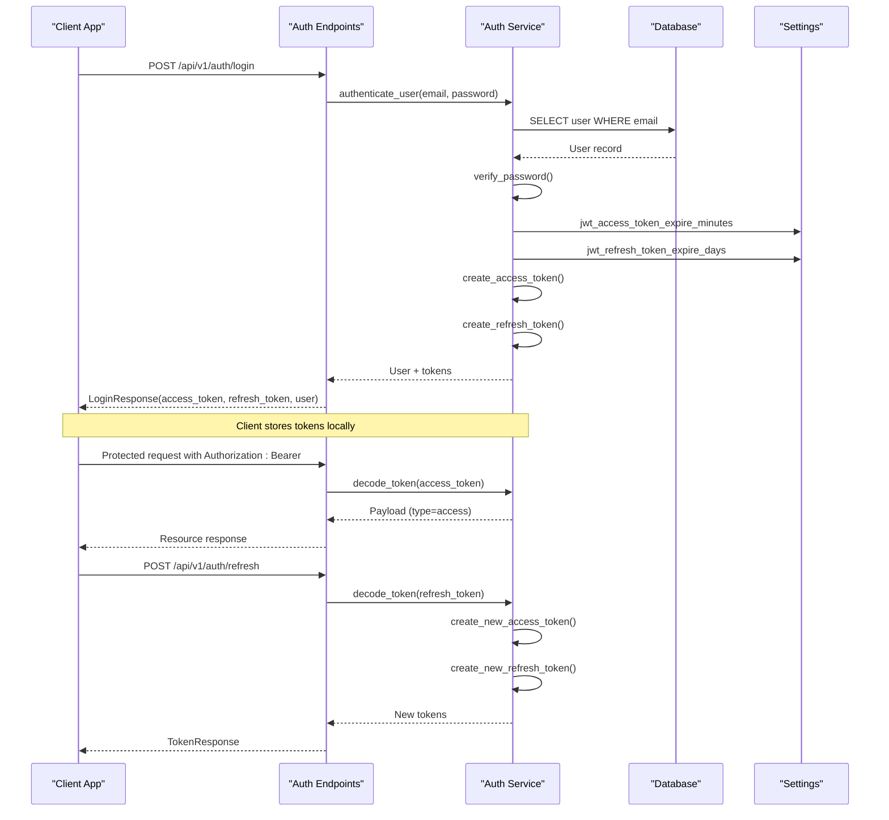
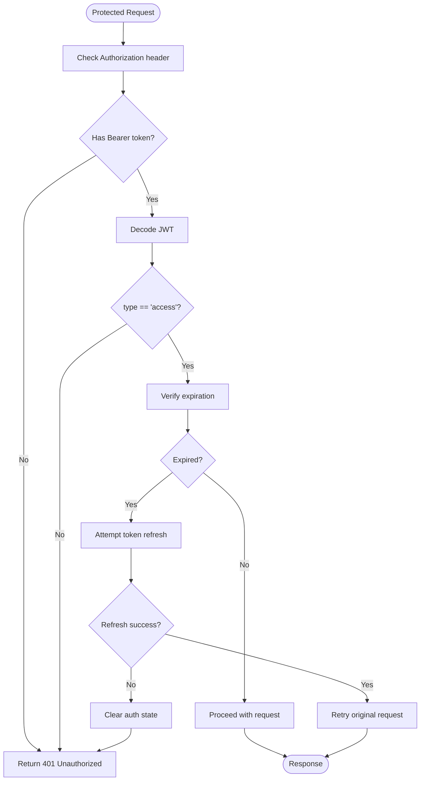
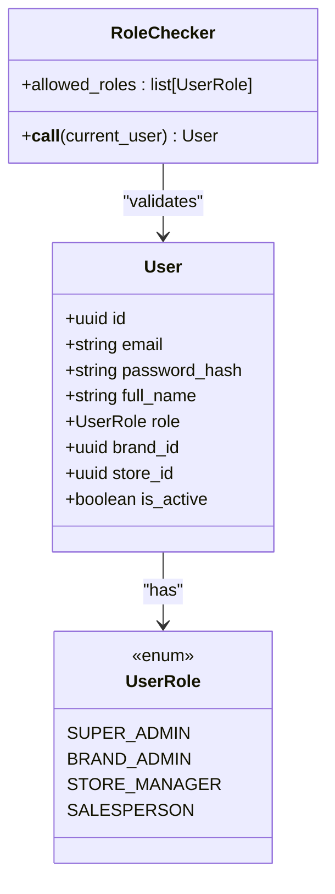
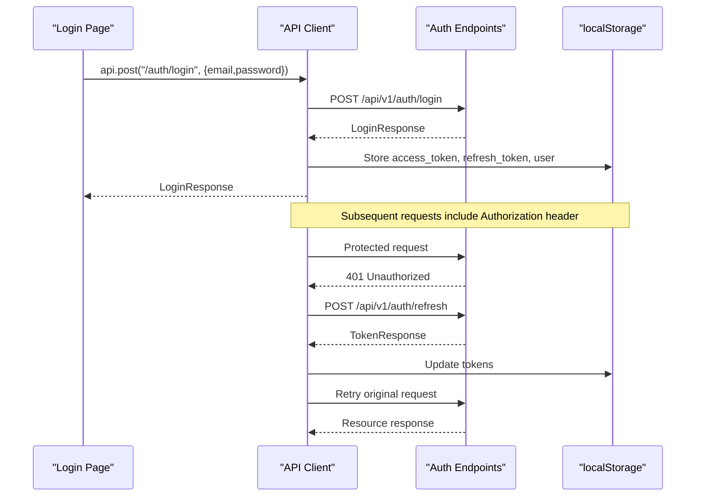
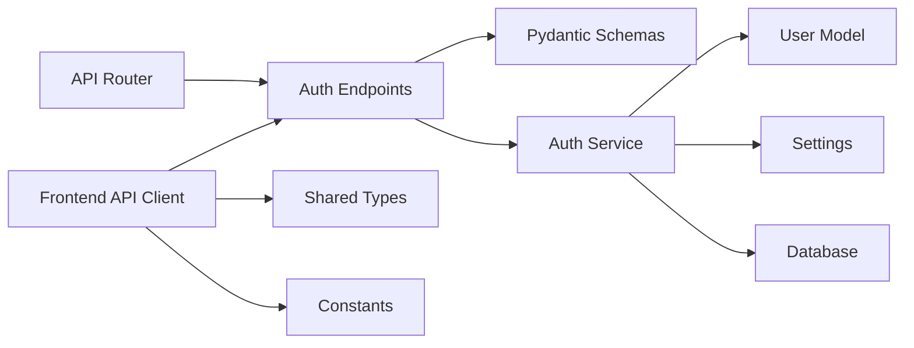

# Authentication API

<cite>
**Referenced Files in This Document**
- [auth.py](file://apps/api/src/api/v1/auth.py)
- [schemas/auth.py](file://apps/api/src/schemas/auth.py)
- [services/auth.py](file://apps/api/src/services/auth.py)
- [models/user.py](file://apps/api/src/models/user.py)
- [config.py](file://apps/api/src/config.py)
- [deps.py](file://apps/api/src/api/deps.py)
- [router.py](file://apps/api/src/api/v1/router.py)
- [api-client.ts](file://apps/web/src/lib/api-client.ts)
- [page.tsx](file://apps/web/src/app/(auth)/login/page.tsx)
- [middleware.ts](file://apps/web/src/middleware.ts)
- [api-types.ts](file://packages/shared/src/api-types.ts)
- [constants.ts](file://packages/shared/src/constants.ts)
</cite>

## Table of Contents
1. [Introduction](#introduction)
2. [Project Structure](#project-structure)
3. [Core Components](#core-components)
4. [Architecture Overview](#architecture-overview)
5. [Detailed Component Analysis](#detailed-component-analysis)
6. [Dependency Analysis](#dependency-analysis)
7. [Performance Considerations](#performance-considerations)
8. [Troubleshooting Guide](#troubleshooting-guide)
9. [Conclusion](#conclusion)
10. [Appendices](#appendices)

## Introduction
This document provides comprehensive API documentation for the authentication system. It covers all authentication endpoints (login, token refresh, logout), request/response schemas using Pydantic models, JWT token management, role-based access control, session handling, and security considerations. It also includes authentication flow diagrams, error response codes, and integration examples for client applications.

## Project Structure
The authentication system is implemented in the FastAPI backend under apps/api/src and consumed by the Next.js frontend under apps/web. The key components are organized as follows:
- API endpoints: apps/api/src/api/v1/auth.py
- Pydantic schemas: apps/api/src/schemas/auth.py
- Business logic: apps/api/src/services/auth.py
- User model and roles: apps/api/src/models/user.py
- Global settings: apps/api/src/config.py
- Dependency injection and RBAC: apps/api/src/api/deps.py
- API router composition: apps/api/src/api/v1/router.py
- Frontend API client: apps/web/src/lib/api-client.ts
- Login page integration: apps/web/src/app/(auth)/login/page.tsx
- Shared types: packages/shared/src/api-types.ts and packages/shared/src/constants.ts

**Diagram sources**
- [router.py:11-20](file://apps/api/src/api/v1/router.py#L11-L20)
- [auth.py:21-82](file://apps/api/src/api/v1/auth.py#L21-L82)
- [schemas/auth.py:1-36](file://apps/api/src/schemas/auth.py#L1-L36)
- [services/auth.py:1-55](file://apps/api/src/services/auth.py#L1-L55)
- [models/user.py:12-48](file://apps/api/src/models/user.py#L12-L48)
- [config.py:4-52](file://apps/api/src/config.py#L4-L52)
- [deps.py:1-63](file://apps/api/src/api/deps.py#L1-L63)
- [api-client.ts:1-113](file://apps/web/src/lib/api-client.ts#L1-L113)
- [page.tsx:14-40](file://apps/web/src/app/(auth)/login/page.tsx#L14-L40)
- [api-types.ts:5-28](file://packages/shared/src/api-types.ts#L5-L28)
- [constants.ts:3-10](file://packages/shared/src/constants.ts#L3-L10)

**Section sources**
- [router.py:11-20](file://apps/api/src/api/v1/router.py#L11-L20)
- [auth.py:21-82](file://apps/api/src/api/v1/auth.py#L21-L82)
- [schemas/auth.py:1-36](file://apps/api/src/schemas/auth.py#L1-L36)
- [services/auth.py:1-55](file://apps/api/src/services/auth.py#L1-L55)
- [models/user.py:12-48](file://apps/api/src/models/user.py#L12-L48)
- [config.py:4-52](file://apps/api/src/config.py#L4-L52)
- [deps.py:1-63](file://apps/api/src/api/deps.py#L1-L63)
- [api-client.ts:1-113](file://apps/web/src/lib/api-client.ts#L1-L113)
- [page.tsx:14-40](file://apps/web/src/app/(auth)/login/page.tsx#L14-L40)
- [api-types.ts:5-28](file://packages/shared/src/api-types.ts#L5-L28)
- [constants.ts:3-10](file://packages/shared/src/constants.ts#L3-L10)

## Core Components
- Authentication endpoints:
  - POST /api/v1/auth/login
  - POST /api/v1/auth/refresh
  - POST /api/v1/auth/logout
- Pydantic models for request/response schemas
- JWT token creation, decoding, and verification
- Password hashing and verification
- Role-based access control (RBAC) utilities
- Frontend API client handling token refresh and 401 errors

Key responsibilities:
- Validate credentials and issue signed JWT tokens
- Manage access and refresh tokens with expiration policies
- Enforce RBAC using role checkers
- Provide secure token refresh and logout semantics

**Section sources**
- [auth.py:24-82](file://apps/api/src/api/v1/auth.py#L24-L82)
- [schemas/auth.py:4-36](file://apps/api/src/schemas/auth.py#L4-L36)
- [services/auth.py:14-55](file://apps/api/src/services/auth.py#L14-L55)
- [models/user.py:12-17](file://apps/api/src/models/user.py#L12-L17)
- [deps.py:41-63](file://apps/api/src/api/deps.py#L41-L63)

## Architecture Overview
The authentication system uses stateless JWT tokens. Access tokens are short-lived and used for protected API requests. Refresh tokens are long-lived and used to obtain new access tokens. RBAC enforces role-based permissions on protected endpoints.

**Diagram sources**
- [auth.py:24-82](file://apps/api/src/api/v1/auth.py#L24-L82)
- [services/auth.py:14-55](file://apps/api/src/services/auth.py#L14-L55)
- [config.py:18-22](file://apps/api/src/config.py#L18-L22)
- [api-client.ts:18-37](file://apps/web/src/lib/api-client.ts#L18-L37)

## Detailed Component Analysis

### Authentication Endpoints

#### POST /api/v1/auth/login
- Purpose: Authenticate user and issue access and refresh tokens
- Authentication: None (public endpoint)
- Request body: LoginRequest
- Response: LoginResponse
- Security considerations:
  - Returns 401 Unauthorized for invalid credentials
  - Uses bcrypt for password verification
  - Issues JWT with access and refresh tokens

Request schema (LoginRequest):
- email: string
- password: string

Response schema (LoginResponse):
- access_token: string
- refresh_token: string
- token_type: "bearer"
- user: UserResponse

UserResponse:
- id: string
- email: string
- full_name: string
- role: string (one of SUPER_ADMIN, BRAND_ADMIN, STORE_MANAGER, SALESPERSON)
- brand_id: string | null
- store_id: string | null

HTTP status codes:
- 200 OK on successful login
- 401 Unauthorized on invalid credentials

**Section sources**
- [auth.py:24-48](file://apps/api/src/api/v1/auth.py#L24-L48)
- [schemas/auth.py:4-27](file://apps/api/src/schemas/auth.py#L4-L27)
- [models/user.py:12-17](file://apps/api/src/models/user.py#L12-L17)

#### POST /api/v1/auth/refresh
- Purpose: Exchange refresh token for new access and refresh tokens
- Authentication: None (public endpoint)
- Request body: RefreshRequest
- Response: TokenResponse
- Security considerations:
  - Validates token type equals "refresh"
  - Verifies JWT signature and expiration
  - Returns 401 Unauthorized for invalid/expired refresh tokens

Request schema (RefreshRequest):
- refresh_token: string

Response schema (TokenResponse):
- access_token: string
- refresh_token: string
- token_type: "bearer"

HTTP status codes:
- 200 OK on successful refresh
- 401 Unauthorized on invalid or expired refresh token

**Section sources**
- [auth.py:51-74](file://apps/api/src/api/v1/auth.py#L51-L74)
- [schemas/auth.py:30-12](file://apps/api/src/schemas/auth.py#L30-L12)
- [services/auth.py:36-41](file://apps/api/src/services/auth.py#L36-L41)

#### POST /api/v1/auth/logout
- Purpose: Invalidate current session (stateless JWT)
- Authentication: None (public endpoint)
- Request body: None
- Response: MessageResponse
- Security considerations:
  - Stateless JWT: client discards tokens
  - In production, consider adding refresh tokens to a blocklist in Redis

Response schema (MessageResponse):
- message: string

HTTP status codes:
- 200 OK on successful logout

**Section sources**
- [auth.py:77-82](file://apps/api/src/api/v1/auth.py#L77-L82)
- [schemas/auth.py:34-36](file://apps/api/src/schemas/auth.py#L34-L36)

### JWT Token Management
- Access token expiration: configured via jwt_access_token_expire_minutes (default 15 minutes)
- Refresh token expiration: configured via jwt_refresh_token_expire_days (default 7 days)
- Algorithm: HS256 using jwt_secret
- Token payload includes:
  - sub: user ID
  - exp: expiration timestamp
  - type: "access" or "refresh"

Token lifecycle:
- On login: issue access_token and refresh_token
- On protected request: validate access_token (type=access)
- On 401 Unauthorized: attempt refresh using stored refresh_token
- On successful refresh: retry original request

**Diagram sources**
- [services/auth.py:22-41](file://apps/api/src/services/auth.py#L22-L41)
- [api-client.ts:44-75](file://apps/web/src/lib/api-client.ts#L44-L75)

**Section sources**
- [services/auth.py:22-41](file://apps/api/src/services/auth.py#L22-L41)
- [config.py:18-22](file://apps/api/src/config.py#L18-L22)
- [api-client.ts:18-37](file://apps/web/src/lib/api-client.ts#L18-L37)

### Role-Based Access Control (RBAC)
- User roles defined in UserRole enum: SUPER_ADMIN, BRAND_ADMIN, STORE_MANAGER, SALESPERSON
- Current user extraction validates access tokens and loads user from DB
- RoleChecker utility enforces allowed roles per endpoint
- Pre-built role checkers:
  - require_super_admin: SUPER_ADMIN only
  - require_brand_admin_up: SUPER_ADMIN, BRAND_ADMIN
  - require_store_manager_up: SUPER_ADMIN, BRAND_ADMIN, STORE_MANAGER
  - require_salesperson_up: SUPER_ADMIN, BRAND_ADMIN, STORE_MANAGER, SALESPERSON

**Diagram sources**
- [models/user.py:12-48](file://apps/api/src/models/user.py#L12-L48)
- [deps.py:41-63](file://apps/api/src/api/deps.py#L41-L63)

**Section sources**
- [models/user.py:12-17](file://apps/api/src/models/user.py#L12-L17)
- [deps.py:41-63](file://apps/api/src/api/deps.py#L41-L63)

### Session Handling and Frontend Integration
- Frontend stores access_token and refresh_token in localStorage
- API client automatically attaches Authorization: Bearer header
- On 401 Unauthorized, attempts refresh using refresh_token
- On refresh failure, clears auth state and redirects to login
- Login page posts to /api/v1/auth/login and persists tokens

**Diagram sources**
- [page.tsx:22-40](file://apps/web/src/app/(auth)/login/page.tsx#L22-L40)
- [api-client.ts:18-37](file://apps/web/src/lib/api-client.ts#L18-L37)
- [auth.py:24-74](file://apps/api/src/api/v1/auth.py#L24-L74)

**Section sources**
- [api-client.ts:13-92](file://apps/web/src/lib/api-client.ts#L13-L92)
- [page.tsx:22-40](file://apps/web/src/app/(auth)/login/page.tsx#L22-L40)
- [middleware.ts:4-26](file://apps/web/src/middleware.ts#L4-L26)

### Password Hashing
- Passwords are hashed using bcrypt
- Verification compares plain password against stored hash
- Hashing occurs during user creation/update (outside the scope of this document)

Security considerations:
- bcrypt cost factor is managed by passlib context
- Never store plaintext passwords
- Use HTTPS in production

**Section sources**
- [services/auth.py:14-19](file://apps/api/src/services/auth.py#L14-L19)

## Dependency Analysis
The authentication system has clear separation of concerns:
- API endpoints depend on Pydantic schemas and service layer
- Services depend on models and configuration
- Dependencies enforce JWT decoding and user lookup
- Frontend depends on shared types and constants

**Diagram sources**
- [auth.py:21-82](file://apps/api/src/api/v1/auth.py#L21-L82)
- [schemas/auth.py:1-36](file://apps/api/src/schemas/auth.py#L1-L36)
- [services/auth.py:1-55](file://apps/api/src/services/auth.py#L1-L55)
- [models/user.py:1-48](file://apps/api/src/models/user.py#L1-L48)
- [config.py:4-52](file://apps/api/src/config.py#L4-L52)
- [router.py:11-20](file://apps/api/src/api/v1/router.py#L11-L20)
- [api-client.ts:1-113](file://apps/web/src/lib/api-client.ts#L1-L113)
- [api-types.ts:5-28](file://packages/shared/src/api-types.ts#L5-L28)
- [constants.ts:3-10](file://packages/shared/src/constants.ts#L3-L10)

**Section sources**
- [auth.py:21-82](file://apps/api/src/api/v1/auth.py#L21-L82)
- [services/auth.py:1-55](file://apps/api/src/services/auth.py#L1-L55)
- [models/user.py:1-48](file://apps/api/src/models/user.py#L1-L48)
- [config.py:4-52](file://apps/api/src/config.py#L4-L52)
- [router.py:11-20](file://apps/api/src/api/v1/router.py#L11-L20)
- [api-client.ts:1-113](file://apps/web/src/lib/api-client.ts#L1-L113)
- [api-types.ts:5-28](file://packages/shared/src/api-types.ts#L5-L28)
- [constants.ts:3-10](file://packages/shared/src/constants.ts#L3-L10)

## Performance Considerations
- JWT decoding is CPU-bound; keep secret key and algorithm simple
- Access tokens are short-lived to minimize risk window
- Refresh tokens are long-lived but validated on each refresh
- Consider caching user roles in Redis for frequent RBAC checks
- Use connection pooling for database access

## Troubleshooting Guide
Common issues and resolutions:
- 401 Unauthorized on login:
  - Verify email and password are correct
  - Ensure user is active
- 401 Unauthorized on protected requests:
  - Attempt token refresh automatically
  - If refresh fails, re-login
- 403 Forbidden on protected endpoints:
  - Insufficient permissions for requested role
  - Check role checker configuration
- Token expiration:
  - Access tokens expire after jwt_access_token_expire_minutes
  - Use refresh endpoint to obtain new tokens

Error response format:
- HTTP status codes indicate the type of error
- Detail messages provide human-readable reasons

**Section sources**
- [auth.py:27-31](file://apps/api/src/api/v1/auth.py#L27-L31)
- [auth.py:54-58](file://apps/api/src/api/v1/auth.py#L54-L58)
- [deps.py:47-50](file://apps/api/src/api/deps.py#L47-L50)
- [api-client.ts:77-86](file://apps/web/src/lib/api-client.ts#L77-L86)

## Conclusion
The authentication system provides secure, stateless JWT-based authentication with robust token lifecycle management, role-based access control, and seamless frontend integration. It follows security best practices including bcrypt password hashing, short-lived access tokens, and automatic token refresh handling.

## Appendices

### Endpoint Reference

- POST /api/v1/auth/login
  - Request: LoginRequest
  - Response: LoginResponse
  - Auth: None
  - RBAC: None

- POST /api/v1/auth/refresh
  - Request: RefreshRequest
  - Response: TokenResponse
  - Auth: None
  - RBAC: None

- POST /api/v1/auth/logout
  - Request: None
  - Response: MessageResponse
  - Auth: None
  - RBAC: None

### Pydantic Models

LoginRequest:
- email: string
- password: string

TokenResponse:
- access_token: string
- refresh_token: string
- token_type: "bearer"

UserResponse:
- id: string
- email: string
- full_name: string
- role: string
- brand_id: string | null
- store_id: string | null

LoginResponse:
- Inherits TokenResponse
- user: UserResponse

RefreshRequest:
- refresh_token: string

MessageResponse:
- message: string

**Section sources**
- [schemas/auth.py:4-36](file://apps/api/src/schemas/auth.py#L4-L36)

### Security Best Practices
- Change jwt_secret in production
- Use HTTPS in production
- Implement rate limiting on login endpoint
- Add refresh token rotation in production
- Consider adding refresh tokens to a blocklist in Redis
- Regularly audit user roles and permissions

**Section sources**
- [config.py:18-20](file://apps/api/src/config.py#L18-L20)
- [auth.py:79-81](file://apps/api/src/api/v1/auth.py#L79-L81)