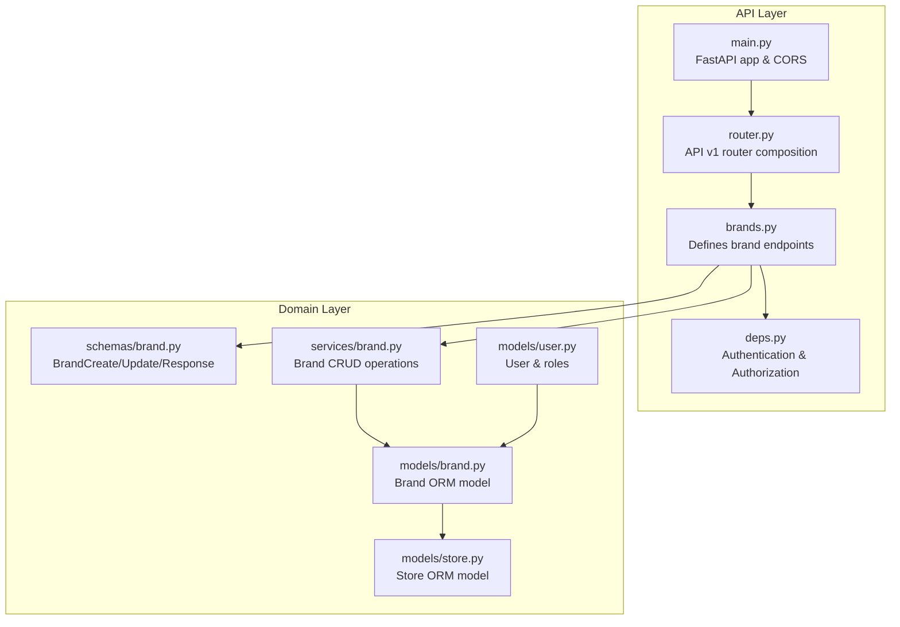
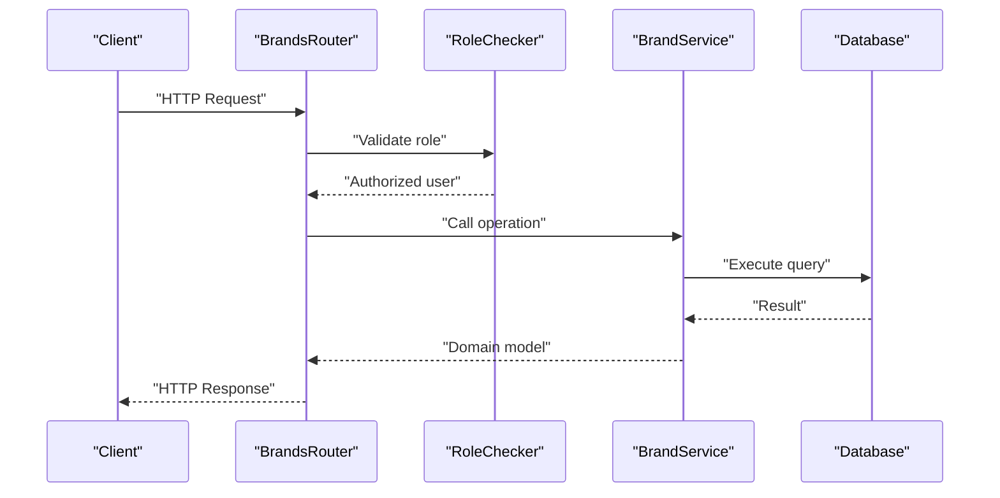
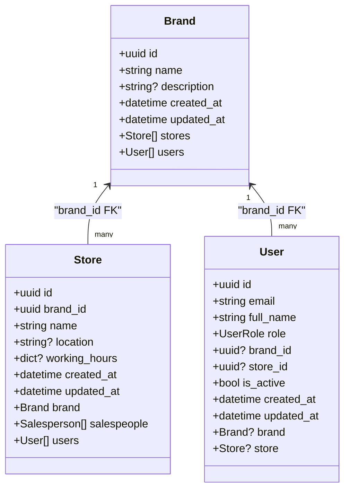
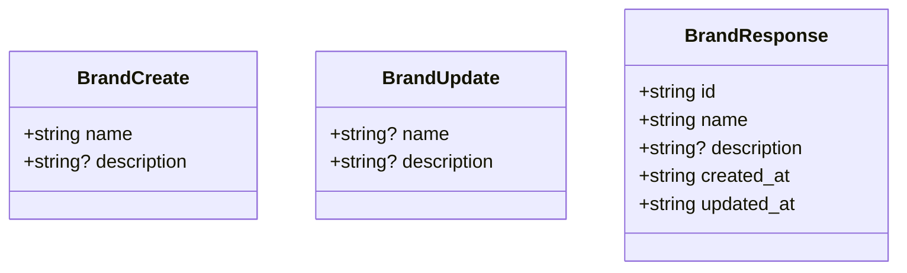
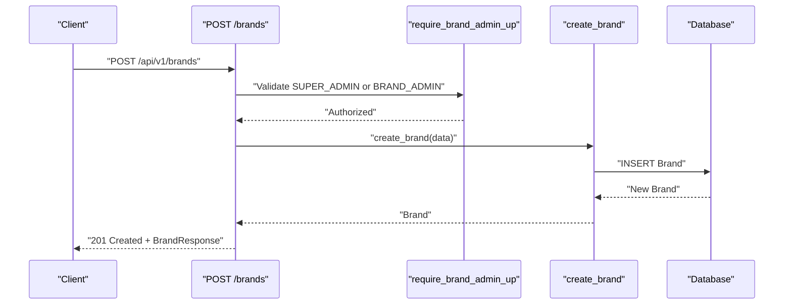
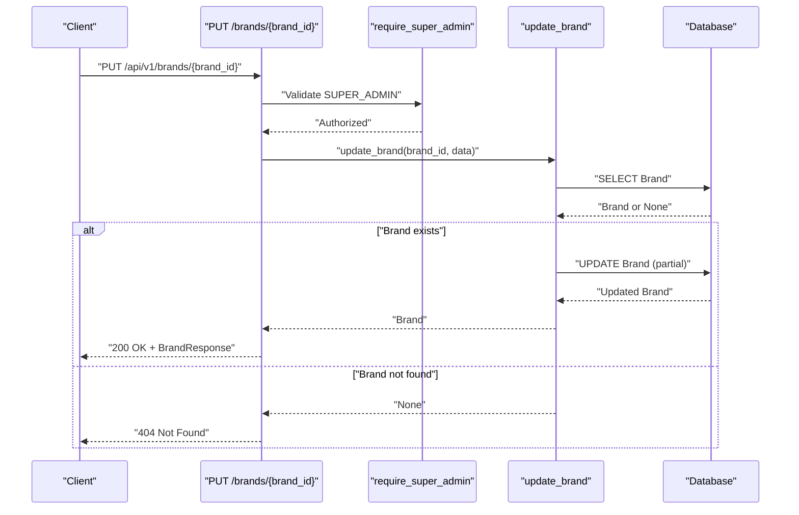
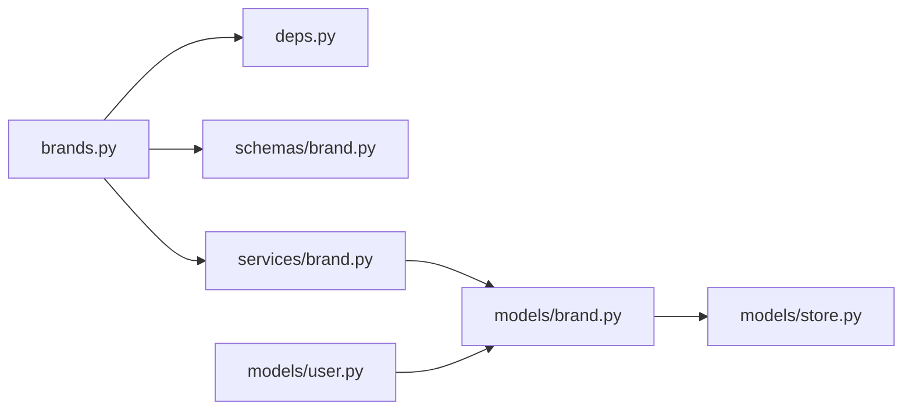

# Brand Management API

<cite>
**Referenced Files in This Document**
- [apps/api/src/api/v1/brands.py](file://apps/api/src/api/v1/brands.py)
- [apps/api/src/schemas/brand.py](file://apps/api/src/schemas/brand.py)
- [apps/api/src/models/brand.py](file://apps/api/src/models/brand.py)
- [apps/api/src/services/brand.py](file://apps/api/src/services/brand.py)
- [apps/api/src/api/v1/router.py](file://apps/api/src/api/v1/router.py)
- [apps/api/src/api/deps.py](file://apps/api/src/api/deps.py)
- [apps/api/src/models/user.py](file://apps/api/src/models/user.py)
- [apps/api/src/models/store.py](file://apps/api/src/models/store.py)
- [apps/api/src/main.py](file://apps/api/src/main.py)
</cite>

## Table of Contents
1. [Introduction](#introduction)
2. [Project Structure](#project-structure)
3. [Core Components](#core-components)
4. [Architecture Overview](#architecture-overview)
5. [Detailed Component Analysis](#detailed-component-analysis)
6. [Dependency Analysis](#dependency-analysis)
7. [Performance Considerations](#performance-considerations)
8. [Troubleshooting Guide](#troubleshooting-guide)
9. [Conclusion](#conclusion)

## Introduction
This document provides comprehensive API documentation for the brand management functionality. It covers all CRUD endpoints for brand entities, including creation, retrieval, updates, and deletion operations. It specifies HTTP methods, URL patterns, request/response schemas, validation rules, brand hierarchy relationships, organizational structure, data consistency requirements, nested resource operations, filtering capabilities, permissions, access control patterns, and audit trail requirements.

## Project Structure
The brand management API is implemented as part of the FastAPI application under the `/api/v1` route prefix. The key components involved in brand management are:
- Router module that defines endpoints for brands
- Pydantic schemas for request/response validation
- SQLAlchemy ORM models for persistence and relationships
- Service layer for business logic
- Authentication and authorization dependencies
- Application entry point and API router composition

**Diagram sources**
- [apps/api/src/api/v1/brands.py:1-53](file://apps/api/src/api/v1/brands.py#L1-L53)
- [apps/api/src/api/deps.py:1-63](file://apps/api/src/api/deps.py#L1-L63)
- [apps/api/src/api/v1/router.py:1-20](file://apps/api/src/api/v1/router.py#L1-L20)
- [apps/api/src/schemas/brand.py:1-22](file://apps/api/src/schemas/brand.py#L1-L22)
- [apps/api/src/services/brand.py:1-38](file://apps/api/src/services/brand.py#L1-L38)
- [apps/api/src/models/brand.py:1-26](file://apps/api/src/models/brand.py#L1-L26)
- [apps/api/src/models/user.py:1-48](file://apps/api/src/models/user.py#L1-L48)
- [apps/api/src/models/store.py:1-32](file://apps/api/src/models/store.py#L1-L32)
- [apps/api/src/main.py:1-29](file://apps/api/src/main.py#L1-L29)

**Section sources**
- [apps/api/src/api/v1/brands.py:1-53](file://apps/api/src/api/v1/brands.py#L1-L53)
- [apps/api/src/api/v1/router.py:1-20](file://apps/api/src/api/v1/router.py#L1-L20)
- [apps/api/src/main.py:1-29](file://apps/api/src/main.py#L1-L29)

## Core Components
This section documents the core brand management endpoints, their HTTP methods, URL patterns, request/response schemas, and validation rules.

- Endpoint: GET /api/v1/brands
  - Description: List all brands
  - Authentication: Requires SUPER_ADMIN role
  - Request: No body
  - Response: Array of BrandResponse objects
  - Validation: None (returns all brands ordered by creation date)
  - Notes: Super admin only

- Endpoint: POST /api/v1/brands
  - Description: Create a new brand
  - Authentication: Requires SUPER_ADMIN or BRAND_ADMIN role
  - Request: BrandCreate (name, optional description)
  - Response: BrandResponse
  - Validation: Name is required; description is optional
  - Notes: Returns newly created brand

- Endpoint: GET /api/v1/brands/{brand_id}
  - Description: Retrieve a single brand by ID
  - Authentication: Requires SUPER_ADMIN or BRAND_ADMIN role
  - Path Parameter: brand_id (UUID string)
  - Response: BrandResponse
  - Validation: brand_id must be a valid UUID string
  - Error: 404 Not Found if brand does not exist

- Endpoint: PUT /api/v1/brands/{brand_id}
  - Description: Update an existing brand
  - Authentication: Requires SUPER_ADMIN role
  - Path Parameter: brand_id (UUID string)
  - Request: BrandUpdate (optional fields: name, description)
  - Response: BrandResponse
  - Validation: Only provided fields are updated; brand_id must be valid
  - Error: 404 Not Found if brand does not exist

Notes:
- All endpoints return timestamps in ISO 8601 format via Pydantic serialization.
- The service layer performs partial updates by excluding unset fields from the update payload.

**Section sources**
- [apps/api/src/api/v1/brands.py:13-52](file://apps/api/src/api/v1/brands.py#L13-L52)
- [apps/api/src/schemas/brand.py:4-22](file://apps/api/src/schemas/brand.py#L4-L22)
- [apps/api/src/services/brand.py:10-38](file://apps/api/src/services/brand.py#L10-L38)

## Architecture Overview
The brand management API follows a layered architecture:
- API Router: Exposes endpoints and applies authentication/authorization
- Service Layer: Implements business logic and interacts with the database
- Data Models: Define persistence and relationships
- Schemas: Validate request/response payloads
- Authentication/Authorization: Enforce role-based access control

**Diagram sources**
- [apps/api/src/api/v1/brands.py:13-52](file://apps/api/src/api/v1/brands.py#L13-L52)
- [apps/api/src/api/deps.py:41-62](file://apps/api/src/api/deps.py#L41-L62)
- [apps/api/src/services/brand.py:10-38](file://apps/api/src/services/brand.py#L10-L38)

## Detailed Component Analysis

### Brand Entity Model
The Brand entity encapsulates brand metadata and maintains relationships with stores and users.

**Diagram sources**
- [apps/api/src/models/brand.py:10-26](file://apps/api/src/models/brand.py#L10-L26)
- [apps/api/src/models/store.py:11-32](file://apps/api/src/models/store.py#L11-L32)
- [apps/api/src/models/user.py:19-48](file://apps/api/src/models/user.py#L19-L48)

**Section sources**
- [apps/api/src/models/brand.py:10-26](file://apps/api/src/models/brand.py#L10-L26)
- [apps/api/src/models/store.py:11-32](file://apps/api/src/models/store.py#L11-L32)
- [apps/api/src/models/user.py:19-48](file://apps/api/src/models/user.py#L19-L48)

### Request/Response Schemas
BrandCreate and BrandUpdate define the shape of incoming requests, while BrandResponse defines outgoing responses.

**Diagram sources**
- [apps/api/src/schemas/brand.py:4-22](file://apps/api/src/schemas/brand.py#L4-L22)

**Section sources**
- [apps/api/src/schemas/brand.py:4-22](file://apps/api/src/schemas/brand.py#L4-L22)

### Endpoint Flow: Create Brand

**Diagram sources**
- [apps/api/src/api/v1/brands.py:21-27](file://apps/api/src/api/v1/brands.py#L21-L27)
- [apps/api/src/api/deps.py:55-56](file://apps/api/src/api/deps.py#L55-L56)
- [apps/api/src/services/brand.py:20-25](file://apps/api/src/services/brand.py#L20-L25)

**Section sources**
- [apps/api/src/api/v1/brands.py:21-27](file://apps/api/src/api/v1/brands.py#L21-L27)
- [apps/api/src/services/brand.py:20-25](file://apps/api/src/services/brand.py#L20-L25)

### Endpoint Flow: Update Brand

**Diagram sources**
- [apps/api/src/api/v1/brands.py:42-52](file://apps/api/src/api/v1/brands.py#L42-L52)
- [apps/api/src/api/deps.py:55](file://apps/api/src/api/deps.py#L55)
- [apps/api/src/services/brand.py:28-37](file://apps/api/src/services/brand.py#L28-L37)

**Section sources**
- [apps/api/src/api/v1/brands.py:42-52](file://apps/api/src/api/v1/brands.py#L42-L52)
- [apps/api/src/services/brand.py:28-37](file://apps/api/src/services/brand.py#L28-L37)

### Nested Resource Operations
- Stores under a brand: The Brand model defines a relationship to Store entities with cascade delete-orphan enabled. While the brands endpoint does not expose a dedicated nested route, the relationship is enforced at the database level. Deleting a brand will remove associated stores and their dependent entities per the cascade policy.
- Users under a brand: Brand maintains a relationship to User entities. Users are linked to brands via foreign keys, enabling filtering and reporting by brand.

Practical implications:
- Bulk deletion of stores is implicitly supported through brand deletion.
- Filtering by brand is available through user records and store records.

**Section sources**
- [apps/api/src/models/brand.py:24-25](file://apps/api/src/models/brand.py#L24-L25)
- [apps/api/src/models/store.py:27](file://apps/api/src/models/store.py#L27)
- [apps/api/src/models/user.py:31-36](file://apps/api/src/models/user.py#L31-L36)

### Filtering Capabilities
- Sorting: Listing brands is sorted by creation date in descending order.
- Filtering: No explicit query parameters are supported in the brands endpoint. Filtering can be implemented at the application layer by extending the service and router.

**Section sources**
- [apps/api/src/services/brand.py:10-12](file://apps/api/src/services/brand.py#L10-L12)
- [apps/api/src/api/v1/brands.py:13-18](file://apps/api/src/api/v1/brands.py#L13-L18)

### Audit Trail Requirements
- Timestamps: Both Brand and related entities include created_at and updated_at fields, populated automatically by the database server default and onupdate triggers.
- Serialization: Responses include ISO 8601 formatted timestamps via Pydantic model configuration.

**Section sources**
- [apps/api/src/models/brand.py:16-21](file://apps/api/src/models/brand.py#L16-L21)
- [apps/api/src/schemas/brand.py:18-19](file://apps/api/src/schemas/brand.py#L18-L19)

## Dependency Analysis
The brand management module depends on:
- Authentication and authorization via RoleChecker with pre-defined role sets
- Service layer for database operations
- Pydantic schemas for validation
- SQLAlchemy models for persistence and relationships

**Diagram sources**
- [apps/api/src/api/v1/brands.py:1-8](file://apps/api/src/api/v1/brands.py#L1-L8)
- [apps/api/src/api/deps.py:41-62](file://apps/api/src/api/deps.py#L41-L62)
- [apps/api/src/schemas/brand.py:1-22](file://apps/api/src/schemas/brand.py#L1-L22)
- [apps/api/src/services/brand.py:1-8](file://apps/api/src/services/brand.py#L1-L8)
- [apps/api/src/models/brand.py:1-26](file://apps/api/src/models/brand.py#L1-L26)
- [apps/api/src/models/store.py:1-32](file://apps/api/src/models/store.py#L1-L32)
- [apps/api/src/models/user.py:1-48](file://apps/api/src/models/user.py#L1-L48)

**Section sources**
- [apps/api/src/api/v1/brands.py:1-8](file://apps/api/src/api/v1/brands.py#L1-L8)
- [apps/api/src/api/deps.py:41-62](file://apps/api/src/api/deps.py#L41-L62)
- [apps/api/src/services/brand.py:1-8](file://apps/api/src/services/brand.py#L1-L8)

## Performance Considerations
- Asynchronous operations: The service layer uses async SQLAlchemy sessions, which improve concurrency for I/O-bound operations.
- Minimal queries: The list_brands endpoint executes a single SELECT with ordering; update_brand performs a targeted UPDATE with partial field updates.
- Cascading deletes: Deletion of a brand removes associated stores and their dependents efficiently at the database level.

[No sources needed since this section provides general guidance]

## Troubleshooting Guide
Common issues and resolutions:
- 401 Unauthorized: Ensure a valid Bearer token is included in the Authorization header and corresponds to an active user.
- 403 Forbidden: Verify the user’s role meets the required threshold (SUPER_ADMIN or SUPER_ADMIN/BRAND_ADMIN depending on endpoint).
- 404 Not Found: Occurs when retrieving or updating a brand with an invalid or non-existent ID.
- Validation errors: Ensure request bodies conform to BrandCreate or BrandUpdate schemas.

**Section sources**
- [apps/api/src/api/deps.py:12-38](file://apps/api/src/api/deps.py#L12-L38)
- [apps/api/src/api/v1/brands.py:36-38](file://apps/api/src/api/v1/brands.py#L36-L38)
- [apps/api/src/api/v1/brands.py:49-51](file://apps/api/src/api/v1/brands.py#L49-L51)

## Conclusion
The brand management API provides a focused set of CRUD endpoints with clear role-based access control and robust data relationships. It supports listing, creating, retrieving, and updating brands, with automatic audit trails via timestamps. The underlying models enforce referential integrity and cascading deletions for stores. Extending the API with filtering, bulk operations, and deletion endpoints would further enhance operational capabilities.