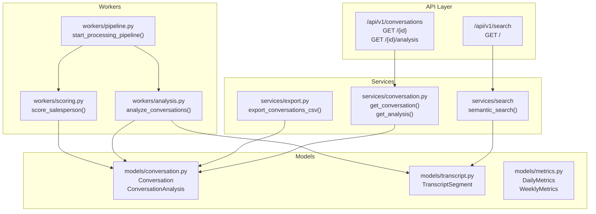
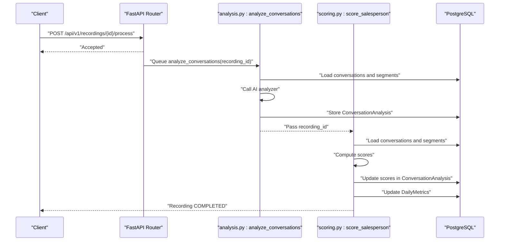
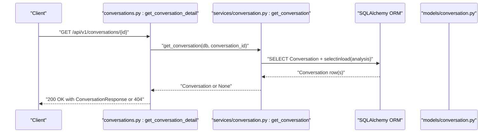
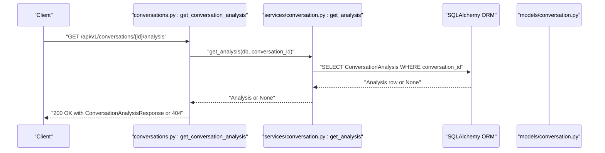
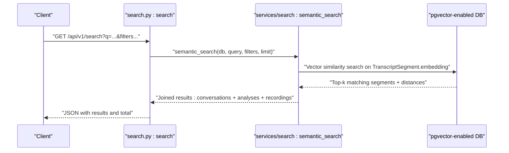
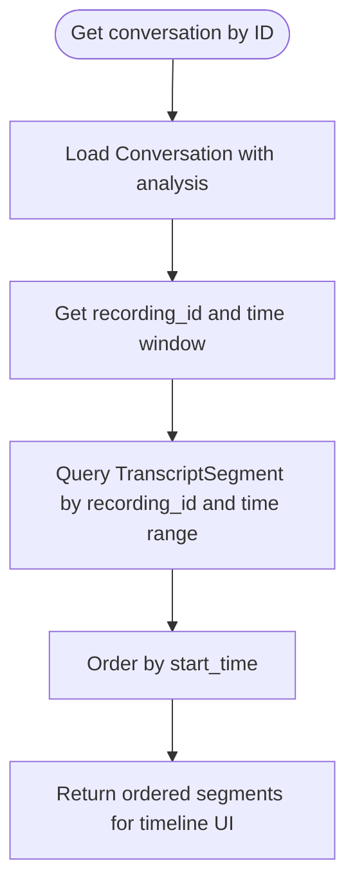
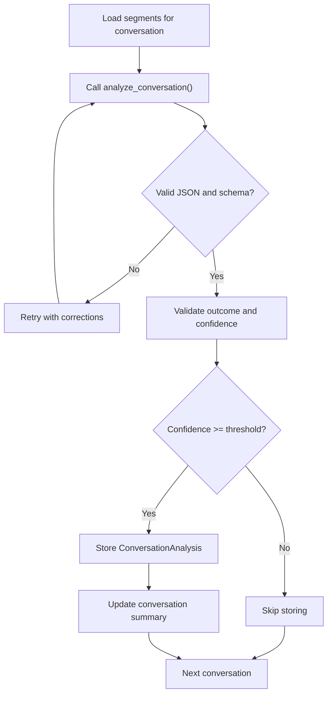
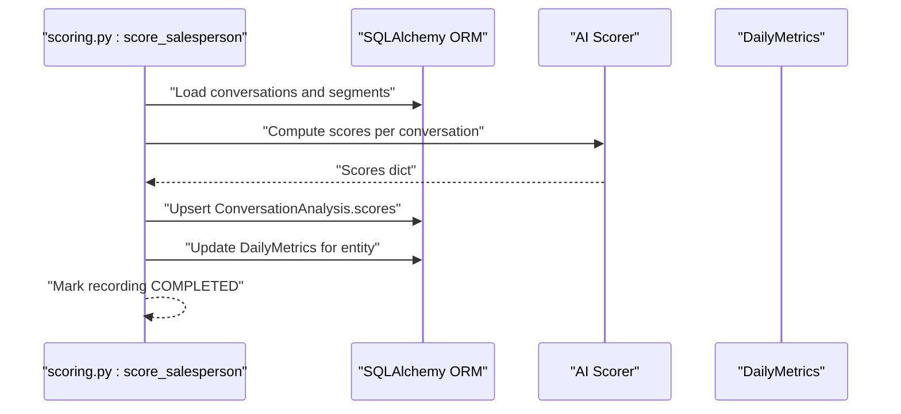
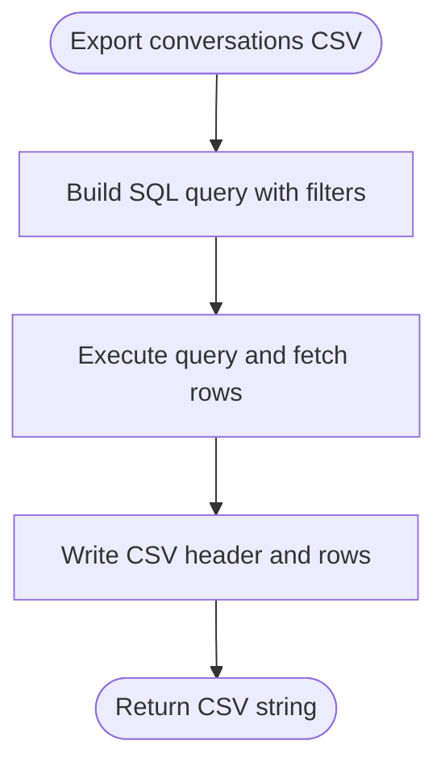
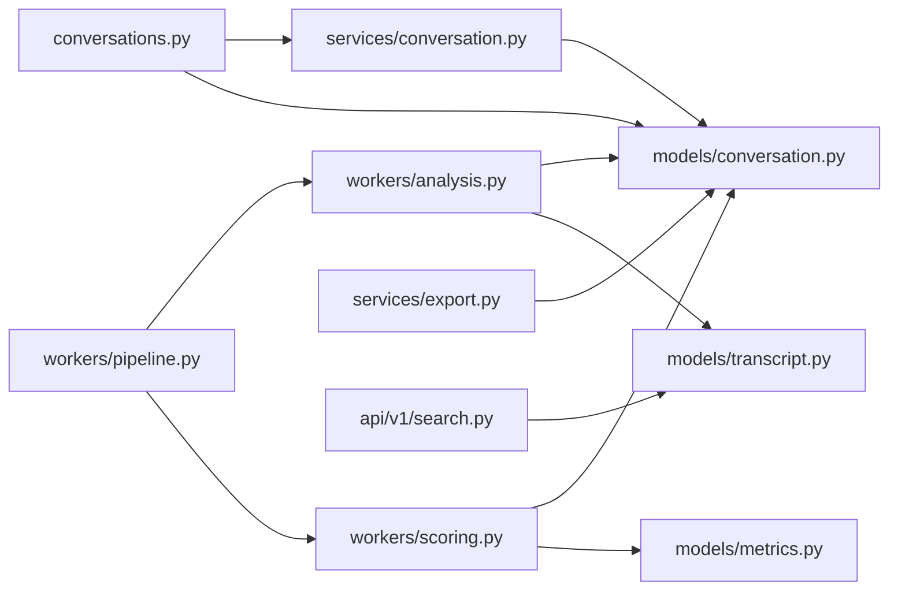

# Conversation Analysis API

<cite>
**Referenced Files in This Document**
- [conversations.py](file://apps/api/src/api/v1/conversations.py)
- [router.py](file://apps/api/src/api/v1/router.py)
- [conversation.py](file://apps/api/src/models/conversation.py)
- [conversation.py](file://apps/api/src/schemas/conversation.py)
- [conversation.py](file://apps/api/src/services/conversation.py)
- [analyzer.py](file://apps/api/src/ai/analyzer.py)
- [analysis.py](file://apps/api/src/workers/analysis.py)
- [scoring.py](file://apps/api/src/workers/scoring.py)
- [pipeline.py](file://apps/api/src/workers/pipeline.py)
- [export.py](file://apps/api/src/services/export.py)
- [search.py](file://apps/api/src/api/v1/search.py)
- [transcript.py](file://apps/api/src/models/transcript.py)
- [metrics.py](file://apps/api/src/models/metrics.py)
</cite>

## Table of Contents
1. [Introduction](#introduction)
2. [Project Structure](#project-structure)
3. [Core Components](#core-components)
4. [Architecture Overview](#architecture-overview)
5. [Detailed Component Analysis](#detailed-component-analysis)
6. [Dependency Analysis](#dependency-analysis)
7. [Performance Considerations](#performance-considerations)
8. [Troubleshooting Guide](#troubleshooting-guide)
9. [Conclusion](#conclusion)
10. [Appendices](#appendices)

## Introduction
This document provides comprehensive API documentation for the conversation analysis functionality. It covers endpoints for retrieving conversation transcripts, analysis results, and performance metrics. It specifies HTTP methods, URL patterns, request/response schemas, and filtering capabilities. It also details conversation timeline retrieval, AI-generated insights, and coaching recommendations. Examples include transcript querying, sentiment analysis results, and conversation segmentation. Finally, it documents conversation-level permissions, data privacy controls, and export capabilities for analysis results.

## Project Structure
The conversation analysis API is implemented as part of the FastAPI backend under apps/api. Key areas include:
- API routes for conversations and search
- SQLAlchemy models for conversations, transcript segments, and metrics
- Pydantic schemas for request/response serialization
- Services for fetching conversation data
- Workers orchestrating AI analysis and scoring
- Export service for CSV exports
- Search endpoint leveraging pgvector embeddings

**Diagram sources**
- [conversations.py:10-34](file://apps/api/src/api/v1/conversations.py#L10-L34)
- [router.py:11-19](file://apps/api/src/api/v1/router.py#L11-L19)
- [conversation.py:11-60](file://apps/api/src/models/conversation.py#L11-L60)
- [transcript.py:10-26](file://apps/api/src/models/transcript.py#L10-L26)
- [metrics.py:10-39](file://apps/api/src/models/metrics.py#L10-L39)
- [conversation.py:10-25](file://apps/api/src/services/conversation.py#L10-L25)
- [export.py:49-99](file://apps/api/src/services/export.py#L49-L99)
- [search.py:14-98](file://apps/api/src/api/v1/search.py#L14-L98)
- [analysis.py:152-241](file://apps/api/src/workers/analysis.py#L152-L241)
- [scoring.py:235-313](file://apps/api/src/workers/scoring.py#L235-L313)
- [pipeline.py:12-34](file://apps/api/src/workers/pipeline.py#L12-L34)

**Section sources**
- [router.py:11-19](file://apps/api/src/api/v1/router.py#L11-L19)
- [conversations.py:10-34](file://apps/api/src/api/v1/conversations.py#L10-L34)

## Core Components
- Conversation retrieval endpoint: GET /api/v1/conversations/{conversation_id}
- Conversation analysis endpoint: GET /api/v1/conversations/{conversation_id}/analysis
- Semantic search endpoint: GET /api/v1/search
- Export endpoint: CSV export of conversations and metrics
- Pipeline orchestration: preprocessing → transcription → diarization → segmentation → analysis → scoring

Key schemas:
- ConversationResponse: includes identifiers, timing, segment count, optional summary, and creation timestamp
- ConversationAnalysisResponse: includes intent, products, budget, objections, competitors, closing attempt flag, outcome, confidence, scores dictionary, summary, coaching notes, and creation timestamp

**Section sources**
- [conversations.py:13-34](file://apps/api/src/api/v1/conversations.py#L13-L34)
- [conversation.py:4-33](file://apps/api/src/schemas/conversation.py#L4-L33)
- [conversation.py:11-60](file://apps/api/src/models/conversation.py#L11-L60)

## Architecture Overview
The conversation analysis pipeline is asynchronous and orchestrated by Celery tasks. The API exposes read-only endpoints for retrieving conversation metadata and AI-generated insights. The pipeline stages are:
1. Preprocess audio
2. Transcribe audio
3. Diarize speakers
4. Segment conversations
5. Analyze conversations (intent, products, objections, outcome, etc.)
6. Score performance across five dimensions
7. Export results and update metrics

**Diagram sources**
- [pipeline.py:12-34](file://apps/api/src/workers/pipeline.py#L12-L34)
- [analysis.py:152-241](file://apps/api/src/workers/analysis.py#L152-L241)
- [scoring.py:235-313](file://apps/api/src/workers/scoring.py#L235-L313)
- [conversation.py:35-60](file://apps/api/src/models/conversation.py#L35-L60)
- [metrics.py:10-39](file://apps/api/src/models/metrics.py#L10-L39)

## Detailed Component Analysis

### Conversation Retrieval Endpoint
- Method: GET
- Path: /api/v1/conversations/{conversation_id}
- Authentication: Requires salesperson role
- Response model: ConversationResponse
- Behavior:
  - Fetches a single conversation by UUID
  - Includes optional analysis loaded via eager loading
  - Returns 404 if not found

**Diagram sources**
- [conversations.py:13-22](file://apps/api/src/api/v1/conversations.py#L13-L22)
- [conversation.py:10-16](file://apps/api/src/services/conversation.py#L10-L16)
- [conversation.py:11-32](file://apps/api/src/models/conversation.py#L11-L32)

**Section sources**
- [conversations.py:13-22](file://apps/api/src/api/v1/conversations.py#L13-L22)
- [conversation.py:10-16](file://apps/api/src/services/conversation.py#L10-L16)
- [conversation.py:11-32](file://apps/api/src/models/conversation.py#L11-L32)

### Conversation Analysis Endpoint
- Method: GET
- Path: /api/v1/conversations/{conversation_id}/analysis
- Authentication: Requires salesperson role
- Response model: ConversationAnalysisResponse
- Behavior:
  - Retrieves the analysis associated with a conversation
  - Returns 404 if not found

**Diagram sources**
- [conversations.py:25-34](file://apps/api/src/api/v1/conversations.py#L25-L34)
- [conversation.py:19-25](file://apps/api/src/services/conversation.py#L19-L25)
- [conversation.py:35-60](file://apps/api/src/models/conversation.py#L35-L60)

**Section sources**
- [conversations.py:25-34](file://apps/api/src/api/v1/conversations.py#L25-L34)
- [conversation.py:19-25](file://apps/api/src/services/conversation.py#L19-L25)
- [conversation.py:35-60](file://apps/api/src/models/conversation.py#L35-L60)

### Semantic Search Endpoint
- Method: GET
- Path: /api/v1/search
- Query parameters:
  - q: search query (required)
  - date_from: ISO date string
  - date_to: ISO date string
  - store_id: UUID filter
  - salesperson_id: UUID filter
  - outcome: enum filter (e.g., SALE_MADE, LOST, FOLLOW_UP_NEEDED)
  - limit: integer between 1 and 100
- Response: array of records containing conversation, analysis, recording, relevant_segments, and similarity_score
- Behavior:
  - Performs vector similarity search on transcript segments
  - Filters by date range, store, salesperson, and outcome
  - Returns paginated results

**Diagram sources**
- [search.py:14-98](file://apps/api/src/api/v1/search.py#L14-L98)
- [transcript.py:20-21](file://apps/api/src/models/transcript.py#L20-L21)

**Section sources**
- [search.py:14-98](file://apps/api/src/api/v1/search.py#L14-L98)
- [transcript.py:10-26](file://apps/api/src/models/transcript.py#L10-L26)

### Conversation Timeline Retrieval
- Timeline data is derived from TranscriptSegment entries linked to a recording and conversation time windows.
- Segments are ordered by start_time and include speaker labels, timestamps, and text.
- The conversation endpoint loads analysis along with the conversation, enabling timeline-aware insights.

**Diagram sources**
- [conversation.py:10-16](file://apps/api/src/services/conversation.py#L10-L16)
- [analysis.py:46-87](file://apps/api/src/workers/analysis.py#L46-L87)
- [transcript.py:10-26](file://apps/api/src/models/transcript.py#L10-L26)

**Section sources**
- [analysis.py:46-87](file://apps/api/src/workers/analysis.py#L46-L87)
- [transcript.py:10-26](file://apps/api/src/models/transcript.py#L10-L26)

### AI-Generated Insights and Coaching Recommendations
- Analysis pipeline:
  - Loads conversation segments within the conversation’s time window
  - Calls the AI analyzer to produce structured insights
  - Validates and stores results if confidence meets threshold
  - Updates conversation summary
- Analysis fields include intent, products, budget, objections, competitors, closing attempt, outcome, confidence, summary, and coaching notes.

**Diagram sources**
- [analysis.py:152-241](file://apps/api/src/workers/analysis.py#L152-L241)
- [analyzer.py:47-116](file://apps/api/src/ai/analyzer.py#L47-L116)
- [conversation.py:35-60](file://apps/api/src/models/conversation.py#L35-L60)

**Section sources**
- [analyzer.py:16-44](file://apps/api/src/ai/analyzer.py#L16-L44)
- [analysis.py:152-241](file://apps/api/src/workers/analysis.py#L152-L241)
- [conversation.py:35-60](file://apps/api/src/models/conversation.py#L35-L60)

### Performance Metrics and Scoring
- Scoring computes five-dimensional scores per conversation (e.g., greeting, discovery, product knowledge, objection handling, closing).
- Scores are stored in the analysis record’s scores JSONB field.
- Daily metrics are computed and upserted for entities (salesperson/store) based on completed recordings.

**Diagram sources**
- [scoring.py:235-313](file://apps/api/src/workers/scoring.py#L235-L313)
- [metrics.py:10-39](file://apps/api/src/models/metrics.py#L10-L39)

**Section sources**
- [scoring.py:235-313](file://apps/api/src/workers/scoring.py#L235-L313)
- [metrics.py:10-39](file://apps/api/src/models/metrics.py#L10-L39)

### Export Capabilities
- CSV export of conversations and analyses supports filtering by recording_id and salesperson_id.
- Export includes conversation metadata, analysis fields, and performance scores extracted from the scores dictionary.

**Diagram sources**
- [export.py:49-99](file://apps/api/src/services/export.py#L49-L99)

**Section sources**
- [export.py:49-99](file://apps/api/src/services/export.py#L49-L99)

## Dependency Analysis
- API routers are mounted under /api/v1 and include conversations and search endpoints.
- Conversation retrieval depends on services that load models with relationships.
- Analysis and scoring workers depend on models for conversations, transcript segments, and metrics.
- Export service joins conversations with analyses and recordings.

**Diagram sources**
- [router.py:11-19](file://apps/api/src/api/v1/router.py#L11-L19)
- [conversations.py:10-34](file://apps/api/src/api/v1/conversations.py#L10-L34)
- [conversation.py:10-25](file://apps/api/src/services/conversation.py#L10-L25)
- [conversation.py:11-60](file://apps/api/src/models/conversation.py#L11-L60)
- [transcript.py:10-26](file://apps/api/src/models/transcript.py#L10-L26)
- [metrics.py:10-39](file://apps/api/src/models/metrics.py#L10-L39)
- [analysis.py:152-241](file://apps/api/src/workers/analysis.py#L152-L241)
- [scoring.py:235-313](file://apps/api/src/workers/scoring.py#L235-L313)
- [export.py:49-99](file://apps/api/src/services/export.py#L49-L99)
- [search.py:14-98](file://apps/api/src/api/v1/search.py#L14-L98)

**Section sources**
- [router.py:11-19](file://apps/api/src/api/v1/router.py#L11-L19)
- [conversation.py:10-25](file://apps/api/src/services/conversation.py#L10-L25)
- [analysis.py:152-241](file://apps/api/src/workers/analysis.py#L152-L241)
- [scoring.py:235-313](file://apps/api/src/workers/scoring.py#L235-L313)
- [export.py:49-99](file://apps/api/src/services/export.py#L49-L99)
- [search.py:14-98](file://apps/api/src/api/v1/search.py#L14-L98)

## Performance Considerations
- Asynchronous pipeline: Use Celery tasks to process audio through transcription, diarization, segmentation, analysis, and scoring without blocking the API.
- Vector search: Ensure pgvector embeddings are indexed for efficient similarity search on TranscriptSegment.embedding.
- Eager loading: The conversation endpoint uses selectinload to reduce N+1 queries when loading analysis.
- Confidence threshold: AI analysis results below a minimum confidence threshold are not persisted, reducing noise in downstream analytics.

[No sources needed since this section provides general guidance]

## Troubleshooting Guide
- Conversation not found:
  - Verify the conversation_id format (UUID) and existence in the database.
  - Check that the requesting user has appropriate salesperson permissions.
- Analysis not found:
  - Confirm that the analysis task has completed and the confidence threshold was met.
  - Ensure transcript segments exist for the conversation’s time window.
- Search yields no results:
  - Confirm embeddings exist for transcript segments.
  - Adjust date filters or query terms.
- Export missing scores:
  - Scoring runs after analysis; ensure the recording reached the scoring stage.
  - Verify that ConversationAnalysis.scores contains the expected keys.

**Section sources**
- [conversations.py:20-22](file://apps/api/src/api/v1/conversations.py#L20-L22)
- [conversations.py:32-34](file://apps/api/src/api/v1/conversations.py#L32-L34)
- [analysis.py:205-212](file://apps/api/src/workers/analysis.py#L205-L212)
- [scoring.py:250-261](file://apps/api/src/workers/scoring.py#L250-L261)

## Conclusion
The Conversation Analysis API provides robust endpoints for retrieving conversation metadata and AI-generated insights, alongside a powerful asynchronous pipeline for processing audio into structured business intelligence. With semantic search, export capabilities, and performance metrics, it enables comprehensive analysis and coaching recommendations while maintaining conversation-level permissions and data privacy controls.

[No sources needed since this section summarizes without analyzing specific files]

## Appendices

### API Endpoints Reference
- GET /api/v1/conversations/{conversation_id}
  - Response: ConversationResponse
  - Permissions: salesperson
- GET /api/v1/conversations/{conversation_id}/analysis
  - Response: ConversationAnalysisResponse
  - Permissions: salesperson
- GET /api/v1/search
  - Query params: q, date_from, date_to, store_id, salesperson_id, outcome, limit
  - Response: array of records with conversation, analysis, recording, segments, similarity_score
  - Permissions: salesperson

**Section sources**
- [conversations.py:13-34](file://apps/api/src/api/v1/conversations.py#L13-L34)
- [search.py:14-98](file://apps/api/src/api/v1/search.py#L14-L98)

### Request/Response Schemas
- ConversationResponse
  - Fields: id, recording_id, start_time, end_time, segment_count, summary, created_at
- ConversationAnalysisResponse
  - Fields: id, conversation_id, intent, products, budget, objections, competitors, closing_attempt, outcome, confidence, scores, summary, coaching_notes, created_at

**Section sources**
- [conversation.py:4-33](file://apps/api/src/schemas/conversation.py#L4-L33)

### Filtering Capabilities
- Search endpoint supports:
  - Date range filters (date_from, date_to)
  - Entity filters (store_id, salesperson_id)
  - Outcome filter (SALE_MADE, LOST, FOLLOW_UP_NEEDED)
  - Limit parameter (1–100)

**Section sources**
- [search.py:17-22](file://apps/api/src/api/v1/search.py#L17-L22)

### Conversation-Level Permissions and Privacy Controls
- Authentication requirement: salesperson role for all conversation endpoints
- Data visibility: responses include only permitted fields; sensitive fields are not exposed beyond schema definitions
- Export controls: CSV export requires appropriate access to view and download analysis results

**Section sources**
- [conversations.py:4-7](file://apps/api/src/api/v1/conversations.py#L4-L7)
- [search.py:24-24](file://apps/api/src/api/v1/search.py#L24-L24)