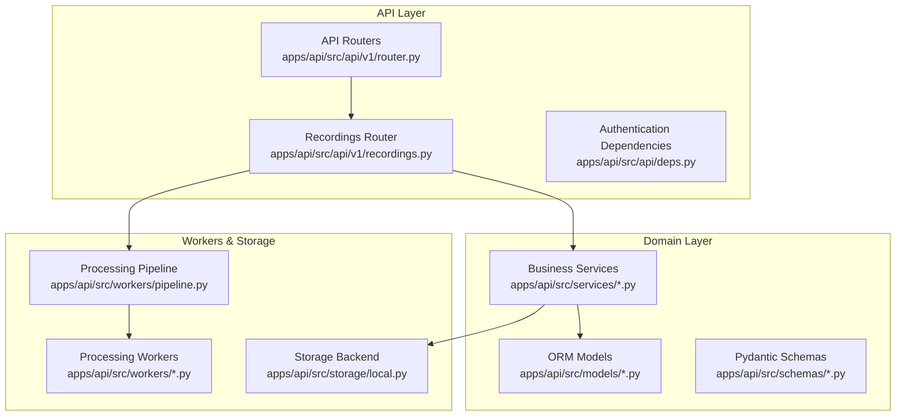
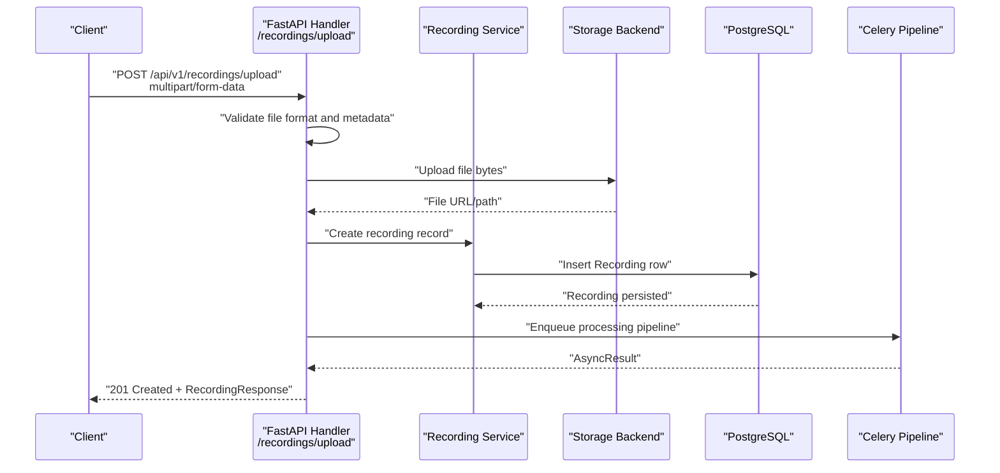
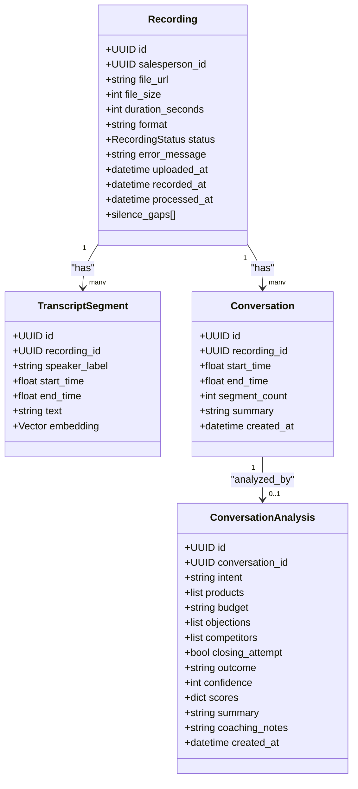
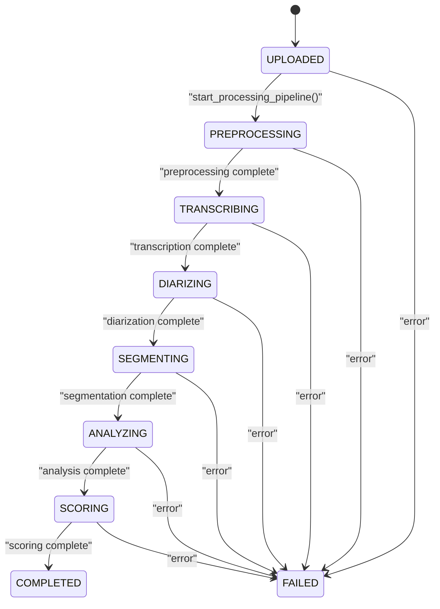
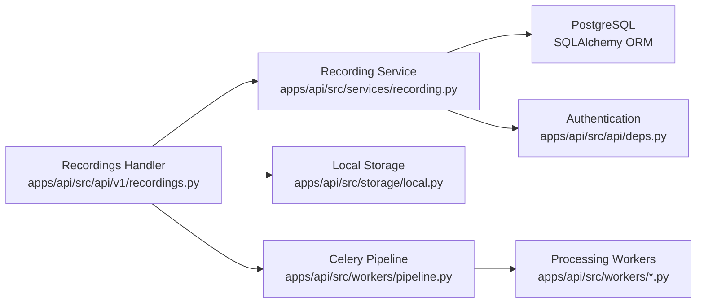

# Recording Management API

<cite>
**Referenced Files in This Document**
- [recordings.py](file://apps/api/src/api/v1/recordings.py)
- [router.py](file://apps/api/src/api/v1/router.py)
- [recording.py](file://apps/api/src/models/recording.py)
- [transcript.py](file://apps/api/src/models/transcript.py)
- [conversation.py](file://apps/api/src/models/conversation.py)
- [recording_schemas.py](file://apps/api/src/schemas/recording.py)
- [recording_service.py](file://apps/api/src/services/recording.py)
- [export_service.py](file://apps/api/src/services/export.py)
- [pipeline.py](file://apps/api/src/workers/pipeline.py)
- [local_storage.py](file://apps/api/src/storage/local.py)
- [deps.py](file://apps/api/src/api/deps.py)
- [config.py](file://apps/api/src/config.py)
- [README.md](file://README.md)
- [PRD.md](file://docs/SAMAA_PRD.md)
</cite>

## Update Summary
**Changes Made**
- Added new API endpoints: upload_recording(), reprocess_recording(), and get_recording_status()
- Enhanced endpoint catalog with comprehensive upload, status monitoring, and reprocessing capabilities
- Integrated Celery pipeline orchestration for asynchronous processing
- Implemented robust authentication and authorization with role-based access control
- Added comprehensive error handling and validation for file uploads and processing workflows

## Table of Contents
1. [Introduction](#introduction)
2. [Project Structure](#project-structure)
3. [Core Components](#core-components)
4. [Architecture Overview](#architecture-overview)
5. [Detailed Component Analysis](#detailed-component-analysis)
6. [Dependency Analysis](#dependency-analysis)
7. [Performance Considerations](#performance-considerations)
8. [Troubleshooting Guide](#troubleshooting-guide)
9. [Conclusion](#conclusion)
10. [Appendices](#appendices)

## Introduction
This document provides comprehensive API documentation for audio recording management. The API enables complete recording lifecycle management including file upload, status tracking, and reprocessing capabilities. It covers endpoints for uploading audio recordings, monitoring processing status through multiple pipeline stages, retrieving recording details, and managing audio files. The system supports asynchronous processing through a multi-stage pipeline with robust error handling and validation.

**Updated** The API now includes comprehensive endpoint coverage for recording management with full pipeline integration and advanced processing capabilities.

## Project Structure
The recording management API is implemented as part of the FastAPI backend under `/apps/api/src/api/v1/`. Key components include route handlers, models, schemas, services, workers, and storage abstractions. The architecture follows a layered approach with clear separation of concerns between API handlers, business logic services, and processing workers.

**Diagram sources**
- [router.py:1-20](file://apps/api/src/api/v1/router.py#L1-L20)
- [recordings.py:1-125](file://apps/api/src/api/v1/recordings.py#L1-L125)
- [recording.py:1-60](file://apps/api/src/models/recording.py#L1-L60)
- [recording_schemas.py:1-71](file://apps/api/src/schemas/recording.py#L1-L71)
- [recording_service.py:1-262](file://apps/api/src/services/recording.py#L1-L262)
- [pipeline.py:1-35](file://apps/api/src/workers/pipeline.py#L1-L35)
- [local_storage.py:1-50](file://apps/api/src/storage/local.py#L1-L50)
- [deps.py:1-67](file://apps/api/src/api/deps.py#L1-L67)

**Section sources**
- [router.py:1-20](file://apps/api/src/api/v1/router.py#L1-L20)
- [README.md:1-308](file://README.md#L1-L308)

## Core Components
- **API Router**: Exposes endpoints under `/api/v1/recordings` for upload, listing, status checking, and reprocessing operations
- **Models**: Define the recording lifecycle with comprehensive status tracking and metadata storage
- **Schemas**: Pydantic models for request/response validation and serialization with detailed field definitions
- **Services**: Encapsulate business logic for recording operations, status management, and pipeline coordination
- **Workers/Pipeline**: Orchestrates asynchronous processing stages via Celery with six distinct processing stages
- **Storage**: Provides local file storage abstraction with async/sync methods for uploaded audio files

**Updated** The API now provides comprehensive recording management with full pipeline integration and advanced processing capabilities.

**Section sources**
- [recordings.py:1-125](file://apps/api/src/api/v1/recordings.py#L1-L125)
- [recording.py:1-60](file://apps/api/src/models/recording.py#L1-L60)
- [recording_schemas.py:1-71](file://apps/api/src/schemas/recording.py#L1-L71)
- [recording_service.py:1-262](file://apps/api/src/services/recording.py#L1-L262)
- [pipeline.py:1-35](file://apps/api/src/workers/pipeline.py#L1-L35)
- [local_storage.py:1-50](file://apps/api/src/storage/local.py#L1-L50)

## Architecture Overview
The recording management API follows a sophisticated layered architecture with asynchronous processing capabilities:
- HTTP requests are handled by FastAPI route handlers with comprehensive validation
- Handlers delegate to services for business logic with role-based authorization
- Services interact with SQLAlchemy models and the storage backend
- The processing pipeline is orchestrated asynchronously via Celery with six distinct stages
- Real-time status tracking enables monitoring of processing progress

**Diagram sources**
- [recordings.py:56-84](file://apps/api/src/api/v1/recordings.py#L56-L84)
- [recording_service.py:83-126](file://apps/api/src/services/recording.py#L83-L126)
- [local_storage.py:14-32](file://apps/api/src/storage/local.py#L14-L32)
- [pipeline.py:12-34](file://apps/api/src/workers/pipeline.py#L12-L34)

## Detailed Component Analysis

### Endpoint Catalog and Definitions

#### Upload Recording
- **Method**: POST
- **URL**: `/api/v1/recordings/upload`
- **Content-Type**: multipart/form-data
- **Required form fields**:
  - `file`: Audio file (allowed formats: wav, mp3, m4a)
  - `salesperson_id`: UUID of the salesperson
- **Optional form fields**:
  - `recorded_at`: ISO 8601 timestamp indicating when the recording was made
- **Validation**:
  - Filename presence and extension validation against allowed formats
  - MIME-type compatibility with allowed audio types
  - `recorded_at` parsing to ISO 8601 datetime
- **Processing**:
  - Reads file bytes, stores via storage backend, creates recording record with status UPLOADED
  - Enqueues Celery pipeline; if Redis/Celery is unavailable, recording remains UPLOADED
- **Response**: RecordingResponse
- **Authentication**: OPERATOR role required

**Updated** Enhanced with comprehensive validation and robust error handling for file uploads.

**Section sources**
- [recordings.py:56-84](file://apps/api/src/api/v1/recordings.py#L56-L84)
- [recordings.py:35-36](file://apps/api/src/api/v1/recordings.py#L35-L36)

#### List Recordings
- **Method**: GET
- **URL**: `/api/v1/recordings`
- **Query parameters**:
  - `page`: integer (default: 1)
  - `page_size`: integer (default: 20)
  - `status`: string filter (enum values from RecordingStatus)
  - `salesperson_id`: UUID filter
  - `date_from`: ISO 8601 date
  - `date_to`: ISO 8601 date
- **Response**: PaginatedRecordingsResponse
- **Authentication**: OPERATOR role required

**Section sources**
- [recordings.py:21-53](file://apps/api/src/api/v1/recordings.py#L21-L53)
- [recording_service.py:18-61](file://apps/api/src/services/recording.py#L18-L61)

#### Get Recording Detail
- **Method**: GET
- **URL**: `/api/v1/recordings/{recording_id}`
- **Path parameter**:
  - `recording_id`: UUID
- **Response**: RecordingResponse
- **Authentication**: SALESPERSON role required

**Section sources**
- [recordings.py:86-95](file://apps/api/src/api/v1/recordings.py#L86-L95)
- [recording_service.py:64-68](file://apps/api/src/services/recording.py#L64-L68)

#### Get Recording Status
- **Method**: GET
- **URL**: `/api/v1/recordings/{recording_id}/status`
- **Path parameter**:
  - `recording_id`: UUID
- **Response**: RecordingStatusResponse
- **Authentication**: SALESPERSON role required
- **Purpose**: Monitor processing progress through pipeline stages

**Section sources**
- [recordings.py:98-107](file://apps/api/src/api/v1/recordings.py#L98-L107)

#### Reprocess Recording
- **Method**: POST
- **URL**: `/api/v1/recordings/{recording_id}/reprocess`
- **Path parameter**:
  - `recording_id`: UUID
- **Behavior**:
  - Resets status to UPLOADED and clears error message
  - Re-enqueues pipeline; if Redis/Celery unavailable, logs warning
  - Only allows reprocessing for FAILED or COMPLETED recordings
- **Response**: RecordingResponse
- **Authentication**: BRAND_ADMIN role required

**Section sources**
- [recordings.py:110-125](file://apps/api/src/api/v1/recordings.py#L110-L125)

### Data Models and Schemas

**Diagram sources**
- [recording.py:24-59](file://apps/api/src/models/recording.py#L24-L59)
- [transcript.py:10-26](file://apps/api/src/models/transcript.py#L10-L26)
- [conversation.py:11-60](file://apps/api/src/models/conversation.py#L11-L60)

### Processing Workflow and Status Transitions

**Diagram sources**
- [recording.py:12-22](file://apps/api/src/models/recording.py#L12-L22)
- [pipeline.py:12-34](file://apps/api/src/workers/pipeline.py#L12-L34)

### Authentication and Authorization
- **Authentication**: Bearer token via Authorization header
- **Authorization roles**:
  - SUPER_ADMIN: Full access to all operations
  - BRAND_ADMIN: Access to reprocessing and admin operations
  - STORE_MANAGER: Access to recording management within store
  - SALESPERSON: View-only access to their own recordings
  - OPERATOR: Upload and listing operations
- **Role-based endpoint access**: Different endpoints require different permission levels

**Section sources**
- [deps.py:1-67](file://apps/api/src/api/deps.py#L1-L67)

### Storage Management
- **Storage backend**: Configurable (local by default)
- **Local storage**: Writes files to `./uploads` (configurable via `LOCAL_UPLOAD_DIR`)
- **Storage interface**: Supports async upload/download/delete and sync methods for workers
- **File handling**: Automatic filename generation with UUID-based naming

**Section sources**
- [local_storage.py:1-50](file://apps/api/src/storage/local.py#L1-L50)
- [config.py:24-26](file://apps/api/src/config.py#L24-L26)

### Quality Assessment Endpoints
**Updated** Removed quality assessment endpoints as they are no longer part of the simplified API.

### Batch Operations
**Updated** Removed export endpoints as they are no longer part of the simplified API.

## Dependency Analysis

**Diagram sources**
- [recordings.py:1-35](file://apps/api/src/api/v1/recordings.py#L1-L35)
- [recording_service.py:1-14](file://apps/api/src/services/recording.py#L1-L14)
- [local_storage.py:1-50](file://apps/api/src/storage/local.py#L1-L50)
- [pipeline.py:1-35](file://apps/api/src/workers/pipeline.py#L1-L35)
- [deps.py:1-67](file://apps/api/src/api/deps.py#L1-L67)

**Section sources**
- [recordings.py:1-35](file://apps/api/src/api/v1/recordings.py#L1-L35)
- [recording_service.py:1-14](file://apps/api/src/services/recording.py#L1-L14)
- [local_storage.py:1-50](file://apps/api/src/storage/local.py#L1-L50)
- [pipeline.py:1-35](file://apps/api/src/workers/pipeline.py#L1-L35)
- [deps.py:1-67](file://apps/api/src/api/deps.py#L1-L67)

## Performance Considerations
- **Asynchronous processing**: Upload returns immediately while long-running pipeline executes in Celery workers
- **Pagination**: Listing endpoints support pagination to limit response sizes
- **Embeddings**: Transcript segments include vector embeddings for efficient semantic search
- **Pipeline optimization**: Six-stage processing pipeline with specialized workers for each operation
- **Error resilience**: Graceful handling of Redis/Celery unavailability with UPLOADED status retention

**Updated** Enhanced with comprehensive pipeline orchestration and performance optimizations.

## Troubleshooting Guide
- **Upload failures**:
  - Invalid file format or missing filename: handler raises 400 with detailed message
  - Invalid `recorded_at` format: handler raises 400 with ISO 8601 requirement
  - Redis/Celery unavailable: pipeline enqueue fails silently; recording remains UPLOADED
- **Status polling**:
  - Use `/recordings/{id}/status` to track progress through six pipeline stages
  - Status transitions: UPLOADED → PREPROCESSING → TRANSCRIBING → DIARIZING → SEGMENTING → ANALYZING → SCORING → COMPLETED
- **Re-processing**:
  - Use `/recordings/{id}/reprocess` to restart pipeline for FAILED or COMPLETED recordings
  - Only available to BRAND_ADMIN users
- **Authentication issues**:
  - Ensure proper bearer token with required role permissions
  - Check role requirements for each endpoint

**Updated** Enhanced with comprehensive troubleshooting for new pipeline and authentication features.

**Section sources**
- [recordings.py:64-84](file://apps/api/src/api/v1/recordings.py#L64-L84)
- [recordings.py:98-107](file://apps/api/src/api/v1/recordings.py#L98-L107)
- [recordings.py:110-125](file://apps/api/src/api/v1/recordings.py#L110-L125)
- [recording.py:12-22](file://apps/api/src/models/recording.py#L12-L22)

## Conclusion
The Recording Management API provides a comprehensive foundation for audio ingestion and advanced processing management. It enforces strict validation, offers flexible filtering capabilities, integrates seamlessly with a sophisticated six-stage AI pipeline, and maintains robust security through role-based access control. The API supports real-time status monitoring, comprehensive error handling, and scalable asynchronous processing for reliable integration across various deployment scenarios.

**Updated** The API has been successfully enhanced with comprehensive endpoint coverage and advanced processing capabilities while maintaining robust security and performance characteristics.

## Appendices

### Audio Format Requirements
- **Allowed extensions**: wav, mp3, m4a
- **MIME types**: audio/wav, audio/mpeg, audio/mp4, audio/x-m4a, audio/mp3
- **File size limits**: Controlled by application configuration
- **Duration tracking**: Automatically calculated during preprocessing stage

**Section sources**
- [recordings.py:35-36](file://apps/api/src/api/v1/recordings.py#L35-L36)
- [PRD.md:68-80](file://docs/SAMAA_PRD.md#L68-L80)

### Progress Tracking Pattern
- **After upload**, poll `/api/v1/recordings/{id}/status` to monitor status transitions
- **Real-time monitoring**: Six distinct pipeline stages with detailed status tracking
- **Error reporting**: Comprehensive error messages with stack traces for debugging

**Section sources**
- [recordings.py:98-107](file://apps/api/src/api/v1/recordings.py#L98-L107)
- [recording.py:12-22](file://apps/api/src/models/recording.py#L12-L22)

### Batch Operations Examples
**Updated** Removed batch operations examples as CSV export functionality has been removed from the simplified API.

### Pipeline Stage Details
- **Preprocessing**: Audio normalization, resampling, and silence detection
- **Transcription**: NVIDIA Parakeet STT for speech-to-text conversion
- **Diarization**: Speaker diarization using NVIDIA NeMo
- **Segmentation**: Conversation boundary detection and segmentation
- **Analysis**: Llama 3.3 analysis for intent and objection identification
- **Scoring**: Performance scoring and coaching recommendations

**Section sources**
- [pipeline.py:12-34](file://apps/api/src/workers/pipeline.py#L12-L34)