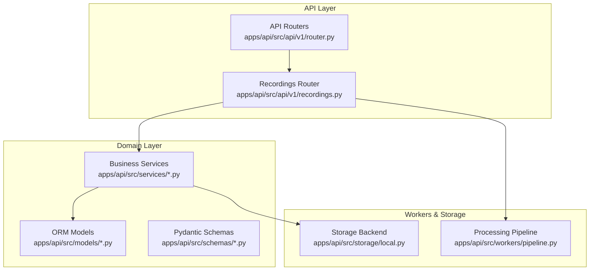
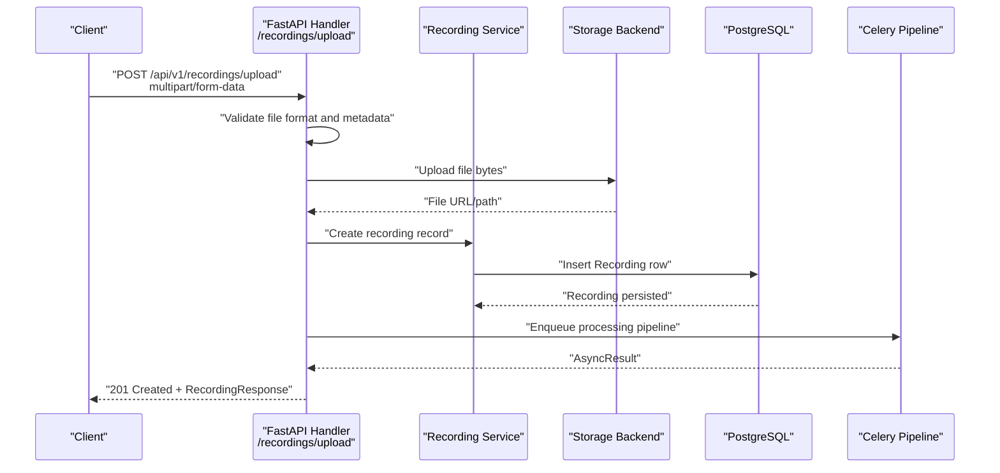
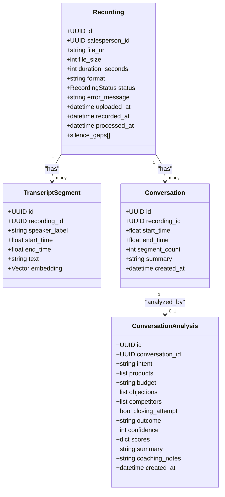
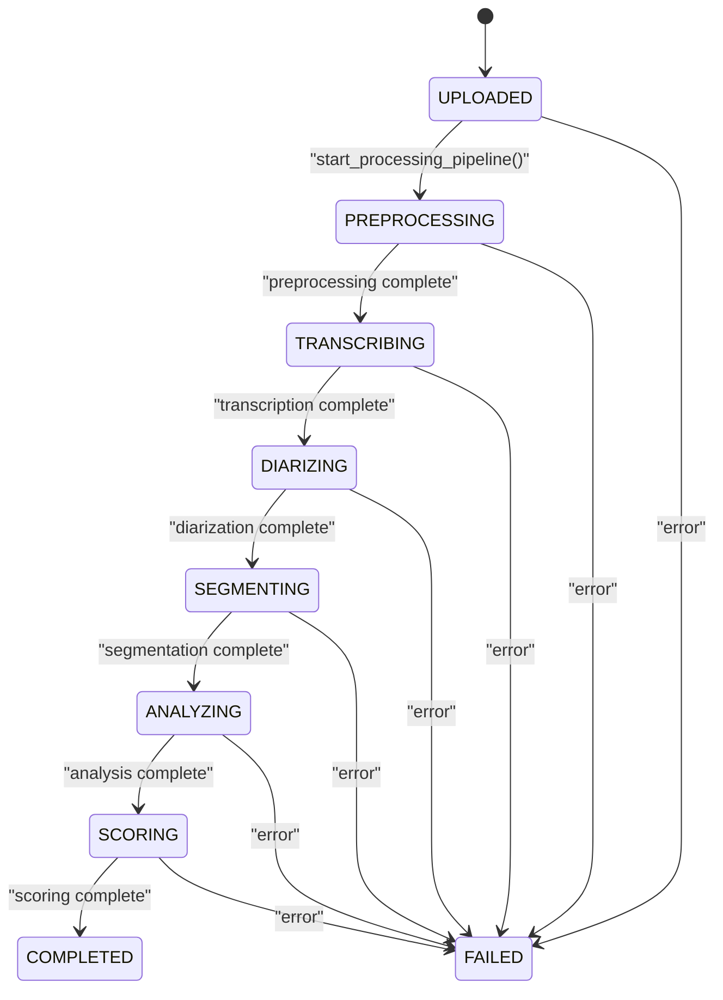
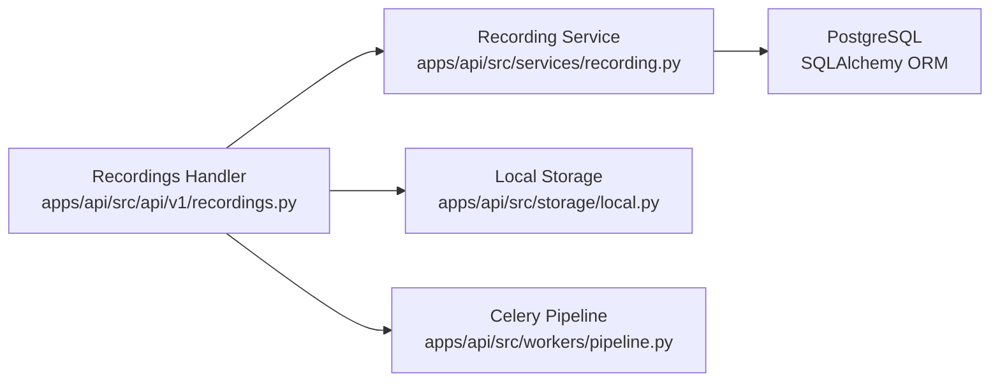

# Recording Management API

<cite>
**Referenced Files in This Document**
- [recordings.py](file://apps/api/src/api/v1/recordings.py)
- [router.py](file://apps/api/src/api/v1/router.py)
- [recording.py](file://apps/api/src/models/recording.py)
- [transcript.py](file://apps/api/src/models/transcript.py)
- [conversation.py](file://apps/api/src/models/conversation.py)
- [recording_schemas.py](file://apps/api/src/schemas/recording.py)
- [recording_service.py](file://apps/api/src/services/recording.py)
- [export_service.py](file://apps/api/src/services/export.py)
- [pipeline.py](file://apps/api/src/workers/pipeline.py)
- [local_storage.py](file://apps/api/src/storage/local.py)
- [deps.py](file://apps/api/src/api/deps.py)
- [config.py](file://apps/api/src/config.py)
- [README.md](file://README.md)
- [PRD.md](file://docs/SAMAA_PRD.md)
</cite>

## Table of Contents
1. [Introduction](#introduction)
2. [Project Structure](#project-structure)
3. [Core Components](#core-components)
4. [Architecture Overview](#architecture-overview)
5. [Detailed Component Analysis](#detailed-component-analysis)
6. [Dependency Analysis](#dependency-analysis)
7. [Performance Considerations](#performance-considerations)
8. [Troubleshooting Guide](#troubleshooting-guide)
9. [Conclusion](#conclusion)
10. [Appendices](#appendices)

## Introduction
This document provides comprehensive API documentation for audio recording management. It covers endpoints for uploading audio recordings, tracking processing status, retrieving transcripts and conversations, exporting data, and managing audio files. It specifies HTTP methods, URL patterns, multipart form data handling, validation requirements, processing workflows, status transitions, error handling, and storage considerations.

## Project Structure
The recording management API is implemented as part of the FastAPI backend under `/apps/api/src/api/v1/`. Key components include route handlers, models, schemas, services, workers, and storage abstractions.

**Diagram sources**
- [router.py:1-20](file://apps/api/src/api/v1/router.py#L1-L20)
- [recordings.py:1-254](file://apps/api/src/api/v1/recordings.py#L1-L254)
- [recording.py:1-60](file://apps/api/src/models/recording.py#L1-L60)
- [recording_schemas.py:1-71](file://apps/api/src/schemas/recording.py#L1-L71)
- [recording_service.py:1-177](file://apps/api/src/services/recording.py#L1-L177)
- [pipeline.py:1-35](file://apps/api/src/workers/pipeline.py#L1-L35)
- [local_storage.py:1-50](file://apps/api/src/storage/local.py#L1-L50)

**Section sources**
- [router.py:1-20](file://apps/api/src/api/v1/router.py#L1-L20)
- [README.md:1-308](file://README.md#L1-L308)

## Core Components
- API Router: Exposes endpoints under `/api/v1/recordings` for upload, listing, status, transcripts, conversations, summaries, and reprocessing.
- Models: Define the recording lifecycle, transcript segments, and conversations with associated analysis.
- Schemas: Pydantic models for request/response validation and serialization.
- Services: Encapsulate business logic for listing, creating, updating status, and summarizing recordings.
- Workers/Pipeline: Orchestrates asynchronous processing stages via Celery.
- Storage: Provides local file storage abstraction for uploaded audio.

**Section sources**
- [recordings.py:1-254](file://apps/api/src/api/v1/recordings.py#L1-L254)
- [recording.py:1-60](file://apps/api/src/models/recording.py#L1-L60)
- [recording_schemas.py:1-71](file://apps/api/src/schemas/recording.py#L1-L71)
- [recording_service.py:1-177](file://apps/api/src/services/recording.py#L1-L177)
- [pipeline.py:1-35](file://apps/api/src/workers/pipeline.py#L1-L35)
- [local_storage.py:1-50](file://apps/api/src/storage/local.py#L1-L50)

## Architecture Overview
The recording management API follows a layered architecture:
- HTTP requests are handled by FastAPI route handlers.
- Handlers delegate to services for business logic.
- Services interact with SQLAlchemy models and the storage backend.
- The processing pipeline is orchestrated asynchronously via Celery.

**Diagram sources**
- [recordings.py:110-167](file://apps/api/src/api/v1/recordings.py#L110-L167)
- [recording_service.py:69-90](file://apps/api/src/services/recording.py#L69-L90)
- [local_storage.py:14-32](file://apps/api/src/storage/local.py#L14-L32)
- [pipeline.py:12-34](file://apps/api/src/workers/pipeline.py#L12-L34)

## Detailed Component Analysis

### Endpoint Catalog and Definitions

#### Upload Recording
- Method: POST
- URL: `/api/v1/recordings/upload`
- Content-Type: multipart/form-data
- Required form fields:
  - `file`: Audio file (allowed formats: wav, mp3, m4a)
  - `salesperson_id`: UUID of the salesperson
- Optional form fields:
  - `recorded_at`: ISO 8601 timestamp indicating when the recording was made
- Validation:
  - Filename presence and extension validation against allowed formats
  - MIME-type compatibility with allowed audio types
  - `recorded_at` parsing to ISO 8601 datetime
- Processing:
  - Reads file bytes, stores via storage backend, creates recording record with status UPLOADED
  - Enqueues Celery pipeline; if Redis/Celery is unavailable, recording remains UPLOADED
- Response: RecordingResponse

**Section sources**
- [recordings.py:110-167](file://apps/api/src/api/v1/recordings.py#L110-L167)
- [recordings.py:35-36](file://apps/api/src/api/v1/recordings.py#L35-L36)

#### List Recordings
- Method: GET
- URL: `/api/v1/recordings`
- Query parameters:
  - `page`: integer (default: 1)
  - `page_size`: integer (default: 20)
  - `status`: string filter (enum values from RecordingStatus)
  - `salesperson_id`: UUID filter
  - `date_from`: ISO 8601 date
  - `date_to`: ISO 8601 date
- Response: PaginatedRecordingsResponse

**Section sources**
- [recordings.py:41-73](file://apps/api/src/api/v1/recordings.py#L41-L73)
- [recording_service.py:16-59](file://apps/api/src/services/recording.py#L16-L59)

#### Get Recording Detail
- Method: GET
- URL: `/api/v1/recordings/{recording_id}`
- Path parameter:
  - `recording_id`: UUID
- Response: RecordingResponse

**Section sources**
- [recordings.py:170-179](file://apps/api/src/api/v1/recordings.py#L170-L179)
- [recording_service.py:62-66](file://apps/api/src/services/recording.py#L62-L66)

#### Get Recording Status
- Method: GET
- URL: `/api/v1/recordings/{recording_id}/status`
- Path parameter:
  - `recording_id`: UUID
- Response: RecordingStatusResponse

**Section sources**
- [recordings.py:182-195](file://apps/api/src/api/v1/recordings.py#L182-L195)

#### Get Transcript
- Method: GET
- URL: `/api/v1/recordings/{recording_id}/transcript`
- Path parameter:
  - `recording_id`: UUID
- Response: array of TranscriptSegmentResponse

**Section sources**
- [recordings.py:198-204](file://apps/api/src/api/v1/recordings.py#L198-L204)
- [recording_service.py:107-113](file://apps/api/src/services/recording.py#L107-L113)

#### Get Conversations
- Method: GET
- URL: `/api/v1/recordings/{recording_id}/conversations`
- Path parameter:
  - `recording_id`: UUID
- Response: array of ConversationSummaryResponse

**Section sources**
- [recordings.py:207-213](file://apps/api/src/api/v1/recordings.py#L207-L213)
- [recording_service.py:116-122](file://apps/api/src/services/recording.py#L116-L122)

#### Get Recording Summary
- Method: GET
- URL: `/api/v1/recordings/{recording_id}/summary`
- Path parameter:
  - `recording_id`: UUID
- Response: RecordingSummaryResponse

**Section sources**
- [recordings.py:216-225](file://apps/api/src/api/v1/recordings.py#L216-L225)
- [recording_service.py:125-176](file://apps/api/src/services/recording.py#L125-L176)

#### Reprocess Recording
- Method: POST
- URL: `/api/v1/recordings/{recording_id}/reprocess`
- Path parameter:
  - `recording_id`: UUID
- Behavior:
  - Resets status to UPLOADED and clears error message
  - Re-enqueues pipeline; if Redis/Celery unavailable, logs warning
- Response: RecordingResponse

**Section sources**
- [recordings.py:228-253](file://apps/api/src/api/v1/recordings.py#L228-L253)

#### Export Recordings CSV
- Method: GET
- URL: `/api/v1/recordings/export/recordings`
- Query parameters:
  - `salesperson_id`: optional UUID filter
  - `status`: optional status filter
- Response: text/csv stream

**Section sources**
- [recordings.py:76-89](file://apps/api/src/api/v1/recordings.py#L76-L89)
- [export_service.py:15-46](file://apps/api/src/services/export.py#L15-L46)

#### Export Conversations CSV
- Method: GET
- URL: `/api/v1/recordings/export/conversations`
- Query parameters:
  - `recording_id`: optional UUID filter
  - `salesperson_id`: optional UUID filter
- Response: text/csv stream

**Section sources**
- [recordings.py:92-107](file://apps/api/src/api/v1/recordings.py#L92-L107)
- [export_service.py:49-99](file://apps/api/src/services/export.py#L49-L99)

### Data Models and Schemas

**Diagram sources**
- [recording.py:24-59](file://apps/api/src/models/recording.py#L24-L59)
- [transcript.py:10-26](file://apps/api/src/models/transcript.py#L10-L26)
- [conversation.py:11-60](file://apps/api/src/models/conversation.py#L11-L60)

### Processing Workflow and Status Transitions

**Diagram sources**
- [recording.py:12-22](file://apps/api/src/models/recording.py#L12-L22)
- [pipeline.py:12-34](file://apps/api/src/workers/pipeline.py#L12-L34)

### Authentication and Authorization
- Authentication: Bearer token via Authorization header
- Authorization roles: SUPER_ADMIN, BRAND_ADMIN, STORE_MANAGER, SALESPERSON (require_salesperson_up)

**Section sources**
- [deps.py:1-63](file://apps/api/src/api/deps.py#L1-L63)

### Storage Management
- Storage backend: configurable (local by default)
- Local storage writes files to `./uploads` (configurable via `LOCAL_UPLOAD_DIR`)
- Storage interface supports async upload/download/delete and sync methods for workers

**Section sources**
- [local_storage.py:1-50](file://apps/api/src/storage/local.py#L1-L50)
- [config.py:24-26](file://apps/api/src/config.py#L24-L26)

### Quality Assessment Endpoints
- Recording summary endpoint aggregates conversation-level analysis to compute:
  - Top intent and top objection
  - Missed opportunities (count of "LOST" outcomes)
  - Outcome distribution
  - Average confidence
- Transcript segments include embeddings for vector search capabilities

**Section sources**
- [recordings.py:216-225](file://apps/api/src/api/v1/recordings.py#L216-L225)
- [recording_service.py:125-176](file://apps/api/src/services/recording.py#L125-L176)
- [transcript.py:10-26](file://apps/api/src/models/transcript.py#L10-L26)

### Batch Operations
- Export endpoints support filtering by salesperson and status to enable batch retrieval of analytics for reporting and compliance.

**Section sources**
- [recordings.py:76-89](file://apps/api/src/api/v1/recordings.py#L76-L89)
- [recordings.py:92-107](file://apps/api/src/api/v1/recordings.py#L92-L107)
- [export_service.py:15-46](file://apps/api/src/services/export.py#L15-L46)
- [export_service.py:49-99](file://apps/api/src/services/export.py#L49-L99)

## Dependency Analysis

**Diagram sources**
- [recordings.py:1-35](file://apps/api/src/api/v1/recordings.py#L1-L35)
- [recording_service.py:1-14](file://apps/api/src/services/recording.py#L1-L14)
- [local_storage.py:1-50](file://apps/api/src/storage/local.py#L1-L50)
- [pipeline.py:1-35](file://apps/api/src/workers/pipeline.py#L1-L35)

**Section sources**
- [recordings.py:1-35](file://apps/api/src/api/v1/recordings.py#L1-L35)
- [recording_service.py:1-14](file://apps/api/src/services/recording.py#L1-L14)
- [local_storage.py:1-50](file://apps/api/src/storage/local.py#L1-L50)
- [pipeline.py:1-35](file://apps/api/src/workers/pipeline.py#L1-L35)

## Performance Considerations
- Asynchronous processing: Upload returns immediately while long-running pipeline executes in Celery workers.
- Streaming responses: CSV export endpoints stream results to reduce memory overhead.
- Pagination: Listing endpoints support pagination to limit response sizes.
- Embeddings: Transcript segments include vector embeddings for efficient semantic search.

[No sources needed since this section provides general guidance]

## Troubleshooting Guide
- Upload failures:
  - Invalid file format or missing filename: handler raises 400 with detailed message
  - Invalid `recorded_at` format: handler raises 400 with ISO 8601 requirement
  - Redis/Celery unavailable: pipeline enqueue fails silently; recording remains UPLOADED
- Status polling:
  - Use `/recordings/{id}/status` to track progress; status transitions are defined in RecordingStatus
- Re-processing:
  - Use `/recordings/{id}/reprocess` to restart pipeline for failed or stale recordings
- Export issues:
  - Ensure filters match existing records; CSV export streams results for large datasets

**Section sources**
- [recordings.py:118-138](file://apps/api/src/api/v1/recordings.py#L118-L138)
- [recordings.py:160-167](file://apps/api/src/api/v1/recordings.py#L160-L167)
- [recordings.py:188-195](file://apps/api/src/api/v1/recordings.py#L188-L195)
- [recordings.py:228-253](file://apps/api/src/api/v1/recordings.py#L228-L253)
- [recording.py:12-22](file://apps/api/src/models/recording.py#L12-L22)

## Conclusion
The Recording Management API provides a robust foundation for audio ingestion, asynchronous processing, and analytics retrieval. It enforces strict validation, offers flexible filtering and export capabilities, and integrates seamlessly with a multi-stage AI pipeline. The documented endpoints, schemas, and workflows enable reliable integration for upload, monitoring, and reporting.

[No sources needed since this section summarizes without analyzing specific files]

## Appendices

### Audio Format Requirements
- Allowed extensions: wav, mp3, m4a
- MIME types: audio/wav, audio/mpeg, audio/mp4, audio/x-m4a, audio/mp3

**Section sources**
- [recordings.py:35-36](file://apps/api/src/api/v1/recordings.py#L35-L36)
- [PRD.md:68-80](file://docs/SAMAA_PRD.md#L68-L80)

### Progress Tracking Pattern
- After upload, poll `/api/v1/recordings/{id}/status` to monitor status transitions until completion or failure.

**Section sources**
- [recordings.py:182-195](file://apps/api/src/api/v1/recordings.py#L182-L195)
- [recording.py:12-22](file://apps/api/src/models/recording.py#L12-L22)

### Batch Operations Examples
- Export recordings filtered by salesperson and status
- Export conversations filtered by recording or salesperson

**Section sources**
- [recordings.py:76-89](file://apps/api/src/api/v1/recordings.py#L76-L89)
- [recordings.py:92-107](file://apps/api/src/api/v1/recordings.py#L92-L107)
- [export_service.py:15-46](file://apps/api/src/services/export.py#L15-L46)
- [export_service.py:49-99](file://apps/api/src/services/export.py#L49-L99)