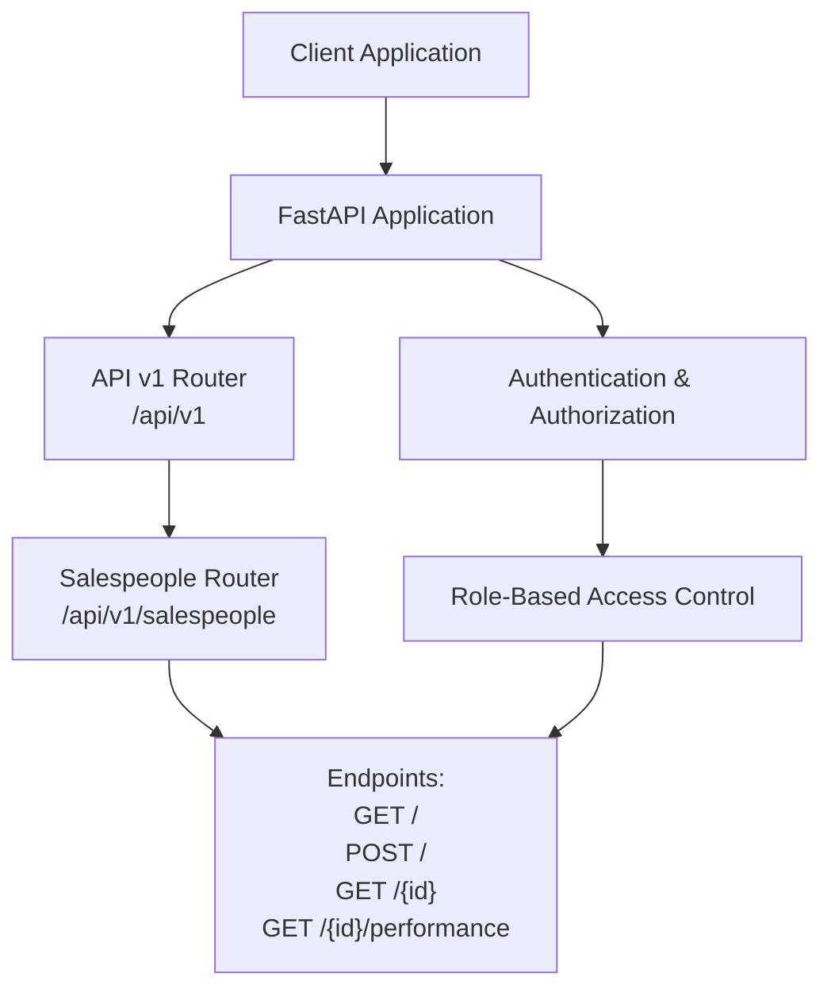
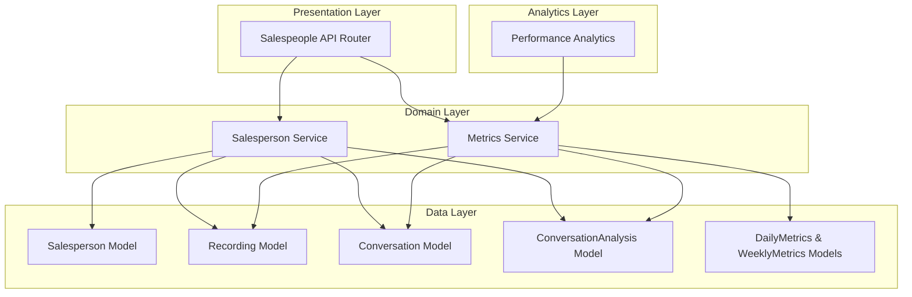
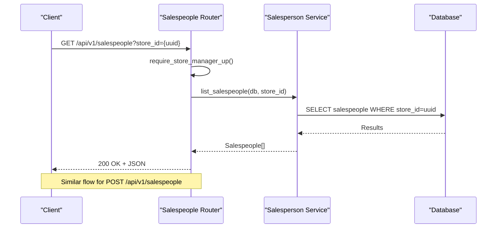
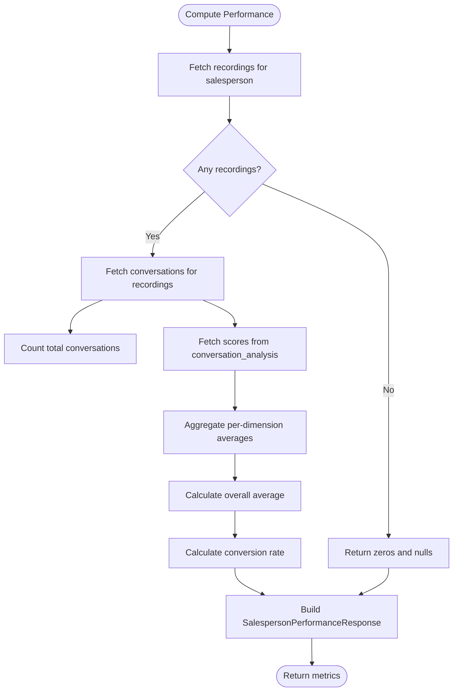
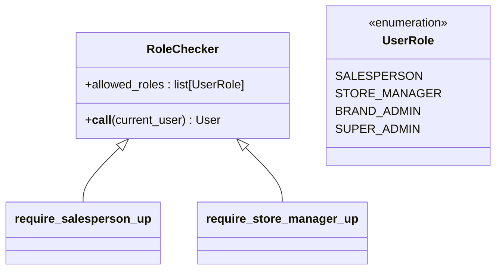
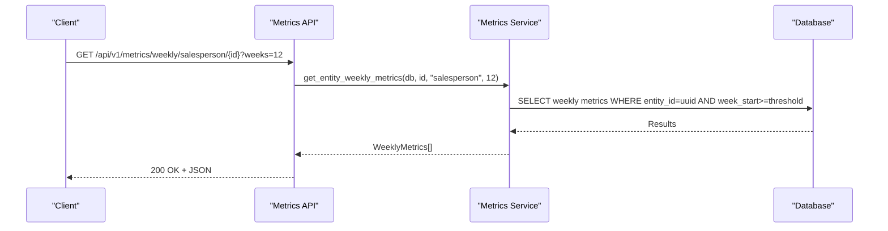
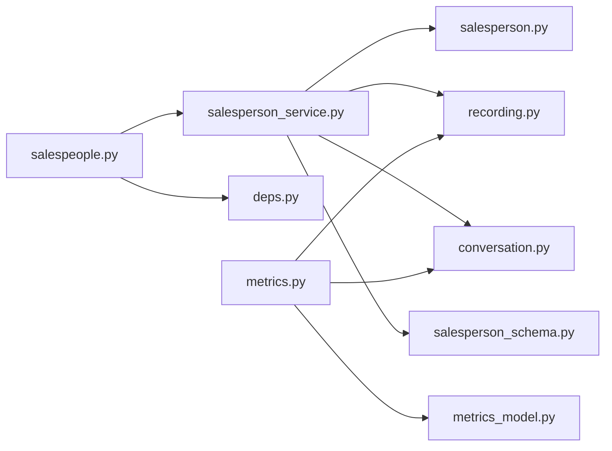

# Salesperson Management API

<cite>
**Referenced Files in This Document**
- [salespeople.py](file://apps/api/src/api/v1/salespeople.py)
- [router.py](file://apps/api/src/api/v1/router.py)
- [deps.py](file://apps/api/src/api/deps.py)
- [salesperson.py](file://apps/api/src/models/salesperson.py)
- [salesperson_schema.py](file://apps/api/src/schemas/salesperson.py)
- [salesperson_service.py](file://apps/api/src/services/salesperson.py)
- [conversation.py](file://apps/api/src/models/conversation.py)
- [recording.py](file://apps/api/src/models/recording.py)
- [metrics.py](file://apps/api/src/services/metrics.py)
- [metrics_model.py](file://apps/api/src/models/metrics.py)
</cite>

## Table of Contents
1. [Introduction](#introduction)
2. [Project Structure](#project-structure)
3. [Core Components](#core-components)
4. [Architecture Overview](#architecture-overview)
5. [Detailed Component Analysis](#detailed-component-analysis)
6. [Dependency Analysis](#dependency-analysis)
7. [Performance Considerations](#performance-considerations)
8. [Troubleshooting Guide](#troubleshooting-guide)
9. [Conclusion](#conclusion)

## Introduction
This document provides comprehensive API documentation for the salesperson management functionality. It covers all CRUD endpoints for salesperson entities, performance analytics, conversation history linkage, and store assignments. The specification includes HTTP methods, URL patterns, request/response schemas, validation rules, and access control patterns. It also details salesperson-specific performance metrics, analytics endpoints, and practical examples for performance trend analysis, individual versus team comparisons, and coaching score calculations.

## Project Structure
The salesperson management API is implemented as part of the FastAPI application under the `/api/v1` namespace. The router is registered under the main API router and exposes endpoints for listing, creating, retrieving, and fetching performance metrics for salespeople. Access control is enforced via role-based decorators that restrict endpoint access based on the authenticated user's role.



**Diagram sources**
- [router.py:11-20](file://apps/api/src/api/v1/router.py#L11-L20)
- [salespeople.py:19](file://apps/api/src/api/v1/salespeople.py#L19)

**Section sources**
- [router.py:11-20](file://apps/api/src/api/v1/router.py#L11-L20)
- [salespeople.py:19](file://apps/api/src/api/v1/salespeople.py#L19)

## Core Components
- Salespeople API Router: Defines the salesperson endpoints and applies role-based access control.
- Salesperson Model: ORM model representing salespeople with relationships to stores and recordings.
- Salesperson Schemas: Pydantic models for request/response validation and serialization.
- Salesperson Service: Implements business logic for listing, retrieving, creating, updating, and computing performance metrics.
- Metrics Services: Provides performance summaries and analytics for salespeople and stores.
- Authentication and Authorization: Enforces access control via bearer tokens and role checks.

Key responsibilities:
- Expose CRUD endpoints for salespeople with appropriate access controls.
- Compute performance metrics from conversation analysis data.
- Link salespeople to store assignments and recordings.
- Support analytics queries for daily and weekly trends.

**Section sources**
- [salespeople.py:1-62](file://apps/api/src/api/v1/salespeople.py#L1-L62)
- [salesperson.py:10-32](file://apps/api/src/models/salesperson.py#L10-L32)
- [salesperson_schema.py:4-46](file://apps/api/src/schemas/salesperson.py#L4-L46)
- [salesperson_service.py:12-111](file://apps/api/src/services/salesperson.py#L12-L111)
- [metrics.py:13-191](file://apps/api/src/services/metrics.py#L13-L191)

## Architecture Overview
The salesperson management API follows a layered architecture:
- Presentation Layer: FastAPI routes define endpoints and apply authentication/authorization.
- Domain Layer: Services encapsulate business logic and coordinate with the database.
- Data Layer: SQLAlchemy models represent entities and relationships.
- Analytics Layer: Metrics services aggregate data for performance insights.



**Diagram sources**
- [salespeople.py:19](file://apps/api/src/api/v1/salespeople.py#L19)
- [salesperson_service.py:12-111](file://apps/api/src/services/salesperson.py#L12-L111)
- [metrics.py:13-191](file://apps/api/src/services/metrics.py#L13-L191)
- [salesperson.py:10-32](file://apps/api/src/models/salesperson.py#L10-L32)
- [recording.py:24-60](file://apps/api/src/models/recording.py#L24-L60)
- [conversation.py:11-61](file://apps/api/src/models/conversation.py#L11-L61)
- [metrics_model.py:10-39](file://apps/api/src/models/metrics.py#L10-L39)

## Detailed Component Analysis

### Salespeople API Endpoints
The salespeople API exposes four primary endpoints with specific access controls and behaviors:

- List Salespeople
  - Method: GET
  - URL: /api/v1/salespeople
  - Query Parameters:
    - store_id: Optional string UUID to filter by store
  - Authentication/Authorization:
    - Requires role: STORE_MANAGER or higher
  - Response: Array of SalespersonResponse objects
  - Validation Rules:
    - store_id must be a valid UUID string if provided

- Create Salesperson
  - Method: POST
  - URL: /api/v1/salespeople
  - Request Body: SalespersonCreate schema
  - Authentication/Authorization:
    - Requires role: STORE_MANAGER or higher
  - Response: SalespersonResponse object
  - Validation Rules:
    - store_id must be a valid UUID string
    - name is required
    - email, role, shift, device_number are optional

- Get Salesperson Details
  - Method: GET
  - URL: /api/v1/salespeople/{salesperson_id}
  - Path Parameter:
    - salesperson_id: Required string UUID
  - Authentication/Authorization:
    - Requires role: SALESPERSON or higher (self-access allowed)
  - Response: SalespersonResponse object
  - Validation Rules:
    - salesperson_id must be a valid UUID string
    - Returns 404 if not found

- Get Salesperson Performance
  - Method: GET
  - URL: /api/v1/salespeople/{salesperson_id}/performance
  - Path Parameter:
    - salesperson_id: Required string UUID
  - Authentication/Authorization:
    - Requires role: SALESPERSON or higher (self-access allowed)
  - Response: SalespersonPerformanceResponse object
  - Validation Rules:
    - salesperson_id must be a valid UUID string
    - Returns 404 if not found

Access control enforcement:
- require_store_manager_up: Used for list and create operations
- require_salesperson_up: Used for detail and performance operations



**Diagram sources**
- [salespeople.py:22-37](file://apps/api/src/api/v1/salespeople.py#L22-L37)
- [salesperson_service.py:12-17](file://apps/api/src/services/salesperson.py#L12-L17)
- [deps.py:57-62](file://apps/api/src/api/deps.py#L57-L62)

**Section sources**
- [salespeople.py:22-61](file://apps/api/src/api/v1/salespeople.py#L22-L61)
- [deps.py:54-62](file://apps/api/src/api/deps.py#L54-L62)

### Data Models and Relationships
Salesperson entity relationships:
- One-to-Many with Recording (via salesperson_id)
- Many-to-One with Store (via store_id)
- Indirect Many-to-Many with Conversation through Recording

Performance metrics computation:
- Total conversations: Count of conversations linked to the salesperson's recordings
- Average scores: Derived from conversation_analysis.scores JSONB field
- Conversion rate: Calculated from outcomes tagged as "SALE_MADE"

```mermaid
erDiagram
SALESPEOPLE {
uuid id PK
uuid store_id FK
string name
string email
string role
string shift
string device_number
timestamp created_at
timestamp updated_at
}
RECORDINGS {
uuid id PK
uuid salesperson_id FK
string file_url
integer file_size
integer duration_seconds
string format
enum status
timestamp uploaded_at
timestamp recorded_at
timestamp processed_at
}
CONVERSATIONS {
uuid id PK
uuid recording_id FK
float start_time
float end_time
integer segment_count
text summary
timestamp created_at
}
CONVERSATION_ANALYSIS {
uuid id PK
uuid conversation_id FK
text intent
jsonb products
string budget
jsonb objections
jsonb competitors
boolean closing_attempt
string outcome
integer confidence
jsonb scores
text summary
text coaching_notes
}
SALESPEOPLE ||--o{ RECORDINGS : "has"
RECORDINGS ||--o{ CONVERSATIONS : "contains"
CONVERSATIONS ||--|o{ CONVERSATION_ANALYSIS : "analyzed_in"
```

**Diagram sources**
- [salesperson.py:10-32](file://apps/api/src/models/salesperson.py#L10-L32)
- [recording.py:24-60](file://apps/api/src/models/recording.py#L24-L60)
- [conversation.py:11-61](file://apps/api/src/models/conversation.py#L11-L61)

**Section sources**
- [salesperson.py:10-32](file://apps/api/src/models/salesperson.py#L10-L32)
- [recording.py:24-60](file://apps/api/src/models/recording.py#L24-L60)
- [conversation.py:11-61](file://apps/api/src/models/conversation.py#L11-L61)

### Performance Analytics Endpoints
Performance metrics are computed from conversation analysis data and include:
- Total conversations
- Average scores per dimension: greeting, discovery, product knowledge, objection handling, closing
- Average overall score (mean of the five dimensions)
- Conversion rate (percentage of "SALE_MADE" outcomes)

Analytics service capabilities:
- Entity daily metrics: Retrieve daily metrics for an entity within a date range
- Entity weekly metrics: Retrieve weekly metrics for an entity for the last N weeks
- Store metrics summary: Aggregated metrics for a store including total salespeople, recordings, conversations, average performance score, conversion rate, and top objection
- Salesperson performance summary: Per-salesperson metrics including total conversations, average scores per dimension, and conversion rate



**Diagram sources**
- [salesperson_service.py:56-111](file://apps/api/src/services/salesperson.py#L56-L111)
- [metrics.py:124-191](file://apps/api/src/services/metrics.py#L124-L191)

**Section sources**
- [salesperson_service.py:56-111](file://apps/api/src/services/salesperson.py#L56-L111)
- [metrics.py:13-51](file://apps/api/src/services/metrics.py#L13-L51)
- [metrics.py:124-191](file://apps/api/src/services/metrics.py#L124-L191)

### Request/Response Schemas
SalespersonCreate (request body for creation):
- store_id: string (required)
- name: string (required)
- email: string (optional)
- role: string (optional)
- shift: string (optional)
- device_number: string (optional)

SalespersonUpdate (request body for updates):
- name: string (optional)
- email: string (optional)
- role: string (optional)
- shift: string (optional)
- device_number: string (optional)

SalespersonResponse (common response):
- id: string (UUID)
- store_id: string (UUID)
- name: string
- email: string (nullable)
- role: string (nullable)
- shift: string (nullable)
- device_number: string (nullable)
- created_at: string (ISO 8601 timestamp)
- updated_at: string (ISO 8601 timestamp)

SalespersonPerformanceResponse (performance endpoint):
- salesperson_id: string (UUID)
- name: string
- total_conversations: int
- avg_greeting_score: float (nullable)
- avg_discovery_score: float (nullable)
- avg_product_knowledge_score: float (nullable)
- avg_objection_handling_score: float (nullable)
- avg_closing_score: float (nullable)
- avg_overall_score: float (nullable)
- conversion_rate: float (nullable)

Validation rules:
- All UUID fields must be valid UUID strings
- Timestamps are serialized as ISO 8601 strings
- Optional fields may be null
- Scores are rounded to one decimal place

**Section sources**
- [salesperson_schema.py:4-46](file://apps/api/src/schemas/salesperson.py#L4-L46)

### Access Control and Permissions
Authentication scheme:
- Bearer token via HTTP Authorization header
- Token type must be "access"
- User must be active

Role hierarchy (least to most privileged):
- SALESPERSON
- STORE_MANAGER
- BRAND_ADMIN
- SUPER_ADMIN

Access control decorators:
- require_salesperson_up: Allows SALESPERSON, STORE_MANAGER, BRAND_ADMIN, SUPER_ADMIN
- require_store_manager_up: Allows STORE_MANAGER, BRAND_ADMIN, SUPER_ADMIN

Examples:
- Listing salespeople requires STORE_MANAGER or higher
- Creating salespeople requires STORE_MANAGER or higher
- Viewing own profile requires SALESPERSON or higher
- Viewing performance requires SALESPERSON or higher



**Diagram sources**
- [deps.py:41-62](file://apps/api/src/api/deps.py#L41-L62)

**Section sources**
- [deps.py:12-39](file://apps/api/src/api/deps.py#L12-L39)
- [deps.py:41-62](file://apps/api/src/api/deps.py#L41-L62)

### Analytics Endpoints
Entity metrics endpoints:
- Daily metrics: GET /api/v1/metrics/daily/{entity_type}/{entity_id}?start_date&end_date
- Weekly metrics: GET /api/v1/metrics/weekly/{entity_type}/{entity_id}?weeks

Entity types supported:
- "salesperson"
- "store"

Store metrics summary:
- GET /api/v1/stores/{store_id}/metrics/summary
- Returns totals and averages across all salespeople in the store

Salesperson performance summary:
- GET /api/v1/salespeople/{salesperson_id}/metrics/summary
- Returns per-salesperson totals and averages



**Diagram sources**
- [metrics.py:35-50](file://apps/api/src/services/metrics.py#L35-L50)

**Section sources**
- [metrics.py:13-51](file://apps/api/src/services/metrics.py#L13-L51)
- [metrics.py:53-122](file://apps/api/src/services/metrics.py#L53-L122)
- [metrics.py:124-191](file://apps/api/src/services/metrics.py#L124-L191)

## Dependency Analysis
The salesperson management module exhibits clear separation of concerns:
- Router depends on service layer and authentication dependencies
- Service layer depends on models and schemas for data access and validation
- Models define relationships and constraints
- Analytics services depend on metrics models and conversation analysis data



**Diagram sources**
- [salespeople.py:1-17](file://apps/api/src/api/v1/salespeople.py#L1-L17)
- [salesperson_service.py:6-9](file://apps/api/src/services/salesperson.py#L6-L9)
- [metrics.py:8-10](file://apps/api/src/services/metrics.py#L8-L10)

**Section sources**
- [salespeople.py:1-17](file://apps/api/src/api/v1/salespeople.py#L1-L17)
- [salesperson_service.py:6-9](file://apps/api/src/services/salesperson.py#L6-L9)
- [metrics.py:8-10](file://apps/api/src/services/metrics.py#L8-L10)

## Performance Considerations
- Database indexing:
  - Foreign keys on salesperson_id, recording_id, and conversation_id are indexed
  - Unique constraints on metrics tables prevent duplicates
- Query optimization:
  - Aggregation queries use COUNT and AVG with JOINs on indexed foreign keys
  - Subqueries limit scope to relevant salesperson recordings
- Data types:
  - JSONB fields store flexible analysis data while maintaining type safety
  - Float and Integer types optimize numeric computations
- Pagination:
  - Listing endpoints return all results; consider adding pagination for large datasets
- Caching:
  - Consider caching frequently accessed performance summaries
- Concurrency:
  - Asynchronous session usage supports concurrent requests

## Troubleshooting Guide
Common issues and resolutions:
- 401 Unauthorized:
  - Verify Bearer token presence and validity
  - Ensure token type is "access"
  - Confirm user is active
- 403 Forbidden:
  - Check user role meets minimum requirement
  - Verify requested operation matches available roles
- 404 Not Found:
  - Validate UUID format for salesperson_id
  - Confirm entity exists in database
- Performance anomalies:
  - Verify conversation_analysis.scores JSONB structure
  - Check for null values and empty arrays
  - Ensure recordings are properly linked to salespeople

Debugging steps:
- Enable FastAPI debug mode for detailed error messages
- Log SQL queries to identify slow operations
- Monitor database connection pool usage
- Validate JWT payload structure and claims

**Section sources**
- [deps.py:12-39](file://apps/api/src/api/deps.py#L12-L39)
- [salespeople.py:47-48](file://apps/api/src/api/v1/salespeople.py#L47-L48)
- [salesperson_service.py:59-61](file://apps/api/src/services/salesperson.py#L59-L61)

## Conclusion
The salesperson management API provides a robust foundation for managing salespeople, their store assignments, and performance analytics. The implementation leverages role-based access control, structured data models, and efficient aggregation services to deliver comprehensive insights. The modular design supports future enhancements such as pagination, advanced filtering, and expanded analytics capabilities.