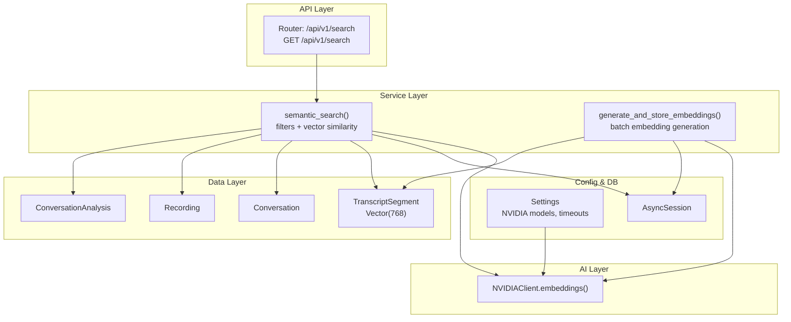
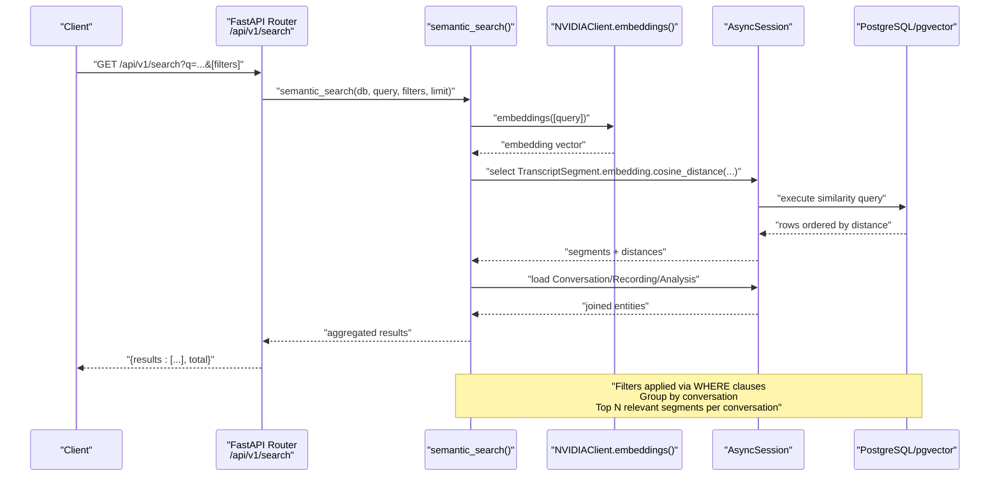
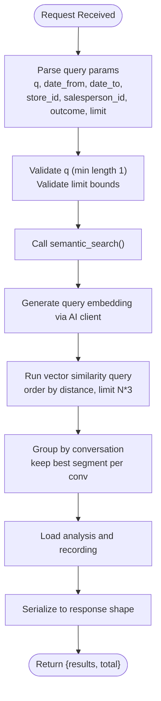
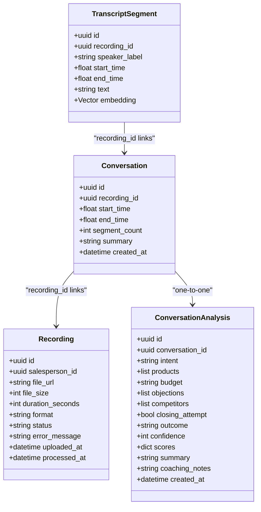
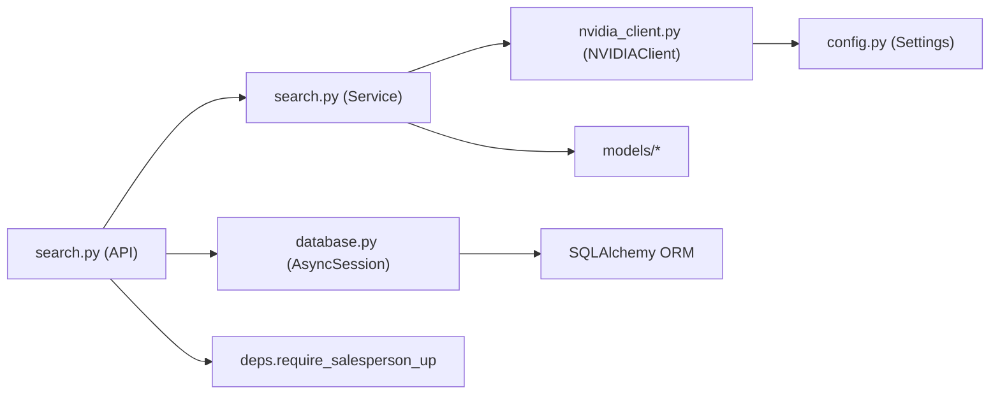

# Search API

<cite>
**Referenced Files in This Document**
- [apps/api/src/api/v1/search.py](file://apps/api/src/api/v1/search.py)
- [apps/api/src/services/search.py](file://apps/api/src/services/search.py)
- [apps/api/src/api/v1/router.py](file://apps/api/src/api/v1/router.py)
- [apps/api/src/models/conversation.py](file://apps/api/src/models/conversation.py)
- [apps/api/src/models/transcript.py](file://apps/api/src/models/transcript.py)
- [apps/api/src/schemas/conversation.py](file://apps/api/src/schemas/conversation.py)
- [apps/api/src/schemas/recording.py](file://apps/api/src/schemas/recording.py)
- [apps/api/src/database.py](file://apps/api/src/database.py)
- [apps/api/src/ai/nvidia_client.py](file://apps/api/src/ai/nvidia_client.py)
- [apps/api/src/config.py](file://apps/api/src/config.py)
</cite>

## Table of Contents
1. [Introduction](#introduction)
2. [Project Structure](#project-structure)
3. [Core Components](#core-components)
4. [Architecture Overview](#architecture-overview)
5. [Detailed Component Analysis](#detailed-component-analysis)
6. [Dependency Analysis](#dependency-analysis)
7. [Performance Considerations](#performance-considerations)
8. [Troubleshooting Guide](#troubleshooting-guide)
9. [Conclusion](#conclusion)

## Introduction
This document provides comprehensive API documentation for the unified search functionality that enables semantic search across conversations and their associated transcript segments. The search endpoint supports full-text-like semantic similarity using vector embeddings, optional temporal and organizational filters, and returns ranked results with relevant transcript snippets.

Key capabilities:
- Semantic search powered by pgvector cosine distance against text embeddings
- Filtering by date range, salesperson, store, and conversation outcome
- Ranking via similarity score derived from vector distance
- Pagination via a configurable limit parameter
- Results enriched with conversation metadata, analysis, recording metadata, and relevant transcript segments

## Project Structure
The search feature spans API routing, service logic, models, schemas, and AI embedding integration:
- API router mounts the search endpoint under the v1 API namespace
- Service performs semantic search, generates embeddings, and aggregates results
- Models define the conversation, recording, and transcript segment entities
- Schemas define serialization shapes for responses
- AI client integrates with NVIDIA NIM for embeddings
- Database configuration provides async SQLAlchemy sessions

**Diagram sources**
- [apps/api/src/api/v1/search.py:14-99](file://apps/api/src/api/v1/search.py#L14-L99)
- [apps/api/src/services/search.py:16-165](file://apps/api/src/services/search.py#L16-L165)
- [apps/api/src/models/transcript.py:10-27](file://apps/api/src/models/transcript.py#L10-L27)
- [apps/api/src/models/conversation.py:11-61](file://apps/api/src/models/conversation.py#L11-L61)
- [apps/api/src/ai/nvidia_client.py:237-269](file://apps/api/src/ai/nvidia_client.py#L237-L269)
- [apps/api/src/config.py:28-35](file://apps/api/src/config.py#L28-L35)
- [apps/api/src/database.py:26-34](file://apps/api/src/database.py#L26-L34)

**Section sources**
- [apps/api/src/api/v1/router.py:9-19](file://apps/api/src/api/v1/router.py#L9-L19)
- [apps/api/src/api/v1/search.py:14-99](file://apps/api/src/api/v1/search.py#L14-L99)
- [apps/api/src/services/search.py:16-165](file://apps/api/src/services/search.py#L16-L165)

## Core Components
- Search endpoint: GET /api/v1/search
  - Purpose: Perform semantic search across transcript segments and return conversation cards with relevant segments
  - Authentication: Requires a valid salesperson context
  - Query parameters:
    - q (required): Search query string (min length 1)
    - date_from (optional): ISO date string; filter recordings uploaded on or after this date
    - date_to (optional): ISO date string; filter recordings uploaded on or before this date
    - store_id (optional): UUID string; filter by store (via salesperson association)
    - salesperson_id (optional): UUID string; filter by salesperson
    - outcome (optional): String; filter by conversation outcome
    - limit (optional): Integer, default 20, min 1, max 100
  - Response shape:
    - results: Array of items containing:
      - conversation: Conversation metadata
      - analysis: Conversation analysis (nullable)
      - recording: Recording metadata (nullable)
      - relevant_segments: Array of transcript segments relevant to the query
      - similarity_score: Numeric similarity score derived from vector distance
    - total: Number of results returned

- Semantic search service:
  - Generates embeddings for the query using NVIDIA NIM
  - Performs vector similarity search on transcript segments using cosine distance
  - Applies filters and groups results by conversation
  - Loads related conversation analysis and recording metadata
  - Returns aggregated results with top relevant segments per conversation

- Embedding generation utility:
  - Generates embeddings for transcript segments without existing vectors
  - Processes in batches to optimize throughput
  - Skips failed batches and logs errors

**Section sources**
- [apps/api/src/api/v1/search.py:14-99](file://apps/api/src/api/v1/search.py#L14-L99)
- [apps/api/src/services/search.py:16-165](file://apps/api/src/services/search.py#L16-L165)

## Architecture Overview
The search flow combines FastAPI routing, SQLAlchemy ORM, pgvector similarity, and external AI embeddings.

**Diagram sources**
- [apps/api/src/api/v1/search.py:14-99](file://apps/api/src/api/v1/search.py#L14-L99)
- [apps/api/src/services/search.py:16-124](file://apps/api/src/services/search.py#L16-L124)
- [apps/api/src/ai/nvidia_client.py:237-269](file://apps/api/src/ai/nvidia_client.py#L237-L269)
- [apps/api/src/database.py:26-34](file://apps/api/src/database.py#L26-L34)

## Detailed Component Analysis

### API Endpoint: GET /api/v1/search
- Method: GET
- Path: /api/v1/search
- Authentication: Requires a valid salesperson context
- Query parameters:
  - q (required): Search query string
  - date_from (optional): Date filter for uploaded_at
  - date_to (optional): Date filter for uploaded_at
  - store_id (optional): UUID to filter by store (via salesperson association)
  - salesperson_id (optional): UUID to filter by salesperson
  - outcome (optional): Outcome value to filter by conversation outcome
  - limit (optional): Integer, default 20, min 1, max 100
- Response:
  - results: Array of items with conversation, analysis, recording, relevant_segments, similarity_score
  - total: Integer count of results

**Diagram sources**
- [apps/api/src/api/v1/search.py:14-99](file://apps/api/src/api/v1/search.py#L14-L99)
- [apps/api/src/services/search.py:16-124](file://apps/api/src/services/search.py#L16-L124)

**Section sources**
- [apps/api/src/api/v1/search.py:14-99](file://apps/api/src/api/v1/search.py#L14-L99)

### Semantic Search Service
- Embedding generation:
  - Uses NVIDIA NIM embeddings endpoint
  - Supports batching to reduce API overhead
  - Flushes changes per batch
- Vector similarity:
  - Computes cosine distance between query embedding and segment embeddings
  - Filters segments whose conversation fully encompasses the segment timestamps
  - Applies optional filters (date range, salesperson, store, outcome)
  - Over-fetches results to account for deduplication and grouping
- Aggregation:
  - Groups by conversation ID
  - Loads related analysis and recording
  - Builds result items with top relevant segments per conversation
  - Converts distance to similarity_score (rounded)

**Diagram sources**
- [apps/api/src/models/transcript.py:10-27](file://apps/api/src/models/transcript.py#L10-L27)
- [apps/api/src/models/conversation.py:11-61](file://apps/api/src/models/conversation.py#L11-L61)
- [apps/api/src/schemas/conversation.py:4-33](file://apps/api/src/schemas/conversation.py#L4-L33)
- [apps/api/src/schemas/recording.py:4-17](file://apps/api/src/schemas/recording.py#L4-L17)

**Section sources**
- [apps/api/src/services/search.py:16-165](file://apps/api/src/services/search.py#L16-L165)
- [apps/api/src/models/transcript.py:10-27](file://apps/api/src/models/transcript.py#L10-L27)
- [apps/api/src/models/conversation.py:11-61](file://apps/api/src/models/conversation.py#L11-L61)
- [apps/api/src/schemas/conversation.py:4-33](file://apps/api/src/schemas/conversation.py#L4-L33)
- [apps/api/src/schemas/recording.py:4-17](file://apps/api/src/schemas/recording.py#L4-L17)

### Embedding Generation Utility
- Purpose: Generate embeddings for transcript segments that lack them
- Behavior:
  - Selects segments without embeddings for a given recording
  - Batches texts and requests embeddings
  - Updates segment vectors and flushes changes
  - Logs and continues on batch failures

**Section sources**
- [apps/api/src/services/search.py:126-165](file://apps/api/src/services/search.py#L126-L165)

### Data Models and Serialization
- ConversationResponse: Defines the serialized conversation shape returned by the endpoint
- RecordingResponse and TranscriptSegmentResponse: Define serialized shapes for recording and segment data
- These schemas ensure consistent serialization of nested objects in the search results

**Section sources**
- [apps/api/src/schemas/conversation.py:4-33](file://apps/api/src/schemas/conversation.py#L4-L33)
- [apps/api/src/schemas/recording.py:4-17](file://apps/api/src/schemas/recording.py#L4-L17)

## Dependency Analysis
- API depends on:
  - Service for semantic search logic
  - Database session provider for async operations
  - User dependency for salesperson context
- Service depends on:
  - AI client for embeddings
  - SQLAlchemy ORM for queries and joins
  - Models for entity relationships
- AI client depends on:
  - Configuration for base URL, API key, and model settings
- Database configuration provides:
  - Async engine and session factory

**Diagram sources**
- [apps/api/src/api/v1/search.py:14-99](file://apps/api/src/api/v1/search.py#L14-L99)
- [apps/api/src/services/search.py:16-165](file://apps/api/src/services/search.py#L16-L165)
- [apps/api/src/database.py:26-34](file://apps/api/src/database.py#L26-L34)
- [apps/api/src/ai/nvidia_client.py:237-269](file://apps/api/src/ai/nvidia_client.py#L237-L269)
- [apps/api/src/config.py:28-35](file://apps/api/src/config.py#L28-L35)

**Section sources**
- [apps/api/src/api/v1/search.py:14-99](file://apps/api/src/api/v1/search.py#L14-L99)
- [apps/api/src/services/search.py:16-165](file://apps/api/src/services/search.py#L16-L165)
- [apps/api/src/database.py:26-34](file://apps/api/src/database.py#L26-L34)
- [apps/api/src/ai/nvidia_client.py:237-269](file://apps/api/src/ai/nvidia_client.py#L237-L269)
- [apps/api/src/config.py:28-35](file://apps/api/src/config.py#L28-L35)

## Performance Considerations
- Vector similarity:
  - Uses pgvector cosine distance; ensure appropriate indexes exist on the embedding column
  - Over-fetches results (limit * 3) to improve deduplication quality before grouping
- Embedding generation:
  - Batch processing reduces API call overhead
  - Flushes per batch to maintain progress and reduce memory pressure
- Query filtering:
  - Filters applied early to reduce candidate set
  - Joins leverage foreign keys and indexes on recording_id and timestamps
- Pagination:
  - Configurable limit with upper bound to prevent excessive loads
- External API resilience:
  - AI client includes retry logic and error handling for rate limits and transient failures
- Database tuning:
  - Async engine with connection pooling configured for concurrent workloads

[No sources needed since this section provides general guidance]

## Troubleshooting Guide
- Authentication failures:
  - Ensure a valid salesperson context is present for the endpoint
- NVIDIA API errors:
  - Check API key and base URL configuration
  - Review rate limit handling and retry behavior
- Missing embeddings:
  - Run embedding generation for transcript segments
  - Verify embedding column is populated and vectors are valid
- Slow responses:
  - Confirm vector index exists and query filters are applied
  - Adjust limit and consider pre-filtering by date/store/salesperson
- Data inconsistencies:
  - Validate conversation boundaries encompass transcript segments
  - Ensure conversation analysis and recording records exist for returned conversations

**Section sources**
- [apps/api/src/api/v1/search.py:24-25](file://apps/api/src/api/v1/search.py#L24-L25)
- [apps/api/src/ai/nvidia_client.py:13-71](file://apps/api/src/ai/nvidia_client.py#L13-L71)
- [apps/api/src/services/search.py:126-165](file://apps/api/src/services/search.py#L126-L165)

## Conclusion
The search API provides a robust, scalable semantic search capability across conversations and transcript segments. It leverages vector embeddings, flexible filtering, and efficient aggregation to deliver relevant results with conversation context. Proper indexing, embedding maintenance, and careful use of filters and limits are essential for optimal performance.