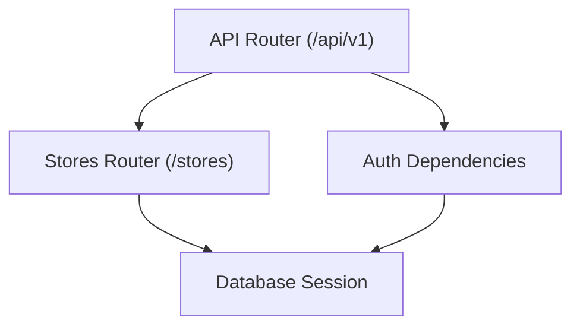
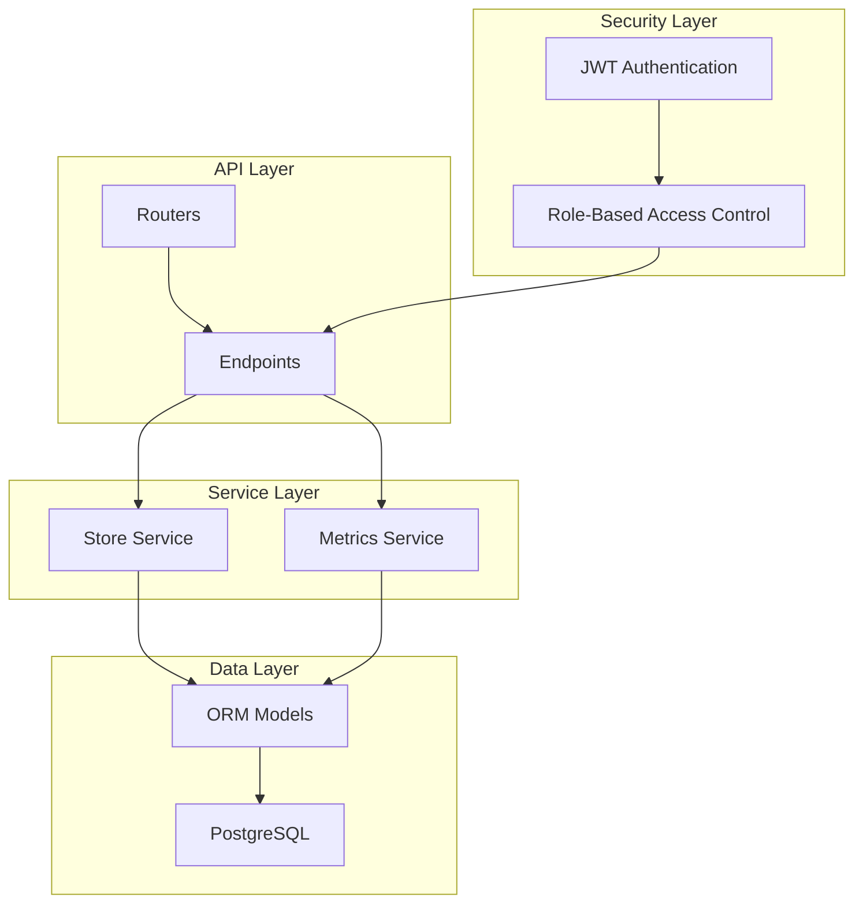
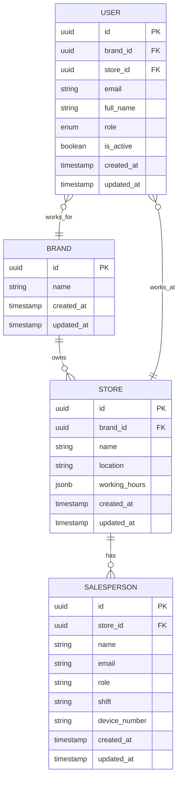
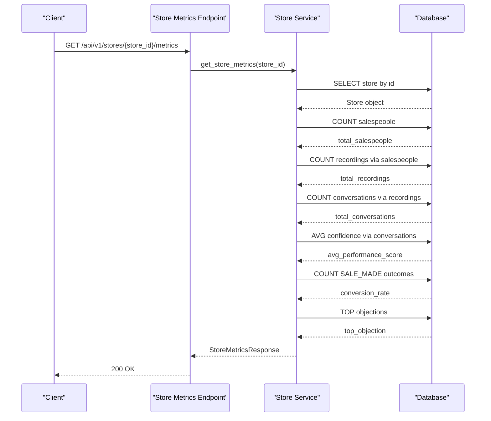
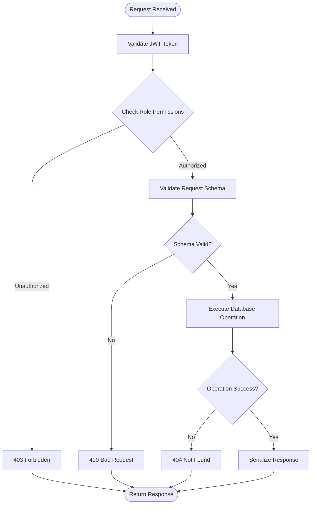
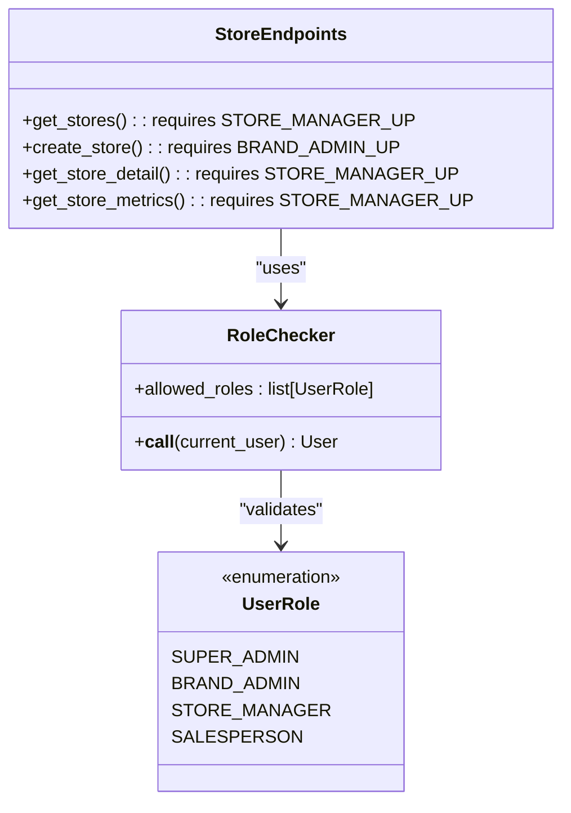
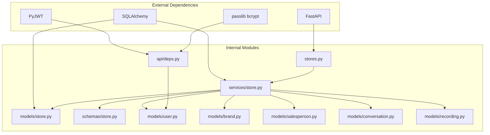

# Store Management API

<cite>
**Referenced Files in This Document**
- [stores.py](file://apps/api/src/api/v1/stores.py)
- [store.py](file://apps/api/src/models/store.py)
- [store.py](file://apps/api/src/schemas/store.py)
- [store.py](file://apps/api/src/services/store.py)
- [router.py](file://apps/api/src/api/v1/router.py)
- [deps.py](file://apps/api/src/api/deps.py)
- [brand.py](file://apps/api/src/models/brand.py)
- [salesperson.py](file://apps/api/src/models/salesperson.py)
- [conversation.py](file://apps/api/src/models/conversation.py)
- [recording.py](file://apps/api/src/models/recording.py)
- [user.py](file://apps/api/src/models/user.py)
- [auth.py](file://apps/api/src/services/auth.py)
</cite>

## Table of Contents
1. [Introduction](#introduction)
2. [Project Structure](#project-structure)
3. [Core Components](#core-components)
4. [Architecture Overview](#architecture-overview)
5. [Detailed Component Analysis](#detailed-component-analysis)
6. [Dependency Analysis](#dependency-analysis)
7. [Performance Considerations](#performance-considerations)
8. [Troubleshooting Guide](#troubleshooting-guide)
9. [Conclusion](#conclusion)

## Introduction
This document provides comprehensive API documentation for store management operations. It covers all endpoints for store CRUD functionality, hierarchical relationships with brands and salesperson assignments, request/response schemas, validation requirements, analytics endpoints, performance metrics aggregation, reporting capabilities, store hierarchy navigation, bulk operations, performance data retrieval, store-level permissions, access control mechanisms, and data ownership patterns.

## Project Structure
The store management API is implemented within the FastAPI application under the `/api/v1` namespace. The store endpoints are grouped under the `/stores` prefix and integrated into the main API router. The implementation leverages SQLAlchemy ORM models for data persistence and Pydantic schemas for request/response validation.

**Diagram sources**
- [router.py:11-20](file://apps/api/src/api/v1/router.py#L11-L20)
- [stores.py:10](file://apps/api/src/api/v1/stores.py#L10)

**Section sources**
- [router.py:1-20](file://apps/api/src/api/v1/router.py#L1-L20)
- [stores.py:1-53](file://apps/api/src/api/v1/stores.py#L1-L53)

## Core Components
This section documents the store management endpoints, their HTTP methods, URL patterns, request/response schemas, and validation requirements.

### Store Endpoints
- **List Stores**
  - Method: GET
  - URL: `/api/v1/stores`
  - Query Parameters:
    - `brand_id`: Optional string UUID to filter stores by brand
  - Authentication/Authorization:
    - Requires role: STORE_MANAGER or higher
  - Response: Array of StoreResponse objects
  - Validation: brand_id must be a valid UUID when provided

- **Create Store**
  - Method: POST
  - URL: `/api/v1/stores`
  - Request Body: StoreCreate schema
  - Authentication/Authorization:
    - Requires role: BRAND_ADMIN or SUPER_ADMIN
  - Response: StoreResponse object
  - Validation: brand_id must reference an existing brand

- **Get Store Details**
  - Method: GET
  - URL: `/api/v1/stores/{store_id}`
  - Path Parameter:
    - `store_id`: Required string UUID
  - Authentication/Authorization:
    - Requires role: STORE_MANAGER or higher
  - Response: StoreResponse object
  - Validation: store_id must be a valid UUID

- **Get Store Metrics**
  - Method: GET
  - URL: `/api/v1/stores/{store_id}/metrics`
  - Path Parameter:
    - `store_id`: Required string UUID
  - Authentication/Authorization:
    - Requires role: STORE_MANAGER or higher
  - Response: StoreMetricsResponse object
  - Validation: store_id must be a valid UUID

### Store Schemas
- **StoreCreate**
  - Fields:
    - `name`: Required string
    - `brand_id`: Required string UUID
    - `location`: Optional string
    - `working_hours`: Optional dictionary
  - Validation: name is required, brand_id must be a valid UUID

- **StoreUpdate**
  - Fields:
    - `name`: Optional string
    - `location`: Optional string
    - `working_hours`: Optional dictionary
  - Validation: At least one field must be provided

- **StoreResponse**
  - Fields:
    - `id`: Required string UUID
    - `brand_id`: Required string UUID
    - `name`: Required string
    - `location`: Optional string
    - `working_hours`: Optional dictionary
    - `created_at`: Required ISO 8601 timestamp
    - `updated_at`: Required ISO 8601 timestamp

- **StoreMetricsResponse**
  - Fields:
    - `store_id`: Required string UUID
    - `name`: Required string
    - `total_salespeople`: Required integer
    - `total_recordings`: Required integer
    - `total_conversations`: Required integer
    - `avg_performance_score`: Optional float
    - `conversion_rate`: Optional float
    - `top_objection`: Optional string

**Section sources**
- [stores.py:13-52](file://apps/api/src/api/v1/stores.py#L13-L52)
- [store.py:4-38](file://apps/api/src/schemas/store.py#L4-L38)

## Architecture Overview
The store management API follows a layered architecture with clear separation of concerns:
- API Layer: FastAPI routes handle HTTP requests and responses
- Service Layer: Business logic for store operations and metrics calculation
- Data Layer: SQLAlchemy ORM models and database queries
- Authentication/Authorization: JWT-based access control with role-based permissions

**Diagram sources**
- [stores.py:1-53](file://apps/api/src/api/v1/stores.py#L1-L53)
- [store.py:1-142](file://apps/api/src/services/store.py#L1-L142)
- [deps.py:41-63](file://apps/api/src/api/deps.py#L41-L63)

## Detailed Component Analysis

### Store Model and Relationships
The store entity maintains hierarchical relationships with brands and salespeople, forming a three-tier hierarchy: Brand → Store → Salesperson.

**Diagram sources**
- [brand.py:10-26](file://apps/api/src/models/brand.py#L10-L26)
- [store.py:11-32](file://apps/api/src/models/store.py#L11-L32)
- [salesperson.py:10-32](file://apps/api/src/models/salesperson.py#L10-L32)
- [user.py:19-48](file://apps/api/src/models/user.py#L19-L48)

### Store Metrics Calculation
The metrics endpoint aggregates performance data across the store hierarchy, calculating counts and averages from related entities.

**Diagram sources**
- [stores.py:43-52](file://apps/api/src/api/v1/stores.py#L43-L52)
- [store.py:53-142](file://apps/api/src/services/store.py#L53-L142)

### Store CRUD Operations Flow
The store CRUD operations follow a consistent pattern with authentication and authorization checks.

**Diagram sources**
- [stores.py:13-52](file://apps/api/src/api/v1/stores.py#L13-L52)
- [deps.py:12-38](file://apps/api/src/api/deps.py#L12-L38)

### Permission and Access Control
The API implements role-based access control with hierarchical permissions:

**Diagram sources**
- [user.py:12-17](file://apps/api/src/models/user.py#L12-L17)
- [deps.py:41-63](file://apps/api/src/api/deps.py#L41-L63)
- [stores.py:4-8](file://apps/api/src/api/v1/stores.py#L4-L8)

**Section sources**
- [store.py:1-142](file://apps/api/src/services/store.py#L1-L142)
- [deps.py:41-63](file://apps/api/src/api/deps.py#L41-L63)
- [user.py:12-17](file://apps/api/src/models/user.py#L12-L17)

## Dependency Analysis
The store management system has well-defined dependencies between components, ensuring maintainable and testable code.

**Diagram sources**
- [stores.py:1-8](file://apps/api/src/api/v1/stores.py#L1-L8)
- [store.py:1-142](file://apps/api/src/services/store.py#L1-L142)
- [deps.py:1-7](file://apps/api/src/api/deps.py#L1-L7)

**Section sources**
- [stores.py:1-8](file://apps/api/src/api/v1/stores.py#L1-L8)
- [store.py:1-142](file://apps/api/src/services/store.py#L1-L142)

## Performance Considerations
The store metrics endpoint performs multiple database queries to aggregate performance data. Key performance considerations include:

- **Query Optimization**: The metrics calculation uses correlated subqueries to count related entities efficiently
- **Index Usage**: Foreign key relationships and query filters leverage database indexing
- **Memory Efficiency**: Results are processed incrementally without loading entire datasets into memory
- **Caching Opportunities**: Frequently accessed store metrics could benefit from application-level caching
- **Pagination**: List operations support filtering but don't implement pagination for large datasets

## Troubleshooting Guide
Common issues and their resolutions:

### Authentication and Authorization Issues
- **401 Unauthorized**: Verify JWT token validity and expiration
- **403 Forbidden**: Check user role permissions against required roles
- **Invalid Token Payload**: Ensure token contains proper subject and type claims

### Data Validation Errors
- **400 Bad Request**: Validate request schema against StoreCreate/StoreUpdate requirements
- **UUID Format Errors**: Ensure all ID parameters use valid UUID format
- **Brand Reference Errors**: Verify brand_id exists in the brands table

### Database and Relationship Issues
- **404 Not Found**: Confirm store exists and belongs to authorized brand
- **Relationship Integrity**: Check foreign key constraints for cascading operations
- **Permission Conflicts**: Verify user store assignment matches requested operations

**Section sources**
- [deps.py:12-38](file://apps/api/src/api/deps.py#L12-L38)
- [stores.py:38-51](file://apps/api/src/api/v1/stores.py#L38-L51)

## Conclusion
The store management API provides comprehensive CRUD operations with robust authentication, authorization, and metrics aggregation capabilities. The implementation follows clean architectural patterns with clear separation of concerns, well-defined schemas, and efficient database operations. The role-based access control ensures appropriate data ownership and security boundaries across the store hierarchy.