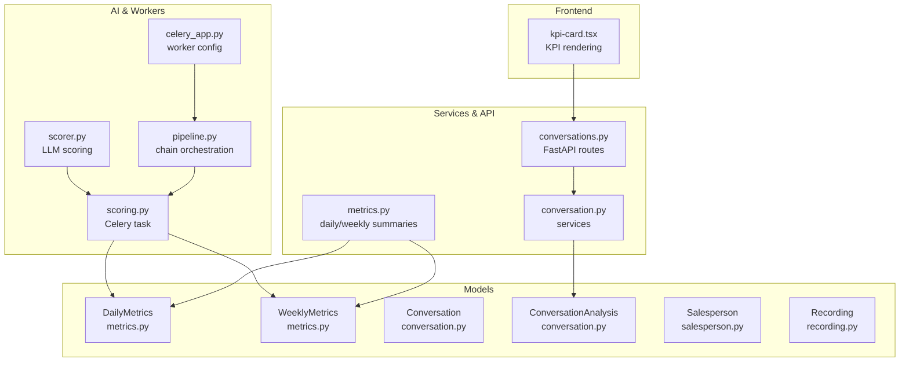
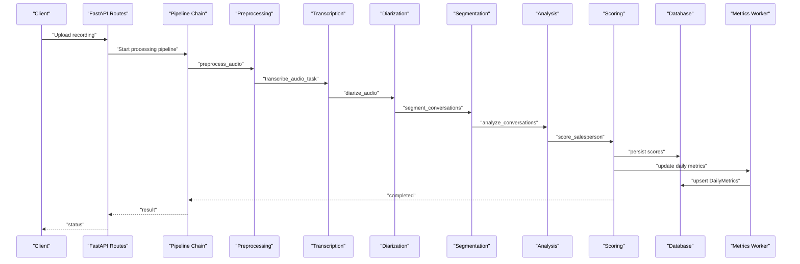
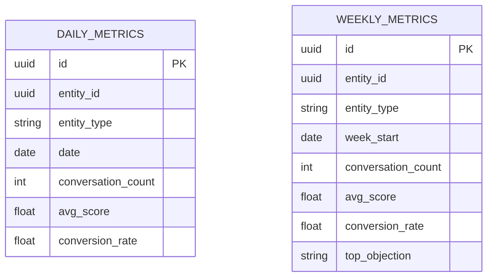
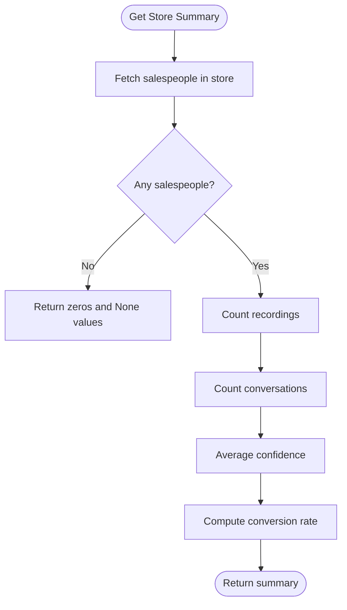
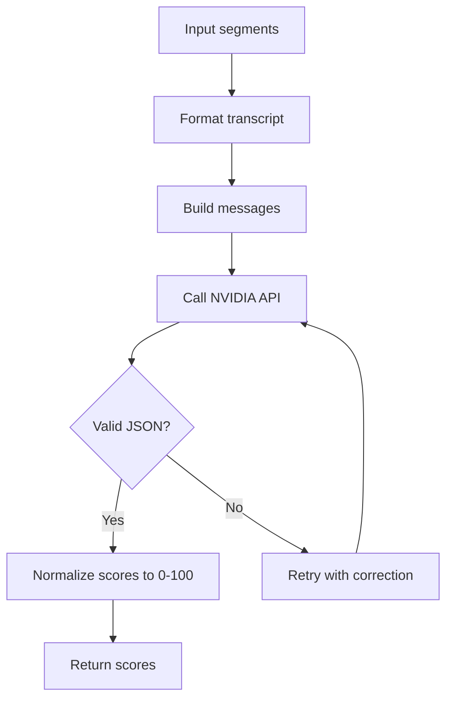
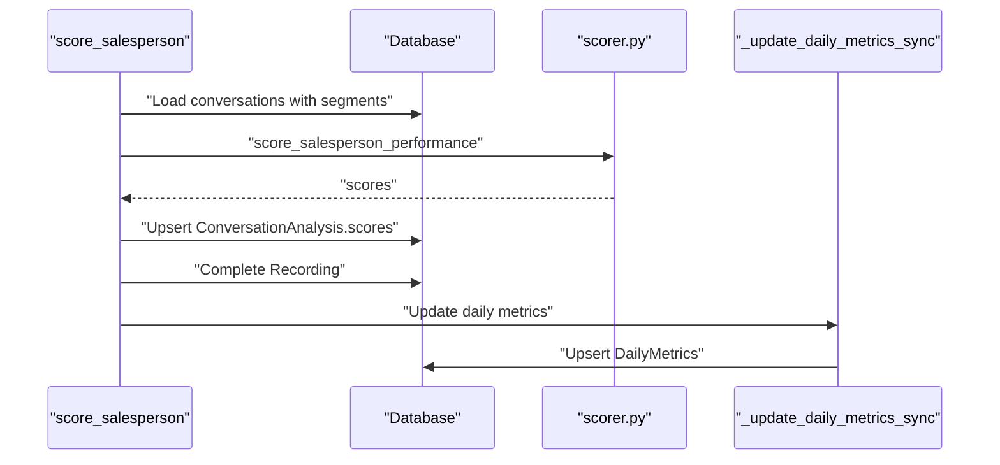
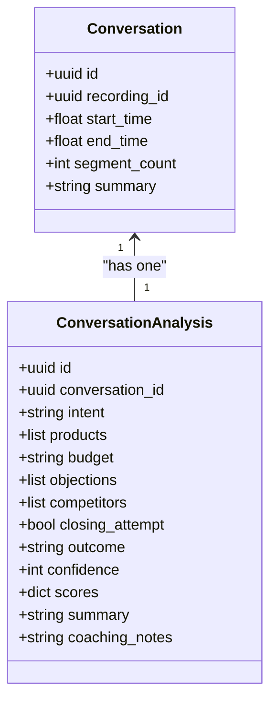
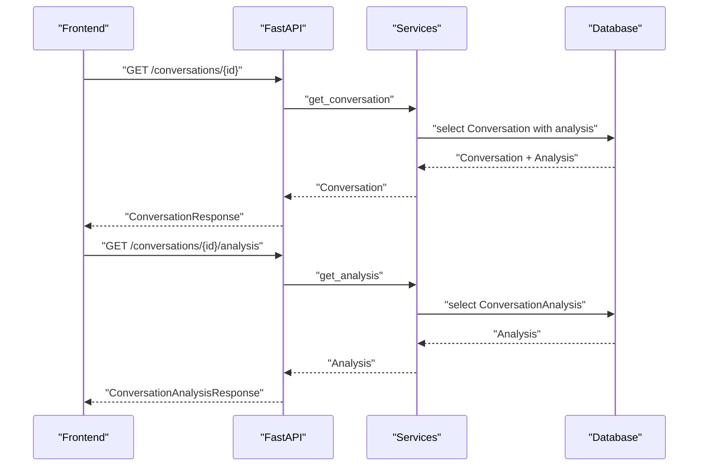
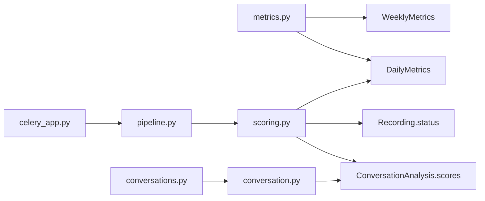

# Analytics & Metrics

<cite>
**Referenced Files in This Document**
- [metrics.py](file://apps/api/src/models/metrics.py)
- [metrics.py](file://apps/api/src/services/metrics.py)
- [scorer.py](file://apps/api/src/ai/scorer.py)
- [scoring.py](file://apps/api/src/workers/scoring.py)
- [conversation.py](file://apps/api/src/models/conversation.py)
- [salesperson.py](file://apps/api/src/models/salesperson.py)
- [recording.py](file://apps/api/src/models/recording.py)
- [pipeline.py](file://apps/api/src/workers/pipeline.py)
- [celery_app.py](file://apps/api/src/workers/celery_app.py)
- [conversation.py](file://apps/api/src/api/v1/conversations.py)
- [conversation.py](file://apps/api/src/services/conversation.py)
- [kpi-card.tsx](file://apps/web/src/components/kpi-card.tsx)
</cite>

## Table of Contents
1. [Introduction](#introduction)
2. [Project Structure](#project-structure)
3. [Core Components](#core-components)
4. [Architecture Overview](#architecture-overview)
5. [Detailed Component Analysis](#detailed-component-analysis)
6. [Dependency Analysis](#dependency-analysis)
7. [Performance Considerations](#performance-considerations)
8. [Troubleshooting Guide](#troubleshooting-guide)
9. [Conclusion](#conclusion)
10. [Appendices](#appendices)

## Introduction
This document describes the analytics and metrics services that power performance calculations and business intelligence across the platform. It focuses on:
- KPI calculation algorithms for performance scoring
- Aggregation of conversation analysis results into meaningful business metrics
- Daily and weekly metrics for individuals and organizations
- Integration with conversation data, salesperson performance tracking, and organizational reporting
- Examples of metric computation workflows, data aggregation patterns, and reporting dashboards
- Caching strategies, performance optimization techniques, and real-time analytics capabilities

## Project Structure
The analytics and metrics system spans several layers:
- Data models define persistent entities for metrics, conversations, recordings, and salespeople
- AI scoring module implements the LLM-based performance scoring across five dimensions
- Worker tasks orchestrate the audio-to-insights pipeline and update metrics
- Services expose APIs for retrieving metrics and conversation analysis
- Frontend components render KPIs and insights

**Diagram sources**
- [metrics.py:10-39](file://apps/api/src/models/metrics.py#L10-L39)
- [conversation.py:11-61](file://apps/api/src/models/conversation.py#L11-L61)
- [salesperson.py:10-32](file://apps/api/src/models/salesperson.py#L10-L32)
- [recording.py:24-60](file://apps/api/src/models/recording.py#L24-L60)
- [scorer.py:66-122](file://apps/api/src/ai/scorer.py#L66-L122)
- [scoring.py:235-314](file://apps/api/src/workers/scoring.py#L235-L314)
- [pipeline.py:12-35](file://apps/api/src/workers/pipeline.py#L12-L35)
- [celery_app.py:5-31](file://apps/api/src/workers/celery_app.py#L5-L31)
- [metrics.py:13-191](file://apps/api/src/services/metrics.py#L13-L191)
- [conversation.py:10-26](file://apps/api/src/services/conversation.py#L10-L26)
- [conversation.py:13-35](file://apps/api/src/api/v1/conversations.py#L13-L35)
- [kpi-card.tsx](file://apps/web/src/components/kpi-card.tsx)

**Section sources**
- [metrics.py:10-39](file://apps/api/src/models/metrics.py#L10-L39)
- [scorer.py:66-122](file://apps/api/src/ai/scorer.py#L66-L122)
- [scoring.py:235-314](file://apps/api/src/workers/scoring.py#L235-L314)
- [metrics.py:13-191](file://apps/api/src/services/metrics.py#L13-L191)
- [conversation.py:11-61](file://apps/api/src/models/conversation.py#L11-L61)
- [salesperson.py:10-32](file://apps/api/src/models/salesperson.py#L10-L32)
- [recording.py:24-60](file://apps/api/src/models/recording.py#L24-L60)
- [pipeline.py:12-35](file://apps/api/src/workers/pipeline.py#L12-L35)
- [celery_app.py:5-31](file://apps/api/src/workers/celery_app.py#L5-L31)
- [conversation.py:10-26](file://apps/api/src/services/conversation.py#L10-L26)
- [conversation.py:13-35](file://apps/api/src/api/v1/conversations.py#L13-L35)
- [kpi-card.tsx](file://apps/web/src/components/kpi-card.tsx)

## Core Components
- Metrics models: DailyMetrics and WeeklyMetrics persist daily and weekly aggregates keyed by entity type and ID.
- Metrics services: Retrieve daily/weekly series and compute store and salesperson summaries.
- AI scoring: LLM-based dimension scoring across greeting, discovery, product knowledge, objection handling, and closing.
- Scoring worker: Orchestrates per-conversation scoring, persists scores, updates daily metrics, and marks recording completion.
- Pipeline orchestration: Chains preprocessing, transcription, diarization, segmentation, analysis, and scoring.
- Conversation models and services: Persist conversation transcripts, analysis, and outcomes; expose retrieval APIs.

Key responsibilities:
- Entity-level KPIs: conversation counts, average performance scores, conversion rates
- Aggregation patterns: per-salesperson, per-store, and per-day
- Real-time updates: daily metrics computed after scoring completes
- Reporting: dashboards can consume daily/weekly series and summary endpoints

**Section sources**
- [metrics.py:10-39](file://apps/api/src/models/metrics.py#L10-L39)
- [metrics.py:13-191](file://apps/api/src/services/metrics.py#L13-L191)
- [scorer.py:66-122](file://apps/api/src/ai/scorer.py#L66-L122)
- [scoring.py:235-314](file://apps/api/src/workers/scoring.py#L235-L314)
- [conversation.py:11-61](file://apps/api/src/models/conversation.py#L11-L61)
- [conversation.py:10-26](file://apps/api/src/services/conversation.py#L10-L26)

## Architecture Overview
The analytics pipeline transforms raw audio recordings into actionable metrics:
- Audio processing pipeline runs asynchronously via Celery
- LLM scoring produces per-conversation dimension scores
- Metrics worker updates daily metrics for salespeople and stores
- Services and API endpoints serve historical series and summaries
- Frontend renders KPIs and insights

**Diagram sources**
- [pipeline.py:12-35](file://apps/api/src/workers/pipeline.py#L12-L35)
- [celery_app.py:5-31](file://apps/api/src/workers/celery_app.py#L5-L31)
- [scoring.py:235-314](file://apps/api/src/workers/scoring.py#L235-L314)
- [metrics.py:10-39](file://apps/api/src/models/metrics.py#L10-L39)

## Detailed Component Analysis

### Metrics Data Models
Daily and weekly metrics are persisted with uniqueness constraints on entity_id, entity_type, and date/week_start respectively. They capture conversation counts, average performance scores, and conversion rates.

**Diagram sources**
- [metrics.py:10-39](file://apps/api/src/models/metrics.py#L10-L39)

**Section sources**
- [metrics.py:10-39](file://apps/api/src/models/metrics.py#L10-L39)

### Metrics Services
- Daily series retrieval: filter by entity and optional date range, ordered by descending date
- Weekly series retrieval: last N weeks by default
- Store summary: counts recordings and conversations, averages confidence, computes conversion rate
- Salesperson summary: counts conversations, averages per-dimension scores from JSONB, computes conversion rate

**Diagram sources**
- [metrics.py:53-121](file://apps/api/src/services/metrics.py#L53-L121)

**Section sources**
- [metrics.py:13-191](file://apps/api/src/services/metrics.py#L13-L191)

### AI Scoring Module
The LLM scoring module evaluates five dimensions per conversation:
- Greeting score
- Discovery score
- Product knowledge score
- Objection handling score
- Closing score

It formats transcript segments, sends a system prompt plus user content to the NVIDIA NIM API, parses and normalizes the JSON response, and computes averages across multiple conversations.

**Diagram sources**
- [scorer.py:66-122](file://apps/api/src/ai/scorer.py#L66-L122)
- [scorer.py:137-179](file://apps/api/src/ai/scorer.py#L137-L179)
- [scorer.py:182-217](file://apps/api/src/ai/scorer.py#L182-L217)

**Section sources**
- [scorer.py:66-122](file://apps/api/src/ai/scorer.py#L66-L122)
- [scorer.py:182-217](file://apps/api/src/ai/scorer.py#L182-L217)

### Scoring Worker
The Celery task orchestrates:
- Loading conversations with transcript segments
- Scoring each conversation and storing scores in the analysis JSONB field
- Computing averages across scored conversations
- Completing the recording and updating daily metrics for the salesperson and store

**Diagram sources**
- [scoring.py:235-314](file://apps/api/src/workers/scoring.py#L235-L314)
- [scoring.py:109-146](file://apps/api/src/workers/scoring.py#L109-L146)
- [scoring.py:148-234](file://apps/api/src/workers/scoring.py#L148-L234)
- [scorer.py:66-122](file://apps/api/src/ai/scorer.py#L66-L122)

**Section sources**
- [scoring.py:235-314](file://apps/api/src/workers/scoring.py#L235-L314)
- [scoring.py:109-146](file://apps/api/src/workers/scoring.py#L109-L146)
- [scoring.py:148-234](file://apps/api/src/workers/scoring.py#L148-L234)

### Conversation Models and Services
- Conversation captures timing and segment count
- ConversationAnalysis stores structured insights, outcomes, confidence, and dimension scores
- Services load conversation details with analysis and fetch analysis by conversation

**Diagram sources**
- [conversation.py:11-61](file://apps/api/src/models/conversation.py#L11-L61)

**Section sources**
- [conversation.py:11-61](file://apps/api/src/models/conversation.py#L11-L61)
- [conversation.py:10-26](file://apps/api/src/services/conversation.py#L10-L26)

### API and Frontend Integration
- FastAPI routes expose conversation and analysis retrieval
- Frontend KPI cards render summarized metrics for dashboards

**Diagram sources**
- [conversation.py:13-35](file://apps/api/src/api/v1/conversations.py#L13-L35)
- [conversation.py:10-26](file://apps/api/src/services/conversation.py#L10-L26)

**Section sources**
- [conversation.py:13-35](file://apps/api/src/api/v1/conversations.py#L13-L35)
- [conversation.py:10-26](file://apps/api/src/services/conversation.py#L10-L26)
- [kpi-card.tsx](file://apps/web/src/components/kpi-card.tsx)

## Dependency Analysis
- Metrics services depend on SQLAlchemy queries against DailyMetrics and WeeklyMetrics
- Scoring worker depends on ConversationAnalysis JSONB field and Recording status transitions
- Pipeline orchestration depends on Celery task registry and Redis backend
- Conversation services depend on model relationships for eager loading

**Diagram sources**
- [metrics.py:13-191](file://apps/api/src/services/metrics.py#L13-L191)
- [metrics.py:10-39](file://apps/api/src/models/metrics.py#L10-L39)
- [scoring.py:235-314](file://apps/api/src/workers/scoring.py#L235-L314)
- [conversation.py:35-61](file://apps/api/src/models/conversation.py#L35-L61)
- [recording.py:24-60](file://apps/api/src/models/recording.py#L24-L60)
- [pipeline.py:12-35](file://apps/api/src/workers/pipeline.py#L12-L35)
- [celery_app.py:5-31](file://apps/api/src/workers/celery_app.py#L5-L31)
- [conversation.py:10-26](file://apps/api/src/services/conversation.py#L10-L26)
- [conversation.py:13-35](file://apps/api/src/api/v1/conversations.py#L13-L35)

**Section sources**
- [metrics.py:13-191](file://apps/api/src/services/metrics.py#L13-L191)
- [metrics.py:10-39](file://apps/api/src/models/metrics.py#L10-L39)
- [scoring.py:235-314](file://apps/api/src/workers/scoring.py#L235-L314)
- [conversation.py:35-61](file://apps/api/src/models/conversation.py#L35-L61)
- [recording.py:24-60](file://apps/api/src/models/recording.py#L24-L60)
- [pipeline.py:12-35](file://apps/api/src/workers/pipeline.py#L12-L35)
- [celery_app.py:5-31](file://apps/api/src/workers/celery_app.py#L5-L31)
- [conversation.py:10-26](file://apps/api/src/services/conversation.py#L10-L26)
- [conversation.py:13-35](file://apps/api/src/api/v1/conversations.py#L13-L35)

## Performance Considerations
- Asynchronous processing: Celery tasks process pipeline stages independently to avoid blocking
- Batched writes: Scoring worker upserts DailyMetrics after processing a recording to minimize write contention
- Efficient queries: Metrics services filter by entity and date ranges; SQLAlchemy selects scalars for minimal overhead
- JSONB indexing: ConversationAnalysis.scores and related fields are JSONB; consider partial indexes for frequent filters
- Retry and backoff: Scoring task includes retries for transient failures
- Worker tuning: Soft/hard time limits and prefetch controls prevent long-running tasks from starving the queue

[No sources needed since this section provides general guidance]

## Troubleshooting Guide
Common issues and resolutions:
- Scoring failures: The scoring worker logs warnings and retries; on final failure, it sets Recording status to FAILED with an error message
- Empty conversations: If no transcript segments are present, scoring is skipped and the recording is completed
- Missing analysis: Ensure analysis is generated before attempting to compute averages; check conversation linkage to analysis
- Metric gaps: Verify that daily metrics are being updated after scoring completes; confirm entity_id/entity_type match

**Section sources**
- [scoring.py:308-314](file://apps/api/src/workers/scoring.py#L308-L314)
- [scoring.py:250-306](file://apps/api/src/workers/scoring.py#L250-L306)
- [conversation.py:35-61](file://apps/api/src/models/conversation.py#L35-L61)

## Conclusion
The analytics and metrics system integrates AI-driven performance scoring with robust data models and asynchronous processing to deliver timely, actionable insights. Daily and weekly metrics support individual and organizational reporting, while conversation analysis enables detailed coaching and improvement tracking. The modular design allows for incremental enhancements, such as expanding KPIs, adding trend analysis, and optimizing caching strategies.

[No sources needed since this section summarizes without analyzing specific files]

## Appendices

### Example Metric Computation Workflows
- Daily metrics for a salesperson:
  - Load recordings uploaded today for the salesperson
  - Count conversations and compute average of per-conversation dimension scores
  - Count sales and compute conversion rate
  - Upsert DailyMetrics for entity type SALESPERSON
- Weekly metrics for a store:
  - Aggregate daily metrics for the last N weeks
  - Compute averages and top objection (placeholder)
- Store summary:
  - Summarize across all salespeople in the store: total recordings, total conversations, average confidence, conversion rate

**Section sources**
- [scoring.py:109-146](file://apps/api/src/workers/scoring.py#L109-L146)
- [scoring.py:148-234](file://apps/api/src/workers/scoring.py#L148-L234)
- [metrics.py:53-121](file://apps/api/src/services/metrics.py#L53-L121)
- [metrics.py:124-191](file://apps/api/src/services/metrics.py#L124-L191)

### Data Aggregation Patterns
- Per-entity (salesperson/store) daily rollups
- Cross-entity weekly rollups
- Summary aggregations by store and salesperson
- JSONB-based dimension scoring for scalable per-conversation insights

**Section sources**
- [metrics.py:10-39](file://apps/api/src/models/metrics.py#L10-L39)
- [metrics.py:13-191](file://apps/api/src/services/metrics.py#L13-L191)
- [conversation.py:35-61](file://apps/api/src/models/conversation.py#L35-L61)

### Reporting Dashboards
- KPI cards display key metrics such as average performance score and conversion rate
- Timeline and transcript viewers provide contextual insights linked to conversation analysis
- Store and salesperson pages aggregate summaries and series for trend analysis

**Section sources**
- [kpi-card.tsx](file://apps/web/src/components/kpi-card.tsx)
- [conversation.py:13-35](file://apps/api/src/api/v1/conversations.py#L13-L35)

### Caching Strategies
- Consider caching recent daily/weekly series in Redis keyed by entity_id and entity_type to reduce database load
- Cache store and salesperson summaries for dashboard refresh intervals
- Use cache invalidation on daily metric upserts to maintain freshness

[No sources needed since this section provides general guidance]

### Real-time Analytics Capabilities
- Asynchronous pipeline ensures near-real-time availability of metrics after scoring completes
- Frontend polling or WebSocket subscriptions can reflect latest metrics updates
- Worker soft/hard time limits and retry logic improve reliability for real-time workloads

**Section sources**
- [celery_app.py:19-30](file://apps/api/src/workers/celery_app.py#L19-L30)
- [scoring.py:308-314](file://apps/api/src/workers/scoring.py#L308-L314)