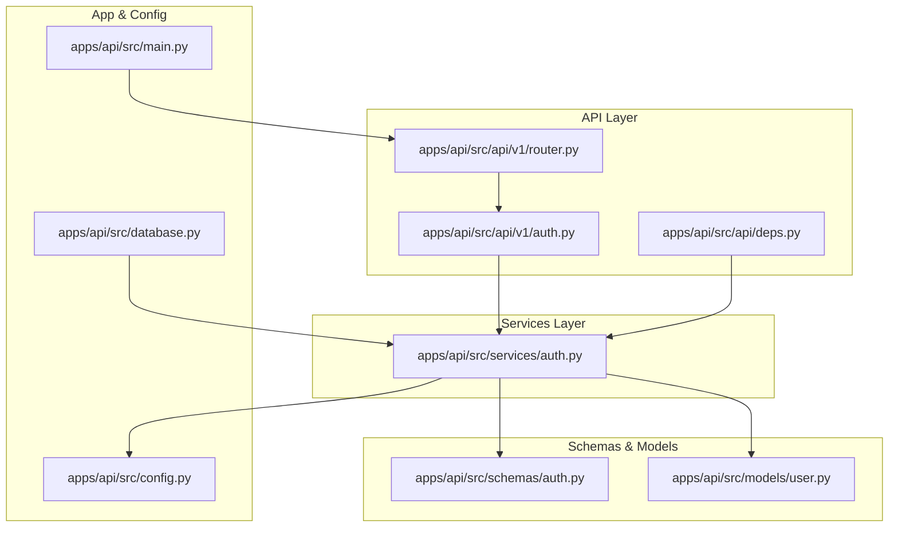
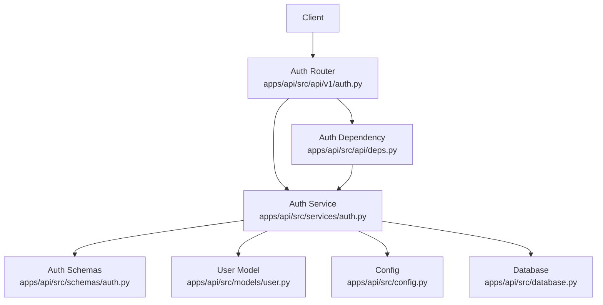
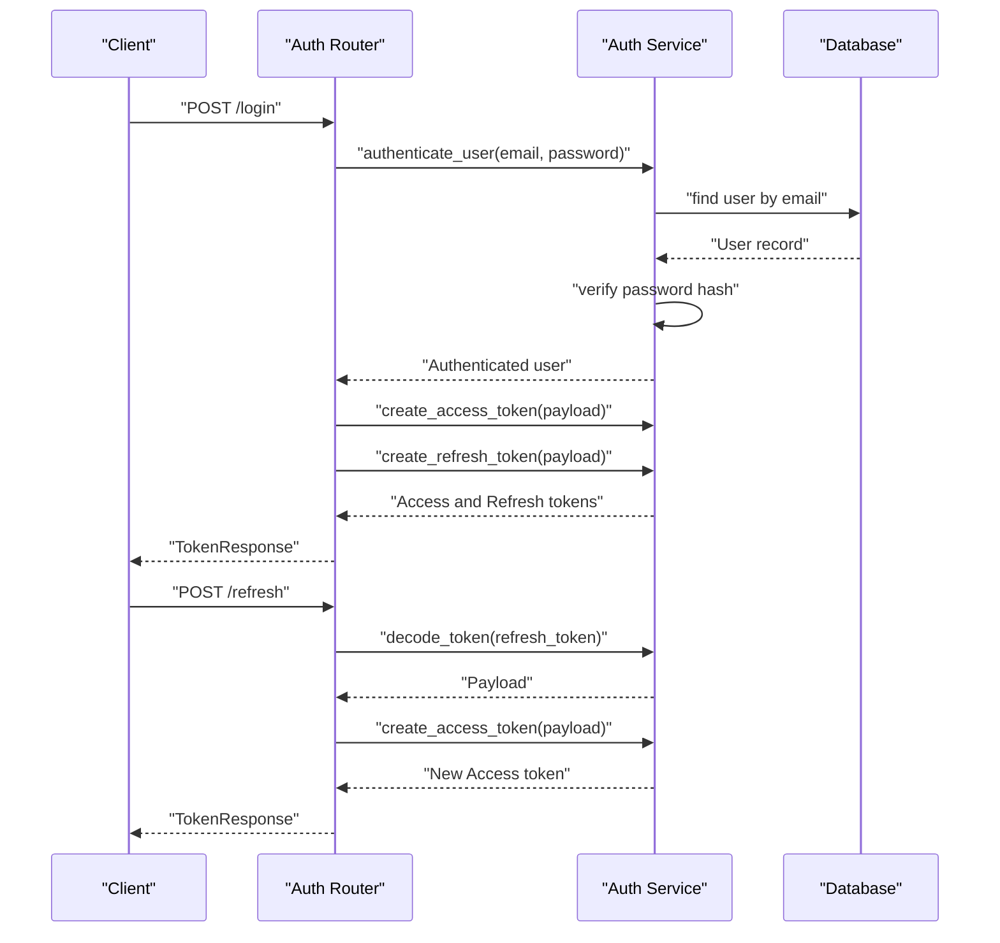
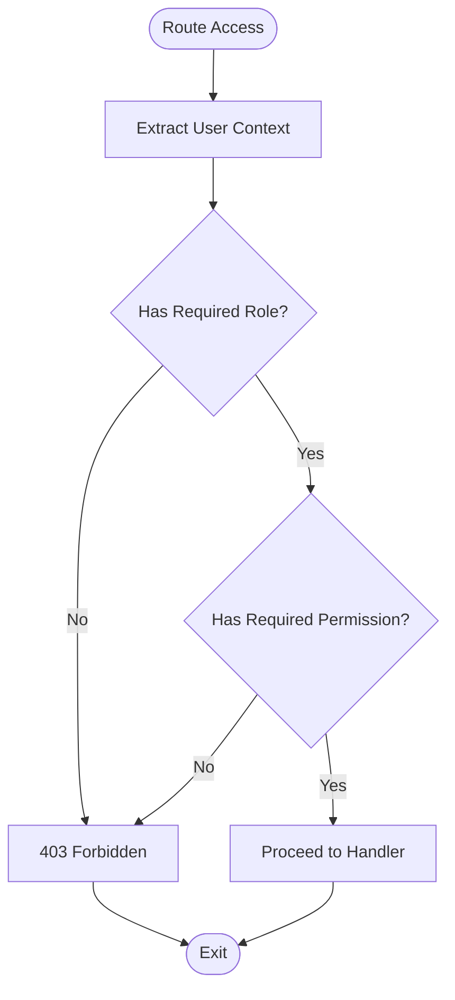
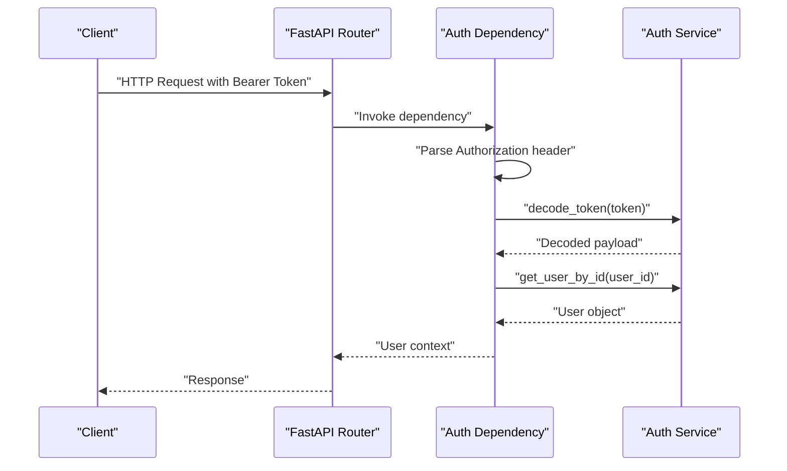
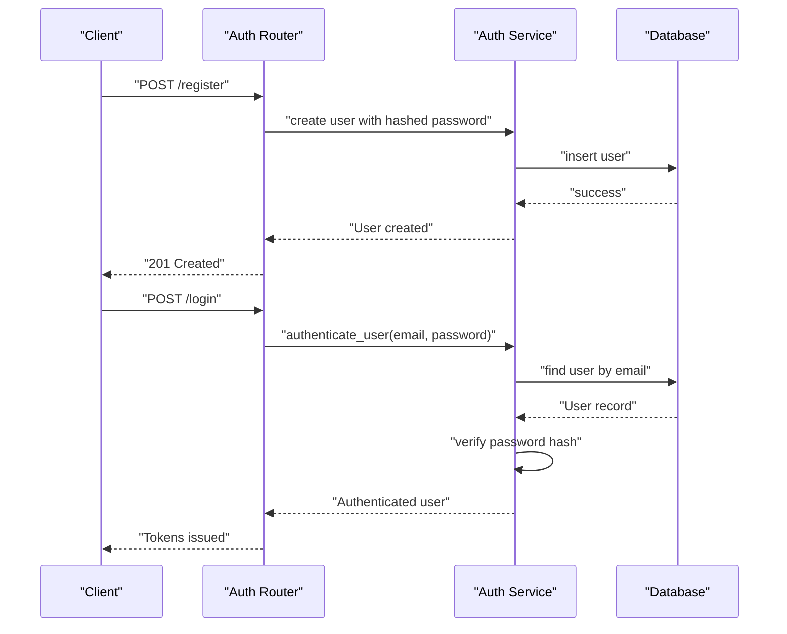
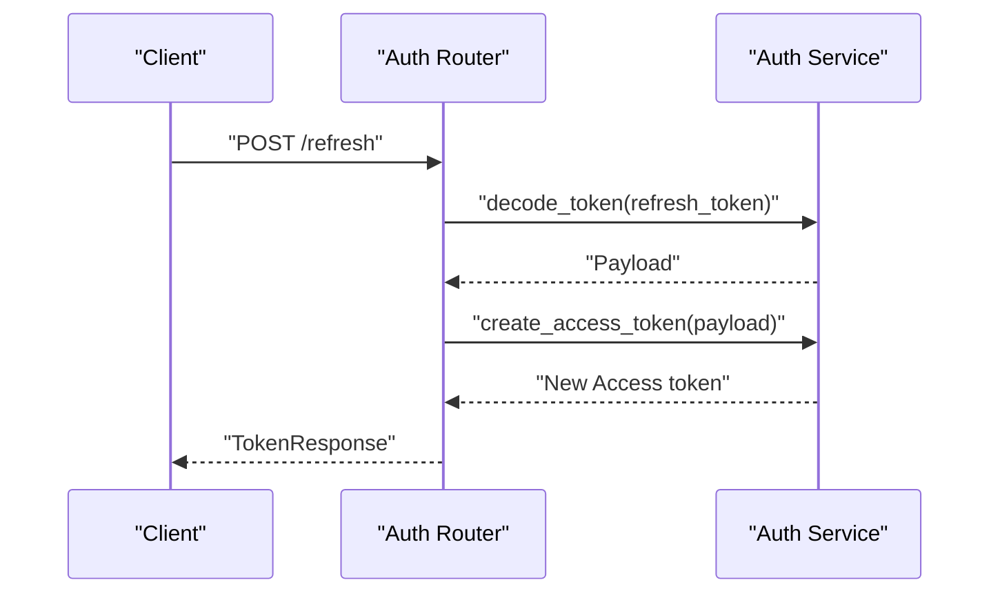
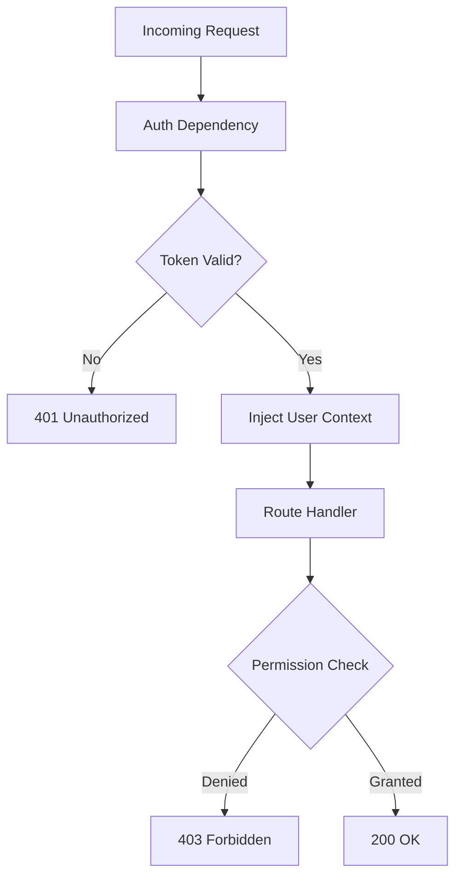
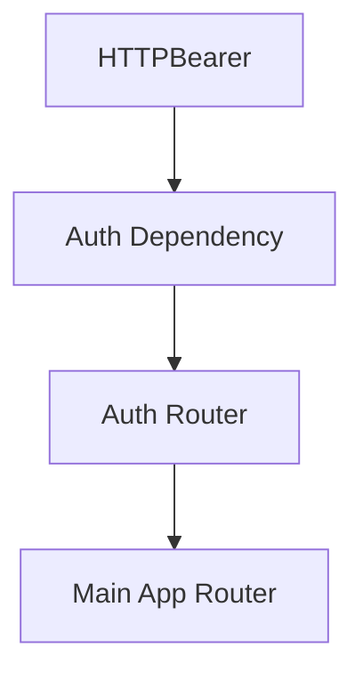
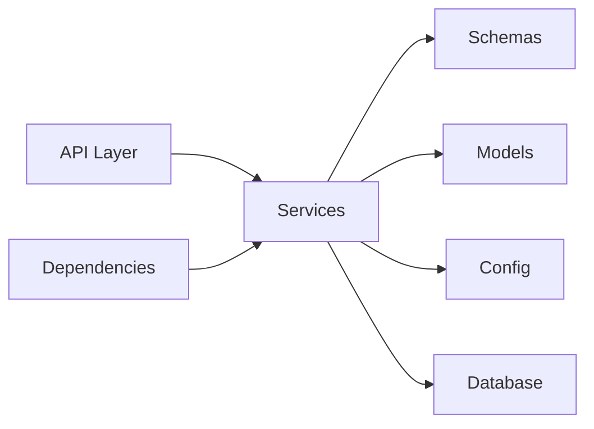

# Authentication & Authorization

<cite>
**Referenced Files in This Document**
- [auth.py](file://apps/api/src/api/v1/auth.py)
- [deps.py](file://apps/api/src/api/deps.py)
- [router.py](file://apps/api/src/api/v1/router.py)
- [auth_service.py](file://apps/api/src/services/auth.py)
- [auth_schema.py](file://apps/api/src/schemas/auth.py)
- [user_model.py](file://apps/api/src/models/user.py)
- [main.py](file://apps/api/src/main.py)
- [config.py](file://apps/api/src/config.py)
- [database.py](file://apps/api/src/database.py)
</cite>

## Table of Contents
1. [Introduction](#introduction)
2. [Project Structure](#project-structure)
3. [Core Components](#core-components)
4. [Architecture Overview](#architecture-overview)
5. [Detailed Component Analysis](#detailed-component-analysis)
6. [Dependency Analysis](#dependency-analysis)
7. [Performance Considerations](#performance-considerations)
8. [Troubleshooting Guide](#troubleshooting-guide)
9. [Conclusion](#conclusion)

## Introduction
This document provides comprehensive documentation for the authentication and authorization service implementation in the FastAPI backend. It covers JWT token management (generation, validation, refresh, and expiration handling), role-based access control (RBAC) patterns, dependency injection for authentication context and session management, password hashing, user registration and login/logout flows, token refresh strategies, protected route decorators, permission checks, user context extraction, security best practices, token storage considerations, and integration with the FastAPI dependency system.

## Project Structure
The authentication subsystem is organized around three primary layers:
- API Layer: Exposes authentication routes and integrates with FastAPI routers.
- Services Layer: Implements core authentication logic including token creation, decoding, and user lookup.
- Schemas and Models: Define request/response structures and user entity definitions.
- Dependencies: Provide FastAPI dependency injection for extracting and validating authentication context.

**Diagram sources**
- [auth.py:1-200](file://apps/api/src/api/v1/auth.py#L1-L200)
- [router.py:1-50](file://apps/api/src/api/v1/router.py#L1-L50)
- [deps.py:1-40](file://apps/api/src/api/deps.py#L1-L40)
- [auth_service.py:1-300](file://apps/api/src/services/auth.py#L1-L300)
- [auth_schema.py:1-200](file://apps/api/src/schemas/auth.py#L1-L200)
- [user_model.py:1-200](file://apps/api/src/models/user.py#L1-L200)
- [config.py:1-100](file://apps/api/src/config.py#L1-L100)
- [main.py:1-100](file://apps/api/src/main.py#L1-L100)
- [database.py:1-100](file://apps/api/src/database.py#L1-L100)

**Section sources**
- [auth.py:1-200](file://apps/api/src/api/v1/auth.py#L1-L200)
- [router.py:1-50](file://apps/api/src/api/v1/router.py#L1-L50)
- [deps.py:1-40](file://apps/api/src/api/deps.py#L1-L40)
- [auth_service.py:1-300](file://apps/api/src/services/auth.py#L1-L300)
- [auth_schema.py:1-200](file://apps/api/src/schemas/auth.py#L1-L200)
- [user_model.py:1-200](file://apps/api/src/models/user.py#L1-L200)
- [config.py:1-100](file://apps/api/src/config.py#L1-L100)
- [main.py:1-100](file://apps/api/src/main.py#L1-L100)
- [database.py:1-100](file://apps/api/src/database.py#L1-L100)

## Core Components
- Authentication Router: Defines endpoints for login, logout, registration, and token refresh.
- Authentication Service: Implements token creation, decoding, user authentication, and user retrieval by ID.
- Authentication Schemas: Define request/response structures for authentication operations.
- User Model: Represents user entity with hashed passwords and roles/permissions.
- Dependency Injection: Provides a reusable dependency to extract and validate the bearer token and inject user context.
- Application Configuration: Centralizes JWT secret, algorithm, and token expiry settings.
- Database Integration: Connects authentication service to persistent storage for user records.

Key responsibilities:
- JWT lifecycle management: creation, validation, refresh, and expiration handling.
- RBAC enforcement: role-based access control via user roles and permissions.
- Secure session management: secure token issuance and context propagation.
- FastAPI integration: seamless dependency injection and protected route decoration.

**Section sources**
- [auth.py:1-200](file://apps/api/src/api/v1/auth.py#L1-L200)
- [auth_service.py:1-300](file://apps/api/src/services/auth.py#L1-L300)
- [auth_schema.py:1-200](file://apps/api/src/schemas/auth.py#L1-L200)
- [user_model.py:1-200](file://apps/api/src/models/user.py#L1-L200)
- [deps.py:1-40](file://apps/api/src/api/deps.py#L1-L40)
- [config.py:1-100](file://apps/api/src/config.py#L1-L100)
- [database.py:1-100](file://apps/api/src/database.py#L1-L100)

## Architecture Overview
The authentication architecture follows a layered design:
- API Layer exposes endpoints and delegates to services.
- Services encapsulate business logic and interact with schemas, models, and configuration.
- Dependencies enforce authentication and authorization policies at runtime.
- Configuration centralizes security parameters.
- Database persists user data and supports authentication queries.

**Diagram sources**
- [auth.py:1-200](file://apps/api/src/api/v1/auth.py#L1-L200)
- [deps.py:1-40](file://apps/api/src/api/deps.py#L1-L40)
- [auth_service.py:1-300](file://apps/api/src/services/auth.py#L1-L300)
- [auth_schema.py:1-200](file://apps/api/src/schemas/auth.py#L1-L200)
- [user_model.py:1-200](file://apps/api/src/models/user.py#L1-L200)
- [config.py:1-100](file://apps/api/src/config.py#L1-L100)
- [database.py:1-100](file://apps/api/src/database.py#L1-L100)

## Detailed Component Analysis

### JWT Token Management
- Token Generation: Access and refresh tokens are created using a configured secret and algorithm, with claims including user identity and expiry.
- Token Validation: Tokens are decoded and validated against current time and signature; invalid/expired tokens trigger authentication errors.
- Refresh Mechanism: Refresh tokens are validated and exchanged for new access tokens to maintain sessions without re-authentication.
- Expiration Handling: Access tokens expire after a short duration; refresh tokens expire after a longer duration or upon misuse detection.

**Diagram sources**
- [auth.py:1-200](file://apps/api/src/api/v1/auth.py#L1-L200)
- [auth_service.py:1-300](file://apps/api/src/services/auth.py#L1-L300)
- [user_model.py:1-200](file://apps/api/src/models/user.py#L1-L200)
- [database.py:1-100](file://apps/api/src/database.py#L1-L100)

**Section sources**
- [auth.py:1-200](file://apps/api/src/api/v1/auth.py#L1-L200)
- [auth_service.py:1-300](file://apps/api/src/services/auth.py#L1-L300)
- [config.py:1-100](file://apps/api/src/config.py#L1-L100)

### Role-Based Access Control (RBAC)
- User Roles and Permissions: Users carry roles and associated permissions; services enforce access based on these attributes.
- Access Enforcement Patterns: Protected routes and dependencies validate user roles and permissions before granting access.
- Permission Checks: Utilities and decorators encapsulate permission checks for reuse across endpoints.

**Diagram sources**
- [auth_service.py:1-300](file://apps/api/src/services/auth.py#L1-L300)
- [user_model.py:1-200](file://apps/api/src/models/user.py#L1-L200)

**Section sources**
- [auth_service.py:1-300](file://apps/api/src/services/auth.py#L1-L300)
- [user_model.py:1-200](file://apps/api/src/models/user.py#L1-L200)

### Dependency Injection for Authentication Context
- Bearer Token Extraction: A FastAPI dependency extracts the Authorization header, validates scheme, and passes the token to downstream handlers.
- Token Decoding and Validation: The dependency decodes the token and raises authentication errors for invalid/expired tokens.
- User Context Injection: On successful validation, the user object is injected into route handlers for access enforcement.

**Diagram sources**
- [deps.py:1-40](file://apps/api/src/api/deps.py#L1-L40)
- [auth_service.py:1-300](file://apps/api/src/services/auth.py#L1-L300)

**Section sources**
- [deps.py:1-40](file://apps/api/src/api/deps.py#L1-L40)
- [auth_service.py:1-300](file://apps/api/src/services/auth.py#L1-L300)

### Password Hashing and User Registration
- Password Hashing: Passwords are hashed securely during user creation and verified during authentication.
- User Registration Flow: Registration endpoint creates a new user with hashed password and initial roles/permissions.
- Login/Logout Processes: Login validates credentials and issues tokens; logout can invalidate tokens via refresh token revocation or server-side blacklisting.

**Diagram sources**
- [auth.py:1-200](file://apps/api/src/api/v1/auth.py#L1-L200)
- [auth_service.py:1-300](file://apps/api/src/services/auth.py#L1-L300)
- [user_model.py:1-200](file://apps/api/src/models/user.py#L1-L200)
- [database.py:1-100](file://apps/api/src/database.py#L1-L100)

**Section sources**
- [auth.py:1-200](file://apps/api/src/api/v1/auth.py#L1-L200)
- [auth_service.py:1-300](file://apps/api/src/services/auth.py#L1-L300)
- [user_model.py:1-200](file://apps/api/src/models/user.py#L1-L200)

### Token Refresh Strategies
- Refresh Endpoint: Validates refresh token and issues a new access token.
- Security Considerations: Refresh tokens may be rotated, bound to devices, or tracked to mitigate theft.
- Session Continuity: Refresh mechanism maintains user sessions without repeated credential entry.

**Diagram sources**
- [auth.py:1-200](file://apps/api/src/api/v1/auth.py#L1-L200)
- [auth_service.py:1-300](file://apps/api/src/services/auth.py#L1-L300)

**Section sources**
- [auth.py:1-200](file://apps/api/src/api/v1/auth.py#L1-L200)
- [auth_service.py:1-300](file://apps/api/src/services/auth.py#L1-L300)

### Protected Route Decorators and Permission Checks
- Protected Routes: Endpoints are decorated to require authenticated users via the dependency injection system.
- Permission Checks: Handlers enforce role and permission requirements before processing requests.
- User Context Extraction: Route handlers receive the authenticated user object for access control decisions.

**Diagram sources**
- [deps.py:1-40](file://apps/api/src/api/deps.py#L1-L40)
- [auth_service.py:1-300](file://apps/api/src/services/auth.py#L1-L300)

**Section sources**
- [deps.py:1-40](file://apps/api/src/api/deps.py#L1-L40)
- [auth_service.py:1-300](file://apps/api/src/services/auth.py#L1-L300)

### Integration with FastAPI Dependency System
- HTTP Bearer Security: Uses FastAPI’s HTTPBearer to extract Authorization headers.
- Dependency Declaration: Declares dependencies with Depends to enforce authentication and authorization.
- Global Router Integration: The auth router is included in the main application router.

**Diagram sources**
- [deps.py:1-40](file://apps/api/src/api/deps.py#L1-L40)
- [router.py:1-50](file://apps/api/src/api/v1/router.py#L1-L50)
- [main.py:1-100](file://apps/api/src/main.py#L1-L100)

**Section sources**
- [deps.py:1-40](file://apps/api/src/api/deps.py#L1-L40)
- [router.py:1-50](file://apps/api/src/api/v1/router.py#L1-L50)
- [main.py:1-100](file://apps/api/src/main.py#L1-L100)

## Dependency Analysis
The authentication system exhibits low coupling and high cohesion:
- API depends on Services for business logic.
- Services depend on Schemas for data contracts, Models for persistence, and Config for security parameters.
- Dependencies rely on Services for token decoding and user lookup.
- Database provides persistence for user records.

**Diagram sources**
- [auth.py:1-200](file://apps/api/src/api/v1/auth.py#L1-L200)
- [auth_service.py:1-300](file://apps/api/src/services/auth.py#L1-L300)
- [auth_schema.py:1-200](file://apps/api/src/schemas/auth.py#L1-L200)
- [user_model.py:1-200](file://apps/api/src/models/user.py#L1-L200)
- [config.py:1-100](file://apps/api/src/config.py#L1-L100)
- [database.py:1-100](file://apps/api/src/database.py#L1-L100)

**Section sources**
- [auth.py:1-200](file://apps/api/src/api/v1/auth.py#L1-L200)
- [auth_service.py:1-300](file://apps/api/src/services/auth.py#L1-L300)
- [auth_schema.py:1-200](file://apps/api/src/schemas/auth.py#L1-L200)
- [user_model.py:1-200](file://apps/api/src/models/user.py#L1-L200)
- [config.py:1-100](file://apps/api/src/config.py#L1-L100)
- [database.py:1-100](file://apps/api/src/database.py#L1-L100)

## Performance Considerations
- Token Validation Overhead: Decode and verify tokens per request; minimize unnecessary validations by caching validated contexts when safe.
- Database Queries: Optimize user lookup queries with proper indexing on email and user ID.
- Token Expiry Tuning: Balance session convenience and security by adjusting access and refresh token expirations.
- Dependency Efficiency: Keep dependency logic lightweight to avoid blocking request handling.

## Troubleshooting Guide
Common issues and resolutions:
- Invalid or Expired Token: Ensure clients renew tokens using the refresh endpoint and handle 401 responses gracefully.
- Invalid Token Payload: Verify token signing algorithm and secret alignment across services.
- Authentication Failures: Confirm password hashing and verification logic; ensure user records exist and are not locked.
- Permission Denied: Review user roles and permissions; confirm RBAC checks align with endpoint requirements.

**Section sources**
- [deps.py:1-40](file://apps/api/src/api/deps.py#L1-L40)
- [auth_service.py:1-300](file://apps/api/src/services/auth.py#L1-L300)

## Conclusion
The authentication and authorization service implements a robust, layered architecture with JWT-based session management, RBAC enforcement, and seamless FastAPI integration. By leveraging dependency injection, centralized configuration, and secure token handling, the system ensures secure and scalable access control across protected routes. Adhering to the documented best practices and troubleshooting guidance will help maintain reliability and security in production deployments.