# Business Logic Layer

<cite>
**Referenced Files in This Document**
- [apps/api/src/services/auth.py](file://apps/api/src/services/auth.py)
- [apps/api/src/services/brand.py](file://apps/api/src/services/brand.py)
- [apps/api/src/services/conversation.py](file://apps/api/src/services/conversation.py)
- [apps/api/src/services/export.py](file://apps/api/src/services/export.py)
- [apps/api/src/services/metrics.py](file://apps/api/src/services/metrics.py)
- [apps/api/src/services/recording.py](file://apps/api/src/services/recording.py)
- [apps/api/src/services/salesperson.py](file://apps/api/src/services/salesperson.py)
- [apps/api/src/services/search.py](file://apps/api/src/services/search.py)
- [apps/api/src/services/store.py](file://apps/api/src/services/store.py)
- [apps/api/src/api/deps.py](file://apps/api/src/api/deps.py)
- [apps/api/src/api/v1/router.py](file://apps/api/src/api/v1/router.py)
- [apps/api/src/models/brand.py](file://apps/api/src/models/brand.py)
- [apps/api/src/models/conversation.py](file://apps/api/src/models/conversation.py)
- [apps/api/src/models/metrics.py](file://apps/api/src/models/metrics.py)
- [apps/api/src/models/recording.py](file://apps/api/src/models/recording.py)
- [apps/api/src/models/salesperson.py](file://apps/api/src/models/salesperson.py)
- [apps/api/src/models/store.py](file://apps/api/src/models/store.py)
- [apps/api/src/models/transcript.py](file://apps/api/src/models/transcript.py)
- [apps/api/src/models/user.py](file://apps/api/src/models/user.py)
- [apps/api/src/workers/pipeline.py](file://apps/api/src/workers/pipeline.py)
- [apps/api/src/workers/analysis.py](file://apps/api/src/workers/analysis.py)
- [apps/api/src/workers/diarization.py](file://apps/api/src/workers/diarization.py)
- [apps/api/src/workers/segmentation.py](file://apps/api/src/workers/segmentation.py)
- [apps/api/src/workers/transcription.py](file://apps/api/src/workers/transcription.py)
- [apps/api/src/workers/scoring.py](file://apps/api/src/workers/scoring.py)
- [apps/api/src/storage/local.py](file://apps/api/src/storage/local.py)
- [apps/api/src/storage/base.py](file://apps/api/src/storage/base.py)
- [apps/api/src/ai/analyzer.py](file://apps/api/src/ai/analyzer.py)
- [apps/api/src/ai/diarizer.py](file://apps/api/src/ai/diarizer.py)
- [apps/api/src/ai/segmenter.py](file://apps/api/src/ai/segmenter.py)
- [apps/api/src/ai/stt.py](file://apps/api/src/ai/stt.py)
- [apps/api/src/ai/scorer.py](file://apps/api/src/ai/scorer.py)
- [apps/api/src/main.py](file://apps/api/src/main.py)
- [apps/api/src/database.py](file://apps/api/src/database.py)
- [apps/api/src/config.py](file://apps/api/src/config.py)
</cite>

## Table of Contents
1. [Introduction](#introduction)
2. [Project Structure](#project-structure)
3. [Core Components](#core-components)
4. [Architecture Overview](#architecture-overview)
5. [Detailed Component Analysis](#detailed-component-analysis)
6. [Dependency Analysis](#dependency-analysis)
7. [Performance Considerations](#performance-considerations)
8. [Troubleshooting Guide](#troubleshooting-guide)
9. [Conclusion](#conclusion)

## Introduction
This document describes the business logic layer of the Xsamaa AI Pipeline API. It focuses on how services encapsulate domain logic, coordinate with data access and presentation layers, and leverage dependency injection for clean separation of concerns. The services documented here include authentication and RBAC, brand and store hierarchy management, salesperson performance aggregation, recording processing and quality assessment, conversation analytics, metrics calculation, export/report generation, and search/filtering. Transaction management, error handling, and service composition patterns are also covered, along with controller and worker integrations.

## Project Structure
The business logic resides primarily under apps/api/src/services/. Each service module coordinates with:
- API routes under apps/api/src/api/v1/ for HTTP entry points
- Dependency injection via apps/api/src/api/deps.py
- SQLAlchemy models under apps/api/src/models/ for persistence
- Celery workers under apps/api/src/workers/ for asynchronous processing
- Storage abstractions under apps/api/src/storage/ for file handling
- AI modules under apps/api/src/ai/ for audio/video processing

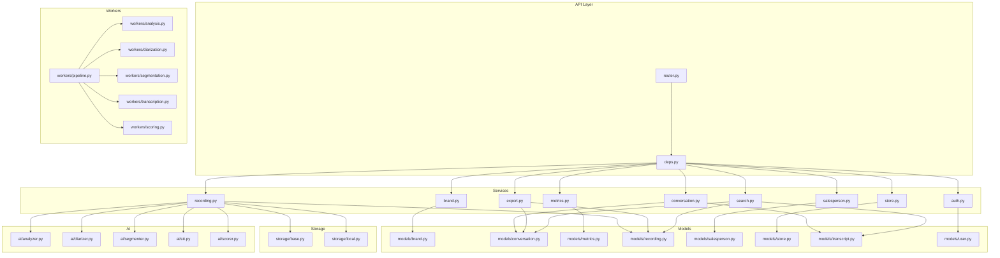

**Diagram sources**
- [apps/api/src/api/v1/router.py](file://apps/api/src/api/v1/router.py)
- [apps/api/src/api/deps.py](file://apps/api/src/api/deps.py)
- [apps/api/src/services/auth.py](file://apps/api/src/services/auth.py)
- [apps/api/src/services/brand.py](file://apps/api/src/services/brand.py)
- [apps/api/src/services/conversation.py](file://apps/api/src/services/conversation.py)
- [apps/api/src/services/export.py](file://apps/api/src/services/export.py)
- [apps/api/src/services/metrics.py](file://apps/api/src/services/metrics.py)
- [apps/api/src/services/recording.py](file://apps/api/src/services/recording.py)
- [apps/api/src/services/salesperson.py](file://apps/api/src/services/salesperson.py)
- [apps/api/src/services/search.py](file://apps/api/src/services/search.py)
- [apps/api/src/services/store.py](file://apps/api/src/services/store.py)
- [apps/api/src/models/brand.py](file://apps/api/src/models/brand.py)
- [apps/api/src/models/conversation.py](file://apps/api/src/models/conversation.py)
- [apps/api/src/models/metrics.py](file://apps/api/src/models/metrics.py)
- [apps/api/src/models/recording.py](file://apps/api/src/models/recording.py)
- [apps/api/src/models/salesperson.py](file://apps/api/src/models/salesperson.py)
- [apps/api/src/models/store.py](file://apps/api/src/models/store.py)
- [apps/api/src/models/transcript.py](file://apps/api/src/models/transcript.py)
- [apps/api/src/models/user.py](file://apps/api/src/models/user.py)
- [apps/api/src/storage/base.py](file://apps/api/src/storage/base.py)
- [apps/api/src/storage/local.py](file://apps/api/src/storage/local.py)
- [apps/api/src/ai/analyzer.py](file://apps/api/src/ai/analyzer.py)
- [apps/api/src/ai/diarizer.py](file://apps/api/src/ai/diarizer.py)
- [apps/api/src/ai/segmenter.py](file://apps/api/src/ai/segmenter.py)
- [apps/api/src/ai/stt.py](file://apps/api/src/ai/stt.py)
- [apps/api/src/ai/scorer.py](file://apps/api/src/ai/scorer.py)
- [apps/api/src/workers/pipeline.py](file://apps/api/src/workers/pipeline.py)
- [apps/api/src/workers/analysis.py](file://apps/api/src/workers/analysis.py)
- [apps/api/src/workers/diarization.py](file://apps/api/src/workers/diarization.py)
- [apps/api/src/workers/segmentation.py](file://apps/api/src/workers/segmentation.py)
- [apps/api/src/workers/transcription.py](file://apps/api/src/workers/transcription.py)
- [apps/api/src/workers/scoring.py](file://apps/api/src/workers/scoring.py)

**Section sources**
- [apps/api/src/api/v1/router.py](file://apps/api/src/api/v1/router.py)
- [apps/api/src/api/deps.py](file://apps/api/src/api/deps.py)

## Core Components
This section outlines the primary service classes and their responsibilities, focusing on encapsulation and separation from data access and presentation layers.

- Authentication Service (JWT and RBAC)
  - Handles user authentication, token issuance, and role-based access control.
  - Integrates with user model and dependency injection for request-scoped services.
  - Provides protected route access based on roles.

- Brand and Store Management Services
  - Manage hierarchical organization of brands and stores.
  - Enforce parent-child relationships and organizational policies.
  - Support queries across nested structures.

- Salesperson Management Service
  - Aggregates performance metrics for salespeople.
  - Computes KPIs from conversations and recordings.
  - Supports filtering and pagination.

- Recording Processing Service
  - Orchestrates file ingestion, quality assessment, and downstream AI processing.
  - Coordinates storage, worker pipeline, and AI modules.
  - Tracks processing states and errors.

- Conversation Analytics Service
  - Generates insights from conversations and transcripts.
  - Aggregates sentiment, topics, and speaker turns.
  - Produces structured analytics artifacts.

- Metrics Calculation Service
  - Computes performance analytics across conversations and salespeople.
  - Maintains metric models and supports historical rollups.

- Export Service
  - Generates reports from processed data.
  - Formats exports for download and integrates with storage.

- Search Service
  - Implements filtering and faceted search across recordings, conversations, and transcripts.
  - Supports text search and metadata filters.

**Section sources**
- [apps/api/src/services/auth.py](file://apps/api/src/services/auth.py)
- [apps/api/src/services/brand.py](file://apps/api/src/services/brand.py)
- [apps/api/src/services/conversation.py](file://apps/api/src/services/conversation.py)
- [apps/api/src/services/export.py](file://apps/api/src/services/export.py)
- [apps/api/src/services/metrics.py](file://apps/api/src/services/metrics.py)
- [apps/api/src/services/recording.py](file://apps/api/src/services/recording.py)
- [apps/api/src/services/salesperson.py](file://apps/api/src/services/salesperson.py)
- [apps/api/src/services/search.py](file://apps/api/src/services/search.py)
- [apps/api/src/services/store.py](file://apps/api/src/services/store.py)

## Architecture Overview
The business logic layer follows a layered architecture:
- Presentation Layer: FastAPI routers under api/v1/ depend on dependency injection to obtain services.
- Business Logic Layer: Service modules encapsulate domain operations and orchestrate data access and external systems.
- Data Access Layer: SQLAlchemy models define persistence and relationships.
- Integration Layer: Workers handle asynchronous processing; storage abstraction manages file IO; AI modules provide media processing.

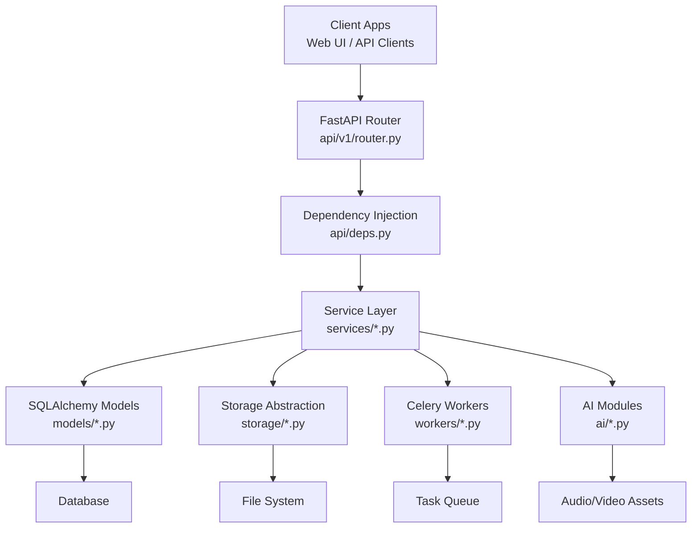

**Diagram sources**
- [apps/api/src/api/v1/router.py](file://apps/api/src/api/v1/router.py)
- [apps/api/src/api/deps.py](file://apps/api/src/api/deps.py)
- [apps/api/src/services/auth.py](file://apps/api/src/services/auth.py)
- [apps/api/src/services/brand.py](file://apps/api/src/services/brand.py)
- [apps/api/src/services/conversation.py](file://apps/api/src/services/conversation.py)
- [apps/api/src/services/export.py](file://apps/api/src/services/export.py)
- [apps/api/src/services/metrics.py](file://apps/api/src/services/metrics.py)
- [apps/api/src/services/recording.py](file://apps/api/src/services/recording.py)
- [apps/api/src/services/salesperson.py](file://apps/api/src/services/salesperson.py)
- [apps/api/src/services/search.py](file://apps/api/src/services/search.py)
- [apps/api/src/services/store.py](file://apps/api/src/services/store.py)
- [apps/api/src/models/brand.py](file://apps/api/src/models/brand.py)
- [apps/api/src/models/conversation.py](file://apps/api/src/models/conversation.py)
- [apps/api/src/models/metrics.py](file://apps/api/src/models/metrics.py)
- [apps/api/src/models/recording.py](file://apps/api/src/models/recording.py)
- [apps/api/src/models/salesperson.py](file://apps/api/src/models/salesperson.py)
- [apps/api/src/models/store.py](file://apps/api/src/models/store.py)
- [apps/api/src/models/transcript.py](file://apps/api/src/models/transcript.py)
- [apps/api/src/models/user.py](file://apps/api/src/models/user.py)
- [apps/api/src/storage/base.py](file://apps/api/src/storage/base.py)
- [apps/api/src/storage/local.py](file://apps/api/src/storage/local.py)
- [apps/api/src/ai/analyzer.py](file://apps/api/src/ai/analyzer.py)
- [apps/api/src/ai/diarizer.py](file://apps/api/src/ai/diarizer.py)
- [apps/api/src/ai/segmenter.py](file://apps/api/src/ai/segmenter.py)
- [apps/api/src/ai/stt.py](file://apps/api/src/ai/stt.py)
- [apps/api/src/ai/scorer.py](file://apps/api/src/ai/scorer.py)
- [apps/api/src/workers/pipeline.py](file://apps/api/src/workers/pipeline.py)
- [apps/api/src/workers/analysis.py](file://apps/api/src/workers/analysis.py)
- [apps/api/src/workers/diarization.py](file://apps/api/src/workers/diarization.py)
- [apps/api/src/workers/segmentation.py](file://apps/api/src/workers/segmentation.py)
- [apps/api/src/workers/transcription.py](file://apps/api/src/workers/transcription.py)
- [apps/api/src/workers/scoring.py](file://apps/api/src/workers/scoring.py)

## Detailed Component Analysis

### Authentication Service
Encapsulates user authentication, session management, and RBAC. It depends on the user model and uses dependency injection to obtain database sessions. Typical responsibilities include validating credentials, issuing tokens, enforcing role checks, and protecting routes.

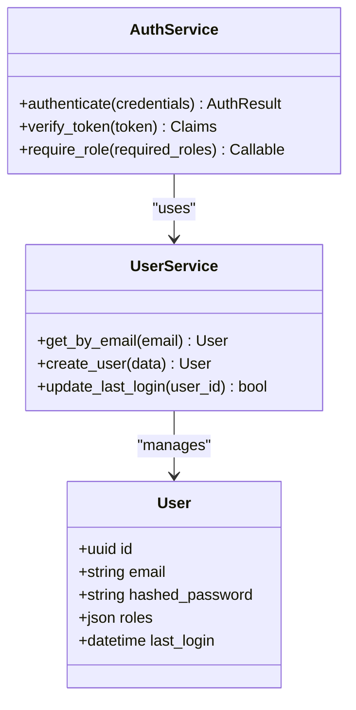

**Diagram sources**
- [apps/api/src/services/auth.py](file://apps/api/src/services/auth.py)
- [apps/api/src/models/user.py](file://apps/api/src/models/user.py)

**Section sources**
- [apps/api/src/services/auth.py](file://apps/api/src/services/auth.py)
- [apps/api/src/models/user.py](file://apps/api/src/models/user.py)

### Brand and Store Management Services
Manage hierarchical organization. Brands can have multiple stores, and stores can be organized under brands. These services enforce organizational policies and support traversal and filtering.

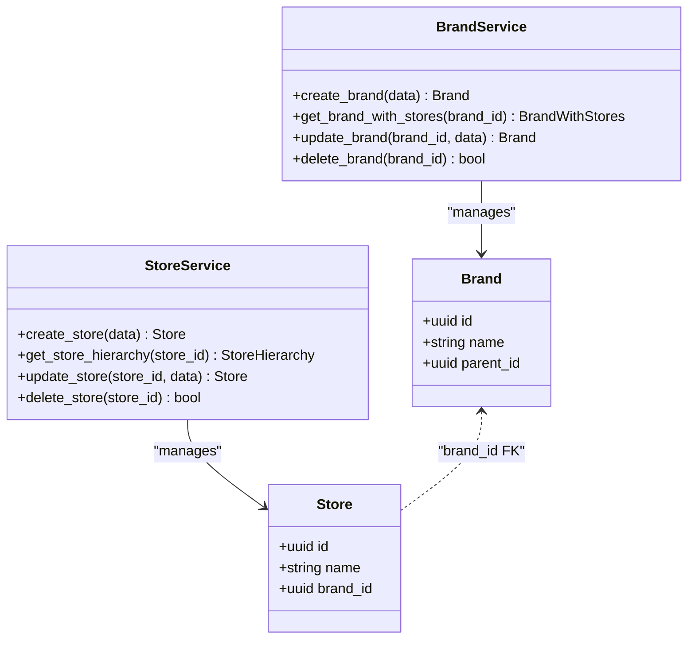

**Diagram sources**
- [apps/api/src/services/brand.py](file://apps/api/src/services/brand.py)
- [apps/api/src/services/store.py](file://apps/api/src/services/store.py)
- [apps/api/src/models/brand.py](file://apps/api/src/models/brand.py)
- [apps/api/src/models/store.py](file://apps/api/src/models/store.py)

**Section sources**
- [apps/api/src/services/brand.py](file://apps/api/src/services/brand.py)
- [apps/api/src/services/store.py](file://apps/api/src/services/store.py)
- [apps/api/src/models/brand.py](file://apps/api/src/models/brand.py)
- [apps/api/src/models/store.py](file://apps/api/src/models/store.py)

### Salesperson Management Service
Aggregates performance metrics for salespeople, computing KPIs from conversations and recordings. Supports filtering and pagination.

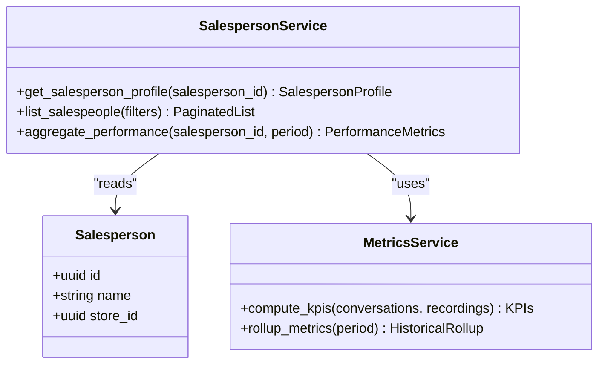

**Diagram sources**
- [apps/api/src/services/salesperson.py](file://apps/api/src/services/salesperson.py)
- [apps/api/src/services/metrics.py](file://apps/api/src/services/metrics.py)
- [apps/api/src/models/salesperson.py](file://apps/api/src/models/salesperson.py)
- [apps/api/src/models/metrics.py](file://apps/api/src/models/metrics.py)

**Section sources**
- [apps/api/src/services/salesperson.py](file://apps/api/src/services/salesperson.py)
- [apps/api/src/services/metrics.py](file://apps/api/src/services/metrics.py)
- [apps/api/src/models/salesperson.py](file://apps/api/src/models/salesperson.py)
- [apps/api/src/models/metrics.py](file://apps/api/src/models/metrics.py)

### Recording Processing Service
Handles file ingestion, quality assessment, and coordination with the AI pipeline and workers. Manages storage and tracks processing states.

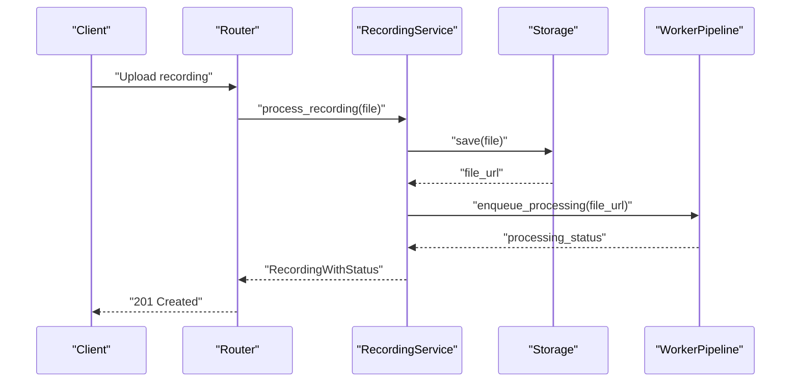

**Diagram sources**
- [apps/api/src/api/v1/router.py](file://apps/api/src/api/v1/router.py)
- [apps/api/src/services/recording.py](file://apps/api/src/services/recording.py)
- [apps/api/src/storage/local.py](file://apps/api/src/storage/local.py)
- [apps/api/src/workers/pipeline.py](file://apps/api/src/workers/pipeline.py)

**Section sources**
- [apps/api/src/services/recording.py](file://apps/api/src/services/recording.py)
- [apps/api/src/storage/local.py](file://apps/api/src/storage/local.py)
- [apps/api/src/workers/pipeline.py](file://apps/api/src/workers/pipeline.py)

### Conversation Analytics Service
Generates insights from conversations and transcripts, aggregating sentiment, topics, and speaker turns.

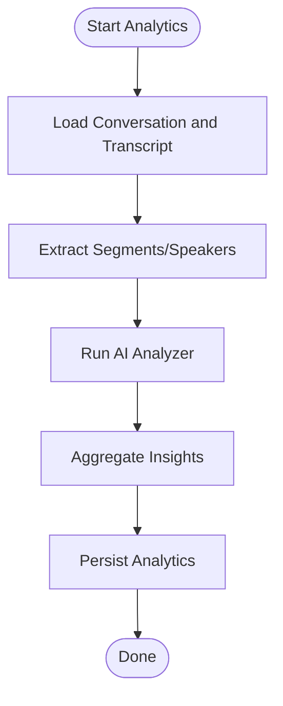

**Diagram sources**
- [apps/api/src/services/conversation.py](file://apps/api/src/services/conversation.py)
- [apps/api/src/ai/analyzer.py](file://apps/api/src/ai/analyzer.py)
- [apps/api/src/models/conversation.py](file://apps/api/src/models/conversation.py)
- [apps/api/src/models/transcript.py](file://apps/api/src/models/transcript.py)

**Section sources**
- [apps/api/src/services/conversation.py](file://apps/api/src/services/conversation.py)
- [apps/api/src/ai/analyzer.py](file://apps/api/src/ai/analyzer.py)
- [apps/api/src/models/conversation.py](file://apps/api/src/models/conversation.py)
- [apps/api/src/models/transcript.py](file://apps/api/src/models/transcript.py)

### Metrics Calculation Service
Computes performance analytics across conversations and salespeople, maintaining metric models and supporting historical rollups.

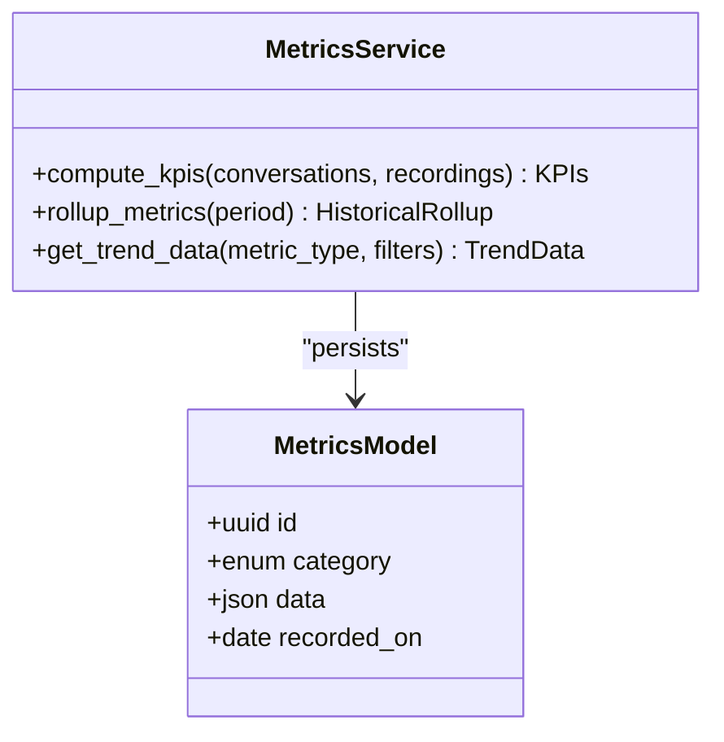

**Diagram sources**
- [apps/api/src/services/metrics.py](file://apps/api/src/services/metrics.py)
- [apps/api/src/models/metrics.py](file://apps/api/src/models/metrics.py)

**Section sources**
- [apps/api/src/services/metrics.py](file://apps/api/src/services/metrics.py)
- [apps/api/src/models/metrics.py](file://apps/api/src/models/metrics.py)

### Export Service
Generates reports from processed data and integrates with storage for downloads.

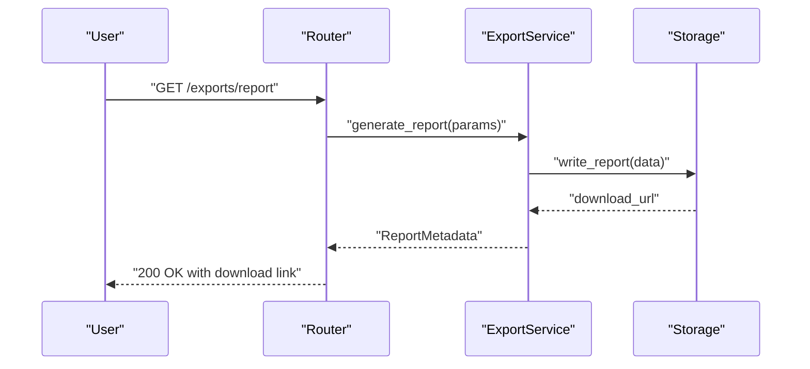

**Diagram sources**
- [apps/api/src/api/v1/router.py](file://apps/api/src/api/v1/router.py)
- [apps/api/src/services/export.py](file://apps/api/src/services/export.py)
- [apps/api/src/storage/local.py](file://apps/api/src/storage/local.py)

**Section sources**
- [apps/api/src/services/export.py](file://apps/api/src/services/export.py)
- [apps/api/src/storage/local.py](file://apps/api/src/storage/local.py)

### Search Service
Implements filtering and faceted search across recordings, conversations, and transcripts.

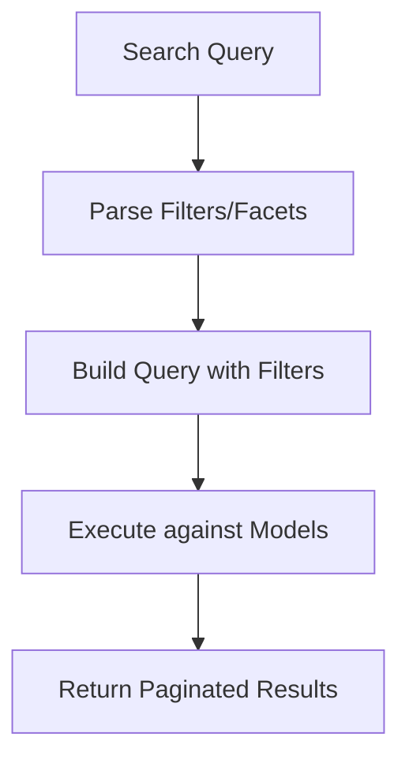

**Diagram sources**
- [apps/api/src/services/search.py](file://apps/api/src/services/search.py)
- [apps/api/src/models/recording.py](file://apps/api/src/models/recording.py)
- [apps/api/src/models/conversation.py](file://apps/api/src/models/conversation.py)
- [apps/api/src/models/transcript.py](file://apps/api/src/models/transcript.py)

**Section sources**
- [apps/api/src/services/search.py](file://apps/api/src/services/search.py)
- [apps/api/src/models/recording.py](file://apps/api/src/models/recording.py)
- [apps/api/src/models/conversation.py](file://apps/api/src/models/conversation.py)
- [apps/api/src/models/transcript.py](file://apps/api/src/models/transcript.py)

## Dependency Analysis
The service layer relies on dependency injection to obtain database sessions and shared utilities. Controllers depend on services, while services depend on models and external integrations.

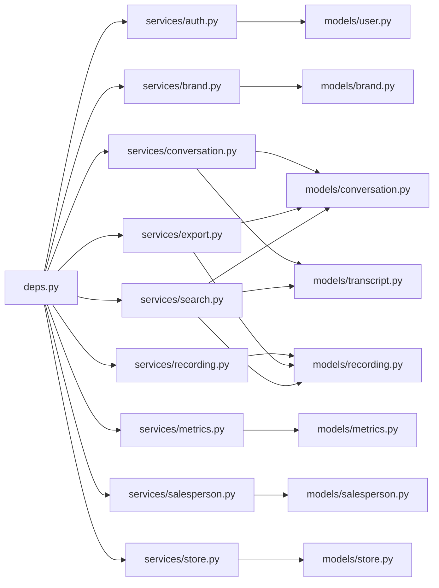

**Diagram sources**
- [apps/api/src/api/deps.py](file://apps/api/src/api/deps.py)
- [apps/api/src/services/auth.py](file://apps/api/src/services/auth.py)
- [apps/api/src/services/brand.py](file://apps/api/src/services/brand.py)
- [apps/api/src/services/conversation.py](file://apps/api/src/services/conversation.py)
- [apps/api/src/services/export.py](file://apps/api/src/services/export.py)
- [apps/api/src/services/metrics.py](file://apps/api/src/services/metrics.py)
- [apps/api/src/services/recording.py](file://apps/api/src/services/recording.py)
- [apps/api/src/services/salesperson.py](file://apps/api/src/services/salesperson.py)
- [apps/api/src/services/search.py](file://apps/api/src/services/search.py)
- [apps/api/src/services/store.py](file://apps/api/src/services/store.py)
- [apps/api/src/models/user.py](file://apps/api/src/models/user.py)
- [apps/api/src/models/brand.py](file://apps/api/src/models/brand.py)
- [apps/api/src/models/store.py](file://apps/api/src/models/store.py)
- [apps/api/src/models/salesperson.py](file://apps/api/src/models/salesperson.py)
- [apps/api/src/models/recording.py](file://apps/api/src/models/recording.py)
- [apps/api/src/models/conversation.py](file://apps/api/src/models/conversation.py)
- [apps/api/src/models/transcript.py](file://apps/api/src/models/transcript.py)
- [apps/api/src/models/metrics.py](file://apps/api/src/models/metrics.py)

**Section sources**
- [apps/api/src/api/deps.py](file://apps/api/src/api/deps.py)

## Performance Considerations
- Use pagination and filtering in search and salesperson listing to limit payload sizes.
- Batch processing in workers reduces queue congestion; ensure proper backoff and retry strategies.
- Cache computed analytics and KPIs where appropriate to avoid recomputation.
- Asynchronous processing minimizes latency for long-running tasks like transcription and scoring.
- Optimize database queries with joins and indexes on frequently filtered fields.

## Troubleshooting Guide
Common issues and resolutions:
- Authentication failures: Verify JWT claims and role checks; ensure user roles are properly set.
- Permission denied: Confirm RBAC enforcement and that the authenticated user belongs to the correct brand/store hierarchy.
- Recording processing errors: Check storage write permissions, worker availability, and AI module readiness.
- Analytics computation timeouts: Reduce batch sizes or increase worker resources; monitor queue backlog.
- Export generation failures: Validate report templates and storage write access.

**Section sources**
- [apps/api/src/services/auth.py](file://apps/api/src/services/auth.py)
- [apps/api/src/services/recording.py](file://apps/api/src/services/recording.py)
- [apps/api/src/services/conversation.py](file://apps/api/src/services/conversation.py)
- [apps/api/src/services/export.py](file://apps/api/src/services/export.py)

## Conclusion
The business logic layer in Xsamaa AI Pipeline is organized around cohesive service modules that encapsulate domain operations, coordinate with data access and external systems, and integrate cleanly with controllers and workers. Dependency injection ensures loose coupling, while transaction management and error handling strategies maintain reliability. The documented services provide a solid foundation for scalable analytics and reporting across brands, stores, salespeople, recordings, and conversations.