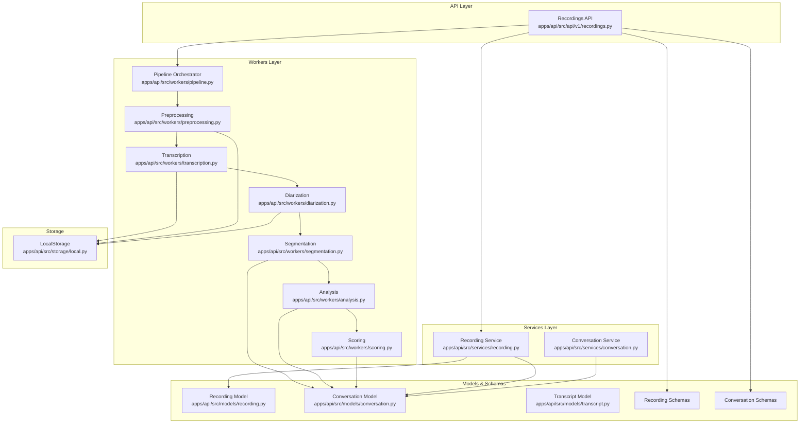
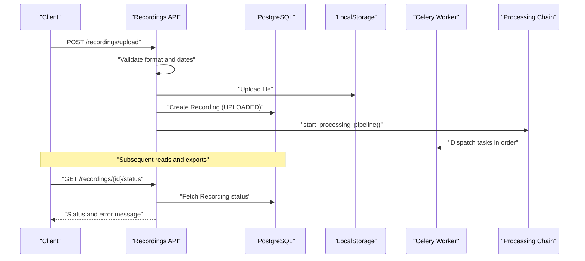
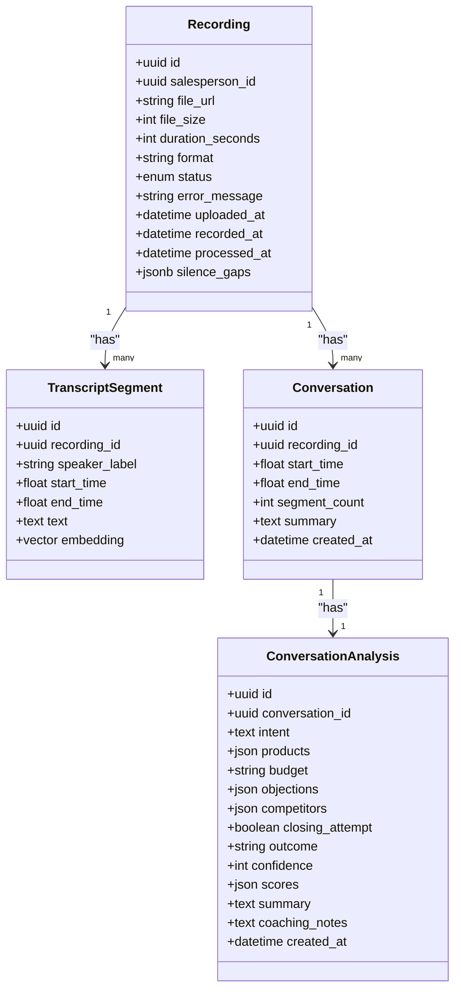
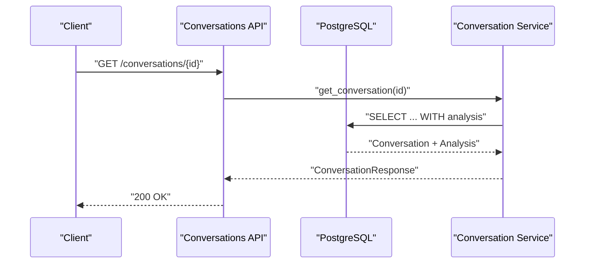
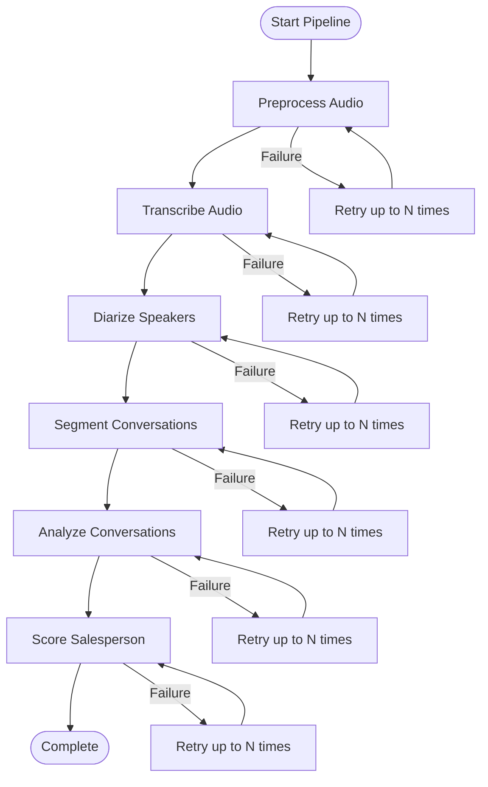
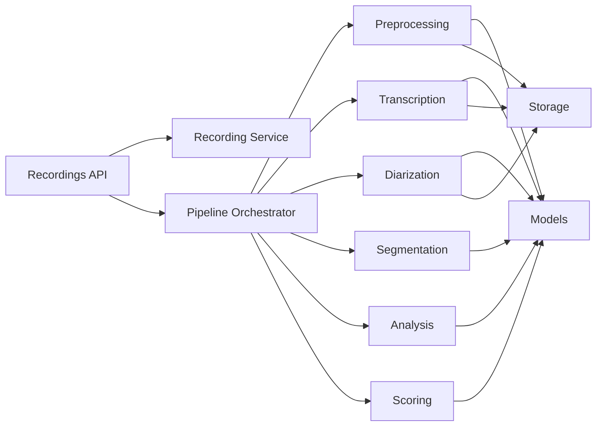

# Media Processing Services

<cite>
**Referenced Files in This Document**
- [apps/api/src/api/v1/recordings.py](file://apps/api/src/api/v1/recordings.py)
- [apps/api/src/services/recording.py](file://apps/api/src/services/recording.py)
- [apps/api/src/models/recording.py](file://apps/api/src/models/recording.py)
- [apps/api/src/schemas/recording.py](file://apps/api/src/schemas/recording.py)
- [apps/api/src/models/conversation.py](file://apps/api/src/models/conversation.py)
- [apps/api/src/models/transcript.py](file://apps/api/src/models/transcript.py)
- [apps/api/src/schemas/conversation.py](file://apps/api/src/schemas/conversation.py)
- [apps/api/src/services/conversation.py](file://apps/api/src/services/conversation.py)
- [apps/api/src/workers/pipeline.py](file://apps/api/src/workers/pipeline.py)
- [apps/api/src/workers/preprocessing.py](file://apps/api/src/workers/preprocessing.py)
- [apps/api/src/workers/transcription.py](file://apps/api/src/workers/transcription.py)
- [apps/api/src/workers/diarization.py](file://apps/api/src/workers/diarization.py)
- [apps/api/src/workers/segmentation.py](file://apps/api/src/workers/segmentation.py)
- [apps/api/src/workers/analysis.py](file://apps/api/src/workers/analysis.py)
- [apps/api/src/workers/scoring.py](file://apps/api/src/workers/scoring.py)
- [apps/api/src/storage/local.py](file://apps/api/src/storage/local.py)
</cite>

## Table of Contents
1. [Introduction](#introduction)
2. [Project Structure](#project-structure)
3. [Core Components](#core-components)
4. [Architecture Overview](#architecture-overview)
5. [Detailed Component Analysis](#detailed-component-analysis)
6. [Dependency Analysis](#dependency-analysis)
7. [Performance Considerations](#performance-considerations)
8. [Troubleshooting Guide](#troubleshooting-guide)
9. [Conclusion](#conclusion)
10. [Appendices](#appendices)

## Introduction
This document describes the media processing services responsible for audio recording ingestion, AI-powered conversation analysis, and performance scoring. It covers:
- Recording service: upload handling, format validation, quality assessment signals, and metadata extraction
- Conversation service: transcript processing, speaker diarization integration, conversation segmentation, and analysis result management
- Relationship between recordings and conversations: processing status tracking, error handling, and pipeline orchestration
- Examples of ingestion workflows, conversation creation from transcripts, and integration with the AI processing pipeline
- Storage management, cleanup procedures, and performance optimization for large audio files

## Project Structure
The media processing system is organized around:
- API layer: FastAPI endpoints for recording ingestion, status queries, and exports
- Services layer: ORM-backed business logic for recordings and conversations
- Workers layer: Celery tasks implementing the AI processing pipeline
- Models and schemas: SQLAlchemy ORM models and Pydantic DTOs
- Storage: pluggable storage backend abstraction with local filesystem implementation

**Diagram sources**
- [apps/api/src/api/v1/recordings.py:1-254](file://apps/api/src/api/v1/recordings.py#L1-L254)
- [apps/api/src/services/recording.py:1-177](file://apps/api/src/services/recording.py#L1-L177)
- [apps/api/src/services/conversation.py:1-26](file://apps/api/src/services/conversation.py#L1-L26)
- [apps/api/src/workers/pipeline.py:1-35](file://apps/api/src/workers/pipeline.py#L1-L35)
- [apps/api/src/workers/preprocessing.py:1-206](file://apps/api/src/workers/preprocessing.py#L1-L206)
- [apps/api/src/workers/transcription.py:1-146](file://apps/api/src/workers/transcription.py#L1-L146)
- [apps/api/src/workers/diarization.py:1-119](file://apps/api/src/workers/diarization.py#L1-L119)
- [apps/api/src/workers/segmentation.py:1-146](file://apps/api/src/workers/segmentation.py#L1-L146)
- [apps/api/src/workers/analysis.py:1-242](file://apps/api/src/workers/analysis.py#L1-L242)
- [apps/api/src/workers/scoring.py:1-314](file://apps/api/src/workers/scoring.py#L1-L314)
- [apps/api/src/models/recording.py:1-60](file://apps/api/src/models/recording.py#L1-L60)
- [apps/api/src/models/conversation.py:1-61](file://apps/api/src/models/conversation.py#L1-L61)
- [apps/api/src/models/transcript.py:1-27](file://apps/api/src/models/transcript.py#L1-L27)
- [apps/api/src/schemas/recording.py:1-71](file://apps/api/src/schemas/recording.py#L1-L71)
- [apps/api/src/schemas/conversation.py:1-33](file://apps/api/src/schemas/conversation.py#L1-L33)
- [apps/api/src/storage/local.py:1-50](file://apps/api/src/storage/local.py#L1-L50)

**Section sources**
- [apps/api/src/api/v1/recordings.py:1-254](file://apps/api/src/api/v1/recordings.py#L1-L254)
- [apps/api/src/workers/pipeline.py:1-35](file://apps/api/src/workers/pipeline.py#L1-L35)

## Core Components
- Recording ingestion and status management
  - Endpoint validates file format and MIME type, persists metadata, enqueues processing pipeline, and returns recording details
  - Status transitions are tracked via a finite state machine
- Transcript processing
  - STT produces time-aligned segments stored in the transcript_segments table
  - Large files are chunked to fit API constraints
- Speaker diarization
  - Assigns speaker labels to transcript segments using AI APIs
- Conversation segmentation
  - Identifies conversation boundaries using silence gaps and semantic cues
- Conversation analysis and scoring
  - Analyzes each conversation with LLMs and computes performance scores across multiple dimensions
- Storage abstraction
  - Local filesystem backend supports async upload/download for API and sync operations for workers

**Section sources**
- [apps/api/src/api/v1/recordings.py:110-167](file://apps/api/src/api/v1/recordings.py#L110-L167)
- [apps/api/src/models/recording.py:12-22](file://apps/api/src/models/recording.py#L12-L22)
- [apps/api/src/workers/transcription.py:78-89](file://apps/api/src/workers/transcription.py#L78-L89)
- [apps/api/src/workers/diarization.py:65-111](file://apps/api/src/workers/diarization.py#L65-L111)
- [apps/api/src/workers/segmentation.py:92-138](file://apps/api/src/workers/segmentation.py#L92-L138)
- [apps/api/src/workers/analysis.py:152-234](file://apps/api/src/workers/analysis.py#L152-L234)
- [apps/api/src/workers/scoring.py:235-306](file://apps/api/src/workers/scoring.py#L235-L306)
- [apps/api/src/storage/local.py:1-50](file://apps/api/src/storage/local.py#L1-L50)

## Architecture Overview
The system follows a pipeline-driven architecture:
- API receives uploads and exposes read/export endpoints
- Celery orchestrates a chain of workers for preprocessing, transcription, diarization, segmentation, analysis, and scoring
- Models define relationships between recordings, transcripts, conversations, and analysis results
- Storage persists raw and intermediate artifacts

**Diagram sources**
- [apps/api/src/api/v1/recordings.py:110-167](file://apps/api/src/api/v1/recordings.py#L110-L167)
- [apps/api/src/workers/pipeline.py:12-34](file://apps/api/src/workers/pipeline.py#L12-L34)
- [apps/api/src/storage/local.py:14-24](file://apps/api/src/storage/local.py#L14-L24)

## Detailed Component Analysis

### Recording Service
Responsibilities:
- List recordings with pagination and filters
- Create recording entries with validated metadata
- Update status and error messages
- Retrieve transcripts and conversations
- Build recording-level summaries aggregating conversation analyses

Key behaviors:
- Status lifecycle: UPLOADED → PREPROCESSING → TRANSCRIBING → DIARIZING → SEGMENTING → ANALYZING → SCORING → COMPLETED or FAILED
- Summary aggregation: top intent, top objection, missed opportunities, outcomes, and average confidence across conversations

**Diagram sources**
- [apps/api/src/models/recording.py:24-60](file://apps/api/src/models/recording.py#L24-L60)
- [apps/api/src/models/transcript.py:10-27](file://apps/api/src/models/transcript.py#L10-L27)
- [apps/api/src/models/conversation.py:11-61](file://apps/api/src/models/conversation.py#L11-L61)

**Section sources**
- [apps/api/src/services/recording.py:16-177](file://apps/api/src/services/recording.py#L16-L177)
- [apps/api/src/models/recording.py:12-22](file://apps/api/src/models/recording.py#L12-L22)
- [apps/api/src/schemas/recording.py:4-71](file://apps/api/src/schemas/recording.py#L4-L71)

### Conversation Service
Responsibilities:
- Fetch a single conversation with its analysis
- Retrieve conversation analysis by conversation ID

**Diagram sources**
- [apps/api/src/services/conversation.py:10-25](file://apps/api/src/services/conversation.py#L10-L25)

**Section sources**
- [apps/api/src/services/conversation.py:1-26](file://apps/api/src/services/conversation.py#L1-L26)
- [apps/api/src/schemas/conversation.py:4-33](file://apps/api/src/schemas/conversation.py#L4-L33)

### AI Processing Pipeline
The pipeline is orchestrated as a Celery chain with explicit status transitions and retries.

**Diagram sources**
- [apps/api/src/workers/pipeline.py:12-34](file://apps/api/src/workers/pipeline.py#L12-L34)
- [apps/api/src/workers/preprocessing.py:106-206](file://apps/api/src/workers/preprocessing.py#L106-L206)
- [apps/api/src/workers/transcription.py:53-102](file://apps/api/src/workers/transcription.py#L53-L102)
- [apps/api/src/workers/diarization.py:65-119](file://apps/api/src/workers/diarization.py#L65-L119)
- [apps/api/src/workers/segmentation.py:92-146](file://apps/api/src/workers/segmentation.py#L92-L146)
- [apps/api/src/workers/analysis.py:152-242](file://apps/api/src/workers/analysis.py#L152-L242)
- [apps/api/src/workers/scoring.py:235-314](file://apps/api/src/workers/scoring.py#L235-L314)

**Section sources**
- [apps/api/src/workers/pipeline.py:1-35](file://apps/api/src/workers/pipeline.py#L1-L35)

### Preprocessing Worker
- Converts audio to mono, resamples to 16 kHz, normalizes volume, detects silence gaps, exports standardized WAV, and updates duration and silence gaps in DB
- Uses sync DB sessions because Celery workers run in a synchronous context

**Section sources**
- [apps/api/src/workers/preprocessing.py:106-206](file://apps/api/src/workers/preprocessing.py#L106-L206)

### Transcription Worker
- Downloads preprocessed audio, handles large files by chunking, calls STT API, stores segments, and cleans up duplicates
- Implements retry logic and status transitions

**Section sources**
- [apps/api/src/workers/transcription.py:53-146](file://apps/api/src/workers/transcription.py#L53-L146)

### Diarization Worker
- Loads transcript segments, calls diarization API, merges speaker labels, and updates DB
- Logs speaker distribution for diagnostics

**Section sources**
- [apps/api/src/workers/diarization.py:65-119](file://apps/api/src/workers/diarization.py#L65-L119)

### Segmentation Worker
- Builds conversation boundaries from labeled transcript segments and silence gaps
- Clears and replaces conversation records per recording

**Section sources**
- [apps/api/src/workers/segmentation.py:92-146](file://apps/api/src/workers/segmentation.py#L92-L146)

### Analysis Worker
- Retrieves conversation segments, sends to LLM analyzer, applies confidence threshold, stores analysis, and updates conversation summary
- Skips low-confidence results

**Section sources**
- [apps/api/src/workers/analysis.py:152-242](file://apps/api/src/workers/analysis.py#L152-L242)

### Scoring Worker
- Computes performance scores per conversation, stores scores, marks recording COMPLETED, and updates daily metrics

**Section sources**
- [apps/api/src/workers/scoring.py:235-314](file://apps/api/src/workers/scoring.py#L235-L314)

### Storage Management
- Local storage backend supports async upload/download for API and sync operations for workers
- Files are stored under structured keys for raw and preprocessed audio

**Section sources**
- [apps/api/src/storage/local.py:1-50](file://apps/api/src/storage/local.py#L1-L50)

## Dependency Analysis
- API depends on services for business logic and workers for pipeline orchestration
- Workers depend on models and schemas for data structures and on storage for artifact persistence
- Pipeline tasks are chained and share a common recording_id to coordinate state

**Diagram sources**
- [apps/api/src/api/v1/recordings.py:1-254](file://apps/api/src/api/v1/recordings.py#L1-L254)
- [apps/api/src/workers/pipeline.py:1-35](file://apps/api/src/workers/pipeline.py#L1-L35)
- [apps/api/src/models/recording.py:1-60](file://apps/api/src/models/recording.py#L1-L60)
- [apps/api/src/models/conversation.py:1-61](file://apps/api/src/models/conversation.py#L1-L61)
- [apps/api/src/models/transcript.py:1-27](file://apps/api/src/models/transcript.py#L1-L27)
- [apps/api/src/storage/local.py:1-50](file://apps/api/src/storage/local.py#L1-L50)

**Section sources**
- [apps/api/src/api/v1/recordings.py:1-254](file://apps/api/src/api/v1/recordings.py#L1-L254)
- [apps/api/src/workers/pipeline.py:1-35](file://apps/api/src/workers/pipeline.py#L1-L35)

## Performance Considerations
- Large audio handling
  - Transcription chunks audio to fit API constraints and adjusts timestamps to maintain continuity
  - Preprocessing writes standardized WAV to disk and updates duration for downstream steps
- I/O optimization
  - Temporary directories are used for audio processing to minimize memory overhead
  - Silence gaps are persisted to accelerate segmentation
- Reliability
  - Tasks implement retries with exponential backoff and mark failures with error messages
- Scalability
  - Asynchronous pipeline decouples long-running operations from API requests
  - Metrics computation aggregates across conversations for daily reporting

**Section sources**
- [apps/api/src/workers/transcription.py:78-89](file://apps/api/src/workers/transcription.py#L78-L89)
- [apps/api/src/workers/transcription.py:104-146](file://apps/api/src/workers/transcription.py#L104-L146)
- [apps/api/src/workers/preprocessing.py:129-193](file://apps/api/src/workers/preprocessing.py#L129-L193)
- [apps/api/src/workers/segmentation.py:119-125](file://apps/api/src/workers/segmentation.py#L119-L125)

## Troubleshooting Guide
Common issues and remedies:
- Upload errors
  - Invalid format or missing filename leads to client-side validation errors; ensure supported extensions and ISO date formats
- Processing failures
  - Workers set status to FAILED with error messages; check logs for specific exceptions and retry using the reprocess endpoint
- Empty or partial results
  - Missing transcript segments halt segmentation and analysis; verify transcription completion and silence gap detection
- Confidence thresholds
  - Low-confidence analysis results are skipped; improve audio quality or preprocessing to increase confidence

Operational actions:
- Use the status endpoint to inspect current state and error messages
- Re-run processing for failed or stale recordings
- Monitor daily metrics for trends and anomalies

**Section sources**
- [apps/api/src/api/v1/recordings.py:118-138](file://apps/api/src/api/v1/recordings.py#L118-L138)
- [apps/api/src/api/v1/recordings.py:182-195](file://apps/api/src/api/v1/recordings.py#L182-L195)
- [apps/api/src/api/v1/recordings.py:228-253](file://apps/api/src/api/v1/recordings.py#L228-L253)
- [apps/api/src/workers/preprocessing.py:195-206](file://apps/api/src/workers/preprocessing.py#L195-L206)
- [apps/api/src/workers/transcription.py:96-102](file://apps/api/src/workers/transcription.py#L96-L102)
- [apps/api/src/workers/diarization.py:113-119](file://apps/api/src/workers/diarization.py#L113-L119)
- [apps/api/src/workers/segmentation.py:140-146](file://apps/api/src/workers/segmentation.py#L140-L146)
- [apps/api/src/workers/analysis.py:236-242](file://apps/api/src/workers/analysis.py#L236-L242)
- [apps/api/src/workers/scoring.py:308-314](file://apps/api/src/workers/scoring.py#L308-L314)

## Conclusion
The media processing services provide a robust, modular pipeline for audio ingestion, AI-driven conversation analysis, and performance scoring. By enforcing strict status transitions, handling large files gracefully, and offering clear observability via status and metrics, the system scales to enterprise workloads while remaining maintainable and debuggable.

## Appendices

### Recording Ingestion Workflow Example
- Client uploads an audio file with required form fields
- API validates format and parses dates, stores file via storage backend, creates a recording record, and enqueues the processing pipeline
- Client polls status until completion or failure

**Section sources**
- [apps/api/src/api/v1/recordings.py:110-167](file://apps/api/src/api/v1/recordings.py#L110-L167)

### Conversation Creation from Transcripts
- After diarization, transcript segments are labeled with speaker identities
- Segmentation identifies conversation boundaries using silence gaps and semantic cues
- Conversation records are created with start/end times and counts

**Section sources**
- [apps/api/src/workers/diarization.py:65-111](file://apps/api/src/workers/diarization.py#L65-L111)
- [apps/api/src/workers/segmentation.py:92-138](file://apps/api/src/workers/segmentation.py#L92-L138)

### Integration with AI Processing Pipeline
- Pipeline orchestrator composes preprocessing, transcription, diarization, segmentation, analysis, and scoring
- Each stage updates status and persists artifacts; failures trigger retries or final failure state

**Section sources**
- [apps/api/src/workers/pipeline.py:12-34](file://apps/api/src/workers/pipeline.py#L12-L34)