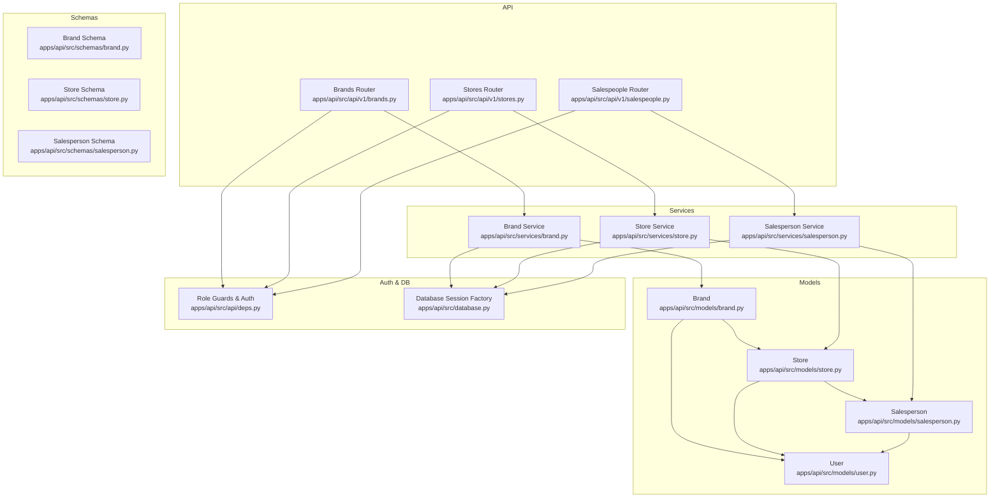
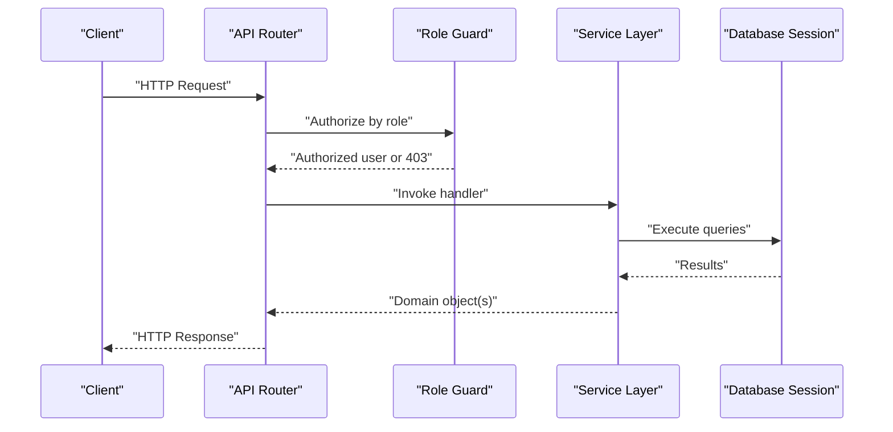
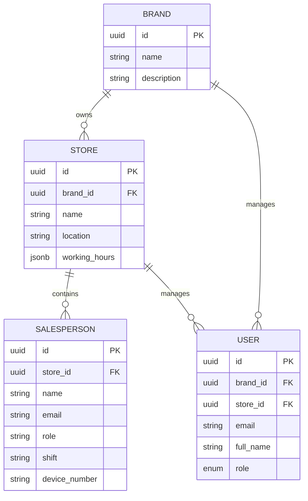
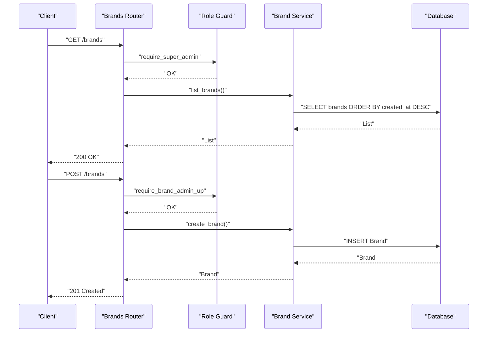
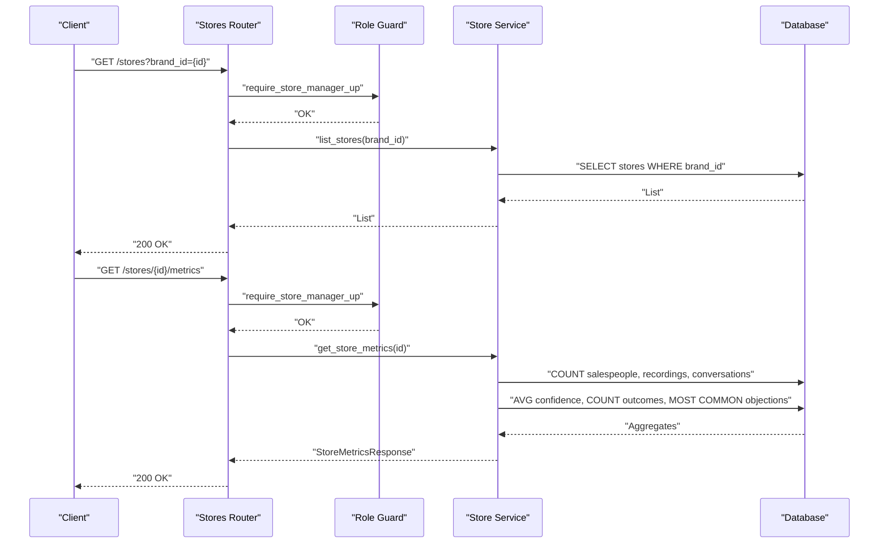
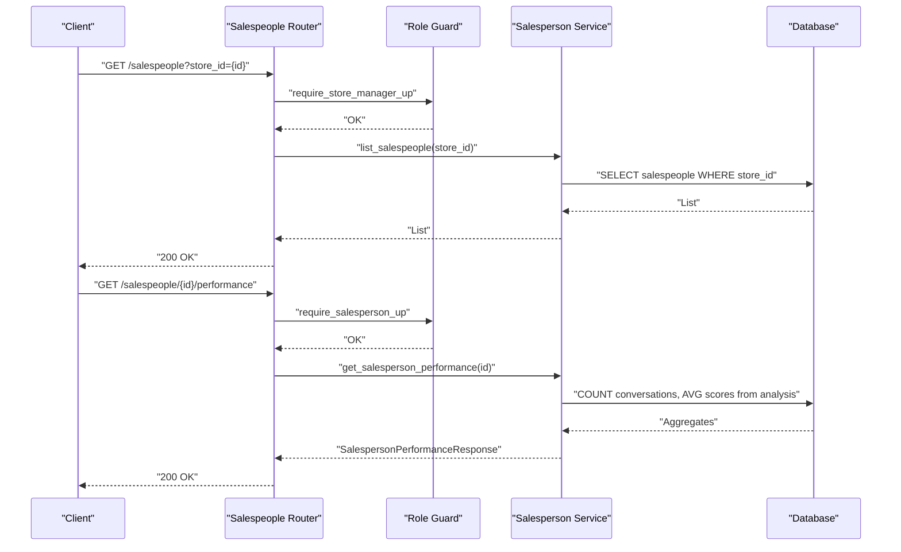
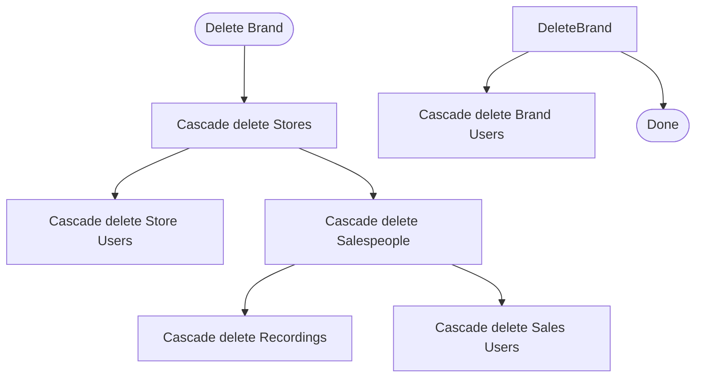
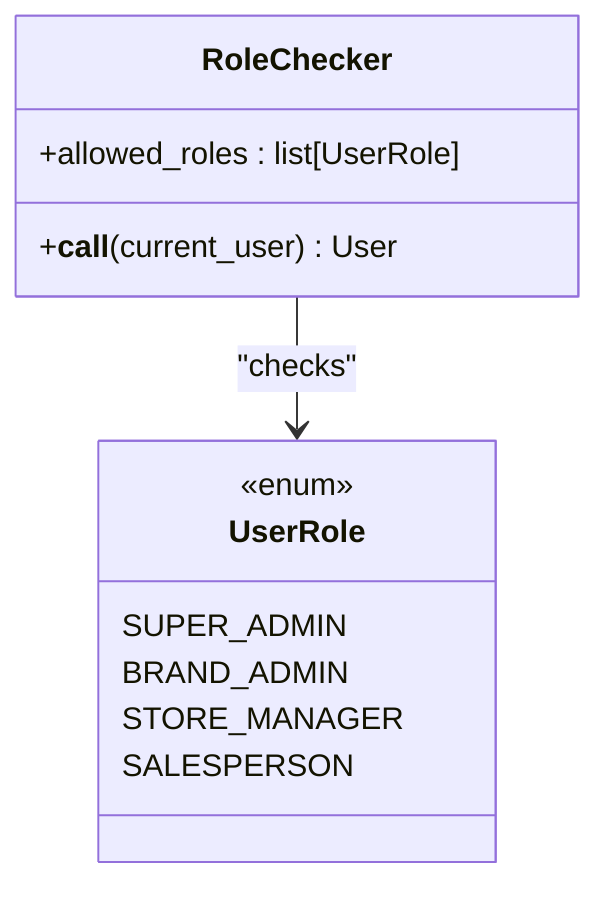
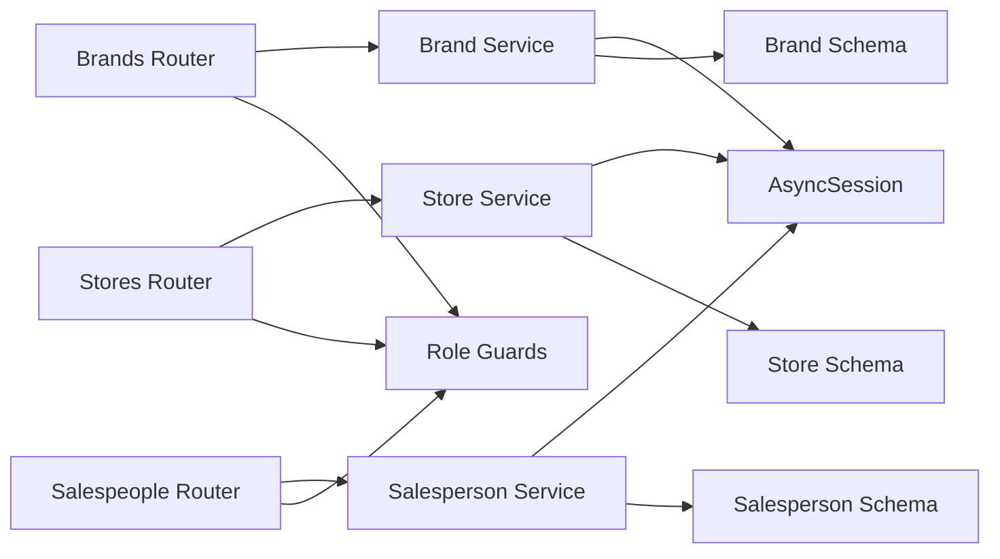

# Organizational Management

<cite>
**Referenced Files in This Document**
- [brand.py](file://apps/api/src/models/brand.py)
- [store.py](file://apps/api/src/models/store.py)
- [salesperson.py](file://apps/api/src/models/salesperson.py)
- [user.py](file://apps/api/src/models/user.py)
- [brand.py](file://apps/api/src/services/brand.py)
- [store.py](file://apps/api/src/services/store.py)
- [salesperson.py](file://apps/api/src/services/salesperson.py)
- [brands.py](file://apps/api/src/api/v1/brands.py)
- [stores.py](file://apps/api/src/api/v1/stores.py)
- [salespeople.py](file://apps/api/src/api/v1/salespeople.py)
- [brand.py](file://apps/api/src/schemas/brand.py)
- [store.py](file://apps/api/src/schemas/store.py)
- [salesperson.py](file://apps/api/src/schemas/salesperson.py)
- [deps.py](file://apps/api/src/api/deps.py)
- [database.py](file://apps/api/src/database.py)
</cite>

## Table of Contents
1. [Introduction](#introduction)
2. [Project Structure](#project-structure)
3. [Core Components](#core-components)
4. [Architecture Overview](#architecture-overview)
5. [Detailed Component Analysis](#detailed-component-analysis)
6. [Dependency Analysis](#dependency-analysis)
7. [Performance Considerations](#performance-considerations)
8. [Troubleshooting Guide](#troubleshooting-guide)
9. [Conclusion](#conclusion)

## Introduction
This document describes the organizational management services that model a three-tier hierarchy:
- Brand (top-level)
- Store (under a brand)
- Salesperson (under a store)

It covers data models, service methods, API endpoints, validation rules, relationship constraints, cascading operations, and performance aggregation across the hierarchy. It also documents access control enforcement via role-based guards and provides examples of bulk retrieval, validation scenarios, and error handling.

## Project Structure
The organizational domain spans models, services, schemas, and API routes:
- Models define the relational structure and relationships.
- Services encapsulate CRUD and aggregation logic.
- Schemas define request/response validation.
- API routes expose endpoints with role-based access control.
- Dependencies enforce authentication and authorization.

**Diagram sources**
- [brand.py:10-26](file://apps/api/src/models/brand.py#L10-L26)
- [store.py:11-32](file://apps/api/src/models/store.py#L11-L32)
- [salesperson.py:10-32](file://apps/api/src/models/salesperson.py#L10-L32)
- [user.py:19-48](file://apps/api/src/models/user.py#L19-L48)
- [brand.py:10-38](file://apps/api/src/services/brand.py#L10-L38)
- [store.py:15-142](file://apps/api/src/services/store.py#L15-L142)
- [salesperson.py:12-111](file://apps/api/src/services/salesperson.py#L12-L111)
- [brands.py:13-53](file://apps/api/src/api/v1/brands.py#L13-L53)
- [stores.py:13-53](file://apps/api/src/api/v1/stores.py#L13-L53)
- [salespeople.py:22-62](file://apps/api/src/api/v1/salespeople.py#L22-L62)
- [brand.py:4-22](file://apps/api/src/schemas/brand.py#L4-L22)
- [store.py:4-38](file://apps/api/src/schemas/store.py#L4-L38)
- [salesperson.py:4-46](file://apps/api/src/schemas/salesperson.py#L4-L46)
- [deps.py:41-63](file://apps/api/src/api/deps.py#L41-L63)
- [database.py:26-34](file://apps/api/src/database.py#L26-L34)

**Section sources**
- [brand.py:10-26](file://apps/api/src/models/brand.py#L10-L26)
- [store.py:11-32](file://apps/api/src/models/store.py#L11-L32)
- [salesperson.py:10-32](file://apps/api/src/models/salesperson.py#L10-L32)
- [user.py:19-48](file://apps/api/src/models/user.py#L19-L48)
- [brand.py:10-38](file://apps/api/src/services/brand.py#L10-L38)
- [store.py:15-142](file://apps/api/src/services/store.py#L15-L142)
- [salesperson.py:12-111](file://apps/api/src/services/salesperson.py#L12-L111)
- [brands.py:13-53](file://apps/api/src/api/v1/brands.py#L13-L53)
- [stores.py:13-53](file://apps/api/src/api/v1/stores.py#L13-L53)
- [salespeople.py:22-62](file://apps/api/src/api/v1/salespeople.py#L22-L62)
- [brand.py:4-22](file://apps/api/src/schemas/brand.py#L4-L22)
- [store.py:4-38](file://apps/api/src/schemas/store.py#L4-L38)
- [salesperson.py:4-46](file://apps/api/src/schemas/salesperson.py#L4-L46)
- [deps.py:41-63](file://apps/api/src/api/deps.py#L41-L63)
- [database.py:26-34](file://apps/api/src/database.py#L26-L34)

## Core Components
- Brand: Top-level organization entity with name and optional description. Cascades deletion of associated stores and users.
- Store: Belongs to a single brand, supports optional location and working hours. Cascades deletion of associated salespeople and users.
- Salesperson: Belongs to a single store, supports metadata like role, shift, and device number. Cascades deletion of associated recordings.
- User: Optional assignment to a brand or store; roles include SUPER_ADMIN, BRAND_ADMIN, STORE_MANAGER, SALESPERSON.
- Services: CRUD for each entity plus metrics aggregation per store and per salesperson.
- Schemas: Pydantic models for request/response validation.
- API: Endpoints with role-based access control enforced via dependency guards.

**Section sources**
- [brand.py:10-26](file://apps/api/src/models/brand.py#L10-L26)
- [store.py:11-32](file://apps/api/src/models/store.py#L11-L32)
- [salesperson.py:10-32](file://apps/api/src/models/salesperson.py#L10-L32)
- [user.py:19-48](file://apps/api/src/models/user.py#L19-L48)
- [brand.py:10-38](file://apps/api/src/services/brand.py#L10-L38)
- [store.py:15-142](file://apps/api/src/services/store.py#L15-L142)
- [salesperson.py:12-111](file://apps/api/src/services/salesperson.py#L12-L111)
- [brand.py:4-22](file://apps/api/src/schemas/brand.py#L4-L22)
- [store.py:4-38](file://apps/api/src/schemas/store.py#L4-L38)
- [salesperson.py:4-46](file://apps/api/src/schemas/salesperson.py#L4-L46)
- [brands.py:13-53](file://apps/api/src/api/v1/brands.py#L13-L53)
- [stores.py:13-53](file://apps/api/src/api/v1/stores.py#L13-L53)
- [salespeople.py:22-62](file://apps/api/src/api/v1/salespeople.py#L22-L62)
- [deps.py:41-63](file://apps/api/src/api/deps.py#L41-L63)

## Architecture Overview
The system follows a layered architecture:
- API layer exposes endpoints with role checks.
- Service layer performs CRUD and aggregations.
- Model layer defines ORM entities and relationships.
- Database layer manages async sessions and transactions.

**Diagram sources**
- [brands.py:13-53](file://apps/api/src/api/v1/brands.py#L13-L53)
- [stores.py:13-53](file://apps/api/src/api/v1/stores.py#L13-L53)
- [salespeople.py:22-62](file://apps/api/src/api/v1/salespeople.py#L22-L62)
- [deps.py:41-63](file://apps/api/src/api/deps.py#L41-L63)
- [database.py:26-34](file://apps/api/src/database.py#L26-L34)

## Detailed Component Analysis

### Data Models and Relationships
The models define a strict hierarchy with foreign keys and cascading behavior:
- Brand.id -> Store.brand_id (one-to-many)
- Store.id -> Salesperson.store_id (one-to-many)
- Brand.id -> User.brand_id (optional)
- Store.id -> User.store_id (optional)

**Diagram sources**
- [brand.py:10-26](file://apps/api/src/models/brand.py#L10-L26)
- [store.py:11-32](file://apps/api/src/models/store.py#L11-L32)
- [salesperson.py:10-32](file://apps/api/src/models/salesperson.py#L10-L32)
- [user.py:19-48](file://apps/api/src/models/user.py#L19-L48)

**Section sources**
- [brand.py:10-26](file://apps/api/src/models/brand.py#L10-L26)
- [store.py:11-32](file://apps/api/src/models/store.py#L11-L32)
- [salesperson.py:10-32](file://apps/api/src/models/salesperson.py#L10-L32)
- [user.py:19-48](file://apps/api/src/models/user.py#L19-L48)

### Brand Service and API
- List brands: ordered by creation date descending.
- Retrieve brand by ID.
- Create brand with name and optional description.
- Update brand with partial updates.
- Access control:
  - List and update restricted to SUPER_ADMIN.
  - Create restricted to BRAND_ADMIN or above.

**Diagram sources**
- [brands.py:13-53](file://apps/api/src/api/v1/brands.py#L13-L53)
- [brand.py:10-38](file://apps/api/src/services/brand.py#L10-L38)
- [deps.py:55-56](file://apps/api/src/api/deps.py#L55-L56)

**Section sources**
- [brand.py:10-38](file://apps/api/src/services/brand.py#L10-L38)
- [brands.py:13-53](file://apps/api/src/api/v1/brands.py#L13-L53)
- [brand.py:4-22](file://apps/api/src/schemas/brand.py#L4-L22)
- [deps.py:55-56](file://apps/api/src/api/deps.py#L55-L56)

### Store Service and API
- List stores optionally filtered by brand.
- Retrieve store by ID.
- Create store with brand_id, name, and optional location/working_hours.
- Update store with partial updates.
- Metrics endpoint aggregates:
  - Total salespeople under the store.
  - Total recordings across all salespeople in the store.
  - Total conversations across all recordings in the store.
  - Average performance score derived from conversation analysis confidence.
  - Conversion rate computed as sales divided by total conversations.
  - Top objection extracted from aggregated objections.
- Access control:
  - List, create, get, and metrics require STORE_MANAGER or higher.
  - Brand filter supported for store listing.

**Diagram sources**
- [stores.py:13-53](file://apps/api/src/api/v1/stores.py#L13-L53)
- [store.py:15-142](file://apps/api/src/services/store.py#L15-L142)
- [deps.py:57-59](file://apps/api/src/api/deps.py#L57-L59)

**Section sources**
- [store.py:15-142](file://apps/api/src/services/store.py#L15-L142)
- [stores.py:13-53](file://apps/api/src/api/v1/stores.py#L13-L53)
- [store.py:4-38](file://apps/api/src/schemas/store.py#L4-L38)
- [deps.py:57-59](file://apps/api/src/api/deps.py#L57-L59)

### Salesperson Service and API
- List salespeople optionally filtered by store.
- Retrieve salesperson by ID.
- Create salesperson with store_id and optional attributes.
- Update salesperson with partial updates.
- Performance endpoint aggregates:
  - Total conversations for the salesperson.
  - Average scores across greeting, discovery, product knowledge, objection handling, and closing.
  - Overall average across the five categories.
- Access control:
  - List and create require STORE_MANAGER or higher.
  - Get and performance require SALESPERSON or higher (including the owner).

**Diagram sources**
- [salespeople.py:22-62](file://apps/api/src/api/v1/salespeople.py#L22-L62)
- [salesperson.py:12-111](file://apps/api/src/services/salesperson.py#L12-L111)
- [deps.py:60-62](file://apps/api/src/api/deps.py#L60-L62)

**Section sources**
- [salesperson.py:12-111](file://apps/api/src/services/salesperson.py#L12-L111)
- [salespeople.py:22-62](file://apps/api/src/api/v1/salespeople.py#L22-L62)
- [salesperson.py:4-46](file://apps/api/src/schemas/salesperson.py#L4-L46)
- [deps.py:60-62](file://apps/api/src/api/deps.py#L60-L62)

### Validation Rules and Constraints
- Brand:
  - Name required; description optional.
- Store:
  - brand_id required; name required; location and working_hours optional.
- Salesperson:
  - store_id required; name required; others optional.
- Users:
  - Roles constrained to predefined enum; brand_id and store_id are optional foreign keys.

These constraints are enforced by:
- Pydantic schemas for request validation.
- SQLAlchemy column constraints (String lengths, nullable flags).
- Foreign key constraints at the database level.

**Section sources**
- [brand.py:4-22](file://apps/api/src/schemas/brand.py#L4-L22)
- [store.py:4-14](file://apps/api/src/schemas/store.py#L4-L14)
- [salesperson.py:4-18](file://apps/api/src/schemas/salesperson.py#L4-L18)
- [user.py:19-48](file://apps/api/src/models/user.py#L19-L48)

### Relationship Constraints and Cascading Operations
- Brand to Store:
  - One-to-many; deletion of a brand deletes all associated stores and users via cascade.
- Store to Salesperson:
  - One-to-many; deletion of a store deletes all associated salespeople and users via cascade.
- Salesperson to Recording:
  - One-to-many; deletion of a salesperson deletes all associated recordings via cascade.
- User to Brand/Store:
  - Many-to-one; user belongs to zero or one brand and zero or one store.

**Diagram sources**
- [brand.py](file://apps/api/src/models/brand.py#L24)
- [store.py](file://apps/api/src/models/store.py#L29)
- [salesperson.py](file://apps/api/src/models/salesperson.py#L30)

**Section sources**
- [brand.py](file://apps/api/src/models/brand.py#L24)
- [store.py](file://apps/api/src/models/store.py#L29)
- [salesperson.py](file://apps/api/src/models/salesperson.py#L30)

### Bulk Operations and Retrieval Patterns
- Bulk retrieval:
  - List brands/stores/salespeople ordered by creation date descending.
  - Filter stores by brand; filter salespeople by store.
- Aggregation:
  - Store metrics endpoint computes counts and averages across nested entities.
  - Salesperson performance endpoint computes averages across conversation analyses.

**Section sources**
- [brand.py:10-12](file://apps/api/src/services/brand.py#L10-L12)
- [store.py:15-20](file://apps/api/src/services/store.py#L15-L20)
- [salesperson.py:12-17](file://apps/api/src/services/salesperson.py#L12-L17)
- [store.py:53-142](file://apps/api/src/services/store.py#L53-L142)
- [salesperson.py:56-111](file://apps/api/src/services/salesperson.py#L56-L111)

### Access Control and Organization Enforcement
- Role hierarchy:
  - SUPER_ADMIN: global access.
  - BRAND_ADMIN: manage brands and stores within brands.
  - STORE_MANAGER: manage stores and salespeople within stores.
  - SALESPERSON: view own profile and performance.
- Guards:
  - require_super_admin
  - require_brand_admin_up
  - require_store_manager_up
  - require_salesperson_up
- Enforcement:
  - Endpoints validate caller roles before invoking services.
  - Users can be assigned to a brand or store; this informs downstream filtering and visibility.

**Diagram sources**
- [deps.py:41-63](file://apps/api/src/api/deps.py#L41-L63)

**Section sources**
- [deps.py:41-63](file://apps/api/src/api/deps.py#L41-L63)
- [user.py:19-48](file://apps/api/src/models/user.py#L19-L48)

### Examples and Scenarios
- Create a brand:
  - Endpoint: POST /brands
  - Required role: BRAND_ADMIN or above
  - Validation: name required; description optional
- Create a store:
  - Endpoint: POST /stores
  - Required role: BRAND_ADMIN or above
  - Validation: brand_id, name required; location, working_hours optional
- Assign a salesperson to a store:
  - Endpoint: POST /salespeople
  - Required role: STORE_MANAGER or above
  - Validation: store_id, name required; others optional
- Retrieve store metrics:
  - Endpoint: GET /stores/{id}/metrics
  - Required role: STORE_MANAGER or above
  - Returns counts, average performance score, conversion rate, and top objection
- Retrieve salesperson performance:
  - Endpoint: GET /salespeople/{id}/performance
  - Required role: SALESPERSON or above
  - Returns conversation count and averaged skill scores

**Section sources**
- [brands.py:21-27](file://apps/api/src/api/v1/brands.py#L21-L27)
- [stores.py:22-28](file://apps/api/src/api/v1/stores.py#L22-L28)
- [salespeople.py:31-37](file://apps/api/src/api/v1/salespeople.py#L31-L37)
- [stores.py:43-49](file://apps/api/src/api/v1/stores.py#L43-L49)
- [salespeople.py:52-58](file://apps/api/src/api/v1/salespeople.py#L52-L58)

## Dependency Analysis
- API routes depend on:
  - Role guards for authorization.
  - Service methods for business logic.
  - Database session factory for persistence.
- Services depend on:
  - SQLAlchemy ORM models for relationships.
  - Pydantic schemas for validation.
- Models depend on:
  - SQLAlchemy ORM constructs and JSONB for working hours.
- Users model integrates role-based access control into the organization graph.

**Diagram sources**
- [brands.py:13-53](file://apps/api/src/api/v1/brands.py#L13-L53)
- [stores.py:13-53](file://apps/api/src/api/v1/stores.py#L13-L53)
- [salespeople.py:22-62](file://apps/api/src/api/v1/salespeople.py#L22-L62)
- [brand.py:10-38](file://apps/api/src/services/brand.py#L10-L38)
- [store.py:15-142](file://apps/api/src/services/store.py#L15-L142)
- [salesperson.py:12-111](file://apps/api/src/services/salesperson.py#L12-L111)
- [brand.py:4-22](file://apps/api/src/schemas/brand.py#L4-L22)
- [store.py:4-38](file://apps/api/src/schemas/store.py#L4-L38)
- [salesperson.py:4-46](file://apps/api/src/schemas/salesperson.py#L4-L46)
- [deps.py:41-63](file://apps/api/src/api/deps.py#L41-L63)
- [database.py:26-34](file://apps/api/src/database.py#L26-L34)

**Section sources**
- [brands.py:13-53](file://apps/api/src/api/v1/brands.py#L13-L53)
- [stores.py:13-53](file://apps/api/src/api/v1/stores.py#L13-L53)
- [salespeople.py:22-62](file://apps/api/src/api/v1/salespeople.py#L22-L62)
- [brand.py:10-38](file://apps/api/src/services/brand.py#L10-L38)
- [store.py:15-142](file://apps/api/src/services/store.py#L15-L142)
- [salesperson.py:12-111](file://apps/api/src/services/salesperson.py#L12-L111)
- [brand.py:4-22](file://apps/api/src/schemas/brand.py#L4-L22)
- [store.py:4-38](file://apps/api/src/schemas/store.py#L4-L38)
- [salesperson.py:4-46](file://apps/api/src/schemas/salesperson.py#L4-L46)
- [deps.py:41-63](file://apps/api/src/api/deps.py#L41-L63)
- [database.py:26-34](file://apps/api/src/database.py#L26-L34)

## Performance Considerations
- Aggregation queries:
  - Store metrics use correlated subqueries and aggregate functions; ensure appropriate indexing on foreign keys and analysis confidence/objectives fields.
  - Salesperson performance aggregates scores from JSONB; consider indexing JSONB fields if frequently queried.
- Pagination:
  - Current list endpoints order by created_at but do not implement pagination; consider adding limit/offset or cursor-based pagination for large datasets.
- Concurrency:
  - Async database sessions are used; keep transaction boundaries minimal to reduce contention.
- Caching:
  - Consider caching static organizational metadata (e.g., store lists) to reduce repeated joins.

[No sources needed since this section provides general guidance]

## Troubleshooting Guide
- Entity not found:
  - APIs raise 404 when brand/store/salesperson does not exist; ensure UUIDs are valid and match existing entities.
- Permission denied:
  - APIs raise 403 for insufficient roles; verify the caller’s role and assignment to brand/store.
- Validation errors:
  - Requests failing schema validation will be rejected; confirm required fields and types align with schemas.
- Cascade deletion:
  - Deleting a brand/store removes dependent entities; verify business impact before deletion.

**Section sources**
- [brands.py:36-51](file://apps/api/src/api/v1/brands.py#L36-L51)
- [stores.py:37-51](file://apps/api/src/api/v1/stores.py#L37-L51)
- [salespeople.py:46-60](file://apps/api/src/api/v1/salespeople.py#L46-L60)
- [deps.py:47-50](file://apps/api/src/api/deps.py#L47-L50)

## Conclusion
The organizational management layer provides a clear, role-enforced hierarchy with robust CRUD and aggregation capabilities. The design leverages SQLAlchemy relationships and cascading to maintain referential integrity, while FastAPI routes and role guards ensure secure access. Extending support for bulk operations, pagination, and caching can further improve scalability and user experience.