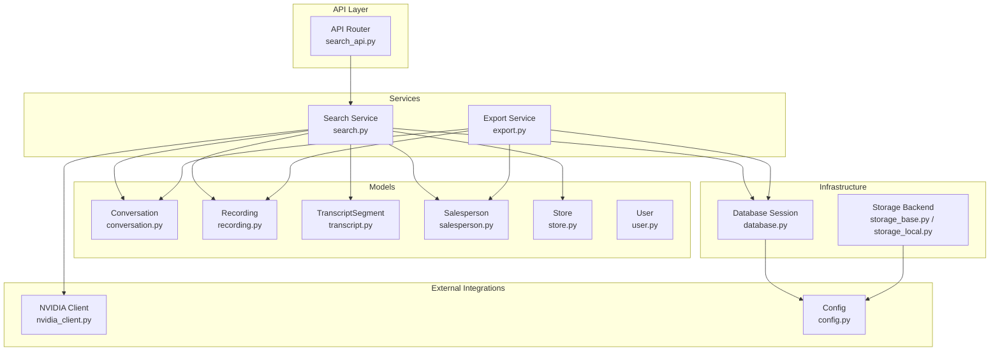
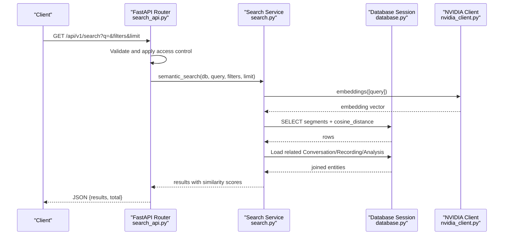
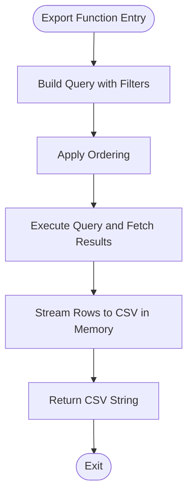
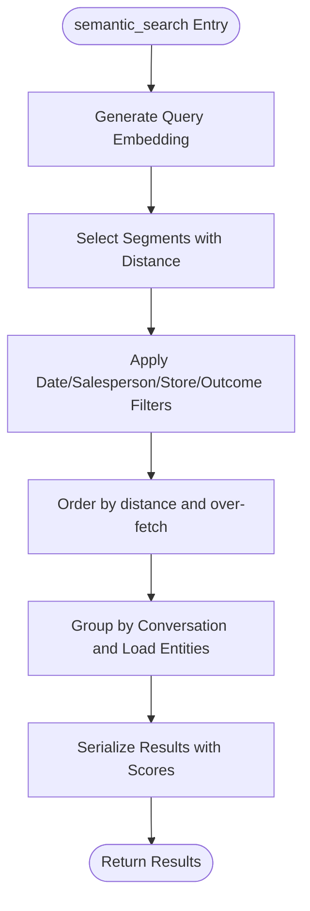
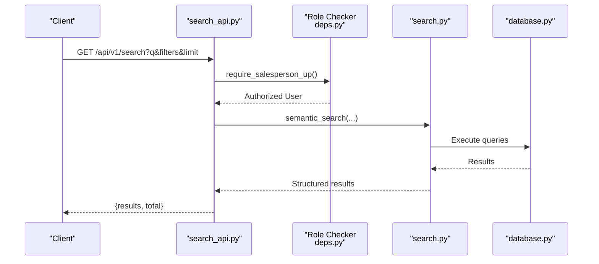
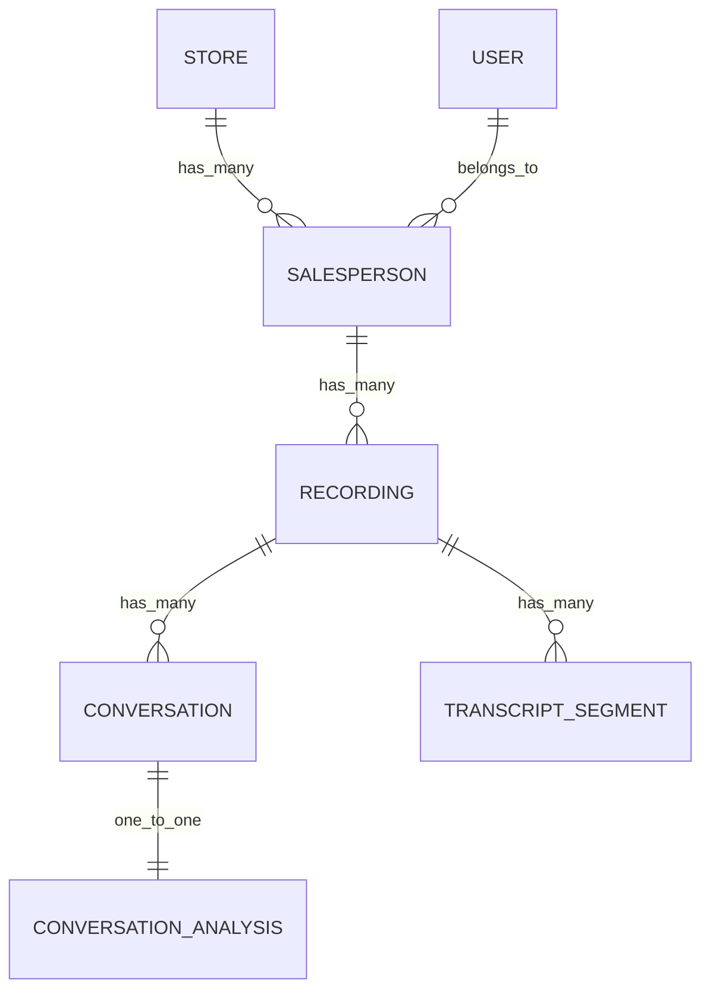
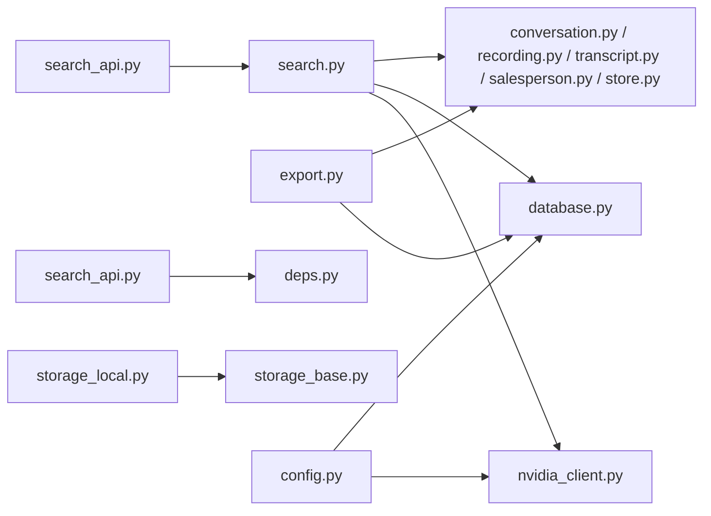

# Utility Services

<cite>
**Referenced Files in This Document**
- [export.py](file://apps/api/src/services/export.py)
- [search.py](file://apps/api/src/services/search.py)
- [search_api.py](file://apps/api/src/api/v1/search.py)
- [conversation.py](file://apps/api/src/models/conversation.py)
- [recording.py](file://apps/api/src/models/recording.py)
- [transcript.py](file://apps/api/src/models/transcript.py)
- [salesperson.py](file://apps/api/src/models/salesperson.py)
- [store.py](file://apps/api/src/models/store.py)
- [user.py](file://apps/api/src/models/user.py)
- [nvidia_client.py](file://apps/api/src/ai/nvidia_client.py)
- [config.py](file://apps/api/src/config.py)
- [deps.py](file://apps/api/src/api/deps.py)
- [database.py](file://apps/api/src/database.py)
- [storage_base.py](file://apps/api/src/storage/base.py)
- [storage_local.py](file://apps/api/src/storage/local.py)
</cite>

## Table of Contents
1. [Introduction](#introduction)
2. [Project Structure](#project-structure)
3. [Core Components](#core-components)
4. [Architecture Overview](#architecture-overview)
5. [Detailed Component Analysis](#detailed-component-analysis)
6. [Dependency Analysis](#dependency-analysis)
7. [Performance Considerations](#performance-considerations)
8. [Troubleshooting Guide](#troubleshooting-guide)
9. [Security and Access Control](#security-and-access-control)
10. [Conclusion](#conclusion)

## Introduction
This document describes the utility services that power specialized functionality in the application, focusing on:
- Export service: generating CSV reports for recordings and conversation analyses.
- Search service: performing semantic search across transcript segments using vector similarity and returning structured results.

It explains how these services integrate with data models, how queries are constructed and optimized, and how to handle errors and performance concerns for large datasets. It also covers security considerations for access control and export data protection.

## Project Structure
The utility services reside under the FastAPI application in the `apps/api/src` directory. The key areas are:
- Services: business logic for export and search.
- Models: SQLAlchemy ORM definitions for domain entities.
- API: FastAPI routes exposing search functionality.
- AI clients: external integrations for embeddings.
- Storage: abstraction for file storage backends.
- Dependencies: authentication and authorization helpers.

**Diagram sources**
- [search_api.py:1-99](file://apps/api/src/api/v1/search.py#L1-L99)
- [export.py:1-100](file://apps/api/src/services/export.py#L1-L100)
- [search.py:1-165](file://apps/api/src/services/search.py#L1-L165)
- [conversation.py:1-61](file://apps/api/src/models/conversation.py#L1-L61)
- [recording.py:1-60](file://apps/api/src/models/recording.py#L1-L60)
- [transcript.py:1-27](file://apps/api/src/models/transcript.py#L1-L27)
- [salesperson.py:1-32](file://apps/api/src/models/salesperson.py#L1-L32)
- [store.py:1-32](file://apps/api/src/models/store.py#L1-L32)
- [user.py:1-48](file://apps/api/src/models/user.py#L1-L48)
- [nvidia_client.py:1-274](file://apps/api/src/ai/nvidia_client.py#L1-L274)
- [config.py:1-52](file://apps/api/src/config.py#L1-L52)
- [database.py:1-34](file://apps/api/src/database.py#L1-L34)
- [storage_base.py:1-34](file://apps/api/src/storage/base.py#L1-L34)
- [storage_local.py:1-50](file://apps/api/src/storage/local.py#L1-L50)

**Section sources**
- [search_api.py:1-99](file://apps/api/src/api/v1/search.py#L1-L99)
- [export.py:1-100](file://apps/api/src/services/export.py#L1-L100)
- [search.py:1-165](file://apps/api/src/services/search.py#L1-L165)
- [database.py:1-34](file://apps/api/src/database.py#L1-L34)

## Core Components
- Export service: Provides CSV export for recordings and conversation analyses with optional filters and deterministic ordering.
- Search service: Implements semantic search using vector embeddings, joins multiple entities, applies filters, and returns structured results with similarity scores.
- API integration: Exposes search via a FastAPI route with access control and result serialization.
- Data models: Define relationships and constraints used by both services.
- External integrations: NVIDIA client for embeddings; storage backend abstraction; database sessions.

**Section sources**
- [export.py:15-100](file://apps/api/src/services/export.py#L15-L100)
- [search.py:16-165](file://apps/api/src/services/search.py#L16-L165)
- [search_api.py:14-99](file://apps/api/src/api/v1/search.py#L14-L99)
- [conversation.py:11-61](file://apps/api/src/models/conversation.py#L11-L61)
- [recording.py:24-60](file://apps/api/src/models/recording.py#L24-L60)
- [transcript.py:10-27](file://apps/api/src/models/transcript.py#L10-L27)
- [nvidia_client.py:237-270](file://apps/api/src/ai/nvidia_client.py#L237-L270)
- [storage_base.py:4-34](file://apps/api/src/storage/base.py#L4-L34)
- [database.py:26-34](file://apps/api/src/database.py#L26-L34)

## Architecture Overview
The utility services follow a layered architecture:
- API layer handles requests and applies access control.
- Service layer encapsulates business logic and query composition.
- Model layer defines persistence and relationships.
- External integrations provide vector embeddings and storage.
- Infrastructure manages database sessions and configuration.

**Diagram sources**
- [search_api.py:14-99](file://apps/api/src/api/v1/search.py#L14-L99)
- [search.py:16-165](file://apps/api/src/services/search.py#L16-L165)
- [nvidia_client.py:237-270](file://apps/api/src/ai/nvidia_client.py#L237-L270)
- [database.py:26-34](file://apps/api/src/database.py#L26-L34)

## Detailed Component Analysis

### Export Service
The export service generates CSV reports for:
- Recordings: filtered by salesperson and status, ordered by upload time.
- Conversations: joined with transcript analyses and recordings, filtered by recording or salesperson, ordered by conversation start time.

Key behaviors:
- Query construction with optional filters and ordering.
- Streaming to memory using StringIO for CSV output.
- Field selection tailored to reporting needs.

**Diagram sources**
- [export.py:15-46](file://apps/api/src/services/export.py#L15-L46)
- [export.py:49-99](file://apps/api/src/services/export.py#L49-L99)

**Section sources**
- [export.py:15-100](file://apps/api/src/services/export.py#L15-L100)
- [recording.py:24-60](file://apps/api/src/models/recording.py#L24-L60)
- [conversation.py:11-61](file://apps/api/src/models/conversation.py#L11-L61)

### Search Service
The search service performs semantic search using vector embeddings:
- Generates an embedding for the query via the NVIDIA client.
- Selects transcript segments whose embeddings are not null and align with conversation time windows.
- Applies filters for date range, salesperson, store, and outcome.
- Groups results by conversation, selects the best-matching segment per conversation, and loads related entities.
- Returns serialized results with similarity scores.

**Diagram sources**
- [search.py:16-124](file://apps/api/src/services/search.py#L16-L124)
- [nvidia_client.py:237-270](file://apps/api/src/ai/nvidia_client.py#L237-L270)

**Section sources**
- [search.py:16-165](file://apps/api/src/services/search.py#L16-L165)
- [transcript.py:10-27](file://apps/api/src/models/transcript.py#L10-L27)
- [conversation.py:11-61](file://apps/api/src/models/conversation.py#L11-L61)
- [recording.py:24-60](file://apps/api/src/models/recording.py#L24-L60)
- [salesperson.py:10-32](file://apps/api/src/models/salesperson.py#L10-L32)
- [store.py:11-32](file://apps/api/src/models/store.py#L11-L32)

### API Integration for Search
The search API:
- Validates query parameters and applies access control using a role checker.
- Calls the search service and serializes results into a stable structure.
- Limits results to a configurable upper bound.

**Diagram sources**
- [search_api.py:14-99](file://apps/api/src/api/v1/search.py#L14-L99)
- [deps.py:41-63](file://apps/api/src/api/deps.py#L41-L63)
- [search.py:16-124](file://apps/api/src/services/search.py#L16-L124)
- [database.py:26-34](file://apps/api/src/database.py#L26-L34)

**Section sources**
- [search_api.py:14-99](file://apps/api/src/api/v1/search.py#L14-L99)
- [deps.py:41-63](file://apps/api/src/api/deps.py#L41-L63)

### Data Models and Relationships
The models define the entities and relationships used by the services:
- Conversation: links to Recording and has optional ConversationAnalysis.
- Recording: links to Salesperson and contains TranscriptSegment entries.
- TranscriptSegment: holds text and optional embedding vector.
- Salesperson and Store: hierarchical organization.
- User: authorization context.

**Diagram sources**
- [conversation.py:11-61](file://apps/api/src/models/conversation.py#L11-L61)
- [recording.py:24-60](file://apps/api/src/models/recording.py#L24-L60)
- [transcript.py:10-27](file://apps/api/src/models/transcript.py#L10-L27)
- [salesperson.py:10-32](file://apps/api/src/models/salesperson.py#L10-L32)
- [store.py:11-32](file://apps/api/src/models/store.py#L11-L32)
- [user.py:19-48](file://apps/api/src/models/user.py#L19-L48)

**Section sources**
- [conversation.py:11-61](file://apps/api/src/models/conversation.py#L11-L61)
- [recording.py:24-60](file://apps/api/src/models/recording.py#L24-L60)
- [transcript.py:10-27](file://apps/api/src/models/transcript.py#L10-L27)
- [salesperson.py:10-32](file://apps/api/src/models/salesperson.py#L10-L32)
- [store.py:11-32](file://apps/api/src/models/store.py#L11-L32)
- [user.py:19-48](file://apps/api/src/models/user.py#L19-L48)

## Dependency Analysis
- Search service depends on:
  - NVIDIA client for embeddings.
  - SQLAlchemy async session for queries.
  - Models for joins and filters.
- Export service depends on:
  - SQLAlchemy async session.
  - Models for query construction.
- API layer depends on:
  - Role checker for access control.
  - Search service for results.
- Storage and configuration:
  - Storage backend abstraction supports local storage.
  - Config provides external service endpoints and timeouts.

**Diagram sources**
- [search_api.py:14-99](file://apps/api/src/api/v1/search.py#L14-L99)
- [search.py:16-165](file://apps/api/src/services/search.py#L16-L165)
- [nvidia_client.py:237-270](file://apps/api/src/ai/nvidia_client.py#L237-L270)
- [database.py:26-34](file://apps/api/src/database.py#L26-L34)
- [export.py:15-100](file://apps/api/src/services/export.py#L15-L100)
- [conversation.py:11-61](file://apps/api/src/models/conversation.py#L11-L61)
- [recording.py:24-60](file://apps/api/src/models/recording.py#L24-L60)
- [transcript.py:10-27](file://apps/api/src/models/transcript.py#L10-L27)
- [salesperson.py:10-32](file://apps/api/src/models/salesperson.py#L10-L32)
- [store.py:11-32](file://apps/api/src/models/store.py#L11-L32)
- [deps.py:41-63](file://apps/api/src/api/deps.py#L41-L63)
- [storage_base.py:4-34](file://apps/api/src/storage/base.py#L4-L34)
- [storage_local.py:1-50](file://apps/api/src/storage/local.py#L1-L50)
- [config.py:1-52](file://apps/api/src/config.py#L1-L52)

**Section sources**
- [search.py:16-165](file://apps/api/src/services/search.py#L16-L165)
- [export.py:15-100](file://apps/api/src/services/export.py#L15-L100)
- [search_api.py:14-99](file://apps/api/src/api/v1/search.py#L14-L99)
- [deps.py:41-63](file://apps/api/src/api/deps.py#L41-L63)
- [storage_base.py:4-34](file://apps/api/src/storage/base.py#L4-L34)
- [storage_local.py:1-50](file://apps/api/src/storage/local.py#L1-L50)
- [config.py:1-52](file://apps/api/src/config.py#L1-L52)

## Performance Considerations
- Vector search optimization:
  - Filter out segments with null embeddings early.
  - Use over-fetching and early termination to manage result cardinality.
  - Keep joins minimal and load only required related entities.
- Query batching:
  - Embedding generation uses batch processing to reduce overhead.
- Database tuning:
  - Asynchronous sessions with connection pooling.
  - Indexes on foreign keys and frequently filtered columns.
- Export performance:
  - Prefer streaming to memory for CSV output.
  - Limit result sets and avoid unnecessary joins.
- External API resilience:
  - Retry logic and exponential backoff for NVIDIA client.
  - Timeouts configured per request.

[No sources needed since this section provides general guidance]

## Troubleshooting Guide
Common issues and resolutions:
- Embedding generation failures:
  - Batch processing continues despite exceptions; logs errors and proceeds.
  - Verify external service availability and credentials.
- Search result limits:
  - The service enforces an upper bound on fetched candidates and stops early when target count is reached.
- Export failures:
  - CSV generation is in-memory; ensure sufficient memory for large result sets.
  - Validate filters and ordering to prevent excessive scans.
- Data validation during export:
  - Status values are normalized using enum values when present.
- Access control:
  - Search requires a valid bearer token with appropriate roles.

**Section sources**
- [search.py:153-163](file://apps/api/src/services/search.py#L153-L163)
- [search_api.py:22-24](file://apps/api/src/api/v1/search.py#L22-L24)
- [export.py:42-44](file://apps/api/src/services/export.py#L42-L44)
- [deps.py:41-63](file://apps/api/src/api/deps.py#L41-L63)

## Security and Access Control
- Authentication and authorization:
  - Search route uses a role checker allowing multiple roles up to salesperson level.
  - Token decoding and user lookup performed centrally.
- Data export security:
  - Access control should be enforced at the API layer for export endpoints.
  - Restrict exportable entities to authorized scopes (e.g., store or brand boundaries).
  - Consider signed URLs and temporary access for file downloads if extended beyond local storage.
- External service security:
  - API keys and endpoints are managed via configuration.
  - Network timeouts and retry policies mitigate transient failures.

**Section sources**
- [search_api.py:24-24](file://apps/api/src/api/v1/search.py#L24-L24)
- [deps.py:41-63](file://apps/api/src/api/deps.py#L41-L63)
- [config.py:28-35](file://apps/api/src/config.py#L28-L35)

## Conclusion
The utility services provide robust, scalable capabilities for exporting reporting data and performing semantic search across conversations. They integrate cleanly with the data models, leverage asynchronous database operations, and incorporate resilient external integrations. Proper access control and performance tuning ensure reliable operation for large datasets.