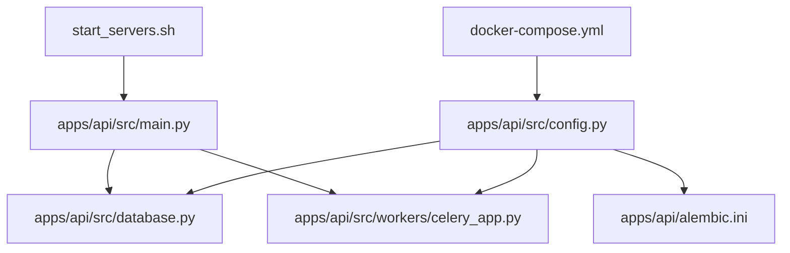
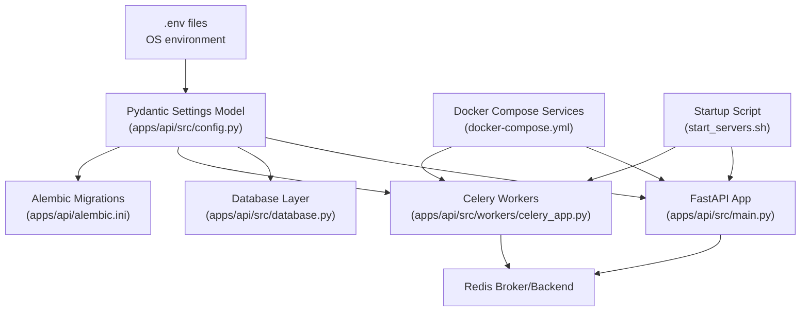
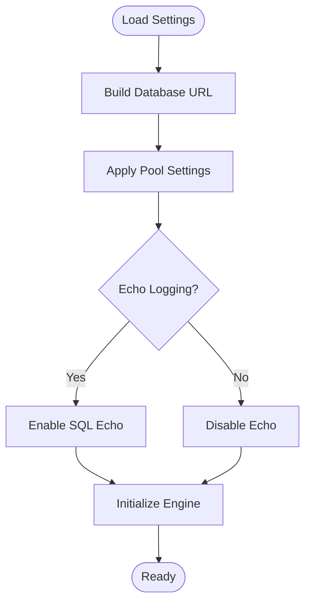
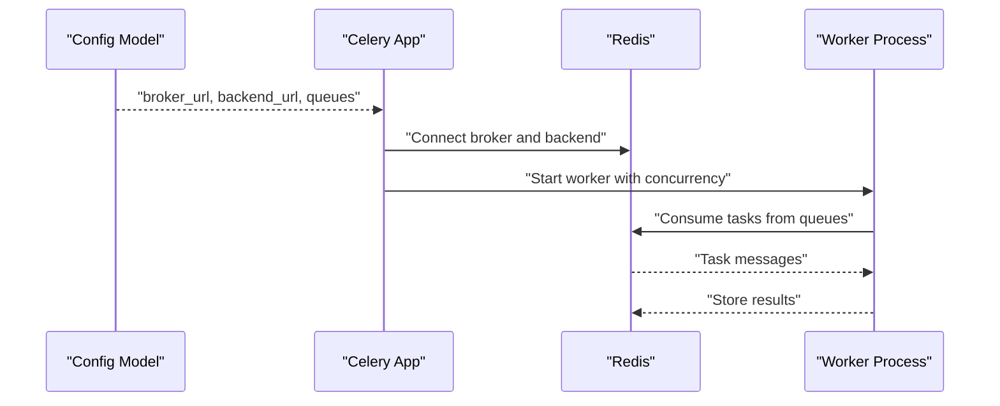
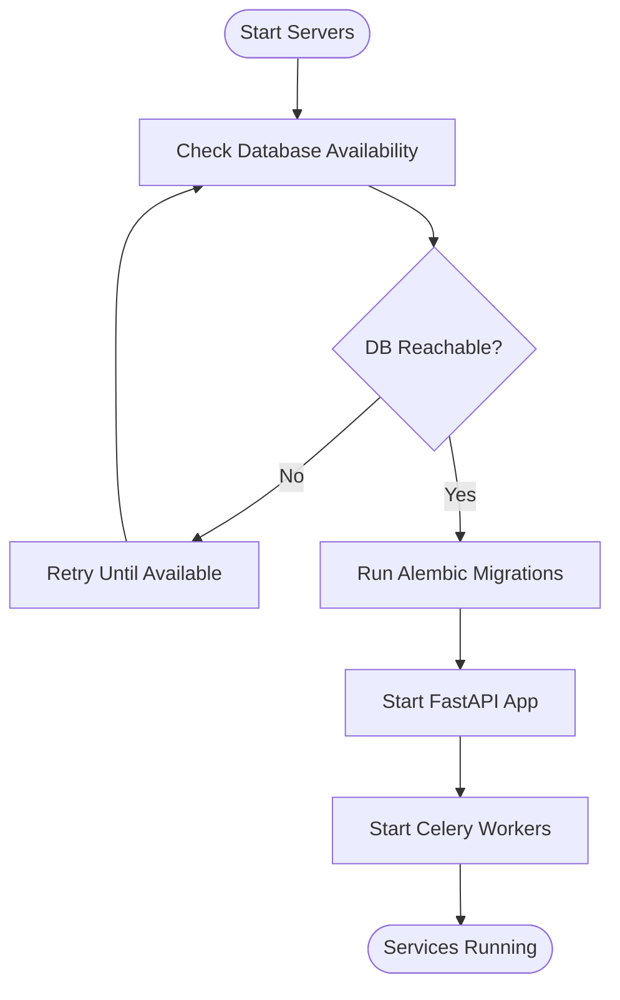
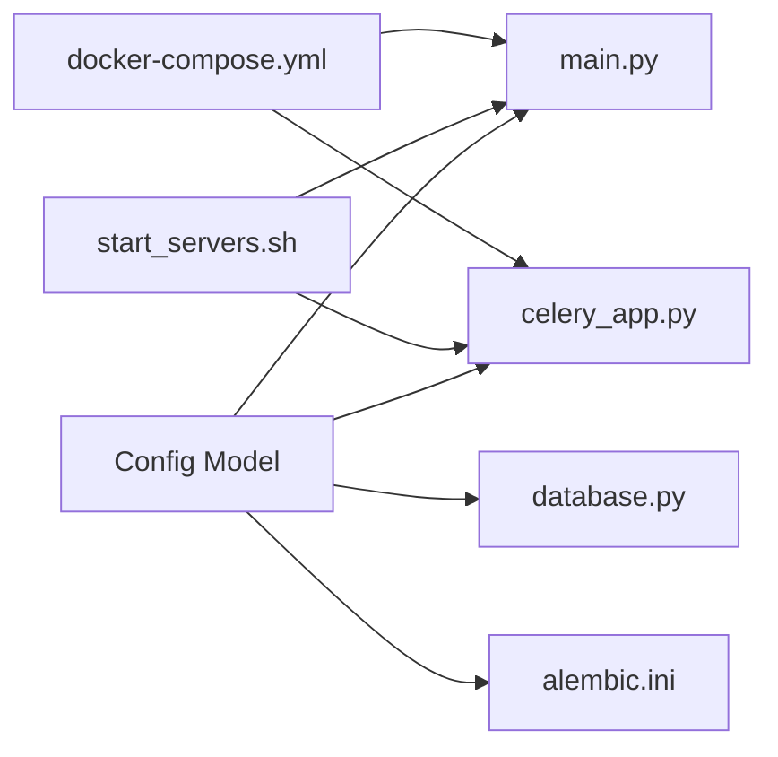

# Configuration & Environment Management

<cite>
**Referenced Files in This Document**
- [apps/api/src/config.py](file://apps/api/src/config.py)
- [apps/api/src/main.py](file://apps/api/src/main.py)
- [apps/api/src/database.py](file://apps/api/src/database.py)
- [apps/api/src/workers/celery_app.py](file://apps/api/src/workers/celery_app.py)
- [docker-compose.yml](file://docker-compose.yml)
- [start_servers.sh](file://start_servers.sh)
- [apps/api/pyproject.toml](file://apps/api/pyproject.toml)
- [apps/api/alembic.ini](file://apps/api/alembic.ini)
- [packages/shared/src/constants.ts](file://packages/shared/src/constants.ts)
</cite>

## Table of Contents
1. [Introduction](#introduction)
2. [Project Structure](#project-structure)
3. [Core Components](#core-components)
4. [Architecture Overview](#architecture-overview)
5. [Detailed Component Analysis](#detailed-component-analysis)
6. [Dependency Analysis](#dependency-analysis)
7. [Performance Considerations](#performance-considerations)
8. [Troubleshooting Guide](#troubleshooting-guide)
9. [Conclusion](#conclusion)

## Introduction
This document explains the configuration and environment management strategy for the Xsamaa AI Pipeline. It covers the multi-environment configuration model built with Pydantic settings, environment variable handling, secrets management, and validation patterns. It also documents the configuration hierarchy from root environment files to application-specific settings, including database connections, Redis-backed Celery workers, NVIDIA API credentials, JWT settings, and storage backend configuration. Additionally, it describes Docker Compose orchestration, container environment setup, inter-service communication, development versus production differences, security considerations, deployment specifics, scaling, environment-specific feature flags, and the startup script’s dependency checks and automated initialization.

## Project Structure
The configuration system spans several layers:
- Root orchestration via Docker Compose defines services and shared environment variables.
- Application-level configuration is centralized in the FastAPI service under apps/api/src/config.py.
- Database migrations and worker configuration integrate with the same settings.
- Shared constants and environment-aware defaults are provided in the shared package.
- Startup scripts coordinate service readiness and initialization.

**Diagram sources**
- [docker-compose.yml](file://docker-compose.yml)
- [start_servers.sh](file://start_servers.sh)
- [apps/api/src/config.py](file://apps/api/src/config.py)
- [apps/api/src/main.py](file://apps/api/src/main.py)
- [apps/api/src/database.py](file://apps/api/src/database.py)
- [apps/api/src/workers/celery_app.py](file://apps/api/src/workers/celery_app.py)
- [apps/api/alembic.ini](file://apps/api/alembic.ini)

**Section sources**
- [docker-compose.yml](file://docker-compose.yml)
- [start_servers.sh](file://start_servers.sh)
- [apps/api/src/config.py](file://apps/api/src/config.py)

## Core Components
The configuration system is implemented as a Pydantic Settings model that loads environment variables from multiple sources and validates them at runtime. It centralizes:
- Database connection settings
- Redis-backed Celery broker/backend configuration
- NVIDIA API credentials
- JWT signing and verification settings
- Storage backend selection and configuration
- Alembic migration configuration
- Feature flags and environment-specific toggles

Key responsibilities:
- Load environment variables from .env files and OS environment
- Validate required variables and enforce type safety
- Provide defaults for non-sensitive settings
- Expose configuration to application modules (database, workers, main app)
- Support development vs production overrides

**Section sources**
- [apps/api/src/config.py](file://apps/api/src/config.py)

## Architecture Overview
The configuration architecture integrates environment-driven settings with service orchestration and worker initialization. The diagram below maps the configuration sources to their consumers.

**Diagram sources**
- [apps/api/src/config.py](file://apps/api/src/config.py)
- [apps/api/src/main.py](file://apps/api/src/main.py)
- [apps/api/src/database.py](file://apps/api/src/database.py)
- [apps/api/src/workers/celery_app.py](file://apps/api/src/workers/celery_app.py)
- [apps/api/alembic.ini](file://apps/api/alembic.ini)
- [docker-compose.yml](file://docker-compose.yml)
- [start_servers.sh](file://start_servers.sh)

## Detailed Component Analysis

### Configuration Hierarchy and Settings Model
The configuration hierarchy follows a layered approach:
- Root environment files (.env) supply base values.
- OS environment variables override .env during runtime.
- Pydantic Settings model enforces validation and type safety.
- Application modules consume validated settings.

Settings covered:
- Database: connection URL, pool settings, echo logging
- Redis: broker URL, result backend URL, queue names
- NVIDIA: API key and endpoint
- JWT: signing algorithm, secret, expiration
- Storage: backend type and related parameters
- Alembic: database URL for migrations
- Feature flags: environment-specific toggles

Validation patterns:
- Required fields are enforced with explicit errors on missing values.
- Type coercion ensures numeric and boolean values are handled consistently.
- Sensitive fields are marked appropriately for logging and exposure policies.

**Section sources**
- [apps/api/src/config.py](file://apps/api/src/config.py)

### Database Configuration
The database configuration is derived from the settings model and consumed by the database module. It includes:
- Connection URL constructed from environment variables
- Pool settings for connection reuse and timeouts
- Optional echo flag for SQL statement logging

The database module initializes SQLAlchemy engine and session factory using these settings.

**Diagram sources**
- [apps/api/src/config.py](file://apps/api/src/config.py)
- [apps/api/src/database.py](file://apps/api/src/database.py)

**Section sources**
- [apps/api/src/config.py](file://apps/api/src/config.py)
- [apps/api/src/database.py](file://apps/api/src/database.py)

### Redis and Celery Configuration
Celery workers use Redis as both broker and result backend. The configuration model provides:
- Broker URL for task ingestion
- Backend URL for result storage
- Queue names for task routing
- Worker concurrency and task serialization settings

The Celery app module imports the settings and registers tasks for analysis, diarization, preprocessing, scoring, segmentation, and transcription.

**Diagram sources**
- [apps/api/src/config.py](file://apps/api/src/config.py)
- [apps/api/src/workers/celery_app.py](file://apps/api/src/workers/celery_app.py)

**Section sources**
- [apps/api/src/config.py](file://apps/api/src/config.py)
- [apps/api/src/workers/celery_app.py](file://apps/api/src/workers/celery_app.py)

### NVIDIA API Credentials and JWT Settings
NVIDIA API credentials are loaded from environment variables and passed to the AI client module. JWT settings control authentication and authorization behavior across the API.

Security considerations:
- Credentials are not logged or exposed in error traces.
- JWT secrets are managed via environment variables.
- Validation ensures required keys and endpoints are present.

**Section sources**
- [apps/api/src/config.py](file://apps/api/src/config.py)

### Storage Backend Configuration
The storage backend is selected and configured via settings. The storage module exposes a base interface and a local implementation. Settings determine which backend to initialize at runtime.

**Section sources**
- [apps/api/src/config.py](file://apps/api/src/config.py)
- [apps/api/src/storage/base.py](file://apps/api/src/storage/base.py)
- [apps/api/src/storage/local.py](file://apps/api/src/storage/local.py)

### Alembic Migration Configuration
Alembic reads the database URL from the settings model to connect to the target database for schema migrations. This ensures migrations align with the active environment.

**Section sources**
- [apps/api/src/config.py](file://apps/api/src/config.py)
- [apps/api/alembic.ini](file://apps/api/alembic.ini)

### Docker Compose Orchestration and Inter-Service Communication
Docker Compose defines services and shared environment variables. The compose file orchestrates:
- API service with port mapping and volume mounts
- Redis service for Celery broker/backend
- Database service for persistence
- Worker service(s) consuming tasks from Redis

Inter-service communication:
- API communicates with Redis for task queuing and Celery for async processing
- Workers connect to Redis for task consumption and result storage
- Database connectivity is configured via service DNS and network settings

**Section sources**
- [docker-compose.yml](file://docker-compose.yml)

### Startup Script: Dependency Checking and Automated Initialization
The startup script coordinates service readiness:
- Waits for dependent services (database, Redis) to become reachable
- Runs database migrations using Alembic
- Starts the FastAPI application server
- Initializes Celery workers after prerequisites are satisfied

**Diagram sources**
- [start_servers.sh](file://start_servers.sh)
- [apps/api/alembic.ini](file://apps/api/alembic.ini)
- [apps/api/src/main.py](file://apps/api/src/main.py)
- [apps/api/src/workers/celery_app.py](file://apps/api/src/workers/celery_app.py)

**Section sources**
- [start_servers.sh](file://start_servers.sh)

### Development vs Production Configuration Differences
Environment-specific differences observed:
- Database echo logging enabled in development for debugging
- JWT expiration and secret rotation policies differ by environment
- Storage backend selection switches between local and cloud-backed storage
- Feature flags enable experimental features in development
- Celery concurrency tuned for production throughput

These differences are controlled by environment variables and validated by the settings model.

**Section sources**
- [apps/api/src/config.py](file://apps/api/src/config.py)

### Security Considerations for Sensitive Data
- Secrets are loaded from environment variables and not committed to source control
- Sensitive fields are excluded from logs and error traces
- Validation prevents empty or malformed secrets
- Use of strong JWT secrets and secure transport (HTTPS/TLS) recommended in production
- Limit access to .env files and restrict permissions on deployment hosts

**Section sources**
- [apps/api/src/config.py](file://apps/api/src/config.py)

### Deployment-Specific Configurations and Scaling
Cloud deployment considerations:
- Use platform-managed secrets and environment variable injection
- Scale Celery workers horizontally based on workload
- Configure health checks and readiness probes for API and workers
- Use persistent volumes for database and storage backends
- Set up monitoring and alerting for Redis and database connectivity

Scaling patterns:
- Horizontal scaling of API replicas behind a load balancer
- Dedicated worker nodes for heavy processing tasks
- Separate Redis instances for high-throughput environments

**Section sources**
- [docker-compose.yml](file://docker-compose.yml)
- [apps/api/src/config.py](file://apps/api/src/config.py)

### Environment-Specific Feature Flags
Feature flags are environment-controlled toggles that enable/disable capabilities:
- Enable verbose logging and additional analytics in development
- Toggle experimental AI features per environment
- Control backup and export functionality based on environment

These flags are validated and applied early in the application lifecycle.

**Section sources**
- [apps/api/src/config.py](file://apps/api/src/config.py)

## Dependency Analysis
The configuration model acts as the single source of truth for all downstream components. Dependencies include:
- Application main module consumes validated settings
- Database module depends on database settings
- Celery app depends on Redis and worker settings
- Alembic depends on database settings for migrations
- Startup script orchestrates prerequisite checks and migrations

**Diagram sources**
- [apps/api/src/config.py](file://apps/api/src/config.py)
- [apps/api/src/main.py](file://apps/api/src/main.py)
- [apps/api/src/database.py](file://apps/api/src/database.py)
- [apps/api/src/workers/celery_app.py](file://apps/api/src/workers/celery_app.py)
- [apps/api/alembic.ini](file://apps/api/alembic.ini)
- [start_servers.sh](file://start_servers.sh)
- [docker-compose.yml](file://docker-compose.yml)

**Section sources**
- [apps/api/src/config.py](file://apps/api/src/config.py)
- [apps/api/src/main.py](file://apps/api/src/main.py)
- [apps/api/src/database.py](file://apps/api/src/database.py)
- [apps/api/src/workers/celery_app.py](file://apps/api/src/workers/celery_app.py)
- [apps/api/alembic.ini](file://apps/api/alembic.ini)
- [start_servers.sh](file://start_servers.sh)
- [docker-compose.yml](file://docker-compose.yml)

## Performance Considerations
- Tune database pool sizes and timeouts per environment
- Adjust Celery concurrency and prefetch counts for CPU-bound vs I/O-bound tasks
- Use Redis clustering and persistence for high availability
- Monitor and scale Redis and database resources based on workload
- Enable connection pooling and keep-alive settings to reduce overhead

## Troubleshooting Guide
Common configuration issues and resolutions:
- Missing environment variables cause validation errors at startup. Ensure all required variables are set in .env and/or OS environment.
- Incorrect database URL leads to connection failures. Verify host, port, database name, and credentials.
- Redis connectivity problems prevent task processing. Confirm broker and backend URLs and network accessibility.
- JWT misconfiguration blocks authentication. Validate signing algorithm, secret, and expiration settings.
- Alembic migration failures indicate schema mismatch. Align migration settings with current database state.
- Startup script hangs waiting for services. Check service health and network connectivity.

**Section sources**
- [apps/api/src/config.py](file://apps/api/src/config.py)
- [apps/api/src/database.py](file://apps/api/src/database.py)
- [apps/api/src/workers/celery_app.py](file://apps/api/src/workers/celery_app.py)
- [apps/api/alembic.ini](file://apps/api/alembic.ini)
- [start_servers.sh](file://start_servers.sh)

## Conclusion
The Xsamaa AI Pipeline employs a robust, environment-driven configuration system centered on Pydantic settings. It supports multi-environment deployments, secure secret handling, and strict validation. Combined with Docker Compose orchestration and a startup script that automates dependency checks and initialization, the system provides a reliable foundation for development and production operations. Adhering to the outlined practices ensures consistent behavior across environments, improved security, and scalable performance.