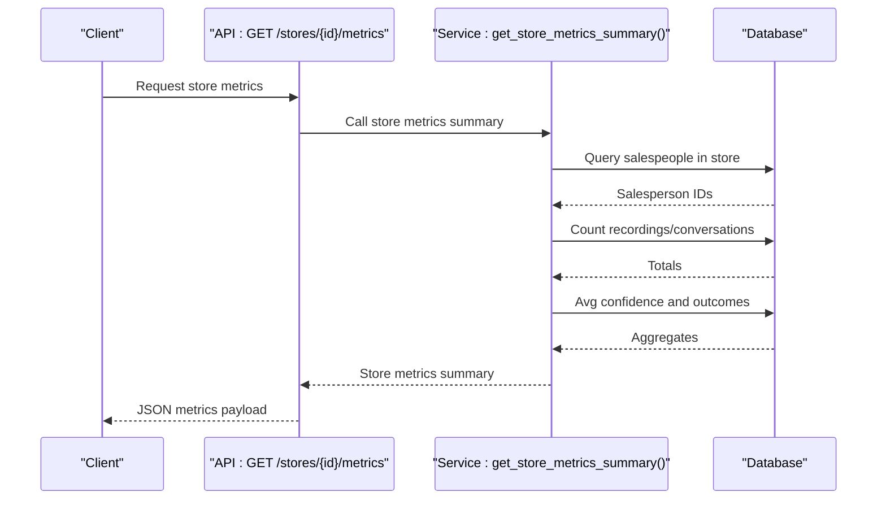
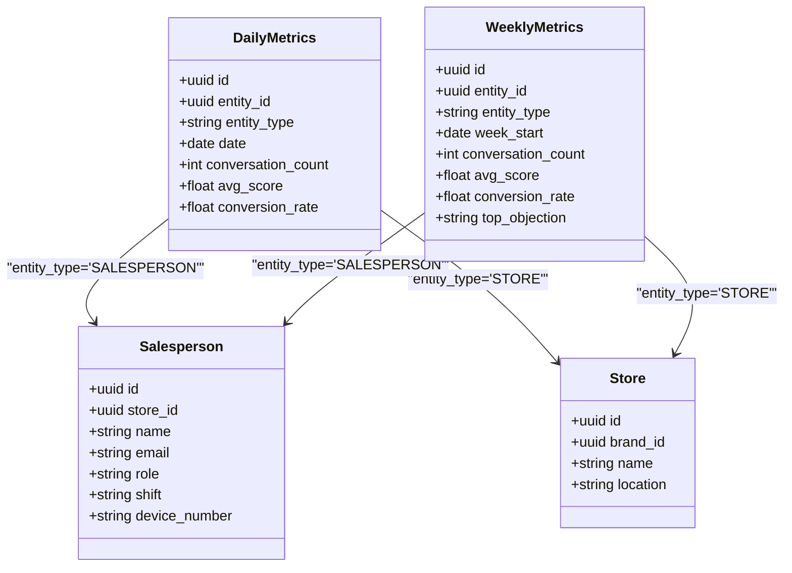
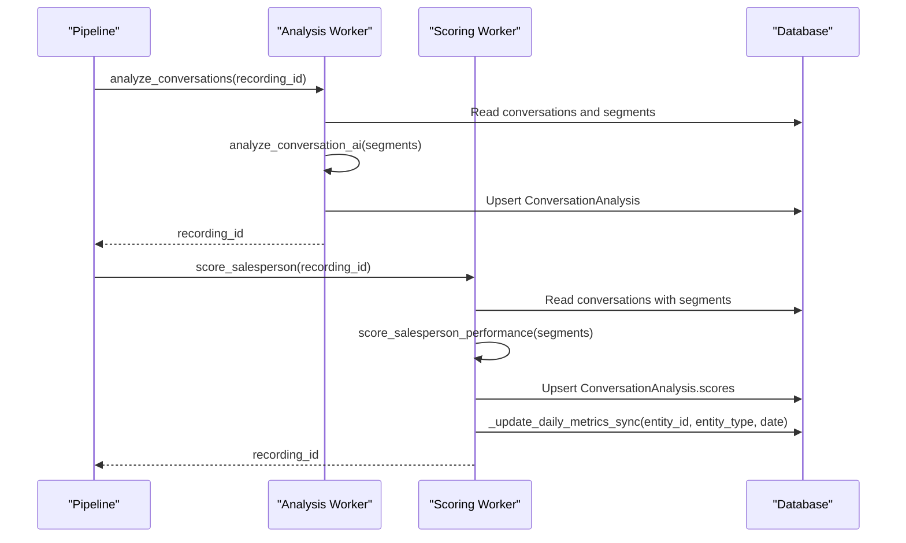
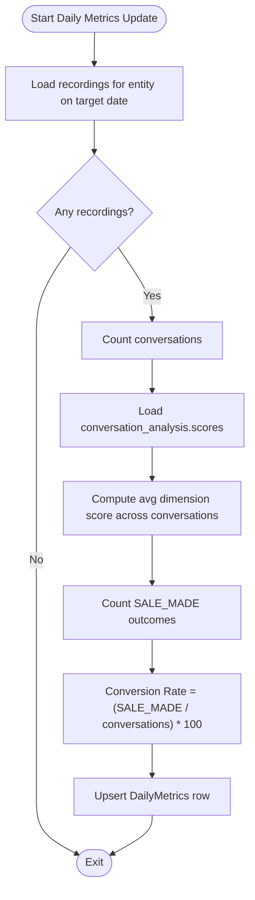
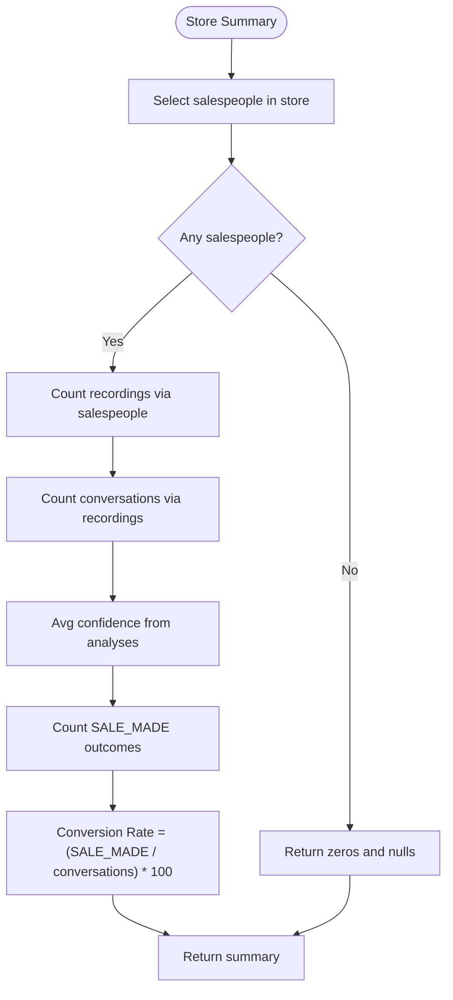
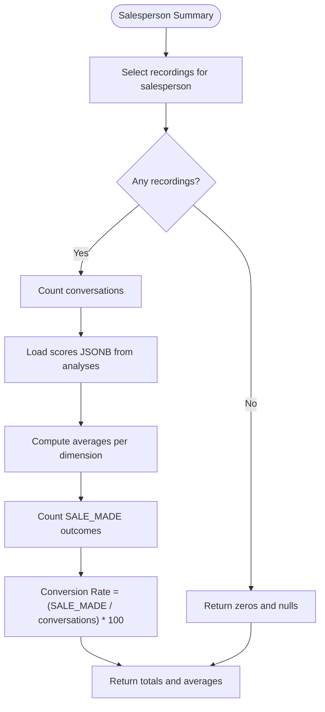
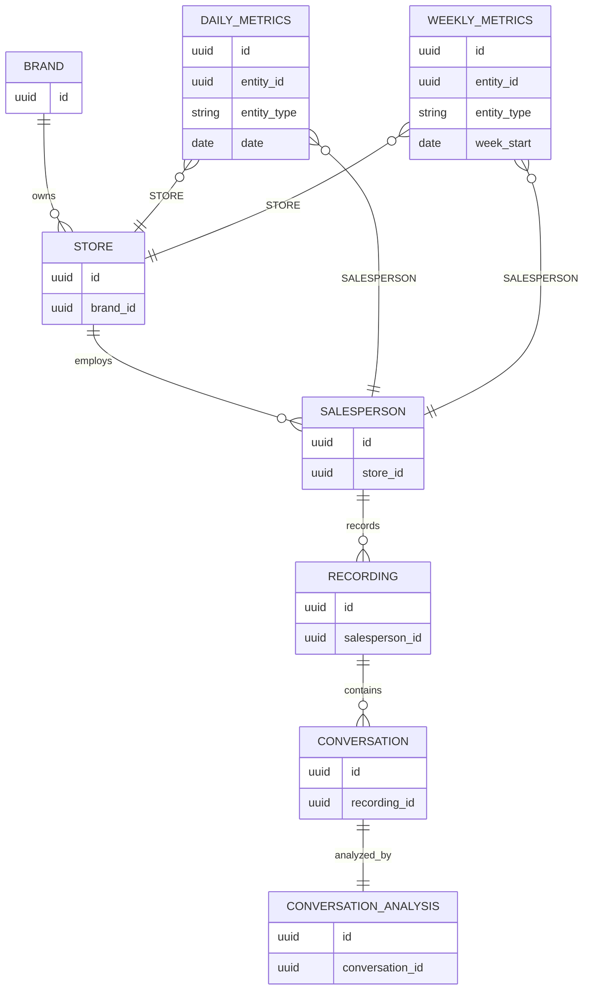
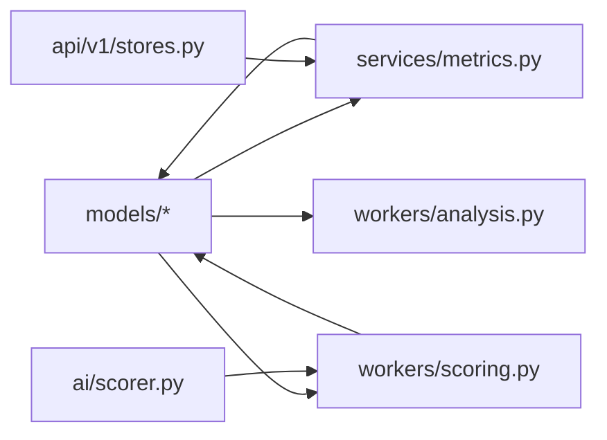

# Business Analytics Models

<cite>
**Referenced Files in This Document**
- [metrics.py](file://apps/api/src/models/metrics.py)
- [metrics.py](file://apps/api/src/services/metrics.py)
- [scoring.py](file://apps/api/src/workers/scoring.py)
- [analysis.py](file://apps/api/src/workers/analysis.py)
- [pipeline.py](file://apps/api/src/workers/pipeline.py)
- [scorer.py](file://apps/api/src/ai/scorer.py)
- [conversation.py](file://apps/api/src/models/conversation.py)
- [recording.py](file://apps/api/src/models/recording.py)
- [salesperson.py](file://apps/api/src/models/salesperson.py)
- [store.py](file://apps/api/src/models/store.py)
- [brand.py](file://apps/api/src/models/brand.py)
- [stores.py](file://apps/api/src/api/v1/stores.py)
</cite>

## Table of Contents
1. [Introduction](#introduction)
2. [Project Structure](#project-structure)
3. [Core Components](#core-components)
4. [Architecture Overview](#architecture-overview)
5. [Detailed Component Analysis](#detailed-component-analysis)
6. [Dependency Analysis](#dependency-analysis)
7. [Performance Considerations](#performance-considerations)
8. [Troubleshooting Guide](#troubleshooting-guide)
9. [Conclusion](#conclusion)
10. [Appendices](#appendices)

## Introduction
This document describes the business analytics models and data flows in the Xsamaa AI Pipeline focused on performance metrics, statistical aggregations, trends, and analytical summaries. It covers:
- The Metrics model for daily and weekly analytics
- Metric types: individual performance scores, team benchmarks, coaching recommendations, and comparative analytics
- Aggregation patterns, rolling window calculations, and historical retention strategies
- Relationships among core entities (salespeople, stores, brands) and cascading updates
- Calculation algorithms, scoring methodologies, and business rule implementations
- Caching strategies, pre-computed aggregates, and real-time calculation requirements
- Example analytical queries and dashboard retrieval patterns

## Project Structure
The analytics domain spans models, services, workers, and API endpoints:
- Models define the persisted metrics and core entities
- Services expose analytical summaries and time-series queries
- Workers orchestrate AI scoring and update metrics
- API routes surface store-level analytics to clients

```mermaid
graph TB
subgraph "Models"
DM["DailyMetrics"]
WM["WeeklyMetrics"]
SP["Salesperson"]
ST["Store"]
BR["Brand"]
RC["Recording"]
CV["Conversation"]
CA["ConversationAnalysis"]
end
subgraph "Services"
MS["metrics.py<br/>get_entity_daily_metrics()<br/>get_entity_weekly_metrics()<br/>get_store_metrics_summary()<br/>get_salesperson_performance_summary()"]
end
subgraph "Workers"
AN["analysis.py<br/>analyze_conversations()"]
SC["scoring.py<br/>score_salesperson()<br/>_update_daily_metrics_sync()"]
PL["pipeline.py<br/>start_processing_pipeline()"]
end
subgraph "AI"
SR["scorer.py<br/>score_salesperson_performance()<br/>compute_average_scores()"]
end
subgraph "API"
API["stores.py<br/>GET /api/v1/stores/{store_id}/metrics"]
end
DM --- SP
WM --- SP
DM --- ST
WM --- ST
SP --> RC
ST --> SP
BR --> ST
RC --> CV
CV --> CA
AN --> CA
SC --> DM
PL --> AN
PL --> SC
API --> MS
```

**Diagram sources**
- [metrics.py:10-39](file://apps/api/src/models/metrics.py#L10-L39)
- [metrics.py:13-191](file://apps/api/src/services/metrics.py#L13-L191)
- [scoring.py:235-314](file://apps/api/src/workers/scoring.py#L235-L314)
- [analysis.py:152-242](file://apps/api/src/workers/analysis.py#L152-L242)
- [pipeline.py:12-35](file://apps/api/src/workers/pipeline.py#L12-L35)
- [scorer.py:66-217](file://apps/api/src/ai/scorer.py#L66-L217)
- [conversation.py:11-61](file://apps/api/src/models/conversation.py#L11-L61)
- [recording.py:24-60](file://apps/api/src/models/recording.py#L24-L60)
- [salesperson.py:10-32](file://apps/api/src/models/salesperson.py#L10-L32)
- [store.py:11-32](file://apps/api/src/models/store.py#L11-L32)
- [brand.py:10-26](file://apps/api/src/models/brand.py#L10-L26)
- [stores.py:43-52](file://apps/api/src/api/v1/stores.py#L43-L52)

**Section sources**
- [metrics.py:10-39](file://apps/api/src/models/metrics.py#L10-L39)
- [metrics.py:13-191](file://apps/api/src/services/metrics.py#L13-L191)
- [scoring.py:235-314](file://apps/api/src/workers/scoring.py#L235-L314)
- [analysis.py:152-242](file://apps/api/src/workers/analysis.py#L152-L242)
- [pipeline.py:12-35](file://apps/api/src/workers/pipeline.py#L12-L35)
- [scorer.py:66-217](file://apps/api/src/ai/scorer.py#L66-L217)
- [conversation.py:11-61](file://apps/api/src/models/conversation.py#L11-L61)
- [recording.py:24-60](file://apps/api/src/models/recording.py#L24-L60)
- [salesperson.py:10-32](file://apps/api/src/models/salesperson.py#L10-L32)
- [store.py:11-32](file://apps/api/src/models/store.py#L11-L32)
- [brand.py:10-26](file://apps/api/src/models/brand.py#L10-L26)
- [stores.py:43-52](file://apps/api/src/api/v1/stores.py#L43-L52)

## Core Components
- Metrics models
  - DailyMetrics: entity-level daily aggregates (conversation count, average performance score, conversion rate)
  - WeeklyMetrics: entity-level weekly aggregates (conversation count, average performance score, conversion rate, top objection)
- Entities and relationships
  - Salesperson belongs to Store; Store belongs to Brand
  - Recording belongs to Salesperson; Conversation belongs to Recording; ConversationAnalysis belongs to Conversation
- Services
  - Entity daily/weekly queries, store summary, and salesperson summary
- Workers
  - Conversation analysis and scoring workers update ConversationAnalysis and DailyMetrics
- AI scoring
  - Dimensional scoring across greeting, discovery, product knowledge, objection handling, closing

Key implementation references:
- Metrics models: [metrics.py:10-39](file://apps/api/src/models/metrics.py#L10-L39)
- Metrics service: [metrics.py:13-191](file://apps/api/src/services/metrics.py#L13-L191)
- Scoring worker: [scoring.py:235-314](file://apps/api/src/workers/scoring.py#L235-L314)
- Analysis worker: [analysis.py:152-242](file://apps/api/src/workers/analysis.py#L152-L242)
- AI scoring: [scorer.py:66-217](file://apps/api/src/ai/scorer.py#L66-L217)
- Entities: [salesperson.py:10-32](file://apps/api/src/models/salesperson.py#L10-L32), [store.py:11-32](file://apps/api/src/models/store.py#L11-L32), [brand.py:10-26](file://apps/api/src/models/brand.py#L10-L26), [recording.py:24-60](file://apps/api/src/models/recording.py#L24-L60), [conversation.py:11-61](file://apps/api/src/models/conversation.py#L11-L61)

**Section sources**
- [metrics.py:10-39](file://apps/api/src/models/metrics.py#L10-L39)
- [metrics.py:13-191](file://apps/api/src/services/metrics.py#L13-L191)
- [scoring.py:235-314](file://apps/api/src/workers/scoring.py#L235-L314)
- [analysis.py:152-242](file://apps/api/src/workers/analysis.py#L152-L242)
- [scorer.py:66-217](file://apps/api/src/ai/scorer.py#L66-L217)
- [salesperson.py:10-32](file://apps/api/src/models/salesperson.py#L10-L32)
- [store.py:11-32](file://apps/api/src/models/store.py#L11-L32)
- [brand.py:10-26](file://apps/api/src/models/brand.py#L10-L26)
- [recording.py:24-60](file://apps/api/src/models/recording.py#L24-L60)
- [conversation.py:11-61](file://apps/api/src/models/conversation.py#L11-L61)

## Architecture Overview
The analytics pipeline transforms raw audio recordings into actionable insights:
- Pipeline orchestrates preprocessing, transcription, diarization, segmentation, analysis, and scoring
- Analysis worker populates ConversationAnalysis with outcomes and confidence
- Scoring worker computes dimensional scores, stores them, and updates DailyMetrics for the salesperson and store
- Services and API provide dashboards and reports



**Diagram sources**
- [stores.py:43-52](file://apps/api/src/api/v1/stores.py#L43-L52)
- [metrics.py:53-121](file://apps/api/src/services/metrics.py#L53-L121)

**Section sources**
- [pipeline.py:12-35](file://apps/api/src/workers/pipeline.py#L12-L35)
- [analysis.py:152-242](file://apps/api/src/workers/analysis.py#L152-L242)
- [scoring.py:235-314](file://apps/api/src/workers/scoring.py#L235-L314)
- [stores.py:43-52](file://apps/api/src/api/v1/stores.py#L43-L52)
- [metrics.py:53-121](file://apps/api/src/services/metrics.py#L53-L121)

## Detailed Component Analysis

### Metrics Model
- DailyMetrics
  - Composite unique constraint on (entity_id, entity_type, date)
  - Fields: conversation_count, avg_score, conversion_rate
- WeeklyMetrics
  - Composite unique constraint on (entity_id, entity_type, week_start)
  - Fields: conversation_count, avg_score, conversion_rate, top_objection
- Entity types: "SALESPERSON" and "STORE"
- Upsert logic ensures idempotent updates per day/entity



**Diagram sources**
- [metrics.py:10-39](file://apps/api/src/models/metrics.py#L10-L39)
- [salesperson.py:10-32](file://apps/api/src/models/salesperson.py#L10-L32)
- [store.py:11-32](file://apps/api/src/models/store.py#L11-L32)

**Section sources**
- [metrics.py:10-39](file://apps/api/src/models/metrics.py#L10-L39)

### Scoring and Metrics Update Workflow
- Conversation analysis populates ConversationAnalysis with intent, products, objections, competitors, closing_attempt, outcome, confidence, and scores
- Scoring worker:
  - Computes dimensional scores per conversation
  - Stores scores in conversation_analysis.scores
  - Updates DailyMetrics for the salesperson and store on the recording’s upload date
- Conversion rate computed as (number of SALE_MADE outcomes / total conversations) × 100



**Diagram sources**
- [pipeline.py:12-35](file://apps/api/src/workers/pipeline.py#L12-L35)
- [analysis.py:152-242](file://apps/api/src/workers/analysis.py#L152-L242)
- [scoring.py:235-314](file://apps/api/src/workers/scoring.py#L235-L314)
- [scorer.py:66-217](file://apps/api/src/ai/scorer.py#L66-L217)

**Section sources**
- [analysis.py:152-242](file://apps/api/src/workers/analysis.py#L152-L242)
- [scoring.py:235-314](file://apps/api/src/workers/scoring.py#L235-L314)
- [scorer.py:66-217](file://apps/api/src/ai/scorer.py#L66-L217)

### Statistical Aggregations and Trend Data
- Daily metrics
  - Computed per entity per calendar date
  - Conversation count from conversations linked to recordings uploaded on that date
  - Average performance score from average of per-conversation dimensional scores
  - Conversion rate from outcomes flagged as SALE_MADE
- Weekly metrics
  - Aggregated over week_start boundaries
  - Includes top_objection placeholder for future aggregation
- Rolling windows
  - Weekly queries support retrieving last N weeks by constraining week_start



**Diagram sources**
- [scoring.py:109-234](file://apps/api/src/workers/scoring.py#L109-L234)

**Section sources**
- [metrics.py:13-51](file://apps/api/src/services/metrics.py#L13-L51)
- [scoring.py:109-234](file://apps/api/src/workers/scoring.py#L109-L234)

### Store-Level Analytics Summary
- Aggregates
  - Total salespeople in store
  - Total recordings and conversations across store
  - Average performance confidence across analyses
  - Conversion rate computed from outcomes
- Top objection placeholder pending aggregation from objections JSONB



**Diagram sources**
- [metrics.py:53-121](file://apps/api/src/services/metrics.py#L53-L121)

**Section sources**
- [metrics.py:53-121](file://apps/api/src/services/metrics.py#L53-L121)

### Salesperson Performance Summary
- Aggregates
  - Total conversations
  - Average scores per dimension across scored conversations
  - Conversion rate from outcomes
- Dimensions
  - greeting_score, discovery_score, product_knowledge_score, objection_handling_score, closing_score



**Diagram sources**
- [metrics.py:124-191](file://apps/api/src/services/metrics.py#L124-L191)

**Section sources**
- [metrics.py:124-191](file://apps/api/src/services/metrics.py#L124-L191)

### Relationship Between Metrics and Core Entities
- Cascading updates
  - Salesperson and Store relationships cascade deletes for child records
  - Metrics are keyed by entity_id and entity_type; deleting an entity does not automatically remove metrics rows
- Denormalization patterns
  - DailyMetrics and WeeklyMetrics persist computed aggregates to reduce runtime joins
  - ConversationAnalysis.scores stores dimensional scores for quick summary computations
- Entity hierarchy
  - Brand → Store → Salesperson → Recording → Conversation → ConversationAnalysis



**Diagram sources**
- [brand.py:10-26](file://apps/api/src/models/brand.py#L10-L26)
- [store.py:11-32](file://apps/api/src/models/store.py#L11-L32)
- [salesperson.py:10-32](file://apps/api/src/models/salesperson.py#L10-L32)
- [recording.py:24-60](file://apps/api/src/models/recording.py#L24-L60)
- [conversation.py:11-61](file://apps/api/src/models/conversation.py#L11-L61)
- [metrics.py:10-39](file://apps/api/src/models/metrics.py#L10-L39)

**Section sources**
- [brand.py:10-26](file://apps/api/src/models/brand.py#L10-L26)
- [store.py:11-32](file://apps/api/src/models/store.py#L11-L32)
- [salesperson.py:10-32](file://apps/api/src/models/salesperson.py#L10-L32)
- [recording.py:24-60](file://apps/api/src/models/recording.py#L24-L60)
- [conversation.py:11-61](file://apps/api/src/models/conversation.py#L11-L61)
- [metrics.py:10-39](file://apps/api/src/models/metrics.py#L10-L39)

### Calculation Algorithms and Business Rules
- Dimensional scoring
  - Uses AI to produce JSON with five scores; normalized to 0–100
- Average scores
  - Averages computed across scored conversations per salesperson
- Conversion rate
  - Outcome-based; counts SALE_MADE outcomes and divides by total conversations
- Confidence threshold
  - Analysis worker filters low-confidence results before storing

References:
- Scoring prompt and normalization: [scorer.py:19-121](file://apps/api/src/ai/scorer.py#L19-L121)
- Averaging logic: [scorer.py:182-217](file://apps/api/src/ai/scorer.py#L182-L217)
- Outcome-based conversion rate: [metrics.py:102-112](file://apps/api/src/services/metrics.py#L102-L112), [scoring.py:202-210](file://apps/api/src/workers/scoring.py#L202-L210)
- Confidence threshold gating: [analysis.py:205-212](file://apps/api/src/workers/analysis.py#L205-L212)

**Section sources**
- [scorer.py:19-121](file://apps/api/src/ai/scorer.py#L19-L121)
- [scorer.py:182-217](file://apps/api/src/ai/scorer.py#L182-L217)
- [metrics.py:102-112](file://apps/api/src/services/metrics.py#L102-L112)
- [scoring.py:202-210](file://apps/api/src/workers/scoring.py#L202-L210)
- [analysis.py:205-212](file://apps/api/src/workers/analysis.py#L205-L212)

### Caching Strategies and Pre-computed Aggregates
- Pre-computed aggregates
  - DailyMetrics and WeeklyMetrics materialize daily and weekly summaries
  - ConversationAnalysis.scores store dimensional scores for fast summary queries
- Real-time calculation requirements
  - Store and salesperson summaries compute counts and averages on demand
- Recommendations
  - Use DailyMetrics/WeeklyMetrics for dashboards to minimize joins
  - Cache frequent store summaries at the application level if needed
  - Consider periodic recomputation of WeeklyMetrics for consistency

**Section sources**
- [metrics.py:10-39](file://apps/api/src/models/metrics.py#L10-L39)
- [metrics.py:53-191](file://apps/api/src/services/metrics.py#L53-L191)
- [scoring.py:109-234](file://apps/api/src/workers/scoring.py#L109-L234)

### Historical Data Retention and Rolling Windows
- DailyMetrics keyed by date; historical retention governed by application policy
- WeeklyMetrics keyed by week_start; weekly queries constrain by week_start
- Recommendation
  - Define retention windows (e.g., keep 2 years of daily metrics)
  - Periodically archive or prune old metrics to control growth

**Section sources**
- [metrics.py:10-39](file://apps/api/src/models/metrics.py#L10-L39)
- [metrics.py:35-51](file://apps/api/src/services/metrics.py#L35-L51)

### Example Analytical Queries and Dashboard Patterns
- Store metrics endpoint
  - Route: GET /api/v1/stores/{store_id}/metrics
  - Returns store-level summary including totals, averages, and conversion rate
- Entity daily metrics
  - Filter by entity_id, entity_type, optional date range
- Entity weekly metrics
  - Filter by entity_id, entity_type, last N weeks
- Salesperson performance summary
  - Aggregates totals, per-dimension averages, and conversion rate

References:
- Store metrics endpoint: [stores.py:43-52](file://apps/api/src/api/v1/stores.py#L43-L52)
- Daily metrics query: [metrics.py:13-32](file://apps/api/src/services/metrics.py#L13-L32)
- Weekly metrics query: [metrics.py:35-50](file://apps/api/src/services/metrics.py#L35-L50)
- Salesperson summary: [metrics.py:124-191](file://apps/api/src/services/metrics.py#L124-L191)

**Section sources**
- [stores.py:43-52](file://apps/api/src/api/v1/stores.py#L43-L52)
- [metrics.py:13-50](file://apps/api/src/services/metrics.py#L13-L50)
- [metrics.py:124-191](file://apps/api/src/services/metrics.py#L124-L191)

## Dependency Analysis
- Metrics models depend on SQLAlchemy ORM and Postgres types
- Services depend on models and SQLAlchemy async sessions
- Workers depend on AI clients and sync DB sessions for upserts
- API depends on services for analytics responses



**Diagram sources**
- [metrics.py:10-39](file://apps/api/src/models/metrics.py#L10-L39)
- [metrics.py:13-191](file://apps/api/src/services/metrics.py#L13-L191)
- [scoring.py:235-314](file://apps/api/src/workers/scoring.py#L235-L314)
- [analysis.py:152-242](file://apps/api/src/workers/analysis.py#L152-L242)
- [scorer.py:66-217](file://apps/api/src/ai/scorer.py#L66-L217)
- [stores.py:43-52](file://apps/api/src/api/v1/stores.py#L43-L52)

**Section sources**
- [metrics.py:10-39](file://apps/api/src/models/metrics.py#L10-L39)
- [metrics.py:13-191](file://apps/api/src/services/metrics.py#L13-L191)
- [scoring.py:235-314](file://apps/api/src/workers/scoring.py#L235-L314)
- [analysis.py:152-242](file://apps/api/src/workers/analysis.py#L152-L242)
- [scorer.py:66-217](file://apps/api/src/ai/scorer.py#L66-L217)
- [stores.py:43-52](file://apps/api/src/api/v1/stores.py#L43-L52)

## Performance Considerations
- Indexes
  - entity_id and entity_type indexed on metrics tables
  - date and week_start indexed for time-series queries
- Query patterns
  - Prefer metrics tables for dashboards; fallback to joins for ad-hoc summaries
- Concurrency
  - Workers use separate sync sessions for upserts to avoid async session contention
- Cost reduction
  - Store dimensional scores in JSONB to avoid expensive joins for summaries

[No sources needed since this section provides general guidance]

## Troubleshooting Guide
- Missing metrics for a date
  - Verify recordings were uploaded on that date and had conversations
  - Confirm scoring worker updated DailyMetrics
- Low conversion rate anomalies
  - Check outcomes in ConversationAnalysis and ensure SALE_MADE filtering is correct
- Confidence-filtered analyses
  - Some analyses may be skipped if below threshold; review logs for warnings
- Pipeline failures
  - Scoring worker retries with exponential backoff; inspect logs for transient errors

**Section sources**
- [scoring.py:308-314](file://apps/api/src/workers/scoring.py#L308-L314)
- [analysis.py:236-242](file://apps/api/src/workers/analysis.py#L236-L242)
- [analysis.py:205-212](file://apps/api/src/workers/analysis.py#L205-L212)

## Conclusion
The Xsamaa AI Pipeline implements a robust, denormalized analytics model centered on DailyMetrics and WeeklyMetrics. AI-powered analysis and scoring feed dimensional performance scores and outcomes, enabling store and salesperson summaries, conversion rate tracking, and trend analysis. The design balances pre-computed aggregates for performance with flexible, on-demand summarization for deeper insights.

[No sources needed since this section summarizes without analyzing specific files]

## Appendices

### API Surface for Store Analytics
- Endpoint: GET /api/v1/stores/{store_id}/metrics
- Response: Store metrics summary including totals, averages, and conversion rate

**Section sources**
- [stores.py:43-52](file://apps/api/src/api/v1/stores.py#L43-L52)