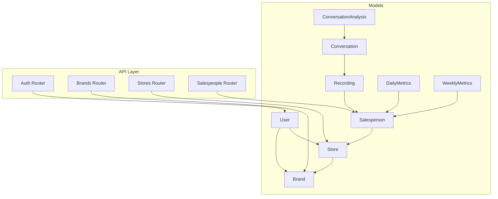
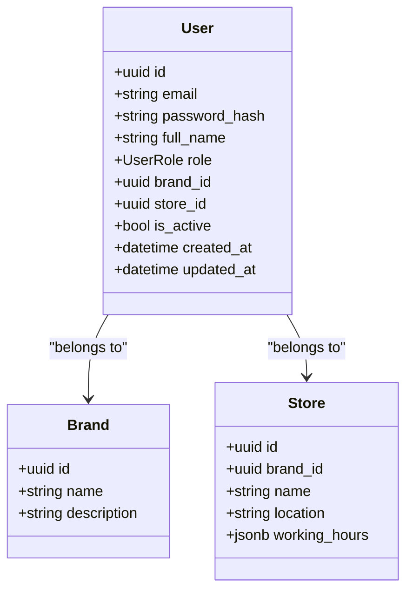
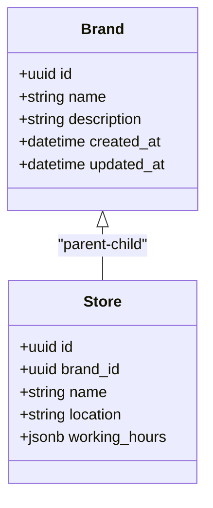
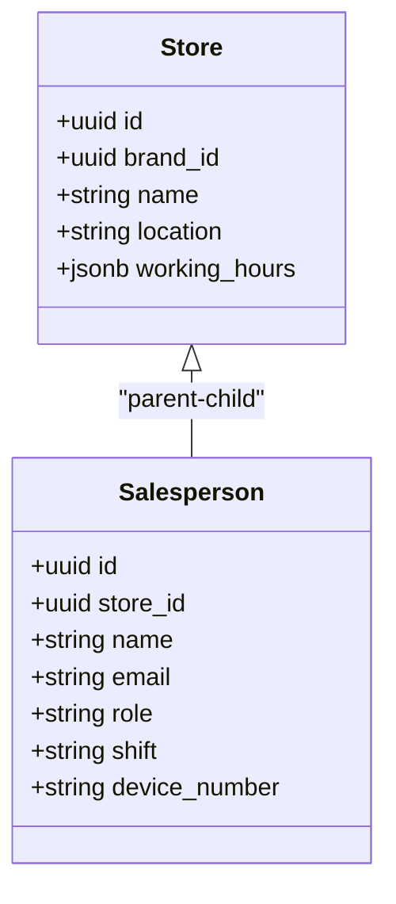
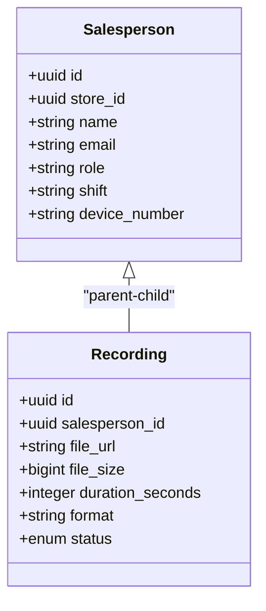
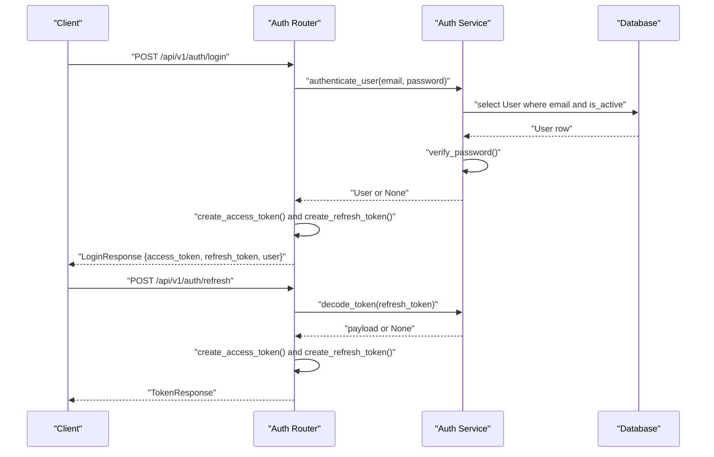
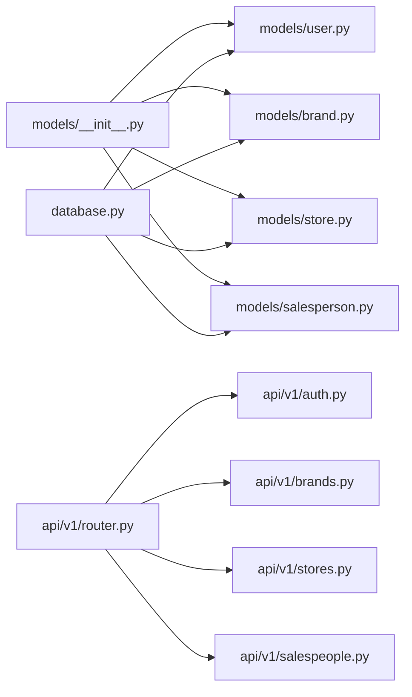

# Core Entities

<cite>
**Referenced Files in This Document**
- [apps/api/src/models/user.py](file://apps/api/src/models/user.py)
- [apps/api/src/models/brand.py](file://apps/api/src/models/brand.py)
- [apps/api/src/models/store.py](file://apps/api/src/models/store.py)
- [apps/api/src/models/salesperson.py](file://apps/api/src/models/salesperson.py)
- [apps/api/src/models/recording.py](file://apps/api/src/models/recording.py)
- [apps/api/src/models/conversation.py](file://apps/api/src/models/conversation.py)
- [apps/api/src/models/metrics.py](file://apps/api/src/models/metrics.py)
- [apps/api/src/models/__init__.py](file://apps/api/src/models/__init__.py)
- [apps/api/src/database.py](file://apps/api/src/database.py)
- [apps/api/src/schemas/brand.py](file://apps/api/src/schemas/brand.py)
- [apps/api/src/schemas/store.py](file://apps/api/src/schemas/store.py)
- [apps/api/src/schemas/salesperson.py](file://apps/api/src/schemas/salesperson.py)
- [apps/api/src/schemas/auth.py](file://apps/api/src/schemas/auth.py)
- [apps/api/src/services/auth.py](file://apps/api/src/services/auth.py)
- [apps/api/src/api/v1/auth.py](file://apps/api/src/api/v1/auth.py)
- [apps/api/src/api/v1/router.py](file://apps/api/src/api/v1/router.py)
</cite>

## Table of Contents
1. [Introduction](#introduction)
2. [Project Structure](#project-structure)
3. [Core Components](#core-components)
4. [Architecture Overview](#architecture-overview)
5. [Detailed Component Analysis](#detailed-component-analysis)
6. [Dependency Analysis](#dependency-analysis)
7. [Performance Considerations](#performance-considerations)
8. [Troubleshooting Guide](#troubleshooting-guide)
9. [Conclusion](#conclusion)
10. [Appendices](#appendices)

## Introduction
This document provides comprehensive data model documentation for the core entity models in the Xsamaa AI Pipeline. It focuses on the User, Brand, Store, and Salesperson entities, detailing their attributes, constraints, relationships, and referential integrity. It also outlines authentication fields, role-based access control, and session/token management. Where applicable, it references related models such as Recording and Conversation to show how core entities connect to downstream analytics and insights.

## Project Structure
The data models are defined under the API application’s SQLAlchemy ORM layer and exposed via FastAPI routes. The models are organized by domain:
- Authentication and user lifecycle: User model and related services/routers
- Organizational hierarchy: Brand and Store models
- Sales operations: Salesperson model and Recording/Conversation models
- Metrics: Daily and Weekly metrics for aggregation



**Diagram sources**
- [apps/api/src/models/user.py:19-47](file://apps/api/src/models/user.py#L19-L47)
- [apps/api/src/models/brand.py:10-25](file://apps/api/src/models/brand.py#L10-L25)
- [apps/api/src/models/store.py:11-31](file://apps/api/src/models/store.py#L11-L31)
- [apps/api/src/models/salesperson.py:10-31](file://apps/api/src/models/salesperson.py#L10-L31)
- [apps/api/src/models/recording.py:24-59](file://apps/api/src/models/recording.py#L24-L59)
- [apps/api/src/models/conversation.py:11-60](file://apps/api/src/models/conversation.py#L11-L60)
- [apps/api/src/models/metrics.py:10-39](file://apps/api/src/models/metrics.py#L10-L39)
- [apps/api/src/api/v1/auth.py:21-81](file://apps/api/src/api/v1/auth.py#L21-L81)
- [apps/api/src/api/v1/router.py:11-19](file://apps/api/src/api/v1/router.py#L11-L19)

**Section sources**
- [apps/api/src/models/__init__.py:1-24](file://apps/api/src/models/__init__.py#L1-L24)
- [apps/api/src/database.py:1-34](file://apps/api/src/database.py#L1-L34)
- [apps/api/src/api/v1/router.py:1-20](file://apps/api/src/api/v1/router.py#L1-L20)

## Core Components
This section documents the four primary entities and their constraints, relationships, and usage patterns.

### User Model
- Purpose: Represents authenticated users with role-based access control and optional organizational associations.
- Primary key: id (UUID)
- Foreign keys:
  - brand_id → brands.id (nullable)
  - store_id → stores.id (nullable)
- Unique constraints:
  - email (enforced at database level)
- Validation rules:
  - email: required, unique
  - full_name: required
  - password_hash: required
  - role: required enum (SUPER_ADMIN, BRAND_ADMIN, STORE_MANAGER, SALESPERSON)
  - is_active: defaults to true
- Relationship mappings:
  - belongs to Brand (optional)
  - belongs to Store (optional)
- Session management:
  - Authentication handled via JWT tokens; login and refresh endpoints manage access/refresh tokens.

**Section sources**
- [apps/api/src/models/user.py:19-47](file://apps/api/src/models/user.py#L19-L47)
- [apps/api/src/schemas/auth.py:4-27](file://apps/api/src/schemas/auth.py#L4-L27)
- [apps/api/src/services/auth.py:44-54](file://apps/api/src/services/auth.py#L44-L54)
- [apps/api/src/api/v1/auth.py:24-48](file://apps/api/src/api/v1/auth.py#L24-L48)

### Brand Model
- Purpose: Represents an organizational brand within which stores operate.
- Primary key: id (UUID)
- Attributes:
  - name: required
  - description: optional
- Relationships:
  - One-to-many with Store (cascade delete-orphan)
  - One-to-many with User (no cascade)
- Referential integrity:
  - Store.brand_id references brands.id (non-nullable)

**Section sources**
- [apps/api/src/models/brand.py:10-25](file://apps/api/src/models/brand.py#L10-L25)
- [apps/api/src/models/store.py:15-27](file://apps/api/src/models/store.py#L15-L27)

### Store Model
- Purpose: Represents a physical or virtual store within a brand, with operational metadata.
- Primary key: id (UUID)
- Foreign keys:
  - brand_id → brands.id (required)
- Attributes:
  - name: required
  - location: optional
  - working_hours: JSONB (optional)
- Relationships:
  - Belongs to Brand (many-to-one)
  - One-to-many with Salesperson (cascade delete-orphan)
  - One-to-many with User (no cascade)
- Referential integrity:
  - Enforced via foreign key constraint on brand_id

**Section sources**
- [apps/api/src/models/store.py:11-31](file://apps/api/src/models/store.py#L11-L31)
- [apps/api/src/models/brand.py:24-25](file://apps/api/src/models/brand.py#L24-L25)

### Salesperson Model
- Purpose: Represents an individual salesperson associated with a store and their performance-related metadata.
- Primary key: id (UUID)
- Foreign keys:
  - store_id → stores.id (required)
- Attributes:
  - name: required
  - email: optional
  - role: optional
  - shift: optional
  - device_number: optional
- Relationships:
  - Belongs to Store (many-to-one)
  - One-to-many with Recording (cascade delete-orphan)
- Referential integrity:
  - Enforced via foreign key constraint on store_id

**Section sources**
- [apps/api/src/models/salesperson.py:10-31](file://apps/api/src/models/salesperson.py#L10-L31)
- [apps/api/src/models/store.py:28-31](file://apps/api/src/models/store.py#L28-L31)

### Related Entities and Their Roles
- Recording: Links audio/video recordings to a Salesperson; supports status tracking and metadata.
- Conversation: Segments a Recording into conversational segments with optional analysis.
- Metrics: Aggregates daily and weekly KPIs keyed by entity (e.g., salesperson).

These entities demonstrate downstream usage of the core entities for analytics and insights.

**Section sources**
- [apps/api/src/models/recording.py:24-59](file://apps/api/src/models/recording.py#L24-L59)
- [apps/api/src/models/conversation.py:11-60](file://apps/api/src/models/conversation.py#L11-L60)
- [apps/api/src/models/metrics.py:10-39](file://apps/api/src/models/metrics.py#L10-L39)

## Architecture Overview
The data model enforces a strict hierarchy:
- Brand hosts multiple Stores
- Store hosts multiple Salespeople
- Salesperson generates Recordings
- Recordings are segmented into Conversations
- Metrics aggregate performance per entity

```mermaid
erDiagram
BRAND {
uuid id PK
string name
string description
}
STORE {
uuid id PK
uuid brand_id FK
string name
string location
jsonb working_hours
}
SALESPERSON {
uuid id PK
uuid store_id FK
string name
string email
string role
string shift
string device_number
}
RECORDING {
uuid id PK
uuid salesperson_id FK
string file_url
bigint file_size
integer duration_seconds
string format
enum status
string error_message
timestamp uploaded_at
timestamp recorded_at
timestamp processed_at
jsonb silence_gaps
}
CONVERSATION {
uuid id PK
uuid recording_id FK
float start_time
float end_time
integer segment_count
text summary
timestamp created_at
}
DAILY_METRICS {
uuid id PK
uuid entity_id
string entity_type
date date
integer conversation_count
float avg_score
float conversion_rate
}
WEEKLY_METRICS {
uuid id PK
uuid entity_id
string entity_type
date week_start
integer conversation_count
float avg_score
float conversion_rate
string top_objection
}
BRAND ||--o{ STORE : "hosts"
STORE ||--o{ SALESPERSON : "employs"
SALESPERSON ||--o{ RECORDING : "generates"
RECORDING ||--o{ CONVERSATION : "segments"
SALESPERSON ||{ DAILY_METRICS : "aggregates"
SALESPERSON ||{ WEEKLY_METRICS : "aggregates"
```

**Diagram sources**
- [apps/api/src/models/brand.py:10-25](file://apps/api/src/models/brand.py#L10-L25)
- [apps/api/src/models/store.py:11-31](file://apps/api/src/models/store.py#L11-L31)
- [apps/api/src/models/salesperson.py:10-31](file://apps/api/src/models/salesperson.py#L10-L31)
- [apps/api/src/models/recording.py:24-59](file://apps/api/src/models/recording.py#L24-L59)
- [apps/api/src/models/conversation.py:11-60](file://apps/api/src/models/conversation.py#L11-L60)
- [apps/api/src/models/metrics.py:10-39](file://apps/api/src/models/metrics.py#L10-L39)

## Detailed Component Analysis

### User Model Analysis
- Role-based access control:
  - UserRole enum defines hierarchical roles used for authorization decisions.
- Authentication fields:
  - email and password_hash support secure login.
- Session management:
  - Access and refresh tokens are generated and validated by services and routers.
- Cascade and referential integrity:
  - Optional brand_id and store_id allow scoping to organizational units without enforcing cascades.



**Diagram sources**
- [apps/api/src/models/user.py:19-47](file://apps/api/src/models/user.py#L19-L47)
- [apps/api/src/models/brand.py:10-25](file://apps/api/src/models/brand.py#L10-L25)
- [apps/api/src/models/store.py:11-31](file://apps/api/src/models/store.py#L11-L31)

**Section sources**
- [apps/api/src/models/user.py:12-47](file://apps/api/src/models/user.py#L12-L47)
- [apps/api/src/schemas/auth.py:4-27](file://apps/api/src/schemas/auth.py#L4-L27)
- [apps/api/src/services/auth.py:44-54](file://apps/api/src/services/auth.py#L44-L54)
- [apps/api/src/api/v1/auth.py:24-48](file://apps/api/src/api/v1/auth.py#L24-L48)

### Brand Model Analysis
- Organizational unit representing a product or corporate brand.
- Cascading deletes for stores ensure clean removal of store hierarchy when a brand is deleted.



**Diagram sources**
- [apps/api/src/models/brand.py:10-25](file://apps/api/src/models/brand.py#L10-L25)
- [apps/api/src/models/store.py:11-31](file://apps/api/src/models/store.py#L11-L31)

**Section sources**
- [apps/api/src/models/brand.py:10-25](file://apps/api/src/models/brand.py#L10-L25)

### Store Model Analysis
- Operational configuration container with optional location and working hours.
- Cascading deletes for salespeople ensure child records are removed when a store is deleted.



**Diagram sources**
- [apps/api/src/models/store.py:11-31](file://apps/api/src/models/store.py#L11-L31)
- [apps/api/src/models/salesperson.py:10-31](file://apps/api/src/models/salesperson.py#L10-L31)

**Section sources**
- [apps/api/src/models/store.py:11-31](file://apps/api/src/models/store.py#L11-L31)

### Salesperson Model Analysis
- Personal and operational metadata for salespeople.
- Cascading deletes for recordings ensure downstream analytics artifacts are cleaned up.



**Diagram sources**
- [apps/api/src/models/salesperson.py:10-31](file://apps/api/src/models/salesperson.py#L10-L31)
- [apps/api/src/models/recording.py:24-59](file://apps/api/src/models/recording.py#L24-L59)

**Section sources**
- [apps/api/src/models/salesperson.py:10-31](file://apps/api/src/models/salesperson.py#L10-L31)

### Authentication and Session Management
- Password hashing and verification are handled by a cryptographic context.
- JWT tokens encode user identity and token type; expiration is enforced.
- Login endpoint validates credentials and returns access/refresh tokens.
- Refresh endpoint regenerates tokens after validating the refresh token.



**Diagram sources**
- [apps/api/src/api/v1/auth.py:24-74](file://apps/api/src/api/v1/auth.py#L24-L74)
- [apps/api/src/services/auth.py:44-54](file://apps/api/src/services/auth.py#L44-L54)

**Section sources**
- [apps/api/src/schemas/auth.py:4-35](file://apps/api/src/schemas/auth.py#L4-L35)
- [apps/api/src/services/auth.py:14-54](file://apps/api/src/services/auth.py#L14-L54)
- [apps/api/src/api/v1/auth.py:24-74](file://apps/api/src/api/v1/auth.py#L24-L74)

## Dependency Analysis
- Model exports are centralized in the models init file, ensuring consistent imports across the application.
- Database session management is configured with async SQLAlchemy, enabling scalable persistence operations.
- API routers aggregate domain-specific routers, routing requests to appropriate handlers.



**Diagram sources**
- [apps/api/src/models/__init__.py:1-24](file://apps/api/src/models/__init__.py#L1-L24)
- [apps/api/src/database.py:1-34](file://apps/api/src/database.py#L1-L34)
- [apps/api/src/api/v1/router.py:1-20](file://apps/api/src/api/v1/router.py#L1-L20)

**Section sources**
- [apps/api/src/models/__init__.py:1-24](file://apps/api/src/models/__init__.py#L1-L24)
- [apps/api/src/database.py:1-34](file://apps/api/src/database.py#L1-L34)
- [apps/api/src/api/v1/router.py:1-20](file://apps/api/src/api/v1/router.py#L1-L20)

## Performance Considerations
- Indexes:
  - Conversations recording_id is indexed to accelerate lookup by recording.
- Cascading:
  - Cascade delete-orphan on Brand→Store and Store→Salesperson ensures referential cleanup without manual traversal.
  - Cascade delete-orphan on Salesperson→Recording keeps analytics artifacts aligned with parent entities.
- JSONB fields:
  - working_hours and JSONB fields in Recording and Conversation enable flexible storage but should be queried carefully to avoid heavy scans.
- Metrics:
  - Daily and Weekly metrics tables use composite unique constraints to prevent duplicates and support efficient aggregation.

[No sources needed since this section provides general guidance]

## Troubleshooting Guide
- Authentication failures:
  - Verify email uniqueness and ensure password hashing matches the cryptographic context.
  - Confirm token decoding and expiration logic aligns with server-side settings.
- Relationship errors:
  - Ensure foreign keys are set consistently (e.g., Store.brand_id, Salesperson.store_id).
  - When deleting parent entities, rely on cascade behaviors to avoid orphaned children.
- Token lifecycle:
  - Use refresh endpoints to renew access tokens; logout is stateless and relies on client-side token discard.

**Section sources**
- [apps/api/src/services/auth.py:44-54](file://apps/api/src/services/auth.py#L44-L54)
- [apps/api/src/api/v1/auth.py:24-74](file://apps/api/src/api/v1/auth.py#L24-L74)
- [apps/api/src/models/store.py:15-31](file://apps/api/src/models/store.py#L15-L31)
- [apps/api/src/models/salesperson.py:14-31](file://apps/api/src/models/salesperson.py#L14-L31)

## Conclusion
The Xsamaa AI Pipeline’s core data model establishes a clear hierarchy from Brand to Store to Salesperson, with Users scoped to organizations and roles. Authentication and session management are built around secure password hashing and JWT tokens. Downstream entities like Recording and Conversation leverage the core models to deliver analytics, while metrics tables provide aggregated insights. Proper use of foreign keys, cascades, and indexes ensures referential integrity and scalability.

[No sources needed since this section summarizes without analyzing specific files]

## Appendices

### Common CRUD Operations and Query Patterns
- Brand
  - Create: POST to brands endpoint with name and optional description.
  - Read: GET by id; List with pagination.
  - Update: PATCH by id; Update name/description.
  - Delete: DELETE by id; expect cascade deletion of stores.
- Store
  - Create: POST to stores endpoint with brand_id, name, optional location/working_hours.
  - Read: GET by id; List filtered by brand_id.
  - Update: PATCH by id; Update name/location/working_hours.
  - Delete: DELETE by id; expect cascade deletion of salespeople.
- Salesperson
  - Create: POST to salespeople endpoint with store_id and personal info.
  - Read: GET by id; List filtered by store_id.
  - Update: PATCH by id; Update personal info.
  - Delete: DELETE by id; expect cascade deletion of recordings.
- User
  - Create: POST to auth/register (conceptual); requires role assignment and optional brand/store linkage.
  - Read: GET by id; List filtered by role/brand/store.
  - Update: PATCH by id; Update profile and role.
  - Delete: DELETE by id; ensure cascades do not remove dependent analytics unless intended.

[No sources needed since this section provides general guidance]