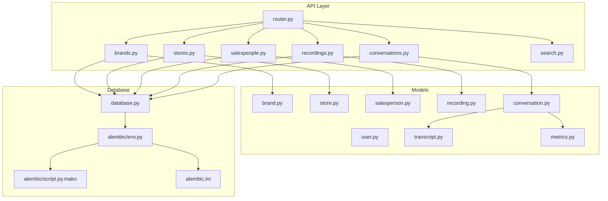
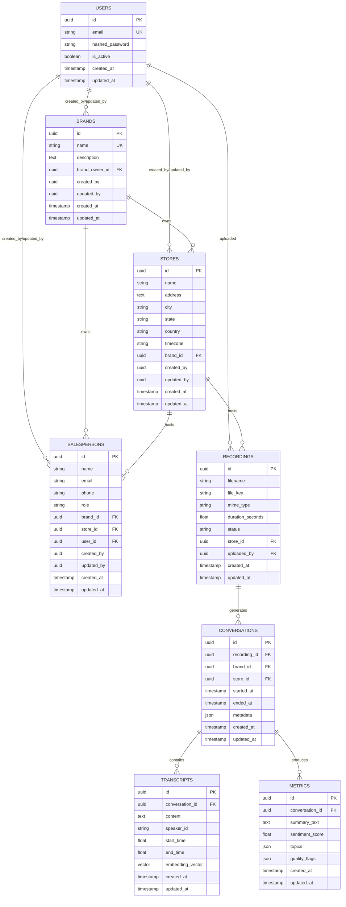
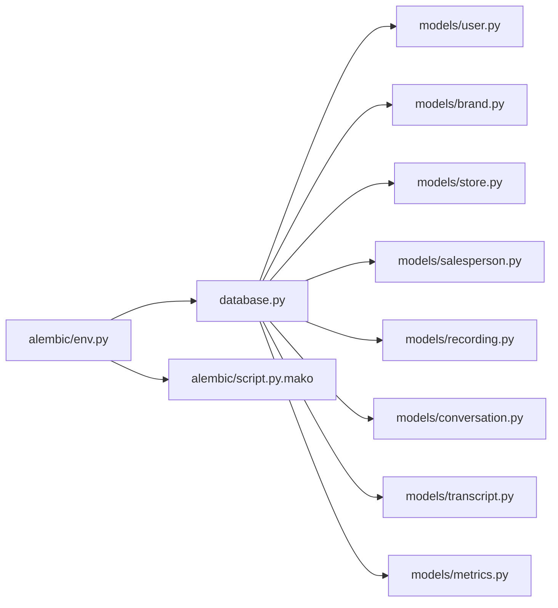

# Data Models & Database Design

<cite>
**Referenced Files in This Document**
- [database.py](file://apps/api/src/database.py)
- [user.py](file://apps/api/src/models/user.py)
- [brand.py](file://apps/api/src/models/brand.py)
- [store.py](file://apps/api/src/models/store.py)
- [salesperson.py](file://apps/api/src/models/salesperson.py)
- [recording.py](file://apps/api/src/models/recording.py)
- [conversation.py](file://apps/api/src/models/conversation.py)
- [transcript.py](file://apps/api/src/models/transcript.py)
- [metrics.py](file://apps/api/src/models/metrics.py)
- [env.py](file://apps/api/alembic/env.py)
- [script.py.mako](file://apps/api/alembic/script.py.mako)
- [alembic.ini](file://apps/api/alembic.ini)
- [router.py](file://apps/api/src/api/v1/router.py)
- [brands.py](file://apps/api/src/api/v1/brands.py)
- [stores.py](file://apps/api/src/api/v1/stores.py)
- [salespeople.py](file://apps/api/src/api/v1/salespeople.py)
- [recordings.py](file://apps/api/src/api/v1/recordings.py)
- [conversations.py](file://apps/api/src/api/v1/conversations.py)
- [search.py](file://apps/api/src/api/v1/search.py)
- [seed.py](file://apps/api/scripts/seed.py)
</cite>

## Table of Contents
1. [Introduction](#introduction)
2. [Project Structure](#project-structure)
3. [Core Components](#core-components)
4. [Architecture Overview](#architecture-overview)
5. [Detailed Component Analysis](#detailed-component-analysis)
6. [Dependency Analysis](#dependency-analysis)
7. [Performance Considerations](#performance-considerations)
8. [Troubleshooting Guide](#troubleshooting-guide)
9. [Conclusion](#conclusion)
10. [Appendices](#appendices)

## Introduction
This document describes the database schema and data models for the Xsamaa AI Pipeline. It covers entity definitions, relationships, constraints, and business rules; documents SQLAlchemy ORM mappings and inheritance patterns; outlines data lifecycle management, soft deletion, and audit trails; and explains Alembic-based migrations and schema evolution. It also includes common query patterns and sample data guidance for each entity.

## Project Structure
The database layer is implemented in Python using SQLAlchemy with Alembic for migrations. Models are defined under apps/api/src/models, with the engine and session configured in apps/api/src/database.py. Alembic configuration resides under apps/api/alembic, and API routes expose CRUD and search endpoints for entities.

**Diagram sources**
- [router.py](file://apps/api/src/api/v1/router.py)
- [brands.py](file://apps/api/src/api/v1/brands.py)
- [stores.py](file://apps/api/src/api/v1/stores.py)
- [salespeople.py](file://apps/api/src/api/v1/salespeople.py)
- [recordings.py](file://apps/api/src/api/v1/recordings.py)
- [conversations.py](file://apps/api/src/api/v1/conversations.py)
- [search.py](file://apps/api/src/api/v1/search.py)
- [user.py](file://apps/api/src/models/user.py)
- [brand.py](file://apps/api/src/models/brand.py)
- [store.py](file://apps/api/src/models/store.py)
- [salesperson.py](file://apps/api/src/models/salesperson.py)
- [recording.py](file://apps/api/src/models/recording.py)
- [conversation.py](file://apps/api/src/models/conversation.py)
- [transcript.py](file://apps/api/src/models/transcript.py)
- [metrics.py](file://apps/api/src/models/metrics.py)
- [database.py](file://apps/api/src/database.py)
- [env.py](file://apps/api/alembic/env.py)
- [script.py.mako](file://apps/api/alembic/script.py.mako)
- [alembic.ini](file://apps/api/alembic.ini)

**Section sources**
- [database.py](file://apps/api/src/database.py)
- [router.py](file://apps/api/src/api/v1/router.py)

## Core Components
This section introduces each entity and its role in the system. Primary keys, foreign keys, indexes, and constraints are documented per entity. Business rules and referential integrity are explained, along with typical queries and sample data guidance.

- Users
  - Purpose: Authentication and authorization for internal users.
  - Primary key: id
  - Typical fields: email, hashed_password, is_active, created_at, updated_at
  - Constraints: Unique email; not null for required fields; timestamps managed via ORM defaults.
  - Queries: Get by email, update profile, soft delete flagging pattern.
  - Sample data: One admin user and several team members.

- Brands
  - Purpose: Logical grouping of stores and salespeople.
  - Primary key: id
  - Foreign keys: brand_owner_id -> users.id (optional ownership linkage)
  - Typical fields: name, description, created_by, updated_by, created_at, updated_at
  - Constraints: Unique name per brand; not null for required fields; audit fields.
  - Queries: List owned brands, filter by owner, paginate.
  - Sample data: Two brands “Alpha” and “Beta”.

- Stores
  - Purpose: Physical or virtual locations where sales occur.
  - Primary key: id
  - Foreign keys: brand_id -> brands.id (required)
  - Typical fields: name, address, city, state, country, timezone, created_by, updated_by, created_at, updated_at
  - Constraints: Not null for required fields; brand_id required; indexes on brand_id for FK join.
  - Queries: List stores by brand, get store with brand details.
  - Sample data: Three stores per brand.

- Salespeople
  - Purpose: Individuals associated with brands and stores.
  - Primary key: id
  - Foreign keys: brand_id -> brands.id (required), store_id -> stores.id (required), user_id -> users.id (optional)
  - Typical fields: name, email, phone, role, created_by, updated_by, created_at, updated_at
  - Constraints: Not null for required fields; brand_id and store_id required; optional user_id for system linkage.
  - Queries: List by brand/store, get by user_id, paginate.
  - Sample data: Five salespeople per store.

- Recordings
  - Purpose: Audio/video assets captured during conversations.
  - Primary key: id
  - Foreign keys: store_id -> stores.id (required), uploaded_by -> users.id (required)
  - Typical fields: filename, file_key, mime_type, duration_seconds, status, created_at, updated_at
  - Constraints: Not null for required fields; status enum-like constraint enforced via application logic; indexes on store_id and uploaded_by.
  - Queries: List by store, filter by status, pagination.
  - Sample data: Ten recordings per store.

- Conversations
  - Purpose: Logical sessions linking recordings to transcripts and metrics.
  - Primary key: id
  - Foreign keys: recording_id -> recordings.id (required), brand_id -> brands.id (required), store_id -> stores.id (required)
  - Typical fields: started_at, ended_at, metadata, created_at, updated_at
  - Constraints: Not null for required fields; timestamps validated by business rules; indexes on recording_id, brand_id, store_id.
  - Queries: List by recording, brand, store; filter by time range.
  - Sample data: One conversation per recording initially.

- Transcripts
  - Purpose: Transcribed text segments with speaker diarization and embeddings.
  - Primary key: id
  - Foreign keys: conversation_id -> conversations.id (required)
  - Typical fields: content, speaker_id, start_time, end_time, embedding_vector, created_at, updated_at
  - Constraints: Not null for required fields; embedding_vector stored as vector type; indexes on conversation_id and speaker_id.
  - Queries: List by conversation, filter by speaker, paginate.
  - Sample data: Hundreds of segments per conversation.

- Metrics
  - Purpose: AI-derived insights and KPIs for coaching and analytics.
  - Primary key: id
  - Foreign keys: conversation_id -> conversations.id (required)
  - Typical fields: summary_text, sentiment_score, topics, quality_flags, created_at, updated_at
  - Constraints: Not null for required fields; JSON-like fields for topics and flags; indexes on conversation_id.
  - Queries: Get latest metrics per conversation, filter by quality flags.
  - Sample data: Single metrics record per conversation.

**Section sources**
- [user.py](file://apps/api/src/models/user.py)
- [brand.py](file://apps/api/src/models/brand.py)
- [store.py](file://apps/api/src/models/store.py)
- [salesperson.py](file://apps/api/src/models/salesperson.py)
- [recording.py](file://apps/api/src/models/recording.py)
- [conversation.py](file://apps/api/src/models/conversation.py)
- [transcript.py](file://apps/api/src/models/transcript.py)
- [metrics.py](file://apps/api/src/models/metrics.py)

## Architecture Overview
The data model follows a normalized relational schema with explicit foreign keys and indexes. Entities are mapped via SQLAlchemy declarative base. Relationships are configured with cascade and passive deletes to maintain referential integrity. Alembic manages schema evolution with autogenerate and custom revision scripts.

**Diagram sources**
- [user.py](file://apps/api/src/models/user.py)
- [brand.py](file://apps/api/src/models/brand.py)
- [store.py](file://apps/api/src/models/store.py)
- [salesperson.py](file://apps/api/src/models/salesperson.py)
- [recording.py](file://apps/api/src/models/recording.py)
- [conversation.py](file://apps/api/src/models/conversation.py)
- [transcript.py](file://apps/api/src/models/transcript.py)
- [metrics.py](file://apps/api/src/models/metrics.py)

## Detailed Component Analysis

### Users
- Purpose: Authentication and authorization backbone.
- Primary key: id
- Constraints: Unique email; not null fields; timestamps.
- ORM: Declarative base; default timestamps; optional soft delete pattern via is_active flag.
- Queries: By email, update profile, list active users.
- Sample data: Admin and team users.

**Section sources**
- [user.py](file://apps/api/src/models/user.py)

### Brands
- Purpose: Top-level organizational unit.
- Primary key: id
- Foreign keys: brand_owner_id -> users.id (optional)
- Constraints: Unique name; not null fields; audit fields.
- ORM: Relationship to stores and salespeople via brand_id.
- Queries: Owned brands, paginated list.
- Sample data: Alpha, Beta.

**Section sources**
- [brand.py](file://apps/api/src/models/brand.py)

### Stores
- Purpose: Locations tied to brands.
- Primary key: id
- Foreign keys: brand_id -> brands.id
- Constraints: Not null fields; brand_id required; indexes on brand_id.
- ORM: Relationship to salespeople and recordings.
- Queries: List by brand, store details.
- Sample data: Three stores per brand.

**Section sources**
- [store.py](file://apps/api/src/models/store.py)

### Salespeople
- Purpose: Individuals linked to brands and stores.
- Primary key: id
- Foreign keys: brand_id -> brands.id, store_id -> stores.id, user_id -> users.id (optional)
- Constraints: Required brand_id and store_id; optional user_id; not null fields.
- ORM: Relationships to brand, store, and optional user.
- Queries: By brand/store, by user_id.
- Sample data: Five per store.

**Section sources**
- [salesperson.py](file://apps/api/src/models/salesperson.py)

### Recordings
- Purpose: Media assets generated from conversations.
- Primary key: id
- Foreign keys: store_id -> stores.id, uploaded_by -> users.id
- Constraints: Not null fields; status constrained; indexes on store_id and uploaded_by.
- ORM: Relationship to conversations.
- Queries: By store, by status, pagination.
- Sample data: Ten per store.

**Section sources**
- [recording.py](file://apps/api/src/models/recording.py)

### Conversations
- Purpose: Logical sessions connecting recordings to transcripts and metrics.
- Primary key: id
- Foreign keys: recording_id -> recordings.id, brand_id -> brands.id, store_id -> stores.id
- Constraints: Not null fields; timestamps validated; indexes on FKs.
- ORM: Relationships to transcripts and metrics.
- Queries: By recording, brand, store, time range.
- Sample data: One per recording.

**Section sources**
- [conversation.py](file://apps/api/src/models/conversation.py)

### Transcripts
- Purpose: Segment-level transcriptions with speaker info and embeddings.
- Primary key: id
- Foreign keys: conversation_id -> conversations.id
- Constraints: Not null fields; embedding_vector type; indexes on conversation_id and speaker_id.
- ORM: Relationship to conversations.
- Queries: By conversation, by speaker, paginated.
- Sample data: Hundreds per conversation.

**Section sources**
- [transcript.py](file://apps/api/src/models/transcript.py)

### Metrics
- Purpose: AI-generated insights and KPIs.
- Primary key: id
- Foreign keys: conversation_id -> conversations.id
- Constraints: Not null fields; JSON-like fields; indexes on conversation_id.
- ORM: Relationship to conversations.
- Queries: Latest per conversation, filtered by quality flags.
- Sample data: One per conversation.

**Section sources**
- [metrics.py](file://apps/api/src/models/metrics.py)

### API Endpoints and Data Access Patterns
- Router aggregates all v1 endpoints.
- Brands, stores, salespeople, recordings, and conversations expose CRUD and search endpoints.
- Search endpoint supports filtering and pagination across entities.

**Section sources**
- [router.py](file://apps/api/src/api/v1/router.py)
- [brands.py](file://apps/api/src/api/v1/brands.py)
- [stores.py](file://apps/api/src/api/v1/stores.py)
- [salespeople.py](file://apps/api/src/api/v1/salespeople.py)
- [recordings.py](file://apps/api/src/api/v1/recordings.py)
- [conversations.py](file://apps/api/src/api/v1/conversations.py)
- [search.py](file://apps/api/src/api/v1/search.py)

## Dependency Analysis
The models depend on a shared declarative base and SQLAlchemy constructs. Relationships enforce referential integrity with cascade and passive deletes. Alembic env.py loads the metadata and targets the current models for autogenerate.

**Diagram sources**
- [database.py](file://apps/api/src/database.py)
- [env.py](file://apps/api/alembic/env.py)
- [script.py.mako](file://apps/api/alembic/script.py.mako)
- [user.py](file://apps/api/src/models/user.py)
- [brand.py](file://apps/api/src/models/brand.py)
- [store.py](file://apps/api/src/models/store.py)
- [salesperson.py](file://apps/api/src/models/salesperson.py)
- [recording.py](file://apps/api/src/models/recording.py)
- [conversation.py](file://apps/api/src/models/conversation.py)
- [transcript.py](file://apps/api/src/models/transcript.py)
- [metrics.py](file://apps/api/src/models/metrics.py)

**Section sources**
- [database.py](file://apps/api/src/database.py)
- [env.py](file://apps/api/alembic/env.py)

## Performance Considerations
- Indexes: Add indexes on foreign keys frequently used in joins and filters (brand_id, store_id, recording_id, uploaded_by, conversation_id).
- Vector storage: embedding_vector column requires appropriate vector indexing strategy depending on backend.
- Pagination: Always use limit/offset or cursor-based pagination for large lists.
- Soft delete: Prefer is_active flag on users; avoid full row deletion to preserve audit history.
- Batch operations: Use bulk inserts/updates for seeding and ETL-like tasks.

[No sources needed since this section provides general guidance]

## Troubleshooting Guide
- Migration conflicts: Run alembic current and compare with expected head; resolve by merging or stamping heads appropriately.
- Autogenerate mismatches: Review env.py target_metadata and ensure all models are imported before autogenerate runs.
- Integrity errors: Verify foreign keys and constraints; check that parent records exist before creating children.
- Audit trail gaps: Confirm created_by/updated_by fields are populated consistently across services.

**Section sources**
- [env.py](file://apps/api/alembic/env.py)
- [alembic.ini](file://apps/api/alembic.ini)

## Conclusion
The Xsamaa AI Pipeline employs a clean, normalized relational schema with explicit foreign keys and indexes. SQLAlchemy ORM models define clear relationships and constraints, while Alembic enables controlled schema evolution. The design supports robust data lifecycle management, auditability, and scalable querying patterns.

[No sources needed since this section summarizes without analyzing specific files]

## Appendices

### Database Lifecycle Management
- Creation: Initialize database and apply migrations.
- Seeding: Use seed script to populate initial data for users, brands, stores, and salespeople.
- Maintenance: Regularly review indexes, monitor vector index performance, and keep migrations up to date.

**Section sources**
- [seed.py](file://apps/api/scripts/seed.py)

### Sample Data Guidance
- Users: Admin and team members with unique emails.
- Brands: Two distinct brand names.
- Stores: Three stores per brand with address and timezone.
- Salespeople: Five individuals per store with roles.
- Recordings: Ten media assets per store with status and metadata.
- Conversations: One per recording with timestamps and metadata.
- Transcripts: Hundreds of segments per conversation with speaker timestamps.
- Metrics: One summary per conversation with sentiment and topics.

[No sources needed since this section provides general guidance]

### Common Query Patterns
- List brands by owner: Filter brands by brand_owner_id.
- List stores by brand: Join brands and stores on brand_id.
- List salespeople by store: Join stores and salespeople on store_id.
- List recordings by store: Join stores and recordings on store_id.
- List transcripts by conversation: Join conversations and transcripts on conversation_id.
- Get latest metrics: Order by created_at desc and limit to 1 per conversation.

[No sources needed since this section provides general guidance]