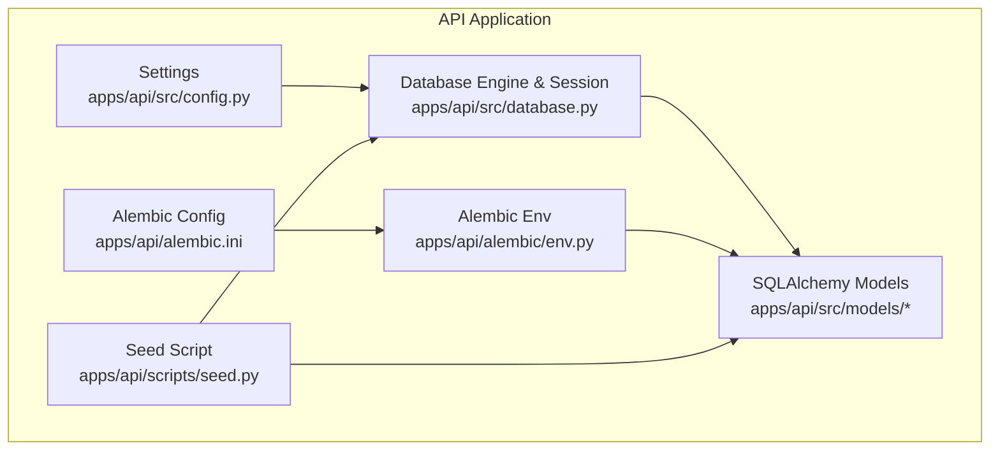
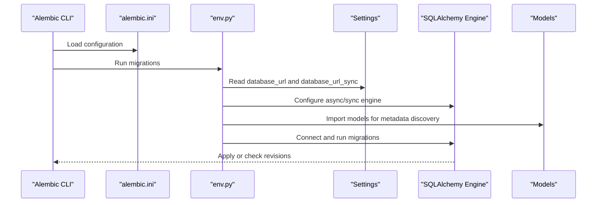
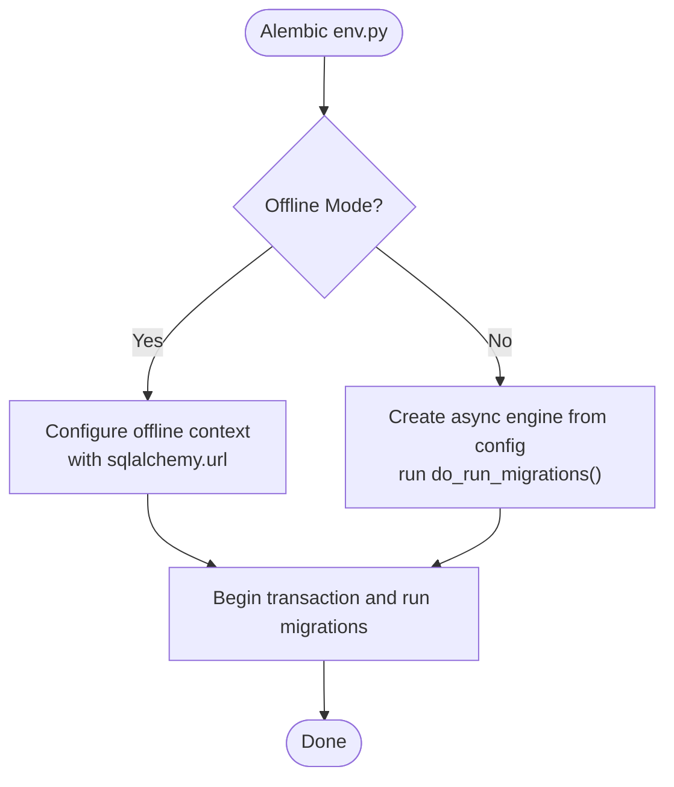
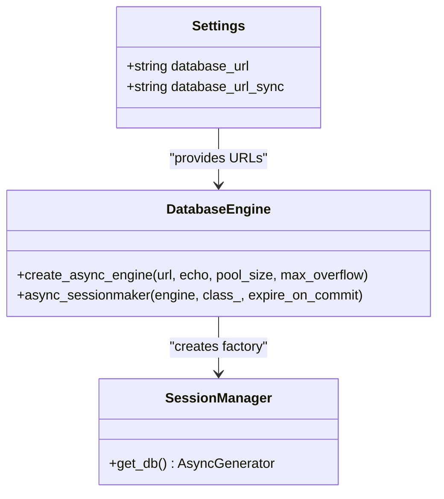
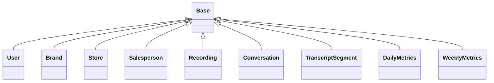
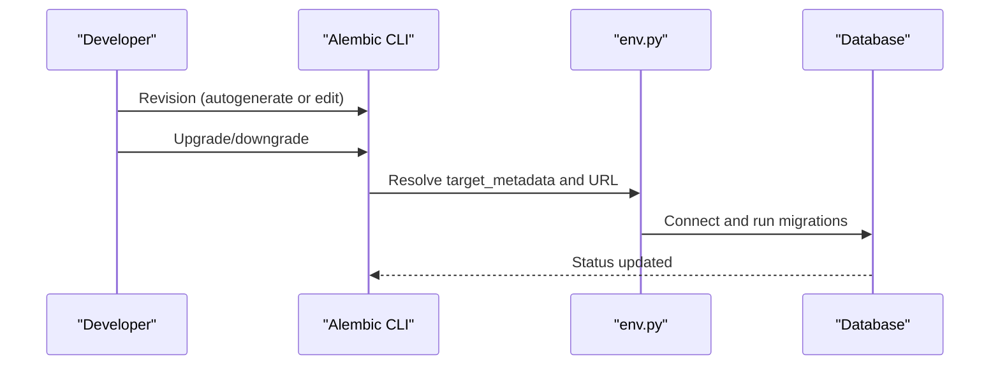
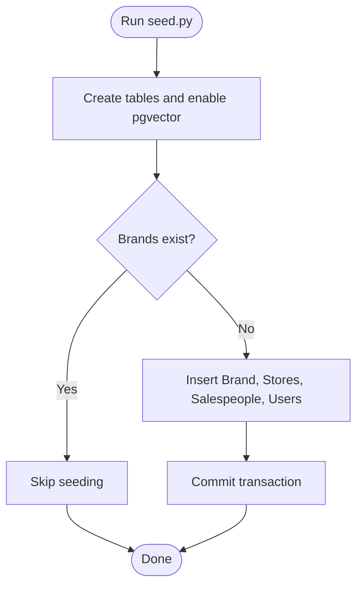
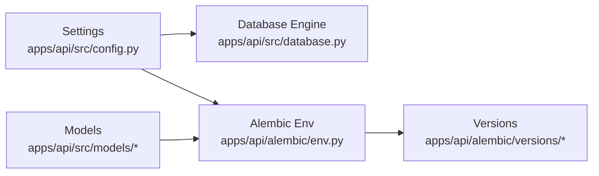

# Database Operations and Migrations

<cite>
**Referenced Files in This Document**
- [apps/api/src/config.py](file://apps/api/src/config.py)
- [apps/api/src/database.py](file://apps/api/src/database.py)
- [apps/api/alembic/env.py](file://apps/api/alembic/env.py)
- [apps/api/alembic.ini](file://apps/api/alembic.ini)
- [apps/api/scripts/seed.py](file://apps/api/scripts/seed.py)
- [apps/api/src/models/__init__.py](file://apps/api/src/models/__init__.py)
- [apps/api/src/models/user.py](file://apps/api/src/models/user.py)
- [apps/api/src/models/brand.py](file://apps/api/src/models/brand.py)
- [apps/api/src/models/store.py](file://apps/api/src/models/store.py)
- [apps/api/src/models/salesperson.py](file://apps/api/src/models/salesperson.py)
- [apps/api/src/models/recording.py](file://apps/api/src/models/recording.py)
- [apps/api/src/models/conversation.py](file://apps/api/src/models/conversation.py)
- [apps/api/src/models/transcript.py](file://apps/api/src/models/transcript.py)
- [apps/api/src/models/metrics.py](file://apps/api/src/models/metrics.py)
</cite>

## Table of Contents
1. [Introduction](#introduction)
2. [Project Structure](#project-structure)
3. [Core Components](#core-components)
4. [Architecture Overview](#architecture-overview)
5. [Detailed Component Analysis](#detailed-component-analysis)
6. [Dependency Analysis](#dependency-analysis)
7. [Performance Considerations](#performance-considerations)
8. [Troubleshooting Guide](#troubleshooting-guide)
9. [Conclusion](#conclusion)
10. [Appendices](#appendices)

## Introduction
This document explains database operations and migration management in the Xsamaa AI Pipeline API service. It covers Alembic configuration, database connection settings, migration repository structure, and version control strategies. It also documents the migration workflow from schema changes to database updates, dependency management, rollback procedures, and the relationship between SQLAlchemy models and Alembic revisions. Guidance is included for automatic migration generation, manual customization, database initialization, seed data loading, environment-specific configuration, best practices for schema evolution and production deployments, and troubleshooting common migration issues.

## Project Structure
The database and migrations are centered under the API application:
- Alembic configuration and runtime environment live under apps/api/alembic/.
- Application settings and database engine/session are defined under apps/api/src/.
- SQLAlchemy models are defined under apps/api/src/models/.
- Seed script for initializing and seeding the database is under apps/api/scripts/.

**Diagram sources**
- [apps/api/src/config.py:1-52](file://apps/api/src/config.py#L1-L52)
- [apps/api/src/database.py:1-34](file://apps/api/src/database.py#L1-L34)
- [apps/api/alembic.ini:1-151](file://apps/api/alembic.ini#L1-L151)
- [apps/api/alembic/env.py:1-73](file://apps/api/alembic/env.py#L1-L73)
- [apps/api/scripts/seed.py:1-121](file://apps/api/scripts/seed.py#L1-L121)

**Section sources**
- [apps/api/src/config.py:1-52](file://apps/api/src/config.py#L1-L52)
- [apps/api/src/database.py:1-34](file://apps/api/src/database.py#L1-L34)
- [apps/api/alembic.ini:1-151](file://apps/api/alembic.ini#L1-L151)
- [apps/api/alembic/env.py:1-73](file://apps/api/alembic/env.py#L1-L73)
- [apps/api/scripts/seed.py:1-121](file://apps/api/scripts/seed.py#L1-L121)

## Core Components
- Settings and database URLs:
  - Asynchronous and synchronous database URLs are defined in settings and consumed by the engine and Alembic respectively.
- Database engine and session:
  - An asynchronous SQLAlchemy engine and async session factory are configured with connection pooling parameters.
  - A scoped async generator provides sessions with automatic commit/rollback semantics.
- Alembic configuration:
  - Alembic reads script_location and logging from alembic.ini.
  - env.py sets the SQLAlchemy URL dynamically from settings and imports all models to ensure detection.
- Models:
  - SQLAlchemy declarative base is used across models; relationships and indexes are defined consistently.
- Seed script:
  - Creates tables, enables the pgvector extension, and seeds initial data if the brands table is empty.

**Section sources**
- [apps/api/src/config.py:11-14](file://apps/api/src/config.py#L11-L14)
- [apps/api/src/database.py:8-19](file://apps/api/src/database.py#L8-L19)
- [apps/api/src/database.py:26-34](file://apps/api/src/database.py#L26-L34)
- [apps/api/alembic.ini:8](file://apps/api/alembic.ini#L8)
- [apps/api/alembic/env.py:27](file://apps/api/alembic/env.py#L27)
- [apps/api/alembic/env.py:29](file://apps/api/alembic/env.py#L29)
- [apps/api/scripts/seed.py:21-27](file://apps/api/scripts/seed.py#L21-L27)
- [apps/api/scripts/seed.py:28-107](file://apps/api/scripts/seed.py#L28-L107)

## Architecture Overview
The migration architecture integrates application settings, SQLAlchemy models, and Alembic runtime. The flow supports offline and online modes, with dynamic URL resolution and model discovery.

**Diagram sources**
- [apps/api/alembic.ini:8](file://apps/api/alembic.ini#L8)
- [apps/api/alembic/env.py:29](file://apps/api/alembic/env.py#L29)
- [apps/api/alembic/env.py:53-62](file://apps/api/alembic/env.py#L53-L62)
- [apps/api/src/config.py:11-14](file://apps/api/src/config.py#L11-L14)
- [apps/api/src/models/__init__.py:1-24](file://apps/api/src/models/__init__.py#L1-L24)

## Detailed Component Analysis

### Alembic Configuration and Environment
- Configuration file:
  - script_location points to the alembic directory.
  - prepend_sys_path allows importing application modules.
  - Logging is configured via loggers and handlers.
- Environment runtime:
  - Imports all models to ensure Alembic detects them.
  - Sets the SQLAlchemy URL from settings.database_url_sync for offline mode and settings.database_url for online mode.
  - Supports offline and online migration execution paths.

**Diagram sources**
- [apps/api/alembic/env.py:32-49](file://apps/api/alembic/env.py#L32-L49)
- [apps/api/alembic/env.py:52-67](file://apps/api/alembic/env.py#L52-L67)

**Section sources**
- [apps/api/alembic.ini:8](file://apps/api/alembic.ini#L8)
- [apps/api/alembic.ini:21](file://apps/api/alembic.ini#L21)
- [apps/api/alembic.ini:118-151](file://apps/api/alembic.ini#L118-L151)
- [apps/api/alembic/env.py:12-21](file://apps/api/alembic/env.py#L12-L21)
- [apps/api/alembic/env.py:27-30](file://apps/api/alembic/env.py#L27-L30)
- [apps/api/alembic/env.py:65-73](file://apps/api/alembic/env.py#L65-L73)

### Database Connection Settings and Engine
- Settings:
  - database_url: asynchronous PostgreSQL URL used by the application and Alembic online mode.
  - database_url_sync: synchronous PostgreSQL URL used by Alembic offline mode.
- Engine and session:
  - Asynchronous engine configured with pool_size and max_overflow.
  - Async session factory with expire_on_commit disabled.
  - get_db provides a context manager that commits on success and rolls back on exceptions.

**Diagram sources**
- [apps/api/src/config.py:11-14](file://apps/api/src/config.py#L11-L14)
- [apps/api/src/database.py:8-19](file://apps/api/src/database.py#L8-L19)
- [apps/api/src/database.py:26-34](file://apps/api/src/database.py#L26-L34)

**Section sources**
- [apps/api/src/config.py:11-14](file://apps/api/src/config.py#L11-L14)
- [apps/api/src/database.py:8-19](file://apps/api/src/database.py#L8-L19)
- [apps/api/src/database.py:26-34](file://apps/api/src/database.py#L26-L34)

### SQLAlchemy Models and Metadata Discovery
- Base class:
  - Declarative base used across models.
- Model imports:
  - env.py imports all models to ensure Alembic’s target_metadata includes them.
- Model coverage:
  - Users, Brands, Stores, Salespeople, Recordings, Conversations, Transcript segments, and Metrics are defined with relationships and indexes.

**Diagram sources**
- [apps/api/src/database.py:22-23](file://apps/api/src/database.py#L22-L23)
- [apps/api/alembic/env.py:12-21](file://apps/api/alembic/env.py#L12-L21)
- [apps/api/src/models/user.py:19-48](file://apps/api/src/models/user.py#L19-L48)
- [apps/api/src/models/brand.py:10-26](file://apps/api/src/models/brand.py#L10-L26)
- [apps/api/src/models/store.py:11-32](file://apps/api/src/models/store.py#L11-L32)
- [apps/api/src/models/salesperson.py:10-32](file://apps/api/src/models/salesperson.py#L10-L32)
- [apps/api/src/models/recording.py:24-60](file://apps/api/src/models/recording.py#L24-L60)
- [apps/api/src/models/conversation.py:11-61](file://apps/api/src/models/conversation.py#L11-L61)
- [apps/api/src/models/transcript.py:10-27](file://apps/api/src/models/transcript.py#L10-L27)
- [apps/api/src/models/metrics.py:10-39](file://apps/api/src/models/metrics.py#L10-L39)

**Section sources**
- [apps/api/src/database.py:22-23](file://apps/api/src/database.py#L22-L23)
- [apps/api/alembic/env.py:12-21](file://apps/api/alembic/env.py#L12-L21)
- [apps/api/src/models/__init__.py:1-24](file://apps/api/src/models/__init__.py#L1-L24)

### Migration Workflow: From Schema Changes to Database Updates
- Detecting models:
  - env.py imports models to populate target_metadata for Alembic.
- Running migrations:
  - Offline mode uses the configured sqlalchemy.url.
  - Online mode creates an async engine from settings and runs migrations synchronously inside an async context.
- Version locations:
  - The versions directory is used for stored revision files.

**Diagram sources**
- [apps/api/alembic/env.py:27-30](file://apps/api/alembic/env.py#L27-L30)
- [apps/api/alembic/env.py:52-67](file://apps/api/alembic/env.py#L52-L67)

**Section sources**
- [apps/api/alembic/env.py:27-30](file://apps/api/alembic/env.py#L27-L30)
- [apps/api/alembic/env.py:52-67](file://apps/api/alembic/env.py#L52-L67)
- [apps/api/alembic.ini:8](file://apps/api/alembic.ini#L8)

### Automatic vs Manual Migration Generation
- Autogenerate:
  - Alembic can compare the target_metadata with the database to produce revision scripts.
- Manual customization:
  - Revision scripts can be edited after generation to refine operations, add constraints, or handle complex data transformations.
- Post-write hooks:
  - Optional formatters or linters can be integrated via post_write_hooks.

**Section sources**
- [apps/api/alembic.ini:10-16](file://apps/api/alembic.ini#L10-L16)
- [apps/api/alembic.ini:93-115](file://apps/api/alembic.ini#L93-L115)

### Rollback Procedures
- Downgrade:
  - Alembic downgrade commands move to previous revisions.
- Safety:
  - Use explicit revision identifiers and test rollbacks in staging environments.
- Data safety:
  - Prefer reversible operations and backup before production rollbacks.

[No sources needed since this section provides general guidance]

### Database Initialization and Seed Data Loading
- Initialization:
  - The seed script creates tables and enables the pgvector extension.
- Seeding:
  - Seeds a Brand, two Stores, three Salespeople, and multiple Users with hashed passwords.
- Conditional seeding:
  - Skips seeding if brands already exist.

**Diagram sources**
- [apps/api/scripts/seed.py:21-27](file://apps/api/scripts/seed.py#L21-L27)
- [apps/api/scripts/seed.py:28-107](file://apps/api/scripts/seed.py#L28-L107)

**Section sources**
- [apps/api/scripts/seed.py:21-27](file://apps/api/scripts/seed.py#L21-L27)
- [apps/api/scripts/seed.py:28-107](file://apps/api/scripts/seed.py#L28-L107)

### Environment-Specific Configuration Management
- Settings:
  - database_url and database_url_sync define the connection strings for async and sync contexts.
  - Additional environment controls include app_env, app_debug, and CORS origins.
- Environment files:
  - Settings load from .env via pydantic-settings.

**Section sources**
- [apps/api/src/config.py:11-14](file://apps/api/src/config.py#L11-L14)
- [apps/api/src/config.py:38-48](file://apps/api/src/config.py#L38-L48)

### Best Practices for Schema Evolution and Production Deployment
- Keep migrations reversible where possible.
- Test migrations in staging with backups.
- Use explicit revision identifiers for rollbacks.
- Avoid long-running transactions in migrations.
- Add indexes and constraints explicitly in migrations.
- Document breaking changes and deprecations.

[No sources needed since this section provides general guidance]

## Dependency Analysis
The following diagram shows how Alembic depends on settings and models, and how the application database layer depends on settings.

**Diagram sources**
- [apps/api/src/config.py:11-14](file://apps/api/src/config.py#L11-L14)
- [apps/api/src/database.py:8-19](file://apps/api/src/database.py#L8-L19)
- [apps/api/alembic/env.py:12-21](file://apps/api/alembic/env.py#L12-L21)
- [apps/api/alembic/env.py:27-30](file://apps/api/alembic/env.py#L27-L30)

**Section sources**
- [apps/api/src/config.py:11-14](file://apps/api/src/config.py#L11-L14)
- [apps/api/src/database.py:8-19](file://apps/api/src/database.py#L8-L19)
- [apps/api/alembic/env.py:12-21](file://apps/api/alembic/env.py#L12-L21)
- [apps/api/alembic/env.py:27-30](file://apps/api/alembic/env.py#L27-L30)

## Performance Considerations
- Connection pooling:
  - Tune pool_size and max_overflow according to workload.
- Asynchronous operations:
  - Use async sessions for I/O-bound workloads.
- Indexes and constraints:
  - Add appropriate indexes and unique constraints to reduce query times.
- Migration performance:
  - Batch DDL statements and avoid long-running migrations.

[No sources needed since this section provides general guidance]

## Troubleshooting Guide
- Migration fails due to missing pgvector:
  - Ensure the seed script runs to enable the extension before creating dependent tables.
- Database locking during migrations:
  - Avoid concurrent migrations; coordinate with CI/CD pipelines.
  - Use downtime windows for destructive changes.
- Rollback issues:
  - Verify the presence of a downgrade script; if missing, recreate a reversible migration.
- Environment mismatch:
  - Confirm database_url and database_url_sync match the target environment.
- Alembic cannot detect models:
  - Ensure all model modules are imported in env.py.

**Section sources**
- [apps/api/scripts/seed.py:25-27](file://apps/api/scripts/seed.py#L25-L27)
- [apps/api/alembic/env.py:12-21](file://apps/api/alembic/env.py#L12-L21)

## Conclusion
The Xsamaa AI Pipeline leverages Alembic with dynamic URL resolution and explicit model imports to manage database migrations. The asynchronous SQLAlchemy engine and session factory integrate cleanly with the application, while the seed script provides a safe initialization routine. Following the recommended practices ensures robust schema evolution and reliable production deployments.

## Appendices

### Typical Migration Patterns
- Adding a column with a default:
  - Use alter_column with server_default.
- Creating a new table with foreign keys:
  - Define the table and relationships; add indexes as needed.
- Renaming a column:
  - Use op.alter_column with existing_name/new_name; consider data preservation steps.
- Dropping a table:
  - Ensure referential integrity is handled; cascade deletes if appropriate.

[No sources needed since this section provides general guidance]

### Database Maintenance Operations
- Vacuum/analyze:
  - Regular maintenance improves query performance.
- Backup and restore:
  - Use logical backups for development and point-in-time recovery for production.
- Monitoring:
  - Track slow queries and long-running transactions.

[No sources needed since this section provides general guidance]