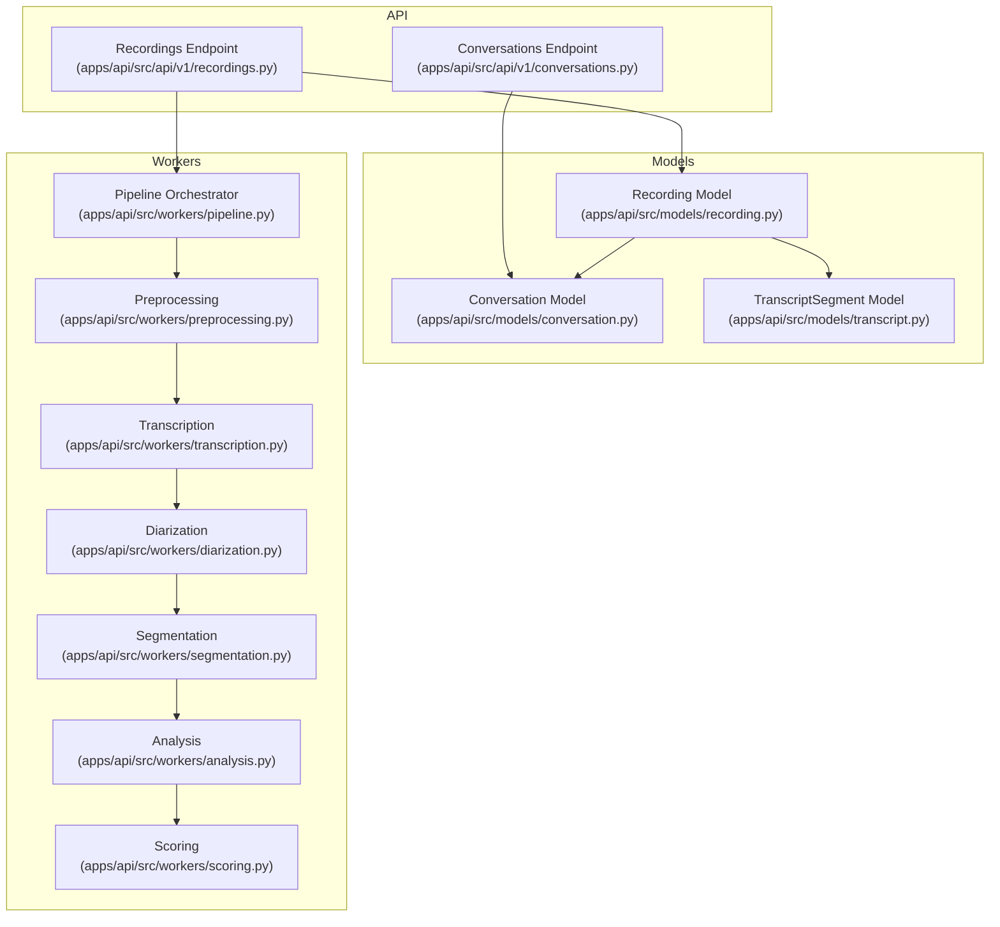
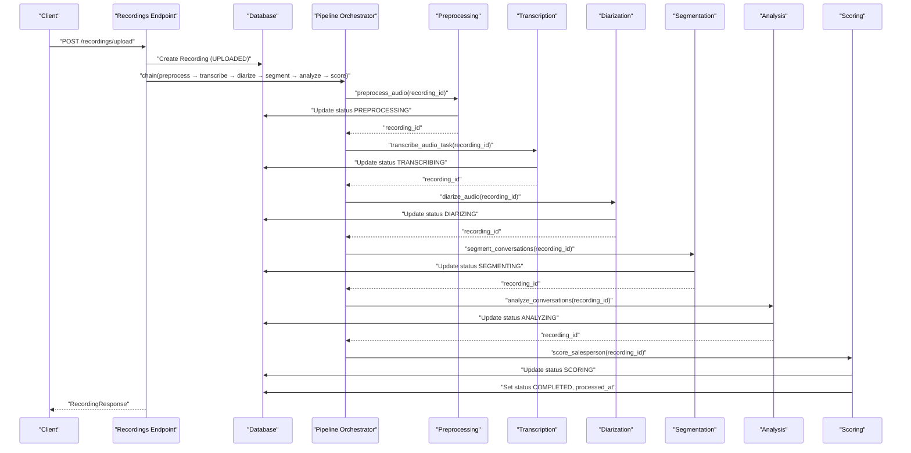
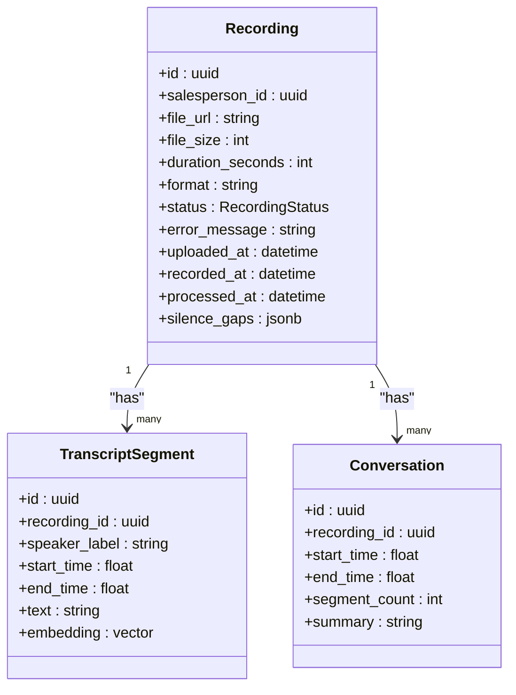
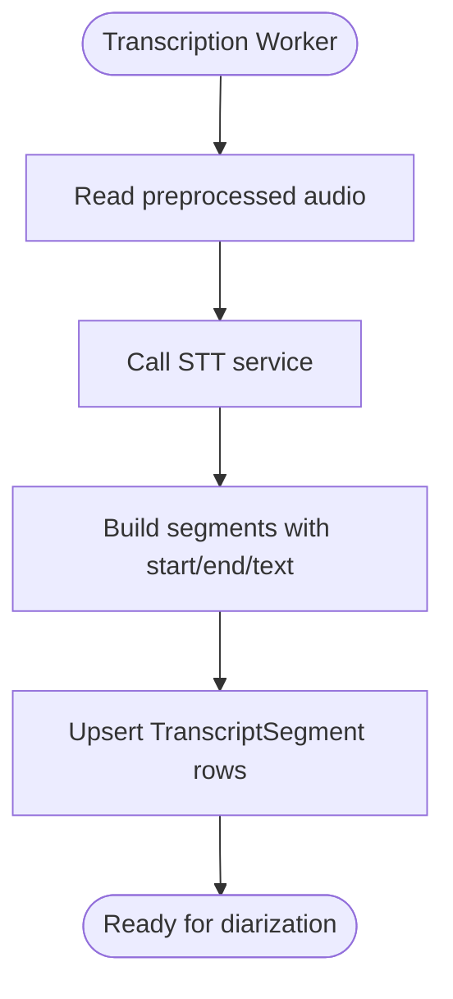
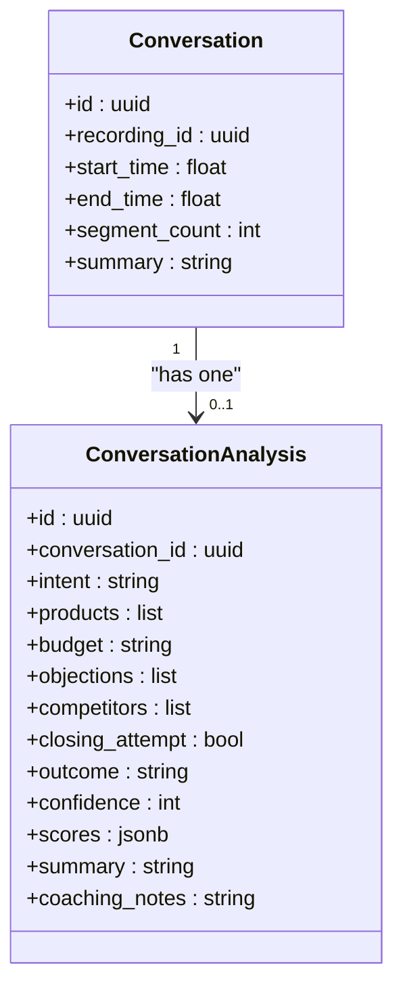
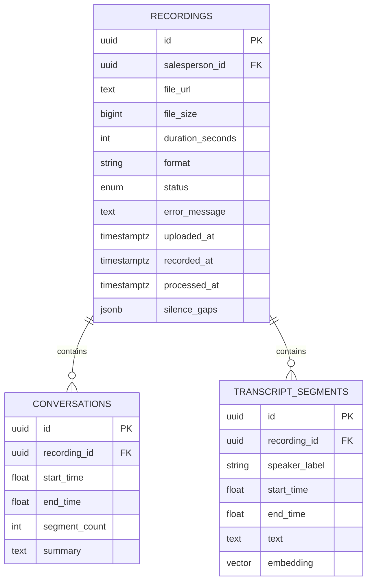
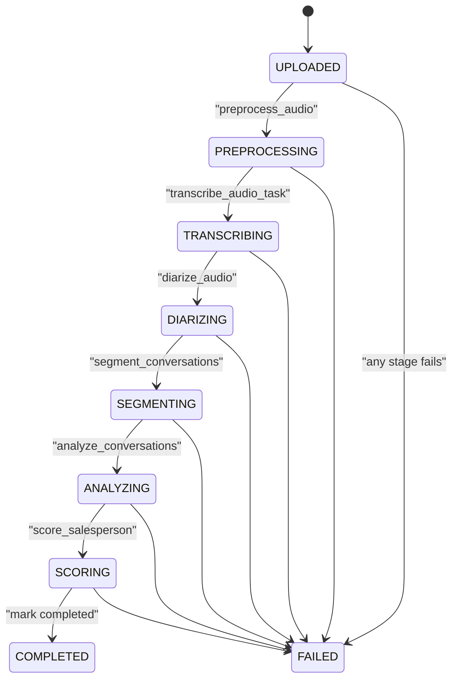
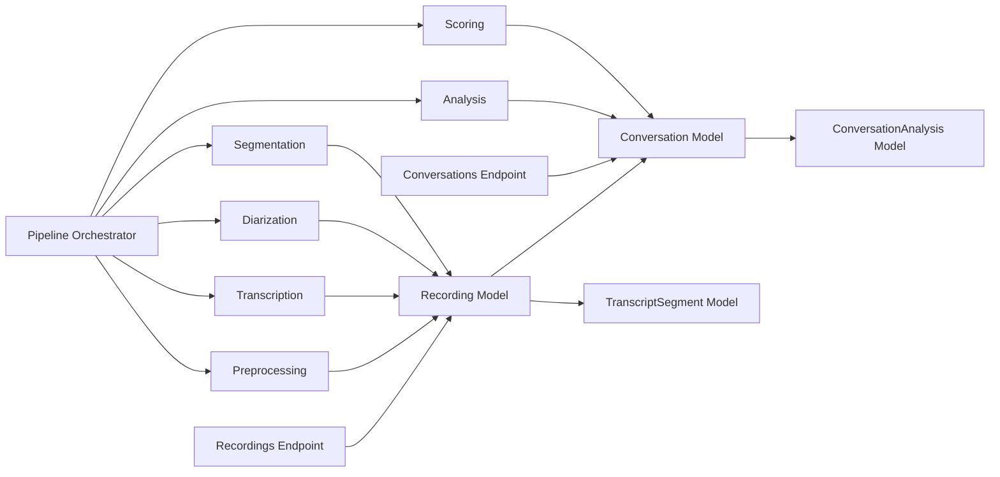

# Media and Processing Models

<cite>
**Referenced Files in This Document**
- [apps/api/src/models/recording.py](file://apps/api/src/models/recording.py)
- [apps/api/src/models/conversation.py](file://apps/api/src/models/conversation.py)
- [apps/api/src/models/transcript.py](file://apps/api/src/models/transcript.py)
- [apps/api/src/schemas/recording.py](file://apps/api/src/schemas/recording.py)
- [apps/api/src/schemas/conversation.py](file://apps/api/src/schemas/conversation.py)
- [apps/api/src/api/v1/recordings.py](file://apps/api/src/api/v1/recordings.py)
- [apps/api/src/api/v1/conversations.py](file://apps/api/src/api/v1/conversations.py)
- [apps/api/src/workers/pipeline.py](file://apps/api/src/workers/pipeline.py)
- [apps/api/src/workers/preprocessing.py](file://apps/api/src/workers/preprocessing.py)
- [apps/api/src/workers/transcription.py](file://apps/api/src/workers/transcription.py)
- [apps/api/src/workers/diarization.py](file://apps/api/src/workers/diarization.py)
- [apps/api/src/workers/segmentation.py](file://apps/api/src/workers/segmentation.py)
- [apps/api/src/workers/analysis.py](file://apps/api/src/workers/analysis.py)
- [apps/api/src/workers/scoring.py](file://apps/api/src/workers/scoring.py)
- [apps/api/src/database.py](file://apps/api/src/database.py)
</cite>

## Table of Contents
1. [Introduction](#introduction)
2. [Project Structure](#project-structure)
3. [Core Components](#core-components)
4. [Architecture Overview](#architecture-overview)
5. [Detailed Component Analysis](#detailed-component-analysis)
6. [Dependency Analysis](#dependency-analysis)
7. [Performance Considerations](#performance-considerations)
8. [Troubleshooting Guide](#troubleshooting-guide)
9. [Conclusion](#conclusion)
10. [Appendices](#appendices)

## Introduction
This document describes the media and processing models that power the Xsamaa AI Pipeline. It focuses on:
- Recording: audio file metadata, processing status, file paths, duration, and quality indicators
- Conversation: transcript segments, speaker assignments, analysis results, and pipeline states
- TranscriptSegment: text content, timing, speaker labels, and embeddings
- Relationships among recordings, conversations, and transcript segments
- Processing status lifecycle, file format requirements, and storage conventions
- Indexing strategies, search capabilities, and performance optimization patterns
- Typical processing pipelines and data transformation workflows

## Project Structure
The media and processing models live under the API application’s models and workers. The API routes expose endpoints to upload audio, query transcripts and conversations, and trigger reprocessing. Workers implement the asynchronous pipeline stages.

**Diagram sources**
- [apps/api/src/api/v1/recordings.py:1-254](file://apps/api/src/api/v1/recordings.py#L1-L254)
- [apps/api/src/api/v1/conversations.py:1-35](file://apps/api/src/api/v1/conversations.py#L1-L35)
- [apps/api/src/models/recording.py:24-60](file://apps/api/src/models/recording.py#L24-L60)
- [apps/api/src/models/conversation.py:11-61](file://apps/api/src/models/conversation.py#L11-L61)
- [apps/api/src/models/transcript.py:10-27](file://apps/api/src/models/transcript.py#L10-L27)
- [apps/api/src/workers/pipeline.py:12-35](file://apps/api/src/workers/pipeline.py#L12-L35)
- [apps/api/src/workers/preprocessing.py:106-206](file://apps/api/src/workers/preprocessing.py#L106-L206)
- [apps/api/src/workers/transcription.py:53-146](file://apps/api/src/workers/transcription.py#L53-L146)
- [apps/api/src/workers/diarization.py:65-119](file://apps/api/src/workers/diarization.py#L65-L119)
- [apps/api/src/workers/segmentation.py:92-146](file://apps/api/src/workers/segmentation.py#L92-L146)
- [apps/api/src/workers/analysis.py:152-242](file://apps/api/src/workers/analysis.py#L152-L242)
- [apps/api/src/workers/scoring.py:235-314](file://apps/api/src/workers/scoring.py#L235-L314)

**Section sources**
- [apps/api/src/api/v1/recordings.py:38-254](file://apps/api/src/api/v1/recordings.py#L38-L254)
- [apps/api/src/models/recording.py:24-60](file://apps/api/src/models/recording.py#L24-L60)
- [apps/api/src/models/conversation.py:11-61](file://apps/api/src/models/conversation.py#L11-L61)
- [apps/api/src/models/transcript.py:10-27](file://apps/api/src/models/transcript.py#L10-L27)

## Core Components
This section documents the three primary data models and their roles in the pipeline.

- Recording
  - Purpose: Stores audio file metadata, processing lifecycle, and derived quality indicators
  - Key attributes: identifiers, foreign keys, URLs, sizes, durations, formats, status, timestamps, and silence gaps
  - Relationships: belongs to a salesperson; has many transcript segments and conversations
  - Status lifecycle: uploaded → preprocessing → transcribing → diarizing → segmenting → analyzing → scoring → completed/failed
  - Storage convention: original audio stored under a dedicated path; preprocessed audio stored separately
  - Indexing: none declared in model; however, downstream workers query via recording_id and timestamps

- TranscriptSegment
  - Purpose: Captures per-segment text, timing, speaker identity, and optional vector embeddings
  - Key attributes: recording linkage, speaker label, start/end times, text, optional embedding
  - Relationships: belongs to a recording
  - Indexing: recording_id is indexed to accelerate queries by recording and time-range scans
  - Embeddings: vector column supports semantic search and similarity operations

- Conversation
  - Purpose: Represents a single customer conversation extracted from a recording
  - Key attributes: recording linkage, temporal bounds, segment count, optional summary
  - Relationships: belongs to a recording; has one analysis record
  - Indexing: recording_id is indexed to support listing and filtering by recording

- ConversationAnalysis
  - Purpose: Stores AI-driven insights per conversation (intent, products, objections, outcome, scores, etc.)
  - Key attributes: conversation linkage (unique), structured fields, confidence, timestamps
  - Relationships: belongs to a conversation (one-to-one)

**Section sources**
- [apps/api/src/models/recording.py:24-60](file://apps/api/src/models/recording.py#L24-L60)
- [apps/api/src/models/transcript.py:10-27](file://apps/api/src/models/transcript.py#L10-L27)
- [apps/api/src/models/conversation.py:11-61](file://apps/api/src/models/conversation.py#L11-L61)
- [apps/api/src/schemas/recording.py:4-71](file://apps/api/src/schemas/recording.py#L4-L71)
- [apps/api/src/schemas/conversation.py:4-33](file://apps/api/src/schemas/conversation.py#L4-L33)

## Architecture Overview
The system orchestrates asynchronous processing via Celery tasks chained together to transform raw audio into actionable insights.

**Diagram sources**
- [apps/api/src/api/v1/recordings.py:110-167](file://apps/api/src/api/v1/recordings.py#L110-L167)
- [apps/api/src/workers/pipeline.py:12-35](file://apps/api/src/workers/pipeline.py#L12-L35)
- [apps/api/src/workers/preprocessing.py:106-206](file://apps/api/src/workers/preprocessing.py#L106-L206)
- [apps/api/src/workers/transcription.py:53-146](file://apps/api/src/workers/transcription.py#L53-L146)
- [apps/api/src/workers/diarization.py:65-119](file://apps/api/src/workers/diarization.py#L65-L119)
- [apps/api/src/workers/segmentation.py:92-146](file://apps/api/src/workers/segmentation.py#L92-L146)
- [apps/api/src/workers/analysis.py:152-242](file://apps/api/src/workers/analysis.py#L152-L242)
- [apps/api/src/workers/scoring.py:235-314](file://apps/api/src/workers/scoring.py#L235-L314)

## Detailed Component Analysis

### Recording Model
- Metadata and lifecycle
  - Identifiers: UUID primary key; foreign key to salesperson
  - File metadata: URL, size, duration, format
  - Status: enum with lifecycle states
  - Timestamps: uploaded, recorded, processed
  - Quality indicators: silence gaps stored as JSONB
- Relationships
  - One-to-many with TranscriptSegment and Conversation
- Processing integration
  - Workers update status and timestamps
  - Silence gaps inform segmentation heuristics

**Diagram sources**
- [apps/api/src/models/recording.py:24-60](file://apps/api/src/models/recording.py#L24-L60)
- [apps/api/src/models/transcript.py:10-27](file://apps/api/src/models/transcript.py#L10-L27)
- [apps/api/src/models/conversation.py:11-33](file://apps/api/src/models/conversation.py#L11-L33)

**Section sources**
- [apps/api/src/models/recording.py:24-60](file://apps/api/src/models/recording.py#L24-L60)
- [apps/api/src/workers/preprocessing.py:106-206](file://apps/api/src/workers/preprocessing.py#L106-L206)
- [apps/api/src/workers/segmentation.py:46-62](file://apps/api/src/workers/segmentation.py#L46-L62)

### TranscriptSegment Model
- Content and timing
  - Text content, speaker label, precise start/end times
- Embeddings
  - Optional vector embedding column for semantic operations
- Indexing
  - recording_id indexed to optimize per-recording queries and time-range scans
- Data flow
  - Populated by transcription; later labeled by diarization

**Diagram sources**
- [apps/api/src/workers/transcription.py:24-51](file://apps/api/src/workers/transcription.py#L24-L51)
- [apps/api/src/workers/transcription.py:53-94](file://apps/api/src/workers/transcription.py#L53-L94)

**Section sources**
- [apps/api/src/models/transcript.py:10-27](file://apps/api/src/models/transcript.py#L10-L27)
- [apps/api/src/workers/transcription.py:24-51](file://apps/api/src/workers/transcription.py#L24-L51)

### Conversation and ConversationAnalysis Models
- Conversation
  - Temporal bounds and segment count
  - Optional summary populated by analysis
- ConversationAnalysis
  - Structured insights: intent, products, budget, objections, competitors
  - Outcome, closing attempt, confidence, scores, summary, coaching notes
  - Unique constraint on conversation_id ensures one analysis per conversation

**Diagram sources**
- [apps/api/src/models/conversation.py:11-61](file://apps/api/src/models/conversation.py#L11-L61)

**Section sources**
- [apps/api/src/models/conversation.py:11-61](file://apps/api/src/models/conversation.py#L11-L61)
- [apps/api/src/workers/analysis.py:90-134](file://apps/api/src/workers/analysis.py#L90-L134)
- [apps/api/src/workers/scoring.py:64-88](file://apps/api/src/workers/scoring.py#L64-L88)

### Relationship Between Recordings and Conversations
- One-to-many association: a recording may contain zero or more conversations
- Conversations are derived from transcript segments via segmentation
- Indexing on recording_id accelerates per-recording queries

**Diagram sources**
- [apps/api/src/models/recording.py:24-60](file://apps/api/src/models/recording.py#L24-L60)
- [apps/api/src/models/conversation.py:11-33](file://apps/api/src/models/conversation.py#L11-L33)
- [apps/api/src/models/transcript.py:10-27](file://apps/api/src/models/transcript.py#L10-L27)

**Section sources**
- [apps/api/src/models/recording.py:50-60](file://apps/api/src/models/recording.py#L50-L60)
- [apps/api/src/models/conversation.py:26-33](file://apps/api/src/models/conversation.py#L26-L33)
- [apps/api/src/models/transcript.py:23-27](file://apps/api/src/models/transcript.py#L23-L27)

### Processing Status Lifecycle
- States: UPLOADED, PREPROCESSING, TRANSCRIBING, DIARIZING, SEGMENTING, ANALYZING, SCORING, COMPLETED, FAILED
- Transitions are triggered by workers; failures persist error messages and remain in FAILED until reprocessed

**Diagram sources**
- [apps/api/src/models/recording.py:12-22](file://apps/api/src/models/recording.py#L12-L22)
- [apps/api/src/workers/preprocessing.py:106-206](file://apps/api/src/workers/preprocessing.py#L106-L206)
- [apps/api/src/workers/transcription.py:53-146](file://apps/api/src/workers/transcription.py#L53-L146)
- [apps/api/src/workers/diarization.py:65-119](file://apps/api/src/workers/diarization.py#L65-L119)
- [apps/api/src/workers/segmentation.py:92-146](file://apps/api/src/workers/segmentation.py#L92-L146)
- [apps/api/src/workers/analysis.py:152-242](file://apps/api/src/workers/analysis.py#L152-L242)
- [apps/api/src/workers/scoring.py:235-314](file://apps/api/src/workers/scoring.py#L235-L314)

**Section sources**
- [apps/api/src/models/recording.py:12-22](file://apps/api/src/models/recording.py#L12-L22)

### File Format Requirements and Storage Path Conventions
- Formats: wav, mp3, m4a
- MIME types: audio/wav, audio/mpeg, audio/mp4, audio/x-m4a, audio/mp3
- Storage paths:
  - Original uploads: recordings/<uuid>/<filename>
  - Preprocessed audio: preprocessed/<recording_id>/audio.wav

**Section sources**
- [apps/api/src/api/v1/recordings.py:35-36](file://apps/api/src/api/v1/recordings.py#L35-L36)
- [apps/api/src/api/v1/recordings.py:146](file://apps/api/src/api/v1/recordings.py#L146)
- [apps/api/src/workers/preprocessing.py:181](file://apps/api/src/workers/preprocessing.py#L181)

### Indexing Strategies and Search Capabilities
- Explicit indexes
  - Conversation.recording_id: indexed to filter/list conversations by recording efficiently
  - TranscriptSegment.recording_id: indexed to query segments by recording and time ranges
- Implicit indexes
  - Primary keys on all tables
- Search capabilities
  - TranscriptSegment.embedding supports vector similarity operations for semantic search
  - Workers query by recording_id and time windows to assemble conversation contexts

**Section sources**
- [apps/api/src/models/conversation.py:16](file://apps/api/src/models/conversation.py#L16)
- [apps/api/src/models/transcript.py:15](file://apps/api/src/models/transcript.py#L15)
- [apps/api/src/models/transcript.py:21](file://apps/api/src/models/transcript.py#L21)

### Performance Optimization Patterns
- Asynchronous pipeline with Celery to decouple I/O-bound stages
- Chunked transcription for large files to respect provider limits
- Batched DB writes for segments and conversation creation
- JSONB fields for flexible analysis outputs and embeddings
- Re-processing endpoint to retry failed stages without re-uploading

**Section sources**
- [apps/api/src/workers/transcription.py:78-89](file://apps/api/src/workers/transcription.py#L78-L89)
- [apps/api/src/workers/transcription.py:104-145](file://apps/api/src/workers/transcription.py#L104-L145)
- [apps/api/src/workers/segmentation.py:65-90](file://apps/api/src/workers/segmentation.py#L65-L90)
- [apps/api/src/workers/analysis.py:90-134](file://apps/api/src/workers/analysis.py#L90-L134)
- [apps/api/src/api/v1/recordings.py:228-253](file://apps/api/src/api/v1/recordings.py#L228-L253)

### Typical Processing Pipelines and Workflows
- Upload audio
  - Endpoint validates format and MIME type, stores file, creates Recording in UPLOADED state, enqueues pipeline
- Preprocessing
  - Converts to mono, resamples to target rate, normalizes volume, detects silence gaps, exports preprocessed WAV, updates duration
- Transcription
  - Calls STT; if oversized, chunks audio and merges aligned timestamps; stores segments
- Diarization
  - Assigns speaker labels to segments; logs speaker distribution
- Segmentation
  - Builds conversation boundaries using silence gaps and AI signals; persists conversations
- Analysis
  - Extracts conversation context; runs LLM analysis; stores structured insights and updates summaries
- Scoring
  - Computes per-conversation scores; aggregates averages; marks recording COMPLETED with processed timestamp; updates daily metrics

**Section sources**
- [apps/api/src/api/v1/recordings.py:110-167](file://apps/api/src/api/v1/recordings.py#L110-L167)
- [apps/api/src/workers/pipeline.py:12-35](file://apps/api/src/workers/pipeline.py#L12-L35)
- [apps/api/src/workers/preprocessing.py:106-206](file://apps/api/src/workers/preprocessing.py#L106-L206)
- [apps/api/src/workers/transcription.py:53-146](file://apps/api/src/workers/transcription.py#L53-L146)
- [apps/api/src/workers/diarization.py:65-119](file://apps/api/src/workers/diarization.py#L65-L119)
- [apps/api/src/workers/segmentation.py:92-146](file://apps/api/src/workers/segmentation.py#L92-L146)
- [apps/api/src/workers/analysis.py:152-242](file://apps/api/src/workers/analysis.py#L152-L242)
- [apps/api/src/workers/scoring.py:235-314](file://apps/api/src/workers/scoring.py#L235-L314)

## Dependency Analysis
The models define relationships; the API routes depend on services and workers; workers depend on AI clients and storage.

**Diagram sources**
- [apps/api/src/models/recording.py:24-60](file://apps/api/src/models/recording.py#L24-L60)
- [apps/api/src/models/conversation.py:11-61](file://apps/api/src/models/conversation.py#L11-L61)
- [apps/api/src/models/transcript.py:10-27](file://apps/api/src/models/transcript.py#L10-L27)
- [apps/api/src/api/v1/recordings.py:1-254](file://apps/api/src/api/v1/recordings.py#L1-L254)
- [apps/api/src/api/v1/conversations.py:1-35](file://apps/api/src/api/v1/conversations.py#L1-L35)
- [apps/api/src/workers/pipeline.py:12-35](file://apps/api/src/workers/pipeline.py#L12-L35)

**Section sources**
- [apps/api/src/database.py:8-34](file://apps/api/src/database.py#L8-L34)

## Performance Considerations
- Database connection pooling and async sessions reduce latency and improve throughput
- Indexed foreign keys minimize JOIN costs for per-recording queries
- Vector embeddings enable efficient semantic similarity searches
- Chunked transcription prevents provider timeouts and reduces memory pressure
- Idempotent DB writes (clear-and-recreate for segments, upsert for analysis) simplify reliability

[No sources needed since this section provides general guidance]

## Troubleshooting Guide
- Recording stuck in FAILED
  - Inspect error_message and status transitions; reprocess via endpoint to reset status and re-run pipeline
- Missing transcript segments after transcription
  - Verify STT service availability and chunking logic; confirm DB upsert executed
- No conversations after segmentation
  - Check silence gaps and greeting/farewell detection; ensure segments exist and are labeled
- Low-confidence analysis
  - Review confidence thresholds and adjust expectations; inspect analysis payload
- Scoring not completing
  - Confirm conversation segments exist and analysis scores were persisted; check daily metrics updates

**Section sources**
- [apps/api/src/api/v1/recordings.py:228-253](file://apps/api/src/api/v1/recordings.py#L228-L253)
- [apps/api/src/workers/transcription.py:96-101](file://apps/api/src/workers/transcription.py#L96-L101)
- [apps/api/src/workers/segmentation.py:140-145](file://apps/api/src/workers/segmentation.py#L140-L145)
- [apps/api/src/workers/analysis.py:205-212](file://apps/api/src/workers/analysis.py#L205-L212)
- [apps/api/src/workers/scoring.py:308-313](file://apps/api/src/workers/scoring.py#L308-L313)

## Conclusion
The Xsamaa AI Pipeline models provide a robust foundation for audio ingestion, transformation, and insight generation. The Recording model tracks lifecycle and quality, TranscriptSegment captures granular speech content with embeddings, and Conversation plus ConversationAnalysis deliver structured business insights. The orchestrated worker pipeline ensures scalability and resilience, while indexing and storage conventions support efficient querying and retrieval.

[No sources needed since this section summarizes without analyzing specific files]

## Appendices

### API Endpoints Overview
- Upload recording and enqueue pipeline
- List recordings with filters and pagination
- Retrieve recording detail, status, transcript, conversations, and summary
- Export recordings and conversation analyses as CSV
- Re-process failed recordings

**Section sources**
- [apps/api/src/api/v1/recordings.py:41-253](file://apps/api/src/api/v1/recordings.py#L41-L253)
- [apps/api/src/api/v1/conversations.py:13-34](file://apps/api/src/api/v1/conversations.py#L13-L34)