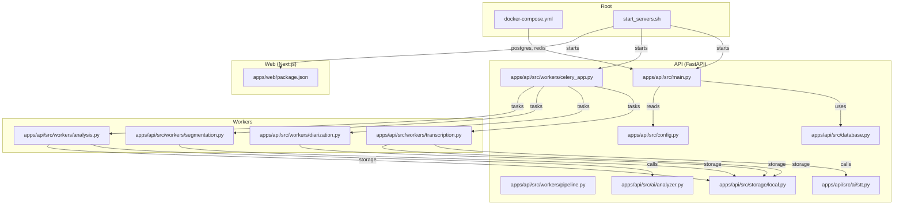
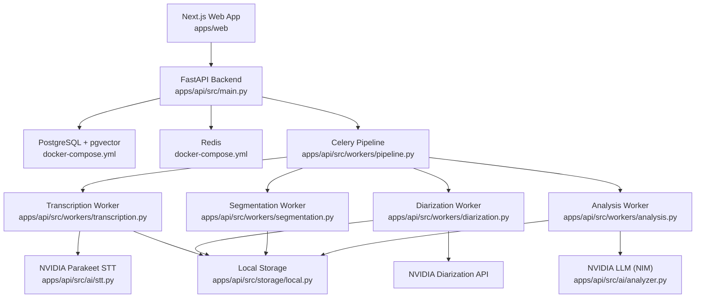
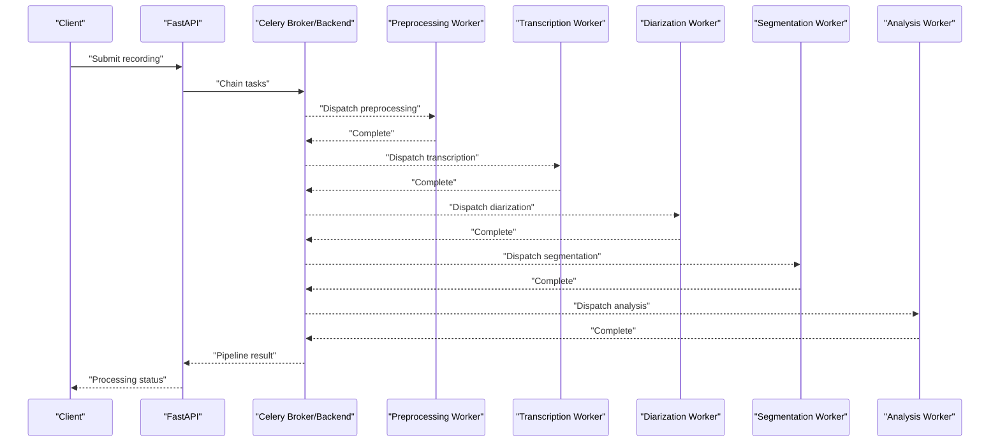
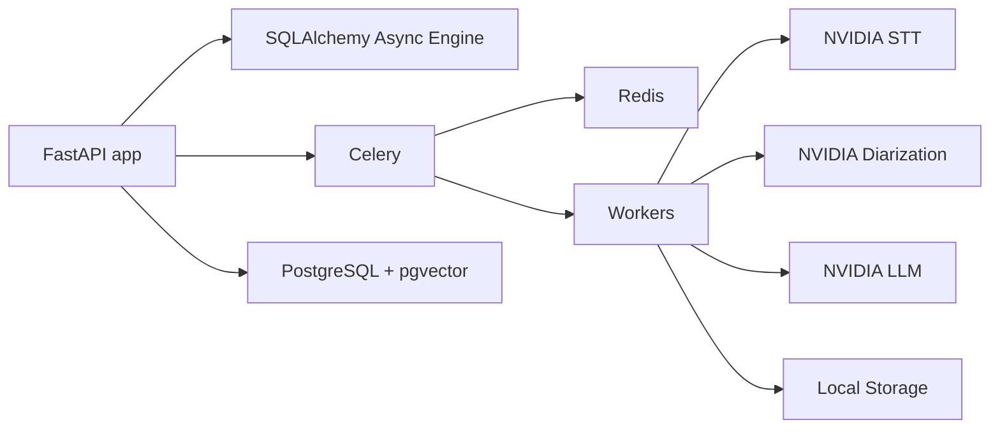

# Deployment & Operations

<cite>
**Referenced Files in This Document**
- [docker-compose.yml](file://docker-compose.yml)
- [start_servers.sh](file://start_servers.sh)
- [apps/api/src/main.py](file://apps/api/src/main.py)
- [apps/api/src/config.py](file://apps/api/src/config.py)
- [apps/api/src/database.py](file://apps/api/src/database.py)
- [apps/api/src/workers/celery_app.py](file://apps/api/src/workers/celery_app.py)
- [apps/api/src/workers/pipeline.py](file://apps/api/src/workers/pipeline.py)
- [apps/api/src/workers/transcription.py](file://apps/api/src/workers/transcription.py)
- [apps/api/src/workers/diarization.py](file://apps/api/src/workers/diarization.py)
- [apps/api/src/workers/segmentation.py](file://apps/api/src/workers/segmentation.py)
- [apps/api/src/workers/analysis.py](file://apps/api/src/workers/analysis.py)
- [apps/api/src/ai/stt.py](file://apps/api/src/ai/stt.py)
- [apps/api/src/ai/analyzer.py](file://apps/api/src/ai/analyzer.py)
- [apps/api/src/storage/local.py](file://apps/api/src/storage/local.py)
- [apps/api/pyproject.toml](file://apps/api/pyproject.toml)
- [apps/web/package.json](file://apps/web/package.json)
</cite>

## Table of Contents
1. [Introduction](#introduction)
2. [Project Structure](#project-structure)
3. [Core Components](#core-components)
4. [Architecture Overview](#architecture-overview)
5. [Detailed Component Analysis](#detailed-component-analysis)
6. [Dependency Analysis](#dependency-analysis)
7. [Performance Considerations](#performance-considerations)
8. [Monitoring and Logging](#monitoring-and-logging)
9. [Backup and Recovery](#backup-and-recovery)
10. [Security Hardening](#security-hardening)
11. [Capacity Planning](#capacity-planning)
12. [Operational Runbooks](#operational-runbooks)
13. [Conclusion](#conclusion)

## Introduction
This document provides comprehensive deployment and operations guidance for the Xsamaa AI Pipeline. It covers containerized deployment with Docker Compose, service orchestration, scaling strategies, production-grade considerations (load balancing, health checks, service discovery), monitoring and logging, backup and recovery, security hardening, capacity planning, and operational runbooks. The system integrates a FastAPI backend, Celery workers, PostgreSQL with pgvector, Redis, and a Next.js frontend, with an AI pipeline orchestrated via Celery chains that process audio recordings through transcription, diarization, segmentation, analysis, and scoring.

## Project Structure
The repository follows a multi-service layout:
- Backend API (FastAPI): located under apps/api
- Frontend (Next.js): located under apps/web
- Shared packages: under packages/shared
- Documentation and planning artifacts: under docs and plan
- Orchestration and scripts: root-level docker-compose.yml and start_servers.sh

**Diagram sources**
- [docker-compose.yml:1-35](file://docker-compose.yml#L1-L35)
- [start_servers.sh:86-174](file://start_servers.sh#L86-L174)
- [apps/api/src/main.py:1-29](file://apps/api/src/main.py#L1-L29)
- [apps/api/src/config.py:1-52](file://apps/api/src/config.py#L1-L52)
- [apps/api/src/database.py:1-34](file://apps/api/src/database.py#L1-L34)
- [apps/api/src/workers/celery_app.py:1-31](file://apps/api/src/workers/celery_app.py#L1-L31)
- [apps/api/src/workers/pipeline.py:1-35](file://apps/api/src/workers/pipeline.py#L1-L35)
- [apps/api/src/ai/stt.py:1-86](file://apps/api/src/ai/stt.py#L1-L86)
- [apps/api/src/ai/analyzer.py:1-198](file://apps/api/src/ai/analyzer.py#L1-L198)
- [apps/api/src/storage/local.py:1-50](file://apps/api/src/storage/local.py#L1-L50)
- [apps/web/package.json:1-38](file://apps/web/package.json#L1-L38)

**Section sources**
- [docker-compose.yml:1-35](file://docker-compose.yml#L1-L35)
- [start_servers.sh:1-174](file://start_servers.sh#L1-L174)
- [apps/api/src/main.py:1-29](file://apps/api/src/main.py#L1-L29)
- [apps/api/src/config.py:1-52](file://apps/api/src/config.py#L1-L52)
- [apps/api/src/database.py:1-34](file://apps/api/src/database.py#L1-L34)
- [apps/api/src/workers/celery_app.py:1-31](file://apps/api/src/workers/celery_app.py#L1-L31)
- [apps/api/src/workers/pipeline.py:1-35](file://apps/api/src/workers/pipeline.py#L1-L35)
- [apps/api/src/ai/stt.py:1-86](file://apps/api/src/ai/stt.py#L1-L86)
- [apps/api/src/ai/analyzer.py:1-198](file://apps/api/src/ai/analyzer.py#L1-L198)
- [apps/api/src/storage/local.py:1-50](file://apps/api/src/storage/local.py#L1-L50)
- [apps/web/package.json:1-38](file://apps/web/package.json#L1-L38)

## Core Components
- PostgreSQL with pgvector: persistent relational data and vector embeddings; health-checked and persisted via named volumes.
- Redis: message broker and result backend for Celery; health-checked and persisted via named volumes.
- FastAPI application: exposes REST endpoints, includes a /health endpoint, and serves API docs.
- Celery worker: executes the AI pipeline tasks asynchronously; configured with serialization, time limits, and prefetch behavior.
- Next.js frontend: runs in development mode locally; packaged for production builds and starts.
- Local storage backend: file-based persistence for uploaded audio assets; supports async and sync operations.

Key runtime and configuration points:
- Application settings are loaded from environment variables via Pydantic settings.
- Database connection uses SQLAlchemy asyncio engine with configurable pool sizes.
- AI services integrate with NVIDIA APIs for STT, diarization, and LLM analysis.

**Section sources**
- [docker-compose.yml:1-35](file://docker-compose.yml#L1-L35)
- [apps/api/src/main.py:26-29](file://apps/api/src/main.py#L26-L29)
- [apps/api/src/config.py:11-52](file://apps/api/src/config.py#L11-L52)
- [apps/api/src/database.py:8-19](file://apps/api/src/database.py#L8-L19)
- [apps/api/src/workers/celery_app.py:5-31](file://apps/api/src/workers/celery_app.py#L5-L31)
- [apps/api/src/storage/local.py:7-49](file://apps/api/src/storage/local.py#L7-L49)

## Architecture Overview
The system is a polyglot microservice-like architecture:
- API service (FastAPI) handles ingestion, orchestration requests, and reads/writes to PostgreSQL.
- Celery workers handle long-running AI tasks and coordinate via Redis.
- AI services are externalized via NVIDIA APIs.
- Frontend (Next.js) communicates with the API.

**Diagram sources**
- [apps/api/src/main.py:1-29](file://apps/api/src/main.py#L1-L29)
- [docker-compose.yml:1-35](file://docker-compose.yml#L1-L35)
- [apps/api/src/workers/pipeline.py:12-35](file://apps/api/src/workers/pipeline.py#L12-L35)
- [apps/api/src/workers/transcription.py:53-102](file://apps/api/src/workers/transcription.py#L53-L102)
- [apps/api/src/workers/diarization.py:65-119](file://apps/api/src/workers/diarization.py#L65-L119)
- [apps/api/src/workers/segmentation.py:92-146](file://apps/api/src/workers/segmentation.py#L92-L146)
- [apps/api/src/workers/analysis.py:152-242](file://apps/api/src/workers/analysis.py#L152-L242)
- [apps/api/src/ai/stt.py:12-47](file://apps/api/src/ai/stt.py#L12-L47)
- [apps/api/src/ai/analyzer.py:47-117](file://apps/api/src/ai/analyzer.py#L47-L117)
- [apps/api/src/storage/local.py:7-49](file://apps/api/src/storage/local.py#L7-L49)

## Detailed Component Analysis

### API Service Orchestration
- Health endpoint: returns status and environment.
- CORS configuration is driven by settings.
- Router registration wires API v1 routes.

Operational implications:
- Ensure CORS origins match deployed frontend domain(s).
- Use the /health endpoint for readiness/liveness probes.

**Section sources**
- [apps/api/src/main.py:1-29](file://apps/api/src/main.py#L1-L29)
- [apps/api/src/config.py:44-48](file://apps/api/src/config.py#L44-L48)

### Celery Pipeline Orchestration
The pipeline composes six tasks in order:
1. Preprocessing
2. Transcription
3. Diarization
4. Segmentation
5. Analysis
6. Scoring

**Diagram sources**
- [apps/api/src/workers/pipeline.py:12-35](file://apps/api/src/workers/pipeline.py#L12-L35)
- [apps/api/src/workers/transcription.py:53-102](file://apps/api/src/workers/transcription.py#L53-L102)
- [apps/api/src/workers/diarization.py:65-119](file://apps/api/src/workers/diarization.py#L65-L119)
- [apps/api/src/workers/segmentation.py:92-146](file://apps/api/src/workers/segmentation.py#L92-L146)
- [apps/api/src/workers/analysis.py:152-242](file://apps/api/src/workers/analysis.py#L152-L242)

**Section sources**
- [apps/api/src/workers/pipeline.py:12-35](file://apps/api/src/workers/pipeline.py#L12-L35)
- [apps/api/src/workers/celery_app.py:19-30](file://apps/api/src/workers/celery_app.py#L19-L30)

### Transcription Worker
- Downloads preprocessed audio from storage.
- Splits large files into chunks to meet API constraints.
- Calls NVIDIA Parakeet STT and persists transcript segments.

Operational considerations:
- Retries and time limits are configured in Celery.
- Large audio chunking ensures compliance with external API limits.

**Section sources**
- [apps/api/src/workers/transcription.py:53-146](file://apps/api/src/workers/transcription.py#L53-L146)
- [apps/api/src/ai/stt.py:12-86](file://apps/api/src/ai/stt.py#L12-L86)

### Diarization Worker
- Loads preprocessed audio and calls NVIDIA NeMo diarization.
- Assigns speaker labels to transcript segments and updates the database.

**Section sources**
- [apps/api/src/workers/diarization.py:65-119](file://apps/api/src/workers/diarization.py#L65-L119)

### Segmentation Worker
- Builds conversation segments using silence gaps and transcript segments.
- Stores conversation metadata for downstream analysis.

**Section sources**
- [apps/api/src/workers/segmentation.py:92-146](file://apps/api/src/workers/segmentation.py#L92-L146)

### Analysis Worker
- Retrieves conversation segments and calls the Llama 3.3 analyzer via NVIDIA NIM.
- Applies confidence thresholding and persists analysis results.

**Section sources**
- [apps/api/src/workers/analysis.py:152-242](file://apps/api/src/workers/analysis.py#L152-L242)
- [apps/api/src/ai/analyzer.py:47-117](file://apps/api/src/ai/analyzer.py#L47-L117)

### Storage Backend
- Local storage supports async and sync operations for uploads/downloads/deletes.
- Signed URLs return filesystem paths for local deployments.

**Section sources**
- [apps/api/src/storage/local.py:7-49](file://apps/api/src/storage/local.py#L7-L49)

## Dependency Analysis
External dependencies and runtime relationships:
- FastAPI depends on SQLAlchemy for async ORM and Alembic for migrations.
- Celery depends on Redis for broker/backend.
- AI components depend on NVIDIA APIs for STT, diarization, and LLM.

**Diagram sources**
- [apps/api/pyproject.toml:6-23](file://apps/api/pyproject.toml#L6-L23)
- [apps/api/src/database.py:8-19](file://apps/api/src/database.py#L8-L19)
- [apps/api/src/workers/celery_app.py:7-8](file://apps/api/src/workers/celery_app.py#L7-L8)
- [apps/api/src/ai/stt.py:6-7](file://apps/api/src/ai/stt.py#L6-L7)
- [apps/api/src/ai/analyzer.py:12](file://apps/api/src/ai/analyzer.py#L12)
- [docker-compose.yml:3-17](file://docker-compose.yml#L3-L17)

**Section sources**
- [apps/api/pyproject.toml:1-43](file://apps/api/pyproject.toml#L1-L43)
- [apps/api/src/database.py:1-34](file://apps/api/src/database.py#L1-L34)
- [apps/api/src/workers/celery_app.py:1-31](file://apps/api/src/workers/celery_app.py#L1-L31)
- [apps/api/src/ai/stt.py:1-86](file://apps/api/src/ai/stt.py#L1-L86)
- [apps/api/src/ai/analyzer.py:1-198](file://apps/api/src/ai/analyzer.py#L1-L198)
- [docker-compose.yml:1-35](file://docker-compose.yml#L1-L35)

## Performance Considerations
- Database connection pooling: configured with pool_size and overflow to handle concurrent requests.
- Celery worker concurrency: controlled via command-line flag; tune based on CPU and memory headroom.
- Task timeouts: soft and hard limits prevent runaway tasks; adjust per workload characteristics.
- Prefetch multiplier: set to 1 to distribute tasks evenly across workers.
- AI API timeouts: configurable per service; ensure upstream limits align with task time limits.
- Audio chunking: transcription worker splits large files to respect external API constraints.

Recommendations:
- Monitor queue depth and task durations; scale workers horizontally.
- Right-size database pools and consider read replicas for reporting workloads.
- Use asynchronous I/O for storage operations where feasible.

**Section sources**
- [apps/api/src/database.py:11-13](file://apps/api/src/database.py#L11-L13)
- [apps/api/src/workers/celery_app.py:27-30](file://apps/api/src/workers/celery_app.py#L27-L30)
- [apps/api/src/workers/transcription.py:78-84](file://apps/api/src/workers/transcription.py#L78-L84)
- [apps/api/src/config.py:35](file://apps/api/src/config.py#L35)

## Monitoring and Logging
- API health endpoint: use for readiness/liveness probes.
- Logs:
  - API server logs to a dedicated log directory.
  - Celery worker logs to a dedicated log directory.
  - Frontend logs via npm run dev.
- Observability:
  - Add Prometheus metrics for API latency and throughput.
  - Track Celery task durations, failures, and queue lag.
  - Monitor PostgreSQL and Redis health via built-in healthchecks.
  - Instrument AI client calls for latency and error rates.

**Section sources**
- [apps/api/src/main.py:26-29](file://apps/api/src/main.py#L26-L29)
- [start_servers.sh:142-157](file://start_servers.sh#L142-L157)
- [docker-compose.yml:13-17](file://docker-compose.yml#L13-L17)
- [docker-compose.yml:26-30](file://docker-compose.yml#L26-L30)

## Backup and Recovery
- PostgreSQL:
  - Use logical backups (e.g., pg_dump) or continuous archiving/streaming replication for point-in-time recovery.
  - Automate periodic snapshots and retain rotation policies.
- Redis:
  - Enable RDB/AOF persistence; snapshot and append-only file backups.
  - Test restore procedures regularly.
- Audio storage:
  - Back up the local upload directory or switch to object storage with versioning and lifecycle policies.
- Configuration:
  - Version control environment files and secrets externally managed via a secrets manager.
  - Maintain separate environments (.env.development, .env.production).

**Section sources**
- [docker-compose.yml:11-12](file://docker-compose.yml#L11-L12)
- [docker-compose.yml:24-25](file://docker-compose.yml#L24-L25)
- [apps/api/src/config.py:24-27](file://apps/api/src/config.py#L24-L27)

## Security Hardening
- Network isolation:
  - Run services in isolated Docker networks; publish only necessary ports.
  - Restrict inbound traffic to API and web ports.
- Secrets management:
  - Replace hardcoded credentials with environment injection or secret managers.
  - Protect .env files from version control.
- Access control:
  - Enforce authentication and authorization in the API.
  - Limit CORS origins to trusted domains.
- TLS:
  - Terminate TLS at an ingress/load balancer; secure internal communications.
- Dependencies:
  - Pin dependency versions and scan for vulnerabilities regularly.

**Section sources**
- [apps/api/src/config.py:18-22](file://apps/api/src/config.py#L18-L22)
- [apps/api/src/config.py:44-48](file://apps/api/src/config.py#L44-L48)
- [docker-compose.yml:9-10](file://docker-compose.yml#L9-L10)
- [docker-compose.yml:22-23](file://docker-compose.yml#L22-L23)

## Capacity Planning
- Throughput:
  - Estimate peak concurrent recordings and derive target Celery worker count.
  - Account for transcription, diarization, segmentation, and analysis durations.
- Storage:
  - Compute raw audio size × growth rate; factor in preprocessed and derived assets.
  - Plan for vector embeddings and metadata storage.
- Compute:
  - GPU-accelerated inference (NVIDIA) requires scheduling and resource quotas.
  - Scale workers and provision adequate CPU/memory per task type.
- Networking:
  - External API bandwidth for NVIDIA services; consider regional endpoints.

[No sources needed since this section provides general guidance]

## Operational Runbooks

### Containerized Deployment with Docker Compose
- Start infrastructure:
  - Ensure Docker is installed; run docker compose up -d to start PostgreSQL and Redis.
- Verify health:
  - Use docker compose ps and healthcheck outputs to confirm readiness.
- Persist data:
  - Named volumes persist PostgreSQL and Redis data across restarts.

**Section sources**
- [docker-compose.yml:1-35](file://docker-compose.yml#L1-L35)

### Local Development Launch
- Prerequisites:
  - Docker, Node.js, and Python virtual environment with API dependencies.
- Environment:
  - Copy .env.example to .env and set required keys (e.g., NVIDIA API key).
- Start services:
  - Execute the launcher script to start Docker services, run migrations, and launch API, Celery, and web.
- Logs:
  - Review logs in the .logs directory.

**Section sources**
- [start_servers.sh:55-84](file://start_servers.sh#L55-L84)
- [start_servers.sh:105-129](file://start_servers.sh#L105-L129)
- [start_servers.sh:131-137](file://start_servers.sh#L131-L137)
- [start_servers.sh:138-174](file://start_servers.sh#L138-L174)

### Scaling Strategies
- API:
  - Horizontal scale FastAPI instances behind a load balancer; ensure shared Redis and PostgreSQL.
- Workers:
  - Increase Celery worker processes and concurrency; monitor queue backlog.
- Storage:
  - Migrate to object storage for horizontal scalability; maintain local fallback for development.

**Section sources**
- [apps/api/src/workers/celery_app.py:27-30](file://apps/api/src/workers/celery_app.py#L27-L30)
- [apps/api/src/config.py:24-27](file://apps/api/src/config.py#L24-L27)

### Load Balancing and Service Discovery
- Load balancer:
  - Place a reverse proxy or cloud LB in front of API instances.
- Service discovery:
  - For containerized deployments, rely on Docker networking or orchestration platforms’ service discovery.

**Section sources**
- [apps/api/src/main.py:15-21](file://apps/api/src/main.py#L15-L21)

### Health Checks and Probes
- Use the /health endpoint for liveness/readiness.
- Leverage Docker healthchecks for PostgreSQL and Redis.

**Section sources**
- [apps/api/src/main.py:26-29](file://apps/api/src/main.py#L26-L29)
- [docker-compose.yml:13-17](file://docker-compose.yml#L13-L17)
- [docker-compose.yml:26-30](file://docker-compose.yml#L26-L30)

### Monitoring and Alerting
- Metrics:
  - Track API request rates, latency, and error ratios.
  - Track Celery task durations, failures, and queue length.
- Logs:
  - Centralize logs from API, Celery, and infrastructure components.

**Section sources**
- [apps/api/src/main.py:26-29](file://apps/api/src/main.py#L26-L29)
- [start_servers.sh:142-157](file://start_servers.sh#L142-L157)

### Backup and Recovery Procedures
- PostgreSQL:
  - Schedule logical backups; test PITR restore.
- Redis:
  - Snapshot and AOF backups; validate restore.
- Audio storage:
  - Back up upload directory or migrate to object storage with versioning.
- Configurations:
  - Maintain encrypted, versioned secrets and environment configs.

**Section sources**
- [docker-compose.yml:11-12](file://docker-compose.yml#L11-L12)
- [docker-compose.yml:24-25](file://docker-compose.yml#L24-L25)
- [apps/api/src/config.py:24-27](file://apps/api/src/config.py#L24-L27)

### Security Hardening Checklist
- Isolate networks; publish minimal ports.
- Manage secrets externally; restrict access.
- Enforce CORS and authentication.
- Use TLS termination at the edge.

**Section sources**
- [apps/api/src/config.py:18-22](file://apps/api/src/config.py#L18-L22)
- [apps/api/src/config.py:44-48](file://apps/api/src/config.py#L44-L48)
- [docker-compose.yml:9-10](file://docker-compose.yml#L9-L10)
- [docker-compose.yml:22-23](file://docker-compose.yml#L22-L23)

### Troubleshooting Common Issues
- API not reachable:
  - Confirm port binding and firewall rules; check /health.
- Celery tasks stuck:
  - Inspect Redis connectivity and queue depth; review worker logs.
- Transcription failures:
  - Validate NVIDIA API key and model availability; check chunking logic.
- Diarization or analysis errors:
  - Inspect AI client logs and retry policies.

**Section sources**
- [apps/api/src/main.py:26-29](file://apps/api/src/main.py#L26-L29)
- [apps/api/src/workers/transcription.py:96-102](file://apps/api/src/workers/transcription.py#L96-L102)
- [apps/api/src/workers/diarization.py:113-119](file://apps/api/src/workers/diarization.py#L113-L119)
- [apps/api/src/workers/analysis.py:236-242](file://apps/api/src/workers/analysis.py#L236-L242)

### Incident Response Protocol
- Define escalation tiers and communication channels.
- Automate remediation steps (restart unhealthy containers, purge stalled queues).
- Document postmortems and update runbooks.

[No sources needed since this section provides general guidance]

## Conclusion
Xsamaa AI Pipeline combines a FastAPI backend, Celery workers, PostgreSQL with pgvector, Redis, and a Next.js frontend into a cohesive audio processing platform. Production deployments should emphasize containerization, health checks, observability, security hardening, and robust backup/recovery. Capacity planning must account for audio throughput, storage growth, and AI inference costs. The provided runbooks and diagrams offer practical guidance for reliable operations.