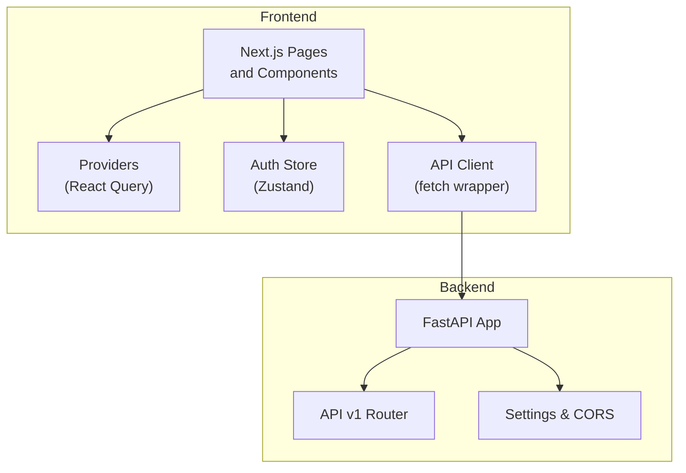
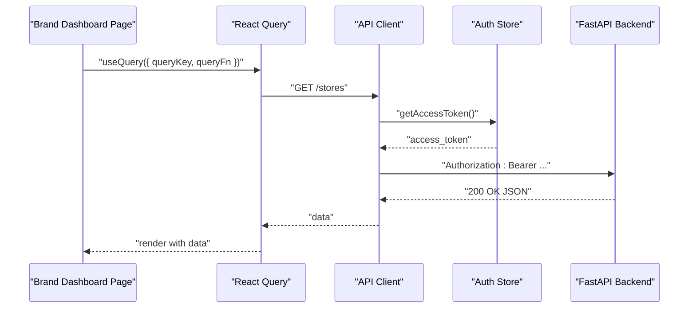
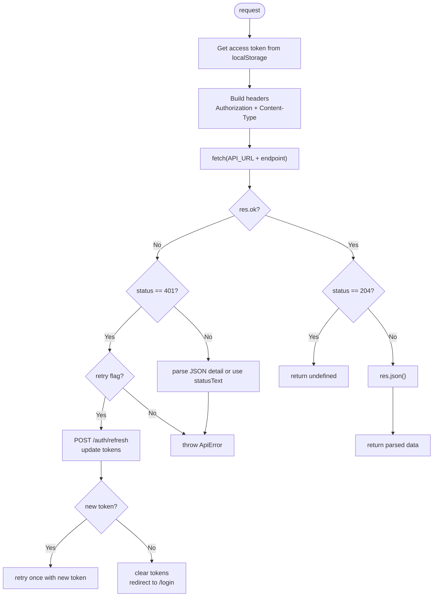
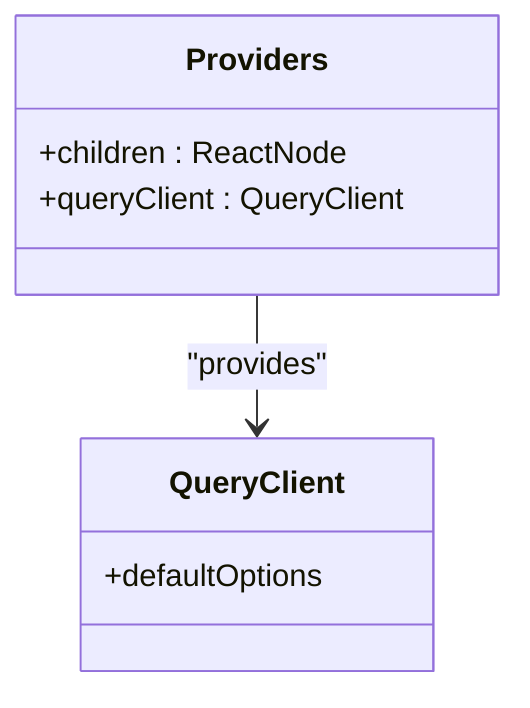
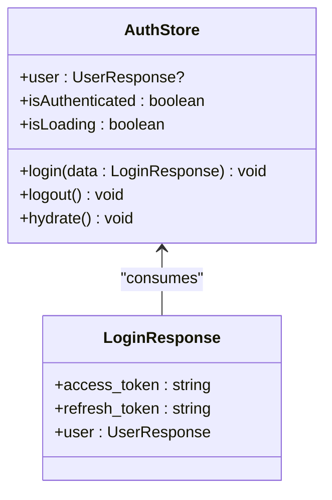
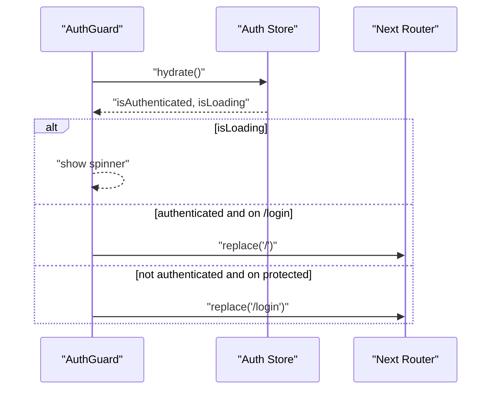
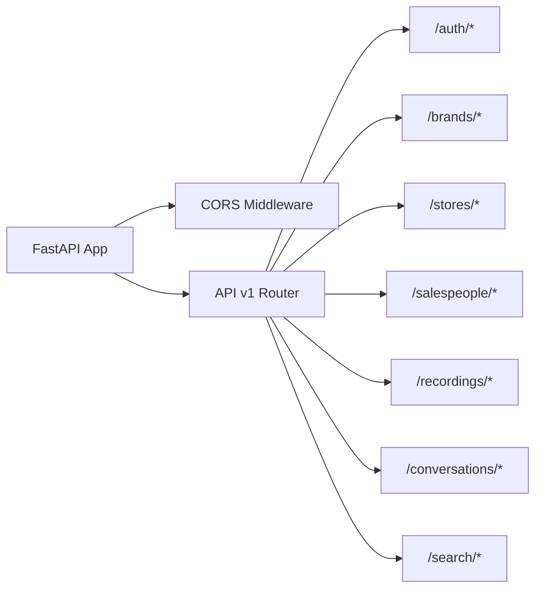
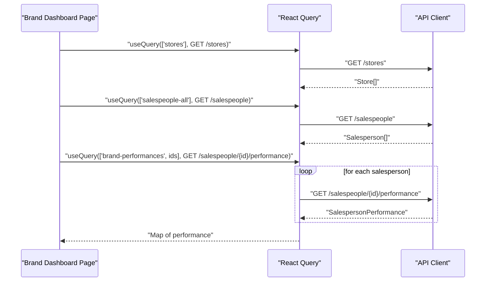
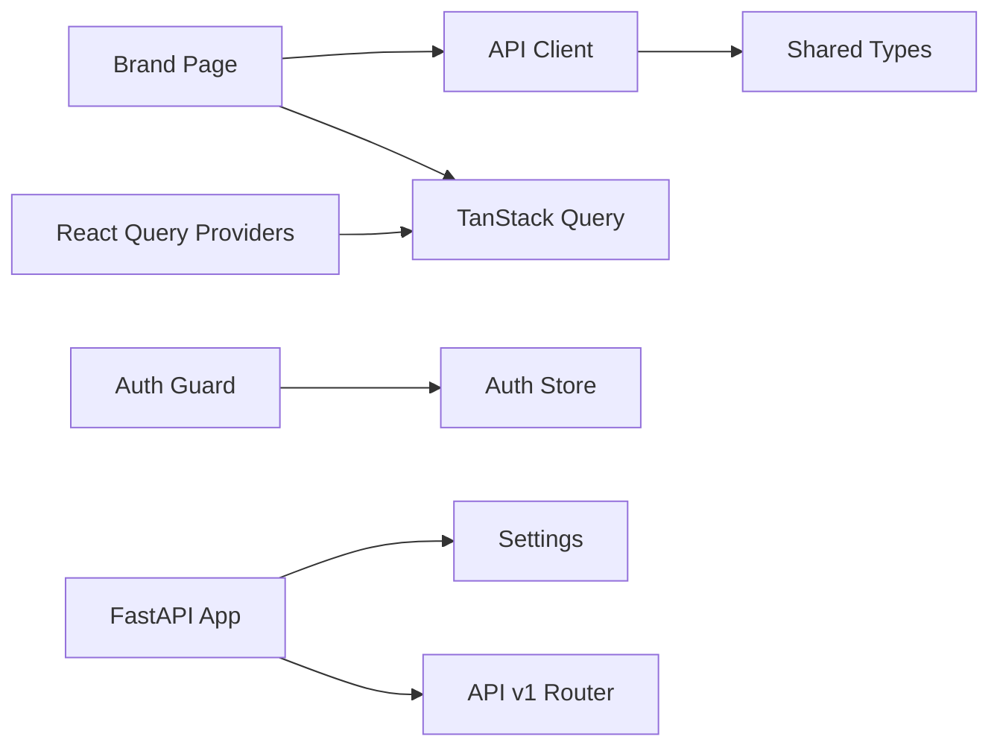

# API Integration & Data Fetching

<cite>
**Referenced Files in This Document**
- [api-client.ts](file://apps/web/src/lib/api-client.ts)
- [providers.tsx](file://apps/web/src/components/providers.tsx)
- [auth.ts](file://apps/web/src/store/auth.ts)
- [auth-guard.tsx](file://apps/web/src/components/auth-guard.tsx)
- [middleware.ts](file://apps/web/src/middleware.ts)
- [page.tsx](file://apps/web/src/app/page.tsx)
- [brand/page.tsx](file://apps/web/src/app/(dashboard)/brand/page.tsx)
- [api-types.ts](file://packages/shared/src/api-types.ts)
- [constants.ts](file://packages/shared/src/constants.ts)
- [main.py](file://apps/api/src/main.py)
- [router.py](file://apps/api/src/api/v1/router.py)
- [config.py](file://apps/api/src/config.py)
</cite>

## Table of Contents
1. [Introduction](#introduction)
2. [Project Structure](#project-structure)
3. [Core Components](#core-components)
4. [Architecture Overview](#architecture-overview)
5. [Detailed Component Analysis](#detailed-component-analysis)
6. [Dependency Analysis](#dependency-analysis)
7. [Performance Considerations](#performance-considerations)
8. [Troubleshooting Guide](#troubleshooting-guide)
9. [Conclusion](#conclusion)
10. [Appendices](#appendices)

## Introduction
This document explains the API integration layer and data fetching patterns powering the dashboard. It covers the custom HTTP client configuration, authentication token injection, request retry logic, error handling strategies, and how the frontend integrates with the backend API. It also documents caching and staleness policies, optimistic update patterns, loading states, and user feedback mechanisms. Finally, it provides guidelines for adding new API endpoints, implementing custom hooks, and handling real-time updates, along with performance optimization techniques.

## Project Structure
The frontend integrates with a FastAPI backend through a thin TypeScript HTTP client. Data fetching is powered by TanStack React Query with centralized providers. Authentication state is managed with Zustand and persisted in localStorage. The backend exposes a versioned API router with CORS configured.

**Diagram sources**
- [providers.tsx:1-26](file://apps/web/src/components/providers.tsx#L1-L26)
- [auth.ts:1-49](file://apps/web/src/store/auth.ts#L1-L49)
- [api-client.ts:1-114](file://apps/web/src/lib/api-client.ts#L1-L114)
- [main.py:1-29](file://apps/api/src/main.py#L1-L29)
- [router.py:1-20](file://apps/api/src/api/v1/router.py#L1-L20)
- [config.py:1-52](file://apps/api/src/config.py#L1-L52)

**Section sources**
- [providers.tsx:1-26](file://apps/web/src/components/providers.tsx#L1-L26)
- [auth.ts:1-49](file://apps/web/src/store/auth.ts#L1-L49)
- [api-client.ts:1-114](file://apps/web/src/lib/api-client.ts#L1-L114)
- [main.py:1-29](file://apps/api/src/main.py#L1-L29)
- [router.py:1-20](file://apps/api/src/api/v1/router.py#L1-L20)
- [config.py:1-52](file://apps/api/src/config.py#L1-L52)

## Core Components
- API Client: Centralized HTTP client with automatic Authorization header injection, token refresh on 401, JSON serialization, and structured error handling.
- React Query Providers: Global cache configuration with staleTime and retry defaults.
- Auth Store: Client-side authentication state and hydration from localStorage.
- Auth Guard: Client-side route protection and redirect logic.
- Backend API: Versioned routes under /api/v1 with CORS enabled.

Key behaviors:
- Token injection: Authorization header is added when present in localStorage.
- Retry on 401: On unauthorized responses, the client attempts a token refresh and retries once.
- Error normalization: Non-2xx responses raise a typed ApiError with status and message.
- No-content handling: 204 responses return undefined.
- Query defaults: Stale time and retry configured globally.

**Section sources**
- [api-client.ts:13-114](file://apps/web/src/lib/api-client.ts#L13-L114)
- [providers.tsx:7-18](file://apps/web/src/components/providers.tsx#L7-L18)
- [auth.ts:15-48](file://apps/web/src/store/auth.ts#L15-L48)
- [auth-guard.tsx:9-39](file://apps/web/src/components/auth-guard.tsx#L9-L39)
- [main.py:15-21](file://apps/api/src/main.py#L15-L21)
- [router.py:11-20](file://apps/api/src/api/v1/router.py#L11-L20)

## Architecture Overview
The frontend composes a typed API client with React Query for caching and background refetching. Authentication state is hydrated on app load and enforced by the AuthGuard. Requests flow through the API client, which manages tokens and errors. The backend enforces CORS and exposes versioned endpoints.

**Diagram sources**
- [brand/page.tsx:20-29](file://apps/web/src/app/(dashboard)/brand/page.tsx#L20-L29)
- [api-client.ts:39-92](file://apps/web/src/lib/api-client.ts#L39-L92)
- [auth.ts:15-25](file://apps/web/src/store/auth.ts#L15-L25)
- [main.py:15-21](file://apps/api/src/main.py#L15-L21)

## Detailed Component Analysis

### API Client: Configuration, Interceptors, and Error Handling
- Base URL: Determined from environment variable with a fallback.
- Headers:
  - Authorization: Bearer token injected when present.
  - Content-Type: application/json unless body is FormData.
- Retry logic:
  - On 401 Unauthorized and when retry flag allows, attempts refresh via POST /auth/refresh, updates localStorage, and retries once.
  - On refresh failure, clears auth tokens and redirects to login.
- Error handling:
  - Parses optional JSON detail for readable messages.
  - Throws a typed ApiError with status and detail.
- Special cases:
  - 204 No Content returns undefined.

**Diagram sources**
- [api-client.ts:39-92](file://apps/web/src/lib/api-client.ts#L39-L92)

**Section sources**
- [api-client.ts:1-114](file://apps/web/src/lib/api-client.ts#L1-L114)

### React Query Providers: Caching and Retry Defaults
- Global defaults:
  - staleTime: 30 seconds
  - retry: 1 attempt
- Provider wraps the app to enable caching and background refetching across pages.

**Diagram sources**
- [providers.tsx:7-18](file://apps/web/src/components/providers.tsx#L7-L18)

**Section sources**
- [providers.tsx:1-26](file://apps/web/src/components/providers.tsx#L1-L26)

### Authentication Store: Hydration and State Management
- Stores:
  - user, isAuthenticated, isLoading
- Actions:
  - login: persist tokens and user, set state
  - logout: remove tokens and user, reset state
  - hydrate: restore state from localStorage on app load
- Used by AuthGuard and pages for routing and rendering.

**Diagram sources**
- [auth.ts:6-48](file://apps/web/src/store/auth.ts#L6-L48)
- [api-types.ts:26-28](file://packages/shared/src/api-types.ts#L26-L28)

**Section sources**
- [auth.ts:1-49](file://apps/web/src/store/auth.ts#L1-L49)
- [api-types.ts:17-28](file://packages/shared/src/api-types.ts#L17-L28)

### Auth Guard: Route Protection and Redirects
- Hydrates auth state on mount.
- Redirects:
  - Unauthenticated users away from protected routes to /login.
  - Authenticated users from /login to role-appropriate dashboard.
- Loading state renders a spinner until hydration completes.

**Diagram sources**
- [auth-guard.tsx:9-28](file://apps/web/src/components/auth-guard.tsx#L9-L28)
- [auth.ts:15-48](file://apps/web/src/store/auth.ts#L15-L48)
- [page.tsx:7-33](file://apps/web/src/app/page.tsx#L7-L33)

**Section sources**
- [auth-guard.tsx:1-40](file://apps/web/src/components/auth-guard.tsx#L1-L40)
- [auth.ts:1-49](file://apps/web/src/store/auth.ts#L1-L49)
- [page.tsx:1-40](file://apps/web/src/app/page.tsx#L1-L40)

### Backend API: CORS and Routing
- CORS: Configured from settings with allow credentials and wildcard methods/headers.
- Router: Prefixes all routes with /api/v1 and mounts sub-routers for auth, brands, stores, salespeople, recordings, conversations, and search.

**Diagram sources**
- [main.py:15-21](file://apps/api/src/main.py#L15-L21)
- [router.py:11-20](file://apps/api/src/api/v1/router.py#L11-L20)
- [config.py:46-48](file://apps/api/src/config.py#L46-L48)

**Section sources**
- [main.py:1-29](file://apps/api/src/main.py#L1-L29)
- [router.py:1-20](file://apps/api/src/api/v1/router.py#L1-L20)
- [config.py:1-52](file://apps/api/src/config.py#L1-L52)

### Data Fetching Patterns: Queries and Aggregation
- Example usage:
  - Stores and salespeople lists fetched via api.get with React Query keys.
  - Performance per salesperson computed by aggregating multiple GET requests.
  - Conditional queries enabled only when dependent data is ready.
- Rendering:
  - KPI cards and tables render aggregated metrics.
  - Coaching alerts highlight underperforming salespeople.

**Diagram sources**
- [brand/page.tsx:20-53](file://apps/web/src/app/(dashboard)/brand/page.tsx#L20-L53)
- [api-client.ts:94-111](file://apps/web/src/lib/api-client.ts#L94-L111)

**Section sources**
- [brand/page.tsx:1-233](file://apps/web/src/app/(dashboard)/brand/page.tsx#L1-L233)

### Error Handling Strategies
- Frontend:
  - ApiError thrown for non-2xx responses; detail derived from JSON body when available.
  - 401 triggers token refresh; on failure, auth state cleared and user redirected.
- Backend:
  - CORS misconfiguration mitigated by explicit allow-list from settings.
- Recommendations:
  - Wrap actions in error boundaries to surface user-friendly messages.
  - Use query error states to show contextual feedback.

**Section sources**
- [api-client.ts:77-86](file://apps/web/src/lib/api-client.ts#L77-L86)
- [api-client.ts:64-75](file://apps/web/src/lib/api-client.ts#L64-L75)
- [main.py:15-21](file://apps/api/src/main.py#L15-L21)

### Authentication Token Injection and Session Management
- Token injection: Authorization header added automatically by the API client.
- Token refresh: On 401, client calls /auth/refresh and retries once.
- State persistence: Tokens and user info stored in localStorage; hydrated on app load.
- Route protection: AuthGuard enforces redirects based on authentication and role.

**Section sources**
- [api-client.ts:44-51](file://apps/web/src/lib/api-client.ts#L44-L51)
- [api-client.ts:18-37](file://apps/web/src/lib/api-client.ts#L18-L37)
- [auth.ts:20-32](file://apps/web/src/store/auth.ts#L20-L32)
- [auth-guard.tsx:18-28](file://apps/web/src/components/auth-guard.tsx#L18-L28)

### Caching Strategies and Staleness
- Global cache policy:
  - staleTime: 30 seconds
  - retry: 1
- Implications:
  - Queries become fresh after 30s; background refetch occurs automatically.
  - Network failures trigger a single retry before surfacing errors.
- Recommendations:
  - Tune staleTime per endpoint based on data volatility.
  - Use queryKey granularity to avoid unnecessary cache misses.

**Section sources**
- [providers.tsx:10-17](file://apps/web/src/components/providers.tsx#L10-L17)

### Optimistic Updates and Real-Time Data
- Current state:
  - Data fetching is read-heavy with React Query managing cache invalidation.
- Recommended patterns:
  - For write operations, use React Query’s mutation APIs to optimistically update the UI and roll back on failure.
  - For real-time updates, integrate WebSocket connections alongside polling or server-sent events; maintain a separate cache partition for live streams.

[No sources needed since this section provides general guidance]

### Utility Functions for Data Transformation, Formatting, and Validation
- UI utilities:
  - cn: Tailwind class merging utility.
- Data types and constants:
  - Shared types for auth, entities, transcripts, conversations, metrics, and search.
  - Constants for roles, statuses, outcomes, audio formats, and duration bounds.

**Section sources**
- [utils.ts:1-7](file://apps/web/src/lib/utils.ts#L1-L7)
- [api-types.ts:1-228](file://packages/shared/src/api-types.ts#L1-L228)
- [constants.ts:1-40](file://packages/shared/src/constants.ts#L1-L40)

### Examples: Consuming Endpoints, Mapping Data, and State Synchronization
- Endpoint consumption:
  - GET /stores and GET /salespeople via api.get.
  - GET /salespeople/{id}/performance for per-user metrics.
- Data mapping:
  - Aggregate counts and averages from performance maps.
  - Render badges and tables with computed values.
- State synchronization:
  - AuthStore hydrates on load; AuthGuard redirects accordingly.
  - React Query caches responses; staleTime controls freshness.

**Section sources**
- [brand/page.tsx:20-53](file://apps/web/src/app/(dashboard)/brand/page.tsx#L20-L53)
- [auth.ts:34-47](file://apps/web/src/store/auth.ts#L34-L47)
- [auth-guard.tsx:14-28](file://apps/web/src/components/auth-guard.tsx#L14-L28)

### Guidelines: Adding New API Endpoints, Hooks, and Real-Time Updates
- Add a new endpoint:
  - Define types in the shared package for request/response shapes.
  - Implement the route in the backend under /api/v1.
  - Expose it via the v1 router.
- Implement a custom hook:
  - Wrap api.get/post/put/delete with a typed hook returning data and query state.
  - Use queryKey to scope cache and enable targeted invalidations.
- Real-time updates:
  - Introduce a WebSocket connection; merge incoming events into the existing cache.
  - Keep a separate cache partition for live data to avoid interfering with regular queries.

**Section sources**
- [api-types.ts:1-228](file://packages/shared/src/api-types.ts#L1-L228)
- [router.py:11-20](file://apps/api/src/api/v1/router.py#L11-L20)
- [providers.tsx:10-17](file://apps/web/src/components/providers.tsx#L10-L17)

## Dependency Analysis
- Frontend depends on:
  - API client for HTTP transport.
  - React Query for caching and refetching.
  - Auth store for state and hydration.
  - Shared types for type safety.
- Backend depends on:
  - Settings for CORS and runtime configuration.
  - Router composition for endpoint exposure.

**Diagram sources**
- [api-client.ts:1-114](file://apps/web/src/lib/api-client.ts#L1-L114)
- [providers.tsx:1-26](file://apps/web/src/components/providers.tsx#L1-L26)
- [auth-guard.tsx:1-40](file://apps/web/src/components/auth-guard.tsx#L1-L40)
- [brand/page.tsx:1-233](file://apps/web/src/app/(dashboard)/brand/page.tsx#L1-L233)
- [api-types.ts:1-228](file://packages/shared/src/api-types.ts#L1-L228)
- [main.py:1-29](file://apps/api/src/main.py#L1-L29)
- [router.py:1-20](file://apps/api/src/api/v1/router.py#L1-L20)
- [config.py:1-52](file://apps/api/src/config.py#L1-L52)

**Section sources**
- [api-client.ts:1-114](file://apps/web/src/lib/api-client.ts#L1-L114)
- [providers.tsx:1-26](file://apps/web/src/components/providers.tsx#L1-L26)
- [auth-guard.tsx:1-40](file://apps/web/src/components/auth-guard.tsx#L1-L40)
- [brand/page.tsx:1-233](file://apps/web/src/app/(dashboard)/brand/page.tsx#L1-L233)
- [api-types.ts:1-228](file://packages/shared/src/api-types.ts#L1-L228)
- [main.py:1-29](file://apps/api/src/main.py#L1-L29)
- [router.py:1-20](file://apps/api/src/api/v1/router.py#L1-L20)
- [config.py:1-52](file://apps/api/src/config.py#L1-L52)

## Performance Considerations
- Request deduplication: React Query deduplicates concurrent identical queries by default.
- Staleness and refetch: Set appropriate staleTime to balance freshness and network usage.
- Retry strategy: Limit retries to avoid thundering herds; consider exponential backoff at the caller level if needed.
- Payload size: Prefer pagination and filtering to reduce payload sizes.
- Offline handling: Persist critical data in localStorage or IndexedDB; disable writes when offline and queue mutations.

[No sources needed since this section provides general guidance]

## Troubleshooting Guide
- 401 Unauthorized:
  - Verify tokens in localStorage; ensure refresh endpoint is reachable.
  - Confirm CORS allows credentials and the correct origins.
- CORS errors:
  - Check allow-origin list and credentials settings.
- Type mismatches:
  - Align frontend types with backend schemas; use shared types to prevent drift.
- Slow initial load:
  - Adjust staleTime and prefetch strategies; consider background refetch timing.

**Section sources**
- [api-client.ts:64-75](file://apps/web/src/lib/api-client.ts#L64-L75)
- [main.py:15-21](file://apps/api/src/main.py#L15-L21)
- [config.py:46-48](file://apps/api/src/config.py#L46-L48)
- [api-types.ts:1-228](file://packages/shared/src/api-types.ts#L1-L228)

## Conclusion
The integration layer combines a focused API client, robust authentication, and React Query caching to deliver responsive data flows. By leveraging typed shared models, global cache defaults, and guard-based routing, the system balances reliability and performance. Extending the API requires updating shared types, backend routes, and frontend consumers consistently, while real-time enhancements can be layered on top of the existing caching infrastructure.

## Appendices
- Environment variables:
  - NEXT_PUBLIC_API_URL: Base URL for the backend API.
- Middleware behavior:
  - Public paths allowed; static assets and API routes bypass checks; server-side auth enforcement deferred to client.

**Section sources**
- [api-client.ts:1](file://apps/web/src/lib/api-client.ts#L1)
- [middleware.ts:4-27](file://apps/web/src/middleware.ts#L4-L27)