# Application Architecture & Routing

<cite>
**Referenced Files in This Document**
- [apps/web/src/middleware.ts](file://apps/web/src/middleware.ts)
- [apps/web/src/app/layout.tsx](file://apps/web/src/app/layout.tsx)
- [apps/web/src/app/(dashboard)/layout.tsx](file://apps/web/src/app/(dashboard)/layout.tsx)
- [apps/web/src/components/layout/sidebar.tsx](file://apps/web/src/components/layout/sidebar.tsx)
- [apps/web/src/components/auth-guard.tsx](file://apps/web/src/components/auth-guard.tsx)
- [apps/web/src/components/providers.tsx](file://apps/web/src/components/providers.tsx)
- [apps/web/src/store/auth.ts](file://apps/web/src/store/auth.ts)
- [apps/web/src/app/(auth)/login/page.tsx](file://apps/web/src/app/(auth)/login/page.tsx)
- [apps/web/src/app/page.tsx](file://apps/web/src/app/page.tsx)
- [apps/web/src/app/(dashboard)/brand/page.tsx](file://apps/web/src/app/(dashboard)/brand/page.tsx)
- [apps/web/src/app/(dashboard)/recordings/page.tsx](file://apps/web/src/app/(dashboard)/recordings/page.tsx)
- [apps/web/src/app/(dashboard)/salesperson/[id]/page.tsx](file://apps/web/src/app/(dashboard)/salesperson/[id]/page.tsx)
- [apps/web/src/app/(dashboard)/stores/page.tsx](file://apps/web/src/app/(dashboard)/stores/page.tsx)
- [apps/web/src/lib/api-client.ts](file://apps/web/src/lib/api-client.ts)
- [apps/web/src/lib/utils.ts](file://apps/web/src/lib/utils.ts)
- [apps/web/next.config.ts](file://apps/web/next.config.ts)
</cite>

## Table of Contents
1. [Introduction](#introduction)
2. [Project Structure](#project-structure)
3. [Core Components](#core-components)
4. [Architecture Overview](#architecture-overview)
5. [Detailed Component Analysis](#detailed-component-analysis)
6. [Dependency Analysis](#dependency-analysis)
7. [Performance Considerations](#performance-considerations)
8. [Troubleshooting Guide](#troubleshooting-guide)
9. [Conclusion](#conclusion)
10. [Appendices](#appendices)

## Introduction
This document explains the Next.js 16 application architecture and routing system for the web application. It covers the App Router configuration, file-based routing patterns, layout hierarchy, middleware for authentication and authorization, global layout structure, nested route groups, dynamic routing, sidebar navigation, route protection, authentication guards, responsive design and accessibility, and guidelines for extending routes and managing data fetching.

## Project Structure
The web application follows Next.js App Router conventions with:
- A root App Router under apps/web/src/app
- Route groups to organize dashboards and authentication views
- A global root layout and a dashboard layout wrapper
- A client-side AuthGuard and Zustand-backed auth store
- Middleware for early request filtering
- UI providers for TanStack Query and tooltips
- A reusable Tailwind utility helper

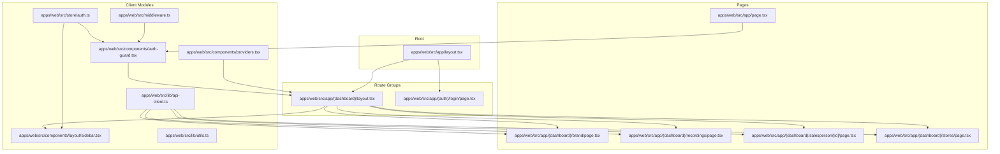

**Diagram sources**
- [apps/web/src/app/layout.tsx:1-37](file://apps/web/src/app/layout.tsx#L1-L37)
- [apps/web/src/app/(dashboard)/layout.tsx](file://apps/web/src/app/(dashboard)/layout.tsx#L1-L22)
- [apps/web/src/app/(auth)/login/page.tsx](file://apps/web/src/app/(auth)/login/page.tsx#L1-L91)
- [apps/web/src/app/page.tsx:1-41](file://apps/web/src/app/page.tsx#L1-L41)
- [apps/web/src/app/(dashboard)/brand/page.tsx](file://apps/web/src/app/(dashboard)/brand/page.tsx#L1-L233)
- [apps/web/src/app/(dashboard)/recordings/page.tsx](file://apps/web/src/app/(dashboard)/recordings/page.tsx#L1-L292)
- [apps/web/src/app/(dashboard)/salesperson/[id]/page.tsx](file://apps/web/src/app/(dashboard)/salesperson/[id]/page.tsx#L1-L363)
- [apps/web/src/app/(dashboard)/stores/page.tsx](file://apps/web/src/app/(dashboard)/stores/page.tsx#L1-L85)
- [apps/web/src/middleware.ts:1-32](file://apps/web/src/middleware.ts#L1-L32)
- [apps/web/src/components/auth-guard.tsx:1-40](file://apps/web/src/components/auth-guard.tsx#L1-L40)
- [apps/web/src/components/layout/sidebar.tsx:1-143](file://apps/web/src/components/layout/sidebar.tsx#L1-L143)
- [apps/web/src/components/providers.tsx:1-26](file://apps/web/src/components/providers.tsx#L1-L26)
- [apps/web/src/store/auth.ts:1-49](file://apps/web/src/store/auth.ts#L1-L49)
- [apps/web/src/lib/api-client.ts:1-114](file://apps/web/src/lib/api-client.ts#L1-L114)
- [apps/web/src/lib/utils.ts:1-7](file://apps/web/src/lib/utils.ts#L1-L7)

**Section sources**
- [apps/web/src/app/layout.tsx:1-37](file://apps/web/src/app/layout.tsx#L1-L37)
- [apps/web/src/app/(dashboard)/layout.tsx](file://apps/web/src/app/(dashboard)/layout.tsx#L1-L22)
- [apps/web/src/middleware.ts:1-32](file://apps/web/src/middleware.ts#L1-L32)

## Core Components
- Global root layout initializes fonts, metadata, and wraps children with Providers for TanStack Query and Tooltip provider.
- Dashboard layout composes AuthGuard and Sidebar, and renders the main content area.
- AuthGuard hydrates auth state, enforces redirects for authenticated/unauthenticated users, and shows a loading spinner during hydration.
- Auth store manages user, authentication state, and persistence via localStorage with Zustand.
- Middleware defines public paths and allows static assets/API routes to pass through; client-side auth enforcement is primary.
- Sidebar renders role-filtered navigation items and handles logout redirection.
- API client centralizes HTTP requests, token retrieval, automatic token refresh on 401, and error normalization.

**Section sources**
- [apps/web/src/app/layout.tsx:1-37](file://apps/web/src/app/layout.tsx#L1-L37)
- [apps/web/src/app/(dashboard)/layout.tsx](file://apps/web/src/app/(dashboard)/layout.tsx#L1-L22)
- [apps/web/src/components/auth-guard.tsx:1-40](file://apps/web/src/components/auth-guard.tsx#L1-L40)
- [apps/web/src/store/auth.ts:1-49](file://apps/web/src/store/auth.ts#L1-L49)
- [apps/web/src/middleware.ts:1-32](file://apps/web/src/middleware.ts#L1-L32)
- [apps/web/src/components/layout/sidebar.tsx:1-143](file://apps/web/src/components/layout/sidebar.tsx#L1-L143)
- [apps/web/src/lib/api-client.ts:1-114](file://apps/web/src/lib/api-client.ts#L1-L114)

## Architecture Overview
The application uses Next.js App Router with:
- File-system based routing under apps/web/src/app
- Route groups to separate (auth) and (dashboard) areas
- A root layout and a nested dashboard layout
- Client-side authentication guards and middleware for early request filtering
- UI providers for data fetching and tooltips
- A centralized API client with token refresh logic

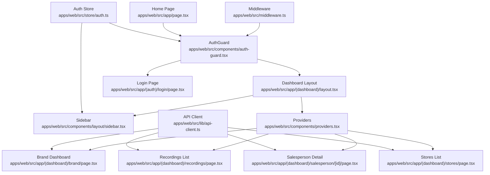

**Diagram sources**
- [apps/web/src/middleware.ts:1-32](file://apps/web/src/middleware.ts#L1-L32)
- [apps/web/src/components/auth-guard.tsx:1-40](file://apps/web/src/components/auth-guard.tsx#L1-L40)
- [apps/web/src/app/(dashboard)/layout.tsx](file://apps/web/src/app/(dashboard)/layout.tsx#L1-L22)
- [apps/web/src/components/layout/sidebar.tsx:1-143](file://apps/web/src/components/layout/sidebar.tsx#L1-L143)
- [apps/web/src/components/providers.tsx:1-26](file://apps/web/src/components/providers.tsx#L1-L26)
- [apps/web/src/app/(dashboard)/brand/page.tsx](file://apps/web/src/app/(dashboard)/brand/page.tsx#L1-L233)
- [apps/web/src/app/(dashboard)/recordings/page.tsx](file://apps/web/src/app/(dashboard)/recordings/page.tsx#L1-L292)
- [apps/web/src/app/(dashboard)/salesperson/[id]/page.tsx](file://apps/web/src/app/(dashboard)/salesperson/[id]/page.tsx#L1-L363)
- [apps/web/src/app/(dashboard)/stores/page.tsx](file://apps/web/src/app/(dashboard)/stores/page.tsx#L1-L85)
- [apps/web/src/app/(auth)/login/page.tsx](file://apps/web/src/app/(auth)/login/page.tsx#L1-L91)
- [apps/web/src/app/page.tsx:1-41](file://apps/web/src/app/page.tsx#L1-L41)
- [apps/web/src/lib/api-client.ts:1-114](file://apps/web/src/lib/api-client.ts#L1-L114)
- [apps/web/src/store/auth.ts:1-49](file://apps/web/src/store/auth.ts#L1-L49)

## Detailed Component Analysis

### Middleware Implementation
- Public paths: login is allowed without authentication.
- Static assets and API routes are bypassed.
- Server-side cannot read localStorage; auth checks occur client-side via AuthGuard.
- Matcher excludes static paths and favicon.

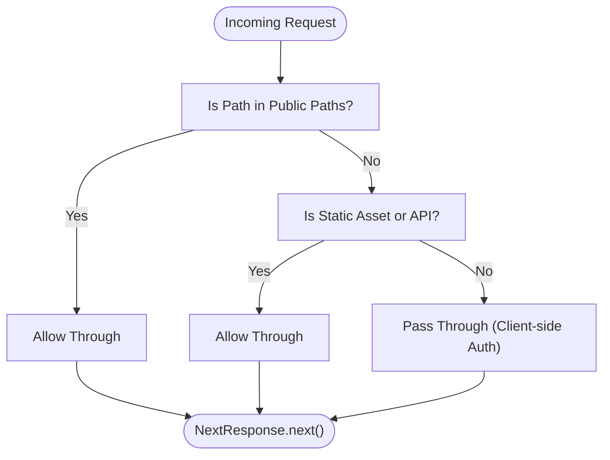

**Diagram sources**
- [apps/web/src/middleware.ts:1-32](file://apps/web/src/middleware.ts#L1-L32)

**Section sources**
- [apps/web/src/middleware.ts:1-32](file://apps/web/src/middleware.ts#L1-L32)

### Global Layout and Providers
- Root layout sets metadata, fonts, and wraps children in Providers.
- Providers initialize TanStack Query with a short stale time and retry policy, and wrap children in TooltipProvider.

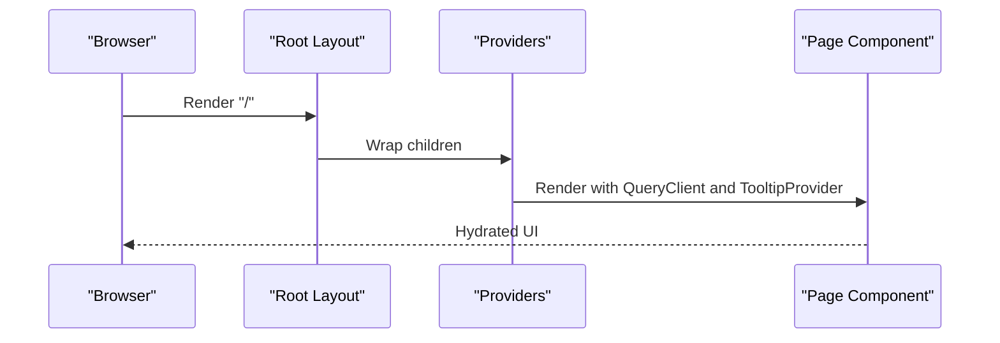

**Diagram sources**
- [apps/web/src/app/layout.tsx:1-37](file://apps/web/src/app/layout.tsx#L1-L37)
- [apps/web/src/components/providers.tsx:1-26](file://apps/web/src/components/providers.tsx#L1-L26)

**Section sources**
- [apps/web/src/app/layout.tsx:1-37](file://apps/web/src/app/layout.tsx#L1-L37)
- [apps/web/src/components/providers.tsx:1-26](file://apps/web/src/components/providers.tsx#L1-L26)

### Dashboard Layout and Sidebar
- Dashboard layout composes AuthGuard and Sidebar, and renders main content area.
- Sidebar filters navigation items by user role, highlights active item based on pathname, and logs out by clearing state and redirecting to login.

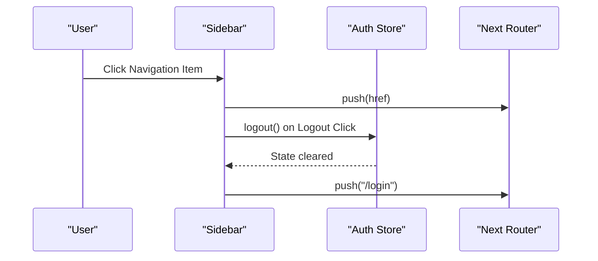

**Diagram sources**
- [apps/web/src/app/(dashboard)/layout.tsx](file://apps/web/src/app/(dashboard)/layout.tsx#L1-L22)
- [apps/web/src/components/layout/sidebar.tsx:1-143](file://apps/web/src/components/layout/sidebar.tsx#L1-L143)
- [apps/web/src/store/auth.ts:1-49](file://apps/web/src/store/auth.ts#L1-L49)

**Section sources**
- [apps/web/src/app/(dashboard)/layout.tsx](file://apps/web/src/app/(dashboard)/layout.tsx#L1-L22)
- [apps/web/src/components/layout/sidebar.tsx:1-143](file://apps/web/src/components/layout/sidebar.tsx#L1-L143)
- [apps/web/src/store/auth.ts:1-49](file://apps/web/src/store/auth.ts#L1-L49)

### Authentication Guards and State Management
- AuthGuard hydrates auth state on mount, redirects unauthenticated users away from protected routes, and redirects authenticated users away from login.
- Auth store persists tokens and user in localStorage, hydrates on load, and exposes login/logout/hydrate actions.
- Home page hydrates and redirects based on user role to appropriate dashboard.

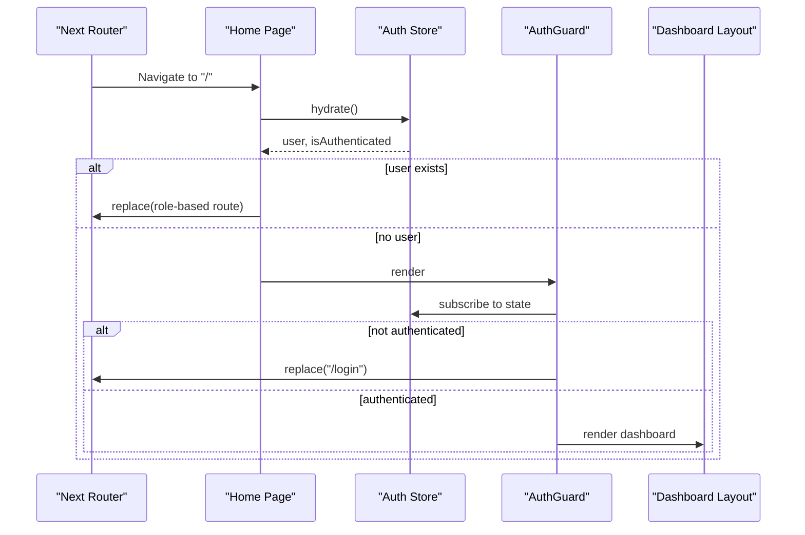

**Diagram sources**
- [apps/web/src/app/page.tsx:1-41](file://apps/web/src/app/page.tsx#L1-L41)
- [apps/web/src/components/auth-guard.tsx:1-40](file://apps/web/src/components/auth-guard.tsx#L1-L40)
- [apps/web/src/store/auth.ts:1-49](file://apps/web/src/store/auth.ts#L1-L49)
- [apps/web/src/app/(dashboard)/layout.tsx](file://apps/web/src/app/(dashboard)/layout.tsx#L1-L22)

**Section sources**
- [apps/web/src/app/page.tsx:1-41](file://apps/web/src/app/page.tsx#L1-L41)
- [apps/web/src/components/auth-guard.tsx:1-40](file://apps/web/src/components/auth-guard.tsx#L1-L40)
- [apps/web/src/store/auth.ts:1-49](file://apps/web/src/store/auth.ts#L1-L49)

### API Client and Token Refresh
- Centralized request function with Authorization header injection.
- On 401, attempts token refresh using refresh token; if successful, retries the original request; otherwise clears auth state and redirects to login.
- Provides typed helpers for GET, POST, PUT, DELETE.

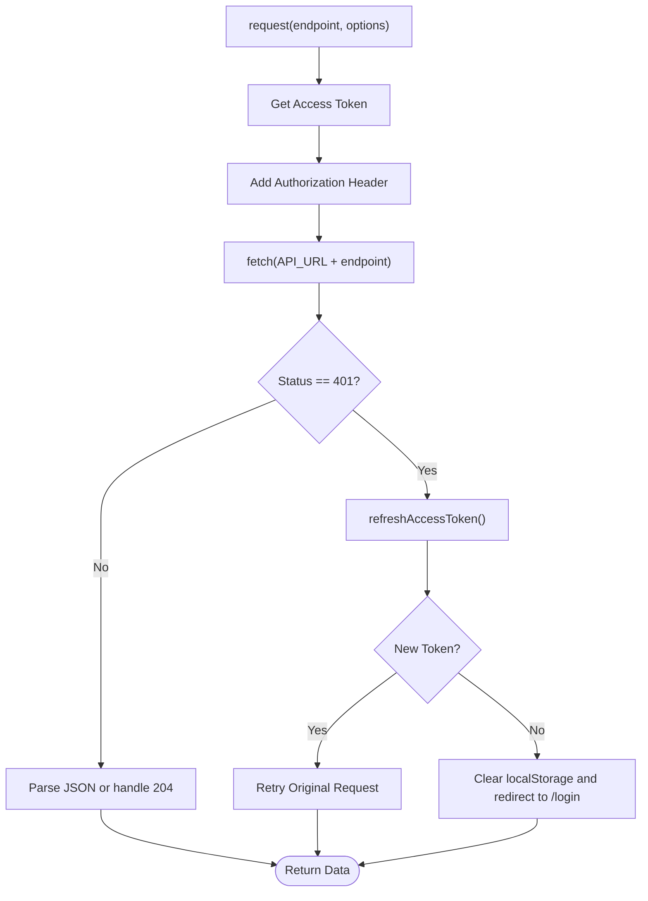

**Diagram sources**
- [apps/web/src/lib/api-client.ts:1-114](file://apps/web/src/lib/api-client.ts#L1-L114)

**Section sources**
- [apps/web/src/lib/api-client.ts:1-114](file://apps/web/src/lib/api-client.ts#L1-L114)

### Route Groups, Dynamic Routes, and Catch-All Segments
- Route group (dashboard) wraps shared layout and guards for dashboard pages.
- Dynamic route [id] under salesperson demonstrates dynamic routing with useParams and route-level data fetching.
- Catch-all segments are not present in the current codebase; optional catch-all patterns can be added by naming a folder [...slug] in the future.

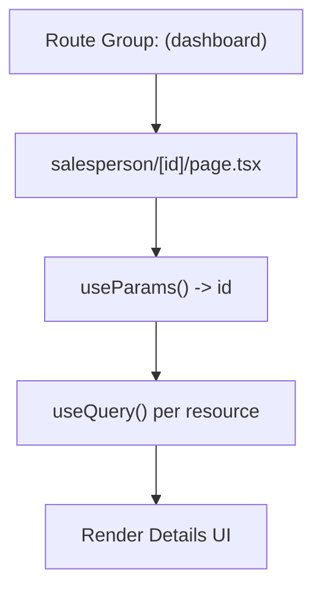

**Diagram sources**
- [apps/web/src/app/(dashboard)/salesperson/[id]/page.tsx](file://apps/web/src/app/(dashboard)/salesperson/[id]/page.tsx#L1-L363)

**Section sources**
- [apps/web/src/app/(dashboard)/salesperson/[id]/page.tsx](file://apps/web/src/app/(dashboard)/salesperson/[id]/page.tsx#L1-L363)

### Login Flow and Protected Routes
- Login page posts credentials to backend, stores tokens and user, then navigates to home.
- AuthGuard ensures protected routes are inaccessible without authentication.
- Middleware allows login to proceed without redirect.

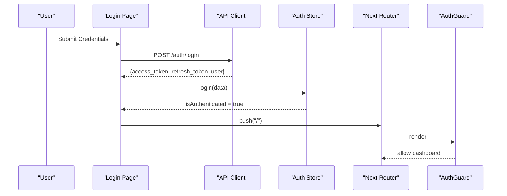

**Diagram sources**
- [apps/web/src/app/(auth)/login/page.tsx](file://apps/web/src/app/(auth)/login/page.tsx#L1-L91)
- [apps/web/src/lib/api-client.ts:1-114](file://apps/web/src/lib/api-client.ts#L1-L114)
- [apps/web/src/store/auth.ts:1-49](file://apps/web/src/store/auth.ts#L1-L49)
- [apps/web/src/components/auth-guard.tsx:1-40](file://apps/web/src/components/auth-guard.tsx#L1-L40)

**Section sources**
- [apps/web/src/app/(auth)/login/page.tsx](file://apps/web/src/app/(auth)/login/page.tsx#L1-L91)
- [apps/web/src/components/auth-guard.tsx:1-40](file://apps/web/src/components/auth-guard.tsx#L1-L40)
- [apps/web/src/middleware.ts:1-32](file://apps/web/src/middleware.ts#L1-L32)

### Route-Level Data Fetching Patterns
- Brand dashboard uses multiple queries to fetch stores, salespeople, and computed performance aggregates.
- Recordings page builds query params from filters and pagination, auto-refreshes while processing, and supports CSV export.
- Salesperson detail page composes several queries for profile, performance, recent recordings, and store breadcrumbs.

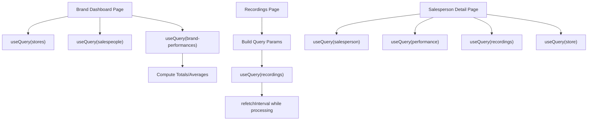

**Diagram sources**
- [apps/web/src/app/(dashboard)/brand/page.tsx](file://apps/web/src/app/(dashboard)/brand/page.tsx#L1-L233)
- [apps/web/src/app/(dashboard)/recordings/page.tsx](file://apps/web/src/app/(dashboard)/recordings/page.tsx#L1-L292)
- [apps/web/src/app/(dashboard)/salesperson/[id]/page.tsx](file://apps/web/src/app/(dashboard)/salesperson/[id]/page.tsx#L1-L363)

**Section sources**
- [apps/web/src/app/(dashboard)/brand/page.tsx](file://apps/web/src/app/(dashboard)/brand/page.tsx#L1-L233)
- [apps/web/src/app/(dashboard)/recordings/page.tsx](file://apps/web/src/app/(dashboard)/recordings/page.tsx#L1-L292)
- [apps/web/src/app/(dashboard)/salesperson/[id]/page.tsx](file://apps/web/src/app/(dashboard)/salesperson/[id]/page.tsx#L1-L363)

### Responsive Design and Accessibility
- Root layout applies Tailwind classes for typography and antialiasing.
- Components use semantic HTML and Tailwind utilities for spacing, color, and responsive grids.
- TooltipProvider enables accessible tooltips across the app.
- Sidebar and navigation use focus-friendly interactions and clear visual states.

**Section sources**
- [apps/web/src/app/layout.tsx:1-37](file://apps/web/src/app/layout.tsx#L1-L37)
- [apps/web/src/components/providers.tsx:1-26](file://apps/web/src/components/providers.tsx#L1-L26)
- [apps/web/src/components/layout/sidebar.tsx:1-143](file://apps/web/src/components/layout/sidebar.tsx#L1-L143)

## Dependency Analysis
- AuthGuard depends on Auth store and Next.js router hooks.
- Dashboard layout composes AuthGuard and Sidebar.
- Pages depend on API client for data fetching and TanStack Query for caching.
- Middleware is decoupled from auth logic and focuses on allowing public/static routes.

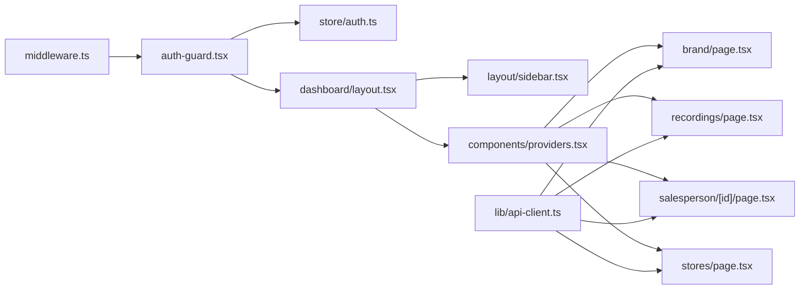

**Diagram sources**
- [apps/web/src/middleware.ts:1-32](file://apps/web/src/middleware.ts#L1-L32)
- [apps/web/src/components/auth-guard.tsx:1-40](file://apps/web/src/components/auth-guard.tsx#L1-L40)
- [apps/web/src/store/auth.ts:1-49](file://apps/web/src/store/auth.ts#L1-L49)
- [apps/web/src/app/(dashboard)/layout.tsx](file://apps/web/src/app/(dashboard)/layout.tsx#L1-L22)
- [apps/web/src/components/layout/sidebar.tsx:1-143](file://apps/web/src/components/layout/sidebar.tsx#L1-L143)
- [apps/web/src/components/providers.tsx:1-26](file://apps/web/src/components/providers.tsx#L1-L26)
- [apps/web/src/app/(dashboard)/brand/page.tsx](file://apps/web/src/app/(dashboard)/brand/page.tsx#L1-L233)
- [apps/web/src/app/(dashboard)/recordings/page.tsx](file://apps/web/src/app/(dashboard)/recordings/page.tsx#L1-L292)
- [apps/web/src/app/(dashboard)/salesperson/[id]/page.tsx](file://apps/web/src/app/(dashboard)/salesperson/[id]/page.tsx#L1-L363)
- [apps/web/src/app/(dashboard)/stores/page.tsx](file://apps/web/src/app/(dashboard)/stores/page.tsx#L1-L85)
- [apps/web/src/lib/api-client.ts:1-114](file://apps/web/src/lib/api-client.ts#L1-L114)

**Section sources**
- [apps/web/src/middleware.ts:1-32](file://apps/web/src/middleware.ts#L1-L32)
- [apps/web/src/components/auth-guard.tsx:1-40](file://apps/web/src/components/auth-guard.tsx#L1-L40)
- [apps/web/src/store/auth.ts:1-49](file://apps/web/src/store/auth.ts#L1-L49)
- [apps/web/src/app/(dashboard)/layout.tsx](file://apps/web/src/app/(dashboard)/layout.tsx#L1-L22)
- [apps/web/src/components/layout/sidebar.tsx:1-143](file://apps/web/src/components/layout/sidebar.tsx#L1-L143)
- [apps/web/src/components/providers.tsx:1-26](file://apps/web/src/components/providers.tsx#L1-L26)
- [apps/web/src/lib/api-client.ts:1-114](file://apps/web/src/lib/api-client.ts#L1-L114)

## Performance Considerations
- TanStack Query default options include a short stale time and retry to balance freshness and resilience.
- Auto-refetch intervals for long-running jobs reduce manual polling.
- Utility helper merges Tailwind classes efficiently to avoid redundant styles.

**Section sources**
- [apps/web/src/components/providers.tsx:1-26](file://apps/web/src/components/providers.tsx#L1-L26)
- [apps/web/src/app/(dashboard)/recordings/page.tsx](file://apps/web/src/app/(dashboard)/recordings/page.tsx#L89-L103)
- [apps/web/src/lib/utils.ts:1-7](file://apps/web/src/lib/utils.ts#L1-L7)

## Troubleshooting Guide
- If users are stuck on the login screen despite being authenticated, verify AuthGuard hydration and pathname checks.
- If protected routes redirect unexpectedly, confirm middleware matcher exclusions and AuthGuard logic.
- If API calls fail with 401, ensure refresh token logic executes and localStorage is cleared on failure.
- If navigation does not highlight active item, check pathname matching logic in Sidebar.

**Section sources**
- [apps/web/src/components/auth-guard.tsx:1-40](file://apps/web/src/components/auth-guard.tsx#L1-L40)
- [apps/web/src/middleware.ts:1-32](file://apps/web/src/middleware.ts#L1-L32)
- [apps/web/src/lib/api-client.ts:1-114](file://apps/web/src/lib/api-client.ts#L1-L114)
- [apps/web/src/components/layout/sidebar.tsx:1-143](file://apps/web/src/components/layout/sidebar.tsx#L1-L143)

## Conclusion
The application leverages Next.js App Router with route groups, a robust client-side auth guard, and a centralized API client with token refresh. The dashboard layout composes shared UI and guards, while pages implement route-level data fetching with TanStack Query. Middleware provides early filtering for public paths and static assets. The design emphasizes responsiveness and accessibility through Tailwind utilities and TooltipProvider.

## Appendices

### Adding New Routes
- Place page components under apps/web/src/app following file-system routing conventions.
- Use route groups to share layouts and guards for related pages.
- Wrap pages with AuthGuard when access control is required.
- Implement route-level data fetching with useQuery and manage query keys consistently.

**Section sources**
- [apps/web/src/app/(dashboard)/layout.tsx](file://apps/web/src/app/(dashboard)/layout.tsx#L1-L22)
- [apps/web/src/components/auth-guard.tsx:1-40](file://apps/web/src/components/auth-guard.tsx#L1-L40)
- [apps/web/src/lib/api-client.ts:1-114](file://apps/web/src/lib/api-client.ts#L1-L114)

### Implementing Nested Layouts
- Create a new route group under apps/web/src/app/(group-name) and export a layout.tsx.
- Compose shared components like AuthGuard and Sidebar inside the layout.
- Nest pages under the group to inherit the layout.

**Section sources**
- [apps/web/src/app/(dashboard)/layout.tsx](file://apps/web/src/app/(dashboard)/layout.tsx#L1-L22)

### Managing Route-Level Data Fetching
- Use useQuery with explicit query keys and enabled flags for dependent queries.
- Leverage refetchInterval for polling long-running jobs.
- Centralize HTTP logic in the API client to standardize error handling and token refresh.

**Section sources**
- [apps/web/src/app/(dashboard)/brand/page.tsx](file://apps/web/src/app/(dashboard)/brand/page.tsx#L1-L233)
- [apps/web/src/app/(dashboard)/recordings/page.tsx](file://apps/web/src/app/(dashboard)/recordings/page.tsx#L89-L103)
- [apps/web/src/lib/api-client.ts:1-114](file://apps/web/src/lib/api-client.ts#L1-L114)