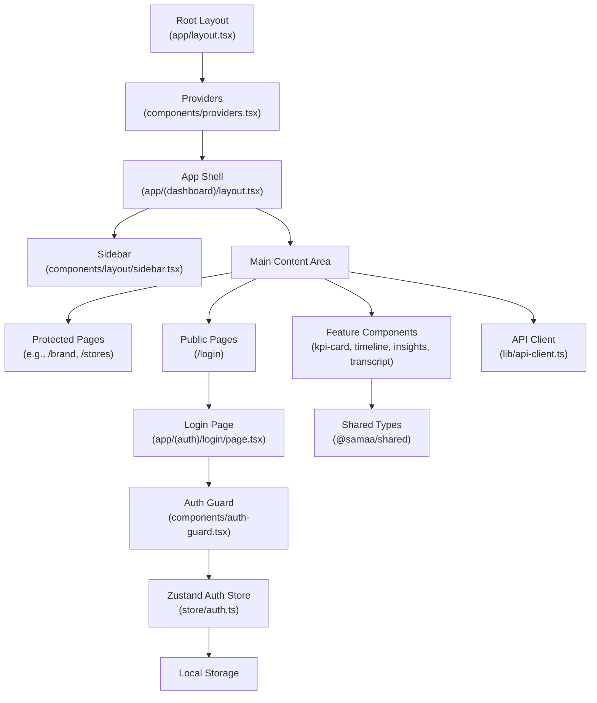
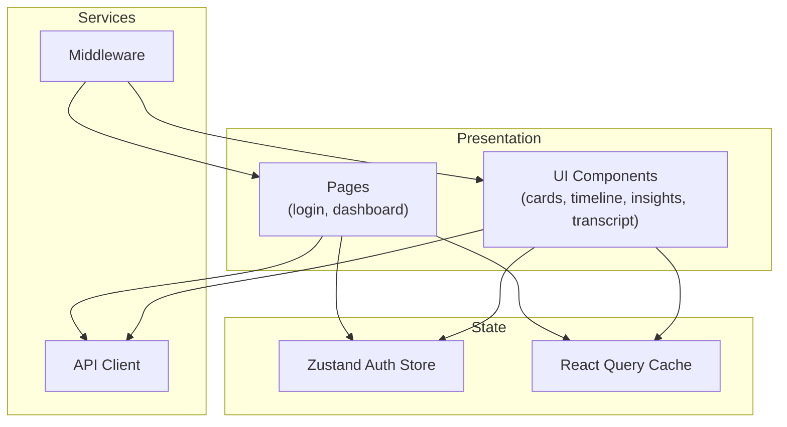
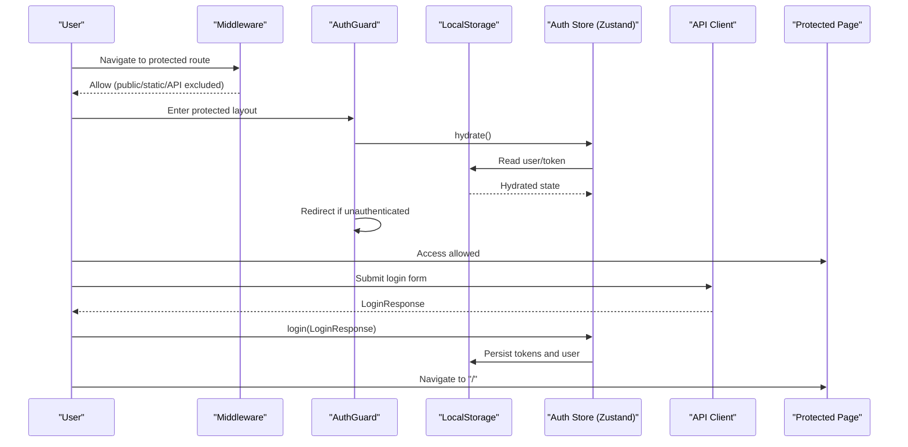
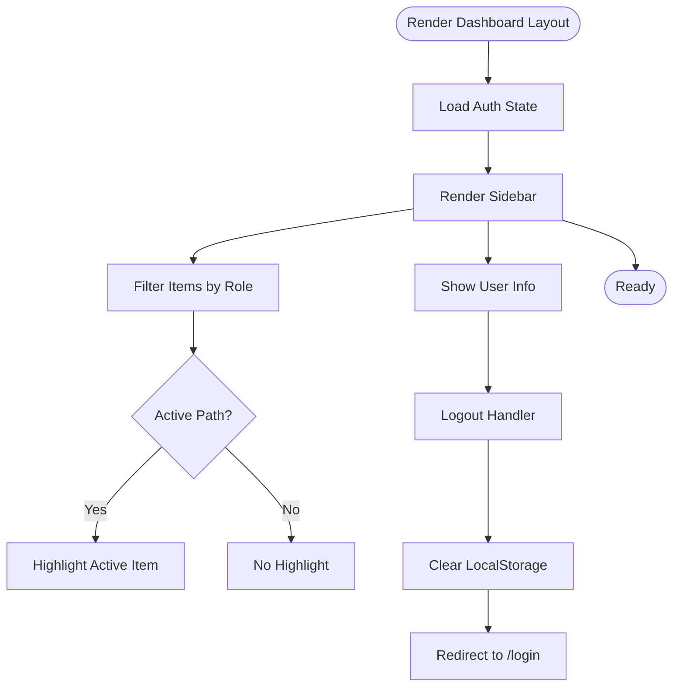
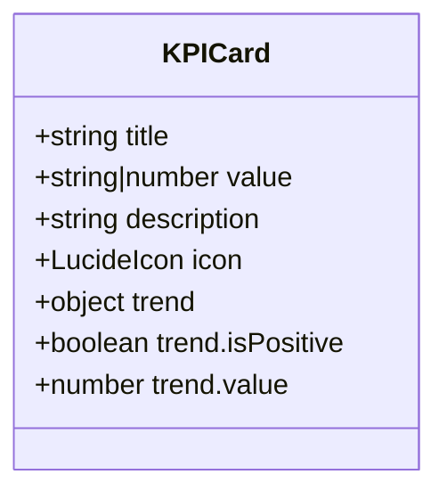
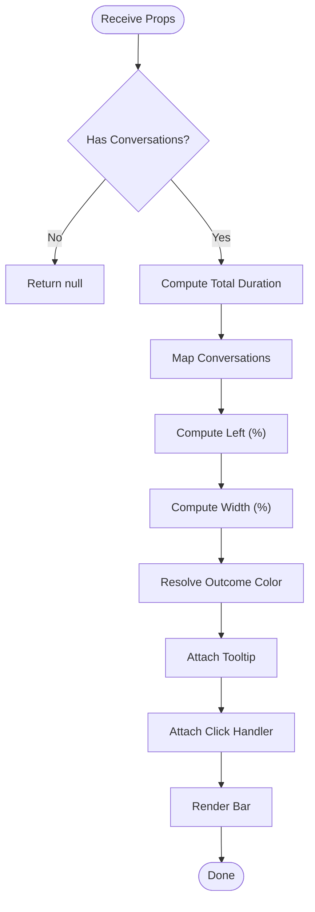
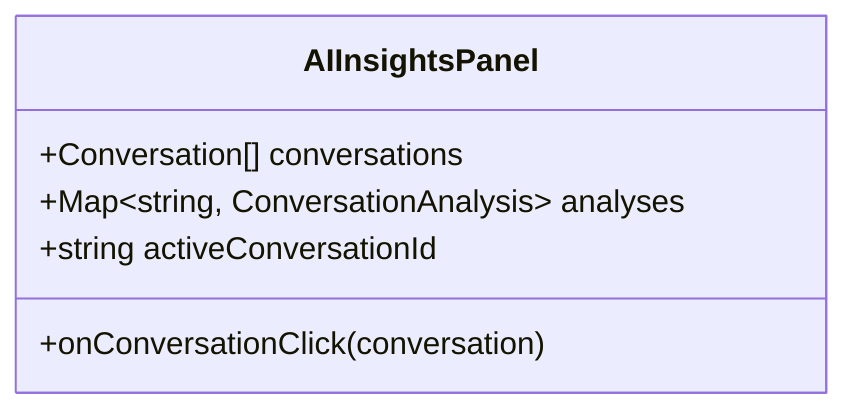
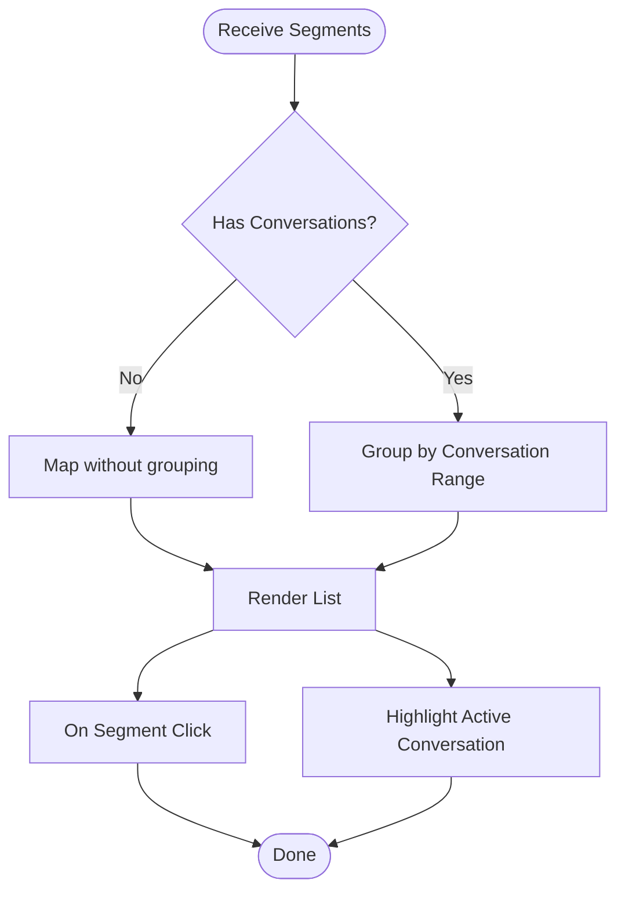
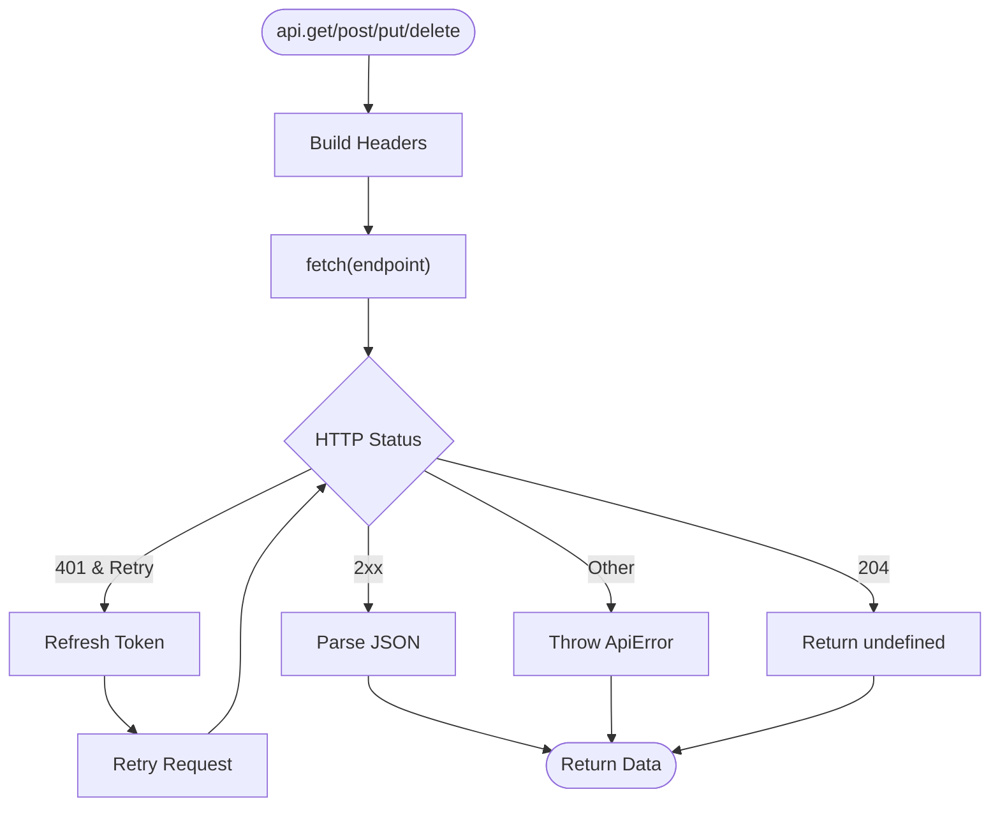
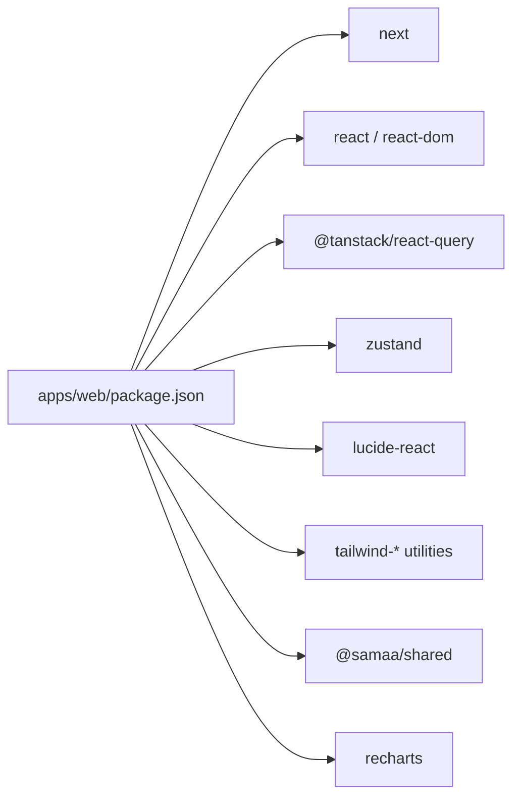

# Frontend Application

<cite>
**Referenced Files in This Document**
- [apps/web/src/app/layout.tsx](file://apps/web/src/app/layout.tsx)
- [apps/web/src/components/providers.tsx](file://apps/web/src/components/providers.tsx)
- [apps/web/src/middleware.ts](file://apps/web/src/middleware.ts)
- [apps/web/src/app/(auth)/login/page.tsx](file://apps/web/src/app/(auth)/login/page.tsx)
- [apps/web/src/components/auth-guard.tsx](file://apps/web/src/components/auth-guard.tsx)
- [apps/web/src/store/auth.ts](file://apps/web/src/store/auth.ts)
- [apps/web/src/lib/api-client.ts](file://apps/web/src/lib/api-client.ts)
- [apps/web/src/app/(dashboard)/layout.tsx](file://apps/web/src/app/(dashboard)/layout.tsx)
- [apps/web/src/components/layout/sidebar.tsx](file://apps/web/src/components/layout/sidebar.tsx)
- [apps/web/src/components/kpi-card.tsx](file://apps/web/src/components/kpi-card.tsx)
- [apps/web/src/components/features/conversation-timeline.tsx](file://apps/web/src/components/features/conversation-timeline.tsx)
- [apps/web/src/components/features/ai-insights-panel.tsx](file://apps/web/src/components/features/ai-insights-panel.tsx)
- [apps/web/src/components/features/transcript-viewer.tsx](file://apps/web/src/components/features/transcript-viewer.tsx)
- [apps/web/package.json](file://apps/web/package.json)
- [apps/web/next.config.ts](file://apps/web/next.config.ts)
</cite>

## Table of Contents
1. [Introduction](#introduction)
2. [Project Structure](#project-structure)
3. [Core Components](#core-components)
4. [Architecture Overview](#architecture-overview)
5. [Detailed Component Analysis](#detailed-component-analysis)
6. [Dependency Analysis](#dependency-analysis)
7. [Performance Considerations](#performance-considerations)
8. [Troubleshooting Guide](#troubleshooting-guide)
9. [Conclusion](#conclusion)
10. [Appendices](#appendices)

## Introduction
This document describes the Xsamaa AI Pipeline web interface built with Next.js 16 using the App Router. It covers the application’s architecture, component hierarchy, state management with Zustand, dashboard layout and sidebar navigation, responsive design with Tailwind CSS and shadcn/ui, authentication flow and protected routes, role-based UI adaptation, and key UI components such as KPI cards, conversation timeline visualization, AI insights panel, and transcript viewer. It also documents the API integration layer, data-fetching strategies, and error handling patterns, along with guidelines for extending the UI while maintaining design consistency.

## Project Structure
The frontend is organized as a Next.js app under apps/web. The App Router separates public and protected areas using route groups. Authentication is handled client-side with a dedicated guard and Zustand store persisted in localStorage. Global providers configure React Query and UI tooltips. The dashboard layout composes a sidebar and main content area, with pages grouped under a protected dashboard route group.

**Diagram sources**
- [apps/web/src/app/layout.tsx:1-37](file://apps/web/src/app/layout.tsx#L1-L37)
- [apps/web/src/components/providers.tsx:1-26](file://apps/web/src/components/providers.tsx#L1-L26)
- [apps/web/src/app/(dashboard)/layout.tsx:1-22](file://apps/web/src/app/(dashboard)/layout.tsx#L1-L22)
- [apps/web/src/components/layout/sidebar.tsx:1-143](file://apps/web/src/components/layout/sidebar.tsx#L1-L143)
- [apps/web/src/app/(auth)/login/page.tsx:1-91](file://apps/web/src/app/(auth)/login/page.tsx#L1-L91)
- [apps/web/src/components/auth-guard.tsx:1-40](file://apps/web/src/components/auth-guard.tsx#L1-L40)
- [apps/web/src/store/auth.ts:1-49](file://apps/web/src/store/auth.ts#L1-L49)
- [apps/web/src/lib/api-client.ts:1-114](file://apps/web/src/lib/api-client.ts#L1-L114)

**Section sources**
- [apps/web/src/app/layout.tsx:1-37](file://apps/web/src/app/layout.tsx#L1-L37)
- [apps/web/src/components/providers.tsx:1-26](file://apps/web/src/components/providers.tsx#L1-L26)
- [apps/web/src/app/(dashboard)/layout.tsx:1-22](file://apps/web/src/app/(dashboard)/layout.tsx#L1-L22)
- [apps/web/src/middleware.ts:1-32](file://apps/web/src/middleware.ts#L1-L32)

## Core Components
- Providers: Wraps the app with React Query and Tooltip providers to enable caching, retries, and global tooltip behavior.
- AuthGuard: Enforces client-side route protection and redirects based on authentication state and pathname.
- Auth Store (Zustand): Manages user session state, persistence, and hydration from localStorage.
- API Client: Centralized HTTP client with automatic token injection, refresh flow, and structured error handling.
- Dashboard Layout: Composes the sidebar and main content area for protected routes.
- Feature Components: Reusable UI building blocks for KPIs, timelines, AI insights, and transcripts.

**Section sources**
- [apps/web/src/components/providers.tsx:1-26](file://apps/web/src/components/providers.tsx#L1-L26)
- [apps/web/src/components/auth-guard.tsx:1-40](file://apps/web/src/components/auth-guard.tsx#L1-L40)
- [apps/web/src/store/auth.ts:1-49](file://apps/web/src/store/auth.ts#L1-L49)
- [apps/web/src/lib/api-client.ts:1-114](file://apps/web/src/lib/api-client.ts#L1-L114)
- [apps/web/src/app/(dashboard)/layout.tsx:1-22](file://apps/web/src/app/(dashboard)/layout.tsx#L1-L22)

## Architecture Overview
The application follows a layered architecture:
- Presentation Layer: Next.js App Router pages and shared UI components.
- State Management: Zustand store for authentication state with localStorage persistence.
- Data Access: Custom API client encapsulating HTTP requests, token refresh, and error normalization.
- UI Composition: Tailwind CSS and shadcn/ui primitives for consistent styling and responsive behavior.
- Routing and Protection: Route groups for protected/public areas, middleware allowing public paths, and client-side AuthGuard.

**Diagram sources**
- [apps/web/src/app/(auth)/login/page.tsx:1-91](file://apps/web/src/app/(auth)/login/page.tsx#L1-L91)
- [apps/web/src/app/(dashboard)/layout.tsx:1-22](file://apps/web/src/app/(dashboard)/layout.tsx#L1-L22)
- [apps/web/src/store/auth.ts:1-49](file://apps/web/src/store/auth.ts#L1-L49)
- [apps/web/src/components/providers.tsx:1-26](file://apps/web/src/components/providers.tsx#L1-L26)
- [apps/web/src/lib/api-client.ts:1-114](file://apps/web/src/lib/api-client.ts#L1-L114)
- [apps/web/src/middleware.ts:1-32](file://apps/web/src/middleware.ts#L1-L32)

## Detailed Component Analysis

### Authentication Flow and Protected Routes
The authentication system combines server-side middleware and client-side guards:
- Middleware allows public paths and static assets, deferring auth checks to the client.
- AuthGuard hydrates the store on mount, enforces redirects for unauthenticated users, and prevents access to login when already authenticated.
- The login page submits credentials via the API client, persists tokens and user data, and navigates to the home dashboard.

**Diagram sources**
- [apps/web/src/middleware.ts:1-32](file://apps/web/src/middleware.ts#L1-L32)
- [apps/web/src/components/auth-guard.tsx:1-40](file://apps/web/src/components/auth-guard.tsx#L1-L40)
- [apps/web/src/store/auth.ts:1-49](file://apps/web/src/store/auth.ts#L1-L49)
- [apps/web/src/lib/api-client.ts:1-114](file://apps/web/src/lib/api-client.ts#L1-L114)
- [apps/web/src/app/(auth)/login/page.tsx:1-91](file://apps/web/src/app/(auth)/login/page.tsx#L1-L91)

**Section sources**
- [apps/web/src/middleware.ts:1-32](file://apps/web/src/middleware.ts#L1-L32)
- [apps/web/src/components/auth-guard.tsx:1-40](file://apps/web/src/components/auth-guard.tsx#L1-L40)
- [apps/web/src/store/auth.ts:1-49](file://apps/web/src/store/auth.ts#L1-L49)
- [apps/web/src/lib/api-client.ts:1-114](file://apps/web/src/lib/api-client.ts#L1-L114)
- [apps/web/src/app/(auth)/login/page.tsx:1-91](file://apps/web/src/app/(auth)/login/page.tsx#L1-L91)

### Dashboard Layout and Sidebar Navigation
The dashboard layout composes the sidebar and main content area. The sidebar renders role-filtered navigation items, highlights the active route, and supports logout by clearing the auth store and redirecting to login.

**Diagram sources**
- [apps/web/src/app/(dashboard)/layout.tsx:1-22](file://apps/web/src/app/(dashboard)/layout.tsx#L1-L22)
- [apps/web/src/components/layout/sidebar.tsx:1-143](file://apps/web/src/components/layout/sidebar.tsx#L1-L143)
- [apps/web/src/store/auth.ts:1-49](file://apps/web/src/store/auth.ts#L1-L49)

**Section sources**
- [apps/web/src/app/(dashboard)/layout.tsx:1-22](file://apps/web/src/app/(dashboard)/layout.tsx#L1-L22)
- [apps/web/src/components/layout/sidebar.tsx:1-143](file://apps/web/src/components/layout/sidebar.tsx#L1-L143)

### KPI Cards
KPI cards present metrics with optional trend indicators and icons. They accept props for title, value, description, icon, and trend data, rendering a consistent card layout using shadcn/ui primitives.

**Diagram sources**
- [apps/web/src/components/kpi-card.tsx:1-41](file://apps/web/src/components/kpi-card.tsx#L1-L41)

**Section sources**
- [apps/web/src/components/kpi-card.tsx:1-41](file://apps/web/src/components/kpi-card.tsx#L1-L41)

### Conversation Timeline Visualization
The timeline component visualizes detected conversations as colored bars along a duration axis, with tooltips for timing and outcomes, and click handlers to focus on specific conversations.

**Diagram sources**
- [apps/web/src/components/features/conversation-timeline.tsx:1-82](file://apps/web/src/components/features/conversation-timeline.tsx#L1-L82)

**Section sources**
- [apps/web/src/components/features/conversation-timeline.tsx:1-82](file://apps/web/src/components/features/conversation-timeline.tsx#L1-L82)

### AI Insights Panel
The AI insights panel displays structured analysis per conversation, including intent, outcome, budget, products, objections, competitors, closing attempt, summary, coaching notes, and score breakdowns. It supports click-to-focus and confidence badges.

**Diagram sources**
- [apps/web/src/components/features/ai-insights-panel.tsx:1-203](file://apps/web/src/components/features/ai-insights-panel.tsx#L1-L203)

**Section sources**
- [apps/web/src/components/features/ai-insights-panel.tsx:1-203](file://apps/web/src/components/features/ai-insights-panel.tsx#L1-L203)

### Transcript Viewer
The transcript viewer renders speaker-labeled segments with timestamps, groups segments by active conversation, and supports highlighting and click events to navigate between segments and conversations.

**Diagram sources**
- [apps/web/src/components/features/transcript-viewer.tsx:1-89](file://apps/web/src/components/features/transcript-viewer.tsx#L1-L89)

**Section sources**
- [apps/web/src/components/features/transcript-viewer.tsx:1-89](file://apps/web/src/components/features/transcript-viewer.tsx#L1-L89)

### API Integration Layer
The API client centralizes HTTP requests:
- Automatically injects Authorization header when a token exists.
- Handles 401 Unauthorized by attempting a token refresh using the refresh token.
- Normalizes errors into a structured ApiError with status and detail.
- Supports GET, POST, PUT, DELETE with JSON or FormData bodies.
- Treats 204 No Content as undefined return.

**Diagram sources**
- [apps/web/src/lib/api-client.ts:1-114](file://apps/web/src/lib/api-client.ts#L1-L114)

**Section sources**
- [apps/web/src/lib/api-client.ts:1-114](file://apps/web/src/lib/api-client.ts#L1-L114)

## Dependency Analysis
External dependencies relevant to UI and state include:
- next, react, react-dom for framework runtime
- @tanstack/react-query for caching and data fetching
- zustand for lightweight state management
- lucide-react for icons
- tailwind-merge, clsx, class-variance-authority for styling utilities
- recharts for charts (as per package.json)
- @samaa/shared for shared types and constants

**Diagram sources**
- [apps/web/package.json:1-38](file://apps/web/package.json#L1-L38)

**Section sources**
- [apps/web/package.json:1-38](file://apps/web/package.json#L1-L38)

## Performance Considerations
- React Query defaults: Queries have a short stale time and limited retries to balance freshness and resilience.
- Memoization: Transcript viewer uses memoization to avoid recomputation when conversations change but segments remain the same.
- Conditional rendering: Components return early when data is unavailable to prevent unnecessary work.
- Token refresh: The API client avoids infinite retry loops by disabling retries after a refresh attempt.

[No sources needed since this section provides general guidance]

## Troubleshooting Guide
Common issues and resolutions:
- Authentication loop or redirect to login:
  - Verify middleware allows public paths and static assets.
  - Ensure AuthGuard hydrates the store and redirects appropriately.
  - Confirm localStorage contains tokens and user data after login.
- 401 Unauthorized errors:
  - The API client attempts a token refresh automatically; if it fails, it clears auth state and redirects to login.
  - Check refresh token presence and backend refresh endpoint availability.
- UI not reflecting role-based navigation:
  - Confirm user role is persisted and the sidebar filters items based on roles.
- Empty or missing data in features:
  - Validate that conversations and analyses maps are populated before rendering.
  - Ensure transcript segments align with conversation time ranges.

**Section sources**
- [apps/web/src/middleware.ts:1-32](file://apps/web/src/middleware.ts#L1-L32)
- [apps/web/src/components/auth-guard.tsx:1-40](file://apps/web/src/components/auth-guard.tsx#L1-L40)
- [apps/web/src/store/auth.ts:1-49](file://apps/web/src/store/auth.ts#L1-L49)
- [apps/web/src/lib/api-client.ts:1-114](file://apps/web/src/lib/api-client.ts#L1-L114)
- [apps/web/src/components/layout/sidebar.tsx:1-143](file://apps/web/src/components/layout/sidebar.tsx#L1-L143)

## Conclusion
The Xsamaa AI Pipeline web interface leverages Next.js 16 App Router, Zustand for authentication state, and a custom API client to deliver a responsive, role-aware dashboard. The modular UI components, consistent styling with Tailwind and shadcn/ui, and robust data-fetching patterns enable scalable development and maintainable design.

[No sources needed since this section summarizes without analyzing specific files]

## Appendices

### Extending the UI with New Components
- Follow the existing component pattern: use shadcn/ui primitives, keep props minimal and typed, and leverage Tailwind utilities for styling.
- For new feature components, mirror the composition seen in timeline, insights, and transcript viewer: accept data props, compute derived visuals, and expose callbacks for interactions.
- Maintain design consistency by using the established color tokens and spacing scales.

[No sources needed since this section provides general guidance]

### Styling and Responsive Design
- The project uses Tailwind CSS v4 and shadcn/ui components. Fonts are configured globally via the root layout.
- Responsive breakpoints and utilities are applied directly in component classes; ensure new components follow the same approach.

**Section sources**
- [apps/web/src/app/layout.tsx:1-37](file://apps/web/src/app/layout.tsx#L1-L37)
- [apps/web/next.config.ts:1-8](file://apps/web/next.config.ts#L1-L8)