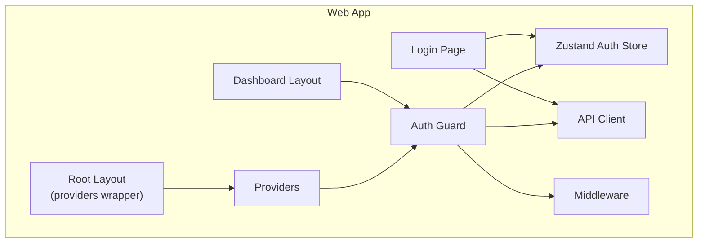
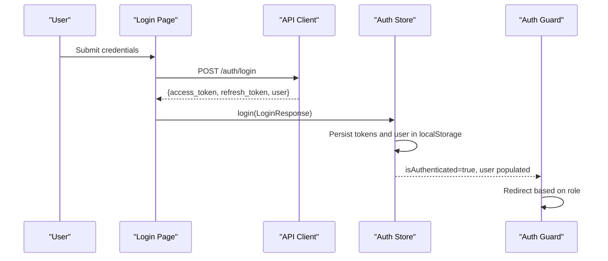
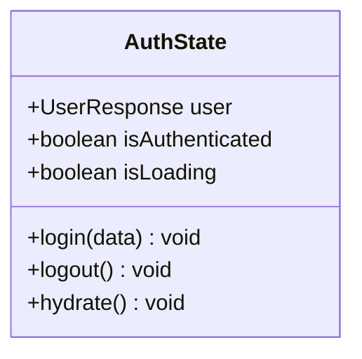
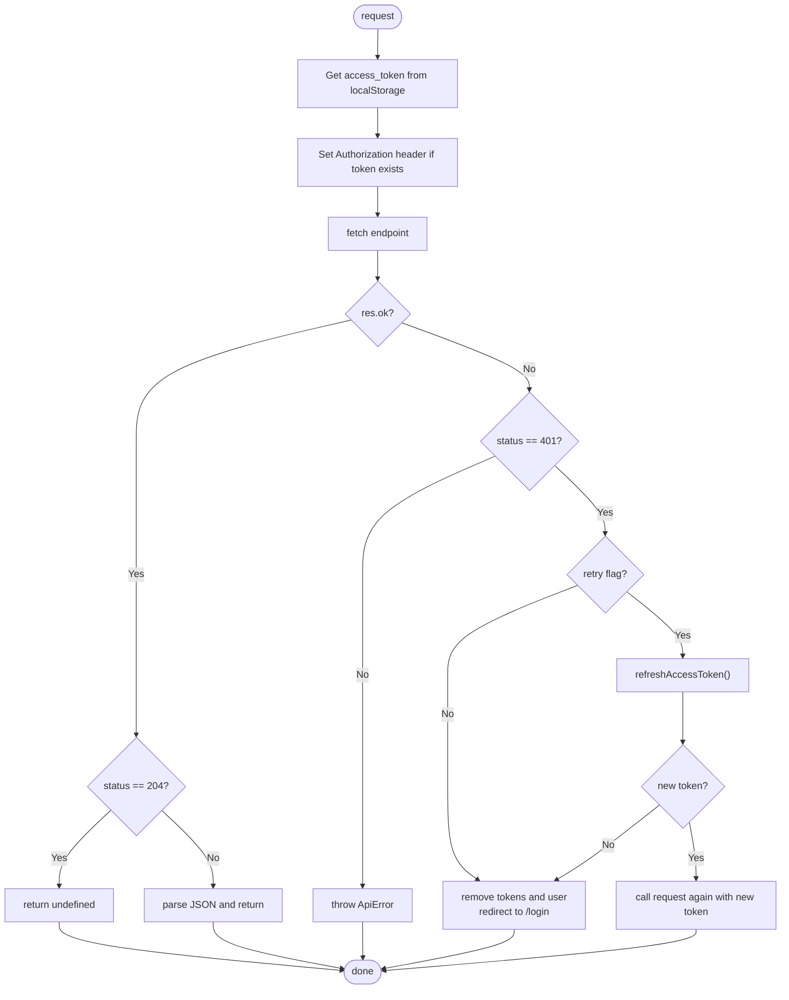
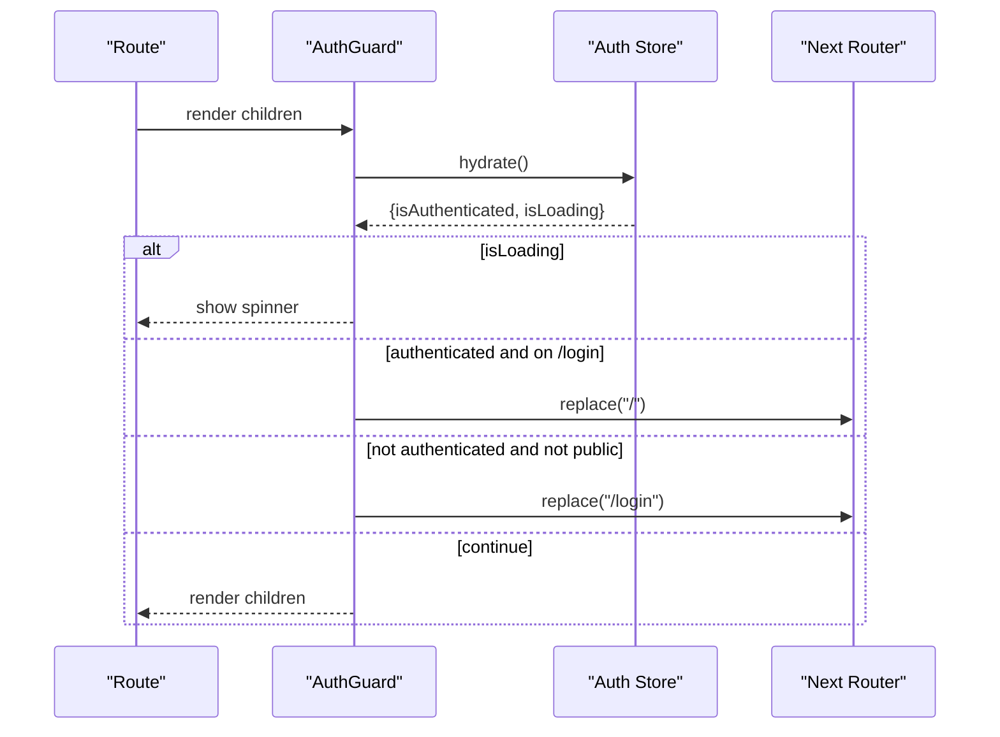
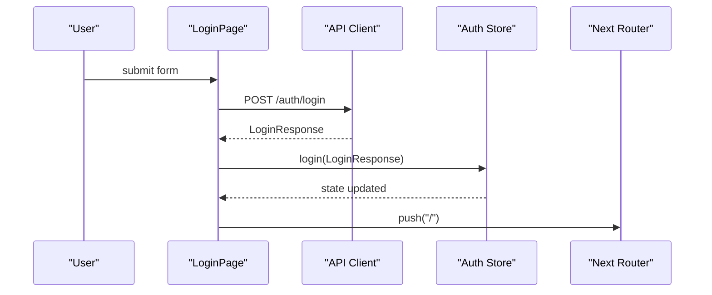
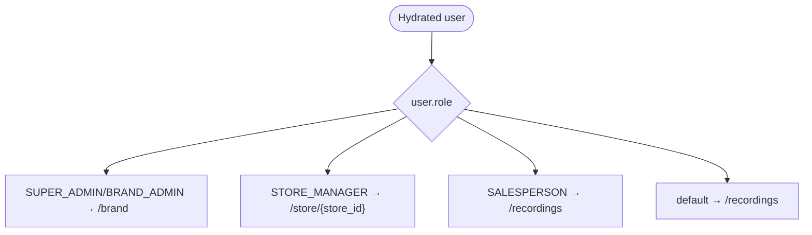
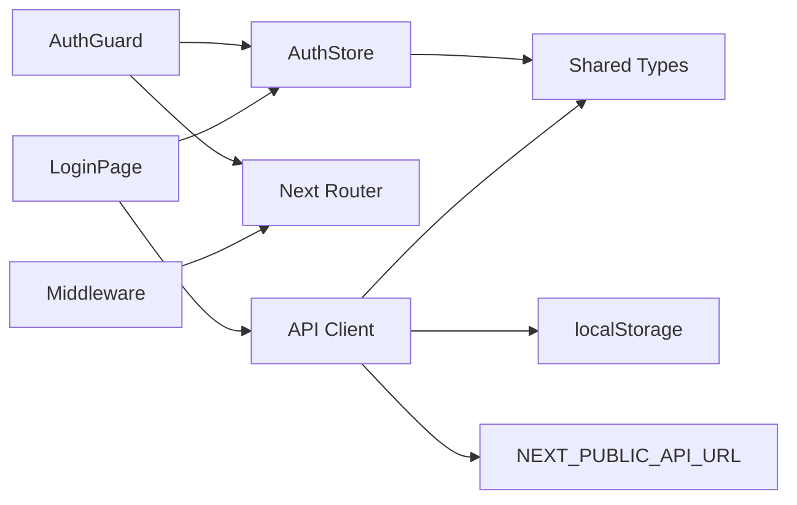

# State Management & Authentication

<cite>
**Referenced Files in This Document**
- [apps/web/src/store/auth.ts](file://apps/web/src/store/auth.ts)
- [apps/web/src/components/auth-guard.tsx](file://apps/web/src/components/auth-guard.tsx)
- [apps/web/src/components/providers.tsx](file://apps/web/src/components/providers.tsx)
- [apps/web/src/lib/api-client.ts](file://apps/web/src/lib/api-client.ts)
- [apps/web/src/middleware.ts](file://apps/web/src/middleware.ts)
- [apps/web/src/app/(auth)/login/page.tsx](file://apps/web/src/app/(auth)/login/page.tsx)
- [apps/web/src/app/(dashboard)/layout.tsx](file://apps/web/src/app/(dashboard)/layout.tsx)
- [apps/web/src/app/page.tsx](file://apps/web/src/app/page.tsx)
- [apps/web/src/app/layout.tsx](file://apps/web/src/app/layout.tsx)
- [packages/shared/src/api-types.ts](file://packages/shared/src/api-types.ts)
- [packages/shared/src/constants.ts](file://packages/shared/src/constants.ts)
</cite>

## Table of Contents
1. [Introduction](#introduction)
2. [Project Structure](#project-structure)
3. [Core Components](#core-components)
4. [Architecture Overview](#architecture-overview)
5. [Detailed Component Analysis](#detailed-component-analysis)
6. [Dependency Analysis](#dependency-analysis)
7. [Performance Considerations](#performance-considerations)
8. [Troubleshooting Guide](#troubleshooting-guide)
9. [Conclusion](#conclusion)
10. [Appendices](#appendices)

## Introduction
This document explains the state management and authentication system built with Zustand in the Next.js web application. It covers the authentication store, user session lifecycle, token handling, role-based navigation, provider pattern, component integration, authentication guards, and session restoration. It also documents the HTTP client’s token refresh mechanism, error handling, and practical examples of consuming state in components. Security considerations and best practices for token storage and session management are included, along with guidelines for extending the system and adding new state slices.

## Project Structure
The authentication and state management logic is organized around a small set of focused modules:
- Zustand authentication store: manages user, authentication state, and hydration
- API client: handles HTTP requests, Authorization headers, and automatic token refresh
- Auth guard: protects routes and performs conditional navigation
- Middleware: allows public paths and passes through non-public routes
- Providers: wraps the app with React Query and UI providers
- Shared types: define user roles and authentication data contracts

**Diagram sources**
- [apps/web/src/app/layout.tsx:21-36](file://apps/web/src/app/layout.tsx#L21-L36)
- [apps/web/src/components/providers.tsx:7-25](file://apps/web/src/components/providers.tsx#L7-L25)
- [apps/web/src/components/auth-guard.tsx:9-39](file://apps/web/src/components/auth-guard.tsx#L9-L39)
- [apps/web/src/store/auth.ts:15-48](file://apps/web/src/store/auth.ts#L15-L48)
- [apps/web/src/lib/api-client.ts:39-92](file://apps/web/src/lib/api-client.ts#L39-L92)
- [apps/web/src/middleware.ts:6-27](file://apps/web/src/middleware.ts#L6-L27)
- [apps/web/src/app/(auth)/login/page.tsx:14-40](file://apps/web/src/app/(auth)/login/page.tsx#L14-L40)
- [apps/web/src/app/(dashboard)/layout.tsx:6-21](file://apps/web/src/app/(dashboard)/layout.tsx#L6-L21)

**Section sources**
- [apps/web/src/app/layout.tsx:21-36](file://apps/web/src/app/layout.tsx#L21-L36)
- [apps/web/src/components/providers.tsx:7-25](file://apps/web/src/components/providers.tsx#L7-L25)
- [apps/web/src/components/auth-guard.tsx:9-39](file://apps/web/src/components/auth-guard.tsx#L9-L39)
- [apps/web/src/store/auth.ts:15-48](file://apps/web/src/store/auth.ts#L15-L48)
- [apps/web/src/lib/api-client.ts:39-92](file://apps/web/src/lib/api-client.ts#L39-L92)
- [apps/web/src/middleware.ts:6-27](file://apps/web/src/middleware.ts#L6-L27)
- [apps/web/src/app/(auth)/login/page.tsx:14-40](file://apps/web/src/app/(auth)/login/page.tsx#L14-L40)
- [apps/web/src/app/(dashboard)/layout.tsx:6-21](file://apps/web/src/app/(dashboard)/layout.tsx#L6-L21)

## Core Components
- Authentication store (Zustand)
  - State fields: user, isAuthenticated, isLoading
  - Actions: login, logout, hydrate
  - Persistence: writes/reads tokens and user to/from localStorage
  - Hydration: restores session on app load
- API client
  - Adds Authorization header when available
  - Handles 401 Unauthorized by refreshing tokens
  - Clears auth state and redirects to login on refresh failure
- Auth guard
  - Protects private routes and enforces public paths
  - Hydrates auth state on mount
  - Redirects authenticated users away from login and vice versa
- Middleware
  - Allows public paths and static assets
  - Delegates auth checks to client-side guard
- Shared types
  - Defines LoginResponse, UserResponse, and Role constants

**Section sources**
- [apps/web/src/store/auth.ts:6-13](file://apps/web/src/store/auth.ts#L6-L13)
- [apps/web/src/store/auth.ts:15-48](file://apps/web/src/store/auth.ts#L15-L48)
- [apps/web/src/lib/api-client.ts:13-37](file://apps/web/src/lib/api-client.ts#L13-L37)
- [apps/web/src/lib/api-client.ts:39-92](file://apps/web/src/lib/api-client.ts#L39-L92)
- [apps/web/src/components/auth-guard.tsx:7-39](file://apps/web/src/components/auth-guard.tsx#L7-L39)
- [apps/web/src/middleware.ts:4-27](file://apps/web/src/middleware.ts#L4-L27)
- [packages/shared/src/api-types.ts:17-28](file://packages/shared/src/api-types.ts#L17-L28)
- [packages/shared/src/constants.ts:3-10](file://packages/shared/src/constants.ts#L3-L10)

## Architecture Overview
The system follows a client-side authentication architecture:
- On login, credentials are sent to the backend; upon success, tokens and user are persisted and the store is hydrated
- Subsequent requests automatically attach the Authorization header
- On 401 Unauthorized, the client attempts a token refresh; if successful, retries the request; otherwise, clears auth state and redirects to login
- The AuthGuard enforces route protection and handles role-based navigation after login

**Diagram sources**
- [apps/web/src/app/(auth)/login/page.tsx:22-40](file://apps/web/src/app/(auth)/login/page.tsx#L22-L40)
- [apps/web/src/lib/api-client.ts:94-111](file://apps/web/src/lib/api-client.ts#L94-L111)
- [apps/web/src/store/auth.ts:20-25](file://apps/web/src/store/auth.ts#L20-L25)
- [apps/web/src/components/auth-guard.tsx:18-28](file://apps/web/src/components/auth-guard.tsx#L18-L28)

## Detailed Component Analysis

### Authentication Store (Zustand)
The store defines the authentication domain with three state fields and three actions:
- State
  - user: current logged-in user or null
  - isAuthenticated: whether the user is authenticated
  - isLoading: initial hydration state
- Actions
  - login(data): persists tokens and user, sets authenticated state
  - logout(): removes tokens and user, resets state
  - hydrate(): reads localStorage and restores state

**Diagram sources**
- [apps/web/src/store/auth.ts:6-13](file://apps/web/src/store/auth.ts#L6-L13)
- [apps/web/src/store/auth.ts:15-48](file://apps/web/src/store/auth.ts#L15-L48)

**Section sources**
- [apps/web/src/store/auth.ts:6-13](file://apps/web/src/store/auth.ts#L6-L13)
- [apps/web/src/store/auth.ts:15-48](file://apps/web/src/store/auth.ts#L15-L48)

### API Client and Token Refresh
The API client centralizes HTTP requests:
- Adds Authorization: Bearer <access_token> when present
- Handles 401 Unauthorized by attempting a refresh using the stored refresh_token
- On successful refresh, retries the original request
- On failure, clears auth state and redirects to login
- Provides convenience methods: get, post, put, delete

**Diagram sources**
- [apps/web/src/lib/api-client.ts:39-92](file://apps/web/src/lib/api-client.ts#L39-L92)
- [apps/web/src/lib/api-client.ts:18-37](file://apps/web/src/lib/api-client.ts#L18-L37)

**Section sources**
- [apps/web/src/lib/api-client.ts:13-16](file://apps/web/src/lib/api-client.ts#L13-L16)
- [apps/web/src/lib/api-client.ts:18-37](file://apps/web/src/lib/api-client.ts#L18-L37)
- [apps/web/src/lib/api-client.ts:39-92](file://apps/web/src/lib/api-client.ts#L39-L92)

### Auth Guard and Route Protection
The AuthGuard:
- Calls hydrate on mount to restore session
- Prevents navigation to protected routes when not authenticated
- Redirects authenticated users away from the login route
- Renders a loading spinner while hydration completes

**Diagram sources**
- [apps/web/src/components/auth-guard.tsx:9-39](file://apps/web/src/components/auth-guard.tsx#L9-L39)
- [apps/web/src/store/auth.ts:34-47](file://apps/web/src/store/auth.ts#L34-L47)

**Section sources**
- [apps/web/src/components/auth-guard.tsx:7-39](file://apps/web/src/components/auth-guard.tsx#L7-L39)
- [apps/web/src/store/auth.ts:34-47](file://apps/web/src/store/auth.ts#L34-L47)

### Middleware and Public Paths
The middleware:
- Allows public paths and static assets
- Passes through non-public routes for client-side enforcement
- Uses a matcher to avoid interfering with static resources

**Section sources**
- [apps/web/src/middleware.ts:4-27](file://apps/web/src/middleware.ts#L4-L27)

### Provider Pattern and Application Bootstrap
Providers:
- Wraps the app with React Query and UI providers
- Ensures global query caching and UI primitives are available

Root layout:
- Applies Providers to the entire app tree

**Section sources**
- [apps/web/src/components/providers.tsx:7-25](file://apps/web/src/components/providers.tsx#L7-L25)
- [apps/web/src/app/layout.tsx:21-36](file://apps/web/src/app/layout.tsx#L21-L36)

### Login Flow and State Updates
The login page:
- Collects credentials and calls the API client
- On success, invokes the store’s login action
- Redirects to home after successful login

**Diagram sources**
- [apps/web/src/app/(auth)/login/page.tsx:22-40](file://apps/web/src/app/(auth)/login/page.tsx#L22-L40)
- [apps/web/src/lib/api-client.ts:94-111](file://apps/web/src/lib/api-client.ts#L94-L111)
- [apps/web/src/store/auth.ts:20-25](file://apps/web/src/store/auth.ts#L20-L25)

**Section sources**
- [apps/web/src/app/(auth)/login/page.tsx:14-40](file://apps/web/src/app/(auth)/login/page.tsx#L14-L40)
- [apps/web/src/lib/api-client.ts:94-111](file://apps/web/src/lib/api-client.ts#L94-L111)
- [apps/web/src/store/auth.ts:20-25](file://apps/web/src/store/auth.ts#L20-L25)

### Role-Based Navigation and Hydration
After login, the home page hydrates the store and redirects based on user role:
- SUPER_ADMIN/BRAND_ADMIN → brand dashboard
- STORE_MANAGER → store-specific dashboard
- SALESPERSON → recordings page
- Unknown/default → recordings page

**Diagram sources**
- [apps/web/src/app/page.tsx:15-33](file://apps/web/src/app/page.tsx#L15-L33)
- [packages/shared/src/constants.ts:3-10](file://packages/shared/src/constants.ts#L3-L10)

**Section sources**
- [apps/web/src/app/page.tsx:15-33](file://apps/web/src/app/page.tsx#L15-L33)
- [packages/shared/src/constants.ts:3-10](file://packages/shared/src/constants.ts#L3-L10)

### Consuming Authentication State in Components
Common patterns:
- Use the store to read user, isAuthenticated, and isLoading
- Call hydrate on mount to restore session
- Use router.replace for role-based redirects
- Use the API client for authenticated requests

Examples:
- AuthGuard consumes the store to enforce protection
- LoginPage consumes the store to update state after login
- Home page hydrates and redirects based on role
- Dashboard layout wraps children with AuthGuard

**Section sources**
- [apps/web/src/components/auth-guard.tsx:12-28](file://apps/web/src/components/auth-guard.tsx#L12-L28)
- [apps/web/src/app/(auth)/login/page.tsx:16-30](file://apps/web/src/app/(auth)/login/page.tsx#L16-L30)
- [apps/web/src/app/page.tsx:9-33](file://apps/web/src/app/page.tsx#L9-L33)
- [apps/web/src/app/(dashboard)/layout.tsx:12-19](file://apps/web/src/app/(dashboard)/layout.tsx#L12-L19)

## Dependency Analysis
The system exhibits low coupling and clear separation of concerns:
- AuthGuard depends on AuthStore and Next router
- API Client depends on localStorage and environment variables
- Login page depends on API Client and AuthStore
- Middleware depends on public path configuration
- Shared types define contracts used by both API Client and AuthStore

**Diagram sources**
- [apps/web/src/components/auth-guard.tsx:5-12](file://apps/web/src/components/auth-guard.tsx#L5-L12)
- [apps/web/src/app/(auth)/login/page.tsx:5-30](file://apps/web/src/app/(auth)/login/page.tsx#L5-L30)
- [apps/web/src/lib/api-client.ts:1-11](file://apps/web/src/lib/api-client.ts#L1-L11)
- [apps/web/src/middleware.ts:6-27](file://apps/web/src/middleware.ts#L6-L27)
- [packages/shared/src/api-types.ts:17-28](file://packages/shared/src/api-types.ts#L17-L28)

**Section sources**
- [apps/web/src/components/auth-guard.tsx:5-12](file://apps/web/src/components/auth-guard.tsx#L5-L12)
- [apps/web/src/app/(auth)/login/page.tsx:5-30](file://apps/web/src/app/(auth)/login/page.tsx#L5-L30)
- [apps/web/src/lib/api-client.ts:1-11](file://apps/web/src/lib/api-client.ts#L1-L11)
- [apps/web/src/middleware.ts:6-27](file://apps/web/src/middleware.ts#L6-L27)
- [packages/shared/src/api-types.ts:17-28](file://packages/shared/src/api-types.ts#L17-L28)

## Performance Considerations
- Minimize unnecessary re-renders by subscribing to only the required slice of the store
- Keep the store lean; avoid storing large transient UI state
- Use React Query for server state caching to reduce redundant network calls
- Avoid synchronous heavy work in hydration; keep localStorage reads minimal
- Debounce or batch frequent state updates where appropriate

## Troubleshooting Guide
Common issues and resolutions:
- Stuck on loading spinner
  - Cause: hydration not triggered or localStorage corrupted
  - Fix: ensure hydrate is called on mount; clear localStorage keys if malformed
- Redirect loops to login
  - Cause: missing or invalid tokens; refresh failed
  - Fix: verify refresh_token availability; inspect API response; clear auth state if needed
- 401 errors despite valid tokens
  - Cause: token expired or revoked
  - Fix: rely on automatic refresh; if it fails, force logout and re-login
- Protected route access denied
  - Cause: not authenticated or AuthGuard not wrapping the route
  - Fix: wrap pages with AuthGuard; ensure hydrate runs before navigation decisions

**Section sources**
- [apps/web/src/components/auth-guard.tsx:14-28](file://apps/web/src/components/auth-guard.tsx#L14-L28)
- [apps/web/src/lib/api-client.ts:63-75](file://apps/web/src/lib/api-client.ts#L63-L75)
- [apps/web/src/store/auth.ts:34-47](file://apps/web/src/store/auth.ts#L34-L47)

## Conclusion
The system leverages Zustand for a compact, predictable authentication state, complemented by a robust API client that manages token refresh and error handling. The AuthGuard and middleware provide layered protection, while shared types ensure type safety across the stack. The design supports easy extension with additional state slices and role-based features.

## Appendices

### Security Considerations and Best Practices
- Token storage
  - Store tokens in secure HTTP-only cookies in production for stricter XSS protections
  - Avoid storing sensitive data in localStorage; prefer encrypted storage if localStorage is unavoidable
- Session management
  - Enforce short-lived access tokens with reliable refresh mechanisms
  - Invalidate sessions on logout and on sensitive actions
- Error handling
  - Always clear auth state on 401 failures to prevent stale sessions
  - Surface user-friendly messages while logging detailed errors
- Role-based access control
  - Centralize role checks in guards or wrappers
  - Define roles in shared constants and enforce them consistently

### Extending the Authentication System
- Adding a new state slice
  - Define a new Zustand store with minimal, focused state and actions
  - Keep persistence logic explicit and scoped to the slice
- Integrating role-based features
  - Extend the role constants and add guards for protected routes
  - Use the user role to gate UI elements and route access
- Enhancing token handling
  - Add token expiration checks and proactive refresh triggers
  - Introduce token introspection endpoints for server-side validation

**Section sources**
- [packages/shared/src/constants.ts:3-10](file://packages/shared/src/constants.ts#L3-L10)
- [apps/web/src/store/auth.ts:15-48](file://apps/web/src/store/auth.ts#L15-L48)
- [apps/web/src/lib/api-client.ts:18-37](file://apps/web/src/lib/api-client.ts#L18-L37)