# UI Component Library & Design System

<cite>
**Referenced Files in This Document**
- [button.tsx](file://apps/web/src/components/ui/button.tsx)
- [input.tsx](file://apps/web/src/components/ui/input.tsx)
- [select.tsx](file://apps/web/src/components/ui/select.tsx)
- [textarea.tsx](file://apps/web/src/components/ui/textarea.tsx)
- [label.tsx](file://apps/web/src/components/ui/label.tsx)
- [card.tsx](file://apps/web/src/components/ui/card.tsx)
- [badge.tsx](file://apps/web/src/components/ui/badge.tsx)
- [avatar.tsx](file://apps/web/src/components/ui/avatar.tsx)
- [table.tsx](file://apps/web/src/components/ui/table.tsx)
- [tabs.tsx](file://apps/web/src/components/ui/tabs.tsx)
- [dropdown-menu.tsx](file://apps/web/src/components/ui/dropdown-menu.tsx)
- [sheet.tsx](file://apps/web/src/components/ui/sheet.tsx)
- [separator.tsx](file://apps/web/src/components/ui/separator.tsx)
- [skeleton.tsx](file://apps/web/src/components/ui/skeleton.tsx)
- [tooltip.tsx](file://apps/web/src/components/ui/tooltip.tsx)
- [components.json](file://apps/web/components.json)
- [globals.css](file://apps/web/src/app/globals.css)
- [layout.tsx](file://apps/web/src/app/layout.tsx)
- [providers.tsx](file://apps/web/src/components/providers.tsx)
</cite>

## Table of Contents
1. [Introduction](#introduction)
2. [Project Structure](#project-structure)
3. [Core Components](#core-components)
4. [Architecture Overview](#architecture-overview)
5. [Detailed Component Analysis](#detailed-component-analysis)
6. [Dependency Analysis](#dependency-analysis)
7. [Performance Considerations](#performance-considerations)
8. [Troubleshooting Guide](#troubleshooting-guide)
9. [Conclusion](#conclusion)
10. [Appendices](#appendices)

## Introduction
This document describes the custom UI component library used in the Next.js application. The library is built with shadcn/ui primitives and styled with Tailwind CSS. It defines a cohesive set of components that share consistent design tokens, variants, and behavior patterns. The guide covers component APIs, variants, customization, interactive states, accessibility, theming (including dark mode), responsive behavior, and extension guidelines to maintain design consistency across the application.

## Project Structure
The UI components live under the Next.js app’s components directory and are organized by feature and primitive categories. The design system is configured via Tailwind and shadcn/ui, with global styles and theme providers enabling consistent rendering and dark mode support.

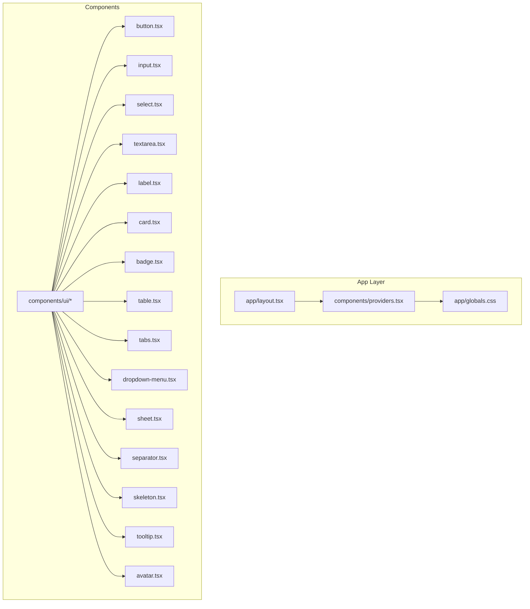

**Diagram sources**
- [layout.tsx:1-200](file://apps/web/src/app/layout.tsx#L1-L200)
- [providers.tsx:1-200](file://apps/web/src/components/providers.tsx#L1-L200)
- [globals.css:1-200](file://apps/web/src/app/globals.css#L1-L200)
- [button.tsx:1-200](file://apps/web/src/components/ui/button.tsx#L1-L200)
- [input.tsx:1-200](file://apps/web/src/components/ui/input.tsx#L1-L200)
- [select.tsx:1-200](file://apps/web/src/components/ui/select.tsx#L1-L200)
- [textarea.tsx:1-200](file://apps/web/src/components/ui/textarea.tsx#L1-L200)
- [label.tsx:1-200](file://apps/web/src/components/ui/label.tsx#L1-L200)
- [card.tsx:1-200](file://apps/web/src/components/ui/card.tsx#L1-L200)
- [badge.tsx:1-200](file://apps/web/src/components/ui/badge.tsx#L1-L200)
- [table.tsx:1-200](file://apps/web/src/components/ui/table.tsx#L1-L200)
- [tabs.tsx:1-200](file://apps/web/src/components/ui/tabs.tsx#L1-L200)
- [dropdown-menu.tsx:1-200](file://apps/web/src/components/ui/dropdown-menu.tsx#L1-L200)
- [sheet.tsx:1-200](file://apps/web/src/components/ui/sheet.tsx#L1-L200)
- [separator.tsx:1-200](file://apps/web/src/components/ui/separator.tsx#L1-L200)
- [skeleton.tsx:1-200](file://apps/web/src/components/ui/skeleton.tsx#L1-L200)
- [tooltip.tsx:1-200](file://apps/web/src/components/ui/tooltip.tsx#L1-L200)
- [avatar.tsx:1-200](file://apps/web/src/components/ui/avatar.tsx#L1-L200)

**Section sources**
- [layout.tsx:1-200](file://apps/web/src/app/layout.tsx#L1-L200)
- [providers.tsx:1-200](file://apps/web/src/components/providers.tsx#L1-L200)
- [globals.css:1-200](file://apps/web/src/app/globals.css#L1-L200)

## Core Components
This section documents the primary UI components and their shared design system principles.

- Design Tokens and Foundations
  - Color Palette: Defined via Tailwind’s color configuration and extended in the design system configuration. Tokens include semantic roles such as primary, secondary, destructive, muted, and neutral surfaces.
  - Typography Scale: Headings, body, and small text sizes mapped to consistent font weights and line heights.
  - Spacing Scale: Consistent spacing units applied across padding, margin, gap, and layout utilities.
  - Radius and Shadows: Corner radii and elevation shadows standardized for cards, modals, and interactive elements.
  - Motion: Transitions and animations are minimal and consistent across interactive states.

- Component Composition Patterns
  - Base Variants: Each component exposes a set of variant classes (size, color, shape) that compose into a cohesive visual hierarchy.
  - Prop Interfaces: Props are typed and validated to ensure consistent usage across the app.
  - Styling Inheritance: Components inherit base styles from shared Tailwind utilities and override only what is necessary for their role.
  - Accessibility: All interactive components expose proper ARIA attributes and keyboard navigation semantics.

- Interactive States and Focus Management
  - Hover, focus, active, disabled, and selected states are consistently styled and exposed via variant classes.
  - Focus rings and outlines are managed globally to ensure accessible focus management.

- Theming and Dark Mode Support
  - Theme provider enables toggling between light and dark modes.
  - Color tokens adapt automatically to the current theme, ensuring contrast and readability.

- Responsive Behavior
  - Components are responsive by default, leveraging Tailwind’s breakpoint utilities and container queries where applicable.

**Section sources**
- [components.json:1-200](file://apps/web/components.json#L1-L200)
- [globals.css:1-200](file://apps/web/src/app/globals.css#L1-L200)
- [providers.tsx:1-200](file://apps/web/src/components/providers.tsx#L1-L200)

## Architecture Overview
The UI library is integrated into the Next.js app through a theme provider and global styles. Components are thin wrappers around shadcn/ui primitives, inheriting design tokens and behavior while exposing a consistent API surface.

```mermaid
graph TB
THEME["Theme Provider<br/>providers.tsx"]
TAILWIND["Tailwind Config<br/>components.json"]
GLOBALS["Global Styles<br/>globals.css"]
BUTTON["Button<br/>button.tsx"]
INPUT["Input<br/>input.tsx"]
SELECT["Select<br/>select.tsx"]
TEXTAREA["Textarea<br/>textarea.tsx"]
LABEL["Label<br/>label.tsx"]
CARD["Card<br/>card.tsx"]
BADGE["Badge<br/>badge.tsx"]
TABLE["Table<br/>table.tsx"]
TABS["Tabs<br/>tabs.tsx"]
DROPDOWN["Dropdown Menu<br/>dropdown-menu.tsx"]
SHEET["Sheet<br/>sheet.tsx"]
SEPARATOR["Separator<br/>separator.tsx"]
SKELETON["Skeleton<br/>skeleton.tsx"]
TOOLTIP["Tooltip<br/>tooltip.tsx"]
AVATAR["Avatar<br/>avatar.tsx"]
THEME --> GLOBALS
THEME --> BUTTON
THEME --> INPUT
THEME --> SELECT
THEME --> TEXTAREA
THEME --> LABEL
THEME --> CARD
THEME --> BADGE
THEME --> TABLE
THEME --> TABS
THEME --> DROPDOWN
THEME --> SHEET
THEME --> SEPARATOR
THEME --> SKELETON
THEME --> TOOLTIP
THEME --> AVATAR
TAILWIND --> GLOBALS
TAILWIND --> BUTTON
TAILWIND --> INPUT
TAILWIND --> SELECT
TAILWIND --> TEXTAREA
TAILWIND --> LABEL
TAILWIND --> CARD
TAILWIND --> BADGE
TAILWIND --> TABLE
TAILWIND --> TABS
TAILWIND --> DROPDOWN
TAILWIND --> SHEET
TAILWIND --> SEPARATOR
TAILWIND --> SKELETON
TAILWIND --> TOOLTIP
TAILWIND --> AVATAR
```

**Diagram sources**
- [providers.tsx:1-200](file://apps/web/src/components/providers.tsx#L1-L200)
- [components.json:1-200](file://apps/web/components.json#L1-L200)
- [globals.css:1-200](file://apps/web/src/app/globals.css#L1-L200)
- [button.tsx:1-200](file://apps/web/src/components/ui/button.tsx#L1-L200)
- [input.tsx:1-200](file://apps/web/src/components/ui/input.tsx#L1-L200)
- [select.tsx:1-200](file://apps/web/src/components/ui/select.tsx#L1-L200)
- [textarea.tsx:1-200](file://apps/web/src/components/ui/textarea.tsx#L1-L200)
- [label.tsx:1-200](file://apps/web/src/components/ui/label.tsx#L1-L200)
- [card.tsx:1-200](file://apps/web/src/components/ui/card.tsx#L1-L200)
- [badge.tsx:1-200](file://apps/web/src/components/ui/badge.tsx#L1-L200)
- [table.tsx:1-200](file://apps/web/src/components/ui/table.tsx#L1-L200)
- [tabs.tsx:1-200](file://apps/web/src/components/ui/tabs.tsx#L1-L200)
- [dropdown-menu.tsx:1-200](file://apps/web/src/components/ui/dropdown-menu.tsx#L1-L200)
- [sheet.tsx:1-200](file://apps/web/src/components/ui/sheet.tsx#L1-L200)
- [separator.tsx:1-200](file://apps/web/src/components/ui/separator.tsx#L1-L200)
- [skeleton.tsx:1-200](file://apps/web/src/components/ui/skeleton.tsx#L1-L200)
- [tooltip.tsx:1-200](file://apps/web/src/components/ui/tooltip.tsx#L1-L200)
- [avatar.tsx:1-200](file://apps/web/src/components/ui/avatar.tsx#L1-L200)

## Detailed Component Analysis

### Button
- Purpose: Primary action trigger with consistent sizing and emphasis.
- Variants and Props:
  - Size variants: small, medium, large.
  - Emphasis variants: default, outline, ghost, link, secondary.
  - Status variants: destructive, muted.
  - States: hover, active, focus-visible, disabled.
- Accessibility: Supports keyboard activation and focus ring management.
- Composition: Inherits base styles and composes variant classes for consistent visuals.

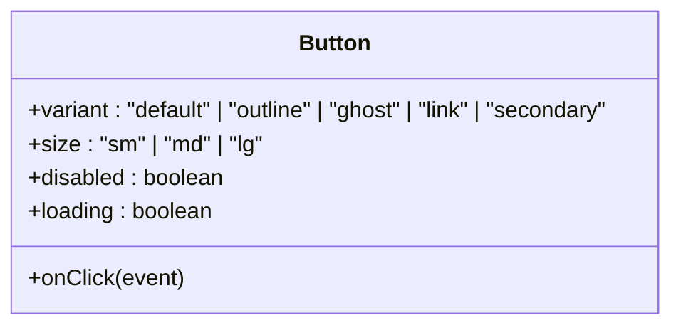

**Diagram sources**
- [button.tsx:1-200](file://apps/web/src/components/ui/button.tsx#L1-L200)

**Section sources**
- [button.tsx:1-200](file://apps/web/src/components/ui/button.tsx#L1-L200)

### Input
- Purpose: Single-line text entry with validation and optional adornments.
- Variants and Props:
  - Size variants: small, medium, large.
  - State variants: error, success, warning.
  - Types: text, email, password, number, search.
- Accessibility: Proper labeling via associated label element and aria-invalid for error states.
- Composition: Uses shared input classes and integrates with form validation patterns.

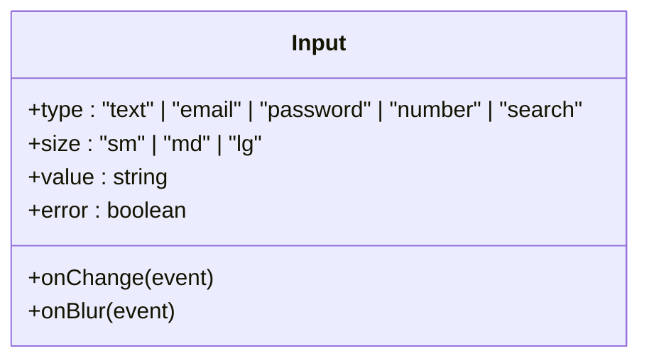

**Diagram sources**
- [input.tsx:1-200](file://apps/web/src/components/ui/input.tsx#L1-L200)

**Section sources**
- [input.tsx:1-200](file://apps/web/src/components/ui/input.tsx#L1-L200)

### Select
- Purpose: Dropdown selection with single and multi-select modes.
- Variants and Props:
  - Size variants: small, medium, large.
  - Trigger variants: default, ghost, outline.
  - Options: searchable, creatable, disabled.
- Accessibility: Keyboard navigation, ARIA expanded state, and focus management.
- Composition: Built on a menu primitive with consistent styling and behavior.

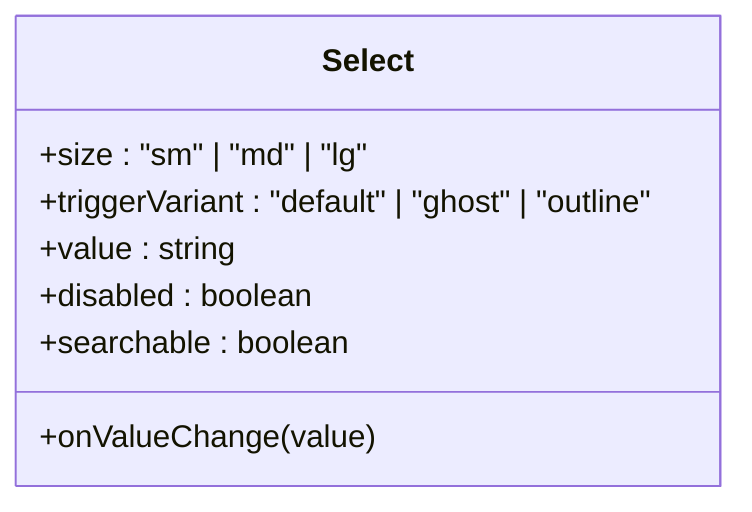

**Diagram sources**
- [select.tsx:1-200](file://apps/web/src/components/ui/select.tsx#L1-L200)

**Section sources**
- [select.tsx:1-200](file://apps/web/src/components/ui/select.tsx#L1-L200)

### Textarea
- Purpose: Multi-line text entry with optional resize and character limits.
- Variants and Props:
  - Size variants: small, medium, large.
  - State variants: error, success, warning.
- Accessibility: Supports labeling and aria-describedby for assistive technologies.
- Composition: Inherits shared textarea classes and integrates with form patterns.

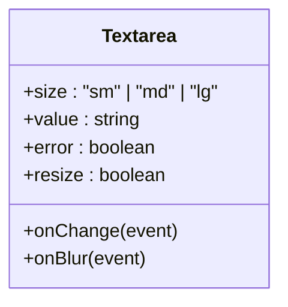

**Diagram sources**
- [textarea.tsx:1-200](file://apps/web/src/components/ui/textarea.tsx#L1-L200)

**Section sources**
- [textarea.tsx:1-200](file://apps/web/src/components/ui/textarea.tsx#L1-L200)

### Label
- Purpose: Associates text with form controls for accessibility.
- Variants and Props:
  - Emphasis: default, muted.
  - Interaction: clickable (when paired with interactive controls).
- Composition: Minimal wrapper around native label semantics.

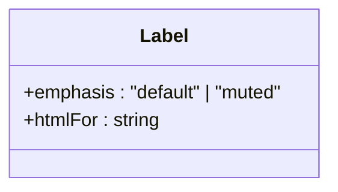

**Diagram sources**
- [label.tsx:1-200](file://apps/web/src/components/ui/label.tsx#L1-L200)

**Section sources**
- [label.tsx:1-200](file://apps/web/src/components/ui/label.tsx#L1-L200)

### Card
- Purpose: Container for grouping related content with optional actions.
- Variants and Props:
  - Elevation: default, elevated.
  - Padding: compact, comfortable.
  - Borders: default, borderless.
- Composition: Uses shared card classes and supports nested components.

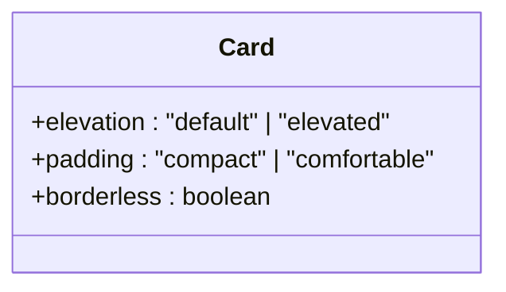

**Diagram sources**
- [card.tsx:1-200](file://apps/web/src/components/ui/card.tsx#L1-L200)

**Section sources**
- [card.tsx:1-200](file://apps/web/src/components/ui/card.tsx#L1-L200)

### Badge
- Purpose: Short status or metadata labels.
- Variants and Props:
  - Size: small, medium.
  - Color: primary, secondary, muted, success, warning, error.
  - Shape: rounded, pill.
- Composition: Lightweight component with consistent typography and spacing.

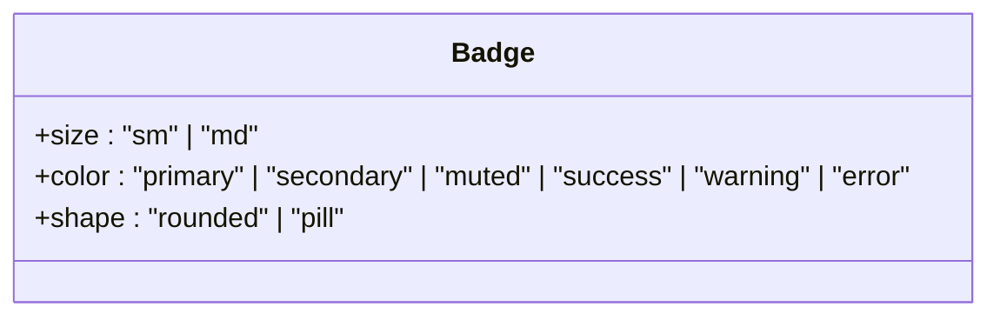

**Diagram sources**
- [badge.tsx:1-200](file://apps/web/src/components/ui/badge.tsx#L1-L200)

**Section sources**
- [badge.tsx:1-200](file://apps/web/src/components/ui/badge.tsx#L1-L200)

### Avatar
- Purpose: Displays user or entity identity with fallback initials.
- Variants and Props:
  - Size: small, medium, large, extra-large.
  - Shape: circle, square.
  - Fallback: initials or icon.
- Composition: Integrates image loading and placeholder rendering.

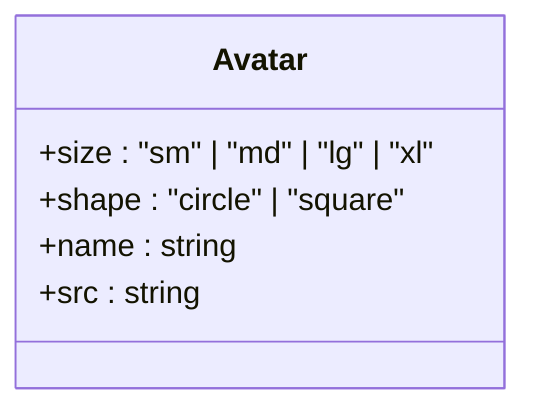

**Diagram sources**
- [avatar.tsx:1-200](file://apps/web/src/components/ui/avatar.tsx#L1-L200)

**Section sources**
- [avatar.tsx:1-200](file://apps/web/src/components/ui/avatar.tsx#L1-L200)

### Table
- Purpose: Presents structured data in rows and columns with sorting and pagination.
- Variants and Props:
  - Density: comfortable, compact.
  - Borders: default, borderless.
  - Alignment: left, center, right.
- Accessibility: Headers, captions, and ARIA roles for screen readers.
- Composition: Uses shared table classes and supports virtualization for large datasets.

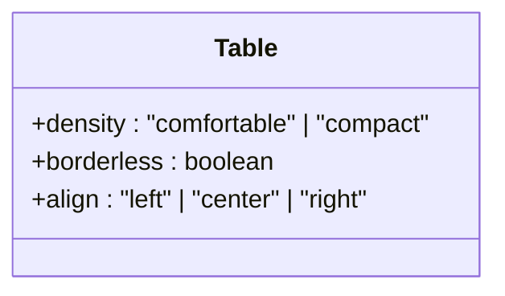

**Diagram sources**
- [table.tsx:1-200](file://apps/web/src/components/ui/table.tsx#L1-L200)

**Section sources**
- [table.tsx:1-200](file://apps/web/src/components/ui/table.tsx#L1-L200)

### Tabs
- Purpose: Organizes content into selectable sections.
- Variants and Props:
  - Orientation: horizontal, vertical.
  - Indicator: underline, pill, box.
  - Size: small, medium.
- Accessibility: Keyboard navigation, ARIA tablist and tabpanel roles.
- Composition: Built on a tab primitive with consistent styling.

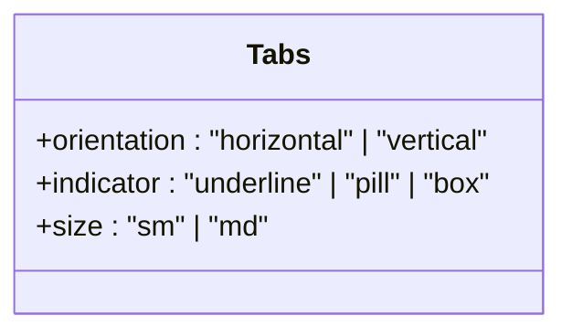

**Diagram sources**
- [tabs.tsx:1-200](file://apps/web/src/components/ui/tabs.tsx#L1-L200)

**Section sources**
- [tabs.tsx:1-200](file://apps/web/src/components/ui/tabs.tsx#L1-L200)

### Dropdown Menu
- Purpose: Presents a list of actions or navigational links.
- Variants and Props:
  - Size: small, medium.
  - Alignment: left, right.
  - Trigger: button-like, icon-only.
- Accessibility: Keyboard navigation, ARIA-haspopup and menu roles.
- Composition: Uses a menu primitive with consistent spacing and typography.

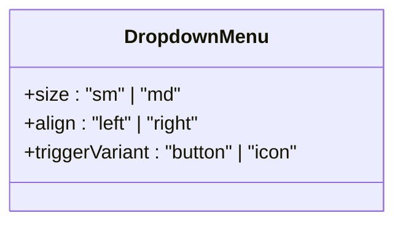

**Diagram sources**
- [dropdown-menu.tsx:1-200](file://apps/web/src/components/ui/dropdown-menu.tsx#L1-L200)

**Section sources**
- [dropdown-menu.tsx:1-200](file://apps/web/src/components/ui/dropdown-menu.tsx#L1-L200)

### Sheet
- Purpose: Modal overlay for focused tasks or information.
- Variants and Props:
  - Size: small, medium, large, full.
  - Position: top, bottom, left, right.
  - Dismissible: with backdrop click, with escape key.
- Accessibility: Focus trapping, ARIA modal roles, and proper focus return.
- Composition: Built on a dialog primitive with consistent motion and overlay behavior.

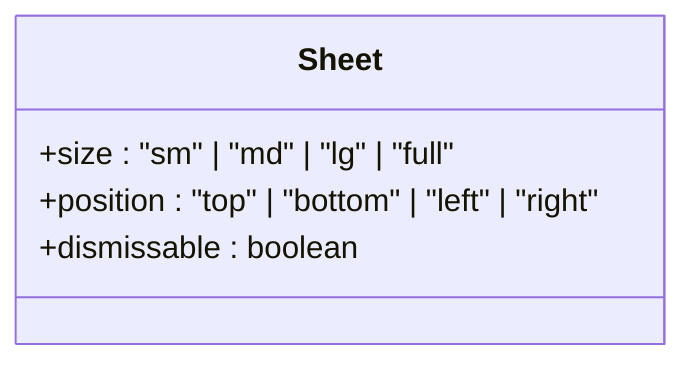

**Diagram sources**
- [sheet.tsx:1-200](file://apps/web/src/components/ui/sheet.tsx#L1-L200)

**Section sources**
- [sheet.tsx:1-200](file://apps/web/src/components/ui/sheet.tsx#L1-L200)

### Separator
- Purpose: Visually divides content areas with optional orientation.
- Variants and Props:
  - Orientation: horizontal, vertical.
  - Thickness: default, strong.
- Composition: Minimal component with consistent stroke and spacing.

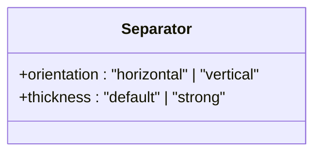

**Diagram sources**
- [separator.tsx:1-200](file://apps/web/src/components/ui/separator.tsx#L1-L200)

**Section sources**
- [separator.tsx:1-200](file://apps/web/src/components/ui/separator.tsx#L1-L200)

### Skeleton
- Purpose: Provides loading placeholders with animated shimmer.
- Variants and Props:
  - Shape: rectangle, circle, text.
  - Animation: pulse, shimmer.
- Composition: Lightweight component with consistent motion and color tokens.

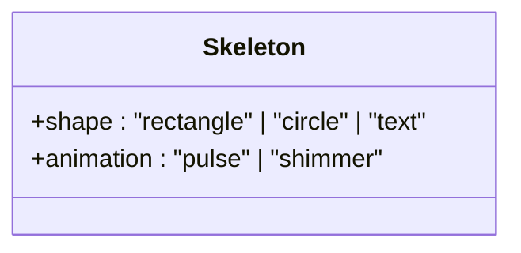

**Diagram sources**
- [skeleton.tsx:1-200](file://apps/web/src/components/ui/skeleton.tsx#L1-L200)

**Section sources**
- [skeleton.tsx:1-200](file://apps/web/src/components/ui/skeleton.tsx#L1-L200)

### Tooltip
- Purpose: Displays contextual help or extended information on hover.
- Variants and Props:
  - Side: top, bottom, left, right.
  - Align: start, center, end.
  - Trigger: hover, focus.
- Accessibility: Keyboard-triggered and ARIA describedby relationships.
- Composition: Uses a popover primitive with consistent offset and typography.

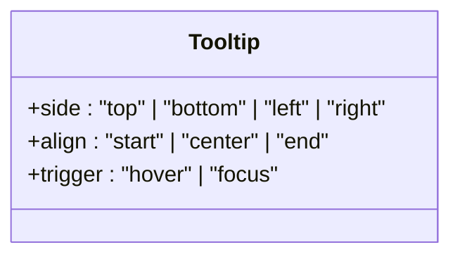

**Diagram sources**
- [tooltip.tsx:1-200](file://apps/web/src/components/ui/tooltip.tsx#L1-L200)

**Section sources**
- [tooltip.tsx:1-200](file://apps/web/src/components/ui/tooltip.tsx#L1-L200)

## Dependency Analysis
The UI components depend on shared design tokens and primitives. The theme provider and global styles centralize configuration, while each component composes its own variant classes.

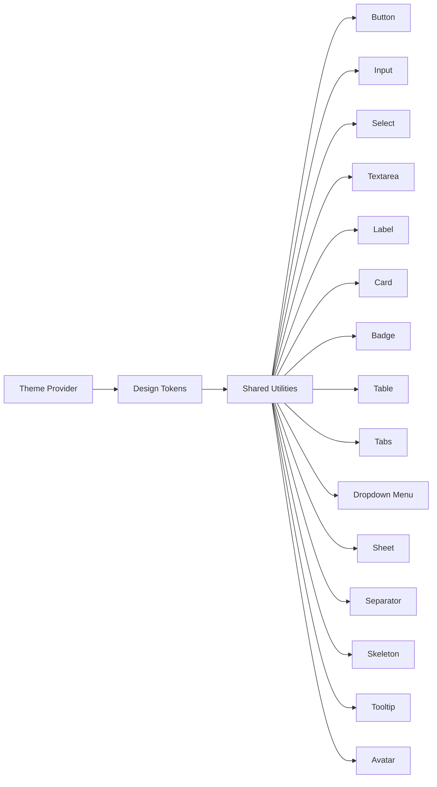

**Diagram sources**
- [providers.tsx:1-200](file://apps/web/src/components/providers.tsx#L1-L200)
- [components.json:1-200](file://apps/web/components.json#L1-L200)
- [globals.css:1-200](file://apps/web/src/app/globals.css#L1-L200)
- [button.tsx:1-200](file://apps/web/src/components/ui/button.tsx#L1-L200)
- [input.tsx:1-200](file://apps/web/src/components/ui/input.tsx#L1-L200)
- [select.tsx:1-200](file://apps/web/src/components/ui/select.tsx#L1-L200)
- [textarea.tsx:1-200](file://apps/web/src/components/ui/textarea.tsx#L1-L200)
- [label.tsx:1-200](file://apps/web/src/components/ui/label.tsx#L1-L200)
- [card.tsx:1-200](file://apps/web/src/components/ui/card.tsx#L1-L200)
- [badge.tsx:1-200](file://apps/web/src/components/ui/badge.tsx#L1-L200)
- [table.tsx:1-200](file://apps/web/src/components/ui/table.tsx#L1-L200)
- [tabs.tsx:1-200](file://apps/web/src/components/ui/tabs.tsx#L1-L200)
- [dropdown-menu.tsx:1-200](file://apps/web/src/components/ui/dropdown-menu.tsx#L1-L200)
- [sheet.tsx:1-200](file://apps/web/src/components/ui/sheet.tsx#L1-L200)
- [separator.tsx:1-200](file://apps/web/src/components/ui/separator.tsx#L1-L200)
- [skeleton.tsx:1-200](file://apps/web/src/components/ui/skeleton.tsx#L1-L200)
- [tooltip.tsx:1-200](file://apps/web/src/components/ui/tooltip.tsx#L1-L200)
- [avatar.tsx:1-200](file://apps/web/src/components/ui/avatar.tsx#L1-L200)

**Section sources**
- [providers.tsx:1-200](file://apps/web/src/components/providers.tsx#L1-L200)
- [components.json:1-200](file://apps/web/components.json#L1-L200)
- [globals.css:1-200](file://apps/web/src/app/globals.css#L1-L200)

## Performance Considerations
- Prefer lightweight components for dense lists (e.g., Skeleton, Badge) to minimize reflows.
- Use variant classes judiciously to avoid excessive CSS bloat.
- Leverage container queries for adaptive layouts where appropriate.
- Keep focus management efficient to prevent layout thrashing during keyboard navigation.

## Troubleshooting Guide
- Accessibility Issues
  - Ensure labels are associated with inputs and controls.
  - Verify ARIA roles and states for interactive components.
- Dark Mode Problems
  - Confirm theme provider is initialized and color tokens resolve correctly.
- Variant Conflicts
  - Avoid stacking incompatible variants; prefer a single emphasis and size per component.
- Focus Trapping
  - For overlays (Sheet, Dropdown), ensure focus trapping is enabled and focus returns after dismissal.

**Section sources**
- [providers.tsx:1-200](file://apps/web/src/components/providers.tsx#L1-L200)
- [button.tsx:1-200](file://apps/web/src/components/ui/button.tsx#L1-L200)
- [input.tsx:1-200](file://apps/web/src/components/ui/input.tsx#L1-L200)
- [select.tsx:1-200](file://apps/web/src/components/ui/select.tsx#L1-L200)
- [sheet.tsx:1-200](file://apps/web/src/components/ui/sheet.tsx#L1-L200)
- [dropdown-menu.tsx:1-200](file://apps/web/src/components/ui/dropdown-menu.tsx#L1-L200)

## Conclusion
The UI component library provides a consistent, accessible, and extensible foundation for building interfaces. By adhering to shared design tokens, variant patterns, and accessibility guidelines, teams can rapidly assemble cohesive experiences while maintaining design system integrity across the application.

## Appendices
- Integration Guidelines
  - Wrap the app with the theme provider to enable dark mode and global styles.
  - Import component modules as needed and compose them into higher-level UI patterns.
  - Extend variants thoughtfully and document new patterns centrally.
- Extending the Component Library
  - Add new variants by composing additional Tailwind classes and updating component props.
  - Introduce new components by modeling them after existing primitives and reusing shared utilities.
  - Maintain backward compatibility when evolving component APIs.

**Section sources**
- [layout.tsx:1-200](file://apps/web/src/app/layout.tsx#L1-L200)
- [providers.tsx:1-200](file://apps/web/src/components/providers.tsx#L1-L200)
- [components.json:1-200](file://apps/web/components.json#L1-L200)
- [globals.css:1-200](file://apps/web/src/app/globals.css#L1-L200)