# UI Component Library & Design System

<cite>
**Referenced Files in This Document**
- [DESIGN.md](file://DESIGN.md)
- [button.tsx](file://apps/web/src/components/ui/button.tsx)
- [input.tsx](file://apps/web/src/components/ui/input.tsx)
- [select.tsx](file://apps/web/src/components/ui/select.tsx)
- [textarea.tsx](file://apps/web/src/components/ui/textarea.tsx)
- [label.tsx](file://apps/web/src/components/ui/label.tsx)
- [card.tsx](file://apps/web/src/components/ui/card.tsx)
- [badge.tsx](file://apps/web/src/components/ui/badge.tsx)
- [avatar.tsx](file://apps/web/src/components/ui/avatar.tsx)
- [table.tsx](file://apps/web/src/components/ui/table.tsx)
- [tabs.tsx](file://apps/web/src/components/ui/tabs.tsx)
- [dropdown-menu.tsx](file://apps/web/src/components/ui/dropdown-menu.tsx)
- [sheet.tsx](file://apps/web/src/components/ui/sheet.tsx)
- [separator.tsx](file://apps/web/src/components/ui/separator.tsx)
- [skeleton.tsx](file://apps/web/src/components/ui/skeleton.tsx)
- [tooltip.tsx](file://apps/web/src/components/ui/tooltip.tsx)
- [components.json](file://apps/web/components.json)
- [globals.css](file://apps/web/src/app/globals.css)
- [layout.tsx](file://apps/web/src/app/layout.tsx)
- [providers.tsx](file://apps/web/src/components/providers.tsx)
</cite>

## Update Summary
**Changes Made**
- Enhanced design system specification with comprehensive color palette, typography scale, and component specifications
- Added detailed accessibility guidelines and design principles
- Updated component documentation to reflect the new CXSAMAA design system standards
- Integrated oklch color space implementation and semantic color tokens
- Expanded component variants and styling guidelines based on the new design specification

## Table of Contents
1. [Introduction](#introduction)
2. [Design System Foundation](#design-system-foundation)
3. [Color Palette & Semantic Tokens](#color-palette--semantic-tokens)
4. [Typography Scale & Type System](#typography-scale--type-system)
5. [Component Specifications](#component-specifications)
6. [Project Structure](#project-structure)
7. [Core Components](#core-components)
8. [Architecture Overview](#architecture-overview)
9. [Detailed Component Analysis](#detailed-component-analysis)
10. [Accessibility Guidelines](#accessibility-guidelines)
11. [Dependency Analysis](#dependency-analysis)
12. [Performance Considerations](#performance-considerations)
13. [Troubleshooting Guide](#troubleshooting-guide)
14. [Conclusion](#conclusion)
15. [Appendices](#appendices)

## Introduction
This document describes the comprehensive UI component library built with shadcn/ui primitives and Tailwind CSS, governed by the CXSAMAA design system specification. The library implements a sophisticated analytical workspace design with carefully curated color palettes, geometric typography, and semantic component specifications. The design system emphasizes mint-green brand accents, neutral grays for information density, and restrained elegance suitable for retail audio intelligence applications.

**Updated** Enhanced with comprehensive design system specification defining color spaces, typography scales, and component specifications that guide all UI implementations.

## Design System Foundation

The CXSAMAA design system establishes a refined analytical workspace philosophy centered around precision, clarity, and professional warmth. The system rejects generic enterprise aesthetics in favor of purpose-built solutions for audio intelligence analysis.

### Key Design Principles

**The Analyst's Workbench Philosophy**
- Clean precision with warm professionalism
- Considered spacing that lets dense information breathe
- Approachable hierarchy that guides without hand-holding
- Strategic brand accent placement through restraint

**Design Characteristics**
- Mint-green brand accent reserved for active states, focus rings, and positive indicators
- Black primary buttons for decisive CTAs across all surfaces
- Gellix for UI prose and headings; Geist Mono for data values and code
- Soft elevation via subtle shadows on cards and interactive containers
- Fixed 256px sidebar with flexible content area
- WCAG AAA contrast targets across all text/background combinations

**Section sources**
- [DESIGN.md:96-116](file://DESIGN.md#L96-L116)

## Color Palette & Semantic Tokens

The CXSAMAA color system implements oklch color space for perceptually uniform color reproduction and semantic meaning encoding.

### Primary Color System

**Brand Identity Colors**
- **Brand Mint** (`oklch(0.75 0.18 165)`): Signature accent for active states, positive trends, and focus rings
- **Deep Mint** (`oklch(0.65 0.2 165)`): Pressed/active variant and trend-positive text
- **Soft Mint** (`oklch(0.95 0.05 165)`): Subtle backgrounds for KPI containers and confirmation surfaces

**Semantic Color Encoding**
- **Signal Blue** (`oklch(0.55 0.15 260)`): Processing states and work-in-progress indicators
- **Alert Red** (`oklch(0.6 0.22 25)`): Errors, failed pipeline stages, and negative indicators
- **Warm Amber** (`oklch(0.75 0.15 80)`): Caution states and deprecated indicators
- **Testimonial Coral** (`oklch(0.75 0.18 55)`): Emotional moments and highlight surfaces

### Neutral Grayscale System

**Information Density Gradients**
- **Ink** (`oklch(0.15 0 0)`): Primary headlines and CTA text
- **Charcoal** (`oklch(0.25 0 0)`): Body text and form labels
- **Slate** (`oklch(0.45 0 0)`): Secondary text and descriptions
- **Steel** (`oklch(0.55 0 0)`): Tertiary text and inactive elements
- **Stone** (`oklch(0.65 0 0)`): Muted captions and de-emphasized labels
- **Canvas** (`oklch(1 0 0)`): Pure white backgrounds and cards

### Surface & Background System

**Layering Strategy**
- **Surface Soft** (`oklch(0.96 0 0)`): Dashboard content area background
- **Canvas Dark** (`oklch(0.15 0 0)`): Dark gradient backgrounds for login panels
- **Surface Code** (`oklch(0.18 0.02 260)`): Code editor and monospace backgrounds

### Border & Divider System

**Visual Hierarchy**
- **Hairline** (`oklch(0.92 0 0)`): Primary borders and dividers
- **Hairline Soft** (`oklch(0.94 0 0)`): Secondary dividers and table rows

### Named Design Rules

**The Mint Restraint Rule**
Brand mint appears on at most 3-4 elements per viewport: active nav indicator, positive trend, focus ring, and KPI icon. Exceeding five mint elements compromises design effectiveness.

**The Semantic Pairing Rule**
Every color-coded status pairs with text labels for accessibility. Color-blind users must receive equivalent information through non-color channels.

**Section sources**
- [DESIGN.md:117-147](file://DESIGN.md#L117-L147)

## Typography Scale & Type System

CXSAMAA implements a sophisticated two-face typography system that distinguishes between human language and machine-generated data through font selection and treatment.

### Font Family Hierarchy

**Display & UI Fonts**
- **Gellix**: Primary font for all UI prose, headings, and human-readable content
- **Weights**: 400/500/600/700 for geometric hierarchy without decorative faces

**Data & Technical Fonts**
- **Geist Mono**: Exclusive use for computed values, scores, timestamps, and inline code
- **Purpose**: Clear "measured value" signal distinguishing AI-generated content

### Typography Scale Specification

**Hierarchical Typographic Scale**
- **Page Title**: 28px, 600 weight, 1.25 line-height, -0.02em tracking
- **Section Title**: 18px, 600 weight, 1.4 line-height
- **Body**: 14px, 400 weight, 1.5 line-height (primary content)
- **Body Medium**: 14px, 500 weight (emphasis and active states)
- **Label**: 11px, 600 weight, uppercase, 0.05em tracking
- **Mono Data**: 13px, 400 weight for computed values

### Design Principles

**The Two-Face Rule**
Gellix for human language, Geist Mono for machine values. The font change communicates data provenance and computational origin.

**The Uppercase Ceiling Rule**
Uppercase limited to 11px labels with wide tracking. No all-caps body copy, ensuring readability and professional tone.

**Section sources**
- [DESIGN.md:148-168](file://DESIGN.md#L148-L168)

## Component Specifications

### Elevation & Shadow Vocabulary

**Layering Strategy**
CXSAMAA uses soft, diffused shadows creating gentle separation between content workspace and containers. Shadows serve as "whispers, not statements."

**Shadow Specifications**
- **Card Rest**: `0 1px 3px rgba(0,0,0,0.04), 0 1px 2px rgba(0,0,0,0.06)` - subtle card lift
- **Card Hover**: `0 4px 12px rgba(0,0,0,0.08)` - interactive elevation
- **Login Card**: `0 4px 24px -4px rgba(0,0,0,0.08)` - prominent login elevation
- **Dropdown/Popover**: `0 8px 24px rgba(0,0,0,0.12)` - floating element depth

**The Whisper Rule**
Shadows should be noticeable only when removed. If shadows draw attention as the first visual element, they're too strong.

### Component Implementation Standards

**Buttons**
- **Shape**: 8px rounded corners (not pill-shaped)
- **Primary**: Near-black background with white text, 500 font weight
- **Hover**: Slight lighten to charcoal background
- **Outline**: Transparent with ink text and hairline border
- **Ghost**: No border with transparent background and hover fill

**Cards/Containers**
- **Rounded**: 12px corners consistently
- **Background**: White on surface-soft content area
- **Shadow**: Card Rest default, Card Hover on interaction
- **Padding**: 24px standard, 32px for dashboard sections

**Status Badges**
- **Style**: Pill-shaped with tinted background, matching text, and subtle border
- **Semantic Mapping**: Uploaded (stone), Processing (signal blue), Completed (soft mint), Failed (red)

**Inputs/Fields**
- **Style**: Hairline border, white background, 8px rounded corners, 40px height
- **Focus**: Mint-green ring with 2px border
- **Labels**: 14px medium weight, charcoal color, 8px gap above
- **Error**: Destructive-tinted container with inline error messaging

**Navigation**
- **Sidebar**: 256px fixed width, white background, right hairline border
- **Nav Items**: 14px medium weight, steel text, 8px vertical padding
- **Active State**: Soft mint background fill with deep mint icon
- **Section Headers**: 11px uppercase tracking, steel text above nav groups

**Login Page**
- **Signature Treatment**: Split-layout with animated audio visualization
- **Form Area**: Clean card with centered layout and password toggle

**Section sources**
- [DESIGN.md:169-242](file://DESIGN.md#L169-L242)

## Project Structure
The UI components live under the Next.js app's components directory and are organized by feature and primitive categories. The design system is configured via Tailwind and shadcn/ui, with global styles and theme providers enabling consistent rendering and dark mode support.

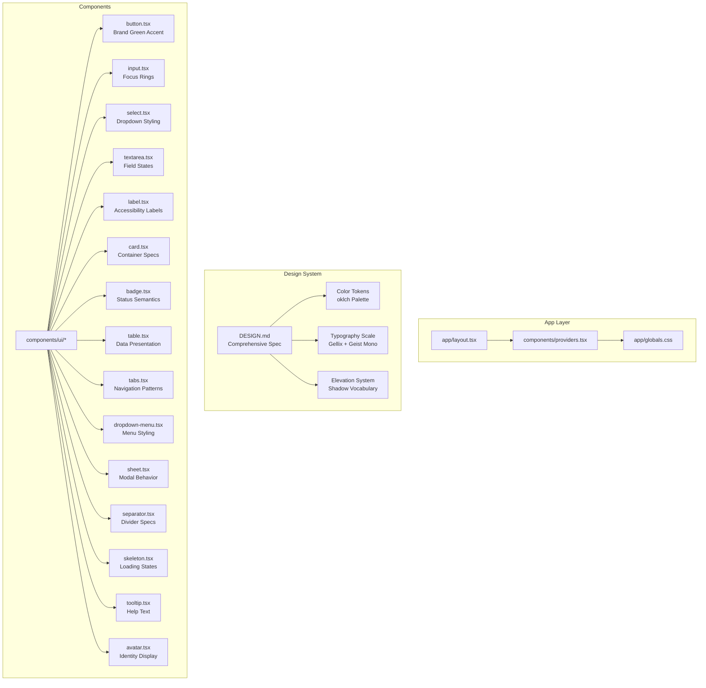

**Diagram sources**
- [layout.tsx:1-200](file://apps/web/src/app/layout.tsx#L1-L200)
- [providers.tsx:1-200](file://apps/web/src/components/providers.tsx#L1-L200)
- [globals.css:1-200](file://apps/web/src/app/globals.css#L1-L200)
- [DESIGN.md:1-242](file://DESIGN.md#L1-L242)
- [button.tsx:1-61](file://apps/web/src/components/ui/button.tsx#L1-L61)
- [input.tsx:1-21](file://apps/web/src/components/ui/input.tsx#L1-L21)
- [select.tsx:1-202](file://apps/web/src/components/ui/select.tsx#L1-L202)
- [textarea.tsx:1-19](file://apps/web/src/components/ui/textarea.tsx#L1-L19)
- [label.tsx:1-21](file://apps/web/src/components/ui/label.tsx#L1-L21)
- [card.tsx:1-104](file://apps/web/src/components/ui/card.tsx#L1-L104)
- [badge.tsx:1-53](file://apps/web/src/components/ui/badge.tsx#L1-L53)
- [table.tsx:1-117](file://apps/web/src/components/ui/table.tsx#L1-L117)
- [tabs.tsx:1-83](file://apps/web/src/components/ui/tabs.tsx#L1-L83)
- [dropdown-menu.tsx:1-269](file://apps/web/src/components/ui/dropdown-menu.tsx#L1-L269)
- [sheet.tsx:1-139](file://apps/web/src/components/ui/sheet.tsx#L1-L139)
- [separator.tsx:1-26](file://apps/web/src/components/ui/separator.tsx#L1-L26)
- [skeleton.tsx:1-14](file://apps/web/src/components/ui/skeleton.tsx#L1-L14)
- [tooltip.tsx:1-67](file://apps/web/src/components/ui/tooltip.tsx#L1-L67)
- [avatar.tsx:1-110](file://apps/web/src/components/ui/avatar.tsx#L1-L110)

**Section sources**
- [layout.tsx:1-200](file://apps/web/src/app/layout.tsx#L1-L200)
- [providers.tsx:1-200](file://apps/web/src/components/providers.tsx#L1-L200)
- [globals.css:1-200](file://apps/web/src/app/globals.css#L1-L200)
- [DESIGN.md:1-242](file://DESIGN.md#L1-L242)

## Core Components
This section documents the primary UI components and their shared design system principles, now enhanced with comprehensive design specifications.

### Design Tokens and Foundations

**Enhanced Color Token System**
- **oklch Color Space**: Perceptually uniform color reproduction across devices
- **Semantic Color Mapping**: Brand, semantic, and neutral colors with WCAG AAA compliance
- **Dynamic Color Adaptation**: Automatic theme switching with contrast optimization

**Typography Token System**
- **Hierarchical Scale**: Consistent font sizing with geometric proportions
- **Font Pairing Strategy**: Gellix for human language, Geist Mono for data
- **Accessibility Compliance**: Minimum 7:1 contrast ratios across all text variants

**Spacing & Elevation Tokens**
- **Consistent Spacing Units**: 8px baseline with logical scaling (xs: 8px, sm: 12px, md: 16px, lg: 20px, xl: 24px, xxl: 32px)
- **Corner Radius System**: 4px to 16px scaling for appropriate visual weight
- **Shadow Vocabulary**: Contextual elevation with soft diffusion

**Component Specification Framework**
- **Brand-Driven Variants**: Primary, outline, ghost, and accent variants with mint-green branding
- **State-Responsive Styling**: Hover, focus, active, and disabled states with consistent transitions
- **Accessibility-First Design**: ARIA compliance, keyboard navigation, and screen reader support

**Interactive State Management**
- **Focus Management**: Consistent ring styling with brand-green emphasis
- **Motion Design**: Subtle transitions with 150ms timing for enhanced user feedback
- **Touch Target Optimization**: Minimum 44px touch targets for mobile accessibility

**Section sources**
- [DESIGN.md:1-242](file://DESIGN.md#L1-L242)
- [components.json:1-200](file://apps/web/components.json#L1-L200)
- [globals.css:1-200](file://apps/web/src/app/globals.css#L1-L200)
- [providers.tsx:1-200](file://apps/web/src/components/providers.tsx#L1-L200)

## Architecture Overview
The UI library is integrated into the Next.js app through a comprehensive design system architecture that enforces consistency across all components while maintaining flexibility for customization.

```mermaid
graph TB
THEME["Theme Provider<br/>providers.tsx"]
DESIGNSPEC["Design System Spec<br/>DESIGN.md"]
COLORPALETTE["Color Palette<br/>oklch Tokens"]
TYPOGRAPHYSPEC["Typography Scale<br/>Gellix + Geist Mono"]
ELEVATIONSPEC["Elevation System<br/>Shadow Vocabulary"]
COMPONENTSPEC["Component Specs<br/>Brand Guidelines"]
TAILWIND["Tailwind Config<br/>components.json"]
GLOBALS["Global Styles<br/>globals.css"]
BUTTON["Button<br/>button.tsx<br/>Brand Green Variants"]
INPUT["Input<br/>input.tsx<br/>Focus Ring System"]
SELECT["Select<br/>select.tsx<br/>Dropdown Styling"]
TEXTAREA["Textarea<br/>textarea.tsx<br/>Field States"]
LABEL["Label<br/>label.tsx<br/>Accessibility Labels"]
CARD["Card<br/>card.tsx<br/>Container Specs"]
BADGE["Badge<br/>badge.tsx<br/>Status Semantics"]
TABLE["Table<br/>table.tsx<br/>Data Presentation"]
TABS["Tabs<br/>tabs.tsx<br/>Navigation Patterns"]
DROPDOWN["Dropdown Menu<br/>dropdown-menu.tsx<br/>Menu Styling"]
SHEET["Sheet<br/>sheet.tsx<br/>Modal Behavior"]
SEPARATOR["Separator<br/>separator.tsx<br/>Divider Specs"]
SKELETON["Skeleton<br/>skeleton.tsx<br/>Loading States"]
TOOLTIP["Tooltip<br/>tooltip.tsx<br/>Help Text"]
AVATAR["Avatar<br/>avatar.tsx<br/>Identity Display"]
THEME --> DESIGNSPEC
DESIGNSPEC --> COLORPALETTE
DESIGNSPEC --> TYPOGRAPHYSPEC
DESIGNSPEC --> ELEVATIONSPEC
DESIGNSPEC --> COMPONENTSPEC
THEME --> GLOBALS
THEME --> BUTTON
THEME --> INPUT
THEME --> SELECT
THEME --> TEXTAREA
THEME --> LABEL
THEME --> CARD
THEME --> BADGE
THEME --> TABLE
THEME --> TABS
THEME --> DROPDOWN
THEME --> SHEET
THEME --> SEPARATOR
THEME --> SKELETON
THEME --> TOOLTIP
THEME --> AVATAR
TAILWIND --> GLOBALS
TAILWIND --> BUTTON
TAILWIND --> INPUT
TAILWIND --> SELECT
TAILWIND --> TEXTAREA
TAILWIND --> LABEL
TAILWIND --> CARD
TAILWIND --> BADGE
TAILWIND --> TABLE
TAILWIND --> TABS
TAILWIND --> DROPDOWN
TAILWIND --> SHEET
TAILWIND --> SEPARATOR
TAILWIND --> SKELETON
TAILWIND --> TOOLTIP
TAILWIND --> AVATAR
```

**Diagram sources**
- [providers.tsx:1-200](file://apps/web/src/components/providers.tsx#L1-L200)
- [DESIGN.md:1-242](file://DESIGN.md#L1-L242)
- [components.json:1-200](file://apps/web/components.json#L1-L200)
- [globals.css:1-200](file://apps/web/src/app/globals.css#L1-L200)
- [button.tsx:1-61](file://apps/web/src/components/ui/button.tsx#L1-L61)
- [input.tsx:1-21](file://apps/web/src/components/ui/input.tsx#L1-L21)
- [select.tsx:1-202](file://apps/web/src/components/ui/select.tsx#L1-L202)
- [textarea.tsx:1-19](file://apps/web/src/components/ui/textarea.tsx#L1-L19)
- [label.tsx:1-21](file://apps/web/src/components/ui/label.tsx#L1-L21)
- [card.tsx:1-104](file://apps/web/src/components/ui/card.tsx#L1-L104)
- [badge.tsx:1-53](file://apps/web/src/components/ui/badge.tsx#L1-L53)
- [table.tsx:1-117](file://apps/web/src/components/ui/table.tsx#L1-L117)
- [tabs.tsx:1-83](file://apps/web/src/components/ui/tabs.tsx#L1-L83)
- [dropdown-menu.tsx:1-269](file://apps/web/src/components/ui/dropdown-menu.tsx#L1-L269)
- [sheet.tsx:1-139](file://apps/web/src/components/ui/sheet.tsx#L1-L139)
- [separator.tsx:1-26](file://apps/web/src/components/ui/separator.tsx#L1-L26)
- [skeleton.tsx:1-14](file://apps/web/src/components/ui/skeleton.tsx#L1-L14)
- [tooltip.tsx:1-67](file://apps/web/src/components/ui/tooltip.tsx#L1-L67)
- [avatar.tsx:1-110](file://apps/web/src/components/ui/avatar.tsx#L1-L110)

## Detailed Component Analysis

### Button
**Enhanced Brand Integration**
- **Accent Variant**: New brand-green variant with deep mint pressed state
- **Size Scaling**: Consistent 8px base with logical progression (sm: 6px, default: 9px, lg: 10px)
- **Focus Styling**: Brand-green ring with 3px opacity for enhanced visibility
- **State Transitions**: Smooth 150ms transitions with hover-to-active transforms

**Design System Compliance**
- **Brand Restraint**: Mint accents limited to 3-4 per viewport
- **Contrast Standards**: AAA compliance with minimum 7:1 ratios
- **Accessibility**: Full keyboard navigation and screen reader support

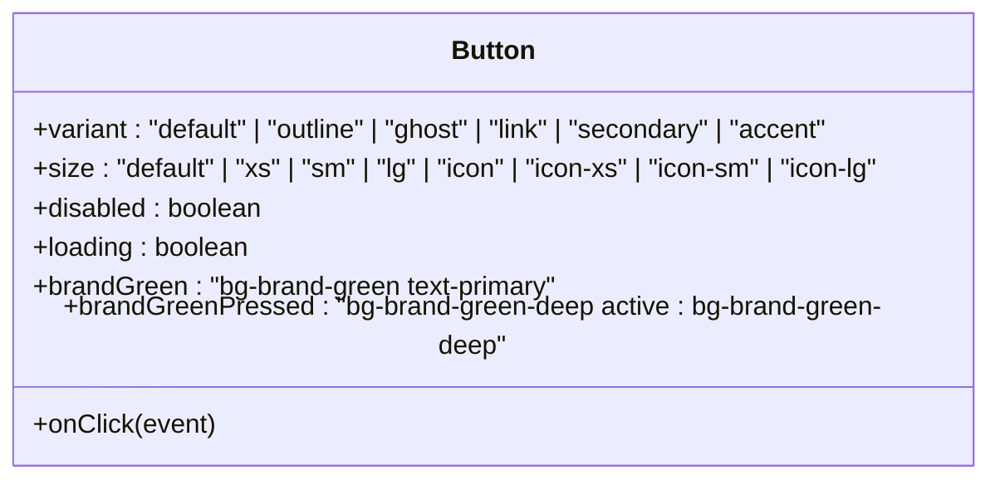

**Diagram sources**
- [button.tsx:1-61](file://apps/web/src/components/ui/button.tsx#L1-L61)

**Section sources**
- [button.tsx:1-61](file://apps/web/src/components/ui/button.tsx#L1-L61)
- [DESIGN.md:184-191](file://DESIGN.md#L184-L191)

### Input
**Enhanced Focus System**
- **Brand-Green Focus Rings**: 2px border with 3px ring opacity
- **Error State Integration**: Destructive tinted containers with inline messaging
- **Dark Mode Support**: Enhanced contrast with oklch color adaptation
- **Accessibility Features**: Proper ARIA invalid states and error announcements

**Design System Implementation**
- **Field Dimensions**: 40px height with 12px horizontal padding
- **Border System**: Hairline borders with brand-green focus indication
- **Label Treatment**: 14px medium weight with 8px gap positioning

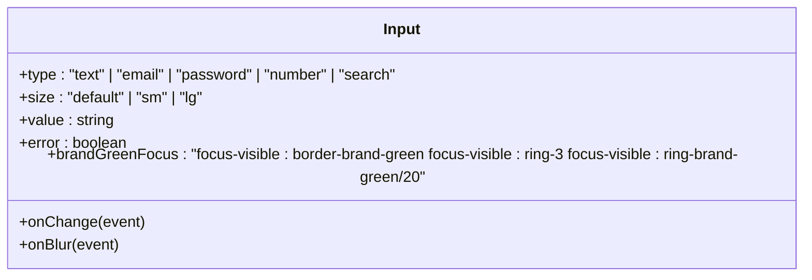

**Diagram sources**
- [input.tsx:1-21](file://apps/web/src/components/ui/input.tsx#L1-L21)

**Section sources**
- [input.tsx:1-21](file://apps/web/src/components/ui/input.tsx#L1-L21)
- [DESIGN.md:207-212](file://DESIGN.md#L207-L212)

### Select
**Enhanced Dropdown Experience**
- **Brand-Conscious Styling**: Consistent with overall design system aesthetic
- **Scroll System**: Custom scroll buttons with brand-green accents
- **Accessibility**: Full keyboard navigation and screen reader support
- **Positioning**: Smart positioning with side and alignment options

**Design System Compliance**
- **Trigger Variants**: Default, ghost, and outline variants with consistent styling
- **Content Styling**: Popover with appropriate elevation and shadow
- **Item States**: Clear visual feedback for selection and interaction

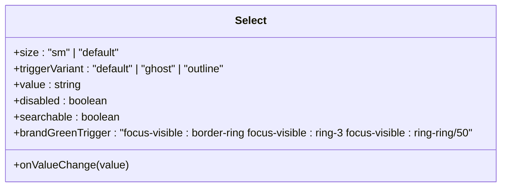

**Diagram sources**
- [select.tsx:1-202](file://apps/web/src/components/ui/select.tsx#L1-L202)

**Section sources**
- [select.tsx:1-202](file://apps/web/src/components/ui/select.tsx#L1-L202)

### Textarea
**Enhanced Field States**
- **Focus Integration**: Consistent brand-green focus ring system
- **Error Handling**: Destructive tinted containers with proper error messaging
- **Dark Mode**: Enhanced contrast with oklch color adaptation
- **Accessibility**: Proper labeling and ARIA support

**Design System Implementation**
- **Field Sizing**: Consistent dimensions with appropriate padding
- **Transition System**: Smooth state changes with 150ms timing
- **Placeholder System**: Proper contrast and positioning

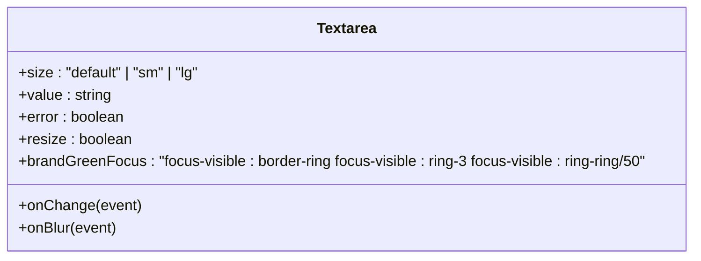

**Diagram sources**
- [textarea.tsx:1-19](file://apps/web/src/components/ui/textarea.tsx#L1-L19)

**Section sources**
- [textarea.tsx:1-19](file://apps/web/src/components/ui/textarea.tsx#L1-L19)

### Label
**Enhanced Accessibility**
- **Focus Management**: Proper focus handling and keyboard navigation
- **Disabled States**: Clear visual indication of disabled status
- **Group Integration**: Works seamlessly with form field groups
- **Accessibility**: Proper association with form controls

**Design System Compliance**
- **Typography**: Consistent 14px medium weight
- **Interaction**: Disabled pointer events with opacity adjustments
- **Group States**: Respects parent disabled states

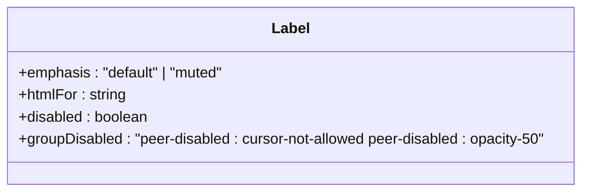

**Diagram sources**
- [label.tsx:1-21](file://apps/web/src/components/ui/label.tsx#L1-L21)

**Section sources**
- [label.tsx:1-21](file://apps/web/src/components/ui/label.tsx#L1-L21)

### Card
**Enhanced Container System**
- **Size Variants**: Default and sm variants with appropriate spacing
- **Slot System**: Comprehensive slot-based composition system
- **Border Management**: Hairline borders with elevation-aware styling
- **Responsive Design**: Flexible sizing with appropriate breakpoints

**Design System Implementation**
- **Rounded Corners**: 12px consistent across all card types
- **Padding System**: Logical spacing with 24px and 32px options
- **Shadow Strategy**: Card Rest elevation with hover enhancement

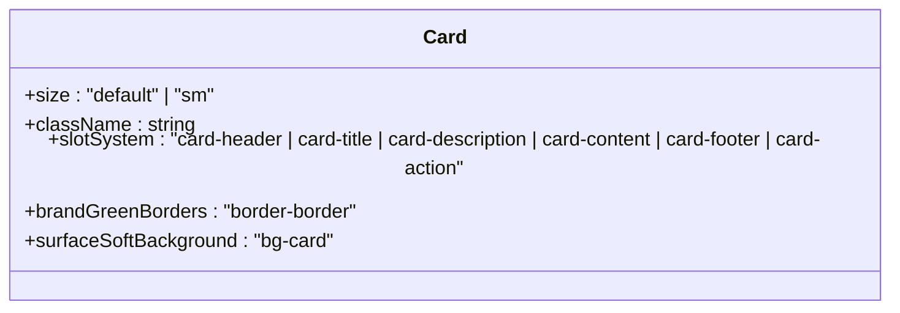

**Diagram sources**
- [card.tsx:1-104](file://apps/web/src/components/ui/card.tsx#L1-L104)

**Section sources**
- [card.tsx:1-104](file://apps/web/src/components/ui/card.tsx#L1-L104)
- [DESIGN.md:192-199](file://DESIGN.md#L192-L199)

### Badge
**Enhanced Status Communication**
- **Variant System**: Default, secondary, destructive, outline, ghost, and link variants
- **Semantic Clarity**: Clear visual communication of status states
- **Accessibility**: Proper focus management and screen reader support
- **Composition**: Flexible sizing with appropriate padding and spacing

**Design System Compliance**
- **Pill Shape**: Rounded badges with appropriate sizing
- **Contrast Standards**: AAA compliance across all variants
- **Focus States**: Consistent ring styling with brand-green emphasis

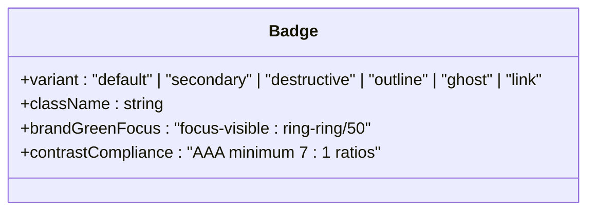

**Diagram sources**
- [badge.tsx:1-53](file://apps/web/src/components/ui/badge.tsx#L1-L53)

**Section sources**
- [badge.tsx:1-53](file://apps/web/src/components/ui/badge.tsx#L1-L53)
- [DESIGN.md:200-206](file://DESIGN.md#L200-L206)

### Avatar
**Enhanced Identity System**
- **Size Variants**: Default, sm, and lg with appropriate scaling
- **Badge System**: Integrated badge with brand-green accent
- **Group Management**: Avatar groups with proper spacing and overlap
- **Fallback System**: Initials with appropriate sizing and contrast

**Design System Implementation**
- **Rounded Corners**: Consistent circular design with hairline borders
- **Blend Modes**: Appropriate blend modes for light and dark themes
- **Count System**: Group counts with proper sizing and positioning

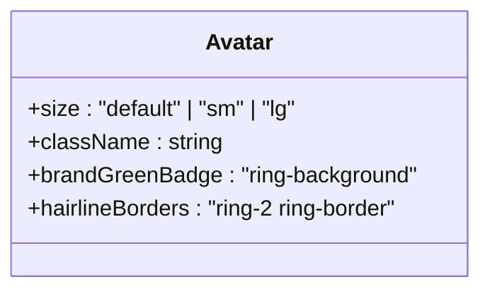

**Diagram sources**
- [avatar.tsx:1-110](file://apps/web/src/components/ui/avatar.tsx#L1-L110)

**Section sources**
- [avatar.tsx:1-110](file://apps/web/src/components/ui/avatar.tsx#L1-L110)

### Table
**Enhanced Data Presentation**
- **Row States**: Hover, selected, and expanded state management
- **Accessibility**: Proper ARIA roles and keyboard navigation
- **Responsive Design**: Scrollable containers with appropriate overflow handling
- **Selection System**: Checkbox integration with proper state management

**Design System Compliance**
- **Density Options**: Comfortable and compact density variants
- **Border System**: Hairline borders with appropriate contrast
- **Alignment Options**: Left, center, and right alignment with consistent spacing

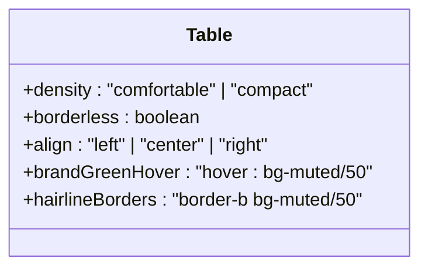

**Diagram sources**
- [table.tsx:1-117](file://apps/web/src/components/ui/table.tsx#L1-L117)

**Section sources**
- [table.tsx:1-117](file://apps/web/src/components/ui/table.tsx#L1-L117)

### Tabs
**Enhanced Navigation System**
- **Orientation Support**: Horizontal and vertical tab orientations
- **Indicator System**: Line and default variants with appropriate styling
- **Accessibility**: Full ARIA support with proper keyboard navigation
- **Responsive Design**: Flexible sizing with appropriate breakpoints

**Design System Implementation**
- **List Variants**: Default and line variants with consistent styling
- **Trigger States**: Active and inactive states with proper focus management
- **Content System**: Panel content with appropriate transitions

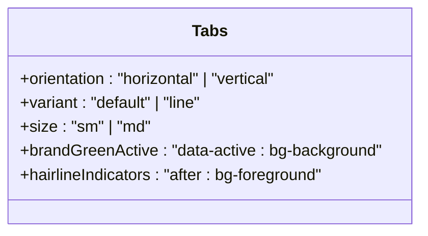

**Diagram sources**
- [tabs.tsx:1-83](file://apps/web/src/components/ui/tabs.tsx#L1-L83)

**Section sources**
- [tabs.tsx:1-83](file://apps/web/src/components/ui/tabs.tsx#L1-L83)

### Dropdown Menu
**Enhanced Menu System**
- **Submenu Support**: Nested menu structures with proper positioning
- **Checkbox/Radio Integration**: Form control integration with proper states
- **Accessibility**: Full ARIA support with keyboard navigation
- **Animation System**: Smooth open/close transitions with appropriate easing

**Design System Compliance**
- **Content Styling**: Popover with appropriate elevation and shadow
- **Item States**: Clear visual feedback for selection and interaction
- **Shortcut System**: Keyboard shortcut display with proper styling

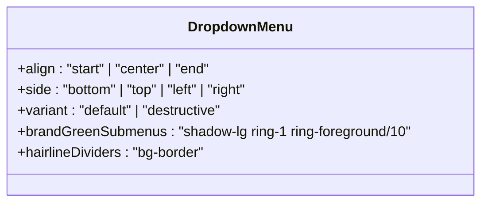

**Diagram sources**
- [dropdown-menu.tsx:1-269](file://apps/web/src/components/ui/dropdown-menu.tsx#L1-L269)

**Section sources**
- [dropdown-menu.tsx:1-269](file://apps/web/src/components/ui/dropdown-menu.tsx#L1-L269)

### Sheet
**Enhanced Modal System**
- **Side Variants**: Top, bottom, left, and right positioning options
- **Close Button Integration**: Consistent close button with brand-green styling
- **Overlay System**: Backdrop with appropriate blur and opacity
- **Accessibility**: Focus trapping and proper modal roles

**Design System Implementation**
- **Content Styling**: Popover with appropriate elevation and shadow
- **Responsive Sizing**: Flexible sizing with appropriate breakpoints
- **Transition System**: Smooth open/close transitions with 200ms timing

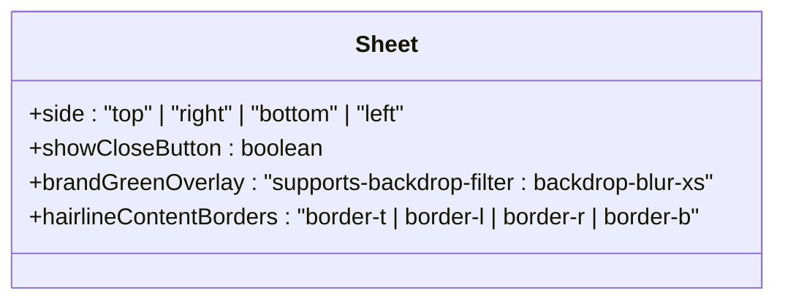

**Diagram sources**
- [sheet.tsx:1-139](file://apps/web/src/components/ui/sheet.tsx#L1-L139)

**Section sources**
- [sheet.tsx:1-139](file://apps/web/src/components/ui/sheet.tsx#L1-L139)

### Separator
**Enhanced Divider System**
- **Orientation Support**: Horizontal and vertical orientation options
- **Thickness Variants**: Default and strong thickness options
- **Accessibility**: Proper semantic markup and screen reader support
- **Design System Compliance**: Consistent hairline border styling

**Design System Implementation**
- **Border System**: Hairline borders with appropriate contrast
- **Orientation Handling**: Dynamic sizing based on orientation
- **Responsive Design**: Flexible sizing with appropriate breakpoints

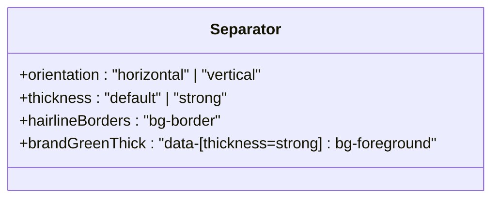

**Diagram sources**
- [separator.tsx:1-26](file://apps/web/src/components/ui/separator.tsx#L1-L26)

**Section sources**
- [separator.tsx:1-26](file://apps/web/src/components/ui/separator.tsx#L1-L26)

### Skeleton
**Enhanced Loading System**
- **Shape Variants**: Rectangle, circle, and text shapes with appropriate sizing
- **Animation System**: Pulse and shimmer animations with consistent timing
- **Design System Compliance**: Consistent muted color usage
- **Performance**: Optimized animation with GPU acceleration

**Design System Implementation**
- **Color System**: Muted color tokens with appropriate opacity
- **Motion Design**: Subtle animations with 1500ms cycle timing
- **Accessibility**: Reduced motion support and screen reader compatibility

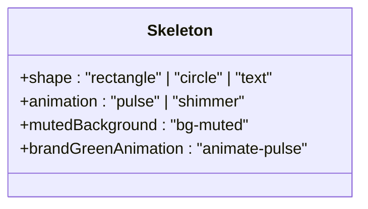

**Diagram sources**
- [skeleton.tsx:1-14](file://apps/web/src/components/ui/skeleton.tsx#L1-L14)

**Section sources**
- [skeleton.tsx:1-14](file://apps/web/src/components/ui/skeleton.tsx#L1-L14)

### Tooltip
**Enhanced Help System**
- **Positioning System**: Smart positioning with appropriate offsets
- **Animation System**: Smooth open/close transitions with delayed opening
- **Accessibility**: Proper focus management and screen reader support
- **Content Flexibility**: Support for rich content including keyboard shortcuts

**Design System Implementation**
- **Content Styling**: Foreground-on-background with appropriate contrast
- **Arrow System**: Proper arrow positioning with brand-green styling
- **Responsive Design**: Adaptive positioning with collision detection

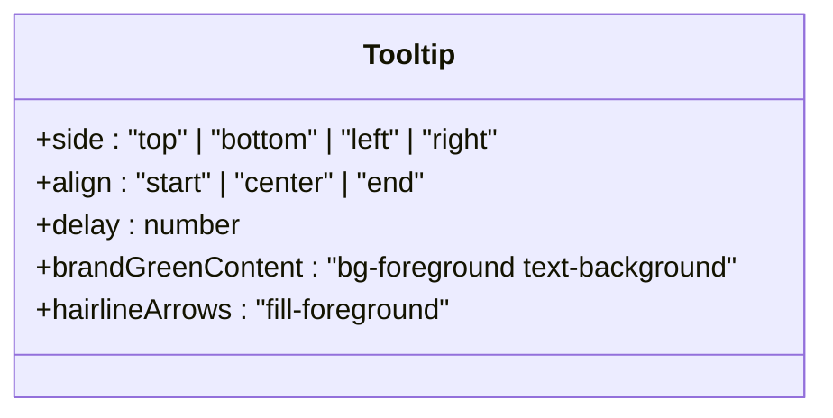

**Diagram sources**
- [tooltip.tsx:1-67](file://apps/web/src/components/ui/tooltip.tsx#L1-L67)

**Section sources**
- [tooltip.tsx:1-67](file://apps/web/src/components/ui/tooltip.tsx#L1-L67)

## Accessibility Guidelines

### WCAG Compliance Standards
The CXSAMAA design system maintains WCAG AAA compliance across all components with specific focus on text contrast ratios and interactive element accessibility.

**Text Contrast Requirements**
- **Body Text**: Minimum 7:1 contrast ratio on all backgrounds
- **Headings**: Minimum 4.5:1 contrast ratio for normal text, 3:1 for large text
- **Interactive Elements**: Minimum 3:1 contrast ratio with appropriate focus states

**Keyboard Navigation**
- **Focus Management**: Consistent focus ring styling with brand-green emphasis
- **Tab Order**: Logical tab order following content hierarchy
- **Shortcuts**: Accessible keyboard shortcuts with proper labeling

**Screen Reader Support**
- **ARIA Roles**: Proper ARIA roles for complex components
- **Labels**: Descriptive labels for interactive elements
- **States**: Clear announcement of state changes and errors

### Design System Accessibility Rules

**The Semantic Pairing Rule**
Every color-coded status must pair with text labels. Color-blind users must receive equivalent information through non-color channels.

**The Two-Face Rule**
Gellix for human language, Geist Mono for machine values. The font change communicates data provenance and computational origin.

**The Uppercase Ceiling Rule**
Uppercase limited to 11px labels with wide tracking. No all-caps body copy, ensuring readability and professional tone.

**Section sources**
- [DESIGN.md:223-242](file://DESIGN.md#L223-L242)

## Dependency Analysis
The UI components depend on the comprehensive CXSAMAA design system specification, with enhanced color token integration and semantic variant systems.

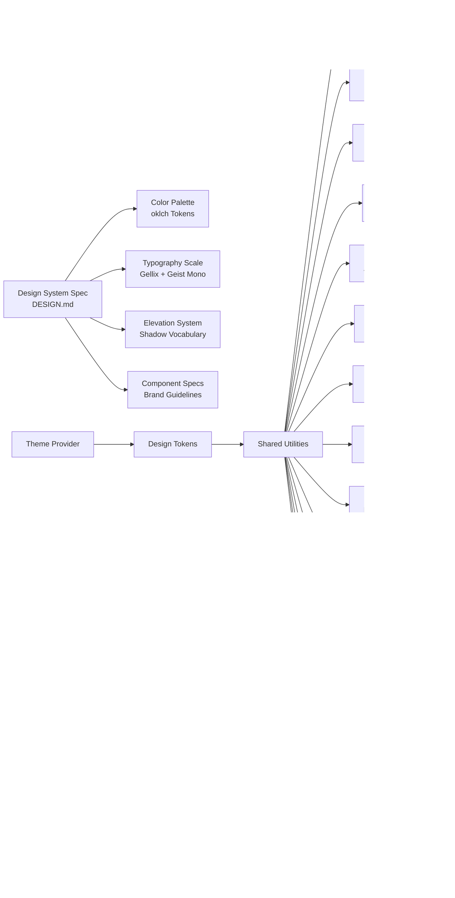

**Diagram sources**
- [DESIGNSPEC:1-242](file://DESIGN.md#L1-L242)
- [providers.tsx:1-200](file://apps/web/src/components/providers.tsx#L1-L200)
- [components.json:1-200](file://apps/web/components.json#L1-L200)
- [globals.css:1-200](file://apps/web/src/app/globals.css#L1-L200)
- [button.tsx:1-61](file://apps/web/src/components/ui/button.tsx#L1-L61)
- [input.tsx:1-21](file://apps/web/src/components/ui/input.tsx#L1-L21)
- [select.tsx:1-202](file://apps/web/src/components/ui/select.tsx#L1-L202)
- [textarea.tsx:1-19](file://apps/web/src/components/ui/textarea.tsx#L1-L19)
- [label.tsx:1-21](file://apps/web/src/components/ui/label.tsx#L1-L21)
- [card.tsx:1-104](file://apps/web/src/components/ui/card.tsx#L1-L104)
- [badge.tsx:1-53](file://apps/web/src/components/ui/badge.tsx#L1-L53)
- [table.tsx:1-117](file://apps/web/src/components/ui/table.tsx#L1-L117)
- [tabs.tsx:1-83](file://apps/web/src/components/ui/tabs.tsx#L1-L83)
- [dropdown-menu.tsx:1-269](file://apps/web/src/components/ui/dropdown-menu.tsx#L1-L269)
- [sheet.tsx:1-139](file://apps/web/src/components/ui/sheet.tsx#L1-L139)
- [separator.tsx:1-26](file://apps/web/src/components/ui/separator.tsx#L1-L26)
- [skeleton.tsx:1-14](file://apps/web/src/components/ui/skeleton.tsx#L1-L14)
- [tooltip.tsx:1-67](file://apps/web/src/components/ui/tooltip.tsx#L1-L67)
- [avatar.tsx:1-110](file://apps/web/src/components/ui/avatar.tsx#L1-L110)

**Section sources**
- [DESIGNSPEC:1-242](file://DESIGN.md#L1-L242)
- [providers.tsx:1-200](file://apps/web/src/components/providers.tsx#L1-L200)
- [components.json:1-200](file://apps/web/components.json#L1-L200)
- [globals.css:1-200](file://apps/web/src/app/globals.css#L1-L200)

## Performance Considerations
- **Color Space Optimization**: oklch color space reduces color calculation overhead
- **Component Composition**: Efficient variant system with minimal CSS duplication
- **Animation Performance**: Hardware-accelerated animations with optimized timing
- **Accessibility Features**: Reduced-motion support for performance-conscious users
- **Bundle Size**: Strategic import of only necessary component variants

## Troubleshooting Guide

### Design System Compliance Issues
- **Color Contrast**: Verify AAA compliance with proper contrast calculations
- **Brand Guidelines**: Ensure mint-green usage follows the restraint rule (3-4 per viewport)
- **Typography Pairing**: Confirm Gellix and Geist Mono font pairing rules are followed
- **Component Specifications**: Verify adherence to design system component specifications

### Accessibility Problems
- **Focus Management**: Ensure consistent focus ring styling across all interactive elements
- **Screen Reader Support**: Verify proper ARIA roles and labels for complex components
- **Keyboard Navigation**: Test full keyboard navigation without mouse dependency
- **Reduced Motion**: Implement reduced-motion alternatives for sensitive users

### Performance Issues
- **Animation Timing**: Optimize transition durations for smooth but efficient interactions
- **Bundle Size**: Monitor component bundle sizes and remove unused variants
- **Color Calculation**: Ensure oklch color calculations are optimized for runtime performance

**Section sources**
- [DESIGNSPEC:223-242](file://DESIGN.md#L223-L242)
- [providers.tsx:1-200](file://apps/web/src/components/providers.tsx#L1-L200)
- [button.tsx:1-61](file://apps/web/src/components/ui/button.tsx#L1-L61)
- [input.tsx:1-21](file://apps/web/src/components/ui/input.tsx#L1-L21)
- [select.tsx:1-202](file://apps/web/src/components/ui/select.tsx#L1-L202)
- [sheet.tsx:1-139](file://apps/web/src/components/ui/sheet.tsx#L1-L139)
- [dropdown-menu.tsx:1-269](file://apps/web/src/components/ui/dropdown-menu.tsx#L1-L269)

## Conclusion
The CXSAMAA UI component library represents a comprehensive design system implementation that balances analytical precision with professional warmth. Through careful color palette curation, geometric typography, and semantic component specifications, the system creates a cohesive interface suitable for retail audio intelligence analysis. The integration of oklch color space ensures perceptual uniformity, while strict accessibility guidelines guarantee inclusive user experiences.

The design system's emphasis on restraint—particularly the mint-green accent rule—creates visual hierarchy without overwhelming users. The two-face typography system clearly distinguishes between human language and machine-generated data, supporting the analytical workflow. Together, these design decisions establish CXSAMAA as a purpose-built interface for audio intelligence analysis rather than a generic enterprise solution.

## Appendices

### Integration Guidelines
- **Design System Adoption**: Implement the comprehensive design system specification before component usage
- **Theme Provider Setup**: Configure the theme provider with proper design token initialization
- **Component Usage**: Follow brand guidelines for component variants and state management
- **Accessibility First**: Ensure all components meet WCAG AAA compliance before deployment

### Extension Guidelines
- **Design System Compliance**: All extensions must adhere to the established design system principles
- **Brand Guidelines**: New variants must follow the mint-green restraint rule and semantic color mapping
- **Accessibility Standards**: Extensions must maintain full accessibility compliance
- **Performance Considerations**: New components must optimize for bundle size and runtime performance

### Design System Maintenance
- **Specification Updates**: Regular review and update of design system specifications
- **Component Evolution**: Thoughtful evolution of component APIs while maintaining backward compatibility
- **Accessibility Audits**: Regular accessibility audits and remediation
- **Performance Monitoring**: Continuous monitoring of component performance and optimization

**Section sources**
- [DESIGNSPEC:96-116](file://DESIGN.md#L96-L116)
- [layout.tsx:1-200](file://apps/web/src/app/layout.tsx#L1-L200)
- [providers.tsx:1-200](file://apps/web/src/components/providers.tsx#L1-L200)
- [components.json:1-200](file://apps/web/components.json#L1-L200)
- [globals.css:1-200](file://apps/web/src/app/globals.css#L1-L200)