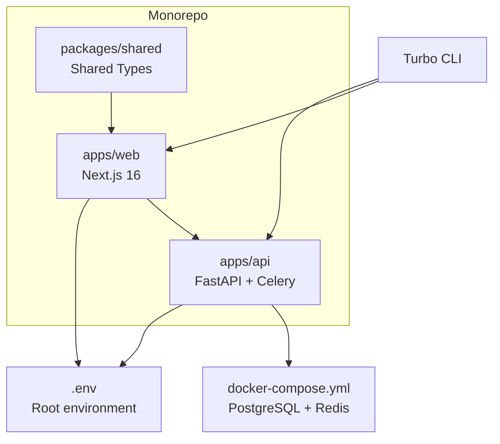

# Getting Started

<cite>
**Referenced Files in This Document**
- [README.md](file://README.md)
- [docker-compose.yml](file://docker-compose.yml)
- [start_servers.sh](file://start_servers.sh)
- [apps/api/pyproject.toml](file://apps/api/pyproject.toml)
- [apps/api/src/config.py](file://apps/api/src/config.py)
- [apps/api/src/main.py](file://apps/api/src/main.py)
- [apps/api/src/database.py](file://apps/api/src/database.py)
- [apps/api/src/workers/celery_app.py](file://apps/api/src/workers/celery_app.py)
- [apps/api/alembic.ini](file://apps/api/alembic.ini)
- [apps/api/scripts/seed.py](file://apps/api/scripts/seed.py)
- [apps/web/package.json](file://apps/web/package.json)
- [apps/web/.env.local](file://apps/web/.env.local)
- [apps/web/next.config.ts](file://apps/web/next.config.ts)
- [package.json](file://package.json)
- [turbo.json](file://turbo.json)
</cite>

## Table of Contents
1. [Introduction](#introduction)
2. [Project Structure](#project-structure)
3. [Prerequisites](#prerequisites)
4. [Development Setup](#development-setup)
5. [Production Setup](#production-setup)
6. [Environment Variables](#environment-variables)
7. [Database Setup](#database-setup)
8. [Application Servers](#application-servers)
9. [Frontend Setup](#frontend-setup)
10. [Celery Worker](#celery-worker)
11. [Auto-start Script](#auto-start-script)
12. [Manual Process Management](#manual-process-management)
13. [Default Credentials](#default-credentials)
14. [Expected Behavior](#expected-behavior)
15. [Troubleshooting](#troubleshooting)
16. [Conclusion](#conclusion)

## Introduction
This guide helps you set up the Xsamaa AI Pipeline for development and production. It covers prerequisites, environment configuration, database migrations, optional seeding, frontend and backend startup, Celery worker initialization, and troubleshooting.

## Project Structure
The repository is a monorepo with:
- Backend API built with FastAPI (Python 3.12+) and Celery workers
- Frontend built with Next.js 16 (React 19)
- Shared TypeScript types under packages/shared
- Docker Compose for PostgreSQL (pgvector) and Redis
- Turborepo for workspace orchestration

**Diagram sources**
- [README.md:10-18](file://README.md#L10-L18)
- [docker-compose.yml:1-35](file://docker-compose.yml#L1-L35)
- [package.json:4-7](file://package.json#L4-L7)
- [turbo.json:3-11](file://turbo.json#L3-L11)

**Section sources**
- [README.md:108-203](file://README.md#L108-L203)
- [package.json:4-7](file://package.json#L4-L7)
- [turbo.json:3-11](file://turbo.json#L3-L11)

## Prerequisites
Install the following tools:
- Python 3.12+ (backend API and workers)
- Node.js 20+ (frontend)
- npm 10+ (workspaces and Turborepo)
- Docker and Docker Compose v2+ (infrastructure)
- ffmpeg (audio preprocessing)
- uv (Python package manager for the API)

Notes:
- The backend uses uv for dependency management.
- The frontend uses Next.js 16 and React 19.
- PostgreSQL with pgvector and Redis are orchestrated via Docker Compose.

**Section sources**
- [README.md:28-38](file://README.md#L28-L38)
- [apps/api/pyproject.toml:5](file://apps/api/pyproject.toml#L5)
- [apps/web/package.json:18](file://apps/web/package.json#L18)

## Development Setup
Recommended approach: use the auto-start script to provision infrastructure, configure environment, run migrations, and launch all services.

Steps:
1. Clone the repository and navigate into the project directory.
2. Start infrastructure:
   - Run Docker Compose to start PostgreSQL (pgvector) and Redis.
3. Configure environment:
   - Copy the example environment file to .env and edit required variables.
4. Set up the API:
   - Create a Python virtual environment using uv.
   - Install development dependencies.
   - Symlink the root .env into apps/api/.
   - Run Alembic migrations.
   - Optionally seed the database.
5. Set up the frontend:
   - Install workspace dependencies using npm.
6. Launch all services:
   - Run the auto-start script to start PostgreSQL/Redis, API, Celery worker, and Next.js.

What the auto-start script does:
- Validates Docker, Node.js, and API dependencies.
- Copies .env.example to .env if missing and symlinks it into apps/api/.
- Starts Docker Compose services and waits for readiness.
- Applies Alembic migrations.
- Starts FastAPI with hot reload, Celery worker, and Next.js.
- Redirects logs to .logs/.

Key commands:
- Start infrastructure: docker compose up -d
- Configure environment: cp .env.example .env
- API setup: uv venv .venv && source .venv/bin/activate && uv pip install -e ".[dev]" && ln -sf ../../.env .env && alembic upgrade head && python scripts/seed.py
- Frontend: npm install
- Auto-start: ./start_servers.sh

**Section sources**
- [README.md:41-127](file://README.md#L41-L127)
- [start_servers.sh:55-174](file://start_servers.sh#L55-L174)

## Production Setup
For production, follow the same steps as development but:
- Use production-grade secrets for JWT and database connections.
- Ensure Docker Compose runs persistent volumes for PostgreSQL and Redis.
- Use production-ready deployment for FastAPI (e.g., Gunicorn + Uvicorn workers) and Celery (with appropriate concurrency and monitoring).
- Configure CORS origins for your domain.
- Set APP_ENV to production and disable debug mode in the API settings.

Operational differences:
- Replace development .env values with production values.
- Use managed PostgreSQL and Redis instances if desired.
- Monitor logs and health checks for all services.

**Section sources**
- [README.md:261-307](file://README.md#L261-L307)
- [apps/api/src/config.py:37-44](file://apps/api/src/config.py#L37-L44)

## Environment Variables
Configure the root .env file with the following minimal required variables:
- DATABASE_URL: PostgreSQL connection string for async SQLAlchemy
- REDIS_URL: Redis connection string for Celery
- NVIDIA_API_KEY: NVIDIA NIM API key
- JWT_SECRET: Random secret for JWT signing (required in production)
- STORAGE_BACKEND: local or s3
- LOCAL_UPLOAD_DIR: Local upload directory path
- NEXT_PUBLIC_API_URL: API base URL for the frontend

Frontend-specific:
- apps/web/.env.local sets NEXT_PUBLIC_API_URL to http://localhost:8000/api/v1.

Full environment reference is available in the repository documentation.

**Section sources**
- [README.md:52-75](file://README.md#L52-L75)
- [README.md:261-307](file://README.md#L261-L307)
- [apps/web/.env.local:1](file://apps/web/.env.local#L1)

## Database Setup
Infrastructure:
- PostgreSQL with pgvector is provided via Docker Compose.
- Redis is used as the Celery broker and result backend.

Initial setup:
- Start Docker Compose services.
- Run Alembic migrations to create tables and extensions.
- Optionally seed the database with sample data.

Migrations:
- Create new migrations after schema changes.
- Apply pending migrations.
- Roll back if needed.

Seeding:
- The seed script creates a brand, stores, salespeople, and users.
- It also enables the pgvector extension.

**Section sources**
- [docker-compose.yml:1-35](file://docker-compose.yml#L1-L35)
- [apps/api/alembic.ini:86-90](file://apps/api/alembic.ini#L86-L90)
- [apps/api/scripts/seed.py:21-108](file://apps/api/scripts/seed.py#L21-L108)

## Application Servers
Backend (FastAPI):
- The API server is configured with CORS, routes, and health endpoint.
- It reads settings from the environment via pydantic-settings.
- Default host/port is 0.0.0.0:8000 with hot reload enabled in development.

Frontend (Next.js):
- Next.js runs on port 3000 in development.
- The frontend consumes the API at NEXT_PUBLIC_API_URL.

Workspace orchestration:
- Turborepo manages builds and dev tasks across apps and packages.
- npm scripts delegate to Turborepo for workspace tasks.

**Section sources**
- [apps/api/src/main.py:1-29](file://apps/api/src/main.py#L1-L29)
- [apps/api/src/config.py:1-52](file://apps/api/src/config.py#L1-L52)
- [apps/web/package.json:5-10](file://apps/web/package.json#L5-L10)
- [package.json:8-14](file://package.json#L8-L14)
- [turbo.json:3-11](file://turbo.json#L3-L11)

## Frontend Setup
Steps:
1. Install workspace dependencies using npm.
2. Ensure NEXT_PUBLIC_API_URL points to the backend API.
3. Start the Next.js development server.

Configuration highlights:
- apps/web/.env.local sets NEXT_PUBLIC_API_URL to http://localhost:8000/api/v1.
- The frontend uses Next.js App Router pages and shared components.

**Section sources**
- [README.md:99-105](file://README.md#L99-L105)
- [apps/web/.env.local:1](file://apps/web/.env.local#L1)
- [apps/web/package.json:5-10](file://apps/web/package.json#L5-L10)

## Celery Worker
Purpose:
- Processes the audio pipeline asynchronously: preprocessing → transcription → diarization → segmentation → analysis → scoring.

Configuration:
- Broker and backend use Redis URL from environment.
- Tasks are included from worker modules.
- Worker settings include serialization, time limits, and prefetch behavior.

Startup:
- Launch Celery worker with concurrency suitable for your environment.
- Monitor logs for task progress and errors.

**Section sources**
- [apps/api/src/workers/celery_app.py:1-31](file://apps/api/src/workers/celery_app.py#L1-L31)
- [apps/api/src/config.py:15](file://apps/api/src/config.py#L15)

## Auto-start Script
The script automates the entire development workflow:
- Validates prerequisites (Docker, Node.js, API dependencies).
- Ensures .env exists and symlinks it into apps/api/.
- Starts Docker Compose and waits for PostgreSQL and Redis readiness.
- Runs Alembic migrations.
- Starts FastAPI, Celery worker, and Next.js.
- Captures logs to .logs/ and handles graceful shutdown.

Usage:
- Make executable and run: ./start_servers.sh
- Stop with Ctrl+C

**Section sources**
- [start_servers.sh:1-174](file://start_servers.sh#L1-L174)

## Manual Process Management
If you prefer managing processes manually, open four terminals:

Terminal 1 — Infrastructure (if not already running)
- docker compose up -d

Terminal 2 — FastAPI server
- cd apps/api
- source .venv/bin/activate
- uvicorn src.main:app --reload --host 0.0.0.0 --port 8000

API docs: http://localhost:8000/docs

Terminal 3 — Celery worker
- cd apps/api
- source .venv/bin/activate
- celery -A src.workers.celery_app worker --loglevel=info --concurrency=4

Terminal 4 — Next.js frontend
- npm run dev:web

Frontend: http://localhost:3000

**Section sources**
- [README.md:128-163](file://README.md#L128-L163)
- [package.json:9](file://package.json#L9)

## Default Credentials
After seeding, you can log in with the following accounts:

- Super Admin: admin@samaa.com / admin123
- Brand Admin: brand@retailmax.com / brand123
- Store Manager: manager@retailmax.com / manager123
- Salesperson: alice@retailmax.com / sales123

These credentials are created by the seed script.

**Section sources**
- [README.md:165-173](file://README.md#L165-L173)
- [apps/api/scripts/seed.py:112-117](file://apps/api/scripts/seed.py#L112-L117)

## Expected Behavior
During initial setup:
- Docker Compose starts PostgreSQL and Redis containers.
- Alembic applies migrations and creates tables, enabling pgvector.
- The API becomes reachable at http://localhost:8000 with interactive docs at /docs.
- The frontend is available at http://localhost:3000.
- Celery worker is ready to process pipeline tasks.
- Optional seeding creates sample data and users.

Logs are captured under .logs/ for inspection.

**Section sources**
- [start_servers.sh:105-129](file://start_servers.sh#L105-L129)
- [apps/api/scripts/seed.py:21-108](file://apps/api/scripts/seed.py#L21-L108)

## Troubleshooting
Common issues and resolutions:
- Docker not found: Install Docker and Docker Compose v2+.
- Node.js not found: Install Node.js 20+ and npm 10+.
- API dependencies missing: Create a virtual environment with uv and install development dependencies.
- .env not found: Copy .env.example to .env and set required variables.
- PostgreSQL not ready: The auto-start script waits for pg_isready; check container health.
- Redis not ready: The auto-start script pings Redis; verify service health.
- NVIDIA API key missing: Set NVIDIA_API_KEY in .env for STT/diarization/LLM.
- CORS errors: Ensure CORS_ORIGINS includes http://localhost:3000.
- Storage backend: For S3-compatible storage, set STORAGE_BACKEND=s3 and provide AWS credentials and bucket details.

**Section sources**
- [start_servers.sh:58-66](file://start_servers.sh#L58-L66)
- [README.md:52-75](file://README.md#L52-L75)
- [apps/api/src/config.py:43](file://apps/api/src/config.py#L43)
- [README.md:234-247](file://README.md#L234-L247)

## Conclusion
You now have the complete setup for the Xsamaa AI Pipeline. Use the auto-start script for a streamlined development experience, or manage services manually across separate terminals. Ensure environment variables are configured, migrations are applied, and the frontend points to the correct API base URL. For production, switch to secure secrets, persistent infrastructure, and monitored deployments.