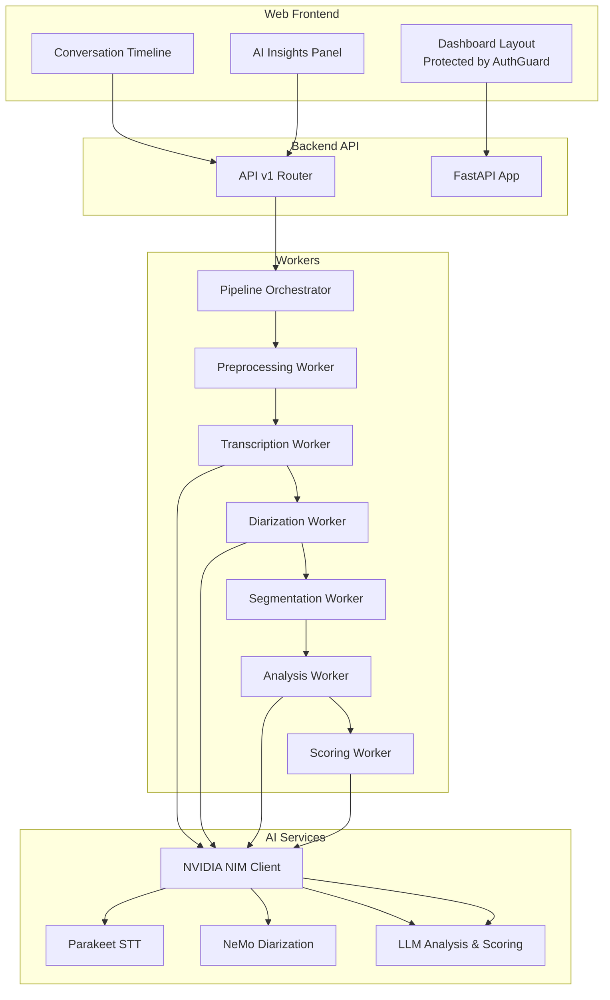
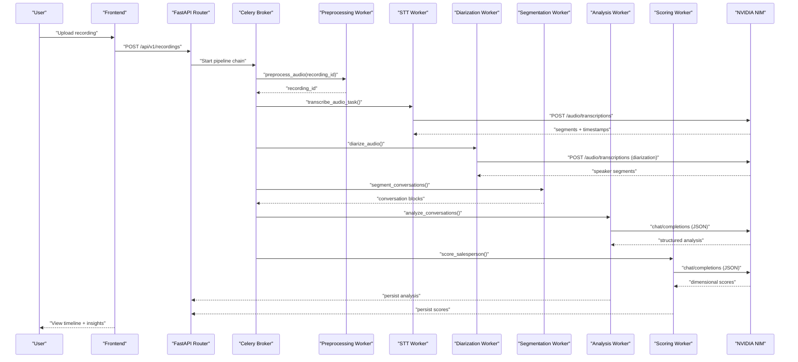
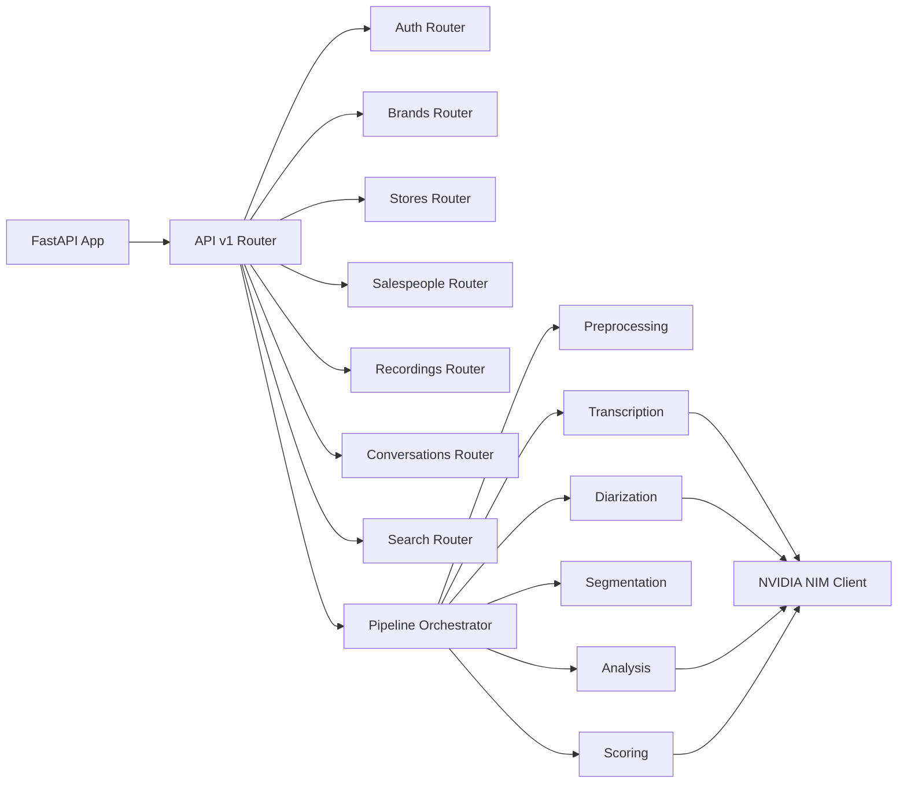
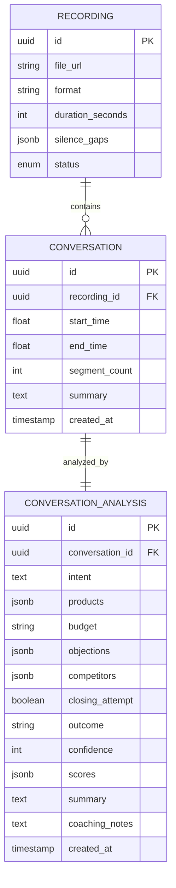

# Core Features

<cite>
**Referenced Files in This Document**
- [apps/api/src/main.py](file://apps/api/src/main.py)
- [apps/api/src/config.py](file://apps/api/src/config.py)
- [apps/api/src/ai/nvidia_client.py](file://apps/api/src/ai/nvidia_client.py)
- [apps/api/src/ai/stt.py](file://apps/api/src/ai/stt.py)
- [apps/api/src/ai/diarizer.py](file://apps/api/src/ai/diarizer.py)
- [apps/api/src/ai/analyzer.py](file://apps/api/src/ai/analyzer.py)
- [apps/api/src/ai/segmenter.py](file://apps/api/src/ai/segmenter.py)
- [apps/api/src/ai/scorer.py](file://apps/api/src/ai/scorer.py)
- [apps/api/src/workers/pipeline.py](file://apps/api/src/workers/pipeline.py)
- [apps/api/src/workers/preprocessing.py](file://apps/api/src/workers/preprocessing.py)
- [apps/api/src/api/v1/router.py](file://apps/api/src/api/v1/router.py)
- [apps/api/src/models/conversation.py](file://apps/api/src/models/conversation.py)
- [apps/web/src/app/(dashboard)/layout.tsx](file://apps/web/src/app/(dashboard)/layout.tsx)
- [apps/web/src/components/features/conversation-timeline.tsx](file://apps/web/src/components/features/conversation-timeline.tsx)
- [apps/web/src/components/features/ai-insights-panel.tsx](file://apps/web/src/components/features/ai-insights-panel.tsx)
</cite>

## Table of Contents
1. [Introduction](#introduction)
2. [Project Structure](#project-structure)
3. [Core Components](#core-components)
4. [Architecture Overview](#architecture-overview)
5. [Detailed Component Analysis](#detailed-component-analysis)
6. [Dependency Analysis](#dependency-analysis)
7. [Performance Considerations](#performance-considerations)
8. [Troubleshooting Guide](#troubleshooting-guide)
9. [Conclusion](#conclusion)
10. [Appendices](#appendices)

## Introduction
This document explains the core features of the Xsamaa AI Pipeline for audio-driven sales conversation analysis. It covers the end-to-end workflow from audio ingestion to AI-powered insights, including speech-to-text transcription, speaker diarization, conversation segmentation, analysis, and performance scoring. It also documents the AI service integrations with NVIDIA NIM APIs, the user-facing dashboard features (analytics, timeline, insights panel, and export), and the role-based access control system. Practical examples illustrate before/after scenarios and expected outcomes, and performance/scalability considerations are included for each major stage.

## Project Structure
The system comprises:
- Backend API (FastAPI) with routers for auth, brands, stores, salespeople, recordings, conversations, and search
- AI service wrappers for STT, diarization, analysis, and scoring via NVIDIA NIM
- Celery-based asynchronous workers orchestrating the audio processing pipeline
- Frontend dashboard with timeline visualization, AI insights panel, and protected routes

**Diagram sources**
- [apps/api/src/main.py:1-29](file://apps/api/src/main.py#L1-L29)
- [apps/api/src/api/v1/router.py:1-20](file://apps/api/src/api/v1/router.py#L1-L20)
- [apps/api/src/workers/pipeline.py:12-35](file://apps/api/src/workers/pipeline.py#L12-L35)
- [apps/api/src/ai/nvidia_client.py:32-274](file://apps/api/src/ai/nvidia_client.py#L32-L274)
- [apps/web/src/app/(dashboard)/layout.tsx:6-21](file://apps/web/src/app/(dashboard)/layout.tsx#L6-L21)
- [apps/web/src/components/features/conversation-timeline.tsx:28-81](file://apps/web/src/components/features/conversation-timeline.tsx#L28-L81)
- [apps/web/src/components/features/ai-insights-panel.tsx:37-202](file://apps/web/src/components/features/ai-insights-panel.tsx#L37-L202)

**Section sources**
- [apps/api/src/main.py:1-29](file://apps/api/src/main.py#L1-L29)
- [apps/api/src/api/v1/router.py:1-20](file://apps/api/src/api/v1/router.py#L1-L20)

## Core Components
- Audio ingestion and preprocessing: Standardizes audio to mono, 16 kHz, normalized volume, detects long silence gaps, and persists metadata.
- Speech-to-text (STT): Uses NVIDIA Parakeet via NIM to produce segment-level transcripts with timestamps.
- Speaker diarization: Uses NVIDIA NeMo via NIM to label speakers; falls back to temporal heuristics if API fails.
- Conversation segmentation: Identifies conversation boundaries using silence gaps, greetings/farewells, and question patterns.
- Analysis: Structured business intelligence extraction via Llama 3.3 70B through NIM chat completions.
- Performance scoring: Multi-dimensional salesperson evaluation via Llama 3.3 70B through NIM chat completions.
- User-facing features: Dashboard analytics, conversation timeline visualization, AI insights panel, and export capabilities.
- Role-based access control: Protected routes enforced by AuthGuard in the frontend; backend routers define resource endpoints.

**Section sources**
- [apps/api/src/workers/preprocessing.py:106-206](file://apps/api/src/workers/preprocessing.py#L106-L206)
- [apps/api/src/ai/stt.py:12-86](file://apps/api/src/ai/stt.py#L12-L86)
- [apps/api/src/ai/diarizer.py:12-206](file://apps/api/src/ai/diarizer.py#L12-L206)
- [apps/api/src/ai/segmenter.py:92-366](file://apps/api/src/ai/segmenter.py#L92-L366)
- [apps/api/src/ai/analyzer.py:47-198](file://apps/api/src/ai/analyzer.py#L47-L198)
- [apps/api/src/ai/scorer.py:66-217](file://apps/api/src/ai/scorer.py#L66-L217)
- [apps/web/src/app/(dashboard)/layout.tsx:6-21](file://apps/web/src/app/(dashboard)/layout.tsx#L6-L21)
- [apps/web/src/components/features/conversation-timeline.tsx:28-81](file://apps/web/src/components/features/conversation-timeline.tsx#L28-L81)
- [apps/web/src/components/features/ai-insights-panel.tsx:37-202](file://apps/web/src/components/features/ai-insights-panel.tsx#L37-L202)

## Architecture Overview
The pipeline is orchestrated asynchronously using Celery. The frontend triggers processing via API endpoints, workers handle each stage independently, and AI services are invoked through the NVIDIA NIM client with robust retry and error handling.

**Diagram sources**
- [apps/api/src/workers/pipeline.py:12-35](file://apps/api/src/workers/pipeline.py#L12-L35)
- [apps/api/src/ai/nvidia_client.py:73-197](file://apps/api/src/ai/nvidia_client.py#L73-L197)
- [apps/api/src/ai/stt.py:12-86](file://apps/api/src/ai/stt.py#L12-L86)
- [apps/api/src/ai/diarizer.py:12-206](file://apps/api/src/ai/diarizer.py#L12-L206)
- [apps/api/src/ai/segmenter.py:92-366](file://apps/api/src/ai/segmenter.py#L92-L366)
- [apps/api/src/ai/analyzer.py:47-198](file://apps/api/src/ai/analyzer.py#L47-L198)
- [apps/api/src/ai/scorer.py:66-217](file://apps/api/src/ai/scorer.py#L66-L217)

## Detailed Component Analysis

### Audio Ingestion and Preprocessing
Purpose:
- Normalize audio to 16 kHz mono, apply gain normalization, detect long silence gaps (>30s), persist metadata, and upload standardized audio.

Methodology:
- Loads audio with pydub, converts channels and frame rate, normalizes amplitude, detects silence ranges, stores gaps in JSONB, exports WAV, and updates duration and status.

Output format:
- Preprocessed WAV bytes stored under a stable key; DB fields include duration and silence gaps.

Practical example:
- Before: 48 kHz stereo clip with inconsistent volume and long pauses.
- After: 16 kHz mono WAV with normalized loudness and silence gaps recorded for segmentation.

Performance/scalability:
- CPU-bound conversion; batching and parallelism via Celery workers; silence detection cost scales with audio length.

**Section sources**
- [apps/api/src/workers/preprocessing.py:106-206](file://apps/api/src/workers/preprocessing.py#L106-L206)

### Speech-to-Text (NVIDIA Parakeet via NIM)
Purpose:
- Produce segment-level transcripts with precise start/end timestamps.

Methodology:
- Posts audio as multipart/form-data to NIM’s transcription endpoint; parses verbose JSON segments or falls back to full text.

Output format:
- Array of segments with numeric start, end, and trimmed text.

Practical example:
- Before: Raw WAV bytes.
- After: Ordered transcript segments aligned to audio timing.

Performance/scalability:
- Network-bound; timeout configured; exponential backoff on 429/5xx; retry up to 3 times.

**Section sources**
- [apps/api/src/ai/stt.py:12-86](file://apps/api/src/ai/stt.py#L12-L86)
- [apps/api/src/ai/nvidia_client.py:73-131](file://apps/api/src/ai/nvidia_client.py#L73-L131)

### Speaker Diarization (NVIDIA NeMo via NIM)
Purpose:
- Attribute turns to speakers using model-derived labels.

Methodology:
- Calls NIM diarization endpoint; supports segment-level or word-level outputs; aggregates words into contiguous speaker segments; falls back to gap-based alternation if API fails.

Output format:
- Array of speaker segments with start, end, and speaker label.

Practical example:
- Before: Untagged transcript segments.
- After: Speaker-labeled segments suitable for segmentation and analysis.

Performance/scalability:
- Network-bound; graceful fallback reduces pipeline failure risk.

**Section sources**
- [apps/api/src/ai/diarizer.py:12-206](file://apps/api/src/ai/diarizer.py#L12-L206)
- [apps/api/src/ai/nvidia_client.py:132-197](file://apps/api/src/ai/nvidia_client.py#L132-L197)

### Conversation Segmentation
Purpose:
- Split continuous transcripts into discrete customer conversations.

Methodology:
- Detects boundaries using silence gaps (>30s), greeting/farewell cues, direct questions after medium gaps, speaker changes, and overlapping preprocessing silence windows; filters trivial conversations.

Output format:
- Array of conversation blocks with start/end times, segment counts, and constituent segments.

Practical example:
- Before: Long continuous transcript with multiple customers.
- After: Cleanly segmented conversations ready for analysis and scoring.

Performance/scalability:
- Heuristic-based; regex patterns precompiled; O(n) scan over segments.

**Section sources**
- [apps/api/src/ai/segmenter.py:92-366](file://apps/api/src/ai/segmenter.py#L92-L366)

### Conversation Analysis (NVIDIA LLM via NIM)
Purpose:
- Extract structured insights: intent, products, budget, objections, competitors, outcome, confidence, summary, and coaching notes.

Methodology:
- Sends formatted conversation to Llama 3.3 70B via chat completions with JSON response format; validates schema and clamps confidence; retries on malformed JSON.

Output format:
- Structured JSON with nested fields and optional scores.

Practical example:
- Before: Transcript segments with speaker labels.
- After: Rich analysis with actionable coaching notes and outcome prediction.

Performance/scalability:
- LLM cost dominates; strict JSON parsing and validation reduce downstream errors.

**Section sources**
- [apps/api/src/ai/analyzer.py:47-198](file://apps/api/src/ai/analyzer.py#L47-L198)
- [apps/api/src/ai/nvidia_client.py:200-236](file://apps/api/src/ai/nvidia_client.py#L200-L236)

### Salesperson Performance Scoring (NVIDIA LLM via NIM)
Purpose:
- Compute dimensional scores: greeting, discovery, product knowledge, objection handling, closing.

Methodology:
- Prompts Llama 3.3 70B with scoring rubric; parses JSON; normalizes to 0–100; computes averages across conversations.

Output format:
- Scores object per conversation and averaged metrics.

Practical example:
- Before: Conversation segments.
- After: Dimensional performance scores and coaching insights.

Performance/scalability:
- LLM cost; batching multiple conversations improves throughput.

**Section sources**
- [apps/api/src/ai/scorer.py:66-217](file://apps/api/src/ai/scorer.py#L66-L217)
- [apps/api/src/ai/nvidia_client.py:200-236](file://apps/api/src/ai/nvidia_client.py#L200-L236)

### AI Service Integrations (NVIDIA NIM)
- HTTP client encapsulates authentication, timeouts, retry/backoff, and error classification (rate limit, auth, others).
- Chat completions and embeddings endpoints support structured JSON outputs.
- STT and diarization leverage NIM’s OpenAI-compatible audio endpoints.

**Section sources**
- [apps/api/src/config.py:28-36](file://apps/api/src/config.py#L28-L36)
- [apps/api/src/ai/nvidia_client.py:32-274](file://apps/api/src/ai/nvidia_client.py#L32-L274)

### User-Facing Features
- Dashboard layout protected by AuthGuard ensures authorized access.
- Conversation timeline: horizontal bars colored by outcome, clickable to focus on a conversation.
- AI insights panel: cards displaying intent, outcome, budget, products, objections, competitors, closing, summary, coaching notes, and dimensional scores.
- Export capabilities: available via API endpoints routed under /api/v1 (e.g., recordings, conversations).

**Section sources**
- [apps/web/src/app/(dashboard)/layout.tsx:6-21](file://apps/web/src/app/(dashboard)/layout.tsx#L6-L21)
- [apps/web/src/components/features/conversation-timeline.tsx:28-81](file://apps/web/src/components/features/conversation-timeline.tsx#L28-L81)
- [apps/web/src/components/features/ai-insights-panel.tsx:37-202](file://apps/web/src/components/features/ai-insights-panel.tsx#L37-L202)
- [apps/api/src/api/v1/router.py:1-20](file://apps/api/src/api/v1/router.py#L1-L20)

### Role-Based Access Control
- Frontend enforces route protection via AuthGuard.
- Backend exposes resource routers for brands, stores, salespeople, recordings, conversations, and search; access depends on authenticated sessions and permissions managed by the auth router.

**Section sources**
- [apps/web/src/app/(dashboard)/layout.tsx:6-21](file://apps/web/src/app/(dashboard)/layout.tsx#L6-L21)
- [apps/api/src/api/v1/router.py:1-20](file://apps/api/src/api/v1/router.py#L1-L20)

## Dependency Analysis
The backend composes modular components:
- FastAPI app registers CORS and includes API v1 router.
- API v1 router mounts feature-specific routers.
- Pipeline orchestrator chains workers; each worker integrates with AI services via the NVIDIA client.
- Data models define conversations and analysis records persisted to PostgreSQL.

**Diagram sources**
- [apps/api/src/main.py:1-29](file://apps/api/src/main.py#L1-L29)
- [apps/api/src/api/v1/router.py:1-20](file://apps/api/src/api/v1/router.py#L1-L20)
- [apps/api/src/workers/pipeline.py:12-35](file://apps/api/src/workers/pipeline.py#L12-L35)
- [apps/api/src/ai/nvidia_client.py:32-274](file://apps/api/src/ai/nvidia_client.py#L32-L274)

**Section sources**
- [apps/api/src/main.py:1-29](file://apps/api/src/main.py#L1-L29)
- [apps/api/src/api/v1/router.py:1-20](file://apps/api/src/api/v1/router.py#L1-L20)
- [apps/api/src/models/conversation.py:11-61](file://apps/api/src/models/conversation.py#L11-L61)

## Performance Considerations
- STT and diarization are network-bound; configure timeouts and retries to mitigate latency spikes.
- LLM-based analysis and scoring are compute-bound; batch multiple conversations to amortize cost and latency.
- Preprocessing is CPU-bound; leverage worker parallelism and efficient audio libraries.
- Database writes for analysis and scores should be indexed on foreign keys (recording_id, conversation_id) for fast retrieval.
- Frontend rendering of timelines and insights scales with conversation count; virtualization or pagination can improve UX for large datasets.

[No sources needed since this section provides general guidance]

## Troubleshooting Guide
Common issues and remedies:
- Authentication failures to NIM: Verify API key and base URL; check rate limits and retry delays.
- Rate limiting: Exponential backoff is built-in; monitor logs for 429 responses.
- API errors: Inspect status codes and response bodies; ensure correct model names and response formats.
- Diarization failures: Pipeline gracefully falls back to gap-based speaker assignment; review logs for warnings.
- Malformed LLM responses: Schema validation and retries are applied; inspect assistant messages for correction prompts.
- Preprocessing failures: Retries with capped attempts; check storage connectivity and audio format compatibility.

**Section sources**
- [apps/api/src/ai/nvidia_client.py:52-131](file://apps/api/src/ai/nvidia_client.py#L52-L131)
- [apps/api/src/ai/diarizer.py:43-46](file://apps/api/src/ai/diarizer.py#L43-L46)
- [apps/api/src/ai/analyzer.py:82-116](file://apps/api/src/ai/analyzer.py#L82-L116)
- [apps/api/src/ai/scorer.py:98-121](file://apps/api/src/ai/scorer.py#L98-L121)
- [apps/api/src/workers/preprocessing.py:195-206](file://apps/api/src/workers/preprocessing.py#L195-L206)

## Conclusion
Xsamaa AI Pipeline automates the full lifecycle of sales conversation analysis with robust AI integrations and a scalable worker architecture. The frontend delivers actionable insights through timeline and insights panels, while RBAC protects access to resources. By tuning retries, batching, and parallelism, teams can achieve reliable, high-throughput audio processing.

[No sources needed since this section summarizes without analyzing specific files]

## Appendices

### Data Models Overview

**Diagram sources**
- [apps/api/src/models/conversation.py:11-61](file://apps/api/src/models/conversation.py#L11-L61)