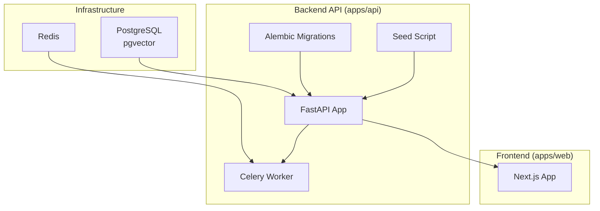
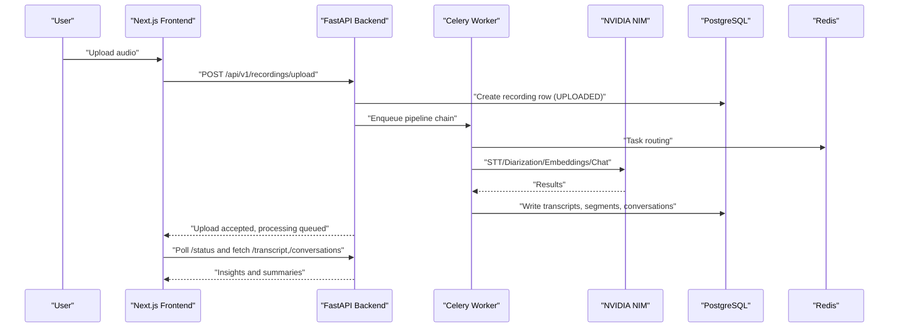
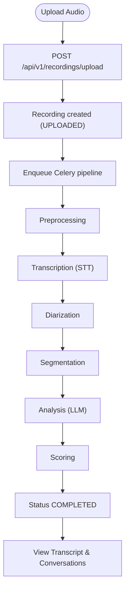
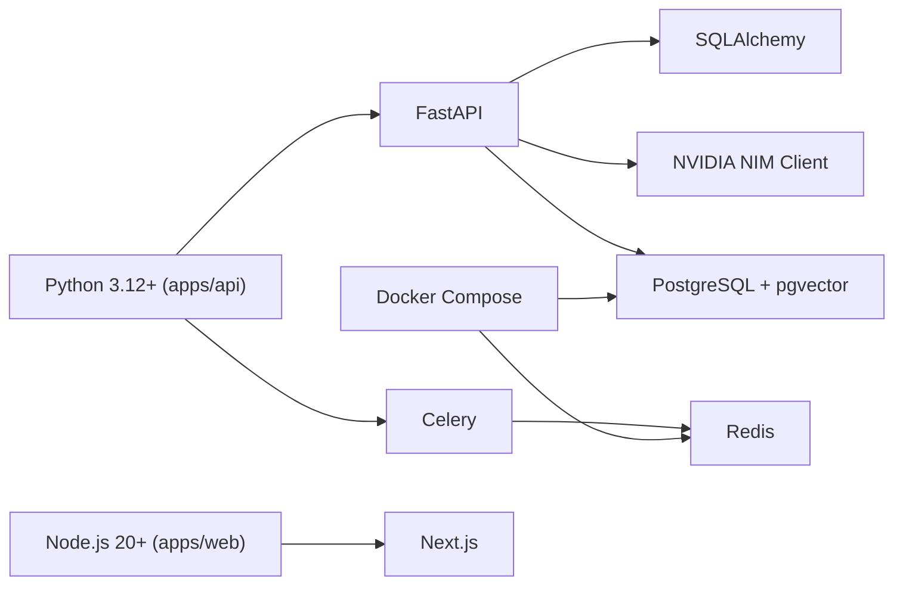

# Getting Started

<cite>
**Referenced Files in This Document**
- [README.md](file://README.md)
- [docker-compose.yml](file://docker-compose.yml)
- [start_servers.sh](file://start_servers.sh)
- [apps/api/pyproject.toml](file://apps/api/pyproject.toml)
- [apps/web/package.json](file://apps/web/package.json)
- [apps/api/src/config.py](file://apps/api/src/config.py)
- [apps/api/src/main.py](file://apps/api/src/main.py)
- [apps/api/scripts/seed.py](file://apps/api/scripts/seed.py)
- [apps/api/alembic.ini](file://apps/api/alembic.ini)
- [apps/api/src/ai/nvidia_client.py](file://apps/api/src/ai/nvidia_client.py)
- [apps/api/src/workers/pipeline.py](file://apps/api/src/workers/pipeline.py)
- [apps/api/src/api/v1/recordings.py](file://apps/api/src/api/v1/recordings.py)
- [apps/api/src/models/recording.py](file://apps/api/src/models/recording.py)
- [apps/web/src/app/(auth)/login/page.tsx](file://apps/web/src/app/(auth)/login/page.tsx)
</cite>

## Table of Contents
1. [Introduction](#introduction)
2. [Project Structure](#project-structure)
3. [Core Components](#core-components)
4. [Architecture Overview](#architecture-overview)
5. [Detailed Component Analysis](#detailed-component-analysis)
6. [Dependency Analysis](#dependency-analysis)
7. [Performance Considerations](#performance-considerations)
8. [Troubleshooting Guide](#troubleshooting-guide)
9. [Conclusion](#conclusion)
10. [Appendices](#appendices)

## Introduction
This guide helps you install, configure, and run the Xsamaa AI Pipeline locally. You will:
- Install prerequisites (Docker, Node.js, Python, uv, ffmpeg)
- Initialize the database and AI service configuration
- Start the development stack (PostgreSQL, Redis, API, Celery worker, and Next.js frontend)
- Upload a test audio file, trigger processing, and view insights
- Verify all components are working and troubleshoot common issues
- Create an initial admin user and log in for the first time

## Project Structure
The repository is a monorepo with:
- Backend API (FastAPI) under apps/api
- Frontend (Next.js) under apps/web
- Shared TypeScript types under packages/shared
- Docker Compose for infrastructure (PostgreSQL + Redis)
- Turborepo configuration for building and managing workspaces

**Diagram sources**
- [docker-compose.yml:1-35](file://docker-compose.yml#L1-L35)
- [apps/api/src/main.py:1-29](file://apps/api/src/main.py#L1-L29)
- [apps/api/src/workers/pipeline.py:1-35](file://apps/api/src/workers/pipeline.py#L1-L35)
- [apps/api/alembic.ini:1-151](file://apps/api/alembic.ini#L1-L151)
- [apps/api/scripts/seed.py:1-121](file://apps/api/scripts/seed.py#L1-L121)
- [apps/web/package.json:1-38](file://apps/web/package.json#L1-L38)

**Section sources**
- [README.md:108-164](file://README.md#L108-L164)
- [docker-compose.yml:1-35](file://docker-compose.yml#L1-L35)
- [apps/api/src/main.py:1-29](file://apps/api/src/main.py#L1-L29)
- [apps/web/package.json:1-38](file://apps/web/package.json#L1-L38)

## Core Components
- Backend API: FastAPI application with routes, services, AI integrations, and Celery workers for asynchronous processing.
- Frontend: Next.js application with authentication, dashboards, and insights views.
- Infrastructure: PostgreSQL (with pgvector) and Redis managed via Docker Compose.
- AI Services: NVIDIA NIM APIs for STT, diarization, embeddings, and LLM-based analysis.
- Dev Automation: A launcher script to check prerequisites, start infrastructure, run migrations, and launch all services.

What you will set up:
- Prerequisites and environment variables
- Database initialization and optional seed data
- AI service configuration (NVIDIA API key and models)
- Local development server startup
- First-time login and basic usage

**Section sources**
- [README.md:28-38](file://README.md#L28-L38)
- [apps/api/src/config.py:1-52](file://apps/api/src/config.py#L1-L52)
- [apps/api/src/ai/nvidia_client.py:1-274](file://apps/api/src/ai/nvidia_client.py#L1-L274)
- [start_servers.sh:1-174](file://start_servers.sh#L1-L174)

## Architecture Overview
The pipeline processes audio recordings asynchronously:
1. Preprocessing (normalize, resample, silence detection)
2. Transcription (NVIDIA Parakeet STT)
3. Diarization (speaker turns)
4. Segmentation (conversation units)
5. Analysis (LLM insights)
6. Scoring (performance metrics)

**Diagram sources**
- [apps/api/src/workers/pipeline.py:12-35](file://apps/api/src/workers/pipeline.py#L12-L35)
- [apps/api/src/ai/nvidia_client.py:73-197](file://apps/api/src/ai/nvidia_client.py#L73-L197)
- [apps/api/src/api/v1/recordings.py:110-167](file://apps/api/src/api/v1/recordings.py#L110-L167)
- [apps/api/src/models/recording.py:12-60](file://apps/api/src/models/recording.py#L12-L60)

## Detailed Component Analysis

### Prerequisites and Environment Setup
- Tools required:
  - Python 3.12+ (backend)
  - Node.js 20+ (frontend)
  - npm 10+ (workspaces)
  - Docker and Docker Compose v2+ (infrastructure)
  - ffmpeg (audio preprocessing)
  - uv (Python package manager)
- Copy and edit the root environment file:
  - Copy .env.example to .env
  - Set at minimum:
    - DATABASE_URL
    - REDIS_URL
    - NVIDIA_API_KEY
    - JWT_SECRET (for production)
    - STORAGE_BACKEND and LOCAL_UPLOAD_DIR (or S3 settings)
- Frontend reads NEXT_PUBLIC_API_URL from apps/web/.env.local

Verification steps:
- Confirm Docker Compose services are healthy
- Confirm API and frontend ports are reachable
- Confirm migrations applied and seed script ran (optional)

**Section sources**
- [README.md:28-75](file://README.md#L28-L75)
- [README.md:108-127](file://README.md#L108-L127)
- [docker-compose.yml:1-35](file://docker-compose.yml#L1-L35)
- [apps/api/src/config.py:11-48](file://apps/api/src/config.py#L11-L48)
- [apps/web/src/app/(auth)/login/page.tsx:14-40](file://apps/web/src/app/(auth)/login/page.tsx#L14-L40)

### Database Initialization and Seeding
- Start infrastructure:
  - docker compose up -d
- Apply migrations:
  - cd apps/api && source .venv/bin/activate && alembic upgrade head
- Optionally seed the database:
  - python scripts/seed.py

What seeding creates:
- A brand, two stores, several salespeople
- Test users with roles and credentials

**Section sources**
- [README.md:43-98](file://README.md#L43-L98)
- [apps/api/alembic.ini:1-151](file://apps/api/alembic.ini#L1-L151)
- [apps/api/scripts/seed.py:21-117](file://apps/api/scripts/seed.py#L21-L117)

### AI Service Configuration (NVIDIA NIM)
- Set NVIDIA_API_KEY in .env
- Models configured:
  - STT model
  - Diarization model
  - LLM model
  - Embedding model
- The backend uses a robust client with retry logic, timeouts, and error handling

Verification:
- Health endpoint responds
- NVIDIA client authenticates and retries on transient errors

**Section sources**
- [README.md:59-75](file://README.md#L59-L75)
- [apps/api/src/config.py:28-35](file://apps/api/src/config.py#L28-L35)
- [apps/api/src/ai/nvidia_client.py:32-131](file://apps/api/src/ai/nvidia_client.py#L32-L131)

### Local Development Server Startup
Option A: Single launcher
- ./start_servers.sh
- Automatically checks prerequisites, starts Docker, waits for readiness, runs migrations, launches API, Celery, and Next.js

Option B: Manual (four terminals)
- Infrastructure: docker compose up -d
- API: uvicorn src.main:app --reload --host 0.0.0.0 --port 8000
- Celery: celery -A src.workers.celery_app worker --loglevel=info --concurrency=2
- Frontend: npm run dev:web

**Section sources**
- [README.md:108-164](file://README.md#L108-L164)
- [start_servers.sh:55-174](file://start_servers.sh#L55-L174)
- [apps/api/src/main.py:7-28](file://apps/api/src/main.py#L7-L28)

### Initial Admin User Creation and First-Time Login
- After seeding, test credentials are available:
  - Super Admin: admin@samaa.com / admin123
  - Brand Admin: brand@retailmax.com / brand123
  - Store Manager: manager@retailmax.com / manager123
  - Salesperson: alice@retailmax.com / sales123
- Navigate to the frontend login page and sign in with one of the accounts

**Section sources**
- [README.md:165-173](file://README.md#L165-L173)
- [apps/api/scripts/seed.py:112-117](file://apps/api/scripts/seed.py#L112-L117)
- [apps/web/src/app/(auth)/login/page.tsx:14-40](file://apps/web/src/app/(auth)/login/page.tsx#L14-L40)

### Practical Example: Upload, Process, and View Insights
Steps:
1. Start all services (see “Local Development Server Startup”)
2. Open the frontend at http://localhost:3000
3. Log in with a test user
4. Go to the recordings page and upload a supported audio file (wav, mp3, m4a)
5. Observe the recording status change through the pipeline
6. View the transcript and conversation insights

Key endpoints and flows:
- Upload: POST /api/v1/recordings/upload
- Status: GET /api/v1/recordings/{id}/status
- Transcript: GET /api/v1/recordings/{id}/transcript
- Conversations: GET /api/v1/recordings/{id}/conversations
- Summary: GET /api/v1/recordings/{id}/summary

**Diagram sources**
- [apps/api/src/api/v1/recordings.py:110-167](file://apps/api/src/api/v1/recordings.py#L110-L167)
- [apps/api/src/workers/pipeline.py:12-35](file://apps/api/src/workers/pipeline.py#L12-L35)
- [apps/api/src/models/recording.py:12-22](file://apps/api/src/models/recording.py#L12-L22)

**Section sources**
- [apps/api/src/api/v1/recordings.py:110-254](file://apps/api/src/api/v1/recordings.py#L110-L254)
- [apps/api/src/models/recording.py:12-60](file://apps/api/src/models/recording.py#L12-L60)

## Dependency Analysis
- Backend dependencies (selected):
  - FastAPI, Uvicorn, SQLAlchemy asyncio, Alembic, Celery, Redis, Pydantic, Pydantic Settings, HTTPX, NumPy, pydub, bcrypt
- Frontend dependencies (selected):
  - Next.js, React, TanStack Query, Zustand, Tailwind CSS, shadcn/ui, Recharts
- Monorepo tooling:
  - Turborepo and npm workspaces

**Diagram sources**
- [apps/api/pyproject.toml:1-43](file://apps/api/pyproject.toml#L1-L43)
- [apps/web/package.json:1-38](file://apps/web/package.json#L1-L38)
- [docker-compose.yml:1-35](file://docker-compose.yml#L1-L35)

**Section sources**
- [apps/api/pyproject.toml:1-43](file://apps/api/pyproject.toml#L1-L43)
- [apps/web/package.json:1-38](file://apps/web/package.json#L1-L38)

## Performance Considerations
- Concurrency: Adjust Celery worker concurrency to match CPU and GPU resources
- Retries: NVIDIA client includes exponential backoff for transient failures
- Storage: Local storage is fine for development; consider S3-compatible storage for scale
- Database: Use async SQLAlchemy and keep migrations current

[No sources needed since this section provides general guidance]

## Troubleshooting Guide
Common issues and resolutions:
- Docker not found or services not running
  - Ensure Docker and Docker Compose are installed and running
  - Use the launcher script to start services and wait for readiness
- Node not found
  - Install Node.js 20+ and npm 10+
  - Install workspace dependencies from the repository root
- API dependencies not found
  - Create and activate a Python virtual environment
  - Install backend dependencies using uv per the README
- NVIDIA API authentication failure
  - Set NVIDIA_API_KEY in .env
  - Verify model names and base URL in settings
- Database not ready
  - The launcher waits for PostgreSQL and Redis; check logs in .logs/
  - Ensure migrations are applied after infrastructure starts
- Frontend cannot reach API
  - Confirm NEXT_PUBLIC_API_URL in apps/web/.env.local points to http://localhost:8000
- Rate limits or timeouts
  - The NVIDIA client retries on 429/5xx; consider lowering concurrency or increasing timeouts

**Section sources**
- [start_servers.sh:55-129](file://start_servers.sh#L55-L129)
- [apps/api/src/ai/nvidia_client.py:48-72](file://apps/api/src/ai/nvidia_client.py#L48-L72)
- [apps/api/src/config.py:28-35](file://apps/api/src/config.py#L28-L35)
- [README.md:108-164](file://README.md#L108-L164)

## Conclusion
You now have a fully functional local development environment for the Xsamaa AI Pipeline. You can upload audio, watch it move through the pipeline, and inspect AI-generated insights. Use the provided scripts and environment configuration to streamline setup and troubleshooting.

[No sources needed since this section summarizes without analyzing specific files]

## Appendices

### Verification Checklist
- Docker Compose services healthy
- API responds to /health
- Migrations applied
- Seed script executed (optional)
- Frontend loads and login works
- Upload succeeds and status progresses through pipeline
- Transcript and conversations are available

**Section sources**
- [apps/api/src/main.py:26-28](file://apps/api/src/main.py#L26-L28)
- [apps/api/scripts/seed.py:107-108](file://apps/api/scripts/seed.py#L107-L108)
- [apps/api/src/api/v1/recordings.py:110-167](file://apps/api/src/api/v1/recordings.py#L110-L167)