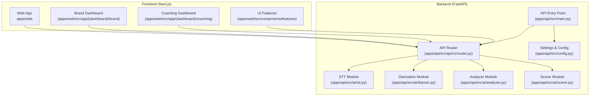
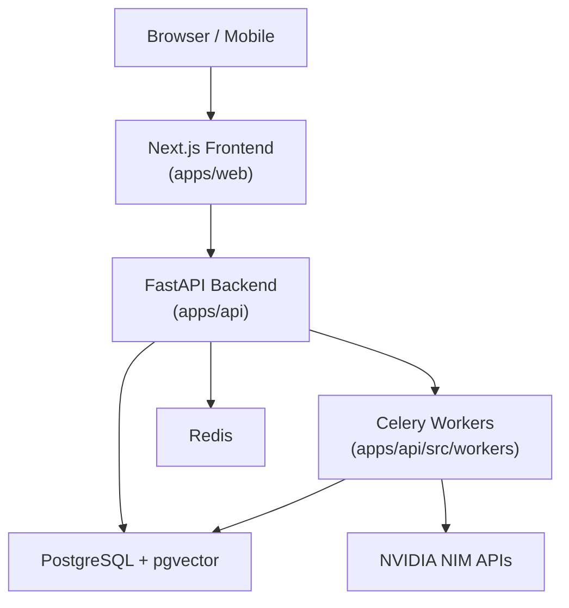
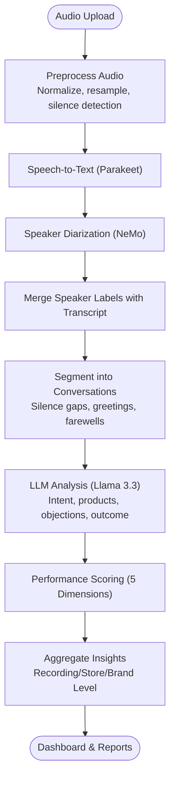
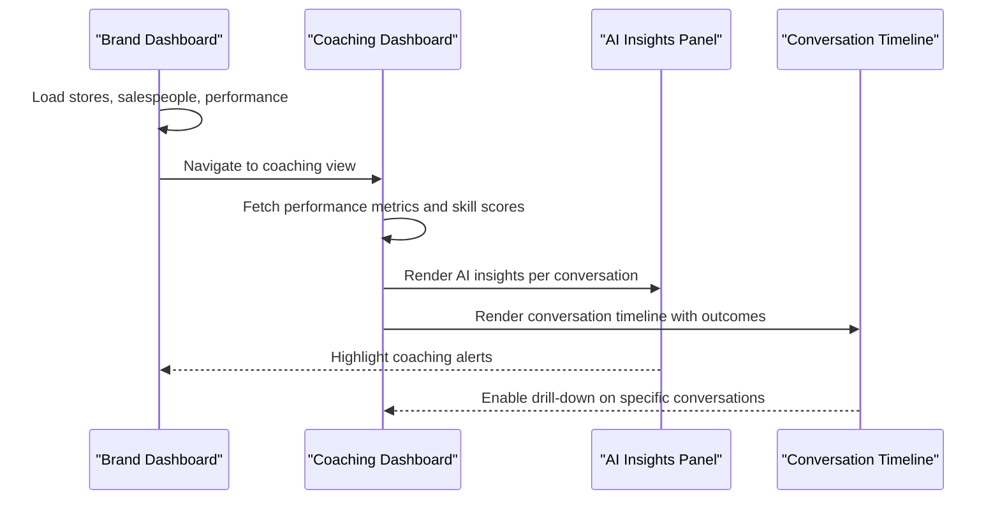
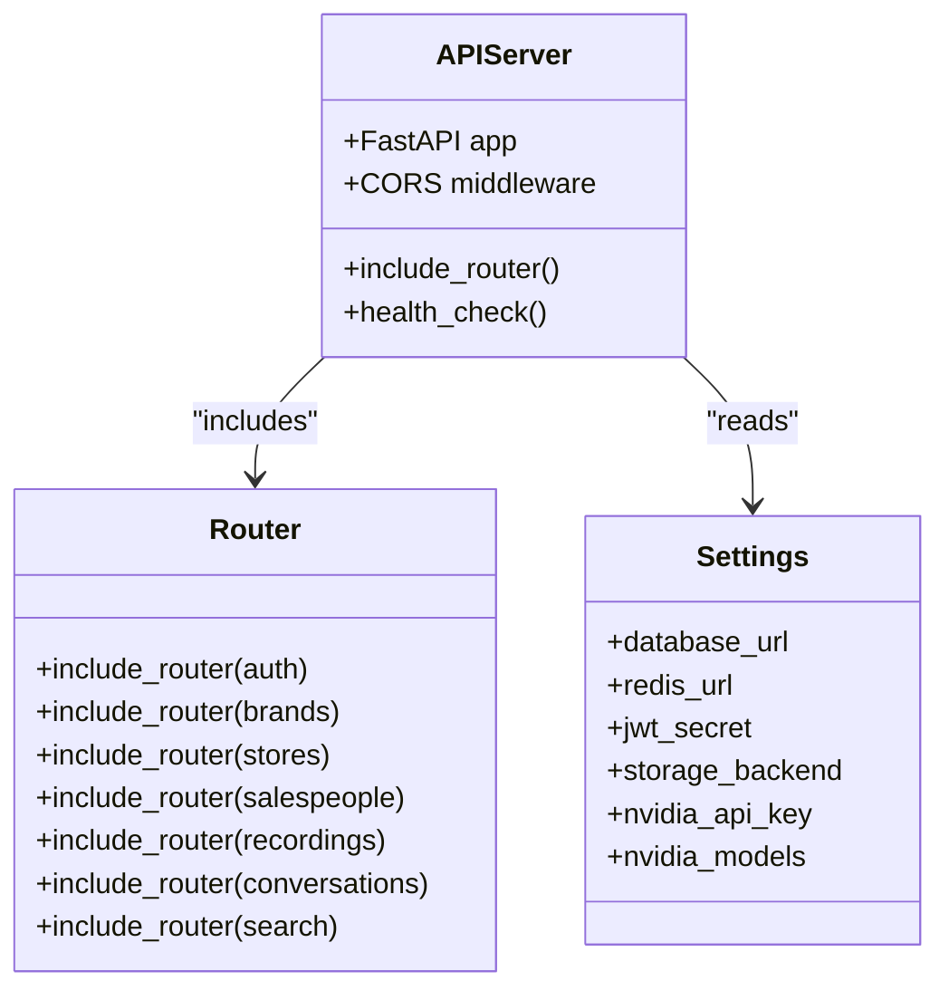
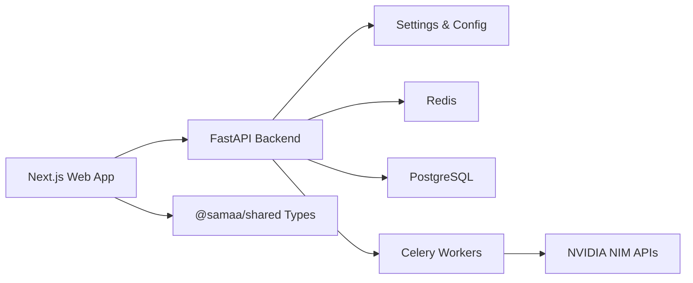

# Introduction & Purpose

<cite>
**Referenced Files in This Document**
- [README.md](file://README.md)
- [SAMAA_PRD.md](file://docs/SAMAA_PRD.md)
- [main.py](file://apps/api/src/main.py)
- [config.py](file://apps/api/src/config.py)
- [router.py](file://apps/api/src/api/v1/router.py)
- [stt.py](file://apps/api/src/ai/stt.py)
- [diarizer.py](file://apps/api/src/ai/diarizer.py)
- [analyzer.py](file://apps/api/src/ai/analyzer.py)
- [scorer.py](file://apps/api/src/ai/scorer.py)
- [layout.tsx](file://apps/web/src/app/layout.tsx)
- [brand/page.tsx](file://apps/web/src/app/(dashboard)/brand/page.tsx)
- [coaching/page.tsx](file://apps/web/src/app/(dashboard)/coaching/page.tsx)
- [ai-insights-panel.tsx](file://apps/web/src/components/features/ai-insights-panel.tsx)
- [conversation-timeline.tsx](file://apps/web/src/components/features/conversation-timeline.tsx)
</cite>

## Table of Contents
1. [Introduction](#introduction)
2. [Project Structure](#project-structure)
3. [Core Components](#core-components)
4. [Architecture Overview](#architecture-overview)
5. [Detailed Component Analysis](#detailed-component-analysis)
6. [Dependency Analysis](#dependency-analysis)
7. [Performance Considerations](#performance-considerations)
8. [Troubleshooting Guide](#troubleshooting-guide)
9. [Conclusion](#conclusion)

## Introduction
CXSAMAA is an enterprise AI platform that transforms unstructured sales call audio into structured, actionable insights for retail organizations. Its mission is to give retail leaders unprecedented visibility into real customer conversations, turning hours of raw audio into reliable intelligence that drives coaching, performance tracking, and data-driven decisions across brands, stores, and individual salespeople.

Traditional sales analytics often rely on manual sampling, surveys, or basic call monitoring that provides limited context. These approaches miss the richness of actual customer interactions and fail to scale across large retail networks. CXSAMAA’s unique approach combines multiple AI services into a seamless pipeline: automatic speech recognition (ASR), speaker diarization, conversation segmentation, AI-powered analysis, and performance scoring. This integrated workflow delivers consistent, high-quality insights at enterprise scale.

Target audience
- Retail brand managers who need cross-store performance visibility and strategic insights
- Store supervisors who want to identify coaching opportunities and track team performance
- Sales coaches who require specific, behavior-based recommendations grounded in real conversations
- Individual salespeople who benefit from personalized feedback and skill development guidance

Business value
- Improved coaching effectiveness: AI-generated insights and coaching notes enable targeted, behavior-specific development plans
- Performance tracking: Structured metrics and visual dashboards reveal trends, strengths, and weaknesses across teams and individuals
- Data-driven decision making: Actionable intelligence on customer intents, objections, product interests, and outcomes supports smarter training, merchandising, and leadership decisions

Unique approach
CXSAMAA orchestrates a multi-stage AI pipeline that turns long-form retail audio into granular, timestamped transcripts, labeled speaker segments, discrete customer conversations, and rich behavioral insights. By combining NVIDIA NIM APIs for STT, diarization, and LLM analysis with robust backend orchestration and a modern frontend, CXSAMAA delivers a complete solution that scales from individual coaching sessions to enterprise-wide intelligence.

Why traditional approaches fall short
- Limited visibility: Managers lack visibility into what actually happens in customer conversations
- Manual effort: Human review is slow, inconsistent, and impractical at scale
- Unstructured outputs: Insights are difficult to aggregate, compare, and act upon
- Reactive coaching: Without data, coaching tends to be generic rather than specific to observed behaviors

CXSAMAA addresses these limitations by automating the entire audio-to-insights pipeline, ensuring consistent quality, scalable processing, and intuitive dashboards for every stakeholder.

## Project Structure
CXSAMAA is organized as a full-stack, monorepo-style project with a FastAPI backend, a Next.js frontend, and shared TypeScript types. The backend exposes REST APIs, manages asynchronous processing via Celery, and integrates with NVIDIA NIM services. The frontend provides role-aware dashboards and interactive tools for exploring conversations, performance, and AI insights.

**Diagram sources**
- [main.py:1-29](file://apps/api/src/main.py#L1-L29)
- [router.py:1-20](file://apps/api/src/api/v1/router.py#L1-L20)
- [config.py:1-52](file://apps/api/src/config.py#L1-L52)
- [stt.py:1-86](file://apps/api/src/ai/stt.py#L1-L86)
- [diarizer.py:1-206](file://apps/api/src/ai/diarizer.py#L1-L206)
- [analyzer.py:1-198](file://apps/api/src/ai/analyzer.py#L1-L198)
- [scorer.py:1-217](file://apps/api/src/ai/scorer.py#L1-L217)
- [brand/page.tsx](file://apps/web/src/app/(dashboard)/brand/page.tsx#L1-L233)
- [coaching/page.tsx](file://apps/web/src/app/(dashboard)/coaching/page.tsx#L1-L438)
- [ai-insights-panel.tsx:1-203](file://apps/web/src/components/features/ai-insights-panel.tsx#L1-L203)
- [conversation-timeline.tsx:1-82](file://apps/web/src/components/features/conversation-timeline.tsx#L1-L82)

**Section sources**
- [README.md:1-308](file://README.md#L1-L308)
- [main.py:1-29](file://apps/api/src/main.py#L1-L29)
- [router.py:1-20](file://apps/api/src/api/v1/router.py#L1-L20)
- [config.py:1-52](file://apps/api/src/config.py#L1-L52)

## Core Components
- AI Pipeline modules:
  - STT (speech-to-text) powered by NVIDIA Parakeet for multilingual, segment-level transcripts
  - Diarization for speaker labeling and merging with transcripts
  - Analyzer for extracting structured insights (intent, products, budget, objections, outcome, confidence)
  - Scorer for computing performance across five dimensions (greeting, discovery, product knowledge, objection handling, closing)
- Backend orchestration:
  - REST API surface for authentication, brands, stores, salespeople, recordings, conversations, and search
  - Configuration and environment settings for database, Redis, storage, and NVIDIA NIM integration
- Frontend dashboards:
  - Brand dashboard with store rankings and coaching alerts
  - Coaching dashboard with skill scores, radar charts, and historical trends
  - AI insights panels and conversation timelines for drill-down analysis

These components work together to convert raw audio into a unified dataset that supports both high-level intelligence and granular coaching.

**Section sources**
- [stt.py:1-86](file://apps/api/src/ai/stt.py#L1-L86)
- [diarizer.py:1-206](file://apps/api/src/ai/diarizer.py#L1-L206)
- [analyzer.py:1-198](file://apps/api/src/ai/analyzer.py#L1-L198)
- [scorer.py:1-217](file://apps/api/src/ai/scorer.py#L1-L217)
- [router.py:1-20](file://apps/api/src/api/v1/router.py#L1-L20)
- [config.py:1-52](file://apps/api/src/config.py#L1-L52)
- [brand/page.tsx](file://apps/web/src/app/(dashboard)/brand/page.tsx#L1-L233)
- [coaching/page.tsx](file://apps/web/src/app/(dashboard)/coaching/page.tsx#L1-L438)
- [ai-insights-panel.tsx:1-203](file://apps/web/src/components/features/ai-insights-panel.tsx#L1-L203)
- [conversation-timeline.tsx:1-82](file://apps/web/src/components/features/conversation-timeline.tsx#L1-L82)

## Architecture Overview
CXSAMAA’s architecture integrates a frontend dashboard with a backend API and a multi-stage AI processing pipeline. The frontend consumes REST endpoints to present dashboards, insights, and interactive tools. The backend coordinates asynchronous processing via Celery workers and orchestrates NVIDIA NIM services for audio processing and analysis.

**Diagram sources**
- [main.py:1-29](file://apps/api/src/main.py#L1-L29)
- [router.py:1-20](file://apps/api/src/api/v1/router.py#L1-L20)
- [config.py:1-52](file://apps/api/src/config.py#L1-L52)
- [README.md:1-308](file://README.md#L1-L308)

## Detailed Component Analysis

### AI Pipeline Workflow
CXSAMAA’s AI pipeline transforms audio into structured insights through a series of stages. The process begins with ingestion and preprocessing, followed by STT, diarization, segmentation, analysis, and scoring. Confidence thresholds and fallback strategies ensure robust outputs even under challenging conditions.

**Diagram sources**
- [README.md:20-26](file://README.md#L20-L26)
- [stt.py:1-86](file://apps/api/src/ai/stt.py#L1-L86)
- [diarizer.py:1-206](file://apps/api/src/ai/diarizer.py#L1-L206)
- [analyzer.py:1-198](file://apps/api/src/ai/analyzer.py#L1-L198)
- [scorer.py:1-217](file://apps/api/src/ai/scorer.py#L1-L217)

**Section sources**
- [README.md:20-26](file://README.md#L20-L26)
- [stt.py:1-86](file://apps/api/src/ai/stt.py#L1-L86)
- [diarizer.py:1-206](file://apps/api/src/ai/diarizer.py#L1-L206)
- [analyzer.py:1-198](file://apps/api/src/ai/analyzer.py#L1-L198)
- [scorer.py:1-217](file://apps/api/src/ai/scorer.py#L1-L217)

### Frontend Dashboards and User Experience
The frontend provides role-aware dashboards and interactive tools that surface AI-derived insights. Brand dashboards highlight store rankings and coaching alerts. Coaching dashboards visualize skill scores, radar charts, and historical trends. AI insights panels and conversation timelines offer contextual, drill-down views of each interaction.

**Diagram sources**
- [brand/page.tsx](file://apps/web/src/app/(dashboard)/brand/page.tsx#L1-L233)
- [coaching/page.tsx](file://apps/web/src/app/(dashboard)/coaching/page.tsx#L1-L438)
- [ai-insights-panel.tsx:1-203](file://apps/web/src/components/features/ai-insights-panel.tsx#L1-L203)
- [conversation-timeline.tsx:1-82](file://apps/web/src/components/features/conversation-timeline.tsx#L1-L82)

**Section sources**
- [brand/page.tsx](file://apps/web/src/app/(dashboard)/brand/page.tsx#L1-L233)
- [coaching/page.tsx](file://apps/web/src/app/(dashboard)/coaching/page.tsx#L1-L438)
- [ai-insights-panel.tsx:1-203](file://apps/web/src/components/features/ai-insights-panel.tsx#L1-L203)
- [conversation-timeline.tsx:1-82](file://apps/web/src/components/features/conversation-timeline.tsx#L1-L82)

### Backend API Surface
The backend exposes a REST API organized by resource domains: authentication, brands, stores, salespeople, recordings, conversations, and search. The API integrates with configuration settings and orchestrates processing through Celery workers.

**Diagram sources**
- [main.py:1-29](file://apps/api/src/main.py#L1-L29)
- [router.py:1-20](file://apps/api/src/api/v1/router.py#L1-L20)
- [config.py:1-52](file://apps/api/src/config.py#L1-L52)

**Section sources**
- [main.py:1-29](file://apps/api/src/main.py#L1-L29)
- [router.py:1-20](file://apps/api/src/api/v1/router.py#L1-L20)
- [config.py:1-52](file://apps/api/src/config.py#L1-L52)

## Dependency Analysis
CXSAMAA’s dependencies span frontend, backend, and AI services. The frontend depends on the backend REST API and shared types. The backend depends on configuration, storage, Redis for queues, PostgreSQL for persistence, and NVIDIA NIM for AI processing. The AI modules depend on the NVIDIA client and enforce confidence thresholds and structured outputs.

**Diagram sources**
- [README.md:1-308](file://README.md#L1-L308)
- [config.py:1-52](file://apps/api/src/config.py#L1-L52)
- [router.py:1-20](file://apps/api/src/api/v1/router.py#L1-L20)
- [main.py:1-29](file://apps/api/src/main.py#L1-L29)

**Section sources**
- [README.md:1-308](file://README.md#L1-L308)
- [config.py:1-52](file://apps/api/src/config.py#L1-L52)
- [router.py:1-20](file://apps/api/src/api/v1/router.py#L1-L20)
- [main.py:1-29](file://apps/api/src/main.py#L1-L29)

## Performance Considerations
- End-to-end throughput: The platform targets sub-second retrieval of analysis results and dashboard loads under three seconds, with upload initiation under thirty seconds.
- Scalability: Designed to support millions of conversations with sub-second analysis retrieval across hundreds of brands, thousands of stores, and tens of thousands of salespeople.
- AI confidence: Structured outputs include confidence thresholds to ensure reliable publishing and downstream dashboards.

[No sources needed since this section provides general guidance]

## Troubleshooting Guide
Common operational checks and guidance:
- Health endpoint: Verify the backend health status and environment configuration.
- Environment variables: Confirm database, Redis, storage, and NVIDIA NIM credentials are properly configured.
- Frontend connectivity: Ensure the frontend reads the correct API URL and CORS origins are configured.

**Section sources**
- [main.py:26-29](file://apps/api/src/main.py#L26-L29)
- [config.py:1-52](file://apps/api/src/config.py#L1-L52)
- [README.md:261-308](file://README.md#L261-L308)

## Conclusion
CXSAMAA revolutionizes sales performance analysis by converting unstructured audio into structured, actionable insights at scale. Through a seamless AI pipeline and intuitive dashboards, it empowers brand managers, store supervisors, sales coaches, and individual salespeople to improve coaching effectiveness, track performance, and make data-driven decisions. By combining NVIDIA NIM services with robust backend orchestration and a modern frontend, CXSAMAA bridges the gap between raw audio and meaningful business intelligence.