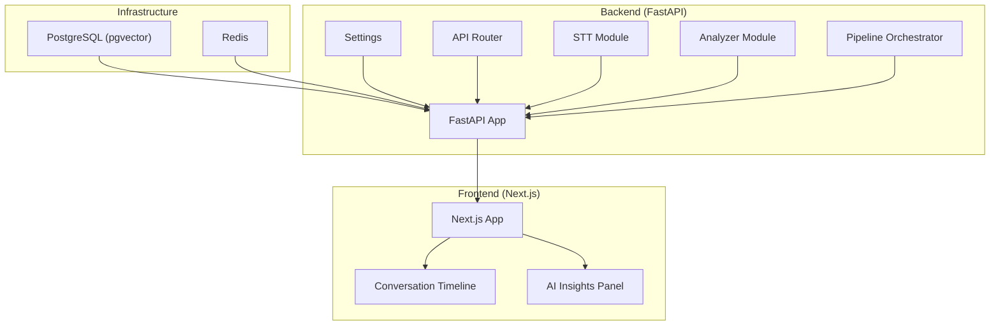
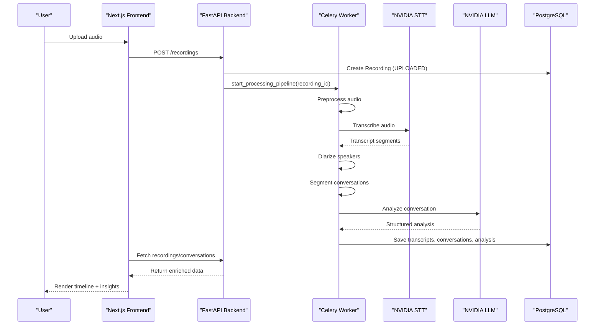
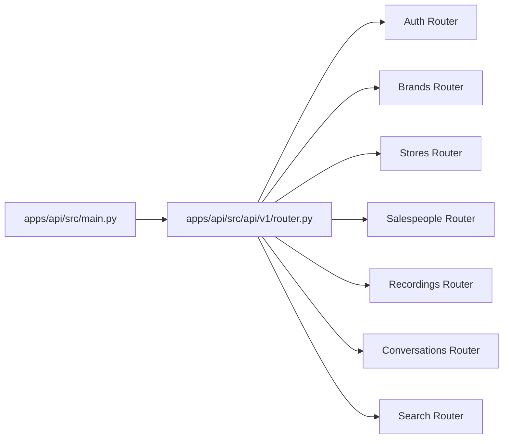
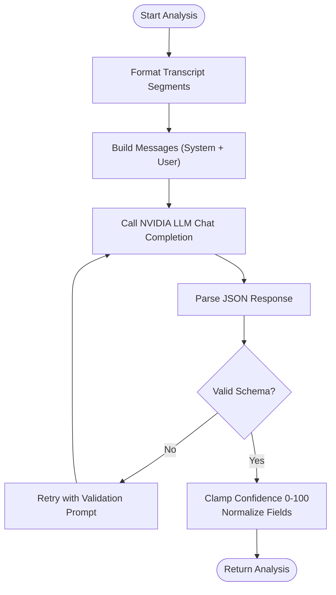
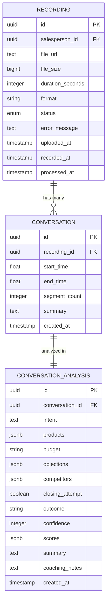
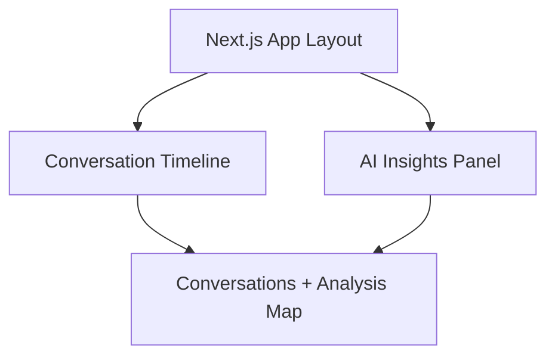
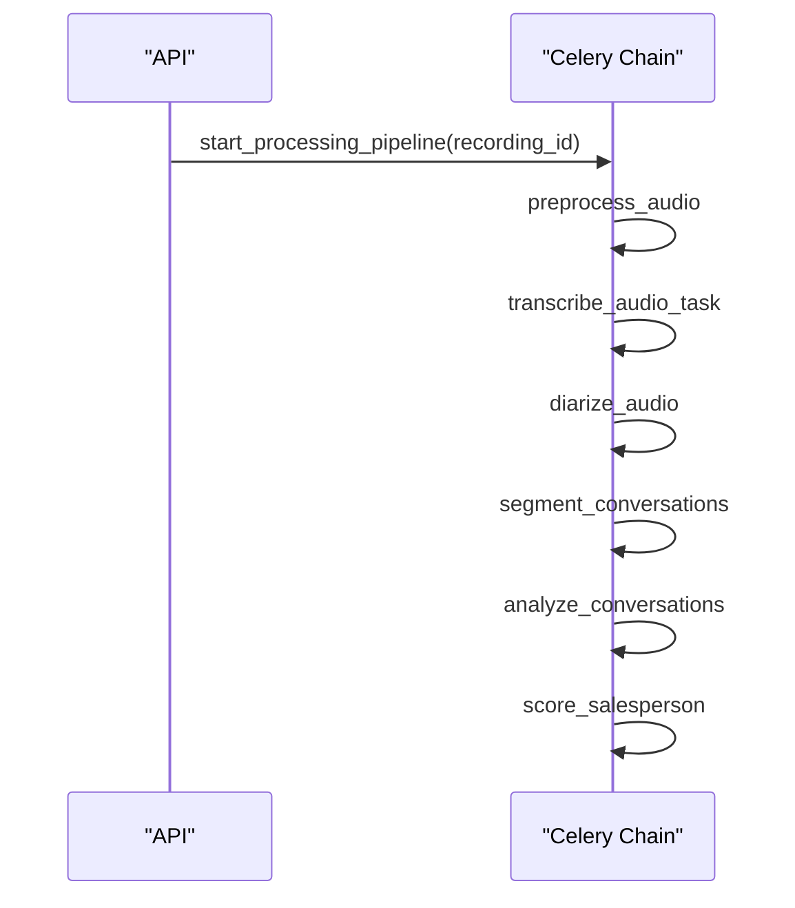
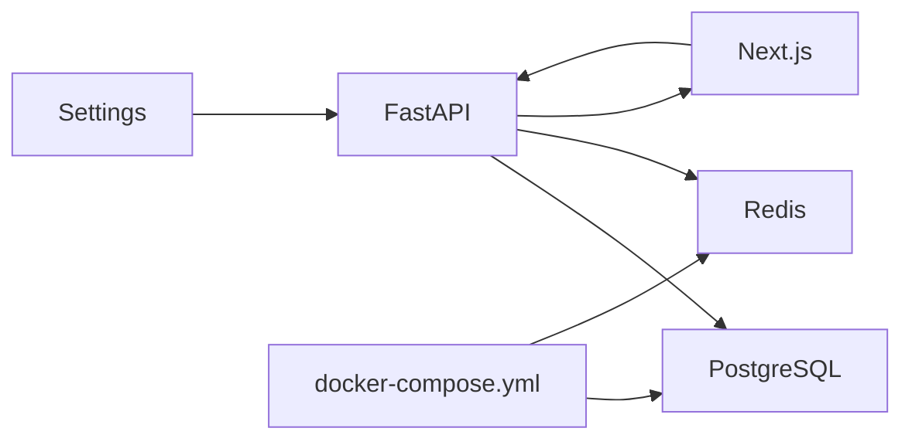

# Product Overview

<cite>
**Referenced Files in This Document**
- [README.md](file://README.md)
- [PRODUCT.md](file://PRODUCT.md)
- [DESIGN.md](file://DESIGN.md)
- [apps/api/src/main.py](file://apps/api/src/main.py)
- [apps/api/src/config.py](file://apps/api/src/config.py)
- [apps/api/src/api/v1/router.py](file://apps/api/src/api/v1/router.py)
- [apps/api/src/ai/stt.py](file://apps/api/src/ai/stt.py)
- [apps/api/src/ai/analyzer.py](file://apps/api/src/ai/analyzer.py)
- [apps/api/src/models/recording.py](file://apps/api/src/models/recording.py)
- [apps/api/src/models/conversation.py](file://apps/api/src/models/conversation.py)
- [apps/api/src/workers/pipeline.py](file://apps/api/src/workers/pipeline.py)
- [apps/web/src/app/layout.tsx](file://apps/web/src/app/layout.tsx)
- [apps/web/src/components/features/conversation-timeline.tsx](file://apps/web/src/components/features/conversation-timeline.tsx)
- [apps/web/src/components/features/ai-insights-panel.tsx](file://apps/web/src/components/features/ai-insights-panel.tsx)
- [docker-compose.yml](file://docker-compose.yml)
</cite>

## Table of Contents
1. [Introduction](#introduction)
2. [Project Structure](#project-structure)
3. [Core Components](#core-components)
4. [Architecture Overview](#architecture-overview)
5. [Detailed Component Analysis](#detailed-component-analysis)
6. [Dependency Analysis](#dependency-analysis)
7. [Performance Considerations](#performance-considerations)
8. [Troubleshooting Guide](#troubleshooting-guide)
9. [Conclusion](#conclusion)

## Introduction
CXSAMAA is a full-stack platform designed to transform retail store audio into actionable business intelligence. It enables organizations to upload sales call recordings, automatically transcribe them, identify speakers, segment conversations, analyze outcomes, and compute performance scores powered by NVIDIA NIM APIs. The system provides role-based dashboards for Brand Admins, Store Managers, Sales Managers, and Salespeople, surfacing insights instantly to support coaching, performance monitoring, and operational decisions.

## Project Structure
The repository follows a monorepo layout with a backend API built on FastAPI, asynchronous workers using Celery, a Next.js frontend, and shared TypeScript types. Supporting infrastructure includes PostgreSQL with pgvector and Redis for caching and job queues.

**Diagram sources**
- [apps/api/src/main.py:1-29](file://apps/api/src/main.py#L1-L29)
- [apps/api/src/config.py:1-52](file://apps/api/src/config.py#L1-L52)
- [apps/api/src/api/v1/router.py:1-20](file://apps/api/src/api/v1/router.py#L1-L20)
- [apps/api/src/ai/stt.py:1-86](file://apps/api/src/ai/stt.py#L1-L86)
- [apps/api/src/ai/analyzer.py:1-198](file://apps/api/src/ai/analyzer.py#L1-L198)
- [apps/api/src/workers/pipeline.py:1-35](file://apps/api/src/workers/pipeline.py#L1-L35)
- [apps/web/src/app/layout.tsx:1-35](file://apps/web/src/app/layout.tsx#L1-L35)
- [apps/web/src/components/features/conversation-timeline.tsx:1-82](file://apps/web/src/components/features/conversation-timeline.tsx#L1-L82)
- [apps/web/src/components/features/ai-insights-panel.tsx:1-203](file://apps/web/src/components/features/ai-insights-panel.tsx#L1-L203)
- [docker-compose.yml:1-35](file://docker-compose.yml#L1-L35)

**Section sources**
- [README.md:176-203](file://README.md#L176-L203)
- [README.md:251-258](file://README.md#L251-L258)

## Core Components
- Backend API: Exposes REST endpoints for authentication, brands, stores, salespeople, recordings, conversations, and search. Includes health checks and CORS configuration.
- AI Modules: STT transcription via NVIDIA Parakeet and conversation analysis via Llama 3.3 70B through NVIDIA NIM, with robust parsing and validation.
- Workers/Pipeline: Celery-based orchestration chaining preprocessing, transcription, diarization, segmentation, analysis, and scoring.
- Database Models: Recording, TranscriptSegment, Conversation, ConversationAnalysis, and related enums and relationships.
- Frontend: Next.js application with role-aware dashboards, conversation timeline visualization, and AI insights panels.

**Section sources**
- [apps/api/src/main.py:1-29](file://apps/api/src/main.py#L1-L29)
- [apps/api/src/api/v1/router.py:1-20](file://apps/api/src/api/v1/router.py#L1-L20)
- [apps/api/src/ai/stt.py:1-86](file://apps/api/src/ai/stt.py#L1-L86)
- [apps/api/src/ai/analyzer.py:1-198](file://apps/api/src/ai/analyzer.py#L1-L198)
- [apps/api/src/workers/pipeline.py:1-35](file://apps/api/src/workers/pipeline.py#L1-L35)
- [apps/api/src/models/recording.py:1-60](file://apps/api/src/models/recording.py#L1-L60)
- [apps/api/src/models/conversation.py:1-61](file://apps/api/src/models/conversation.py#L1-L61)
- [apps/web/src/app/layout.tsx:1-35](file://apps/web/src/app/layout.tsx#L1-L35)

## Architecture Overview
CXSAMAA’s architecture integrates a frontend dashboard with a backend API and asynchronous processing pipeline. Audio uploads trigger a Celery chain that normalizes audio, transcribes speech, identifies speakers, segments conversations, analyzes outcomes, and computes performance scores. Results are persisted in PostgreSQL and surfaced through the Next.js UI.

**Diagram sources**
- [apps/api/src/workers/pipeline.py:12-35](file://apps/api/src/workers/pipeline.py#L12-L35)
- [apps/api/src/ai/stt.py:12-46](file://apps/api/src/ai/stt.py#L12-L46)
- [apps/api/src/ai/analyzer.py:47-116](file://apps/api/src/ai/analyzer.py#L47-L116)
- [apps/api/src/models/recording.py:24-59](file://apps/api/src/models/recording.py#L24-L59)
- [apps/api/src/models/conversation.py:11-60](file://apps/api/src/models/conversation.py#L11-L60)
- [apps/web/src/components/features/conversation-timeline.tsx:28-78](file://apps/web/src/components/features/conversation-timeline.tsx#L28-L78)
- [apps/web/src/components/features/ai-insights-panel.tsx:37-197](file://apps/web/src/components/features/ai-insights-panel.tsx#L37-L197)

## Detailed Component Analysis

### Backend API and Routing
- The FastAPI app initializes CORS based on environment settings, registers the v1 router, and exposes a health endpoint.
- The v1 router aggregates sub-routers for auth, brands, stores, salespeople, recordings, conversations, and search.

**Diagram sources**
- [apps/api/src/main.py:1-29](file://apps/api/src/main.py#L1-L29)
- [apps/api/src/api/v1/router.py:1-20](file://apps/api/src/api/v1/router.py#L1-L20)

**Section sources**
- [apps/api/src/main.py:1-29](file://apps/api/src/main.py#L1-L29)
- [apps/api/src/api/v1/router.py:1-20](file://apps/api/src/api/v1/router.py#L1-L20)

### AI Pipeline Modules
- STT Module: Sends audio bytes to NVIDIA Parakeet via multipart/form-data, parses verbose JSON timestamps, and returns standardized segments.
- Analyzer Module: Calls Llama 3.3 70B via NVIDIA NIM to produce structured analysis with intent, products, budget, objections, competitors, outcome, confidence, summary, and coaching notes. Includes retry logic and schema validation.

**Diagram sources**
- [apps/api/src/ai/analyzer.py:47-116](file://apps/api/src/ai/analyzer.py#L47-L116)
- [apps/api/src/ai/analyzer.py:132-197](file://apps/api/src/ai/analyzer.py#L132-L197)

**Section sources**
- [apps/api/src/ai/stt.py:1-86](file://apps/api/src/ai/stt.py#L1-L86)
- [apps/api/src/ai/analyzer.py:1-198](file://apps/api/src/ai/analyzer.py#L1-L198)

### Database Models and Relationships
- Recording tracks file metadata, status lifecycle, and relationships to salespeople, transcript segments, and conversations.
- Conversation captures segmented time spans and links to a single recording.
- ConversationAnalysis stores structured insights, outcomes, confidence, and optional scoring metrics.

**Diagram sources**
- [apps/api/src/models/recording.py:24-59](file://apps/api/src/models/recording.py#L24-L59)
- [apps/api/src/models/conversation.py:11-60](file://apps/api/src/models/conversation.py#L11-L60)

**Section sources**
- [apps/api/src/models/recording.py:1-60](file://apps/api/src/models/recording.py#L1-L60)
- [apps/api/src/models/conversation.py:1-61](file://apps/api/src/models/conversation.py#L1-L61)

### Frontend Components
- Conversation Timeline: Renders detected conversations as horizontal bars along the recording duration, with tooltips for timing and outcomes, and active selection highlighting.
- AI Insights Panel: Displays conversation summaries, outcomes, confidence, intent, budget, products, objections, competitors, closing attempts, summaries, coaching notes, and optional score breakdowns.

**Diagram sources**
- [apps/web/src/app/layout.tsx:16-34](file://apps/web/src/app/layout.tsx#L16-L34)
- [apps/web/src/components/features/conversation-timeline.tsx:28-78](file://apps/web/src/components/features/conversation-timeline.tsx#L28-L78)
- [apps/web/src/components/features/ai-insights-panel.tsx:37-197](file://apps/web/src/components/features/ai-insights-panel.tsx#L37-L197)

**Section sources**
- [apps/web/src/components/features/conversation-timeline.tsx:1-82](file://apps/web/src/components/features/conversation-timeline.tsx#L1-L82)
- [apps/web/src/components/features/ai-insights-panel.tsx:1-203](file://apps/web/src/components/features/ai-insights-panel.tsx#L1-L203)

### Processing Pipeline Orchestration
- The pipeline orchestrator composes a Celery chain from preprocessing through scoring, returning an AsyncResult for progress tracking.

**Diagram sources**
- [apps/api/src/workers/pipeline.py:12-35](file://apps/api/src/workers/pipeline.py#L12-L35)

**Section sources**
- [apps/api/src/workers/pipeline.py:1-35](file://apps/api/src/workers/pipeline.py#L1-L35)

## Dependency Analysis
- Backend depends on environment-driven settings for database, Redis, JWT, storage, and NVIDIA NIM configuration.
- Frontend consumes API endpoints exposed by the backend and renders data-driven UI components.
- Infrastructure services (PostgreSQL and Redis) are orchestrated via Docker Compose.

**Diagram sources**
- [apps/api/src/config.py:4-52](file://apps/api/src/config.py#L4-L52)
- [apps/api/src/main.py:1-29](file://apps/api/src/main.py#L1-L29)
- [docker-compose.yml:1-35](file://docker-compose.yml#L1-L35)

**Section sources**
- [apps/api/src/config.py:1-52](file://apps/api/src/config.py#L1-L52)
- [docker-compose.yml:1-35](file://docker-compose.yml#L1-L35)

## Performance Considerations
- Asynchronous processing: Offload long-running tasks (transcription, diarization, analysis, scoring) to Celery workers to keep the API responsive.
- Streaming and chunking: Consider chunking audio during preprocessing to manage memory and reduce latency.
- Caching: Use Redis for caching frequently accessed metadata and intermediate results.
- Database indexing: Ensure appropriate indexes on foreign keys and timestamps for efficient querying of recordings and conversations.
- Model timeouts: Tune NVIDIA API timeouts to handle long recordings gracefully.

## Troubleshooting Guide
- Health checks: Verify the API health endpoint to confirm service readiness.
- Environment variables: Confirm DATABASE_URL, REDIS_URL, NVIDIA_API_KEY, JWT_SECRET, and storage settings are configured correctly.
- CORS issues: Ensure frontend origin matches configured CORS origins.
- Infrastructure readiness: Confirm PostgreSQL and Redis are healthy via Docker Compose health checks.
- Pipeline failures: Inspect worker logs for API errors and retry logic in the analyzer module.

**Section sources**
- [apps/api/src/main.py:26-29](file://apps/api/src/main.py#L26-L29)
- [apps/api/src/config.py:28-35](file://apps/api/src/config.py#L28-L35)
- [docker-compose.yml:13-30](file://docker-compose.yml#L13-L30)
- [apps/api/src/ai/analyzer.py:107-114](file://apps/api/src/ai/analyzer.py#L107-L114)

## Conclusion
CXSAMAA provides a complete solution for retail audio intelligence, combining robust AI-powered analysis with a purpose-built, data-dense interface. Its modular architecture supports scalable ingestion, processing, and visualization tailored to the needs of retail stakeholders, enabling rapid insights and targeted coaching across organizational levels.