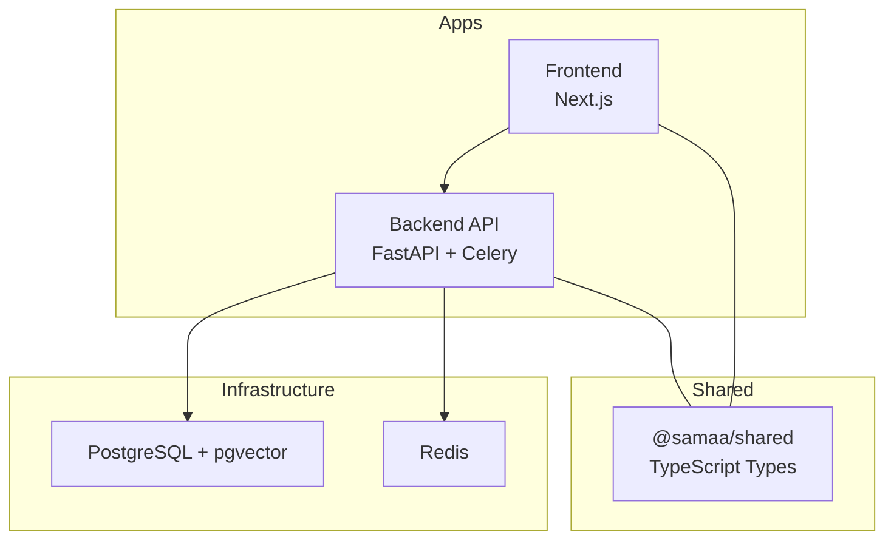
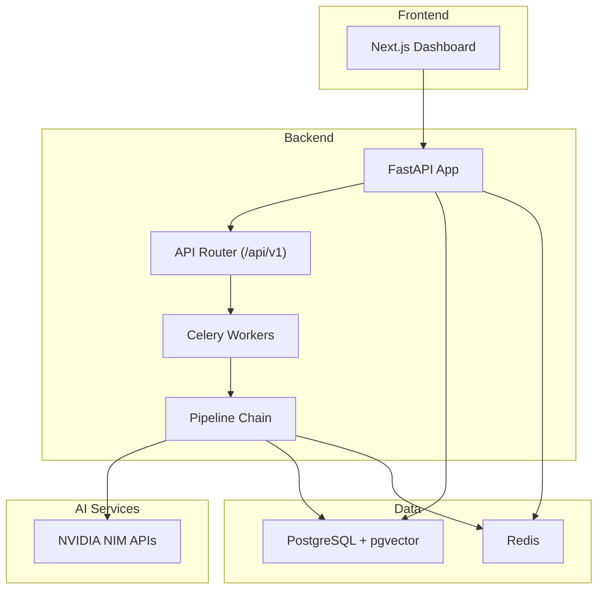
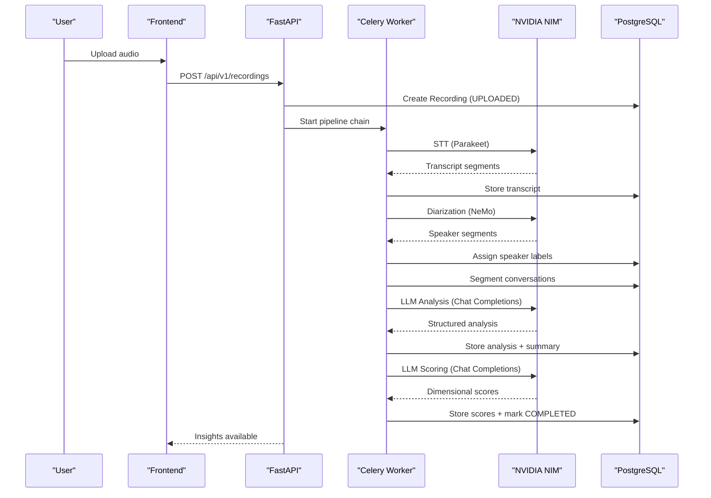
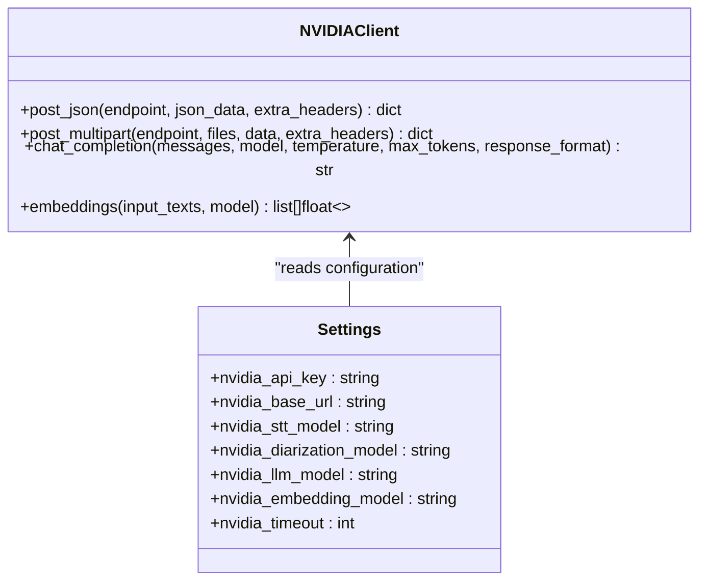
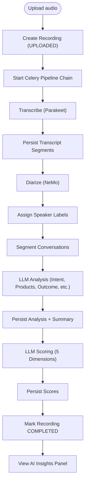
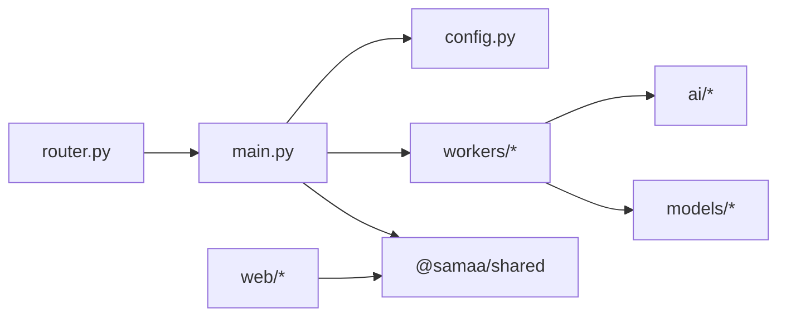

# Project Overview

<cite>
**Referenced Files in This Document**
- [README.md](file://README.md)
- [main.py](file://apps/api/src/main.py)
- [config.py](file://apps/api/src/config.py)
- [router.py](file://apps/api/src/api/v1/router.py)
- [nvidia_client.py](file://apps/api/src/ai/nvidia_client.py)
- [stt.py](file://apps/api/src/ai/stt.py)
- [diarizer.py](file://apps/api/src/ai/diarizer.py)
- [analyzer.py](file://apps/api/src/ai/analyzer.py)
- [scorer.py](file://apps/api/src/ai/scorer.py)
- [pipeline.py](file://apps/api/src/workers/pipeline.py)
- [transcription.py](file://apps/api/src/workers/transcription.py)
- [diarization.py](file://apps/api/src/workers/diarization.py)
- [segmentation.py](file://apps/api/src/workers/segmentation.py)
- [analysis.py](file://apps/api/src/workers/analysis.py)
- [scoring.py](file://apps/api/src/workers/scoring.py)
- [recording.py](file://apps/api/src/models/recording.py)
- [layout.tsx](file://apps/web/src/app/layout.tsx)
- [ai-insights-panel.tsx](file://apps/web/src/components/features/ai-insights-panel.tsx)
</cite>

## Table of Contents
1. [Introduction](#introduction)
2. [Project Structure](#project-structure)
3. [Core Components](#core-components)
4. [Architecture Overview](#architecture-overview)
5. [Detailed Component Analysis](#detailed-component-analysis)
6. [Dependency Analysis](#dependency-analysis)
7. [Performance Considerations](#performance-considerations)
8. [Troubleshooting Guide](#troubleshooting-guide)
9. [Conclusion](#conclusion)

## Introduction
Xsamaa AI Pipeline is a full-stack platform designed to transform retail sales call audio into actionable coaching insights. The platform automates the entire audio processing lifecycle—from ingestion and preprocessing to transcription, speaker diarization, conversation segmentation, AI-powered analysis, and performance scoring—then surfaces results through an intuitive dashboard for retail managers, sales coaches, and brand administrators.

At its core, Xsamaa turns raw audio recordings into structured, analyzable transcripts, identifies speakers, segments conversations, and applies NVIDIA NIM–enabled AI models to extract business intelligence and coach salespeople effectively. The platform’s asynchronous pipeline ensures scalability and reliability for enterprise-scale deployments.

## Project Structure
The repository follows a monorepo layout with a backend API, a Next.js frontend, shared TypeScript types, and supporting infrastructure:

- Backend API (FastAPI): route handlers, business logic, AI integrations, Celery workers, and database models
- Frontend (Next.js): dashboards for browsing recordings, conversations, and insights
- Shared package: TypeScript types consumed by both frontend and backend
- Infrastructure: Docker Compose for PostgreSQL and Redis

**Diagram sources**
- [README.md:10-18](file://README.md#L10-L18)
- [layout.tsx:16-19](file://apps/web/src/app/layout.tsx#L16-L19)

**Section sources**
- [README.md:10-18](file://README.md#L10-L18)
- [README.md:176-203](file://README.md#L176-L203)

## Core Components
- Backend API (FastAPI)
  - Exposes REST endpoints under /api/v1 and integrates with the frontend
  - Manages authentication, routing, and orchestrates the processing pipeline
- AI Integrations (NVIDIA NIM)
  - STT transcription, speaker diarization, LLM analysis, and embeddings
  - Centralized client with retry logic, rate-limit handling, and error mapping
- Celery Workers (Async Pipeline)
  - Preprocessing → Transcription → Diarization → Segmentation → Analysis → Scoring
- Frontend (Next.js)
  - Dashboards for recordings, conversations, and AI insights panels
  - Visual summaries of outcomes, products, objections, and performance scores

Key capabilities:
- Automated transcription with timestamp granularity
- Speaker diarization and speaker labeling
- Conversation segmentation using silence gaps and boundary heuristics
- Structured conversation analysis (intent, products, budget, objections, competitors, outcome, confidence)
- Multi-dimensional salesperson performance scoring (greeting, discovery, product knowledge, objection handling, closing)
- Real-time insights panel with interactive conversation timelines

**Section sources**
- [README.md:20-26](file://README.md#L20-L26)
- [README.md:251-258](file://README.md#L251-L258)
- [main.py:1-29](file://apps/api/src/main.py#L1-L29)
- [router.py:1-20](file://apps/api/src/api/v1/router.py#L1-L20)
- [nvidia_client.py:32-131](file://apps/api/src/ai/nvidia_client.py#L32-L131)
- [pipeline.py:12-35](file://apps/api/src/workers/pipeline.py#L12-L35)
- [layout.tsx:16-19](file://apps/web/src/app/layout.tsx#L16-L19)

## Architecture Overview
The system architecture combines a FastAPI backend with a Next.js frontend, orchestrated by Celery workers that execute the multi-stage audio processing pipeline. Data is persisted in PostgreSQL with Redis for task queuing. NVIDIA NIM APIs power STT, diarization, and LLM-based analysis and embeddings.

**Diagram sources**
- [README.md:7-18](file://README.md#L7-L18)
- [main.py:1-29](file://apps/api/src/main.py#L1-L29)
- [router.py:1-20](file://apps/api/src/api/v1/router.py#L1-L20)
- [pipeline.py:12-35](file://apps/api/src/workers/pipeline.py#L12-L35)
- [nvidia_client.py:32-131](file://apps/api/src/ai/nvidia_client.py#L32-L131)

## Detailed Component Analysis

### Multi-Stage AI Processing Pipeline
The pipeline is orchestrated as a Celery chain that transforms audio into insights:

1. Preprocessing: normalize, resample, detect silence gaps
2. Transcription (STT): NVIDIA Parakeet for word-level timestamps
3. Diarization: NVIDIA NeMo speaker labeling
4. Segmentation: split into discrete conversations using silence gaps and heuristics
5. Analysis (LLM): structured extraction of intent, products, budget, objections, competitors, outcome, confidence
6. Scoring: five-dimensional performance evaluation per conversation and daily metrics aggregation

**Diagram sources**
- [pipeline.py:12-35](file://apps/api/src/workers/pipeline.py#L12-L35)
- [transcription.py:53-102](file://apps/api/src/workers/transcription.py#L53-L102)
- [diarization.py:65-119](file://apps/api/src/workers/diarization.py#L65-L119)
- [segmentation.py:92-146](file://apps/api/src/workers/segmentation.py#L92-L146)
- [analysis.py:152-242](file://apps/api/src/workers/analysis.py#L152-L242)
- [scoring.py:235-314](file://apps/api/src/workers/scoring.py#L235-L314)
- [stt.py:12-47](file://apps/api/src/ai/stt.py#L12-L47)
- [diarizer.py:12-46](file://apps/api/src/ai/diarizer.py#L12-L46)
- [analyzer.py:47-117](file://apps/api/src/ai/analyzer.py#L47-L117)
- [scorer.py:66-122](file://apps/api/src/ai/scorer.py#L66-L122)

**Section sources**
- [README.md:20-26](file://README.md#L20-L26)
- [pipeline.py:12-35](file://apps/api/src/workers/pipeline.py#L12-L35)

### Technology Stack Overview
- Backend: FastAPI, SQLAlchemy (async), Celery, Redis, PostgreSQL + pgvector, Alembic, NVIDIA NIM APIs, pydub
- Frontend: Next.js 16, React 19, Tailwind CSS 4, shadcn/ui, TanStack Query, Zustand, Recharts
- Monorepo: Turborepo, npm workspaces
- Infrastructure: Docker Compose for PostgreSQL and Redis

**Section sources**
- [README.md:251-258](file://README.md#L251-L258)

### Integration with NVIDIA NIM APIs
The platform integrates with NVIDIA NIM for:
- Speech-to-Text (Parakeet)
- Speaker Diarization (NeMo)
- Large Language Model (Llama 3.3 70B) for analysis and scoring
- Embeddings for vector search and analytics

The centralized client encapsulates retry logic, timeouts, and error handling, exposing convenient methods for chat completions and embeddings, and multiparty audio uploads for STT/diarization.

**Diagram sources**
- [nvidia_client.py:32-131](file://apps/api/src/ai/nvidia_client.py#L32-L131)
- [config.py:28-36](file://apps/api/src/config.py#L28-L36)

**Section sources**
- [nvidia_client.py:32-131](file://apps/api/src/ai/nvidia_client.py#L32-L131)
- [config.py:28-36](file://apps/api/src/config.py#L28-L36)

### Practical Workflow Example: From Upload to Insights
- Upload audio via the frontend; the backend persists a recording record with status UPLOADED
- Celery worker chain starts: preprocessing, transcription, diarization, segmentation
- For each conversation, the system calls the LLM to produce structured analysis (intent, products, outcome, confidence)
- Another LLM call computes dimensional scores (greeting, discovery, product knowledge, objection handling, closing)
- Results are stored in the database; the recording status transitions to COMPLETED
- The frontend displays an AI insights panel summarizing outcomes, products, objections, competitors, summaries, coaching notes, and per-conversation scores

**Diagram sources**
- [transcription.py:53-102](file://apps/api/src/workers/transcription.py#L53-L102)
- [diarization.py:65-119](file://apps/api/src/workers/diarization.py#L65-L119)
- [segmentation.py:92-146](file://apps/api/src/workers/segmentation.py#L92-L146)
- [analysis.py:152-242](file://apps/api/src/workers/analysis.py#L152-L242)
- [scoring.py:235-314](file://apps/api/src/workers/scoring.py#L235-L314)
- [ai-insights-panel.tsx:37-203](file://apps/web/src/components/features/ai-insights-panel.tsx#L37-L203)

**Section sources**
- [recording.py:12-22](file://apps/api/src/models/recording.py#L12-L22)
- [ai-insights-panel.tsx:37-203](file://apps/web/src/components/features/ai-insights-panel.tsx#L37-L203)

## Dependency Analysis
- Backend API depends on:
  - Router for endpoint grouping
  - AI modules for NVIDIA NIM integrations
  - Workers for pipeline orchestration
  - SQLAlchemy models for persistence
- Frontend depends on:
  - Shared types for typed communication
  - UI components for rendering insights and dashboards

**Diagram sources**
- [router.py:1-20](file://apps/api/src/api/v1/router.py#L1-L20)
- [main.py:1-29](file://apps/api/src/main.py#L1-L29)
- [config.py:1-52](file://apps/api/src/config.py#L1-L52)

**Section sources**
- [router.py:1-20](file://apps/api/src/api/v1/router.py#L1-L20)
- [main.py:1-29](file://apps/api/src/main.py#L1-L29)

## Performance Considerations
- Asynchronous processing: Celery workers process stages independently, enabling concurrency and resilience
- Chunked transcription: Large audio files are segmented and reassembled to fit API constraints
- Retry and backoff: NVIDIA client implements exponential backoff for transient failures
- Confidence filtering: Analysis results below a threshold are discarded to maintain quality
- Metrics computation: Daily metrics aggregate conversation counts, average scores, and conversion rates

**Section sources**
- [transcription.py:104-146](file://apps/api/src/workers/transcription.py#L104-L146)
- [nvidia_client.py:48-131](file://apps/api/src/ai/nvidia_client.py#L48-L131)
- [analyzer.py:16-17](file://apps/api/src/ai/analyzer.py#L16-L17)
- [scoring.py:148-234](file://apps/api/src/workers/scoring.py#L148-L234)

## Troubleshooting Guide
Common operational checks:
- Health endpoint: Verify backend availability at /health
- Environment variables: Ensure NVIDIA API key and base URL are configured
- Storage backend: Local or S3 configuration for audio artifacts
- Database migrations: Apply pending migrations with Alembic
- Frontend API URL: Confirm NEXT_PUBLIC_API_URL points to the backend

Operational logs:
- Pipeline stages log progress and failures; inspect worker logs for retry attempts and error messages
- Status transitions: Monitor Recording status changes (UPLOADED → PREPROCESSING → TRANSCRIBING → DIARIZING → SEGMENTING → ANALYZING → SCORING → COMPLETED/FAILED)

**Section sources**
- [main.py:26-29](file://apps/api/src/main.py#L26-L29)
- [config.py:28-36](file://apps/api/src/config.py#L28-L36)
- [README.md:261-307](file://README.md#L261-L307)

## Conclusion
Xsamaa AI Pipeline delivers a robust, scalable solution for turning sales call audio into actionable insights. By leveraging NVIDIA NIM APIs and a modular, asynchronous pipeline, it empowers retail managers, sales coaches, and brand administrators to coach more effectively, measure performance consistently, and drive business outcomes. The platform’s architecture balances developer productivity with operational reliability, making it suitable for enterprise deployments.