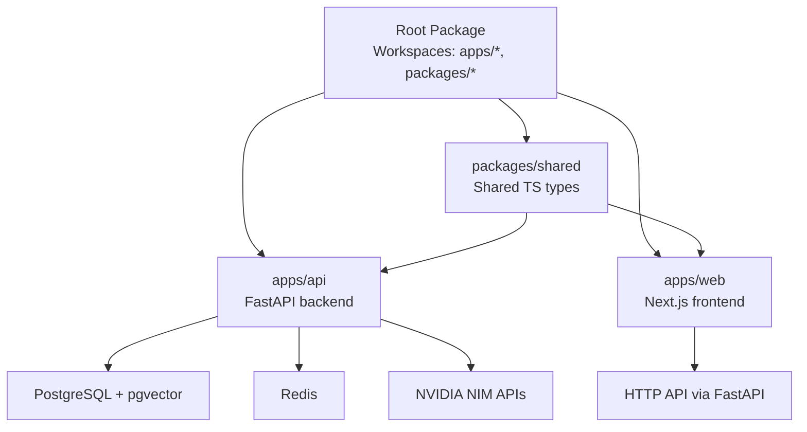
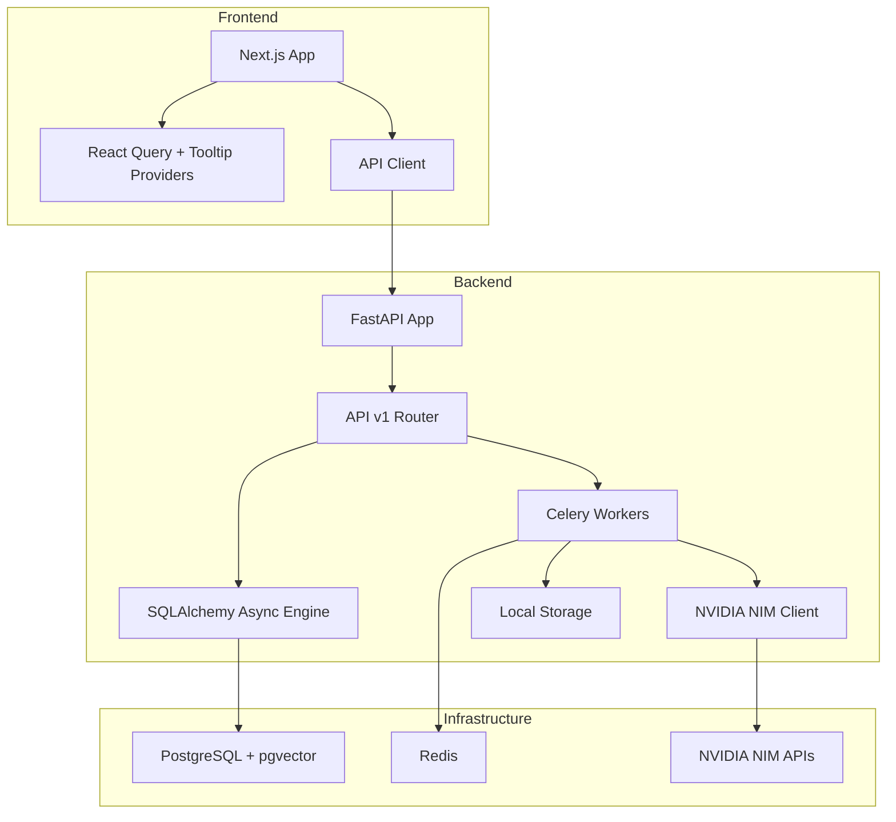
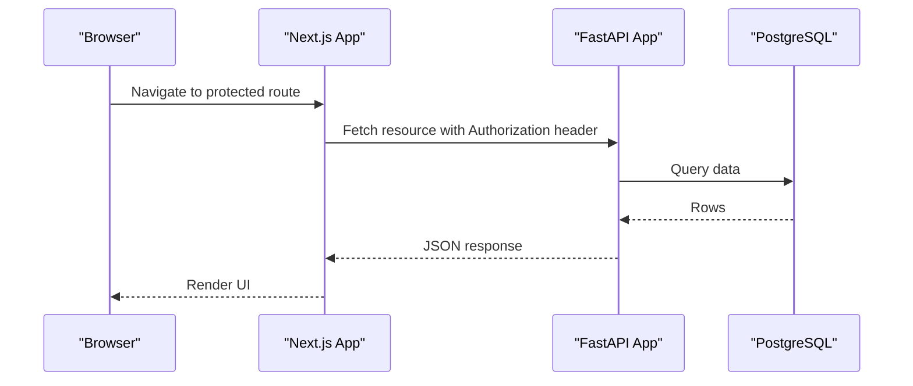
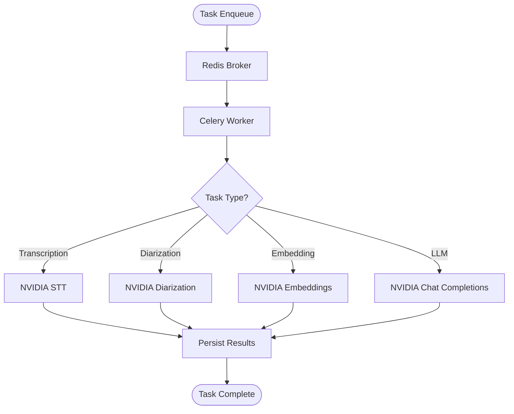
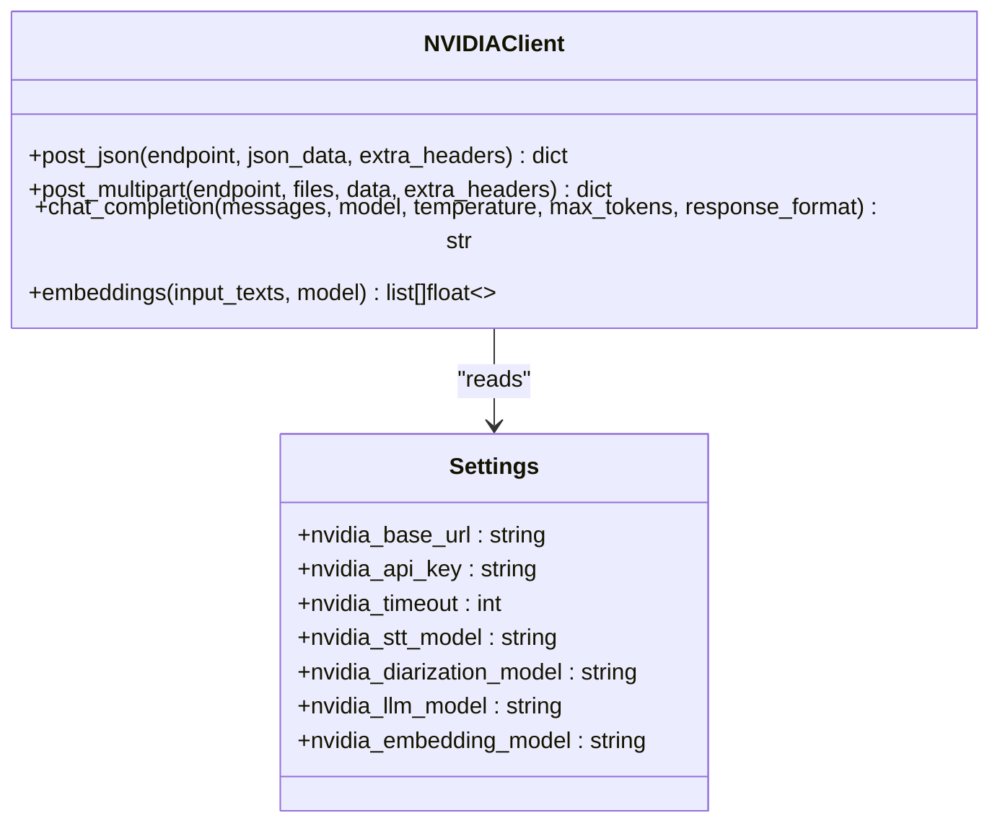
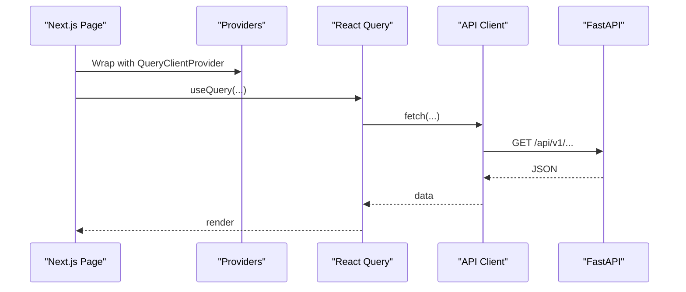
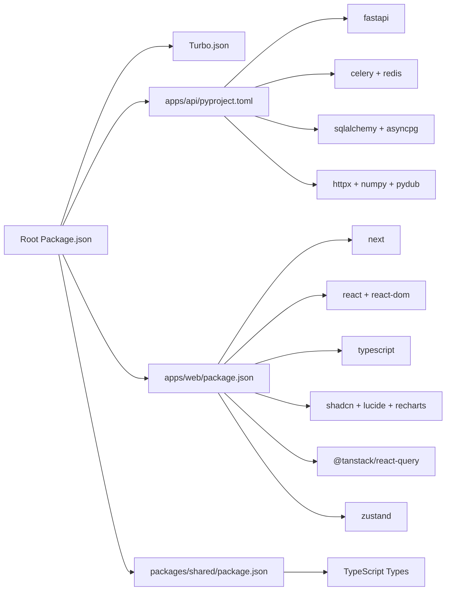

# Technology Stack

<cite>
**Referenced Files in This Document**
- [package.json](file://package.json)
- [turbo.json](file://turbo.json)
- [docker-compose.yml](file://docker-compose.yml)
- [apps/api/pyproject.toml](file://apps/api/pyproject.toml)
- [apps/api/src/main.py](file://apps/api/src/main.py)
- [apps/api/src/config.py](file://apps/api/src/config.py)
- [apps/api/src/database.py](file://apps/api/src/database.py)
- [apps/api/src/ai/nvidia_client.py](file://apps/api/src/ai/nvidia_client.py)
- [apps/api/src/workers/celery_app.py](file://apps/api/src/workers/celery_app.py)
- [apps/api/src/storage/local.py](file://apps/api/src/storage/local.py)
- [apps/web/package.json](file://apps/web/package.json)
- [apps/web/src/app/layout.tsx](file://apps/web/src/app/layout.tsx)
- [apps/web/src/middleware.ts](file://apps/web/src/middleware.ts)
- [apps/web/src/components/providers.tsx](file://apps/web/src/components/providers.tsx)
- [apps/web/src/lib/api-client.ts](file://apps/web/src/lib/api-client.ts)
- [packages/shared/package.json](file://packages/shared/package.json)
- [packages/shared/src/api-types.ts](file://packages/shared/src/api-types.ts)
</cite>

## Table of Contents
1. [Introduction](#introduction)
2. [Project Structure](#project-structure)
3. [Core Components](#core-components)
4. [Architecture Overview](#architecture-overview)
5. [Detailed Component Analysis](#detailed-component-analysis)
6. [Dependency Analysis](#dependency-analysis)
7. [Performance Considerations](#performance-considerations)
8. [Troubleshooting Guide](#troubleshooting-guide)
9. [Conclusion](#conclusion)
10. [Appendices](#appendices)

## Introduction
This document describes the technology stack powering the Xsamaa AI Pipeline, a full-stack platform designed for real-time audio ingestion, asynchronous AI-driven analysis, and modern web visualization. The stack integrates:
- Backend: Python with FastAPI, Celery for task orchestration, PostgreSQL with pgvector, and Redis for task queues.
- AI Services: NVIDIA NIM APIs for speech-to-text, diarization, embeddings, and LLM-powered insights.
- Frontend: Next.js 16 with React 19, TypeScript, TailwindCSS, and shared TypeScript types.
- Build and DevOps: Turborepo monorepo orchestration, Docker Compose for local infrastructure, and npm workspaces.

The architecture emphasizes scalability, resilience, and developer productivity while supporting real-time audio processing and interactive dashboards.

## Project Structure
The repository follows a monorepo layout with separate workspaces for the API backend, the web frontend, and a shared TypeScript package.

**Diagram sources**
- [package.json:1-19](file://package.json#L1-L19)
- [apps/api/pyproject.toml:1-43](file://apps/api/pyproject.toml#L1-L43)
- [apps/web/package.json:1-38](file://apps/web/package.json#L1-L38)
- [packages/shared/package.json:1-15](file://packages/shared/package.json#L1-L15)

**Section sources**
- [package.json:1-19](file://package.json#L1-L19)
- [turbo.json:1-17](file://turbo.json#L1-L17)

## Core Components
- Backend API (FastAPI)
  - Application entrypoint initializes FastAPI with CORS and mounts the v1 router. Health checks expose environment details.
  - Configuration encapsulates database, Redis, JWT, storage, NVIDIA NIM, and app settings.
  - Asynchronous SQLAlchemy engine and session factory manage database connections.
  - Storage abstraction supports local file uploads; future S3 support is noted.
  - Celery app defines task routing and worker configuration using Redis as broker/backend.
  - AI client wraps NVIDIA NIM endpoints with robust retry, rate-limit handling, and error mapping.

- AI Service Integrations (NVIDIA NIM)
  - Dedicated client handles chat completions, embeddings, and multipart audio uploads.
  - Configurable timeouts and exponential backoff improve reliability under load.
  - Structured exceptions differentiate auth, rate-limit, and generic API errors.

- Frontend (Next.js 16 + React 19)
  - Root layout composes fonts, global styles, and provider wrappers for React Query and UI tooltips.
  - Middleware allows public paths and static assets; client-side auth guard is used downstream.
  - API client centralizes requests, token refresh, and error handling.

- Shared Types
  - Strongly typed DTOs mirror backend schemas and are consumed by both frontend and backend.

**Section sources**
- [apps/api/src/main.py:1-29](file://apps/api/src/main.py#L1-L29)
- [apps/api/src/config.py:1-52](file://apps/api/src/config.py#L1-L52)
- [apps/api/src/database.py:1-34](file://apps/api/src/database.py#L1-L34)
- [apps/api/src/storage/local.py:1-50](file://apps/api/src/storage/local.py#L1-L50)
- [apps/api/src/workers/celery_app.py:1-31](file://apps/api/src/workers/celery_app.py#L1-L31)
- [apps/api/src/ai/nvidia_client.py:1-274](file://apps/api/src/ai/nvidia_client.py#L1-L274)
- [apps/web/src/app/layout.tsx:1-37](file://apps/web/src/app/layout.tsx#L1-L37)
- [apps/web/src/middleware.ts:1-32](file://apps/web/src/middleware.ts#L1-L32)
- [apps/web/src/components/providers.tsx:1-26](file://apps/web/src/components/providers.tsx#L1-L26)
- [apps/web/src/lib/api-client.ts:1-114](file://apps/web/src/lib/api-client.ts#L1-L114)
- [packages/shared/src/api-types.ts:1-228](file://packages/shared/src/api-types.ts#L1-L228)

## Architecture Overview
The system separates concerns across asynchronous processing and real-time UI:
- Audio ingestion and pre-processing trigger Celery tasks.
- AI services (NVIDIA NIM) are invoked for STT, diarization, embeddings, and insights.
- Results are persisted to PostgreSQL (with vector support) and exposed via FastAPI.
- Next.js serves the dashboard, fetching data via the API client with React Query caching.

**Diagram sources**
- [apps/api/src/main.py:1-29](file://apps/api/src/main.py#L1-L29)
- [apps/api/src/config.py:1-52](file://apps/api/src/config.py#L1-L52)
- [apps/api/src/database.py:1-34](file://apps/api/src/database.py#L1-L34)
- [apps/api/src/workers/celery_app.py:1-31](file://apps/api/src/workers/celery_app.py#L1-L31)
- [apps/api/src/ai/nvidia_client.py:1-274](file://apps/api/src/ai/nvidia_client.py#L1-L274)
- [apps/api/src/storage/local.py:1-50](file://apps/api/src/storage/local.py#L1-L50)
- [apps/web/src/lib/api-client.ts:1-114](file://apps/web/src/lib/api-client.ts#L1-L114)

## Detailed Component Analysis

### Backend API (FastAPI)
- Purpose: Exposes REST endpoints for authentication, brands, stores, salespeople, recordings, and search. Includes a health endpoint.
- CORS: Configured via environment-derived origins list.
- Routing: Mounts v1 router centrally.

**Diagram sources**
- [apps/api/src/main.py:1-29](file://apps/api/src/main.py#L1-L29)
- [apps/api/src/database.py:1-34](file://apps/api/src/database.py#L1-L34)
- [apps/web/src/lib/api-client.ts:1-114](file://apps/web/src/lib/api-client.ts#L1-L114)

**Section sources**
- [apps/api/src/main.py:1-29](file://apps/api/src/main.py#L1-L29)

### Configuration and Environment
- Centralized settings define database URLs (async and sync), Redis URL, JWT parameters, storage backend, local upload directory, and NVIDIA NIM endpoints/models/timeouts.
- CORS origins are parsed into a list for middleware configuration.

**Section sources**
- [apps/api/src/config.py:1-52](file://apps/api/src/config.py#L1-L52)

### Database Layer (SQLAlchemy Async)
- Async engine configured with connection pooling and debug echo.
- Session factory manages transaction lifecycle with commit/rollback semantics.

**Section sources**
- [apps/api/src/database.py:1-34](file://apps/api/src/database.py#L1-L34)

### Task Queue and Workers (Celery + Redis)
- Celery app configured with Redis as both broker and result backend.
- Tasks include preprocessing, transcription, diarization, segmentation, analysis, and scoring.
- Worker settings enable UTC, late acknowledgments, single prefetch, and time limits.

**Diagram sources**
- [apps/api/src/workers/celery_app.py:1-31](file://apps/api/src/workers/celery_app.py#L1-L31)
- [apps/api/src/ai/nvidia_client.py:1-274](file://apps/api/src/ai/nvidia_client.py#L1-L274)

**Section sources**
- [apps/api/src/workers/celery_app.py:1-31](file://apps/api/src/workers/celery_app.py#L1-L31)

### AI Service Integration (NVIDIA NIM)
- Robust client with:
  - Exponential backoff retry on transient failures.
  - Distinct exceptions for auth, rate-limit, and generic API errors.
  - Support for JSON and multipart/form-data requests.
  - Convenience methods for chat completions and embeddings.
- Configurable timeouts and model selection for STT, diarization, LLM, and embeddings.

**Diagram sources**
- [apps/api/src/ai/nvidia_client.py:1-274](file://apps/api/src/ai/nvidia_client.py#L1-L274)
- [apps/api/src/config.py:1-52](file://apps/api/src/config.py#L1-L52)

**Section sources**
- [apps/api/src/ai/nvidia_client.py:1-274](file://apps/api/src/ai/nvidia_client.py#L1-L274)

### Storage Abstraction (Local)
- Provides synchronous and asynchronous methods for upload, download, delete, and signed URL generation.
- Ensures directory creation and path safety.

**Section sources**
- [apps/api/src/storage/local.py:1-50](file://apps/api/src/storage/local.py#L1-L50)

### Frontend (Next.js + React + TypeScript)
- Layout composes fonts, global CSS, and provider wrappers for React Query and tooltips.
- Middleware permits public paths and static assets; client-side auth guard is applied in components.
- API client centralizes fetch logic, token refresh, and error parsing.

**Diagram sources**
- [apps/web/src/app/layout.tsx:1-37](file://apps/web/src/app/layout.tsx#L1-L37)
- [apps/web/src/components/providers.tsx:1-26](file://apps/web/src/components/providers.tsx#L1-L26)
- [apps/web/src/lib/api-client.ts:1-114](file://apps/web/src/lib/api-client.ts#L1-L114)

**Section sources**
- [apps/web/src/app/layout.tsx:1-37](file://apps/web/src/app/layout.tsx#L1-L37)
- [apps/web/src/middleware.ts:1-32](file://apps/web/src/middleware.ts#L1-L32)
- [apps/web/src/components/providers.tsx:1-26](file://apps/web/src/components/providers.tsx#L1-L26)
- [apps/web/src/lib/api-client.ts:1-114](file://apps/web/src/lib/api-client.ts#L1-L114)

### Shared TypeScript Types
- Strongly typed DTOs for auth, entities (brand/store/salesperson/recording/conversation), transcripts, metrics, search, and paginated responses.
- Consumed by both frontend and backend to maintain consistency.

**Section sources**
- [packages/shared/src/api-types.ts:1-228](file://packages/shared/src/api-types.ts#L1-L228)

## Dependency Analysis
- Monorepo orchestration:
  - Root package defines workspaces for apps and packages.
  - Turborepo tasks specify build dependencies and cache/persistent behavior.
- Backend dependencies (selected):
  - FastAPI, Uvicorn, SQLAlchemy asyncio, asyncpg, Alembic, Celery with Redis, Redis, Pydantic, Pydantic Settings, python-jose, passlib bcrypt, httpx, pgvector, pydub, numpy.
- Frontend dependencies (selected):
  - Next.js 16, React 19, React DOM, TypeScript, TailwindCSS v4, TanStack React Query, shadcn, Lucide icons, Recharts, Zustand, class-variance-authority, clsx, tailwind-merge, tw-animate-css.
- Infrastructure:
  - Docker Compose provisions PostgreSQL with pgvector and Redis.

**Diagram sources**
- [package.json:1-19](file://package.json#L1-L19)
- [turbo.json:1-17](file://turbo.json#L1-L17)
- [apps/api/pyproject.toml:1-43](file://apps/api/pyproject.toml#L1-L43)
- [apps/web/package.json:1-38](file://apps/web/package.json#L1-L38)
- [packages/shared/package.json:1-15](file://packages/shared/package.json#L1-L15)

**Section sources**
- [package.json:1-19](file://package.json#L1-L19)
- [turbo.json:1-17](file://turbo.json#L1-L17)
- [apps/api/pyproject.toml:1-43](file://apps/api/pyproject.toml#L1-L43)
- [apps/web/package.json:1-38](file://apps/web/package.json#L1-L38)
- [packages/shared/package.json:1-15](file://packages/shared/package.json#L1-L15)

## Performance Considerations
- Asynchronous I/O
  - SQLAlchemy async engine reduces contention on database operations.
- Task queue design
  - Late acknowledgment and prefetch multiplier tuned for throughput.
  - Soft and hard time limits prevent runaway tasks.
- AI API reliability
  - Exponential backoff and structured error handling reduce failure cascades.
- Frontend caching
  - React Query default stale/retry configuration balances freshness and performance.
- Database scaling
  - PostgreSQL with pgvector enables vector similarity search for semantic retrieval.

[No sources needed since this section provides general guidance]

## Troubleshooting Guide
- Authentication failures
  - Verify JWT secret and algorithm settings; ensure frontend refresh flow updates stored tokens.
- Rate limiting from NVIDIA NIM
  - The client raises a dedicated exception; review retry logs and consider lowering concurrent loads.
- Database connectivity
  - Confirm async database URL and credentials; check pool sizes and echo settings during development.
- Redis connectivity
  - Ensure Redis is reachable at configured URL; confirm Celery broker and backend match.
- Frontend API errors
  - Inspect API client error parsing and token refresh logic; confirm NEXT_PUBLIC_API_URL matches backend host/port.

**Section sources**
- [apps/api/src/config.py:1-52](file://apps/api/src/config.py#L1-L52)
- [apps/api/src/ai/nvidia_client.py:1-274](file://apps/api/src/ai/nvidia_client.py#L1-L274)
- [apps/api/src/database.py:1-34](file://apps/api/src/database.py#L1-L34)
- [apps/api/src/workers/celery_app.py:1-31](file://apps/api/src/workers/celery_app.py#L1-L31)
- [apps/web/src/lib/api-client.ts:1-114](file://apps/web/src/lib/api-client.ts#L1-L114)

## Conclusion
Xsamaa AI Pipeline leverages a modern, scalable stack:
- FastAPI for a robust, type-safe backend with async database operations.
- Celery and Redis for asynchronous, resilient audio processing pipelines.
- PostgreSQL with pgvector for relational and vector data needs.
- Next.js and React for a responsive, typed frontend with efficient data fetching.
- NVIDIA NIM APIs for high-quality AI services integrated with retry and error handling.
Together, these technologies support real-time audio ingestion, scalable task processing, and a smooth user experience.

[No sources needed since this section summarizes without analyzing specific files]

## Appendices

### Version and Tooling Matrix
- Backend
  - Python: >= 3.12
  - FastAPI: >= 0.115.0
  - Uvicorn: >= 0.34.0
  - SQLAlchemy asyncio: >= 2.0.0
  - asyncpg: >= 0.30.0
  - Alembic: >= 1.14.0
  - Celery: >= 5.4.0 (with redis)
  - Redis: >= 5.2.0
  - Pydantic: >= 2.10.0
  - Pydantic Settings: >= 2.7.0
  - python-jose: >= 3.3.0
  - passlib bcrypt: >= 1.7.4
  - httpx: >= 0.28.0
  - pgvector: >= 0.3.0
  - pydub: >= 0.25.1
  - numpy: >= 2.0.0
- Frontend
  - Next.js: 16.2.7
  - React: 19.2.4
  - TypeScript: ^5
  - TailwindCSS: ^4
  - TanStack React Query: ^5.101.0
  - shadcn: ^4.11.0
  - Zustand: ^5.0.14
  - ESLint: ^9
- DevOps
  - Turborepo: ^2.5.0
  - Docker Compose: standard compose file

**Section sources**
- [apps/api/pyproject.toml:1-43](file://apps/api/pyproject.toml#L1-L43)
- [apps/web/package.json:1-38](file://apps/web/package.json#L1-L38)
- [package.json:1-19](file://package.json#L1-L19)
- [turbo.json:1-17](file://turbo.json#L1-L17)
- [docker-compose.yml:1-35](file://docker-compose.yml#L1-L35)

### Integration Points
- Frontend to Backend
  - API client consumes NEXT_PUBLIC_API_URL and attaches Authorization headers; handles 401 refresh and JSON parsing.
- Backend to AI Services
  - NVIDIA client encapsulates base URL, API key, and timeouts; exposes chat and embeddings helpers.
- Backend to Infrastructure
  - Celery uses Redis for task queues; PostgreSQL with asyncpg for persistence; optional pgvector for embeddings.
- Shared Contracts
  - packages/shared provides strongly typed DTOs used across frontend and backend.

**Section sources**
- [apps/web/src/lib/api-client.ts:1-114](file://apps/web/src/lib/api-client.ts#L1-L114)
- [apps/api/src/ai/nvidia_client.py:1-274](file://apps/api/src/ai/nvidia_client.py#L1-L274)
- [apps/api/src/config.py:1-52](file://apps/api/src/config.py#L1-L52)
- [packages/shared/src/api-types.ts:1-228](file://packages/shared/src/api-types.ts#L1-L228)