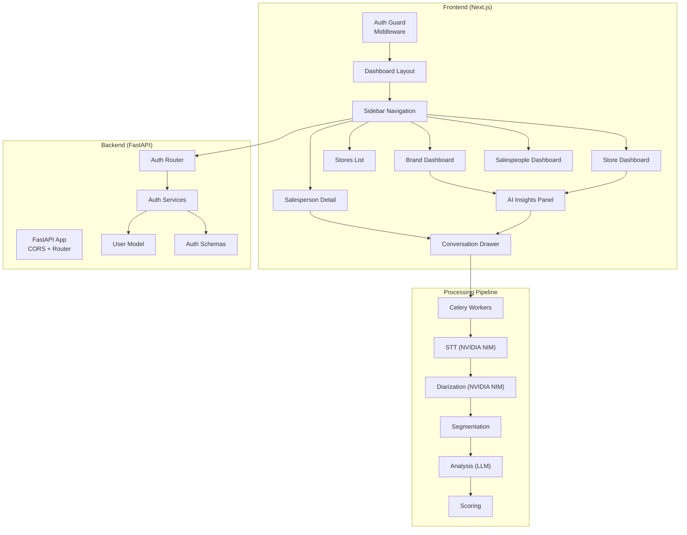
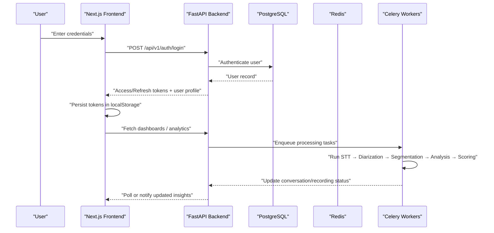
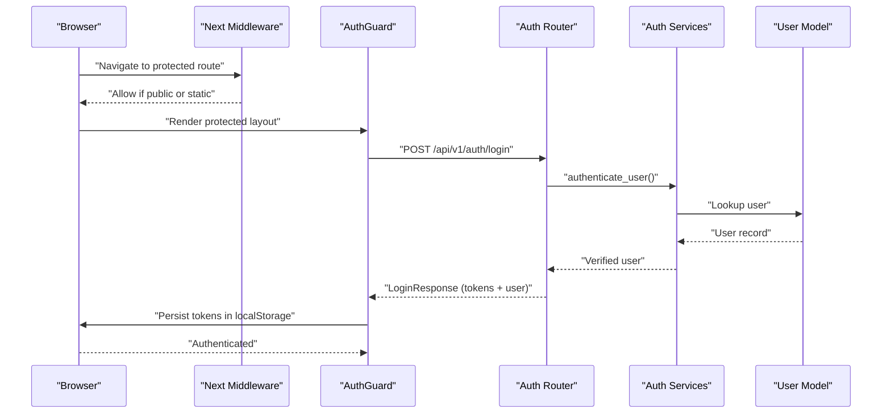
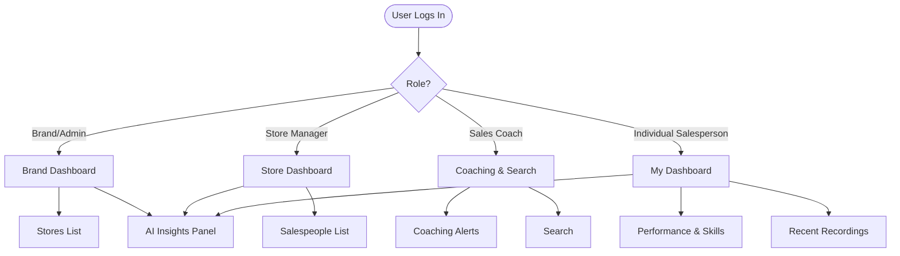
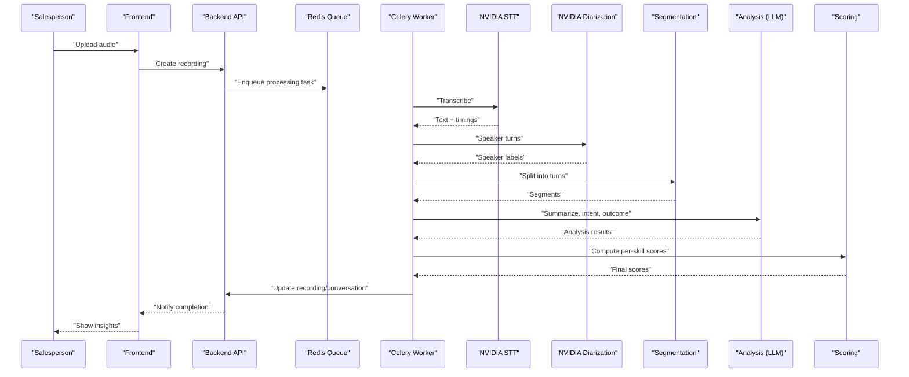
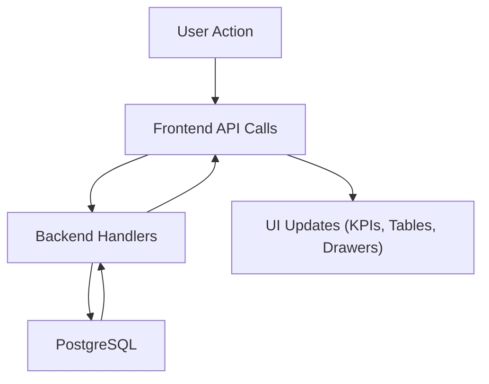
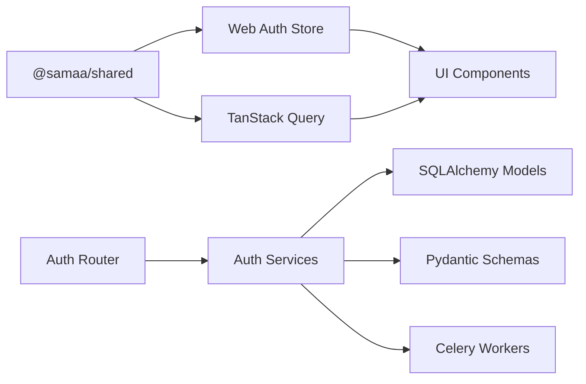

# User Workflows

<cite>
**Referenced Files in This Document**
- [README.md](file://README.md)
- [apps/api/src/main.py](file://apps/api/src/main.py)
- [apps/api/src/api/v1/auth.py](file://apps/api/src/api/v1/auth.py)
- [apps/api/src/services/auth.py](file://apps/api/src/services/auth.py)
- [apps/api/src/models/user.py](file://apps/api/src/models/user.py)
- [apps/api/src/schemas/auth.py](file://apps/api/src/schemas/auth.py)
- [apps/web/src/middleware.ts](file://apps/web/src/middleware.ts)
- [apps/web/src/components/auth-guard.tsx](file://apps/web/src/components/auth-guard.tsx)
- [apps/web/src/store/auth.ts](file://apps/web/src/store/auth.ts)
- [apps/web/src/app/layout.tsx](file://apps/web/src/app/layout.tsx)
- [apps/web/src/app/(dashboard)/layout.tsx](file://apps/web/src/app/(dashboard)/layout.tsx)
- [apps/web/src/components/layout/sidebar.tsx](file://apps/web/src/components/layout/sidebar.tsx)
- [apps/web/src/app/(dashboard)/brand/page.tsx](file://apps/web/src/app/(dashboard)/brand/page.tsx)
- [apps/web/src/app/(dashboard)/stores/page.tsx](file://apps/web/src/app/(dashboard)/stores/page.tsx)
- [apps/web/src/app/(dashboard)/store/[id]/page.tsx](file://apps/web/src/app/(dashboard)/store/[id]/page.tsx)
- [apps/web/src/app/(dashboard)/salesperson/[id]/page.tsx](file://apps/web/src/app/(dashboard)/salesperson/[id]/page.tsx)
- [apps/web/src/components/features/conversation-drawer.tsx](file://apps/web/src/components/features/conversation-drawer.tsx)
- [apps/web/src/components/features/ai-insights-panel.tsx](file://apps/web/src/components/features/ai-insights-panel.tsx)
</cite>

## Table of Contents
1. [Introduction](#introduction)
2. [Project Structure](#project-structure)
3. [Core Components](#core-components)
4. [Architecture Overview](#architecture-overview)
5. [Detailed Component Analysis](#detailed-component-analysis)
6. [Dependency Analysis](#dependency-analysis)
7. [Performance Considerations](#performance-considerations)
8. [Troubleshooting Guide](#troubleshooting-guide)
9. [Conclusion](#conclusion)
10. [Appendices](#appendices)

## Introduction
This document describes the end-to-end user workflows for Xsamaa AI Pipeline across four roles: brand administrator, store manager, sales coach, and individual salesperson. It covers authentication, dashboard navigation, feature access, and the complete audio processing pipeline from upload to insights. It also provides step-by-step scenarios for analyzing a sales call, identifying coaching opportunities, and generating performance reports, along with data flow, notifications, and best practices.

## Project Structure
The system comprises:
- Backend API built with FastAPI and Celery workers for asynchronous processing
- Frontend built with Next.js, React, and TanStack Query for data fetching
- Shared TypeScript types for API contracts
- PostgreSQL with pgvector and Redis for persistence and task queues
- NVIDIA NIM APIs for speech-to-text, diarization, and LLM-powered analysis

**Diagram sources**
- [apps/api/src/main.py:1-29](file://apps/api/src/main.py#L1-L29)
- [apps/api/src/api/v1/auth.py:1-82](file://apps/api/src/api/v1/auth.py#L1-L82)
- [apps/api/src/services/auth.py:1-55](file://apps/api/src/services/auth.py#L1-L55)
- [apps/api/src/models/user.py:1-48](file://apps/api/src/models/user.py#L1-L48)
- [apps/api/src/schemas/auth.py:1-36](file://apps/api/src/schemas/auth.py#L1-L36)
- [apps/web/src/middleware.ts:1-32](file://apps/web/src/middleware.ts#L1-L32)
- [apps/web/src/components/auth-guard.tsx:1-40](file://apps/web/src/components/auth-guard.tsx#L1-L40)
- [apps/web/src/store/auth.ts:1-49](file://apps/web/src/store/auth.ts#L1-L49)
- [apps/web/src/app/(dashboard)/layout.tsx:1-22](file://apps/web/src/app/(dashboard)/layout.tsx#L1-L22)
- [apps/web/src/components/layout/sidebar.tsx:1-143](file://apps/web/src/components/layout/sidebar.tsx#L1-L143)
- [apps/web/src/app/(dashboard)/brand/page.tsx:1-233](file://apps/web/src/app/(dashboard)/brand/page.tsx#L1-L233)
- [apps/web/src/app/(dashboard)/stores/page.tsx:1-85](file://apps/web/src/app/(dashboard)/stores/page.tsx#L1-L85)
- [apps/web/src/app/(dashboard)/store/[id]/page.tsx:1-186](file://apps/web/src/app/(dashboard)/store/[id]/page.tsx#L1-L186)
- [apps/web/src/app/(dashboard)/salesperson/[id]/page.tsx:1-363](file://apps/web/src/app/(dashboard)/salesperson/[id]/page.tsx#L1-L363)
- [apps/web/src/components/features/ai-insights-panel.tsx:1-203](file://apps/web/src/components/features/ai-insights-panel.tsx#L1-L203)
- [apps/web/src/components/features/conversation-drawer.tsx:1-193](file://apps/web/src/components/features/conversation-drawer.tsx#L1-L193)

**Section sources**
- [README.md:1-308](file://README.md#L1-L308)
- [apps/api/src/main.py:1-29](file://apps/api/src/main.py#L1-L29)
- [apps/web/src/app/layout.tsx:1-37](file://apps/web/src/app/layout.tsx#L1-L37)

## Core Components
- Authentication and Authorization
  - Backend routes under /auth handle login, token refresh, and logout.
  - Stateless JWT tokens are signed with a server secret and stored client-side.
  - User roles are enforced in the sidebar navigation and page-level queries.
- Dashboards and Navigation
  - Sidebar filters menu items by role.
  - Dashboard pages fetch data via TanStack Query and present KPIs, rankings, and recent recordings.
- AI Insights and Conversation Details
  - AI Insights Panel lists conversations with outcomes, intents, objections, and per-skill scores.
  - Conversation Drawer overlays detailed transcript segments and analysis.

**Section sources**
- [apps/api/src/api/v1/auth.py:1-82](file://apps/api/src/api/v1/auth.py#L1-L82)
- [apps/api/src/services/auth.py:1-55](file://apps/api/src/services/auth.py#L1-L55)
- [apps/api/src/models/user.py:12-17](file://apps/api/src/models/user.py#L12-L17)
- [apps/web/src/components/layout/sidebar.tsx:27-72](file://apps/web/src/components/layout/sidebar.tsx#L27-L72)
- [apps/web/src/components/features/ai-insights-panel.tsx:37-203](file://apps/web/src/components/features/ai-insights-panel.tsx#L37-L203)
- [apps/web/src/components/features/conversation-drawer.tsx:44-193](file://apps/web/src/components/features/conversation-drawer.tsx#L44-L193)

## Architecture Overview
The platform follows a client-server architecture with a clear separation of concerns:
- Frontend: Next.js app with protected routes, state management, and data fetching.
- Backend: FastAPI REST API with route groups for auth, brands, stores, salespeople, recordings, and conversations.
- Processing: Celery workers orchestrate asynchronous stages (preprocessing → STT → diarization → segmentation → analysis → scoring).

**Diagram sources**
- [apps/api/src/api/v1/auth.py:24-48](file://apps/api/src/api/v1/auth.py#L24-L48)
- [apps/api/src/services/auth.py:44-49](file://apps/api/src/services/auth.py#L44-L49)
- [apps/web/src/store/auth.ts:20-32](file://apps/web/src/store/auth.ts#L20-L32)
- [apps/web/src/components/features/ai-insights-panel.tsx:37-203](file://apps/web/src/components/features/ai-insights-panel.tsx#L37-L203)

**Section sources**
- [README.md:20-26](file://README.md#L20-L26)
- [apps/api/src/main.py:15-21](file://apps/api/src/main.py#L15-L21)

## Detailed Component Analysis

### Authentication Flow
- Login: Frontend posts credentials to backend; backend verifies and returns bearer tokens.
- Token Refresh: Frontend can refresh tokens using a refresh endpoint.
- Logout: Stateless logout discards tokens on the client; in production, add a blacklist mechanism.
- Protected Routes: Middleware allows public paths; client-side AuthGuard enforces redirect to login for unauthenticated users.

**Diagram sources**
- [apps/web/src/middleware.ts:6-26](file://apps/web/src/middleware.ts#L6-L26)
- [apps/web/src/components/auth-guard.tsx:9-28](file://apps/web/src/components/auth-guard.tsx#L9-L28)
- [apps/api/src/api/v1/auth.py:24-48](file://apps/api/src/api/v1/auth.py#L24-L48)
- [apps/api/src/services/auth.py:44-49](file://apps/api/src/services/auth.py#L44-L49)
- [apps/api/src/models/user.py:19-47](file://apps/api/src/models/user.py#L19-L47)
- [apps/api/src/schemas/auth.py:26-27](file://apps/api/src/schemas/auth.py#L26-L27)

**Section sources**
- [apps/api/src/api/v1/auth.py:1-82](file://apps/api/src/api/v1/auth.py#L1-L82)
- [apps/api/src/services/auth.py:1-55](file://apps/api/src/services/auth.py#L1-L55)
- [apps/web/src/middleware.ts:1-32](file://apps/web/src/middleware.ts#L1-L32)
- [apps/web/src/components/auth-guard.tsx:1-40](file://apps/web/src/components/auth-guard.tsx#L1-L40)
- [apps/web/src/store/auth.ts:1-49](file://apps/web/src/store/auth.ts#L1-L49)

### Role-Based Navigation and Access
- Brand Administrator and Super Admin: Can access Brand Dashboard, Stores list, and global performance.
- Store Manager: Can access Store Dashboard and view their store’s salespeople and performance.
- Sales Coach: Can access Coaching and Search features; views insights and coaching alerts.
- Individual Salesperson: Can access My Dashboard to review personal performance, skills, and recent recordings.

**Diagram sources**
- [apps/web/src/components/layout/sidebar.tsx:27-72](file://apps/web/src/components/layout/sidebar.tsx#L27-L72)
- [apps/web/src/app/(dashboard)/brand/page.tsx:20-233](file://apps/web/src/app/(dashboard)/brand/page.tsx#L20-L233)
- [apps/web/src/app/(dashboard)/stores/page.tsx:18-85](file://apps/web/src/app/(dashboard)/stores/page.tsx#L18-L85)
- [apps/web/src/app/(dashboard)/store/[id]/page.tsx:22-186](file://apps/web/src/app/(dashboard)/store/[id]/page.tsx#L22-L186)
- [apps/web/src/app/(dashboard)/salesperson/[id]/page.tsx:74-363](file://apps/web/src/app/(dashboard)/salesperson/[id]/page.tsx#L74-L363)

**Section sources**
- [apps/web/src/components/layout/sidebar.tsx:1-143](file://apps/web/src/components/layout/sidebar.tsx#L1-L143)
- [apps/web/src/app/(dashboard)/brand/page.tsx:1-233](file://apps/web/src/app/(dashboard)/brand/page.tsx#L1-L233)
- [apps/web/src/app/(dashboard)/stores/page.tsx:1-85](file://apps/web/src/app/(dashboard)/stores/page.tsx#L1-L85)
- [apps/web/src/app/(dashboard)/store/[id]/page.tsx:1-186](file://apps/web/src/app/(dashboard)/store/[id]/page.tsx#L1-L186)
- [apps/web/src/app/(dashboard)/salesperson/[id]/page.tsx:1-363](file://apps/web/src/app/(dashboard)/salesperson/[id]/page.tsx#L1-L363)

### End-to-End Workflow: Audio Upload to Insight Consumption
- Upload audio via the recordings interface (accessed from navigation).
- Backend triggers Celery workers to process the file through STT, diarization, segmentation, analysis, and scoring.
- Frontend polls or receives updates to show processing status and completion.
- Users consume insights via AI Insights Panel and Conversation Drawer.

**Diagram sources**
- [README.md:20-26](file://README.md#L20-L26)
- [apps/web/src/components/features/ai-insights-panel.tsx:37-203](file://apps/web/src/components/features/ai-insights-panel.tsx#L37-L203)
- [apps/web/src/components/features/conversation-drawer.tsx:44-193](file://apps/web/src/components/features/conversation-drawer.tsx#L44-L193)

**Section sources**
- [README.md:20-26](file://README.md#L20-L26)
- [apps/web/src/components/features/ai-insights-panel.tsx:1-203](file://apps/web/src/components/features/ai-insights-panel.tsx#L1-L203)
- [apps/web/src/components/features/conversation-drawer.tsx:1-193](file://apps/web/src/components/features/conversation-drawer.tsx#L1-L193)

### Step-by-Step Scenarios

#### Scenario 1: Analyze a Sales Call
- Role: Individual Salesperson
- Steps:
  1. Navigate to “My Dashboard”.
  2. View recent recordings and their statuses.
  3. Click “View” on a completed recording.
  4. Use the Conversation Drawer to review transcript segments, AI summary, intent, outcome, objections, products, budget, and per-skill scores.
- Expected outcome: Understand strengths and gaps in the call.

**Section sources**
- [apps/web/src/app/(dashboard)/salesperson/[id]/page.tsx:298-363](file://apps/web/src/app/(dashboard)/salesperson/[id]/page.tsx#L298-L363)
- [apps/web/src/components/features/conversation-drawer.tsx:44-193](file://apps/web/src/components/features/conversation-drawer.tsx#L44-L193)

#### Scenario 2: Identify Coaching Opportunities
- Role: Brand Administrator or Store Manager
- Steps:
  1. Go to “Brand Dashboard” or “Store Dashboard”.
  2. Review KPI cards and store/salesperson rankings.
  3. Inspect “Coaching Alerts” for low-scoring individuals.
  4. Drill down to a salesperson’s detail page for skill breakdown and radar chart.
- Expected outcome: Identify at-risk reps and focus coaching efforts.

**Section sources**
- [apps/web/src/app/(dashboard)/brand/page.tsx:186-233](file://apps/web/src/app/(dashboard)/brand/page.tsx#L186-L233)
- [apps/web/src/app/(dashboard)/store/[id]/page.tsx:118-186](file://apps/web/src/app/(dashboard)/store/[id]/page.tsx#L118-L186)
- [apps/web/src/app/(dashboard)/salesperson/[id]/page.tsx:197-296](file://apps/web/src/app/(dashboard)/salesperson/[id]/page.tsx#L197-L296)

#### Scenario 3: Generate Performance Reports
- Role: Brand Administrator
- Steps:
  1. Open “Brand Dashboard”.
  2. Aggregate totals across stores and salespeople.
  3. Export or share insights via links to store and salesperson dashboards.
- Expected outcome: Executive report of brand performance and trends.

**Section sources**
- [apps/web/src/app/(dashboard)/brand/page.tsx:20-115](file://apps/web/src/app/(dashboard)/brand/page.tsx#L20-L115)

### Data Flow Between Actions and Responses
- User actions (login, navigate, view recordings) trigger API requests.
- Backend responds with paginated data, KPIs, and conversation details.
- AI Insights Panel displays summaries and per-skill scores; Conversation Drawer overlays detailed transcripts and analysis.
- Real-time updates occur via polling; the UI reflects status changes and newly available insights.

**Diagram sources**
- [apps/web/src/components/features/ai-insights-panel.tsx:37-203](file://apps/web/src/components/features/ai-insights-panel.tsx#L37-L203)
- [apps/web/src/components/features/conversation-drawer.tsx:44-193](file://apps/web/src/components/features/conversation-drawer.tsx#L44-L193)

**Section sources**
- [apps/web/src/components/features/ai-insights-panel.tsx:1-203](file://apps/web/src/components/features/ai-insights-panel.tsx#L1-L203)
- [apps/web/src/components/features/conversation-drawer.tsx:1-193](file://apps/web/src/components/features/conversation-drawer.tsx#L1-L193)

## Dependency Analysis
- Frontend depends on:
  - Auth state persisted in localStorage and managed by Zustand.
  - TanStack Query for data fetching and caching.
  - Shared API types for type-safe contracts.
- Backend depends on:
  - SQLAlchemy models and schemas for data validation.
  - JWT utilities for token creation and verification.
  - Celery workers for asynchronous processing.

**Diagram sources**
- [apps/web/src/store/auth.ts:15-49](file://apps/web/src/store/auth.ts#L15-L49)
- [apps/api/src/api/v1/auth.py:13-19](file://apps/api/src/api/v1/auth.py#L13-L19)
- [apps/api/src/services/auth.py:11-19](file://apps/api/src/services/auth.py#L11-L19)
- [apps/api/src/models/user.py:4-7](file://apps/api/src/models/user.py#L4-L7)
- [apps/api/src/schemas/auth.py:1-36](file://apps/api/src/schemas/auth.py#L1-L36)

**Section sources**
- [apps/web/src/store/auth.ts:1-49](file://apps/web/src/store/auth.ts#L1-L49)
- [apps/api/src/api/v1/auth.py:1-82](file://apps/api/src/api/v1/auth.py#L1-L82)
- [apps/api/src/services/auth.py:1-55](file://apps/api/src/services/auth.py#L1-L55)
- [apps/api/src/models/user.py:1-48](file://apps/api/src/models/user.py#L1-L48)
- [apps/api/src/schemas/auth.py:1-36](file://apps/api/src/schemas/auth.py#L1-L36)

## Performance Considerations
- Use pagination and efficient queries for large datasets (recordings, salespeople).
- Cache frequently accessed dashboards and KPIs with TanStack Query.
- Minimize network round-trips by batching related queries (e.g., fetching performance for multiple salespeople).
- Optimize frontend rendering by virtualizing long lists and deferring heavy computations.

## Troubleshooting Guide
Common issues and resolutions:
- Login fails
  - Verify credentials and that the account is active.
  - Check backend logs for authentication errors.
- Tokens expired or invalid
  - Use the refresh endpoint to obtain a new access token.
  - Ensure JWT secret and algorithm match backend configuration.
- Not seeing insights
  - Confirm the recording reached “COMPLETED” status.
  - Refresh the page to poll for updated analysis.
- Unauthorized access to a dashboard
  - Confirm the user’s role matches the dashboard permissions.
  - Clear browser cache/localStorage and re-authenticate.

**Section sources**
- [apps/api/src/api/v1/auth.py:51-74](file://apps/api/src/api/v1/auth.py#L51-L74)
- [apps/api/src/services/auth.py:36-41](file://apps/api/src/services/auth.py#L36-L41)
- [apps/web/src/components/features/ai-insights-panel.tsx:37-49](file://apps/web/src/components/features/ai-insights-panel.tsx#L37-L49)
- [apps/web/src/components/layout/sidebar.tsx:79-81](file://apps/web/src/components/layout/sidebar.tsx#L79-L81)

## Conclusion
Xsamaa AI Pipeline provides a robust, role-aware workflow for transforming sales call audio into actionable insights. By leveraging secure authentication, role-based navigation, and a powerful asynchronous processing pipeline, users can analyze calls, identify coaching needs, and generate performance reports efficiently.

## Appendices
- Default credentials for quick testing are documented in the repository readme.
- Environment variables for database, Redis, JWT, storage, and NVIDIA NIM are documented in the repository readme.

**Section sources**
- [README.md:165-173](file://README.md#L165-L173)
- [README.md:261-307](file://README.md#L261-L307)