# AI Pipeline Architecture

<cite>
**Referenced Files in This Document**
- [celery_app.py](file://apps/api/src/workers/celery_app.py)
- [pipeline.py](file://apps/api/src/workers/pipeline.py)
- [preprocessing.py](file://apps/api/src/workers/preprocessing.py)
- [transcription.py](file://apps/api/src/workers/transcription.py)
- [diarization.py](file://apps/api/src/workers/diarization.py)
- [segmentation.py](file://apps/api/src/workers/segmentation.py)
- [analysis.py](file://apps/api/src/workers/analysis.py)
- [scoring.py](file://apps/api/src/workers/scoring.py)
- [stt.py](file://apps/api/src/ai/stt.py)
- [nvidia_client.py](file://apps/api/src/ai/nvidia_client.py)
- [diarizer.py](file://apps/api/src/ai/diarizer.py)
- [segmenter.py](file://apps/api/src/ai/segmenter.py)
- [analyzer.py](file://apps/api/src/ai/analyzer.py)
- [scorer.py](file://apps/api/src/ai/scorer.py)
- [config.py](file://apps/api/src/config.py)
</cite>

## Table of Contents
1. [Introduction](#introduction)
2. [Project Structure](#project-structure)
3. [Core Components](#core-components)
4. [Architecture Overview](#architecture-overview)
5. [Detailed Component Analysis](#detailed-component-analysis)
6. [Dependency Analysis](#dependency-analysis)
7. [Performance Considerations](#performance-considerations)
8. [Troubleshooting Guide](#troubleshooting-guide)
9. [Conclusion](#conclusion)

## Introduction
This document describes the AI pipeline architecture built on Celery for asynchronous, scalable audio processing. The pipeline orchestrates sequential stages from audio ingestion through speech-to-text, speaker diarization, segmentation into discrete conversations, AI-driven analysis, and performance scoring. It documents Celery configuration, task routing, failure handling with exponential backoff, AI service integrations via the NVIDIA NIM client, and operational patterns for queue management, serialization, and result aggregation. Guidance is included for scalability, monitoring, and performance optimization tailored to AI-intensive workflows.

## Project Structure
The AI pipeline is implemented under apps/api/src/workers with Celery tasks and supporting AI service wrappers under apps/api/src/ai. Configuration is centralized in apps/api/src/config.py. The pipeline is orchestrated by a chain of Celery tasks that pass a recording identifier between stages.

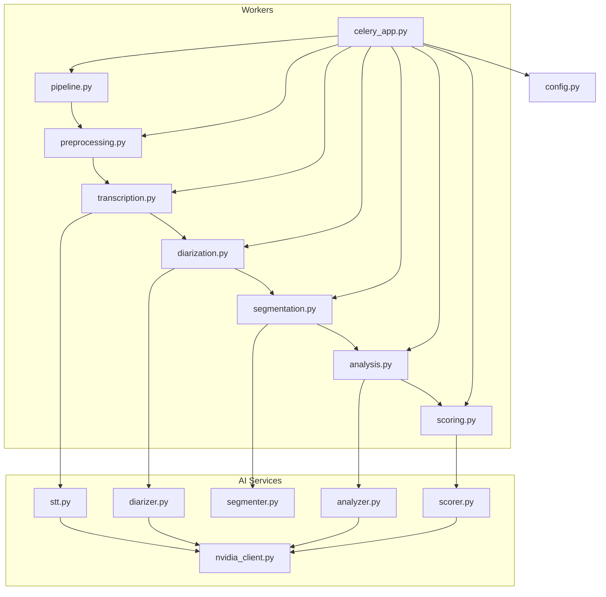

**Diagram sources**
- [celery_app.py:1-31](file://apps/api/src/workers/celery_app.py#L1-L31)
- [pipeline.py:12-35](file://apps/api/src/workers/pipeline.py#L12-L35)
- [preprocessing.py:106-206](file://apps/api/src/workers/preprocessing.py#L106-L206)
- [transcription.py:53-146](file://apps/api/src/workers/transcription.py#L53-L146)
- [diarization.py:65-119](file://apps/api/src/workers/diarization.py#L65-L119)
- [segmentation.py:92-146](file://apps/api/src/workers/segmentation.py#L92-L146)
- [analysis.py:152-242](file://apps/api/src/workers/analysis.py#L152-L242)
- [scoring.py:235-314](file://apps/api/src/workers/scoring.py#L235-L314)
- [stt.py:12-86](file://apps/api/src/ai/stt.py#L12-L86)
- [nvidia_client.py:32-274](file://apps/api/src/ai/nvidia_client.py#L32-L274)
- [diarizer.py:12-206](file://apps/api/src/ai/diarizer.py#L12-L206)
- [segmenter.py:92-366](file://apps/api/src/ai/segmenter.py#L92-L366)
- [analyzer.py:47-198](file://apps/api/src/ai/analyzer.py#L47-L198)
- [scorer.py:66-217](file://apps/api/src/ai/scorer.py#L66-L217)
- [config.py:4-52](file://apps/api/src/config.py#L4-L52)

**Section sources**
- [celery_app.py:1-31](file://apps/api/src/workers/celery_app.py#L1-L31)
- [pipeline.py:12-35](file://apps/api/src/workers/pipeline.py#L12-L35)
- [config.py:4-52](file://apps/api/src/config.py#L4-L52)

## Core Components
- Celery application and configuration: Defines broker/backend, serializers, time limits, prefetch behavior, and task registration.
- Pipeline orchestration: A chain that sequences preprocessing, transcription, diarization, segmentation, analysis, and scoring.
- Worker tasks: Idempotent, stateless Celery tasks implementing each stage with retry/backoff and status updates.
- AI service wrappers: Thin wrappers around NVIDIA NIM APIs for STT, diarization, chat completions, and embeddings.
- External service coordination: Uses Redis for Celery transport and SQLAlchemy for synchronous DB operations within tasks.

Key characteristics:
- Serialization: JSON for tasks and results.
- Reliability: Late acknowledgement, prefetch multiplier tuned to prevent overconsumption, soft/hard time limits.
- Failure handling: Max retries with exponential backoff at both Celery and AI client levels.

**Section sources**
- [celery_app.py:5-31](file://apps/api/src/workers/celery_app.py#L5-L31)
- [pipeline.py:12-35](file://apps/api/src/workers/pipeline.py#L12-L35)
- [preprocessing.py:106-206](file://apps/api/src/workers/preprocessing.py#L106-L206)
- [transcription.py:53-146](file://apps/api/src/workers/transcription.py#L53-L146)
- [diarization.py:65-119](file://apps/api/src/workers/diarization.py#L65-L119)
- [segmentation.py:92-146](file://apps/api/src/workers/segmentation.py#L92-L146)
- [analysis.py:152-242](file://apps/api/src/workers/analysis.py#L152-L242)
- [scoring.py:235-314](file://apps/api/src/workers/scoring.py#L235-L314)
- [stt.py:12-86](file://apps/api/src/ai/stt.py#L12-L86)
- [nvidia_client.py:32-274](file://apps/api/src/ai/nvidia_client.py#L32-L274)

## Architecture Overview
The pipeline is a linear chain of Celery tasks. Each task performs a single responsibility, persists intermediate artifacts (e.g., preprocessed audio, transcripts), and passes the recording identifier to the next stage. AI services integrate via the NVIDIA NIM client with robust retry and error handling.

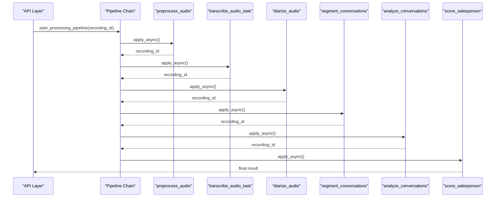

**Diagram sources**
- [pipeline.py:12-35](file://apps/api/src/workers/pipeline.py#L12-L35)
- [preprocessing.py:106-206](file://apps/api/src/workers/preprocessing.py#L106-L206)
- [transcription.py:53-146](file://apps/api/src/workers/transcription.py#L53-L146)
- [diarization.py:65-119](file://apps/api/src/workers/diarization.py#L65-L119)
- [segmentation.py:92-146](file://apps/api/src/workers/segmentation.py#L92-L146)
- [analysis.py:152-242](file://apps/api/src/workers/analysis.py#L152-L242)
- [scoring.py:235-314](file://apps/api/src/workers/scoring.py#L235-L314)

## Detailed Component Analysis

### Celery Application and Configuration
- Broker/backend: Redis URL from settings.
- Serializers: JSON for tasks and results.
- Timeouts: Soft and hard time limits configured to handle long-running AI tasks.
- Prefetch: Controlled via worker_prefetch_multiplier to balance throughput and fairness.
- Task tracking: Enabled to track started tasks.

Operational implications:
- Use separate queues per priority if scaling horizontally.
- Monitor task durations against configured limits to avoid premature hard timeouts.

**Section sources**
- [celery_app.py:5-31](file://apps/api/src/workers/celery_app.py#L5-L31)
- [config.py:15-16](file://apps/api/src/config.py#L15-L16)

### Pipeline Orchestration
- The chain composes six tasks: preprocessing, transcription, diarization, segmentation, analysis, and scoring.
- Each task returns the recording identifier to the next stage, enabling a clean data flow.

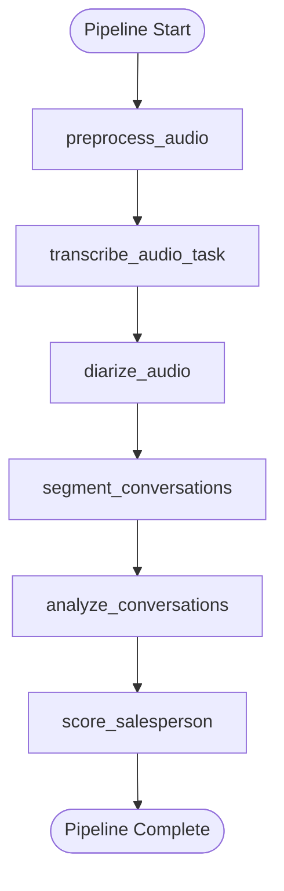

**Diagram sources**
- [pipeline.py:26-34](file://apps/api/src/workers/pipeline.py#L26-L34)

**Section sources**
- [pipeline.py:12-35](file://apps/api/src/workers/pipeline.py#L12-L35)

### Audio Preprocessing
Responsibilities:
- Download raw audio, normalize, resample to 16 kHz, convert to mono, and detect silence gaps.
- Persist preprocessed audio to storage and update DB metadata (duration, silence gaps).
- Use a dedicated sync DB session within the task to maintain transactional integrity.

Failure handling:
- Retries with exponential backoff; on final failure, marks recording as failed.

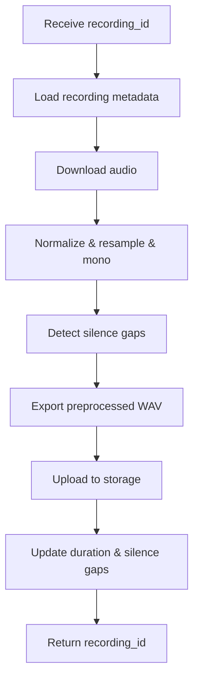

**Diagram sources**
- [preprocessing.py:106-206](file://apps/api/src/workers/preprocessing.py#L106-L206)

**Section sources**
- [preprocessing.py:106-206](file://apps/api/src/workers/preprocessing.py#L106-L206)

### Speech-to-Text (NVIDIA Parakeet)
Responsibilities:
- Download preprocessed audio, transcribe using NVIDIA NIM STT endpoint.
- Handle large files by chunking with adjusted timestamps.
- Store transcript segments in DB.

Failure handling:
- Retries with exponential backoff; on final failure, marks recording as failed.

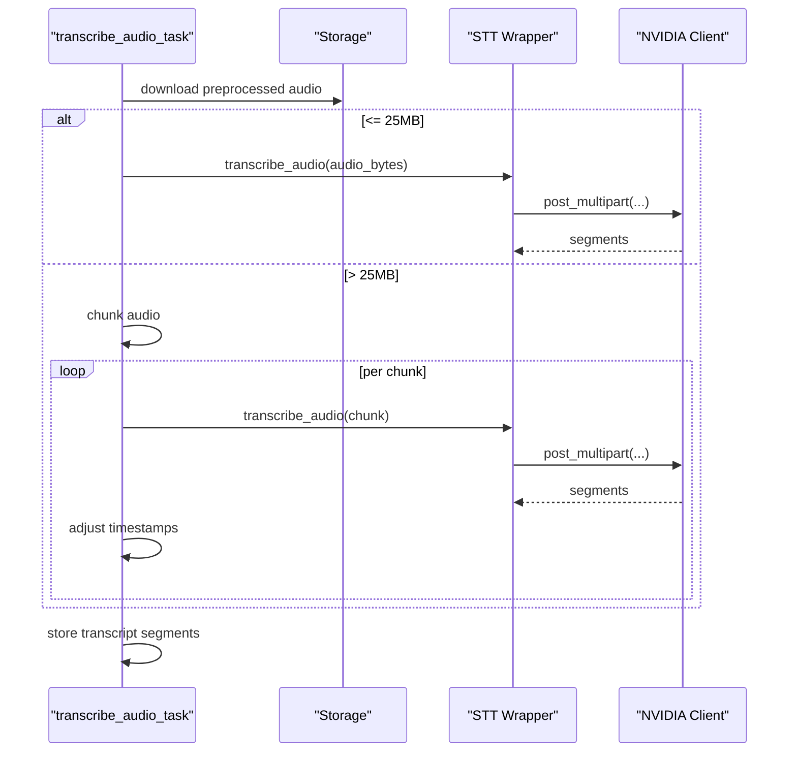

**Diagram sources**
- [transcription.py:53-146](file://apps/api/src/workers/transcription.py#L53-L146)
- [stt.py:12-86](file://apps/api/src/ai/stt.py#L12-L86)
- [nvidia_client.py:132-197](file://apps/api/src/ai/nvidia_client.py#L132-L197)

**Section sources**
- [transcription.py:53-146](file://apps/api/src/workers/transcription.py#L53-L146)
- [stt.py:12-86](file://apps/api/src/ai/stt.py#L12-L86)
- [nvidia_client.py:32-274](file://apps/api/src/ai/nvidia_client.py#L32-L274)

### Speaker Diarization (NVIDIA NeMo)
Responsibilities:
- Call NVIDIA NIM diarization endpoint.
- Parse and normalize speaker segments, merge into transcript segments.
- Fall back to gap-based assignment if API fails.

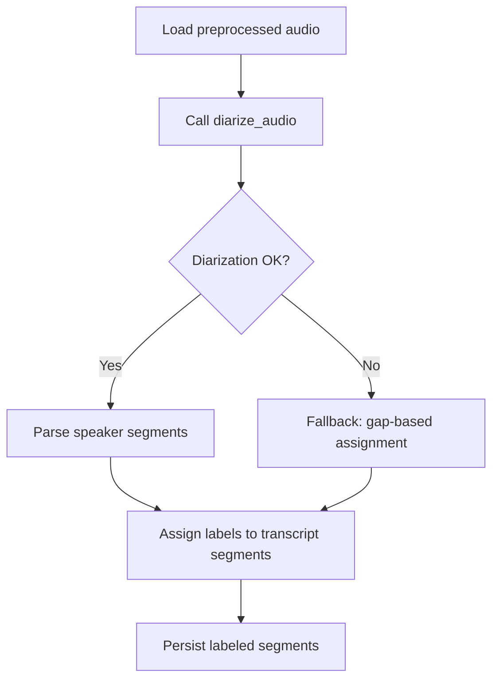

**Diagram sources**
- [diarization.py:65-119](file://apps/api/src/workers/diarization.py#L65-L119)
- [diarizer.py:12-206](file://apps/api/src/ai/diarizer.py#L12-L206)

**Section sources**
- [diarization.py:65-119](file://apps/api/src/workers/diarization.py#L65-L119)
- [diarizer.py:12-206](file://apps/api/src/ai/diarizer.py#L12-L206)

### Conversation Segmentation
Responsibilities:
- Use silence gaps, greeting/farewell detection, and speaker patterns to segment into discrete conversations.
- Store conversation records and segment counts.

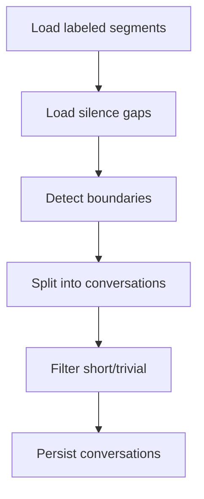

**Diagram sources**
- [segmentation.py:92-146](file://apps/api/src/workers/segmentation.py#L92-L146)
- [segmenter.py:92-366](file://apps/api/src/ai/segmenter.py#L92-L366)

**Section sources**
- [segmentation.py:92-146](file://apps/api/src/workers/segmentation.py#L92-L146)
- [segmenter.py:92-366](file://apps/api/src/ai/segmenter.py#L92-L366)

### Conversation Analysis (LLM)
Responsibilities:
- For each conversation, format transcript and call LLM to extract intent, products, objections, outcome, confidence, and coaching notes.
- Store analysis and update conversation summary if confidence meets threshold.

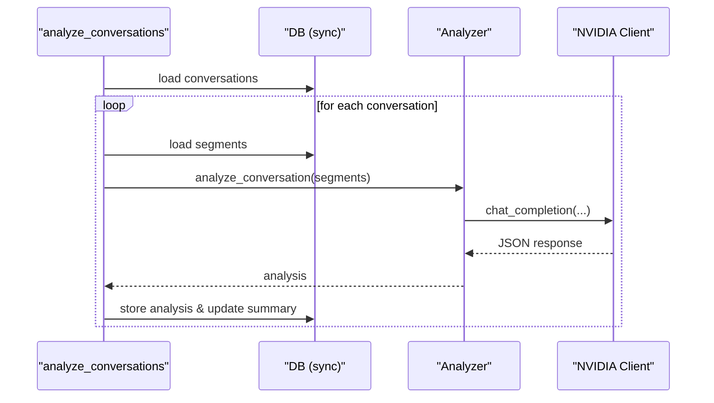

**Diagram sources**
- [analysis.py:152-242](file://apps/api/src/workers/analysis.py#L152-L242)
- [analyzer.py:47-198](file://apps/api/src/ai/analyzer.py#L47-L198)
- [nvidia_client.py:200-236](file://apps/api/src/ai/nvidia_client.py#L200-L236)

**Section sources**
- [analysis.py:152-242](file://apps/api/src/workers/analysis.py#L152-L242)
- [analyzer.py:47-198](file://apps/api/src/ai/analyzer.py#L47-L198)

### Salesperson Scoring (LLM)
Responsibilities:
- Score each conversation across five dimensions using LLM.
- Aggregate per-conversation scores into averages and persist.
- Mark recording as completed and update daily metrics.

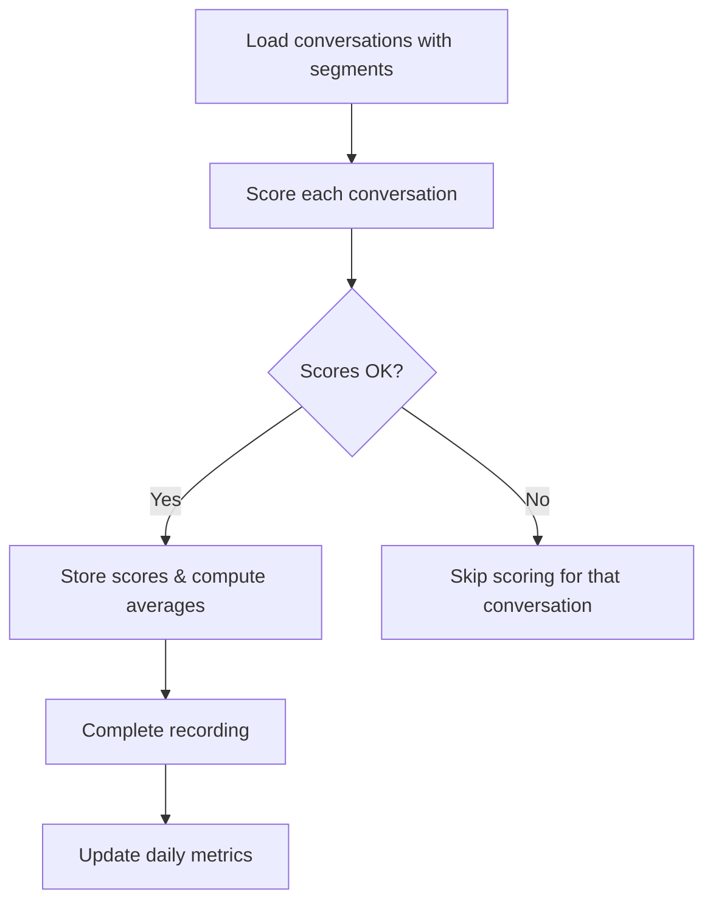

**Diagram sources**
- [scoring.py:235-314](file://apps/api/src/workers/scoring.py#L235-L314)
- [scorer.py:66-217](file://apps/api/src/ai/scorer.py#L66-L217)

**Section sources**
- [scoring.py:235-314](file://apps/api/src/workers/scoring.py#L235-L314)
- [scorer.py:66-217](file://apps/api/src/ai/scorer.py#L66-L217)

### AI Service Integration Patterns
- NVIDIA NIM client encapsulates HTTP calls, retry logic, and error classification.
- STT and diarization use multipart uploads; chat completions and embeddings use JSON payloads.
- Retry strategy uses exponential backoff with base delay and bounded attempts.

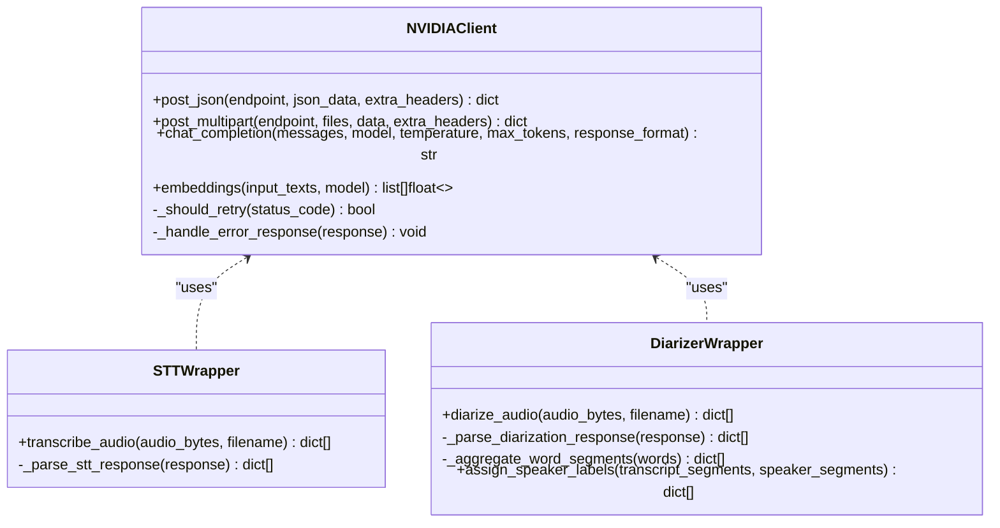

**Diagram sources**
- [nvidia_client.py:32-274](file://apps/api/src/ai/nvidia_client.py#L32-L274)
- [stt.py:12-86](file://apps/api/src/ai/stt.py#L12-L86)
- [diarizer.py:12-206](file://apps/api/src/ai/diarizer.py#L12-L206)

**Section sources**
- [nvidia_client.py:32-274](file://apps/api/src/ai/nvidia_client.py#L32-L274)
- [stt.py:12-86](file://apps/api/src/ai/stt.py#L12-L86)
- [diarizer.py:12-206](file://apps/api/src/ai/diarizer.py#L12-L206)

## Dependency Analysis
- Workers depend on Celery app configuration and share a common DB session helper pattern for synchronous operations.
- AI wrappers depend on the NVIDIA client and configuration for endpoint/model selection.
- External dependencies: Redis for Celery transport, PostgreSQL for persistence, and NVIDIA NIM for AI services.

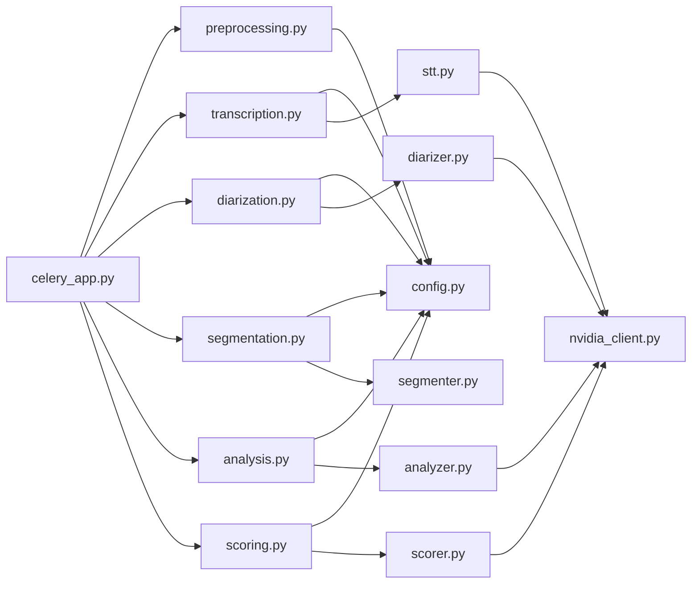

**Diagram sources**
- [celery_app.py:1-31](file://apps/api/src/workers/celery_app.py#L1-L31)
- [preprocessing.py:1-206](file://apps/api/src/workers/preprocessing.py#L1-L206)
- [transcription.py:1-146](file://apps/api/src/workers/transcription.py#L1-L146)
- [diarization.py:1-119](file://apps/api/src/workers/diarization.py#L1-L119)
- [segmentation.py:1-146](file://apps/api/src/workers/segmentation.py#L1-L146)
- [analysis.py:1-242](file://apps/api/src/workers/analysis.py#L1-L242)
- [scoring.py:1-314](file://apps/api/src/workers/scoring.py#L1-L314)
- [stt.py:1-86](file://apps/api/src/ai/stt.py#L1-L86)
- [nvidia_client.py:1-274](file://apps/api/src/ai/nvidia_client.py#L1-L274)
- [diarizer.py:1-206](file://apps/api/src/ai/diarizer.py#L1-L206)
- [segmenter.py:1-366](file://apps/api/src/ai/segmenter.py#L1-L366)
- [analyzer.py:1-198](file://apps/api/src/ai/analyzer.py#L1-L198)
- [scorer.py:1-217](file://apps/api/src/ai/scorer.py#L1-L217)
- [config.py:1-52](file://apps/api/src/config.py#L1-L52)

**Section sources**
- [celery_app.py:1-31](file://apps/api/src/workers/celery_app.py#L1-L31)
- [config.py:1-52](file://apps/api/src/config.py#L1-L52)

## Performance Considerations
- Time limits: Configure soft and hard time limits appropriate for AI workloads; monitor task durations to avoid premature failures.
- Prefetch control: worker_prefetch_multiplier tuned to prevent worker starvation and reduce memory pressure.
- Chunking: Large audio is chunked for STT to respect API constraints; ensure chunk boundaries align with conversation boundaries to minimize misalignment.
- I/O batching: Group DB writes per stage to reduce transaction overhead.
- Metrics: Track task durations, retry rates, and success/failure ratios to identify bottlenecks.
- Scaling: Increase worker concurrency per stage; consider dedicated queues for long-running tasks (e.g., analysis, scoring).

[No sources needed since this section provides general guidance]

## Troubleshooting Guide
Common failure modes and remedies:
- Transcription failures: Verify audio chunking logic and timestamp alignment; confirm API credentials and model availability.
- Diarization failures: Expect fallback behavior; review silence gap usage and speaker label normalization.
- Analysis confidence thresholds: Results below threshold are skipped; improve prompts or increase retries cautiously.
- Scoring failures: Missing segments lead to skipped scoring; ensure segmentation precedes scoring.
- Database connectivity: Use sync sessions within tasks; ensure database URLs are reachable and credentials are correct.
- NVIDIA API errors: Inspect rate limit and authentication errors; leverage built-in retry with exponential backoff.

**Section sources**
- [transcription.py:96-101](file://apps/api/src/workers/transcription.py#L96-L101)
- [diarization.py:113-118](file://apps/api/src/workers/diarization.py#L113-L118)
- [analysis.py:205-212](file://apps/api/src/workers/analysis.py#L205-L212)
- [scoring.py:274-277](file://apps/api/src/workers/scoring.py#L274-L277)
- [nvidia_client.py:52-71](file://apps/api/src/ai/nvidia_client.py#L52-L71)

## Conclusion
The AI pipeline leverages Celery for reliable, asynchronous orchestration of audio processing stages. By combining robust retry strategies, careful serialization, and modular AI service wrappers, it achieves scalability and resilience for AI-intensive workflows. Proper configuration of time limits, prefetch behavior, and queue management, along with continuous monitoring, ensures predictable performance and operability at scale.