# Backend Architecture

<cite>
**Referenced Files in This Document**
- [apps/api/src/main.py](file://apps/api/src/main.py)
- [apps/api/src/config.py](file://apps/api/src/config.py)
- [apps/api/src/database.py](file://apps/api/src/database.py)
- [apps/api/src/api/v1/router.py](file://apps/api/src/api/v1/router.py)
- [apps/api/src/api/deps.py](file://apps/api/src/api/deps.py)
- [apps/api/src/models/__init__.py](file://apps/api/src/models/__init__.py)
- [apps/api/src/models/user.py](file://apps/api/src/models/user.py)
- [apps/api/src/services/auth.py](file://apps/api/src/services/auth.py)
- [apps/api/src/api/v1/auth.py](file://apps/api/src/api/v1/auth.py)
- [apps/api/src/api/v1/brands.py](file://apps/api/src/api/v1/brands.py)
- [apps/api/src/schemas/auth.py](file://apps/api/src/schemas/auth.py)
- [apps/api/src/services/brand.py](file://apps/api/src/services/brand.py)
- [apps/api/src/workers/celery_app.py](file://apps/api/src/workers/celery_app.py)
- [apps/api/src/workers/pipeline.py](file://apps/api/src/workers/pipeline.py)
- [apps/api/src/storage/local.py](file://apps/api/src/storage/local.py)
</cite>

## Table of Contents
1. [Introduction](#introduction)
2. [Project Structure](#project-structure)
3. [Core Components](#core-components)
4. [Architecture Overview](#architecture-overview)
5. [Detailed Component Analysis](#detailed-component-analysis)
6. [Dependency Analysis](#dependency-analysis)
7. [Performance Considerations](#performance-considerations)
8. [Troubleshooting Guide](#troubleshooting-guide)
9. [Conclusion](#conclusion)

## Introduction
This document describes the backend architecture of the FastAPI service powering the CXSAMAA platform. It covers application initialization, routing hierarchy, dependency injection patterns, middleware configuration, configuration management, database and ORM integration, modular routers under api/v1/, dependency helpers in deps.py, and health checks. It also outlines security considerations, error handling patterns, and performance optimization strategies, with architectural diagrams to illustrate component relationships and data flow.

## Project Structure
The backend is organized around a FastAPI application with a clear separation of concerns:
- Application entrypoint initializes the ASGI app, registers CORS, and mounts the API v1 router.
- Configuration is centralized via a Pydantic settings class with environment-driven defaults.
- Database layer uses SQLAlchemy async ORM with a shared Base class and a dependency-provided async session generator.
- Modular routers under api/v1/ group endpoints by domain (authentication, brands, stores, salespeople, recordings, conversations, search).
- Dependency helpers in api/deps.py centralize authentication and authorization checks.
- Services encapsulate business logic and coordinate with the database.
- Models define the ORM schema and relationships.
- Workers integrate Celery for asynchronous audio processing pipelines.
- Storage abstraction supports local file uploads and downloads.

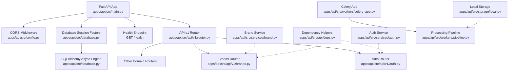

**Diagram sources**
- [apps/api/src/main.py:1-29](file://apps/api/src/main.py#L1-L29)
- [apps/api/src/config.py:1-52](file://apps/api/src/config.py#L1-L52)
- [apps/api/src/database.py:1-34](file://apps/api/src/database.py#L1-L34)
- [apps/api/src/api/v1/router.py:1-20](file://apps/api/src/api/v1/router.py#L1-L20)
- [apps/api/src/api/v1/auth.py:1-82](file://apps/api/src/api/v1/auth.py#L1-L82)
- [apps/api/src/api/v1/brands.py:1-53](file://apps/api/src/api/v1/brands.py#L1-L53)
- [apps/api/src/api/deps.py:1-63](file://apps/api/src/api/deps.py#L1-L63)
- [apps/api/src/services/auth.py:1-55](file://apps/api/src/services/auth.py#L1-L55)
- [apps/api/src/services/brand.py:1-38](file://apps/api/src/services/brand.py#L1-L38)
- [apps/api/src/workers/celery_app.py:1-31](file://apps/api/src/workers/celery_app.py#L1-L31)
- [apps/api/src/workers/pipeline.py:1-35](file://apps/api/src/workers/pipeline.py#L1-L35)
- [apps/api/src/storage/local.py:1-50](file://apps/api/src/storage/local.py#L1-L50)

**Section sources**
- [apps/api/src/main.py:1-29](file://apps/api/src/main.py#L1-L29)
- [apps/api/src/config.py:1-52](file://apps/api/src/config.py#L1-L52)
- [apps/api/src/database.py:1-34](file://apps/api/src/database.py#L1-L34)
- [apps/api/src/api/v1/router.py:1-20](file://apps/api/src/api/v1/router.py#L1-L20)

## Core Components
- Application initialization and lifecycle:
  - FastAPI app creation with metadata and docs endpoints.
  - CORS middleware registration using settings-driven origins.
  - API v1 router inclusion and a top-level health endpoint.
- Configuration management:
  - Centralized settings class with environment file support and derived CORS origin list property.
- Database and ORM:
  - Async SQLAlchemy engine and async session factory.
  - Shared declarative Base class.
  - Dependency-provided async session generator with automatic commit/rollback semantics.
- Dependency injection and security:
  - HTTP bearer token extraction and JWT decoding.
  - Current user resolution and role-based access control via reusable dependency classes.
- Modular routers:
  - API v1 groups domain-specific routers under a common prefix.
- Services and schemas:
  - Business logic encapsulated in services; Pydantic schemas for request/response validation.
- Workers and storage:
  - Celery app configured with Redis as broker/backend and task serialization settings.
  - Local storage backend supporting sync and async operations.

**Section sources**
- [apps/api/src/main.py:1-29](file://apps/api/src/main.py#L1-L29)
- [apps/api/src/config.py:1-52](file://apps/api/src/config.py#L1-L52)
- [apps/api/src/database.py:1-34](file://apps/api/src/database.py#L1-L34)
- [apps/api/src/api/deps.py:1-63](file://apps/api/src/api/deps.py#L1-L63)
- [apps/api/src/api/v1/router.py:1-20](file://apps/api/src/api/v1/router.py#L1-L20)
- [apps/api/src/services/auth.py:1-55](file://apps/api/src/services/auth.py#L1-L55)
- [apps/api/src/schemas/auth.py:1-36](file://apps/api/src/schemas/auth.py#L1-L36)
- [apps/api/src/workers/celery_app.py:1-31](file://apps/api/src/workers/celery_app.py#L1-L31)
- [apps/api/src/storage/local.py:1-50](file://apps/api/src/storage/local.py#L1-L50)

## Architecture Overview
The system follows a layered architecture:
- Presentation Layer: FastAPI routes under api/v1/.
- Business Logic Layer: Services implementing domain operations.
- Data Access Layer: SQLAlchemy async ORM with dependency-managed sessions.
- Infrastructure Layer: Celery workers for long-running tasks, Redis for task coordination, local storage for media assets.

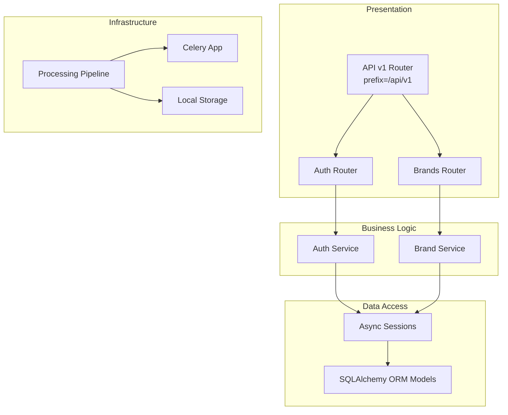

**Diagram sources**
- [apps/api/src/api/v1/router.py:1-20](file://apps/api/src/api/v1/router.py#L1-L20)
- [apps/api/src/api/v1/auth.py:1-82](file://apps/api/src/api/v1/auth.py#L1-L82)
- [apps/api/src/api/v1/brands.py:1-53](file://apps/api/src/api/v1/brands.py#L1-L53)
- [apps/api/src/services/auth.py:1-55](file://apps/api/src/services/auth.py#L1-L55)
- [apps/api/src/services/brand.py:1-38](file://apps/api/src/services/brand.py#L1-L38)
- [apps/api/src/database.py:1-34](file://apps/api/src/database.py#L1-L34)
- [apps/api/src/workers/pipeline.py:1-35](file://apps/api/src/workers/pipeline.py#L1-L35)
- [apps/api/src/workers/celery_app.py:1-31](file://apps/api/src/workers/celery_app.py#L1-L31)
- [apps/api/src/storage/local.py:1-50](file://apps/api/src/storage/local.py#L1-L50)

## Detailed Component Analysis

### Application Initialization and Health Checks
- FastAPI app creation sets metadata and docs endpoints.
- CORS middleware is registered using settings-derived origin list.
- API v1 router is included at the application level.
- Health check endpoint returns service status and environment.

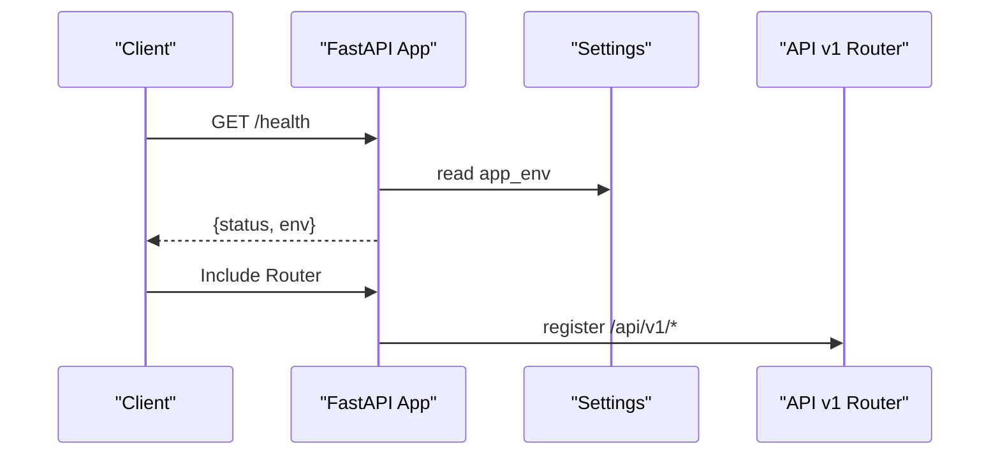

**Diagram sources**
- [apps/api/src/main.py:1-29](file://apps/api/src/main.py#L1-L29)
- [apps/api/src/config.py:1-52](file://apps/api/src/config.py#L1-L52)
- [apps/api/src/api/v1/router.py:1-20](file://apps/api/src/api/v1/router.py#L1-L20)

**Section sources**
- [apps/api/src/main.py:1-29](file://apps/api/src/main.py#L1-L29)
- [apps/api/src/config.py:1-52](file://apps/api/src/config.py#L1-L52)

### Configuration Management
- Settings class defines database, Redis, JWT, storage, NVIDIA NIM, app runtime, and CORS parameters.
- CORS origin list is derived from a comma-separated environment string.
- Environment file loading is configured via Pydantic settings.

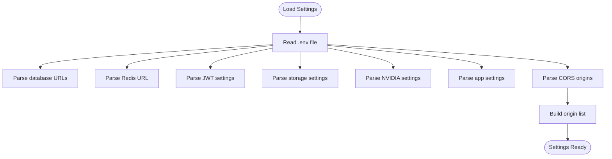

**Diagram sources**
- [apps/api/src/config.py:1-52](file://apps/api/src/config.py#L1-L52)

**Section sources**
- [apps/api/src/config.py:1-52](file://apps/api/src/config.py#L1-L52)

### Database and ORM Integration
- Async SQLAlchemy engine configured with pool size and overflow.
- Async session factory bound to the engine.
- Base declarative class for ORM models.
- Dependency-provided async session generator ensures commit on success and rollback on exceptions.

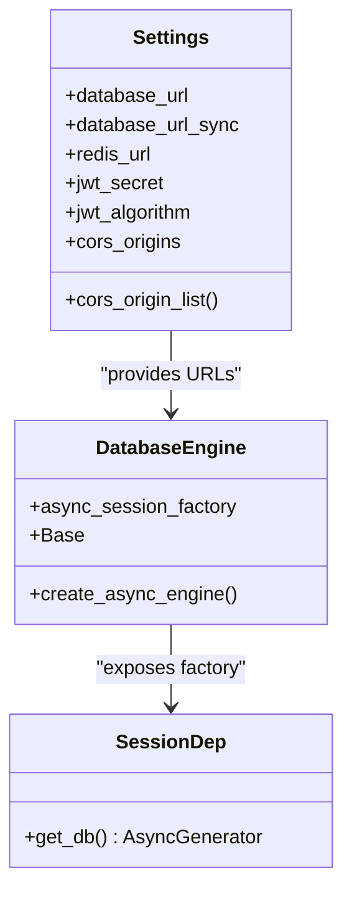

**Diagram sources**
- [apps/api/src/config.py:1-52](file://apps/api/src/config.py#L1-L52)
- [apps/api/src/database.py:1-34](file://apps/api/src/database.py#L1-L34)

**Section sources**
- [apps/api/src/database.py:1-34](file://apps/api/src/database.py#L1-L34)

### Dependency Injection and Security
- HTTP bearer token extraction via FastAPI security dependency.
- JWT decoding and access token validation.
- Current user resolution from token payload and database lookup.
- Role-based access control using reusable dependency classes with pre-defined role sets.

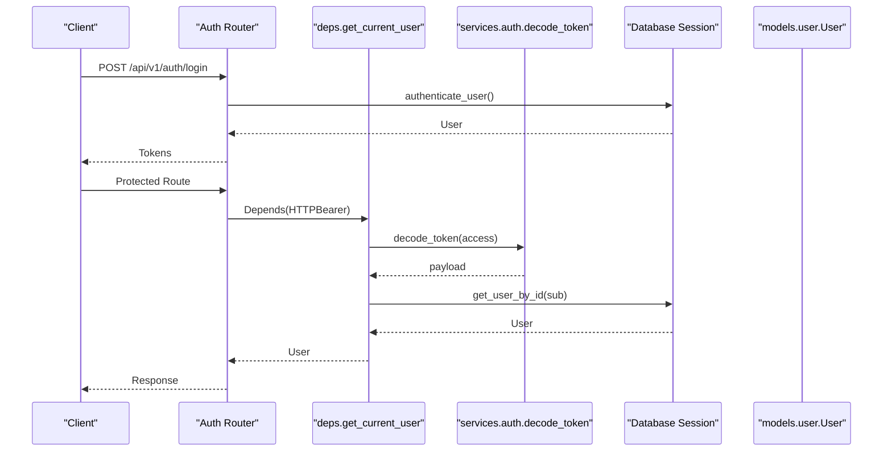

**Diagram sources**
- [apps/api/src/api/v1/auth.py:1-82](file://apps/api/src/api/v1/auth.py#L1-L82)
- [apps/api/src/api/deps.py:1-63](file://apps/api/src/api/deps.py#L1-L63)
- [apps/api/src/services/auth.py:1-55](file://apps/api/src/services/auth.py#L1-L55)
- [apps/api/src/models/user.py:1-48](file://apps/api/src/models/user.py#L1-L48)

**Section sources**
- [apps/api/src/api/deps.py:1-63](file://apps/api/src/api/deps.py#L1-L63)
- [apps/api/src/services/auth.py:1-55](file://apps/api/src/services/auth.py#L1-L55)
- [apps/api/src/models/user.py:1-48](file://apps/api/src/models/user.py#L1-L48)

### Modular Router Organization (api/v1/)
- API v1 router aggregates domain routers under a common prefix.
- Each domain router defines endpoints with appropriate tags and response models.
- Authentication and authorization dependencies are applied at the router level where needed.

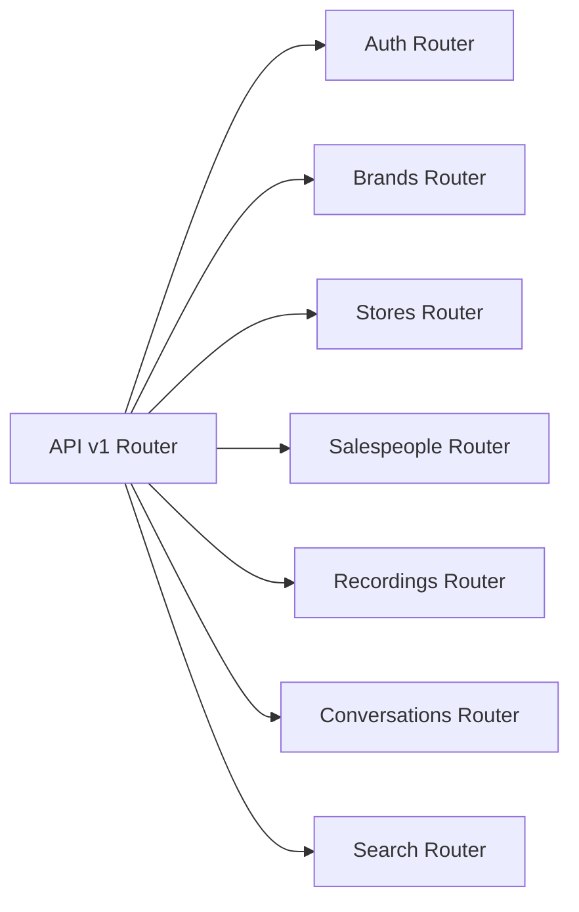

**Diagram sources**
- [apps/api/src/api/v1/router.py:1-20](file://apps/api/src/api/v1/router.py#L1-L20)
- [apps/api/src/api/v1/auth.py:1-82](file://apps/api/src/api/v1/auth.py#L1-L82)
- [apps/api/src/api/v1/brands.py:1-53](file://apps/api/src/api/v1/brands.py#L1-L53)

**Section sources**
- [apps/api/src/api/v1/router.py:1-20](file://apps/api/src/api/v1/router.py#L1-L20)
- [apps/api/src/api/v1/auth.py:1-82](file://apps/api/src/api/v1/auth.py#L1-L82)
- [apps/api/src/api/v1/brands.py:1-53](file://apps/api/src/api/v1/brands.py#L1-L53)

### Example: Authentication Flow
- Login endpoint authenticates the user, validates credentials, and issues access and refresh tokens.
- Refresh endpoint decodes the refresh token and issues new short-lived tokens.
- Logout is stateless for JWT; recommendation to add blacklist in Redis for production.

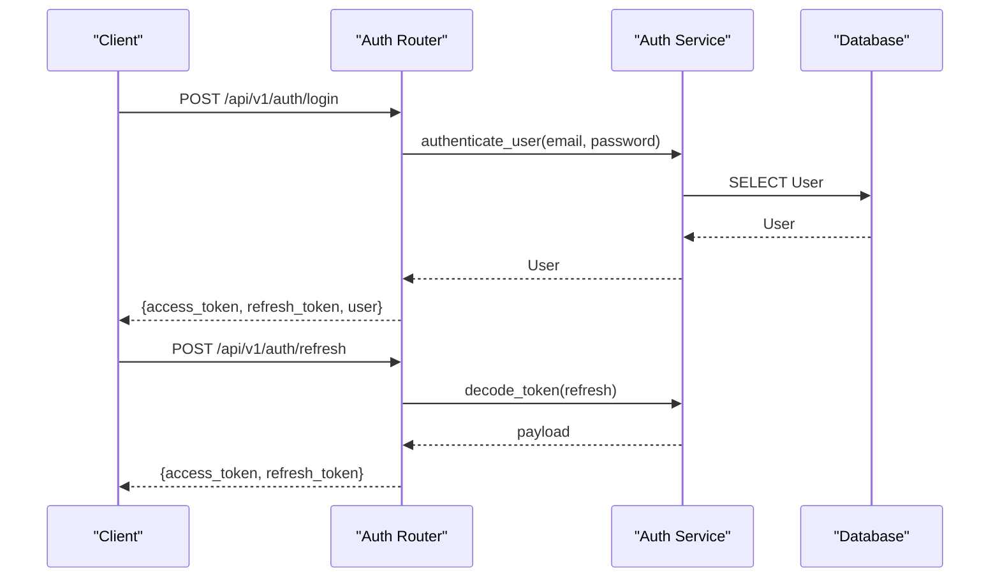

**Diagram sources**
- [apps/api/src/api/v1/auth.py:1-82](file://apps/api/src/api/v1/auth.py#L1-L82)
- [apps/api/src/services/auth.py:1-55](file://apps/api/src/services/auth.py#L1-L55)

**Section sources**
- [apps/api/src/api/v1/auth.py:1-82](file://apps/api/src/api/v1/auth.py#L1-L82)
- [apps/api/src/schemas/auth.py:1-36](file://apps/api/src/schemas/auth.py#L1-L36)

### Example: Brand Management Service
- Brand listing, retrieval, creation, and updates are handled by dedicated service functions.
- Services operate on AsyncSession instances provided by the dependency layer.
- Pydantic schemas validate request payloads and serialize responses.

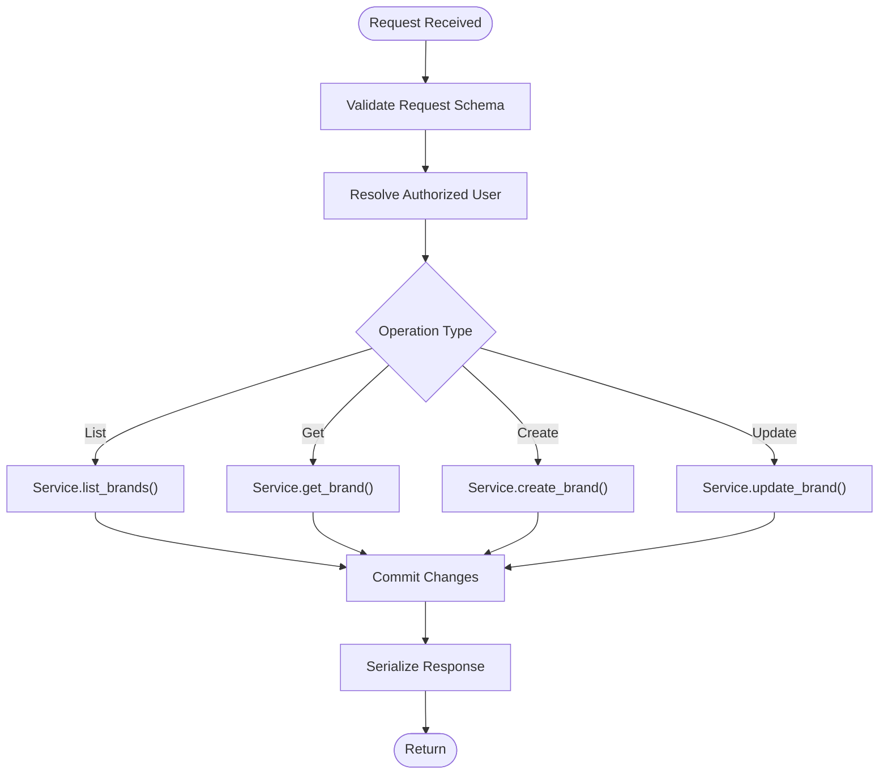

**Diagram sources**
- [apps/api/src/api/v1/brands.py:1-53](file://apps/api/src/api/v1/brands.py#L1-L53)
- [apps/api/src/services/brand.py:1-38](file://apps/api/src/services/brand.py#L1-L38)
- [apps/api/src/schemas/auth.py:1-36](file://apps/api/src/schemas/auth.py#L1-L36)

**Section sources**
- [apps/api/src/api/v1/brands.py:1-53](file://apps/api/src/api/v1/brands.py#L1-L53)
- [apps/api/src/services/brand.py:1-38](file://apps/api/src/services/brand.py#L1-L38)

### Workers and Asynchronous Processing
- Celery app configured with Redis broker/backend and task serialization.
- Pipeline orchestrator composes a chain of worker tasks for audio processing.
- Local storage backend supports both sync and async operations for uploads/downloads.

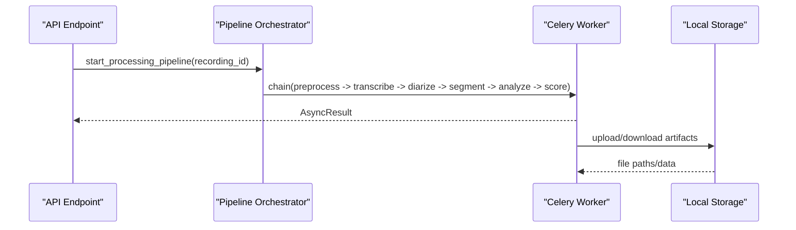

**Diagram sources**
- [apps/api/src/workers/pipeline.py:1-35](file://apps/api/src/workers/pipeline.py#L1-L35)
- [apps/api/src/workers/celery_app.py:1-31](file://apps/api/src/workers/celery_app.py#L1-L31)
- [apps/api/src/storage/local.py:1-50](file://apps/api/src/storage/local.py#L1-L50)

**Section sources**
- [apps/api/src/workers/celery_app.py:1-31](file://apps/api/src/workers/celery_app.py#L1-L31)
- [apps/api/src/workers/pipeline.py:1-35](file://apps/api/src/workers/pipeline.py#L1-L35)
- [apps/api/src/storage/local.py:1-50](file://apps/api/src/storage/local.py#L1-L50)

## Dependency Analysis
The system exhibits low coupling and high cohesion:
- Presentation depends on services and schemas.
- Services depend on models and database sessions.
- Dependencies are injected via FastAPI Depends and SQLAlchemy session factories.
- No circular dependencies observed among major modules.

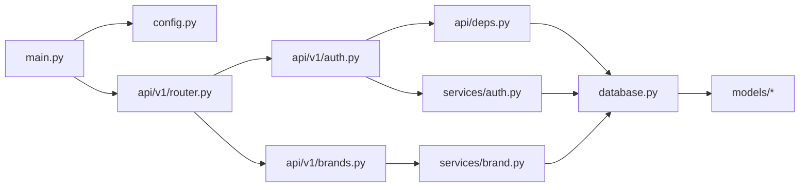

**Diagram sources**
- [apps/api/src/main.py:1-29](file://apps/api/src/main.py#L1-L29)
- [apps/api/src/config.py:1-52](file://apps/api/src/config.py#L1-L52)
- [apps/api/src/api/v1/router.py:1-20](file://apps/api/src/api/v1/router.py#L1-L20)
- [apps/api/src/api/v1/auth.py:1-82](file://apps/api/src/api/v1/auth.py#L1-L82)
- [apps/api/src/api/v1/brands.py:1-53](file://apps/api/src/api/v1/brands.py#L1-L53)
- [apps/api/src/api/deps.py:1-63](file://apps/api/src/api/deps.py#L1-L63)
- [apps/api/src/services/auth.py:1-55](file://apps/api/src/services/auth.py#L1-L55)
- [apps/api/src/services/brand.py:1-38](file://apps/api/src/services/brand.py#L1-L38)
- [apps/api/src/database.py:1-34](file://apps/api/src/database.py#L1-L34)
- [apps/api/src/models/__init__.py:1-24](file://apps/api/src/models/__init__.py#L1-L24)

**Section sources**
- [apps/api/src/models/__init__.py:1-24](file://apps/api/src/models/__init__.py#L1-L24)

## Performance Considerations
- Database pooling: Async engine pool size and overflow configured for concurrency.
- Session lifecycle: Automatic commit on success and rollback on exceptions reduce overhead and prevent leaks.
- Task orchestration: Celery worker prefetch multiplier set to 1 to avoid worker starvation; soft and hard time limits protect against long-running tasks.
- CORS: Wildcard allow methods and headers simplify development but should be narrowed in production.
- Storage: Local storage is synchronous; consider async-compatible backends for high-throughput scenarios.

[No sources needed since this section provides general guidance]

## Troubleshooting Guide
- Health endpoint: Verify environment and service readiness via GET /health.
- CORS errors: Confirm settings.cors_origins matches frontend origin and that allow_credentials is appropriate.
- Authentication failures: Check JWT secret, algorithm, and token type validation; ensure user is active.
- Database connectivity: Validate database_url and credentials; confirm async engine initialization.
- Worker tasks: Monitor Redis connectivity and task serialization; adjust time limits and prefetch multiplier as needed.

**Section sources**
- [apps/api/src/main.py:26-29](file://apps/api/src/main.py#L26-L29)
- [apps/api/src/config.py:46-48](file://apps/api/src/config.py#L46-L48)
- [apps/api/src/api/v1/auth.py:24-48](file://apps/api/src/api/v1/auth.py#L24-L48)
- [apps/api/src/database.py:8-19](file://apps/api/src/database.py#L8-L19)
- [apps/api/src/workers/celery_app.py:19-30](file://apps/api/src/workers/celery_app.py#L19-L30)

## Conclusion
The backend employs a clean, modular FastAPI architecture with explicit separation of concerns. Dependency injection, centralized configuration, and async ORM integration provide a solid foundation. The API v1 router organizes endpoints by domain, while dependency helpers enforce authentication and authorization. Asynchronous workers handle long-running tasks, and storage abstractions support future scaling. Security, error handling, and performance are addressed through practical patterns and configuration-driven tuning.