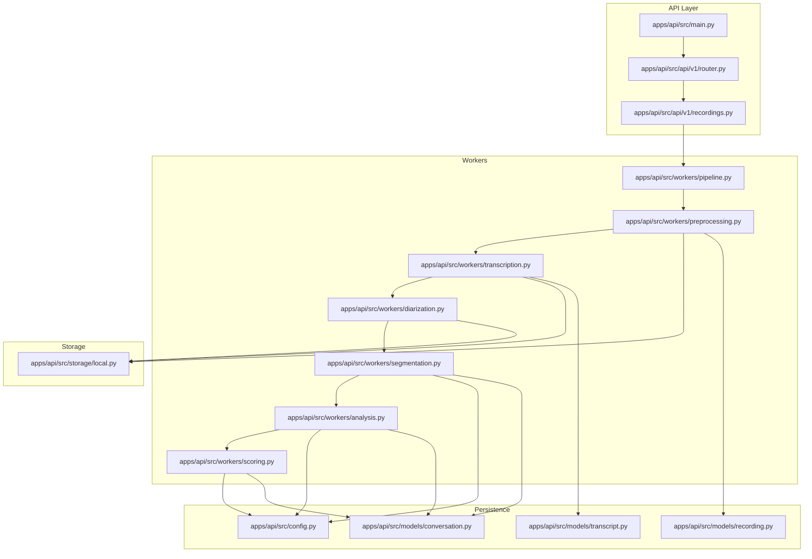
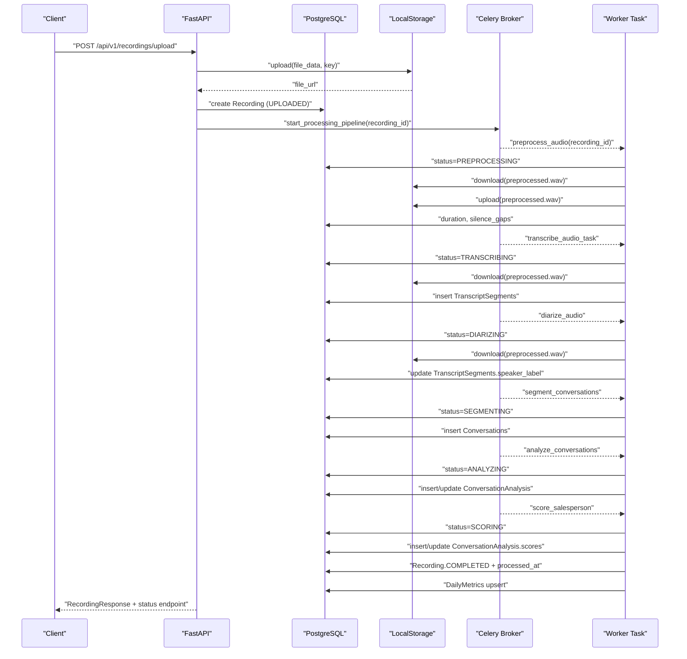
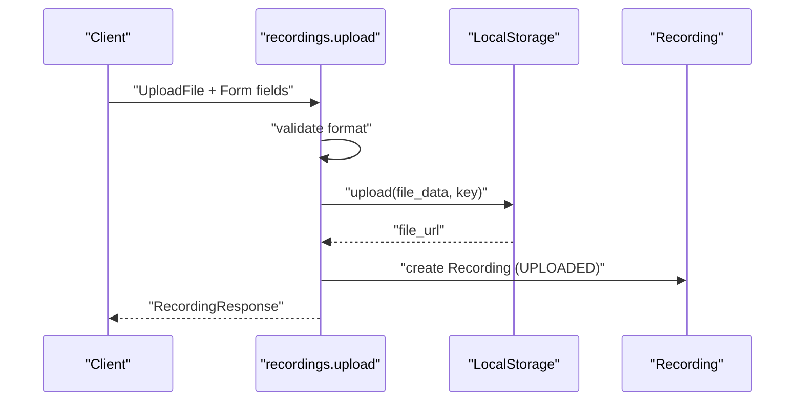
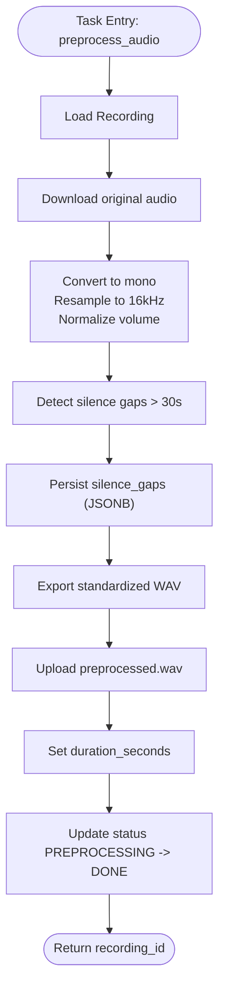
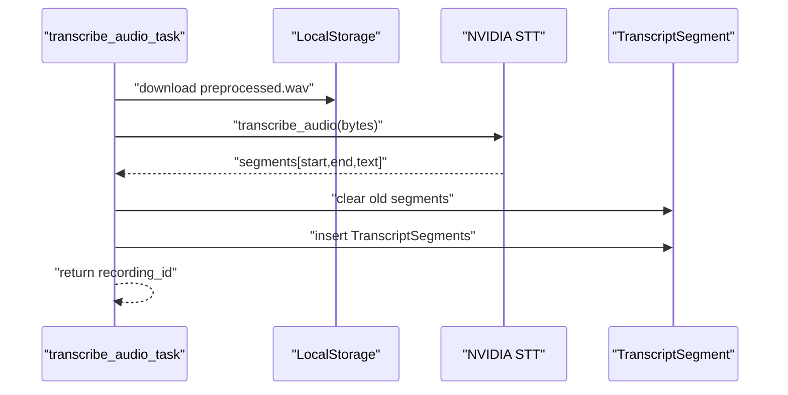
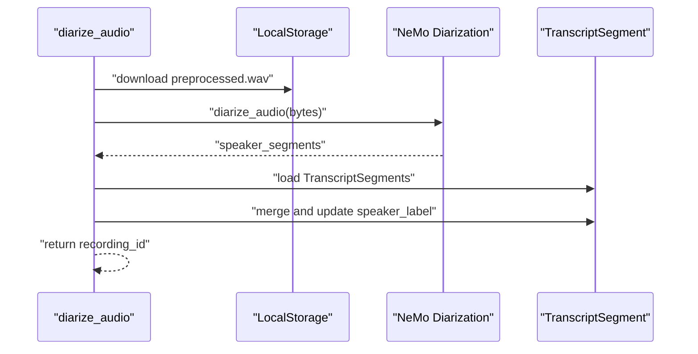
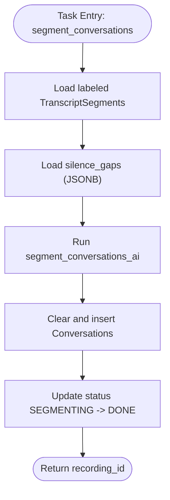
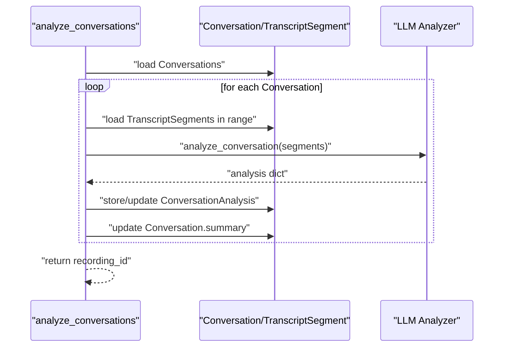
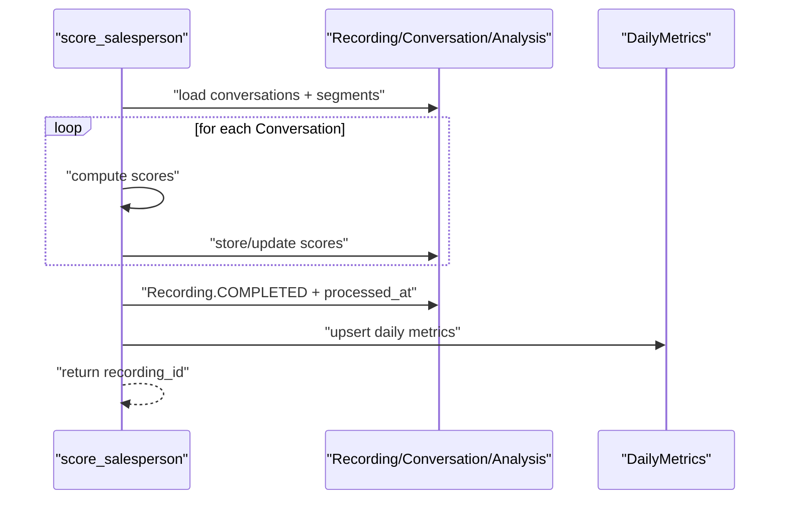
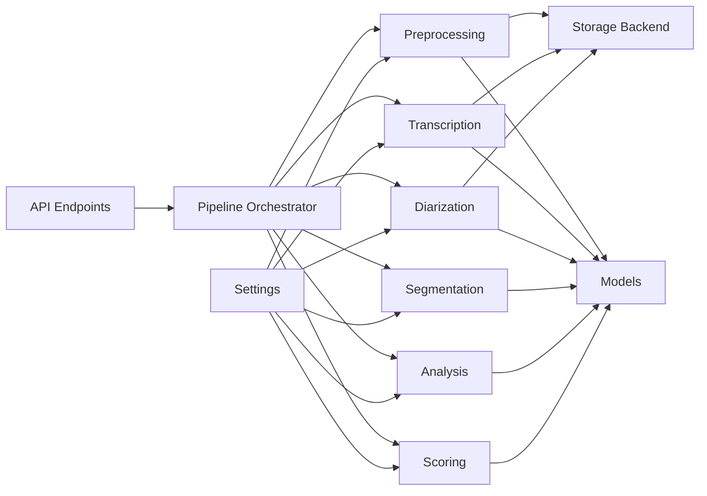

# Data Flow Patterns

<cite>
**Referenced Files in This Document**
- [apps/api/src/main.py](file://apps/api/src/main.py)
- [apps/api/src/api/v1/router.py](file://apps/api/src/api/v1/router.py)
- [apps/api/src/api/v1/recordings.py](file://apps/api/src/api/v1/recordings.py)
- [apps/api/src/workers/pipeline.py](file://apps/api/src/workers/pipeline.py)
- [apps/api/src/workers/preprocessing.py](file://apps/api/src/workers/preprocessing.py)
- [apps/api/src/workers/transcription.py](file://apps/api/src/workers/transcription.py)
- [apps/api/src/workers/diarization.py](file://apps/api/src/workers/diarization.py)
- [apps/api/src/workers/segmentation.py](file://apps/api/src/workers/segmentation.py)
- [apps/api/src/workers/analysis.py](file://apps/api/src/workers/analysis.py)
- [apps/api/src/workers/scoring.py](file://apps/api/src/workers/scoring.py)
- [apps/api/src/storage/local.py](file://apps/api/src/storage/local.py)
- [apps/api/src/models/recording.py](file://apps/api/src/models/recording.py)
- [apps/api/src/models/transcript.py](file://apps/api/src/models/transcript.py)
- [apps/api/src/models/conversation.py](file://apps/api/src/models/conversation.py)
- [apps/api/src/config.py](file://apps/api/src/config.py)
</cite>

## Table of Contents
1. [Introduction](#introduction)
2. [Project Structure](#project-structure)
3. [Core Components](#core-components)
4. [Architecture Overview](#architecture-overview)
5. [Detailed Component Analysis](#detailed-component-analysis)
6. [Dependency Analysis](#dependency-analysis)
7. [Performance Considerations](#performance-considerations)
8. [Troubleshooting Guide](#troubleshooting-guide)
9. [Conclusion](#conclusion)

## Introduction
This document explains the complete data flow of the Xsamaa AI Pipeline system, from audio file upload through preprocessing, transcription, speaker diarization, conversation segmentation, AI analysis, and final scoring. It details transformations, persistence, storage, API responses, validation, error propagation, and audit trails. The goal is to provide a clear, traceable view of how audio recordings move through the system and how results are stored and exposed.

## Project Structure
The system is organized into:
- API layer (FastAPI): request routing, validation, and response serialization
- Worker layer (Celery): asynchronous pipeline stages
- Storage layer: local filesystem-backed storage abstraction
- Persistence layer: SQLAlchemy ORM models and relationships
- AI clients: integrations with NVIDIA APIs for STT, diarization, embeddings, and LLM



**Diagram sources**
- [apps/api/src/main.py:1-29](file://apps/api/src/main.py#L1-L29)
- [apps/api/src/api/v1/router.py:1-20](file://apps/api/src/api/v1/router.py#L1-L20)
- [apps/api/src/api/v1/recordings.py:1-254](file://apps/api/src/api/v1/recordings.py#L1-L254)
- [apps/api/src/workers/pipeline.py:1-35](file://apps/api/src/workers/pipeline.py#L1-L35)
- [apps/api/src/workers/preprocessing.py:1-206](file://apps/api/src/workers/preprocessing.py#L1-L206)
- [apps/api/src/workers/transcription.py:1-146](file://apps/api/src/workers/transcription.py#L1-L146)
- [apps/api/src/workers/diarization.py:1-119](file://apps/api/src/workers/diarization.py#L1-L119)
- [apps/api/src/workers/segmentation.py:1-146](file://apps/api/src/workers/segmentation.py#L1-L146)
- [apps/api/src/workers/analysis.py:1-242](file://apps/api/src/workers/analysis.py#L1-L242)
- [apps/api/src/workers/scoring.py:1-314](file://apps/api/src/workers/scoring.py#L1-L314)
- [apps/api/src/storage/local.py:1-50](file://apps/api/src/storage/local.py#L1-L50)
- [apps/api/src/config.py:1-52](file://apps/api/src/config.py#L1-L52)
- [apps/api/src/models/recording.py:1-60](file://apps/api/src/models/recording.py#L1-L60)
- [apps/api/src/models/transcript.py:1-27](file://apps/api/src/models/transcript.py#L1-L27)
- [apps/api/src/models/conversation.py:1-61](file://apps/api/src/models/conversation.py#L1-L61)

**Section sources**
- [apps/api/src/main.py:1-29](file://apps/api/src/main.py#L1-L29)
- [apps/api/src/api/v1/router.py:1-20](file://apps/api/src/api/v1/router.py#L1-L20)
- [apps/api/src/api/v1/recordings.py:1-254](file://apps/api/src/api/v1/recordings.py#L1-L254)

## Core Components
- API endpoints accept uploads, expose status, transcripts, conversations, summaries, and exports
- Celery pipeline orchestrates preprocessing, transcription, diarization, segmentation, analysis, and scoring
- Storage backend persists audio files locally (with future S3 support)
- SQLAlchemy models define the schema, relationships, and JSONB fields for flexible analytics
- AI integrations handle STT, speaker diarization, embeddings, and LLM-based analysis

Key data transformations:
- Format normalization and resampling in preprocessing
- Silence gap detection for segmentation cues
- Chunked transcription for large files
- Speaker label assignment and conversation boundary detection
- Intent/product/objection/outcome analysis and dimension-wise scoring

Persistence patterns:
- Recording tracks lifecycle and metadata
- Transcript segments capture timing and speaker labels
- Conversations segment time-aligned content
- ConversationAnalysis stores structured insights and scores
- DailyMetrics aggregates performance at salesperson/store level

**Section sources**
- [apps/api/src/api/v1/recordings.py:110-167](file://apps/api/src/api/v1/recordings.py#L110-L167)
- [apps/api/src/workers/pipeline.py:12-34](file://apps/api/src/workers/pipeline.py#L12-L34)
- [apps/api/src/storage/local.py:7-49](file://apps/api/src/storage/local.py#L7-L49)
- [apps/api/src/models/recording.py:24-60](file://apps/api/src/models/recording.py#L24-L60)
- [apps/api/src/models/transcript.py:10-27](file://apps/api/src/models/transcript.py#L10-L27)
- [apps/api/src/models/conversation.py:11-61](file://apps/api/src/models/conversation.py#L11-L61)

## Architecture Overview
The system follows a request-response API with asynchronous background processing. The API validates and persists the initial upload, enqueues the pipeline, and exposes status and results via endpoints. Workers operate independently, updating statuses and persisting results.



**Diagram sources**
- [apps/api/src/api/v1/recordings.py:110-167](file://apps/api/src/api/v1/recordings.py#L110-L167)
- [apps/api/src/workers/pipeline.py:12-34](file://apps/api/src/workers/pipeline.py#L12-L34)
- [apps/api/src/workers/preprocessing.py:106-206](file://apps/api/src/workers/preprocessing.py#L106-L206)
- [apps/api/src/workers/transcription.py:53-146](file://apps/api/src/workers/transcription.py#L53-L146)
- [apps/api/src/workers/diarization.py:65-119](file://apps/api/src/workers/diarization.py#L65-L119)
- [apps/api/src/workers/segmentation.py:92-146](file://apps/api/src/workers/segmentation.py#L92-L146)
- [apps/api/src/workers/analysis.py:152-242](file://apps/api/src/workers/analysis.py#L152-L242)
- [apps/api/src/workers/scoring.py:235-314](file://apps/api/src/workers/scoring.py#L235-L314)

## Detailed Component Analysis

### Audio Upload and Initial Persistence
- Endpoint accepts multipart form data with file, salesperson_id, and optional recorded_at
- Validates file extension against allowed formats
- Stores file under a generated key and persists a Recording record with UPLOADED status
- Enqueues the processing pipeline asynchronously



**Diagram sources**
- [apps/api/src/api/v1/recordings.py:110-167](file://apps/api/src/api/v1/recordings.py#L110-L167)
- [apps/api/src/storage/local.py:14-32](file://apps/api/src/storage/local.py#L14-L32)
- [apps/api/src/models/recording.py:24-60](file://apps/api/src/models/recording.py#L24-L60)

**Section sources**
- [apps/api/src/api/v1/recordings.py:110-167](file://apps/api/src/api/v1/recordings.py#L110-L167)
- [apps/api/src/storage/local.py:7-49](file://apps/api/src/storage/local.py#L7-L49)
- [apps/api/src/models/recording.py:24-60](file://apps/api/src/models/recording.py#L24-L60)

### Preprocessing Pipeline Stage
- Loads Recording and storage backend
- Downloads original audio, normalizes volume, converts to mono, resamples to 16 kHz
- Detects silence gaps (>30s) and stores them in JSONB for segmentation
- Exports standardized WAV and re-uploads to storage
- Updates duration and status transitions



**Diagram sources**
- [apps/api/src/workers/preprocessing.py:106-206](file://apps/api/src/workers/preprocessing.py#L106-L206)

**Section sources**
- [apps/api/src/workers/preprocessing.py:106-206](file://apps/api/src/workers/preprocessing.py#L106-L206)

### Transcription Pipeline Stage
- Loads preprocessed audio and transcribes with NVIDIA Parakeet
- For files larger than 25 MB, chunks audio and stitches aligned segments
- Clears and inserts TranscriptSegment records with UNKNOWN speaker labels
- Updates status and returns recording_id



**Diagram sources**
- [apps/api/src/workers/transcription.py:53-146](file://apps/api/src/workers/transcription.py#L53-L146)

**Section sources**
- [apps/api/src/workers/transcription.py:53-146](file://apps/api/src/workers/transcription.py#L53-L146)

### Speaker Diarization Pipeline Stage
- Downloads preprocessed audio and calls NVIDIA NeMo diarization
- Loads transcript segments and merges speaker labels into segments
- Updates TranscriptSegment.speaker_label and logs speaker distribution



**Diagram sources**
- [apps/api/src/workers/diarization.py:65-119](file://apps/api/src/workers/diarization.py#L65-L119)

**Section sources**
- [apps/api/src/workers/diarization.py:65-119](file://apps/api/src/workers/diarization.py#L65-L119)

### Conversation Segmentation Pipeline Stage
- Loads labeled transcript segments and optional silence gaps from preprocessing
- Runs segmentation algorithm to detect conversation boundaries
- Clears and inserts Conversation records with segment counts
- Proceeds to analysis stage



**Diagram sources**
- [apps/api/src/workers/segmentation.py:92-146](file://apps/api/src/workers/segmentation.py#L92-L146)

**Section sources**
- [apps/api/src/workers/segmentation.py:92-146](file://apps/api/src/workers/segmentation.py#L92-L146)

### Conversation Analysis Pipeline Stage
- Loads all Conversations and their TranscriptSegments within time bounds
- Calls LLM-based analyzer to produce intent, products, objections, outcome, confidence, summary, coaching notes
- Stores or updates ConversationAnalysis; updates conversation summary
- Skips low-confidence results



**Diagram sources**
- [apps/api/src/workers/analysis.py:152-242](file://apps/api/src/workers/analysis.py#L152-L242)

**Section sources**
- [apps/api/src/workers/analysis.py:152-242](file://apps/api/src/workers/analysis.py#L152-L242)

### Salesperson Scoring Pipeline Stage
- Loads conversations with segments; computes per-conversation dimension scores
- Stores scores in ConversationAnalysis.scores
- Computes average scores across conversations
- Marks Recording as COMPLETED with processed_at and updates DailyMetrics



**Diagram sources**
- [apps/api/src/workers/scoring.py:235-314](file://apps/api/src/workers/scoring.py#L235-L314)

**Section sources**
- [apps/api/src/workers/scoring.py:235-314](file://apps/api/src/workers/scoring.py#L235-L314)

### Data Model Relationships
```mermaid
erDiagram
RECORDING {
uuid id PK
uuid salesperson_id FK
text file_url
bigint file_size
integer duration_seconds
string format
enum status
text error_message
timestamptz uploaded_at
timestamptz recorded_at
timestamptz processed_at
jsonb silence_gaps
}
TRANSCRIPT_SEGMENT {
uuid id PK
uuid recording_id FK
string speaker_label
float start_time
float end_time
text text
}
CONVERSATION {
uuid id PK
uuid recording_id FK
float start_time
float end_time
integer segment_count
text summary
}
CONVERSATION_ANALYSIS {
uuid id PK
uuid conversation_id FK UK
text intent
jsonb products
string budget
jsonb objections
jsonb competitors
boolean closing_attempt
string outcome
integer confidence
jsonb scores
text summary
text coaching_notes
}
RECORDING ||--o{ TRANSCRIPT_SEGMENT : "has many"
RECORDING ||--o{ CONVERSATION : "has many"
CONVERSATION ||--|o CONVERSATION_ANALYSIS : "one-to-one"
TRANSCRIPT_SEGMENT }o--|| CONVERSATION : "time-aligned"
```

**Diagram sources**
- [apps/api/src/models/recording.py:24-60](file://apps/api/src/models/recording.py#L24-L60)
- [apps/api/src/models/transcript.py:10-27](file://apps/api/src/models/transcript.py#L10-L27)
- [apps/api/src/models/conversation.py:11-61](file://apps/api/src/models/conversation.py#L11-L61)

**Section sources**
- [apps/api/src/models/recording.py:24-60](file://apps/api/src/models/recording.py#L24-L60)
- [apps/api/src/models/transcript.py:10-27](file://apps/api/src/models/transcript.py#L10-L27)
- [apps/api/src/models/conversation.py:11-61](file://apps/api/src/models/conversation.py#L11-L61)

### API Response Patterns and Client Communication
- Upload returns RecordingResponse with identifiers and metadata
- Status endpoint returns current RecordingStatus and optional error message
- Transcript and conversation endpoints return lists of normalized segments and summaries
- Summary endpoint aggregates derived insights
- Re-process endpoint resets status to UPLOADED and re-enqueues pipeline
- Export endpoints stream CSV reports

Serialization and formats:
- Request: multipart/form-data for uploads; JSON for query parameters
- Response: Pydantic models serialized to JSON; CSV streaming for exports

**Section sources**
- [apps/api/src/api/v1/recordings.py:170-254](file://apps/api/src/api/v1/recordings.py#L170-L254)

## Dependency Analysis
- API depends on SQLAlchemy models, services, storage, and Celery pipeline
- Workers depend on storage, AI clients, and synchronous DB sessions
- Storage abstraction supports local filesystem; S3 can be added via factory
- Configuration centralizes database, Redis, AI endpoints, and CORS



**Diagram sources**
- [apps/api/src/workers/pipeline.py:12-34](file://apps/api/src/workers/pipeline.py#L12-L34)
- [apps/api/src/storage/local.py:44-49](file://apps/api/src/storage/local.py#L44-L49)
- [apps/api/src/config.py:4-52](file://apps/api/src/config.py#L4-L52)
- [apps/api/src/models/recording.py:24-60](file://apps/api/src/models/recording.py#L24-L60)
- [apps/api/src/models/transcript.py:10-27](file://apps/api/src/models/transcript.py#L10-L27)
- [apps/api/src/models/conversation.py:11-61](file://apps/api/src/models/conversation.py#L11-L61)

**Section sources**
- [apps/api/src/config.py:4-52](file://apps/api/src/config.py#L4-L52)
- [apps/api/src/storage/local.py:44-49](file://apps/api/src/storage/local.py#L44-L49)

## Performance Considerations
- Chunked transcription mitigates NVIDIA NIM file size limits and aligns timestamps
- Silence gap detection improves segmentation accuracy and reduces false boundaries
- JSONB fields enable flexible schema evolution for analysis outputs
- Asynchronous processing decouples I/O-bound tasks (STT, diarization) from API latency
- Retry policies with exponential delays reduce transient failure impact

[No sources needed since this section provides general guidance]

## Troubleshooting Guide
Common issues and handling:
- Upload failures: invalid format or missing filename; API returns 400 with details
- Pipeline failures: each worker updates RecordingStatus to FAILED with error_message on final retry
- Re-processing: set status to UPLOADED and re-enqueue pipeline
- Missing results: check ConversationAnalysis.scores and confidence thresholds
- Storage errors: verify local_upload_dir permissions and paths

Audit and visibility:
- Recording.status and error_message track lifecycle and failures
- processed_at indicates completion
- Logging within workers captures stage progress and warnings

**Section sources**
- [apps/api/src/api/v1/recordings.py:118-138](file://apps/api/src/api/v1/recordings.py#L118-L138)
- [apps/api/src/workers/preprocessing.py:195-206](file://apps/api/src/workers/preprocessing.py#L195-L206)
- [apps/api/src/workers/transcription.py:96-102](file://apps/api/src/workers/transcription.py#L96-L102)
- [apps/api/src/workers/diarization.py:113-119](file://apps/api/src/workers/diarization.py#L113-L119)
- [apps/api/src/workers/segmentation.py:140-146](file://apps/api/src/workers/segmentation.py#L140-L146)
- [apps/api/src/workers/analysis.py:236-242](file://apps/api/src/workers/analysis.py#L236-L242)
- [apps/api/src/workers/scoring.py:308-314](file://apps/api/src/workers/scoring.py#L308-L314)

## Conclusion
The Xsamaa AI Pipeline transforms raw audio into structured insights through a robust, asynchronous workflow. Validation occurs at the API boundary, transformations are explicit and auditable, and persistence uses relational models with JSONB for flexibility. The design balances reliability (retries, status tracking) with scalability (chunked processing, background workers), enabling accurate conversation analysis and performance scoring.