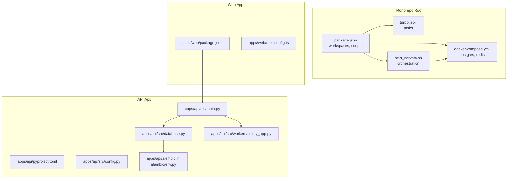
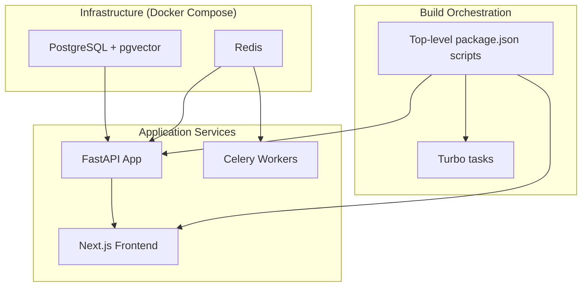
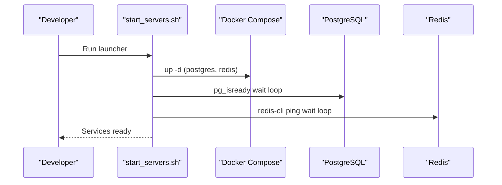
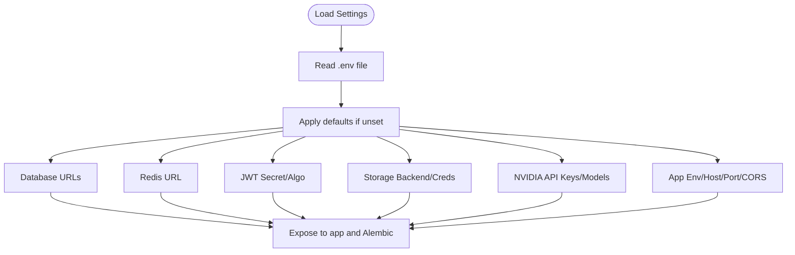
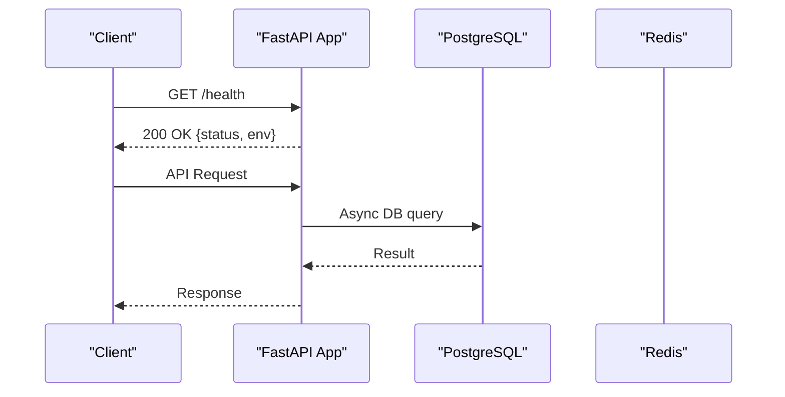
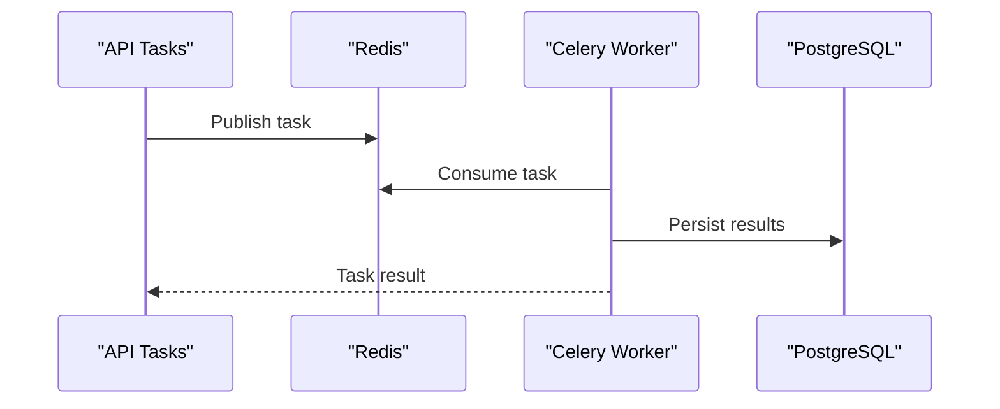
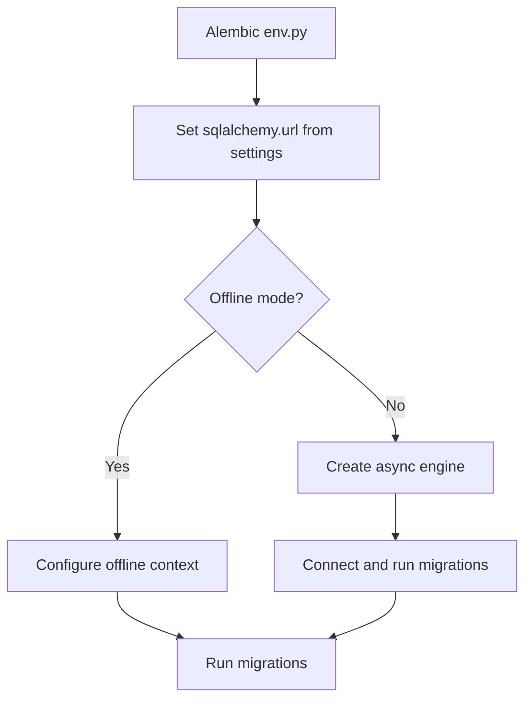
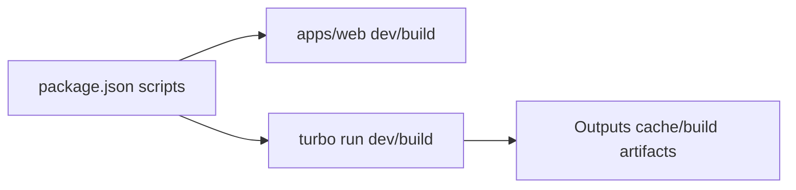
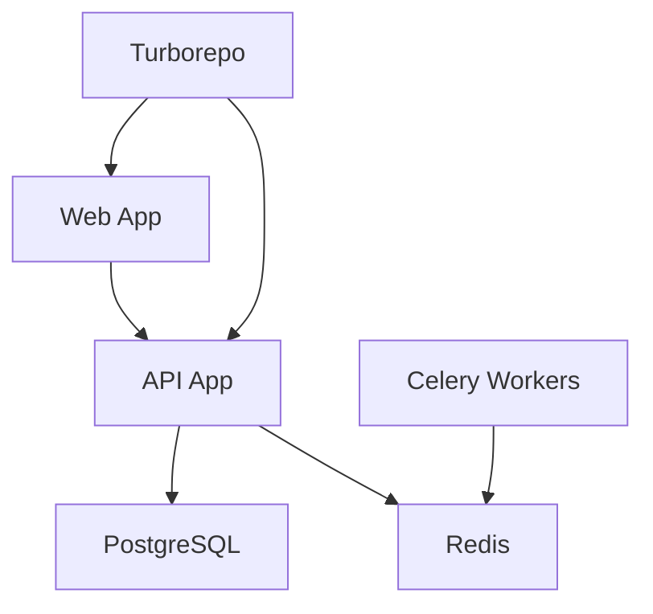

# Deployment Architecture

<cite>
**Referenced Files in This Document**
- [docker-compose.yml](file://docker-compose.yml)
- [start_servers.sh](file://start_servers.sh)
- [turbo.json](file://turbo.json)
- [package.json](file://package.json)
- [apps/api/pyproject.toml](file://apps/api/pyproject.toml)
- [apps/api/src/config.py](file://apps/api/src/config.py)
- [apps/api/src/main.py](file://apps/api/src/main.py)
- [apps/api/src/database.py](file://apps/api/src/database.py)
- [apps/api/src/workers/celery_app.py](file://apps/api/src/workers/celery_app.py)
- [apps/api/alembic.ini](file://apps/api/alembic.ini)
- [apps/api/alembic/env.py](file://apps/api/alembic/env.py)
- [apps/web/package.json](file://apps/web/package.json)
- [apps/web/next.config.ts](file://apps/web/next.config.ts)
</cite>

## Table of Contents
1. [Introduction](#introduction)
2. [Project Structure](#project-structure)
3. [Core Components](#core-components)
4. [Architecture Overview](#architecture-overview)
5. [Detailed Component Analysis](#detailed-component-analysis)
6. [Dependency Analysis](#dependency-analysis)
7. [Performance Considerations](#performance-considerations)
8. [Troubleshooting Guide](#troubleshooting-guide)
9. [Conclusion](#conclusion)
10. [Appendices](#appendices)

## Introduction
This document describes the deployment architecture for the containerized microservices stack. It covers Docker Compose orchestration, Turborepo monorepo build coordination, environment configuration and secrets handling, service discovery patterns, scaling strategies, monitoring and logging, health checks, disaster recovery, and CI/CD integration points. The system integrates a Python FastAPI application, a Next.js frontend, PostgreSQL with pgvector, Redis, and Celery workers for asynchronous AI/audio processing.

## Project Structure
The repository is a monorepo organized into:
- apps/api: FastAPI backend with SQLAlchemy async ORM, Alembic migrations, Celery workers, and AI/audio processing modules.
- apps/web: Next.js frontend application.
- packages/shared: Shared TypeScript types and utilities.
- Root configuration files: Docker Compose, Turborepo, and top-level scripts.

**Diagram sources**
- [package.json:1-19](file://package.json#L1-L19)
- [turbo.json:1-17](file://turbo.json#L1-L17)
- [docker-compose.yml:1-35](file://docker-compose.yml#L1-L35)
- [start_servers.sh:1-174](file://start_servers.sh#L1-L174)
- [apps/api/src/main.py:1-29](file://apps/api/src/main.py#L1-L29)
- [apps/api/src/database.py:1-34](file://apps/api/src/database.py#L1-L34)
- [apps/api/src/workers/celery_app.py:1-31](file://apps/api/src/workers/celery_app.py#L1-L31)
- [apps/api/alembic.ini:1-151](file://apps/api/alembic.ini#L1-L151)
- [apps/api/alembic/env.py:1-73](file://apps/api/alembic/env.py#L1-L73)
- [apps/web/package.json:1-38](file://apps/web/package.json#L1-L38)
- [apps/web/next.config.ts:1-8](file://apps/web/next.config.ts#L1-L8)

**Section sources**
- [package.json:1-19](file://package.json#L1-L19)
- [turbo.json:1-17](file://turbo.json#L1-L17)
- [docker-compose.yml:1-35](file://docker-compose.yml#L1-L35)
- [start_servers.sh:1-174](file://start_servers.sh#L1-L174)

## Core Components
- PostgreSQL with pgvector for vector embeddings and relational data.
- Redis for task queue and caching.
- FastAPI application exposing REST APIs and health checks.
- Celery workers processing audio transcription, diarization, segmentation, analysis, and scoring.
- Next.js frontend consuming the API.
- Turborepo coordinating builds and development across workspaces.

Key runtime characteristics:
- API server listens on port 8000 with CORS configured via environment.
- Redis is used as both Celery broker and result backend.
- Database connections configured with async SQLAlchemy and tunable pool sizes.
- Alembic manages schema migrations.

**Section sources**
- [apps/api/src/config.py:11-48](file://apps/api/src/config.py#L11-L48)
- [apps/api/src/main.py:26-29](file://apps/api/src/main.py#L26-L29)
- [apps/api/src/database.py:8-19](file://apps/api/src/database.py#L8-L19)
- [apps/api/src/workers/celery_app.py:5-31](file://apps/api/src/workers/celery_app.py#L5-L31)
- [apps/api/alembic.ini:86-91](file://apps/api/alembic.ini#L86-L91)

## Architecture Overview
The deployment strategy combines containerized infrastructure orchestrated by Docker Compose and a monorepo build system powered by Turborepo. The development launcher script coordinates startup of databases, migrations, API server, Celery workers, and the frontend.

**Diagram sources**
- [docker-compose.yml:1-35](file://docker-compose.yml#L1-L35)
- [apps/api/src/main.py:1-29](file://apps/api/src/main.py#L1-L29)
- [apps/api/src/workers/celery_app.py:1-31](file://apps/api/src/workers/celery_app.py#L1-L31)
- [apps/web/package.json:1-38](file://apps/web/package.json#L1-L38)
- [package.json:8-14](file://package.json#L8-L14)
- [turbo.json:4-11](file://turbo.json#L4-L11)

## Detailed Component Analysis

### Docker Compose Orchestration
- Services: postgres and redis with health checks, exposed ports, and named volumes for persistence.
- Health checks: PostgreSQL readiness probe and Redis ping check.
- Volumes: persistent storage for Postgres and Redis data.

Operational notes:
- The development launcher script ensures services are started and waits for readiness before proceeding.
- The script also handles environment setup and symlinking .env into the API app.

**Diagram sources**
- [start_servers.sh:86-129](file://start_servers.sh#L86-L129)
- [docker-compose.yml:13-30](file://docker-compose.yml#L13-L30)

**Section sources**
- [docker-compose.yml:1-35](file://docker-compose.yml#L1-L35)
- [start_servers.sh:86-129](file://start_servers.sh#L86-L129)

### Environment Configuration and Secrets Handling
- Centralized settings via Pydantic Settings loaded from .env.
- Default values embedded in the settings class for local development.
- The launcher script copies .env.example to .env if missing and symlinks .env into the API app directory.
- Production guidance documents recommended environment variables for production deployments.

Configuration highlights:
- Database URLs (async and sync) for Alembic.
- Redis URL for Celery.
- JWT secret and algorithm.
- Storage backend selection and S3-compatible credentials for production.
- NVIDIA API keys and model endpoints.
- CORS origins and app host/port.

**Diagram sources**
- [apps/api/src/config.py:4-52](file://apps/api/src/config.py#L4-L52)
- [start_servers.sh:70-84](file://start_servers.sh#L70-L84)

**Section sources**
- [apps/api/src/config.py:4-52](file://apps/api/src/config.py#L4-L52)
- [start_servers.sh:70-84](file://start_servers.sh#L70-L84)

### API Server and Health Checks
- FastAPI app registers CORS middleware and includes the v1 router.
- Health endpoint returns status and environment.

Scaling considerations:
- Horizontal scaling of API replicas behind a load balancer.
- Use of async SQLAlchemy reduces contention under concurrent requests.
- Ensure Redis availability for task queues and caching.

**Diagram sources**
- [apps/api/src/main.py:26-29](file://apps/api/src/main.py#L26-L29)
- [apps/api/src/database.py:8-19](file://apps/api/src/database.py#L8-L19)

**Section sources**
- [apps/api/src/main.py:1-29](file://apps/api/src/main.py#L1-L29)
- [apps/api/src/database.py:1-34](file://apps/api/src/database.py#L1-L34)

### Celery Workers and Task Pipeline
- Celery app configured with Redis as broker/backend.
- Includes task modules for preprocessing, transcription, diarization, segmentation, analysis, and scoring.
- Worker settings include serialization, timezone, prefetch multiplier, and time limits.

Scaling strategies:
- Increase concurrency for CPU-bound tasks.
- Scale out worker replicas horizontally.
- Use separate queues per task type for prioritization.

**Diagram sources**
- [apps/api/src/workers/celery_app.py:5-31](file://apps/api/src/workers/celery_app.py#L5-L31)

**Section sources**
- [apps/api/src/workers/celery_app.py:1-31](file://apps/api/src/workers/celery_app.py#L1-L31)

### Database Migrations with Alembic
- Alembic configuration reads the sync database URL from settings.
- Online/offline migration modes supported.
- Models imported to ensure detection during autogenerate.

**Diagram sources**
- [apps/api/alembic/env.py:22-72](file://apps/api/alembic/env.py#L22-L72)
- [apps/api/alembic.ini:86-91](file://apps/api/alembic.ini#L86-L91)

**Section sources**
- [apps/api/alembic.ini:1-151](file://apps/api/alembic.ini#L1-L151)
- [apps/api/alembic/env.py:1-73](file://apps/api/alembic/env.py#L1-L73)

### Monorepo Build System with Turborepo
- Top-level package.json defines workspaces and scripts for web app and Turborepo tasks.
- Turbo tasks specify cache behavior, dependency ordering, and output globs.
- Development and build commands coordinate across apps and packages.

**Diagram sources**
- [package.json:4-14](file://package.json#L4-L14)
- [turbo.json:4-11](file://turbo.json#L4-L11)

**Section sources**
- [package.json:1-19](file://package.json#L1-L19)
- [turbo.json:1-17](file://turbo.json#L1-L17)

### Frontend Application
- Next.js app configured with shared package dependency and standard build/dev scripts.
- Consumes API endpoints exposed by the FastAPI application.

**Section sources**
- [apps/web/package.json:1-38](file://apps/web/package.json#L1-L38)
- [apps/web/next.config.ts:1-8](file://apps/web/next.config.ts#L1-L8)

## Dependency Analysis
- API depends on PostgreSQL and Redis for persistence and task queue.
- API uses async SQLAlchemy for database operations.
- Celery workers depend on Redis for task distribution.
- Web app depends on API endpoints.
- Turborepo coordinates builds across workspaces.

**Diagram sources**
- [apps/api/src/database.py:8-19](file://apps/api/src/database.py#L8-L19)
- [apps/api/src/workers/celery_app.py:7-8](file://apps/api/src/workers/celery_app.py#L7-L8)
- [apps/web/package.json:13](file://apps/web/package.json#L13)
- [package.json:4-14](file://package.json#L4-L14)

**Section sources**
- [apps/api/src/database.py:1-34](file://apps/api/src/database.py#L1-L34)
- [apps/api/src/workers/celery_app.py:1-31](file://apps/api/src/workers/celery_app.py#L1-L31)
- [apps/web/package.json:1-38](file://apps/web/package.json#L1-L38)
- [package.json:1-19](file://package.json#L1-L19)

## Performance Considerations
- Database pooling: async SQLAlchemy pool size and overflow configured for concurrency.
- Celery worker tuning: prefetch multiplier, time limits, and concurrency adjustments.
- Frontend build caching via Turborepo to accelerate incremental builds.
- Container resource limits should be set in production deployments to prevent resource contention.

[No sources needed since this section provides general guidance]

## Troubleshooting Guide
Common operational issues and remedies:
- Database readiness: The launcher waits for PostgreSQL readiness; verify container logs and credentials.
- Redis connectivity: Confirm Redis is reachable and ping succeeds.
- Migrations: Run migrations after bringing up infrastructure; ensure DATABASE_URL_SYNC matches settings.
- API health: Use the /health endpoint to confirm service status.
- Logs: Development launcher writes logs to a dedicated directory for each process.

**Section sources**
- [start_servers.sh:105-129](file://start_servers.sh#L105-L129)
- [apps/api/alembic/env.py:32-49](file://apps/api/alembic/env.py#L32-L49)
- [apps/api/src/main.py:26-29](file://apps/api/src/main.py#L26-L29)

## Conclusion
The deployment architecture leverages Docker Compose for infrastructure provisioning, Turborepo for efficient monorepo builds, and a clear separation of concerns between the API, Celery workers, and the frontend. With health checks, migrations, and environment-driven configuration, the system supports scalable development and production deployments. Extending this foundation with managed cloud services, observability, and CI/CD pipelines will further enhance reliability and operability.

[No sources needed since this section summarizes without analyzing specific files]

## Appendices

### Scaling Strategies
- API servers: Horizontal scale behind a load balancer; ensure shared Redis and database access.
- Celery workers: Scale workers horizontally; consider task routing and queue segregation.
- Database: Use managed PostgreSQL with read replicas and backups; monitor pool usage.
- Redis: Use managed Redis or clustering; monitor memory and latency.

[No sources needed since this section provides general guidance]

### Monitoring and Logging
- API health endpoint for basic liveness/readiness checks.
- Centralized logging via the development launcher’s log directory; adopt structured logging in production.
- Add metrics endpoints and integrate with Prometheus/Grafana for deeper insights.

[No sources needed since this section provides general guidance]

### Disaster Recovery Procedures
- Back up Postgres volumes regularly; retain point-in-time recovery snapshots.
- Persist Celery task state in Redis with appropriate TTL and backup strategies.
- Maintain immutable deployment artifacts and versioned container images for rollbacks.

[No sources needed since this section provides general guidance]

### CI/CD Integration and Automated Testing
- Use Turborepo to cache and parallelize builds across workspaces.
- Integrate automated testing for API and web apps; run migrations in CI before deploying.
- Implement deployment rollback using immutable tags and blue/green or rolling updates.

[No sources needed since this section provides general guidance]