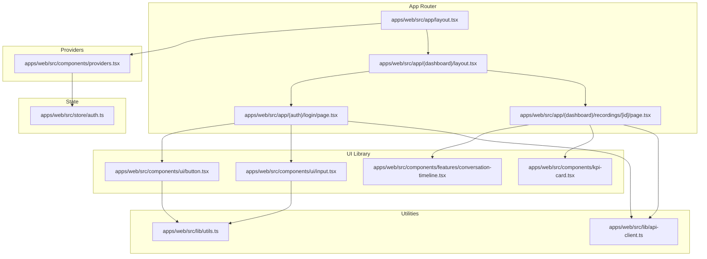
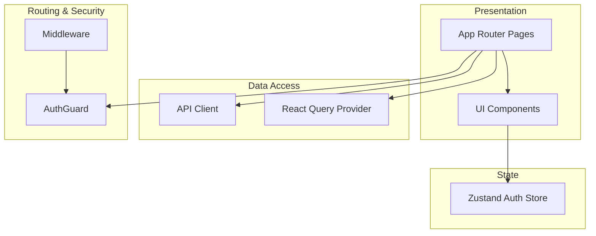
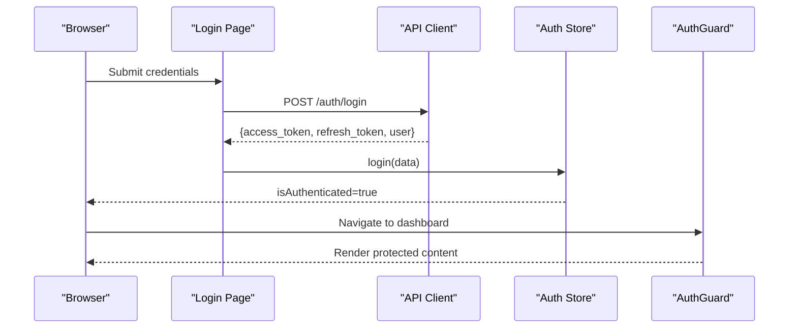
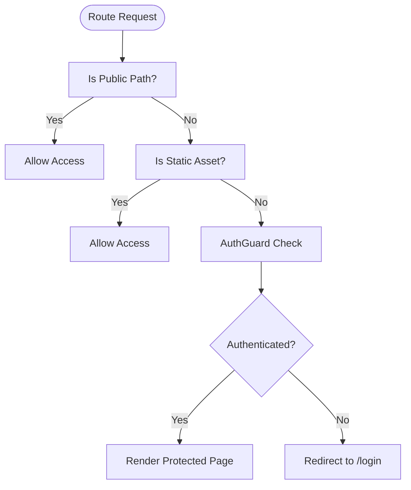
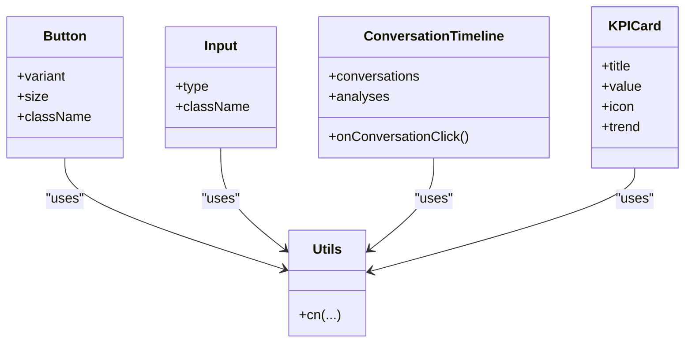
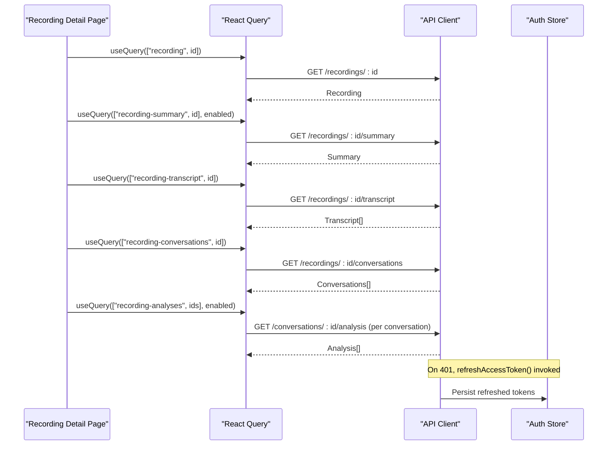
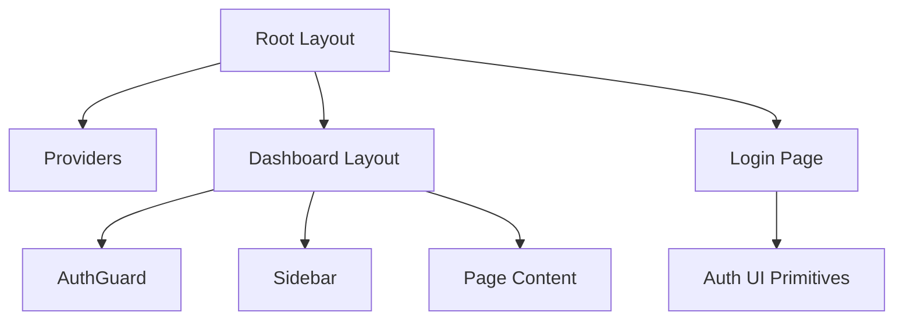
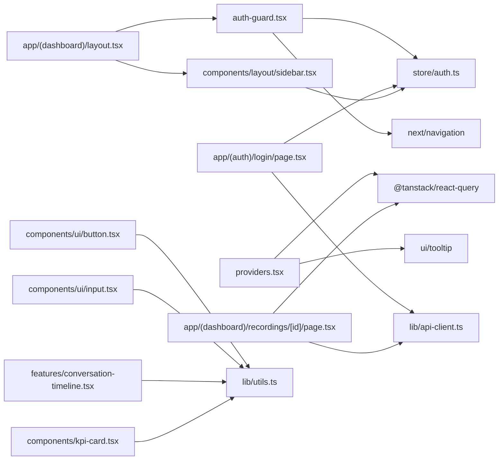

# Frontend Architecture

<cite>
**Referenced Files in This Document**
- [apps/web/src/app/layout.tsx](file://apps/web/src/app/layout.tsx)
- [apps/web/src/components/providers.tsx](file://apps/web/src/components/providers.tsx)
- [apps/web/src/store/auth.ts](file://apps/web/src/store/auth.ts)
- [apps/web/src/lib/api-client.ts](file://apps/web/src/lib/api-client.ts)
- [apps/web/src/middleware.ts](file://apps/web/src/middleware.ts)
- [apps/web/src/components/auth-guard.tsx](file://apps/web/src/components/auth-guard.tsx)
- [apps/web/src/app/(dashboard)/layout.tsx](file://apps/web/src/app/(dashboard)/layout.tsx)
- [apps/web/src/components/layout/sidebar.tsx](file://apps/web/src/components/layout/sidebar.tsx)
- [apps/web/src/app/(auth)/login/page.tsx](file://apps/web/src/app/(auth)/login/page.tsx)
- [apps/web/src/app/(dashboard)/recordings/[id]/page.tsx](file://apps/web/src/app/(dashboard)/recordings/[id]/page.tsx)
- [apps/web/src/lib/utils.ts](file://apps/web/src/lib/utils.ts)
- [apps/web/src/components/features/conversation-timeline.tsx](file://apps/web/src/components/features/conversation-timeline.tsx)
- [apps/web/src/components/kpi-card.tsx](file://apps/web/src/components/kpi-card.tsx)
- [apps/web/src/components/ui/button.tsx](file://apps/web/src/components/ui/button.tsx)
- [apps/web/src/components/ui/input.tsx](file://apps/web/src/components/ui/input.tsx)
</cite>

## Table of Contents
1. [Introduction](#introduction)
2. [Project Structure](#project-structure)
3. [Core Components](#core-components)
4. [Architecture Overview](#architecture-overview)
5. [Detailed Component Analysis](#detailed-component-analysis)
6. [Dependency Analysis](#dependency-analysis)
7. [Performance Considerations](#performance-considerations)
8. [Troubleshooting Guide](#troubleshooting-guide)
9. [Conclusion](#conclusion)
10. [Appendices](#appendices)

## Introduction
This document describes the frontend architecture of the Next.js application. It covers the app router structure, layout hierarchy, state management with Zustand, provider patterns for context sharing, authentication state handling, UI component library architecture, styling with Tailwind CSS, API client configuration, data fetching strategies using React Query, error handling patterns, routing and protected route implementation, navigation patterns, performance optimization techniques, code splitting strategies, and responsive design considerations.

## Project Structure
The frontend is organized under apps/web with:
- App Router pages under apps/web/src/app, grouped into route groups such as (auth) and (dashboard).
- Shared UI components under apps/web/src/components, including reusable UI primitives, features, layout components, and providers.
- State management under apps/web/src/store using Zustand.
- Utilities and shared helpers under apps/web/src/lib.
- Global styles and fonts configured at the root layout level.

**Diagram sources**
- [apps/web/src/app/layout.tsx:1-37](file://apps/web/src/app/layout.tsx#L1-L37)
- [apps/web/src/components/providers.tsx:1-26](file://apps/web/src/components/providers.tsx#L1-L26)
- [apps/web/src/store/auth.ts:1-49](file://apps/web/src/store/auth.ts#L1-L49)
- [apps/web/src/app/(auth)/login/page.tsx](file://apps/web/src/app/(auth)/login/page.tsx#L1-L91)
- [apps/web/src/app/(dashboard)/layout.tsx](file://apps/web/src/app/(dashboard)/layout.tsx#L1-L22)
- [apps/web/src/app/(dashboard)/recordings/[id]/page.tsx](file://apps/web/src/app/(dashboard)/recordings/[id]/page.tsx#L1-L258)
- [apps/web/src/components/ui/button.tsx:1-61](file://apps/web/src/components/ui/button.tsx#L1-L61)
- [apps/web/src/components/ui/input.tsx:1-21](file://apps/web/src/components/ui/input.tsx#L1-L21)
- [apps/web/src/components/features/conversation-timeline.tsx:1-82](file://apps/web/src/components/features/conversation-timeline.tsx#L1-L82)
- [apps/web/src/components/kpi-card.tsx:1-41](file://apps/web/src/components/kpi-card.tsx#L1-L41)
- [apps/web/src/lib/utils.ts:1-7](file://apps/web/src/lib/utils.ts#L1-L7)
- [apps/web/src/lib/api-client.ts:1-114](file://apps/web/src/lib/api-client.ts#L1-L114)

**Section sources**
- [apps/web/src/app/layout.tsx:1-37](file://apps/web/src/app/layout.tsx#L1-L37)
- [apps/web/src/components/providers.tsx:1-26](file://apps/web/src/components/providers.tsx#L1-L26)

## Core Components
- Root layout initializes fonts and global CSS, wraps children with Providers.
- Providers configures React Query with caching and retry defaults and exposes a TooltipProvider.
- Zustand auth store manages user session, authentication state, hydration from localStorage, and logout.
- API client encapsulates request logic, token handling, automatic refresh, and error normalization.
- AuthGuard enforces client-side authentication checks and redirects based on route visibility.
- Dashboard layout composes AuthGuard and Sidebar for authenticated views.
- UI primitives (Button, Input) and feature components (ConversationTimeline, KPICard) form the component library.

**Section sources**
- [apps/web/src/app/layout.tsx:1-37](file://apps/web/src/app/layout.tsx#L1-L37)
- [apps/web/src/components/providers.tsx:1-26](file://apps/web/src/components/providers.tsx#L1-L26)
- [apps/web/src/store/auth.ts:1-49](file://apps/web/src/store/auth.ts#L1-L49)
- [apps/web/src/lib/api-client.ts:1-114](file://apps/web/src/lib/api-client.ts#L1-L114)
- [apps/web/src/components/auth-guard.tsx:1-40](file://apps/web/src/components/auth-guard.tsx#L1-L40)
- [apps/web/src/app/(dashboard)/layout.tsx](file://apps/web/src/app/(dashboard)/layout.tsx#L1-L22)
- [apps/web/src/components/layout/sidebar.tsx:1-143](file://apps/web/src/components/layout/sidebar.tsx#L1-L143)
- [apps/web/src/components/ui/button.tsx:1-61](file://apps/web/src/components/ui/button.tsx#L1-L61)
- [apps/web/src/components/ui/input.tsx:1-21](file://apps/web/src/components/ui/input.tsx#L1-L21)
- [apps/web/src/components/features/conversation-timeline.tsx:1-82](file://apps/web/src/components/features/conversation-timeline.tsx#L1-L82)
- [apps/web/src/components/kpi-card.tsx:1-41](file://apps/web/src/components/kpi-card.tsx#L1-L41)

## Architecture Overview
The frontend follows a layered architecture:
- Presentation Layer: App Router pages and UI components.
- State Management: Zustand stores for authentication state.
- Data Access: Centralized API client with token refresh and normalized errors.
- Data Fetching: React Query for caching, retries, and background updates.
- Routing and Security: Route groups for logical separation, middleware for pass-through, and client-side AuthGuard for protection.

**Diagram sources**
- [apps/web/src/app/layout.tsx:1-37](file://apps/web/src/app/layout.tsx#L1-L37)
- [apps/web/src/components/providers.tsx:1-26](file://apps/web/src/components/providers.tsx#L1-L26)
- [apps/web/src/store/auth.ts:1-49](file://apps/web/src/store/auth.ts#L1-L49)
- [apps/web/src/lib/api-client.ts:1-114](file://apps/web/src/lib/api-client.ts#L1-L114)
- [apps/web/src/middleware.ts:1-32](file://apps/web/src/middleware.ts#L1-L32)
- [apps/web/src/components/auth-guard.tsx:1-40](file://apps/web/src/components/auth-guard.tsx#L1-L40)

## Detailed Component Analysis

### Authentication and Session Management
- Auth state is persisted in localStorage and hydrated on app load.
- Login writes tokens and user profile; logout clears tokens and resets state.
- AuthGuard performs client-side checks and redirects accordingly.
- Middleware allows public paths and static assets; authentication enforcement is client-side.

**Diagram sources**
- [apps/web/src/app/(auth)/login/page.tsx](file://apps/web/src/app/(auth)/login/page.tsx#L1-L91)
- [apps/web/src/lib/api-client.ts:1-114](file://apps/web/src/lib/api-client.ts#L1-L114)
- [apps/web/src/store/auth.ts:1-49](file://apps/web/src/store/auth.ts#L1-L49)
- [apps/web/src/components/auth-guard.tsx:1-40](file://apps/web/src/components/auth-guard.tsx#L1-L40)

**Section sources**
- [apps/web/src/store/auth.ts:1-49](file://apps/web/src/store/auth.ts#L1-L49)
- [apps/web/src/components/auth-guard.tsx:1-40](file://apps/web/src/components/auth-guard.tsx#L1-L40)
- [apps/web/src/middleware.ts:1-32](file://apps/web/src/middleware.ts#L1-L32)

### Protected Routes and Navigation
- Route group (dashboard) wraps pages with AuthGuard and Sidebar.
- Sidebar renders role-aware navigation items and logs out via AuthStore.
- Public route group (auth) contains login page; middleware permits access.

**Diagram sources**
- [apps/web/src/middleware.ts:1-32](file://apps/web/src/middleware.ts#L1-L32)
- [apps/web/src/components/auth-guard.tsx:1-40](file://apps/web/src/components/auth-guard.tsx#L1-L40)
- [apps/web/src/app/(dashboard)/layout.tsx](file://apps/web/src/app/(dashboard)/layout.tsx#L1-L22)
- [apps/web/src/components/layout/sidebar.tsx:1-143](file://apps/web/src/components/layout/sidebar.tsx#L1-L143)

**Section sources**
- [apps/web/src/app/(dashboard)/layout.tsx](file://apps/web/src/app/(dashboard)/layout.tsx#L1-L22)
- [apps/web/src/components/layout/sidebar.tsx:1-143](file://apps/web/src/components/layout/sidebar.tsx#L1-L143)

### UI Component Library and Styling
- UI primitives (Button, Input) use class variance authority and Tailwind utilities via a shared cn helper.
- Feature components (ConversationTimeline, KPICard) compose UI primitives and expose typed props.
- Styling leverages Tailwind CSS with theme tokens and responsive utilities.

**Diagram sources**
- [apps/web/src/components/ui/button.tsx:1-61](file://apps/web/src/components/ui/button.tsx#L1-L61)
- [apps/web/src/components/ui/input.tsx:1-21](file://apps/web/src/components/ui/input.tsx#L1-L21)
- [apps/web/src/components/features/conversation-timeline.tsx:1-82](file://apps/web/src/components/features/conversation-timeline.tsx#L1-L82)
- [apps/web/src/components/kpi-card.tsx:1-41](file://apps/web/src/components/kpi-card.tsx#L1-L41)
- [apps/web/src/lib/utils.ts:1-7](file://apps/web/src/lib/utils.ts#L1-L7)

**Section sources**
- [apps/web/src/components/ui/button.tsx:1-61](file://apps/web/src/components/ui/button.tsx#L1-L61)
- [apps/web/src/components/ui/input.tsx:1-21](file://apps/web/src/components/ui/input.tsx#L1-L21)
- [apps/web/src/components/features/conversation-timeline.tsx:1-82](file://apps/web/src/components/features/conversation-timeline.tsx#L1-L82)
- [apps/web/src/components/kpi-card.tsx:1-41](file://apps/web/src/components/kpi-card.tsx#L1-L41)
- [apps/web/src/lib/utils.ts:1-7](file://apps/web/src/lib/utils.ts#L1-L7)

### Data Fetching and API Client
- API client centralizes HTTP requests, injects Authorization header, handles 401 with token refresh, normalizes errors, and supports FormData.
- React Query is configured with a default staleTime and retry policy and is used across pages for caching and refetching.
- Recording detail page demonstrates concurrent queries, dependent queries, and conditional refetching based on resource status.

**Diagram sources**
- [apps/web/src/app/(dashboard)/recordings/[id]/page.tsx](file://apps/web/src/app/(dashboard)/recordings/[id]/page.tsx#L1-L258)
- [apps/web/src/lib/api-client.ts:1-114](file://apps/web/src/lib/api-client.ts#L1-L114)
- [apps/web/src/store/auth.ts:1-49](file://apps/web/src/store/auth.ts#L1-L49)

**Section sources**
- [apps/web/src/lib/api-client.ts:1-114](file://apps/web/src/lib/api-client.ts#L1-L114)
- [apps/web/src/app/(dashboard)/recordings/[id]/page.tsx](file://apps/web/src/app/(dashboard)/recordings/[id]/page.tsx#L1-L258)

### Layout Hierarchy and Composition
- Root layout composes Providers and global styles.
- Dashboard layout composes AuthGuard, Sidebar, and page content area.
- Pages under (auth) and (dashboard) define route boundaries and content rendering.

**Diagram sources**
- [apps/web/src/app/layout.tsx:1-37](file://apps/web/src/app/layout.tsx#L1-L37)
- [apps/web/src/components/providers.tsx:1-26](file://apps/web/src/components/providers.tsx#L1-L26)
- [apps/web/src/app/(dashboard)/layout.tsx](file://apps/web/src/app/(dashboard)/layout.tsx#L1-L22)
- [apps/web/src/components/auth-guard.tsx:1-40](file://apps/web/src/components/auth-guard.tsx#L1-L40)
- [apps/web/src/components/layout/sidebar.tsx:1-143](file://apps/web/src/components/layout/sidebar.tsx#L1-L143)
- [apps/web/src/app/(auth)/login/page.tsx](file://apps/web/src/app/(auth)/login/page.tsx#L1-L91)

**Section sources**
- [apps/web/src/app/layout.tsx:1-37](file://apps/web/src/app/layout.tsx#L1-L37)
- [apps/web/src/app/(dashboard)/layout.tsx](file://apps/web/src/app/(dashboard)/layout.tsx#L1-L22)

## Dependency Analysis
- Providers depends on React Query and TooltipProvider.
- AuthGuard depends on Zustand auth store and router hooks.
- UI components depend on shared utilities for class merging.
- Pages depend on API client and React Query for data fetching.
- Middleware is decoupled from auth logic and acts as a pass-through filter.

**Diagram sources**
- [apps/web/src/components/providers.tsx:1-26](file://apps/web/src/components/providers.tsx#L1-L26)
- [apps/web/src/components/auth-guard.tsx:1-40](file://apps/web/src/components/auth-guard.tsx#L1-L40)
- [apps/web/src/store/auth.ts:1-49](file://apps/web/src/store/auth.ts#L1-L49)
- [apps/web/src/app/(auth)/login/page.tsx](file://apps/web/src/app/(auth)/login/page.tsx#L1-L91)
- [apps/web/src/app/(dashboard)/layout.tsx](file://apps/web/src/app/(dashboard)/layout.tsx#L1-L22)
- [apps/web/src/components/layout/sidebar.tsx:1-143](file://apps/web/src/components/layout/sidebar.tsx#L1-L143)
- [apps/web/src/app/(dashboard)/recordings/[id]/page.tsx](file://apps/web/src/app/(dashboard)/recordings/[id]/page.tsx#L1-L258)
- [apps/web/src/lib/api-client.ts:1-114](file://apps/web/src/lib/api-client.ts#L1-L114)
- [apps/web/src/components/ui/button.tsx:1-61](file://apps/web/src/components/ui/button.tsx#L1-L61)
- [apps/web/src/components/ui/input.tsx:1-21](file://apps/web/src/components/ui/input.tsx#L1-L21)
- [apps/web/src/components/features/conversation-timeline.tsx:1-82](file://apps/web/src/components/features/conversation-timeline.tsx#L1-L82)
- [apps/web/src/components/kpi-card.tsx:1-41](file://apps/web/src/components/kpi-card.tsx#L1-L41)
- [apps/web/src/lib/utils.ts:1-7](file://apps/web/src/lib/utils.ts#L1-L7)

**Section sources**
- [apps/web/src/components/providers.tsx:1-26](file://apps/web/src/components/providers.tsx#L1-L26)
- [apps/web/src/components/auth-guard.tsx:1-40](file://apps/web/src/components/auth-guard.tsx#L1-L40)
- [apps/web/src/store/auth.ts:1-49](file://apps/web/src/store/auth.ts#L1-L49)
- [apps/web/src/lib/api-client.ts:1-114](file://apps/web/src/lib/api-client.ts#L1-L114)
- [apps/web/src/app/(dashboard)/recordings/[id]/page.tsx](file://apps/web/src/app/(dashboard)/recordings/[id]/page.tsx#L1-L258)

## Performance Considerations
- React Query caching and retries reduce redundant network calls and improve resilience.
- Conditional refetching based on resource status prevents unnecessary polling.
- Token refresh on 401 avoids repeated failures and maintains session continuity.
- Role-filtered navigation reduces DOM and re-render overhead in the sidebar.
- Tailwind CSS utility classes enable efficient styling without heavy CSS-in-JS overhead.

[No sources needed since this section provides general guidance]

## Troubleshooting Guide
- Authentication errors: Verify token presence and validity; ensure middleware does not block static assets; confirm AuthGuard hydration runs before navigation.
- API errors: Inspect normalized ApiError instances and handle user-facing messages; check token refresh flow and localStorage state.
- Data fetching: Confirm query keys are unique and enabled conditions align with resource availability; monitor refetch intervals and staleTime settings.
- UI rendering: Validate class merging via cn helper and ensure Tailwind utilities are applied consistently.

**Section sources**
- [apps/web/src/components/auth-guard.tsx:1-40](file://apps/web/src/components/auth-guard.tsx#L1-L40)
- [apps/web/src/lib/api-client.ts:1-114](file://apps/web/src/lib/api-client.ts#L1-L114)
- [apps/web/src/app/(dashboard)/recordings/[id]/page.tsx](file://apps/web/src/app/(dashboard)/recordings/[id]/page.tsx#L1-L258)
- [apps/web/src/lib/utils.ts:1-7](file://apps/web/src/lib/utils.ts#L1-L7)

## Conclusion
The frontend employs a clean separation of concerns with a robust provider pattern, centralized state management via Zustand, and a unified API client. React Query enhances data reliability and performance, while a well-defined AuthGuard and middleware ensure secure navigation. The UI component library promotes consistency and maintainability through shared primitives and utilities. Together, these patterns support scalability, responsiveness, and a strong developer experience.

[No sources needed since this section summarizes without analyzing specific files]

## Appendices
- Responsive design: Leverage Tailwind’s responsive modifiers and component-level spacing to adapt layouts across screen sizes.
- Code splitting: Next.js dynamic imports and route grouping naturally split bundles; keep feature components modular to benefit from automatic code splitting.
- Styling consistency: Prefer shared utilities and component variants to minimize style drift and simplify maintenance.

[No sources needed since this section provides general guidance]