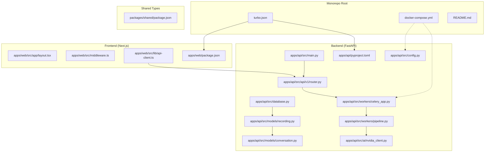
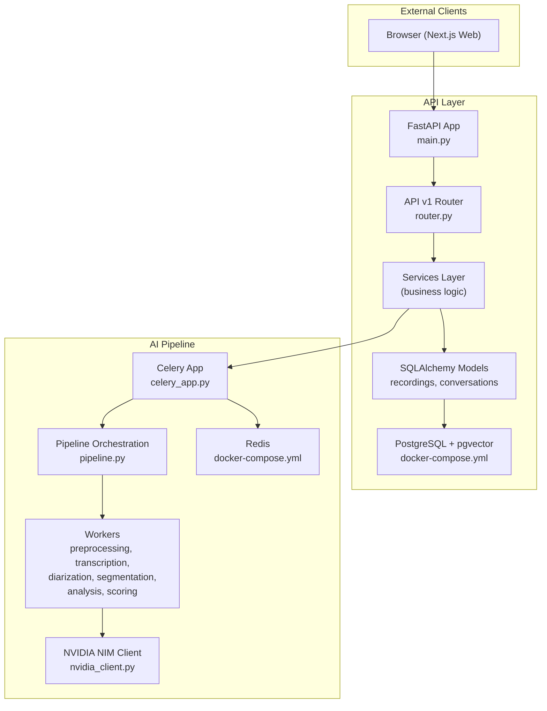
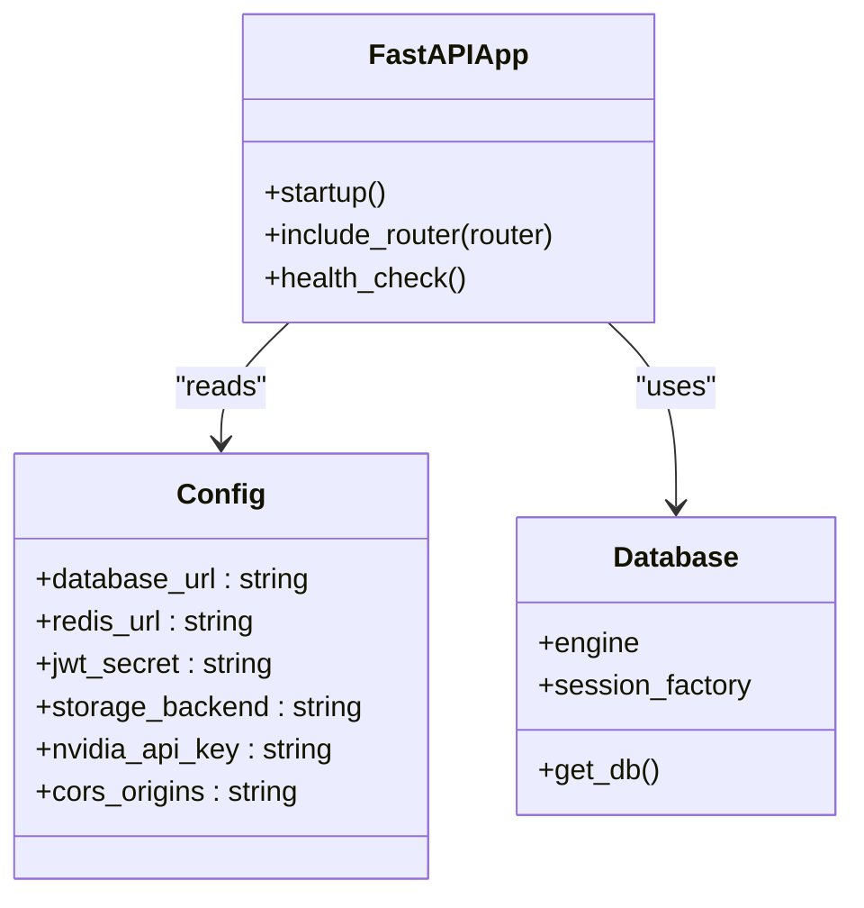
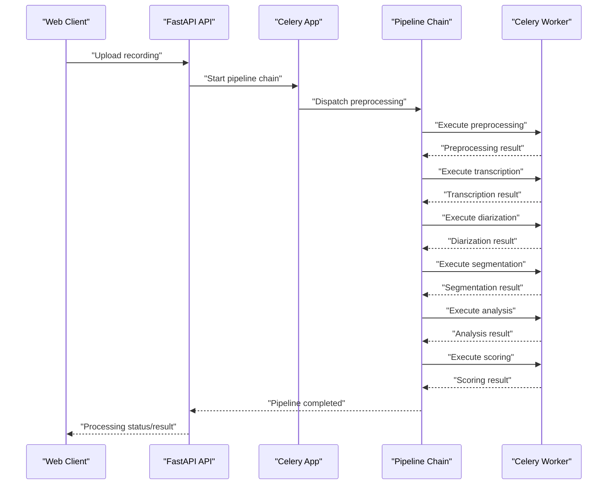
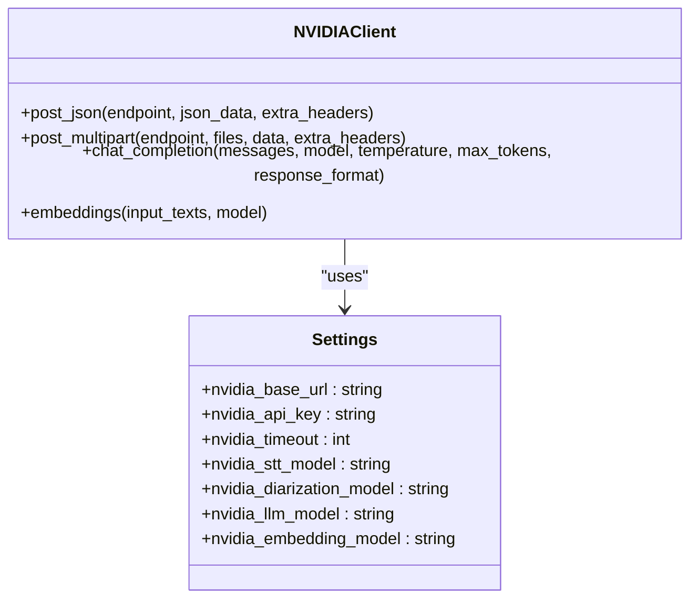
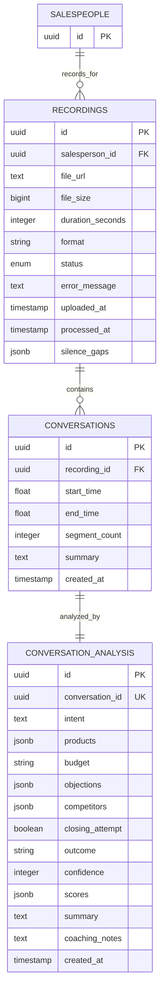
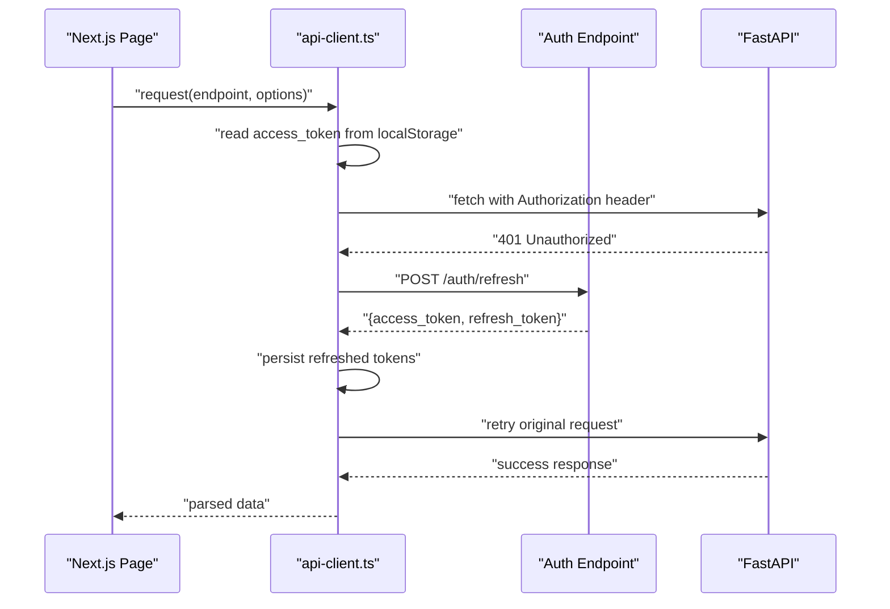
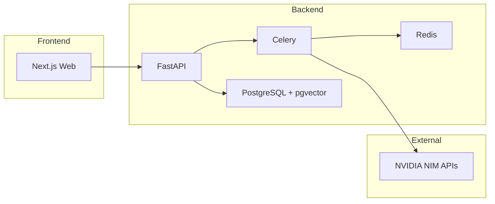

# System Architecture

<cite>
**Referenced Files in This Document**
- [README.md](file://README.md)
- [docker-compose.yml](file://docker-compose.yml)
- [turbo.json](file://turbo.json)
- [apps/api/pyproject.toml](file://apps/api/pyproject.toml)
- [apps/web/package.json](file://apps/web/package.json)
- [packages/shared/package.json](file://packages/shared/package.json)
- [apps/api/src/main.py](file://apps/api/src/main.py)
- [apps/api/src/config.py](file://apps/api/src/config.py)
- [apps/api/src/database.py](file://apps/api/src/database.py)
- [apps/api/src/workers/celery_app.py](file://apps/api/src/workers/celery_app.py)
- [apps/api/src/workers/pipeline.py](file://apps/api/src/workers/pipeline.py)
- [apps/api/src/api/v1/router.py](file://apps/api/src/api/v1/router.py)
- [apps/api/src/ai/nvidia_client.py](file://apps/api/src/ai/nvidia_client.py)
- [apps/api/src/models/recording.py](file://apps/api/src/models/recording.py)
- [apps/api/src/models/conversation.py](file://apps/api/src/models/conversation.py)
- [apps/web/src/lib/api-client.ts](file://apps/web/src/lib/api-client.ts)
- [apps/web/src/middleware.ts](file://apps/web/src/middleware.ts)
- [apps/web/src/app/layout.tsx](file://apps/web/src/app/layout.tsx)
</cite>

## Table of Contents
1. [Introduction](#introduction)
2. [Project Structure](#project-structure)
3. [Core Components](#core-components)
4. [Architecture Overview](#architecture-overview)
5. [Detailed Component Analysis](#detailed-component-analysis)
6. [Dependency Analysis](#dependency-analysis)
7. [Performance Considerations](#performance-considerations)
8. [Troubleshooting Guide](#troubleshooting-guide)
9. [Conclusion](#conclusion)
10. [Appendices](#appendices)

## Introduction
This document describes the system architecture of the Xsamaa AI Pipeline, a full-stack platform for audio ingestion, asynchronous AI-driven processing, and analytics delivery. The system follows a microservices-style monorepo design using Turborepo with two primary applications:
- FastAPI backend service handling API requests, business logic, and orchestration of the AI processing pipeline.
- Next.js frontend application providing a dashboard for browsing conversations, insights, and managing users and organizations.

The AI processing pipeline is orchestrated asynchronously using Celery with Redis as the broker/backend, enabling scalable, fault-tolerant processing of audio recordings through multiple stages powered by NVIDIA NIM APIs.

## Project Structure
The repository is organized as a Turborepo monorepo with three main areas:
- apps/api: FastAPI backend with route handlers, services, models, AI clients, and Celery workers.
- apps/web: Next.js frontend with pages, components, state management, and API client.
- packages/shared: Shared TypeScript types consumed by both frontend and backend.
- Root configuration files define Docker Compose infrastructure, Turborepo tasks, and technology stacks.

**Diagram sources**
- [turbo.json:1-17](file://turbo.json#L1-L17)
- [docker-compose.yml:1-35](file://docker-compose.yml#L1-L35)
- [apps/api/src/main.py:1-29](file://apps/api/src/main.py#L1-L29)
- [apps/api/src/api/v1/router.py:1-20](file://apps/api/src/api/v1/router.py#L1-L20)
- [apps/api/src/config.py:1-52](file://apps/api/src/config.py#L1-L52)
- [apps/api/src/database.py:1-34](file://apps/api/src/database.py#L1-L34)
- [apps/api/src/workers/celery_app.py:1-31](file://apps/api/src/workers/celery_app.py#L1-L31)
- [apps/api/src/workers/pipeline.py:1-35](file://apps/api/src/workers/pipeline.py#L1-L35)
- [apps/api/src/ai/nvidia_client.py:1-274](file://apps/api/src/ai/nvidia_client.py#L1-L274)
- [apps/api/src/models/recording.py:1-57](file://apps/api/src/models/recording.py#L1-L57)
- [apps/api/src/models/conversation.py:1-61](file://apps/api/src/models/conversation.py#L1-L61)
- [apps/web/src/app/layout.tsx:1-37](file://apps/web/src/app/layout.tsx#L1-L37)
- [apps/web/src/middleware.ts:1-32](file://apps/web/src/middleware.ts#L1-L32)
- [apps/web/src/lib/api-client.ts:1-114](file://apps/web/src/lib/api-client.ts#L1-L114)
- [apps/api/pyproject.toml:1-43](file://apps/api/pyproject.toml#L1-L43)
- [apps/web/package.json:1-38](file://apps/web/package.json#L1-L38)
- [packages/shared/package.json:1-15](file://packages/shared/package.json#L1-L15)

**Section sources**
- [README.md:176-203](file://README.md#L176-L203)
- [turbo.json:1-17](file://turbo.json#L1-L17)
- [apps/api/pyproject.toml:1-43](file://apps/api/pyproject.toml#L1-L43)
- [apps/web/package.json:1-38](file://apps/web/package.json#L1-L38)
- [packages/shared/package.json:1-15](file://packages/shared/package.json#L1-L15)

## Core Components
- FastAPI Backend
  - Entry point initializes the ASGI app, registers CORS, and mounts the API v1 router.
  - Configuration loads environment variables for database, Redis, JWT, storage, NVIDIA NIM, and CORS.
  - Database layer uses SQLAlchemy async engine and session factory.
  - AI module encapsulates NVIDIA NIM client with robust retry and error handling.
  - Workers module defines Celery app and pipeline orchestration.

- Next.js Frontend
  - App layout and middleware provide routing and basic auth guard behavior.
  - API client abstracts HTTP requests, token refresh, and error handling.
  - Pages under App Router implement dashboards for brands, stores, salespeople, and recordings.

- Shared Types
  - TypeScript types exported for cross-package usage.

**Section sources**
- [apps/api/src/main.py:1-29](file://apps/api/src/main.py#L1-L29)
- [apps/api/src/config.py:1-52](file://apps/api/src/config.py#L1-L52)
- [apps/api/src/database.py:1-34](file://apps/api/src/database.py#L1-L34)
- [apps/api/src/ai/nvidia_client.py:1-274](file://apps/api/src/ai/nvidia_client.py#L1-L274)
- [apps/api/src/workers/celery_app.py:1-31](file://apps/api/src/workers/celery_app.py#L1-L31)
- [apps/api/src/workers/pipeline.py:1-35](file://apps/api/src/workers/pipeline.py#L1-L35)
- [apps/web/src/lib/api-client.ts:1-114](file://apps/web/src/lib/api-client.ts#L1-L114)
- [apps/web/src/middleware.ts:1-32](file://apps/web/src/middleware.ts#L1-L32)
- [apps/web/src/app/layout.tsx:1-37](file://apps/web/src/app/layout.tsx#L1-L37)
- [packages/shared/package.json:1-15](file://packages/shared/package.json#L1-L15)

## Architecture Overview
The system employs a microservices-style monorepo architecture:
- API Gateway: FastAPI serves as the API gateway and orchestrator for business logic and pipeline triggers.
- Business Services: Route handlers, services, and models encapsulate domain logic and persistence.
- AI Workers: Celery workers execute the multi-stage audio processing pipeline asynchronously.
- Frontend: Next.js SPA communicates with the backend via typed API endpoints and shared types.

**Diagram sources**
- [apps/api/src/main.py:1-29](file://apps/api/src/main.py#L1-L29)
- [apps/api/src/api/v1/router.py:1-20](file://apps/api/src/api/v1/router.py#L1-L20)
- [apps/api/src/database.py:1-34](file://apps/api/src/database.py#L1-L34)
- [apps/api/src/models/recording.py:1-57](file://apps/api/src/models/recording.py#L1-L57)
- [apps/api/src/models/conversation.py:1-61](file://apps/api/src/models/conversation.py#L1-L61)
- [apps/api/src/workers/celery_app.py:1-31](file://apps/api/src/workers/celery_app.py#L1-L31)
- [apps/api/src/workers/pipeline.py:1-35](file://apps/api/src/workers/pipeline.py#L1-L35)
- [apps/api/src/ai/nvidia_client.py:1-274](file://apps/api/src/ai/nvidia_client.py#L1-L274)
- [docker-compose.yml:1-35](file://docker-compose.yml#L1-L35)

## Detailed Component Analysis

### FastAPI Backend
- Application initialization sets up CORS, mounts the API router, and exposes a health endpoint.
- Configuration centralizes environment variables for database connectivity, Redis, JWT, storage, NVIDIA credentials, and CORS origins.
- Database configuration uses an async engine with pooling and a scoped async session factory.
- Router aggregates multiple domain-specific routers (auth, brands, stores, salespeople, recordings, conversations, search).

**Diagram sources**
- [apps/api/src/main.py:1-29](file://apps/api/src/main.py#L1-L29)
- [apps/api/src/config.py:1-52](file://apps/api/src/config.py#L1-L52)
- [apps/api/src/database.py:1-34](file://apps/api/src/database.py#L1-L34)

**Section sources**
- [apps/api/src/main.py:1-29](file://apps/api/src/main.py#L1-L29)
- [apps/api/src/config.py:1-52](file://apps/api/src/config.py#L1-L52)
- [apps/api/src/database.py:1-34](file://apps/api/src/database.py#L1-L34)
- [apps/api/src/api/v1/router.py:1-20](file://apps/api/src/api/v1/router.py#L1-L20)

### AI Pipeline Orchestration
- Celery app is configured with Redis as both broker and result backend, including serialization and task policies.
- Pipeline orchestration composes six stages: preprocessing, transcription, diarization, segmentation, analysis, and scoring.
- Stages are chained to execute sequentially; each stage is implemented as a Celery task.

**Diagram sources**
- [apps/api/src/workers/celery_app.py:1-31](file://apps/api/src/workers/celery_app.py#L1-L31)
- [apps/api/src/workers/pipeline.py:1-35](file://apps/api/src/workers/pipeline.py#L1-L35)

**Section sources**
- [apps/api/src/workers/celery_app.py:1-31](file://apps/api/src/workers/celery_app.py#L1-L31)
- [apps/api/src/workers/pipeline.py:1-35](file://apps/api/src/workers/pipeline.py#L1-L35)

### NVIDIA NIM Integration
- The NVIDIA client encapsulates HTTP interactions with retry/backoff, error classification, and support for JSON and multipart payloads.
- Chat completions and embeddings endpoints are supported with configurable models and timeouts.
- Client is configured via settings and used by pipeline workers to call STT, diarization, and LLM capabilities.

**Diagram sources**
- [apps/api/src/ai/nvidia_client.py:1-274](file://apps/api/src/ai/nvidia_client.py#L1-L274)
- [apps/api/src/config.py:28-35](file://apps/api/src/config.py#L28-L35)

**Section sources**
- [apps/api/src/ai/nvidia_client.py:1-274](file://apps/api/src/ai/nvidia_client.py#L1-L274)
- [apps/api/src/config.py:28-35](file://apps/api/src/config.py#L28-L35)

### Data Models and Persistence
- Recording tracks audio metadata, status, and relationships to salespeople and related transcripts/conversations.
- Conversation captures segmented segments with timing and analysis linkage.
- Status lifecycle covers upload through completion or failure, enabling progress tracking.

**Diagram sources**
- [apps/api/src/models/recording.py:1-57](file://apps/api/src/models/recording.py#L1-L57)
- [apps/api/src/models/conversation.py:1-61](file://apps/api/src/models/conversation.py#L1-L61)

**Section sources**
- [apps/api/src/models/recording.py:1-57](file://apps/api/src/models/recording.py#L1-L57)
- [apps/api/src/models/conversation.py:1-61](file://apps/api/src/models/conversation.py#L1-L61)

### Frontend API Client and Authentication Flow
- The Next.js API client wraps fetch with bearer token injection, automatic token refresh, and standardized error handling.
- Middleware allows public paths and static assets while delegating auth checks to client-side guards.
- The layout composes providers for theme and state management.

**Diagram sources**
- [apps/web/src/lib/api-client.ts:1-114](file://apps/web/src/lib/api-client.ts#L1-L114)
- [apps/api/src/api/v1/router.py:1-20](file://apps/api/src/api/v1/router.py#L1-L20)

**Section sources**
- [apps/web/src/lib/api-client.ts:1-114](file://apps/web/src/lib/api-client.ts#L1-L114)
- [apps/web/src/middleware.ts:1-32](file://apps/web/src/middleware.ts#L1-L32)
- [apps/web/src/app/layout.tsx:1-37](file://apps/web/src/app/layout.tsx#L1-L37)

## Dependency Analysis
- Technology Stack Integration
  - Backend: FastAPI, SQLAlchemy (async), Alembic, Celery (with Redis), PostgreSQL + pgvector, pydantic-settings, httpx, pydub.
  - Frontend: Next.js 16, React 19, TanStack Query, Zustand, Tailwind CSS 4, shadcn/ui.
  - Monorepo: Turborepo with npm workspaces and shared types.

- Inter-Service Communication
  - Frontend communicates with backend via REST endpoints exposed by FastAPI.
  - Backend triggers AI processing via Celery tasks published to Redis.
  - AI workers call NVIDIA NIM APIs with retry logic and structured error handling.

- Container Orchestration
  - Docker Compose provisions PostgreSQL (pgvector) and Redis with health checks and persistent volumes.

**Diagram sources**
- [apps/api/src/main.py:1-29](file://apps/api/src/main.py#L1-L29)
- [apps/api/src/workers/celery_app.py:1-31](file://apps/api/src/workers/celery_app.py#L1-L31)
- [docker-compose.yml:1-35](file://docker-compose.yml#L1-L35)
- [apps/api/src/ai/nvidia_client.py:1-274](file://apps/api/src/ai/nvidia_client.py#L1-L274)

**Section sources**
- [apps/api/pyproject.toml:1-43](file://apps/api/pyproject.toml#L1-L43)
- [apps/web/package.json:1-38](file://apps/web/package.json#L1-L38)
- [packages/shared/package.json:1-15](file://packages/shared/package.json#L1-L15)
- [docker-compose.yml:1-35](file://docker-compose.yml#L1-L35)

## Performance Considerations
- Asynchronous Processing
  - Celery workers operate independently of the API, enabling long-running AI tasks without blocking request threads.
  - Task serialization is JSON-based; ensure payloads remain compact to minimize Redis overhead.

- Database Scaling
  - Async SQLAlchemy sessions reduce contention; tune pool size and overflow according to concurrency needs.
  - Use indexes on foreign keys and frequently queried fields (e.g., recording_id on conversations).

- AI API Reliability
  - The NVIDIA client implements exponential backoff and retry for transient errors, reducing pipeline failures.
  - Timeouts are configured per request; monitor latency and adjust limits for production.

- Frontend Responsiveness
  - Client-side caching and optimistic updates can improve perceived performance; leverage TanStack Query for efficient data fetching.

[No sources needed since this section provides general guidance]

## Troubleshooting Guide
- Health Checks
  - Verify infrastructure readiness using Docker Compose health checks for PostgreSQL and Redis.

- Authentication Issues
  - If the frontend receives 401, the API client attempts token refresh; confirm refresh endpoint availability and token persistence.

- Pipeline Failures
  - Inspect Celery logs and Redis for task visibility; ensure task soft/hard time limits accommodate long-running AI operations.

- Database Connectivity
  - Confirm DATABASE_URL matches the running PostgreSQL instance and credentials.

**Section sources**
- [docker-compose.yml:13-17](file://docker-compose.yml#L13-L17)
- [docker-compose.yml:26-30](file://docker-compose.yml#L26-L30)
- [apps/web/src/lib/api-client.ts:18-75](file://apps/web/src/lib/api-client.ts#L18-L75)
- [apps/api/src/config.py:11-13](file://apps/api/src/config.py#L11-L13)
- [apps/api/src/workers/celery_app.py:19-30](file://apps/api/src/workers/celery_app.py#L19-L30)

## Conclusion
The Xsamaa AI Pipeline integrates a FastAPI backend, a Next.js frontend, and a Celery-based asynchronous processing pipeline to deliver a scalable, modular solution for audio analytics. The Turborepo structure and shared types streamline development across teams, while Docker Compose and Celery enable reliable, distributed processing. The architecture supports incremental feature delivery, with the AI pipeline stages designed for extensibility and resilience.

[No sources needed since this section summarizes without analyzing specific files]

## Appendices

### Deployment Topology
- Single-host development: Docker Compose runs PostgreSQL and Redis; FastAPI and Celery workers run locally; Next.js runs in development mode.
- Production considerations include load balancing for FastAPI, scaling Celery workers, and externalizing Redis and PostgreSQL.

**Section sources**
- [README.md:108-163](file://README.md#L108-L163)
- [docker-compose.yml:1-35](file://docker-compose.yml#L1-L35)

### Scalability Considerations
- Horizontal scaling: Increase Celery worker replicas to process more recordings concurrently.
- Database: Use managed PostgreSQL with read replicas and connection pooling tuned to workload.
- CDN and storage: Offload media to S3-compatible storage for global access and reduced latency.

**Section sources**
- [README.md:234-247](file://README.md#L234-L247)
- [apps/api/src/config.py:24-26](file://apps/api/src/config.py#L24-L26)