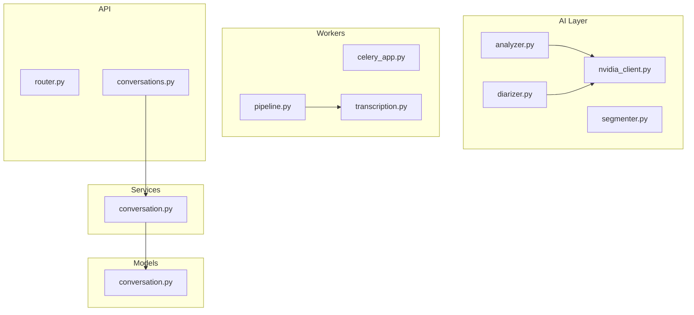
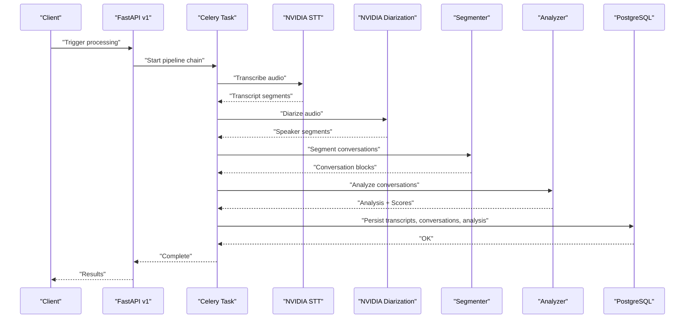
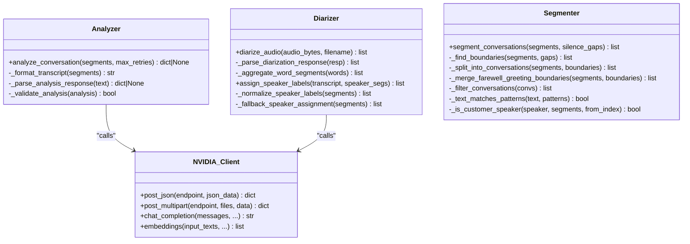
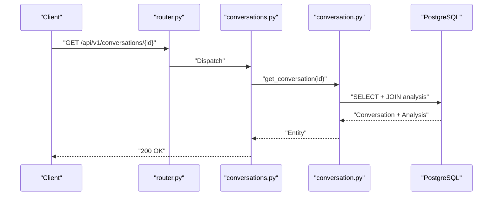
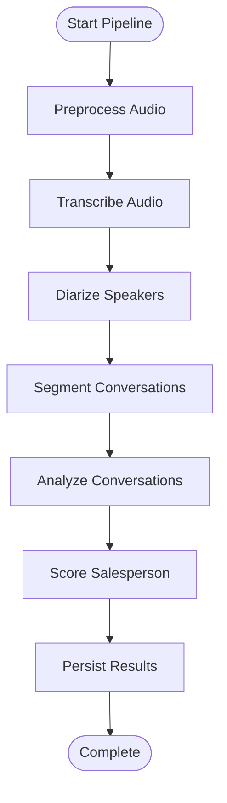
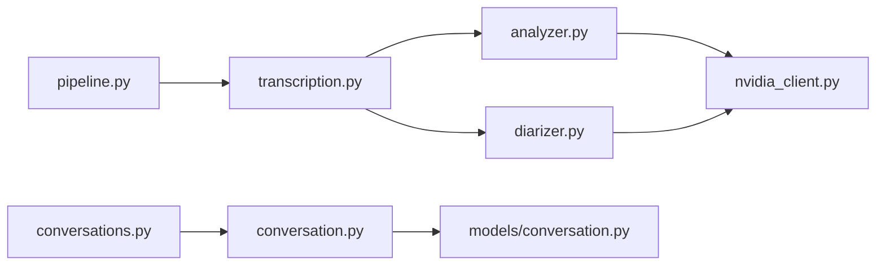

# Testing Strategy

<cite>
**Referenced Files in This Document**
- [apps/api/pyproject.toml](file://apps/api/pyproject.toml)
- [apps/api/tests/test_analyzer.py](file://apps/api/tests/test_analyzer.py)
- [apps/api/tests/test_diarizer.py](file://apps/api/tests/test_diarizer.py)
- [apps/api/tests/test_segmenter.py](file://apps/api/tests/test_segmenter.py)
- [apps/api/src/ai/analyzer.py](file://apps/api/src/ai/analyzer.py)
- [apps/api/src/ai/diarizer.py](file://apps/api/src/ai/diarizer.py)
- [apps/api/src/ai/segmenter.py](file://apps/api/src/ai/segmenter.py)
- [apps/api/src/ai/nvidia_client.py](file://apps/api/src/ai/nvidia_client.py)
- [apps/api/src/workers/pipeline.py](file://apps/api/src/workers/pipeline.py)
- [apps/api/src/workers/celery_app.py](file://apps/api/src/workers/celery_app.py)
- [apps/api/src/workers/transcription.py](file://apps/api/src/workers/transcription.py)
- [apps/api/src/api/v1/router.py](file://apps/api/src/api/v1/router.py)
- [apps/api/src/api/v1/conversations.py](file://apps/api/src/api/v1/conversations.py)
- [apps/api/src/services/conversation.py](file://apps/api/src/services/conversation.py)
- [apps/api/src/models/conversation.py](file://apps/api/src/models/conversation.py)
</cite>

## Table of Contents
1. [Introduction](#introduction)
2. [Project Structure](#project-structure)
3. [Core Components](#core-components)
4. [Architecture Overview](#architecture-overview)
5. [Detailed Component Analysis](#detailed-component-analysis)
6. [Dependency Analysis](#dependency-analysis)
7. [Performance Considerations](#performance-considerations)
8. [Troubleshooting Guide](#troubleshooting-guide)
9. [Conclusion](#conclusion)
10. [Appendices](#appendices)

## Introduction
This document defines a comprehensive testing strategy for the Xsamaa AI Pipeline. It covers:
- Unit tests for AI components (analyzer, diarizer, segmenter)
- Integration tests for API endpoints and database operations
- End-to-end tests for complete user workflows
- Framework setup with pytest, mocking strategies for external AI services, and test data management
- Patterns for asynchronous Celery tasks, database transactions, and error conditions
- Reliability, performance benchmarking, and regression testing guidelines
- Continuous integration testing, coverage requirements, and quality gates
- Examples of test case implementation and debugging techniques for AI processing failures

## Project Structure
The testing surface spans:
- AI logic under src/ai (analyzer, diarizer, segmenter, nvidia_client)
- Workers under src/workers orchestrating Celery tasks
- FastAPI v1 endpoints under src/api/v1
- SQLAlchemy models and services under src/models and src/services
- Unit tests under apps/api/tests

**Diagram sources**
- [apps/api/src/ai/analyzer.py:1-198](file://apps/api/src/ai/analyzer.py#L1-L198)
- [apps/api/src/ai/diarizer.py:1-206](file://apps/api/src/ai/diarizer.py#L1-L206)
- [apps/api/src/ai/segmenter.py:1-366](file://apps/api/src/ai/segmenter.py#L1-L366)
- [apps/api/src/ai/nvidia_client.py:1-274](file://apps/api/src/ai/nvidia_client.py#L1-L274)
- [apps/api/src/workers/celery_app.py:1-31](file://apps/api/src/workers/celery_app.py#L1-L31)
- [apps/api/src/workers/pipeline.py:1-35](file://apps/api/src/workers/pipeline.py#L1-L35)
- [apps/api/src/workers/transcription.py:1-146](file://apps/api/src/workers/transcription.py#L1-L146)
- [apps/api/src/api/v1/router.py:1-20](file://apps/api/src/api/v1/router.py#L1-L20)
- [apps/api/src/api/v1/conversations.py:1-35](file://apps/api/src/api/v1/conversations.py#L1-L35)
- [apps/api/src/services/conversation.py:1-26](file://apps/api/src/services/conversation.py#L1-L26)
- [apps/api/src/models/conversation.py:1-61](file://apps/api/src/models/conversation.py#L1-L61)

**Section sources**
- [apps/api/pyproject.toml:1-43](file://apps/api/pyproject.toml#L1-L43)
- [apps/api/src/api/v1/router.py:1-20](file://apps/api/src/api/v1/router.py#L1-L20)

## Core Components
- Analyzer: Parses and validates structured analysis from an LLM, with robust JSON extraction and validation.
- Diarizer: Integrates with NVIDIA NeMo via NIM API; falls back when unavailable.
- Segmenter: Detects conversation boundaries using silence gaps, greetings, farewells, and direct questions; filters short or trivial conversations.
- NVIDIA Client: Centralized HTTP client with retry/backoff, error classification, and OpenAI-compatible chat/embeddings.
- Workers: Celery tasks for preprocessing, transcription, diarization, segmentation, analysis, and scoring; orchestrated in a pipeline.
- API and Services: FastAPI endpoints for retrieving conversations and analyses; SQLAlchemy models and services for persistence and queries.

**Section sources**
- [apps/api/src/ai/analyzer.py:1-198](file://apps/api/src/ai/analyzer.py#L1-L198)
- [apps/api/src/ai/diarizer.py:1-206](file://apps/api/src/ai/diarizer.py#L1-L206)
- [apps/api/src/ai/segmenter.py:1-366](file://apps/api/src/ai/segmenter.py#L1-L366)
- [apps/api/src/ai/nvidia_client.py:1-274](file://apps/api/src/ai/nvidia_client.py#L1-L274)
- [apps/api/src/workers/pipeline.py:1-35](file://apps/api/src/workers/pipeline.py#L1-L35)
- [apps/api/src/workers/transcription.py:1-146](file://apps/api/src/workers/transcription.py#L1-L146)
- [apps/api/src/api/v1/conversations.py:1-35](file://apps/api/src/api/v1/conversations.py#L1-L35)
- [apps/api/src/services/conversation.py:1-26](file://apps/api/src/services/conversation.py#L1-L26)
- [apps/api/src/models/conversation.py:1-61](file://apps/api/src/models/conversation.py#L1-L61)

## Architecture Overview
The pipeline is asynchronous and multi-stage. Celery tasks are chained to process audio through preprocessing, transcription, diarization, segmentation, analysis, and scoring. API endpoints expose conversation and analysis data.

**Diagram sources**
- [apps/api/src/workers/pipeline.py:12-35](file://apps/api/src/workers/pipeline.py#L12-L35)
- [apps/api/src/workers/transcription.py:53-102](file://apps/api/src/workers/transcription.py#L53-L102)
- [apps/api/src/ai/diarizer.py:12-46](file://apps/api/src/ai/diarizer.py#L12-L46)
- [apps/api/src/ai/segmenter.py:92-143](file://apps/api/src/ai/segmenter.py#L92-L143)
- [apps/api/src/ai/analyzer.py:47-116](file://apps/api/src/ai/analyzer.py#L47-L116)
- [apps/api/src/models/conversation.py:11-61](file://apps/api/src/models/conversation.py#L11-L61)

## Detailed Component Analysis

### Unit Testing Strategy for AI Components
- Analyzer
  - Test transcript formatting, response parsing (JSON, fenced code block, embedded JSON), validation defaults, clamping, and type normalization.
  - Simulate malformed LLM responses and validation failures with retries.
- Diarizer
  - Test fallback assignment on empty diarization, speaker label normalization, and aggregation of word-level segments.
- Segmenter
  - Exhaustive boundary detection across silence gaps, greetings, farewells, direct questions, speaker changes, and preprocessing silence gaps.
  - Multilingual patterns (Arabic, Hindi, Urdu, transliterations) and Gulf dialect edge cases.
  - Filtering short or single-segment conversations.

**Diagram sources**
- [apps/api/src/ai/analyzer.py:47-116](file://apps/api/src/ai/analyzer.py#L47-L116)
- [apps/api/src/ai/diarizer.py:12-46](file://apps/api/src/ai/diarizer.py#L12-L46)
- [apps/api/src/ai/segmenter.py:92-143](file://apps/api/src/ai/segmenter.py#L92-L143)
- [apps/api/src/ai/nvidia_client.py:32-274](file://apps/api/src/ai/nvidia_client.py#L32-L274)

**Section sources**
- [apps/api/tests/test_analyzer.py:1-167](file://apps/api/tests/test_analyzer.py#L1-L167)
- [apps/api/tests/test_diarizer.py:1-100](file://apps/api/tests/test_diarizer.py#L1-L100)
- [apps/api/tests/test_segmenter.py:1-633](file://apps/api/tests/test_segmenter.py#L1-L633)
- [apps/api/src/ai/analyzer.py:1-198](file://apps/api/src/ai/analyzer.py#L1-L198)
- [apps/api/src/ai/diarizer.py:1-206](file://apps/api/src/ai/diarizer.py#L1-L206)
- [apps/api/src/ai/segmenter.py:1-366](file://apps/api/src/ai/segmenter.py#L1-L366)
- [apps/api/src/ai/nvidia_client.py:1-274](file://apps/api/src/ai/nvidia_client.py#L1-L274)

### Integration Testing Strategy for API and Database
- API endpoints
  - Retrieve conversation details and analysis by ID with proper authentication guards.
- Database operations
  - Asynchronous SQLAlchemy queries with eager-loading of related analysis.
  - Models define foreign keys and JSONB fields for structured analysis.

**Diagram sources**
- [apps/api/src/api/v1/router.py:1-20](file://apps/api/src/api/v1/router.py#L1-L20)
- [apps/api/src/api/v1/conversations.py:13-34](file://apps/api/src/api/v1/conversations.py#L13-L34)
- [apps/api/src/services/conversation.py:10-25](file://apps/api/src/services/conversation.py#L10-L25)
- [apps/api/src/models/conversation.py:11-61](file://apps/api/src/models/conversation.py#L11-L61)

**Section sources**
- [apps/api/src/api/v1/conversations.py:1-35](file://apps/api/src/api/v1/conversations.py#L1-L35)
- [apps/api/src/services/conversation.py:1-26](file://apps/api/src/services/conversation.py#L1-L26)
- [apps/api/src/models/conversation.py:1-61](file://apps/api/src/models/conversation.py#L1-L61)

### End-to-End Testing Strategy for Workflows
- Celery pipeline orchestration
  - Chain preprocessing, transcription, diarization, segmentation, analysis, and scoring.
- Asynchronous task handling
  - Retry policies, time limits, and serialization settings.
- Transcription storage
  - Sync database writes from async tasks using a dedicated sync engine.

**Diagram sources**
- [apps/api/src/workers/pipeline.py:12-35](file://apps/api/src/workers/pipeline.py#L12-L35)
- [apps/api/src/workers/celery_app.py:5-31](file://apps/api/src/workers/celery_app.py#L5-L31)
- [apps/api/src/workers/transcription.py:24-51](file://apps/api/src/workers/transcription.py#L24-L51)

**Section sources**
- [apps/api/src/workers/pipeline.py:1-35](file://apps/api/src/workers/pipeline.py#L1-L35)
- [apps/api/src/workers/celery_app.py:1-31](file://apps/api/src/workers/celery_app.py#L1-L31)
- [apps/api/src/workers/transcription.py:1-146](file://apps/api/src/workers/transcription.py#L1-L146)

## Dependency Analysis
- External AI services
  - NVIDIA NIM API for STT, diarization, chat, and embeddings; centralized client with retry/backoff and error classification.
- Internal dependencies
  - Analyzer depends on NVIDIA client; Diarizer depends on NVIDIA client and configuration; Segmenter is pure logic with regex patterns.
- Workers depend on models and storage; API depends on services and models.

**Diagram sources**
- [apps/api/src/ai/analyzer.py:12-14](file://apps/api/src/ai/analyzer.py#L12-L14)
- [apps/api/src/ai/diarizer.py:6-7](file://apps/api/src/ai/diarizer.py#L6-L7)
- [apps/api/src/ai/nvidia_client.py:32-274](file://apps/api/src/ai/nvidia_client.py#L32-L274)
- [apps/api/src/workers/transcription.py:8-13](file://apps/api/src/workers/transcription.py#L8-L13)
- [apps/api/src/workers/pipeline.py:4-9](file://apps/api/src/workers/pipeline.py#L4-L9)
- [apps/api/src/api/v1/conversations.py:7-8](file://apps/api/src/api/v1/conversations.py#L7-L8)
- [apps/api/src/services/conversation.py:7-8](file://apps/api/src/services/conversation.py#L7-L8)
- [apps/api/src/models/conversation.py:11-32](file://apps/api/src/models/conversation.py#L11-L32)

**Section sources**
- [apps/api/src/ai/nvidia_client.py:1-274](file://apps/api/src/ai/nvidia_client.py#L1-L274)
- [apps/api/src/ai/analyzer.py:1-198](file://apps/api/src/ai/analyzer.py#L1-L198)
- [apps/api/src/ai/diarizer.py:1-206](file://apps/api/src/ai/diarizer.py#L1-L206)
- [apps/api/src/ai/segmenter.py:1-366](file://apps/api/src/ai/segmenter.py#L1-L366)
- [apps/api/src/workers/transcription.py:1-146](file://apps/api/src/workers/transcription.py#L1-L146)
- [apps/api/src/api/v1/conversations.py:1-35](file://apps/api/src/api/v1/conversations.py#L1-L35)
- [apps/api/src/services/conversation.py:1-26](file://apps/api/src/services/conversation.py#L1-L26)
- [apps/api/src/models/conversation.py:1-61](file://apps/api/src/models/conversation.py#L1-L61)

## Performance Considerations
- Asynchronous processing
  - Celery tasks configured with serialization, time limits, prefetch multiplier, and late acknowledgment to balance throughput and reliability.
- AI service resilience
  - Backoff retries and error classification reduce flakiness from external APIs.
- Data chunking
  - Large audio is chunked for STT to avoid size limits; timestamps are adjusted to prevent overlaps.
- Benchmarking
  - Measure end-to-end latency per recording, queue depth, and task durations; track failure rates and retry counts.

[No sources needed since this section provides general guidance]

## Troubleshooting Guide
- Mocking external AI services
  - Patch the centralized NVIDIA client to return deterministic responses or raise controlled exceptions for error paths.
- Database transaction handling
  - Use separate sync engine for worker writes; ensure rollback on failures and idempotent inserts.
- Error condition simulation
  - Simulate rate limits, authentication failures, timeouts, and malformed JSON to validate retry and fallback logic.
- Debugging AI processing failures
  - Log raw payloads and responses; validate transcript formatting and boundary detection steps; inspect fallback speaker assignment and filtering rules.

**Section sources**
- [apps/api/src/ai/nvidia_client.py:13-71](file://apps/api/src/ai/nvidia_client.py#L13-L71)
- [apps/api/src/workers/transcription.py:24-51](file://apps/api/src/workers/transcription.py#L24-L51)
- [apps/api/src/ai/analyzer.py:72-116](file://apps/api/src/ai/analyzer.py#L72-L116)
- [apps/api/src/ai/diarizer.py:43-45](file://apps/api/src/ai/diarizer.py#L43-L45)

## Conclusion
This testing strategy ensures robustness across AI logic, asynchronous workers, API integrations, and database persistence. By combining unit, integration, and end-to-end tests with targeted mocking and performance monitoring, the pipeline remains reliable under real-world audio processing conditions.

[No sources needed since this section summarizes without analyzing specific files]

## Appendices

### Testing Framework Setup with pytest
- Project configuration enables asyncio mode and test discovery under tests/.
- Install dev dependencies to run unit tests locally.

**Section sources**
- [apps/api/pyproject.toml:40-43](file://apps/api/pyproject.toml#L40-L43)

### Example Test Case Implementation Paths
- Analyzer
  - Transcript formatting: [apps/api/tests/test_analyzer.py:20-31](file://apps/api/tests/test_analyzer.py#L20-L31)
  - Response parsing: [apps/api/tests/test_analyzer.py:34-56](file://apps/api/tests/test_analyzer.py#L34-L56)
  - Validation and defaults: [apps/api/tests/test_analyzer.py:59-99](file://apps/api/tests/test_analyzer.py#L59-L99)
  - Score parsing and normalization: [apps/api/tests/test_analyzer.py:106-167](file://apps/api/tests/test_analyzer.py#L106-L167)
- Diarizer
  - Fallback assignment: [apps/api/tests/test_diarizer.py:86-100](file://apps/api/tests/test_diarizer.py#L86-L100)
  - Speaker label normalization: [apps/api/tests/test_diarizer.py:43-58](file://apps/api/tests/test_diarizer.py#L43-L58)
  - Word aggregation: [apps/api/tests/test_diarizer.py:61-84](file://apps/api/tests/test_diarizer.py#L61-L84)
- Segmenter
  - Silence gap boundaries: [apps/api/tests/test_segmenter.py:111-128](file://apps/api/tests/test_segmenter.py#L111-L128)
  - Pattern matching (multilingual): [apps/api/tests/test_segmenter.py:134-186](file://apps/api/tests/test_segmenter.py#L134-L186)
  - Speaker change detection: [apps/api/tests/test_segmenter.py:229-241](file://apps/api/tests/test_segmenter.py#L229-L241)
  - Real-world code-switching: [apps/api/tests/test_segmenter.py:309-340](file://apps/api/tests/test_segmenter.py#L309-L340)
  - Gulf dialect patterns: [apps/api/tests/test_segmenter.py:399-426](file://apps/api/tests/test_segmenter.py#L399-L426)

### Continuous Integration and Quality Gates
- Test coverage
  - Enforce minimum coverage thresholds for critical modules (analyzer, diarizer, segmenter, workers).
- Linting and formatting
  - Ruff configuration included in project settings.
- Quality gates
  - Block merges on failing tests, low coverage, or lint violations.

**Section sources**
- [apps/api/pyproject.toml:33-43](file://apps/api/pyproject.toml#L33-L43)